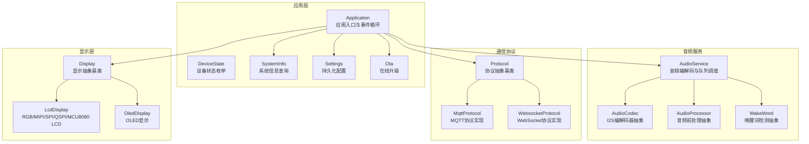
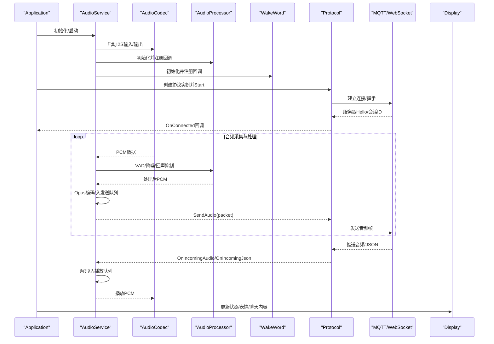
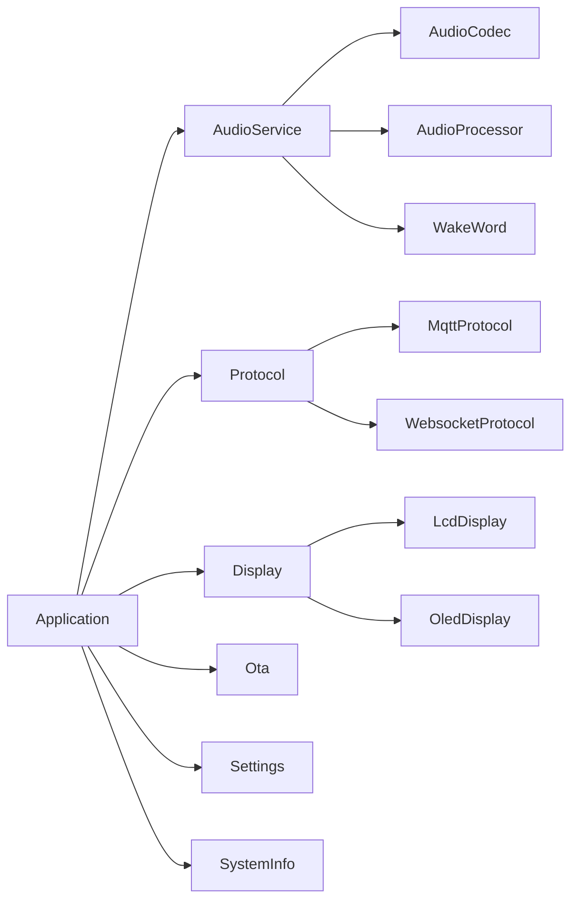

# API参考文档

<cite>
**本文档引用的文件**
- [main/application.h](file://main/application.h)
- [main/audio/audio_service.h](file://main/audio/audio_service.h)
- [main/audio/audio_codec.h](file://main/audio/audio_codec.h)
- [main/audio/audio_processor.h](file://main/audio/audio_processor.h)
- [main/audio/wake_word.h](file://main/audio/wake_word.h)
- [main/display/display.h](file://main/display/display.h)
- [main/display/lcd_display.h](file://main/display/lcd_display.h)
- [main/display/oled_display.h](file://main/display/oled_display.h)
- [main/protocols/protocol.h](file://main/protocols/protocol.h)
- [main/protocols/mqtt_protocol.h](file://main/protocols/mqtt_protocol.h)
- [main/protocols/websocket_protocol.h](file://main/protocols/websocket_protocol.h)
- [main/settings.h](file://main/settings.h)
- [main/device_state.h](file://main/device_state.h)
- [main/ota.h](file://main/ota.h)
- [main/system_info.h](file://main/system_info.h)
</cite>

## 目录
1. [简介](#简介)
2. [项目结构](#项目结构)
3. [核心组件](#核心组件)
4. [架构总览](#架构总览)
5. [详细组件分析](#详细组件分析)
6. [依赖关系分析](#依赖关系分析)
7. [性能考量](#性能考量)
8. [故障排查指南](#故障排查指南)
9. [结论](#结论)
10. [附录](#附录)

## 简介
本API参考文档面向小智ESP32智能语音助手项目，系统化梳理应用层、音频服务、硬件抽象、通信协议与显示接口的公共API，覆盖函数签名、参数说明、返回值、使用示例、参数校验、异常处理与线程安全要点，并提供版本兼容性与迁移建议。文档以模块化方式组织，便于开发者快速定位所需接口。

## 项目结构
项目采用分层与模块化组织：应用入口与主事件循环位于应用层；音频子系统包含编解码、前处理、唤醒词检测与队列调度；通信协议支持MQTT与WebSocket；显示层抽象了LCD/OLED等不同面板类型；设置、OTA与系统信息提供配置与运行时能力。

**图表来源**
- [main/application.h](file://main/application.h#L32-L88)
- [main/audio/audio_service.h](file://main/audio/audio_service.h#L81-L155)
- [main/audio/audio_codec.h](file://main/audio/audio_codec.h#L18-L57)
- [main/audio/audio_processor.h](file://main/audio/audio_processor.h#L10-L23)
- [main/audio/wake_word.h](file://main/audio/wake_word.h#L10-L23)
- [main/protocols/protocol.h](file://main/protocols/protocol.h#L44-L95)
- [main/protocols/mqtt_protocol.h](file://main/protocols/mqtt_protocol.h#L24-L57)
- [main/protocols/websocket_protocol.h](file://main/protocols/websocket_protocol.h#L13-L32)
- [main/display/display.h](file://main/display/display.h#L18-L66)
- [main/display/lcd_display.h](file://main/display/lcd_display.h#L26-L105)
- [main/display/oled_display.h](file://main/display/oled_display.h#L9-L35)

**章节来源**
- [main/application.h](file://main/application.h#L32-L88)
- [main/audio/audio_service.h](file://main/audio/audio_service.h#L81-L155)
- [main/protocols/protocol.h](file://main/protocols/protocol.h#L44-L95)
- [main/display/display.h](file://main/display/display.h#L18-L66)

## 核心组件
本节概述各模块的关键API与职责边界，便于快速查阅。

- 应用层(Application)
  - 单例模式提供全局控制入口，负责启动、事件循环、设备状态管理、唤醒词触发、错误告警、音视频通道控制、OTA检查与升级等。
  - 关键API：Start、MainEventLoop、SetDeviceState、Alert、DismissAlert、AbortSpeaking、ToggleChatState、StartListening、StopListening、Reboot、WakeWordInvoke、CanEnterSleepMode、SendMcpMessage、SetAecMode、GetAecMode、PlaySound、GetAudioService。
  - 参数校验：设备状态枚举范围校验；唤醒词字符串非空；声音资源路径存在性（由调用方保证）。
  - 异常处理：内部通过事件组与定时器协调，错误通过回调或状态上报；未捕获异常将导致设备进入致命错误态。
  - 线程安全：内部使用互斥锁保护任务队列与状态；对外API需在主线程调用以避免竞态。

- 音频服务(AudioService)
  - 负责麦克风采集、音频前处理、唤醒词检测、Opus编解码、发送/播放队列调度、AEC开关、测试模式等。
  - 关键API：Initialize、Start、Stop、EnableWakeWordDetection、EnableVoiceProcessing、EnableAudioTesting、EnableDeviceAec、SetCallbacks、PushPacketToDecodeQueue、PopPacketFromSendQueue、PlaySound、ReadAudioData、ResetDecoder、IsVoiceDetected、IsIdle、IsWakeWordRunning、IsAudioProcessorRunning。
  - 参数校验：采样率、帧时长、PCM数据长度；队列满时阻塞或超时策略由调用方选择。
  - 异常处理：编解码失败、队列溢出、音频输入/输出超时会触发错误回调或状态切换。
  - 线程安全：多任务模型，内部使用条件变量与互斥量保护队列；回调在音频任务上下文执行。

- 通信协议(Protocol/Mqtt/WebSocket)
  - 抽象协议定义统一的音频/文本通道、会话管理、错误处理与回调注册；具体实现支持MQTT与WebSocket。
  - 关键API：Start、OpenAudioChannel、CloseAudioChannel、IsAudioChannelOpened、SendAudio、SendWakeWordDetected、SendStartListening、SendStopListening、SendAbortSpeaking、SendMcpMessage。
  - 参数校验：消息类型、负载大小、会话ID有效性；二进制协议字段对齐与版本兼容。
  - 异常处理：网络断开、超时、服务器握手失败；实现中包含重连与AES解密流程。
  - 线程安全：回调在协议任务中触发，调用方需注意跨线程访问共享资源。

- 显示层(Display/LcdDisplay/OledDisplay)
  - 抽象显示接口提供状态栏、聊天内容、表情、图标、预览图、主题切换与省电模式；具体实现适配多种LCD/OLED面板。
  - 关键API：SetStatus、ShowNotification、SetEmotion、SetChatMessage、SetIcon、SetPreviewImage、SetTheme、UpdateStatusBar、SetPowerSaveMode、GetTheme。
  - 参数校验：主题名称存在性；通知时长与字符编码；图像格式与尺寸。
  - 异常处理：显示初始化失败、刷新超时；提供无显示实现用于无屏设备。
  - 线程安全：提供显示锁保护UI更新，避免并发绘制。

- 设置(Settings)与系统信息(SystemInfo)/OTA
  - Settings：键值存储读写，支持字符串、整型、布尔；提供命名空间隔离与批量擦除。
  - SystemInfo：查询芯片型号、MAC地址、堆内存、任务CPU使用情况与列表。
  - OTA：版本检查、激活、升级、标记当前版本有效、URL生成与解析版本号。

**章节来源**
- [main/application.h](file://main/application.h#L32-L88)
- [main/audio/audio_service.h](file://main/audio/audio_service.h#L81-L155)
- [main/protocols/protocol.h](file://main/protocols/protocol.h#L44-L95)
- [main/display/display.h](file://main/display/display.h#L18-L66)
- [main/settings.h](file://main/settings.h#L7-L26)
- [main/system_info.h](file://main/system_info.h#L9-L19)
- [main/ota.h](file://main/ota.h#L10-L55)

## 架构总览
下图展示从应用层到音频、协议与显示的交互关系，以及音频数据流与控制流。

**图表来源**
- [main/application.h](file://main/application.h#L42-L61)
- [main/audio/audio_service.h](file://main/audio/audio_service.h#L86-L109)
- [main/audio/audio_codec.h](file://main/audio/audio_codec.h#L19-L57)
- [main/audio/audio_processor.h](file://main/audio/audio_processor.h#L10-L23)
- [main/audio/wake_word.h](file://main/audio/wake_word.h#L10-L23)
- [main/protocols/protocol.h](file://main/protocols/protocol.h#L58-L94)
- [main/protocols/mqtt_protocol.h](file://main/protocols/mqtt_protocol.h#L24-L57)
- [main/protocols/websocket_protocol.h](file://main/protocols/websocket_protocol.h#L13-L32)
- [main/display/display.h](file://main/display/display.h#L23-L33)

## 详细组件分析

### 应用程序接口(Application)
- 单例与生命周期
  - GetInstance：返回全局单例引用，禁止拷贝。
  - Start：初始化协议、音频、显示、OTA等子系统并启动主事件循环。
  - MainEventLoop：事件驱动主循环，处理唤醒词检测、VAD变化、错误、版本检查等事件。
- 设备状态与监听模式
  - SetDeviceState/GetDeviceState：设置与查询设备状态，状态枚举见DeviceState。
  - SetListeningMode/GetListeningMode：设置监听模式（自动停止、手动停止、实时需要AEC）。
  - AEC模式：SetAecMode/GetAecMode，支持关闭、设备侧、服务端三种模式。
- 音频与告警
  - StartListening/StopListening：开启/关闭音频采集与发送。
  - AbortSpeaking：中断正在播报，支持原因枚举AbortReason。
  - Alert/DismissAlert：显示告警状态与消息，支持情感与提示音。
  - PlaySound：播放本地提示音。
- 其他控制
  - WakeWordInvoke：模拟唤醒词触发。
  - CanEnterSleepMode：判断是否允许进入睡眠。
  - SendMcpMessage：发送MCP消息。
  - Reboot：重启设备。
  - Schedule：将回调加入主任务队列异步执行。
- 线程安全
  - 内部使用互斥锁与任务队列；回调在主任务上下文执行，避免竞态。
- 使用示例
  - 启动应用并进入空闲态：调用Start后等待设备状态变为Idle。
  - 触发一次唤醒词播报：调用WakeWordInvoke并播放提示音。
  - 中断播报：调用AbortSpeaking并传入原因。

**章节来源**
- [main/application.h](file://main/application.h#L32-L88)
- [main/device_state.h](file://main/device_state.h#L4-L16)
- [main/protocols/protocol.h](file://main/protocols/protocol.h#L33-L42)

### 音频服务接口(AudioService)
- 数据流与队列
  - 输入路径：麦克风PCM -> 前处理/唤醒词 -> 编码队列 -> Opus编码 -> 发送队列 -> 协议发送。
  - 输出路径：服务器音频 -> 解码队列 -> Opus解码 -> 播放队列 -> 扬声器。
  - 关键队列：解码队列、发送队列、测试队列、编码任务队列、播放任务队列。
- 关键API
  - Initialize(codec)：绑定硬件编解码器并初始化。
  - Start/Stop：启动/停止音频任务与编解码器。
  - EnableWakeWordDetection/EnableVoiceProcessing/EnableAudioTesting/EnableDeviceAec：功能开关。
  - SetCallbacks：注册发送可用、唤醒词检测、VAD变化、测试队列满回调。
  - PushPacketToDecodeQueue/PopPacketFromSendQueue：队列操作，支持阻塞等待。
  - PlaySound/ReadAudioData：播放提示音与读取音频数据。
  - ResetDecoder：重置解码器状态。
  - IsVoiceDetected/IsIdle/IsWakeWordRunning/IsAudioProcessorRunning：状态查询。
- 参数校验与异常
  - 队列容量限制与超时策略；编解码失败与音频输入/输出超时触发错误回调。
- 线程安全
  - 多任务模型，条件变量与互斥量保护队列；回调在音频任务上下文触发。
- 使用示例
  - 开启唤醒词检测并注册回调：EnableWakeWordDetection(true)，注册on_wake_word_detected。
  - 发送一段音频：ReadAudioData(pcm, sample_rate, samples)后PushPacketToDecodeQueue。

**章节来源**
- [main/audio/audio_service.h](file://main/audio/audio_service.h#L26-L155)

### 硬件抽象接口(AudioCodec/AudioProcessor/WakeWord)
- AudioCodec
  - 功能：I2S输入/输出、音量控制、双工/参考输入配置。
  - 关键API：SetOutputVolume、EnableInput/EnableOutput、OutputData/InputData、Start、属性查询。
  - 参数校验：采样率与通道数需匹配硬件配置；音量范围应在设备支持范围内。
- AudioProcessor
  - 功能：VAD检测、降噪、回声抑制等前处理；与AudioCodec配合工作。
  - 关键API：Initialize、Feed、Start/Stop、IsRunning、OnOutput/OnVadStateChange、GetFeedSize、EnableDeviceAec。
- WakeWord
  - 功能：唤醒词检测与编码，支持获取最近一次检测结果。
  - 关键API：Initialize、Feed、OnWakeWordDetected、Start/Stop、GetFeedSize、EncodeWakeWordData、GetWakeWordOpus、GetLastDetectedWakeWord。
- 线程安全
  - AudioCodec为底层驱动封装，调用方需遵循I2S时序；前处理与唤醒词在音频任务中运行。
- 使用示例
  - 初始化并启用输入：Initialize(codec)后EnableInput(true)。
  - 注册VAD回调：OnVadStateChange({...})。

**章节来源**
- [main/audio/audio_codec.h](file://main/audio/audio_codec.h#L18-L57)
- [main/audio/audio_processor.h](file://main/audio/audio_processor.h#L10-L23)
- [main/audio/wake_word.h](file://main/audio/wake_word.h#L10-L23)

### 通信协议接口(Protocol/Mqtt/WebSocket)
- Protocol抽象
  - 定义统一的音频/文本通道、会话管理、错误处理与回调注册。
  - 关键API：Start/OpenAudioChannel/CloseAudioChannel/IsAudioChannelOpened、SendAudio/SendWakeWordDetected/SendStartListening/SendStopListening/SendAbortSpeaking/SendMcpMessage。
  - 二进制协议结构：BinaryProtocol2/3，包含版本、类型、时间戳、负载大小与负载。
- MqttProtocol
  - 实现基于MQTT的音频通道，支持UDP直连与AES加密。
  - 关键API：Start、OpenAudioChannel、CloseAudioChannel、IsAudioChannelOpened、SendAudio。
  - 重连与心跳：Ping间隔与重连间隔配置。
- WebsocketProtocol
  - 实现基于WebSocket的音频通道。
  - 关键API：Start、OpenAudioChannel、CloseAudioChannel、IsAudioChannelOpened、SendAudio。
- 线程安全
  - 回调在协议任务中触发，调用方需注意跨线程访问共享资源。
- 使用示例
  - 选择MQTT协议：创建MqttProtocol实例并Start，打开音频通道后发送音频包。

**章节来源**
- [main/protocols/protocol.h](file://main/protocols/protocol.h#L10-L95)
- [main/protocols/mqtt_protocol.h](file://main/protocols/mqtt_protocol.h#L24-L57)
- [main/protocols/websocket_protocol.h](file://main/protocols/websocket_protocol.h#L13-L32)

### 显示接口(Display/LcdDisplay/OledDisplay)
- Display抽象
  - 提供状态栏、通知、表情、图标、聊天内容、预览图、主题与省电模式管理。
  - 关键API：SetStatus、ShowNotification、SetEmotion、SetChatMessage、SetIcon、SetPreviewImage、SetTheme、UpdateStatusBar、SetPowerSaveMode、GetTheme。
  - 锁机制：DisplayLockGuard用于保护UI更新。
- LcdDisplay族
  - 支持RGB、MIPI、SPI、QSPI、MCU8080接口LCD；提供主题颜色结构与UI布局。
  - 关键API：SetEmotion/SetIcon/SetPreviewImage/SetTheme等覆盖实现。
- OledDisplay
  - 支持128x64与128x32两种OLED尺寸；提供聊天内容显示。
- 线程安全
  - 通过显示锁避免并发绘制；更新频率受LVGL刷新策略影响。
- 使用示例
  - 设置主题并显示通知：SetTheme("default")后ShowNotification("连接成功", 3000)。

**章节来源**
- [main/display/display.h](file://main/display/display.h#L18-L91)
- [main/display/lcd_display.h](file://main/display/lcd_display.h#L26-L105)
- [main/display/oled_display.h](file://main/display/oled_display.h#L9-L35)

### 设置与系统信息/OTA接口
- Settings
  - 键值存储：GetString/SetString、GetInt/SetInt、GetBool/SetBool。
  - 管理：EraseKey/EraseAll，命名空间隔离。
- SystemInfo
  - 查询：GetFlashSize、GetMinimumFreeHeapSize、GetFreeHeapSize、GetMacAddress、GetChipModelName。
  - 调试：PrintTaskCpuUsage、PrintTaskList、PrintHeapStats。
- OTA
  - 版本：CheckVersion、HasNewVersion、GetFirmwareVersion、GetCurrentVersion。
  - 激活：HasActivationChallenge/HasActivationCode/HasServerTime、Activate。
  - 升级：StartUpgrade(带进度回调)、MarkCurrentVersionValid。
  - URL：GetCheckVersionUrl。
- 线程安全
  - Settings基于NVS，调用方需避免在中断中频繁写入；OTA升级过程需独占网络与存储。
- 使用示例
  - 读取配置：GetString("ssid", "")；写入配置：SetString("ssid", "your_wifi")。

**章节来源**
- [main/settings.h](file://main/settings.h#L7-L26)
- [main/system_info.h](file://main/system_info.h#L9-L19)
- [main/ota.h](file://main/ota.h#L10-L55)

## 依赖关系分析
- 组件耦合
  - Application依赖AudioService、Protocol、Display、Ota、Settings、SystemInfo。
  - AudioService依赖AudioCodec、AudioProcessor、WakeWord与Protocol。
  - Protocol派生类(Mqtt/WebSocket)依赖底层网络栈与加密库。
  - Display抽象与具体实现之间为继承关系，通过工厂或板级配置选择。
- 外部依赖
  - FreeRTOS、ESP-IDF、LVGL、Opus、MQTT、WebSocket、mbedTLS等。
- 循环依赖
  - 未发现直接循环依赖；回调链路避免反向耦合。

**图表来源**
- [main/application.h](file://main/application.h#L69-L76)
- [main/audio/audio_service.h](file://main/audio/audio_service.h#L111-L118)
- [main/protocols/protocol.h](file://main/protocols/protocol.h#L44-L95)
- [main/display/display.h](file://main/display/display.h#L18-L66)

**章节来源**
- [main/application.h](file://main/application.h#L69-L76)
- [main/audio/audio_service.h](file://main/audio/audio_service.h#L111-L118)
- [main/protocols/protocol.h](file://main/protocols/protocol.h#L44-L95)
- [main/display/display.h](file://main/display/display.h#L18-L66)

## 性能考量
- 音频队列容量与帧时长
  - OPUS帧时长固定，队列容量根据最大并发包数计算；过小导致丢包，过大增加延迟。
- 任务优先级与调度
  - 音频输入/输出与编解码任务应保持高优先级，避免UI卡顿。
- 显示刷新
  - LVGL刷新频率与背光控制结合，避免高频刷新造成功耗过高。
- 网络稳定性
  - MQTT/WS重连与心跳配置需平衡连接稳定与资源消耗。
- 存储与OTA
  - 升级过程中避免频繁写入NVS与日志，确保分区对齐与校验。

## 故障排查指南
- 音频无声/杂音
  - 检查AudioCodec启停顺序与采样率配置；确认EnableInput/EnableOutput已开启。
  - 查看AudioService调试统计与队列状态。
- 唤醒词不灵敏
  - 调整麦克风增益与前处理参数；确认WakeWord初始化与Start调用。
- 网络断连/超时
  - 检查协议握手与会话ID；查看重连定时器与AES解密流程。
- 显示异常
  - 确认DisplayLockGuard使用；检查面板驱动初始化与背光控制。
- OTA失败
  - 校验固件URL与版本号；查看升级回调进度与错误码。

**章节来源**
- [main/audio/audio_service.h](file://main/audio/audio_service.h#L149-L155)
- [main/protocols/mqtt_protocol.h](file://main/protocols/mqtt_protocol.h#L49-L57)
- [main/display/display.h](file://main/display/display.h#L69-L82)
- [main/ota.h](file://main/ota.h#L49-L55)

## 结论
本API参考文档系统化梳理了小智ESP32智能语音助手的核心模块与接口，明确了参数校验、异常处理与线程安全要求，并提供了使用示例与故障排查建议。建议在实际集成中严格遵循接口契约与线程模型，确保系统稳定性与可维护性。

## 附录
- 版本兼容性与迁移指南
  - 协议版本：BinaryProtocol2/3版本号变更需同步客户端与服务端；迁移时保留向后兼容字段。
  - 音频参数：采样率与帧时长调整需同步修改队列容量与编解码参数。
  - 显示主题：新增主题需提供默认颜色映射，避免运行时崩溃。
  - OTA流程：升级回调签名变更时需更新调用方逻辑。
- 最佳实践
  - 使用回调注册而非硬编码，降低模块间耦合。
  - 对外部依赖进行超时与重试封装，提升鲁棒性。
  - 在主线程集中处理UI与状态机，避免跨线程竞态。