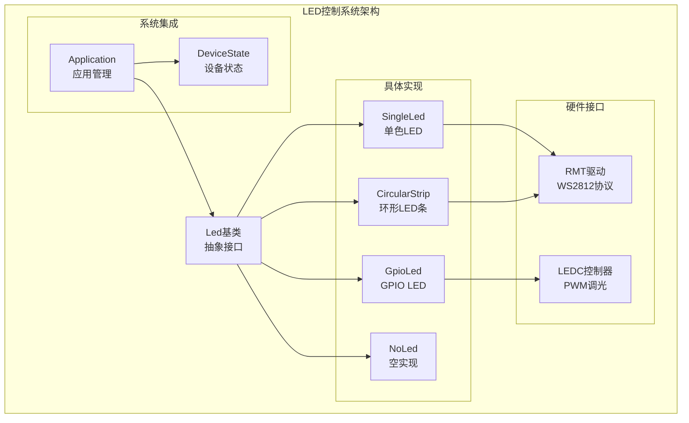
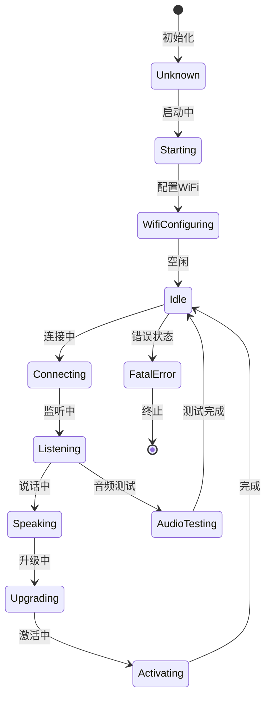
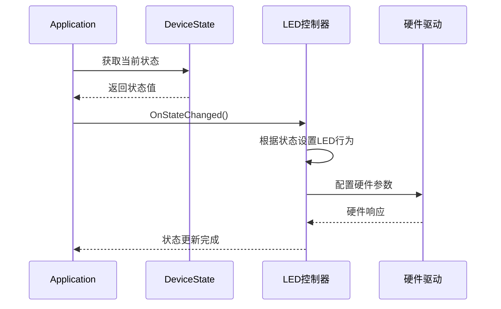
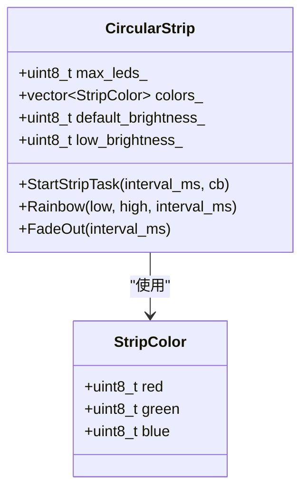
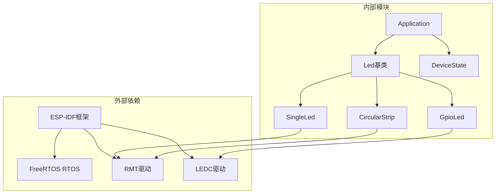

# LED控制API

<cite>
**本文档引用的文件**
- [main/led/led.h](file://main/led/led.h)
- [main/led/single_led.h](file://main/led/single_led.h)
- [main/led/single_led.cc](file://main/led/single_led.cc)
- [main/led/gpio_led.h](file://main/led/gpio_led.h)
- [main/led/gpio_led.cc](file://main/led/gpio_led.cc)
- [main/led/circular_strip.h](file://main/led/circular_strip.h)
- [main/led/circular_strip.cc](file://main/led/circular_strip.cc)
- [main/device_state.h](file://main/device_state.h)
- [main/application.h](file://main/application.h)
- [main/boards/esp-s3-lcd-ev-board/esp-s3-lcd-ev-board.cc](file://main/boards/esp-s3-lcd-ev-board/esp-s3-lcd-ev-board.cc)
- [main/boards/esp-s3-lcd-ev-board-2/esp-s3-lcd-ev-board-2.cc](file://main/boards/esp-s3-lcd-ev-board-2/esp-s3-lcd-ev-board-2.cc)
</cite>

## 目录
1. [简介](#简介)
2. [项目结构](#项目结构)
3. [核心组件](#核心组件)
4. [架构概览](#架构概览)
5. [详细组件分析](#详细组件分析)
6. [依赖关系分析](#依赖关系分析)
7. [性能考虑](#性能考虑)
8. [故障排除指南](#故障排除指南)
9. [结论](#结论)
10. [附录](#附录)

## 简介

本文件为ESP32 LED控制系统的技术文档，详细描述了LED接口及其多种实现方式的完整API规范。该系统支持单色LED、GPIO LED和环形LED条等多种硬件配置，通过统一的Led抽象接口实现设备状态驱动的LED控制。

系统基于ESP-IDF框架开发，采用RMT（Remote Control Transceiver）模块进行WS2812 LED驱动，支持PWM调光和多种动画效果。所有LED控制操作均通过设备状态事件自动触发，确保LED状态与系统运行状态保持同步。

## 项目结构

LED控制系统位于main/led目录下，采用面向对象的设计模式，通过继承机制实现不同类型的LED控制器：



**图表来源**
- [main/led/led.h](file://main/led/led.h#L4-L15)
- [main/led/single_led.h](file://main/led/single_led.h#L11-L36)
- [main/led/gpio_led.h](file://main/led/gpio_led.h#L13-L45)
- [main/led/circular_strip.h](file://main/led/circular_strip.h#L19-L49)

**章节来源**
- [main/led/led.h](file://main/led/led.h#L1-L18)
- [main/led/single_led.h](file://main/led/single_led.h#L1-L39)
- [main/led/gpio_led.h](file://main/led/gpio_led.h#L1-L48)
- [main/led/circular_strip.h](file://main/led/circular_strip.h#L1-L52)

## 核心组件

### Led抽象基类

Led类定义了LED控制的统一接口，所有具体的LED实现都必须实现以下虚函数：

- `virtual ~Led() = default;` - 虚析构函数
- `virtual void OnStateChanged() = 0;` - 设备状态变化时的回调函数

此外还提供了NoLed空实现类，用于无LED硬件配置的情况。

**章节来源**
- [main/led/led.h](file://main/led/led.h#L4-L15)

### 设备状态枚举

系统定义了完整的设备状态生命周期，LED控制器会根据不同的状态执行相应的视觉反馈：



**图表来源**
- [main/device_state.h](file://main/device_state.h#L4-L16)

**章节来源**
- [main/device_state.h](file://main/device_state.h#L1-L18)

## 架构概览

LED控制系统采用事件驱动架构，通过Application类管理设备状态变化，并自动触发LED控制器的状态更新：



**图表来源**
- [main/application.h](file://main/application.h#L44-L45)
- [main/led/single_led.cc](file://main/led/single_led.cc#L119-L163)
- [main/led/gpio_led.cc](file://main/led/gpio_led.cc#L202-L249)
- [main/led/circular_strip.cc](file://main/led/circular_strip.cc#L185-L233)

**章节来源**
- [main/application.h](file://main/application.h#L32-L88)

## 详细组件分析

### SingleLed - 单色LED控制器

SingleLed类实现了单个RGB LED的控制功能，基于RMT模块驱动WS2812 LED。

#### 公共接口

| 方法 | 参数 | 功能描述 |
|------|------|----------|
| `SingleLed(gpio_num_t gpio)` | gpio: GPIO引脚号 | 构造函数，初始化LED控制器 |
| `~SingleLed()` | 无 | 析构函数，释放资源 |
| `OnStateChanged()` | 无 | 设备状态变化回调 |
| `BlinkOnce()` | 无 | 单次闪烁 |
| `Blink(int times, int interval_ms)` | times: 闪烁次数, interval_ms: 间隔时间 | 指定次数闪烁 |
| `StartContinuousBlink(int interval_ms)` | interval_ms: 间隔时间 | 开始连续闪烁 |
| `TurnOn()` | 无 | 打开LED |
| `TurnOff()` | 无 | 关闭LED |
| `SetColor(uint8_t r, uint8_t g, uint8_t b)` | r,g,b: RGB颜色值 | 设置LED颜色 |

#### 技术规格

- **驱动芯片**: WS2812
- **通信协议**: RMT (Remote Control Transceiver)
- **PWM分辨率**: 10MHz时钟频率
- **颜色格式**: GRB（绿-红-蓝）
- **亮度范围**: 0-255
- **默认亮度**: 4 (低功耗模式)

#### 状态映射表

| 设备状态 | LED行为 | 颜色(R,G,B) | 闪烁模式 |
|----------|---------|-------------|----------|
| Starting | 连续闪烁 | (0,0,4) | 100ms周期 |
| WifiConfiguring | 连续闪烁 | (0,0,4) | 500ms周期 |
| Idle | 关闭 | (0,0,0) | 无 |
| Connecting | 常亮 | (0,0,4) | 无 |
| Listening/AudioTesting | 根据声音检测 | (0,0,2)或(0,0,16) | 调光效果 |
| Speaking | 常亮 | (0,4,0) | 无 |
| Upgrading | 连续闪烁 | (0,4,0) | 100ms周期 |
| Activating | 连续闪烁 | (0,4,0) | 500ms周期 |

**章节来源**
- [main/led/single_led.h](file://main/led/single_led.h#L11-L36)
- [main/led/single_led.cc](file://main/led/single_led.cc#L14-L164)

### GpioLed - GPIO LED控制器

GpioLed类实现了传统的GPIO控制LED，支持PWM调光功能。

#### 公共接口

| 方法 | 参数 | 功能描述 |
|------|------|----------|
| `GpioLed(gpio_num_t gpio)` | gpio: GPIO引脚号 | 基础构造函数 |
| `GpioLed(gpio_num_t gpio, int output_invert)` | gpio: GPIO引脚号, output_invert: 输出反转标志 | 带输出反转的构造函数 |
| `GpioLed(gpio_num_t gpio, int output_invert, ledc_timer_t timer_num, ledc_channel_t channel)` | 完整参数构造函数 | 自定义定时器和通道 |
| `~GpioLed()` | 无 | 析构函数 |
| `OnStateChanged()` | 无 | 设备状态变化回调 |
| `TurnOn()` | 无 | 打开LED |
| `TurnOff()` | 无 | 关闭LED |
| `SetBrightness(uint8_t brightness)` | brightness: 亮度百分比 | 设置LED亮度 |

#### 技术规格

- **调光方式**: LEDC (LED Controller)
- **PWM频率**: 4000Hz
- **PWM分辨率**: 13位 (8191最大占空比)
- **亮度范围**: 0-100%
- **默认亮度**: 50%

#### 配置参数

| 参数 | 值 | 描述 |
|------|----|------|
| LEDC频率 | 4000Hz | PWM信号频率 |
| LEDC分辨率 | 13位 | 8191最大占空比 |
| 默认亮度 | 50% | 标准工作亮度 |
| 高亮度 | 100% | 监听状态最高亮度 |
| 低亮度 | 10% | 监听状态最低亮度 |
| 空闲亮度 | 5% | 系统空闲时亮度 |
| 说话亮度 | 75% | 语音播放时亮度 |
| 升级亮度 | 25% | 固件升级时亮度 |
| 激活亮度 | 35% | 设备激活时亮度 |

**章节来源**
- [main/led/gpio_led.h](file://main/led/gpio_led.h#L13-L45)
- [main/led/gpio_led.cc](file://main/led/gpio_led.cc#L28-L250)

### CircularStrip - 环形LED条控制器

CircularStrip类实现了多LED环形条的控制，支持复杂的动画效果。

#### 公共接口

| 方法 | 参数 | 功能描述 |
|------|------|----------|
| `CircularStrip(gpio_num_t gpio, uint8_t max_leds)` | gpio: GPIO引脚号, max_leds: LED数量 | 构造函数 |
| `~CircularStrip()` | 无 | 析构函数 |
| `OnStateChanged()` | 无 | 设备状态变化回调 |
| `SetBrightness(uint8_t default_brightness, uint8_t low_brightness)` | default_brightness: 默认亮度, low_brightness: 低亮度 | 设置亮度参数 |
| `SetAllColor(StripColor color)` | color: 颜色结构体 | 设置所有LED颜色 |
| `SetSingleColor(uint8_t index, StripColor color)` | index: LED索引, color: 颜色 | 设置单个LED颜色 |
| `Blink(StripColor color, int interval_ms)` | color: 颜色, interval_ms: 间隔 | 闪烁动画 |
| `Breathe(StripColor low, StripColor high, int interval_ms)` | low/high: 颜色范围, interval_ms: 间隔 | 呼吸动画 |
| `Scroll(StripColor low, StripColor high, int length, int interval_ms)` | low/high: 颜色, length: 窗口长度, interval_ms: 间隔 | 滚动动画 |

#### 数据结构



**图表来源**
- [main/led/circular_strip.h](file://main/led/circular_strip.h#L15-L49)

#### 动画效果

| 动画类型 | 实现原理 | 参数说明 |
|----------|----------|----------|
| Blink | 通过定时器切换LED状态 | color: 目标颜色, interval_ms: 切换间隔 |
| Breathe | 渐变色彩循环 | low/high: 最小/最大颜色, interval_ms: 变化间隔 |
| Scroll | 彩色窗口移动 | low/high: 背景/前景颜色, length: 窗口大小 |
| FadeOut | 渐隐效果 | 逐步降低RGB分量 |

**章节来源**
- [main/led/circular_strip.h](file://main/led/circular_strip.h#L19-L49)
- [main/led/circular_strip.cc](file://main/led/circular_strip.cc#L9-L234)

### NoLed - 空LED实现

NoLed类提供了空实现，用于没有物理LED硬件的场景。该类继承自Led基类，但不执行任何实际的LED操作。

**章节来源**
- [main/led/led.h](file://main/led/led.h#L12-L15)

## 依赖关系分析

LED控制系统与其他模块的依赖关系如下：



**图表来源**
- [main/led/single_led.cc](file://main/led/single_led.cc#L1-L10)
- [main/led/gpio_led.cc](file://main/led/gpio_led.cc#L1-L10)
- [main/led/circular_strip.cc](file://main/led/circular_strip.cc#L1-L10)

**章节来源**
- [main/led/single_led.cc](file://main/led/single_led.cc#L1-L10)
- [main/led/gpio_led.cc](file://main/led/gpio_led.cc#L1-L10)
- [main/led/circular_strip.cc](file://main/led/circular_strip.cc#L1-L10)

## 性能考虑

### 内存管理

- 所有LED控制器使用RAII原则管理内存资源
- 使用智能指针和RAII确保资源正确释放
- Mutex保护避免并发访问冲突

### 实时性保证

- 使用FreeRTOS任务和定时器确保LED操作的实时性
- RMT和LEDC硬件加速减少CPU负载
- 定时器回调在IRAM中执行保证响应速度

### 功耗优化

- 提供低亮度模式适应不同使用场景
- 空闲状态下自动降低LED亮度
- 支持完全关闭LED以节省电量

## 故障排除指南

### 常见问题及解决方案

| 问题类型 | 症状 | 可能原因 | 解决方案 |
|----------|------|----------|----------|
| LED不亮 | 所有LED完全不亮 | GPIO配置错误 | 检查GPIO引脚连接和配置 |
| 闪烁异常 | LED闪烁频率不正确 | 定时器配置问题 | 验证定时器参数设置 |
| 颜色错误 | 显示颜色与预期不符 | 颜色格式问题 | 检查GRB/RGB格式配置 |
| 功耗过高 | 设备发热严重 | 亮度设置过高 | 调整亮度参数 |

### 调试信息

系统在调试模式下会输出详细的LED控制日志，包括状态转换和错误信息。

**章节来源**
- [main/led/single_led.cc](file://main/led/single_led.cc#L160-L161)
- [main/led/gpio_led.cc](file://main/led/gpio_led.cc#L246-L247)
- [main/led/circular_strip.cc](file://main/led/circular_strip.cc#L230-L231)

## 结论

LED控制系统提供了完整的LED控制解决方案，具有以下特点：

1. **模块化设计**: 通过抽象基类和具体实现分离，支持多种LED硬件配置
2. **事件驱动**: 与应用状态紧密集成，自动响应系统状态变化
3. **性能优化**: 利用硬件加速和实时调度保证LED控制的响应性
4. **易于扩展**: 支持新的LED类型和动画效果的添加

该系统适用于各种ESP32设备的LED指示需求，从简单的单色LED到复杂的环形LED条都能提供完善的控制能力。

## 附录

### 使用示例

#### 基础LED控制

```cpp
// 创建单色LED控制器
SingleLed single_led(GPIO_NUM_2);

// 设置颜色并打开LED
single_led.SetColor(255, 0, 0);  // 红色
single_led.TurnOn();

// 开始闪烁
single_led.StartContinuousBlink(500);
```

#### 环形LED条控制

```cpp
// 创建环形LED条（12个LED）
CircularStrip strip(GPIO_NUM_18, 12);

// 设置亮度
strip.SetBrightness(64, 8);

// 创建彩虹效果
strip.Rainbow({0,0,0}, {255,255,255}, 100);
```

#### 状态集成

```cpp
// 在应用启动时初始化LED
Application& app = Application::GetInstance();
Led* led = board->GetLed();  // 从板配置获取LED实例

// 应用状态变化时自动更新LED
app.SetDeviceState(kDeviceStateListening);
// LED自动切换到监听状态的视觉效果
```

### 配置参数参考

| 参数名称 | 类型 | 默认值 | 说明 |
|----------|------|--------|------|
| DEFAULT_BRIGHTNESS | uint8_t | 4 | 单色LED默认亮度 |
| HIGH_BRIGHTNESS | uint8_t | 16 | 单色LED高亮度 |
| LOW_BRIGHTNESS | uint8_t | 2 | 单色LED低亮度 |
| LEDC_FREQ_HZ | uint32_t | 4000 | LEDC PWM频率 |
| LEDC_DUTY | uint32_t | 8191 | LEDC最大占空比 |
| RMT_RESOLUTION | uint32_t | 10000000 | RMT时钟频率 |

**章节来源**
- [main/boards/esp-s3-lcd-ev-board/esp-s3-lcd-ev-board.cc](file://main/boards/esp-s3-lcd-ev-board/esp-s3-lcd-ev-board.cc#L208-L212)
- [main/boards/esp-s3-lcd-ev-board-2/esp-s3-lcd-ev-board-2.cc](file://main/boards/esp-s3-lcd-ev-board-2/esp-s3-lcd-ev-board-2.cc#L239-L243)