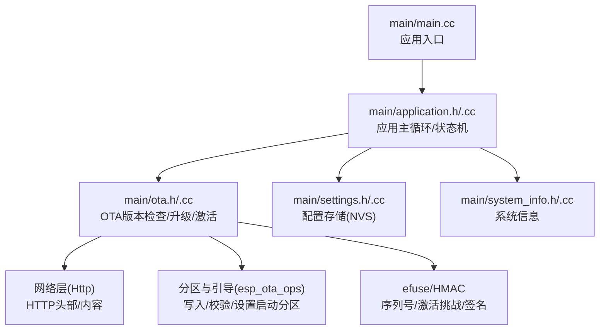
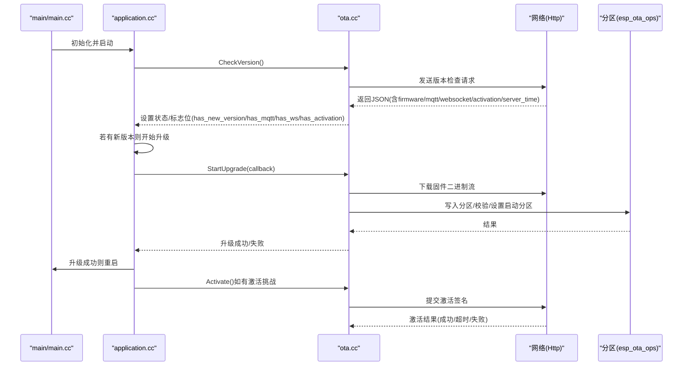
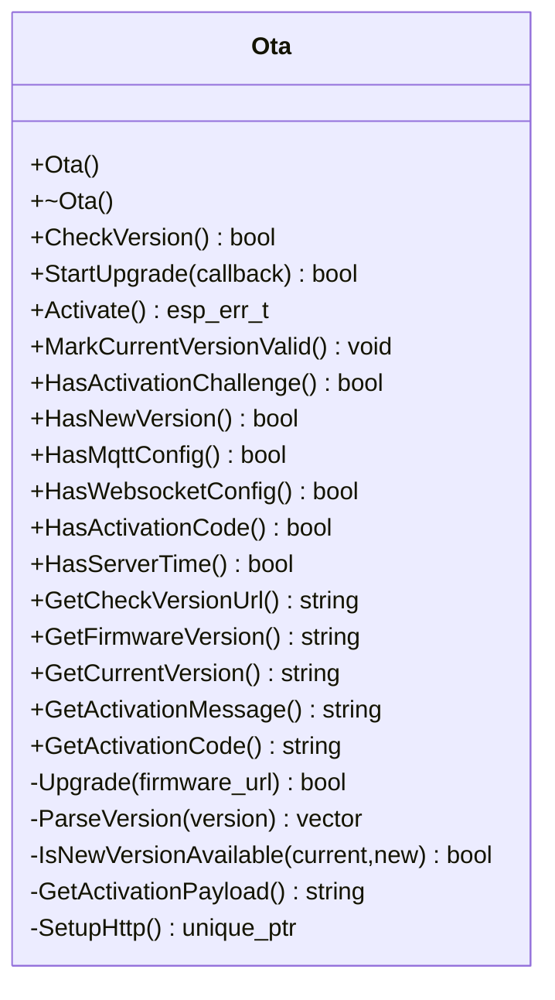
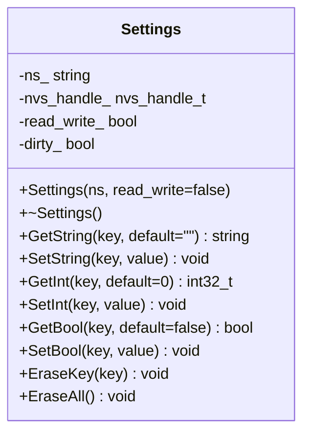
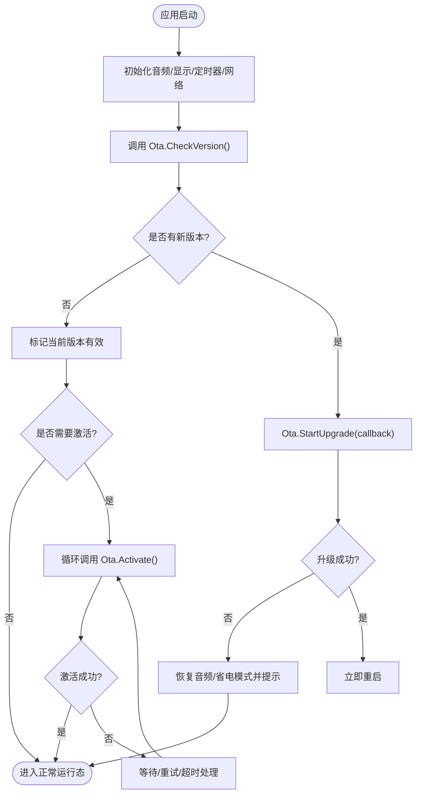
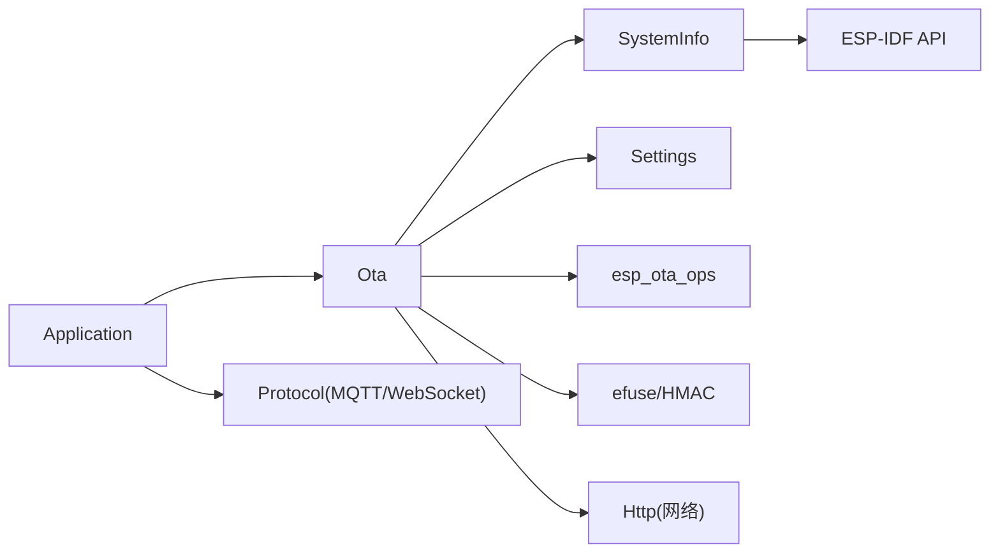

# OTA系统API

<cite>
**本文引用的文件**
- [main/ota.h](file://main/ota.h)
- [main/ota.cc](file://main/ota.cc)
- [main/settings.h](file://main/settings.h)
- [main/settings.cc](file://main/settings.cc)
- [main/application.h](file://main/application.h)
- [main/application.cc](file://main/application.cc)
- [main/main.cc](file://main/main.cc)
- [main/system_info.h](file://main/system_info.h)
- [main/system_info.cc](file://main/system_info.cc)
- [docs/mcp-protocol.md](file://docs/mcp-protocol.md)
</cite>

## 目录
1. [简介](#简介)
2. [项目结构](#项目结构)
3. [核心组件](#核心组件)
4. [架构总览](#架构总览)
5. [详细组件分析](#详细组件分析)
6. [依赖关系分析](#依赖关系分析)
7. [性能考虑](#性能考虑)
8. [故障排除指南](#故障排除指南)
9. [结论](#结论)
10. [附录](#附录)

## 简介
本文件为OTA固件更新系统的完整API文档，覆盖版本检查、固件下载、安装激活、状态查询等核心功能；说明设置管理、配置存储、更新策略；包含OTA协议参数、安全验证机制、错误恢复策略；并提供OTA更新的完整使用流程与故障排除指南。

## 项目结构
- OTA核心位于 main/ota.h/.cc，负责版本检查、下载升级、激活流程与HTTP交互。
- 设置管理位于 main/settings.h/.cc，基于NVS提供键值持久化读写。
- 应用入口与主循环位于 main/main.cc，应用启动后初始化网络、显示、音频服务，并驱动OTA检查与协议初始化。
- 应用逻辑位于 main/application.h/.cc，协调设备状态、OTA流程、协议选择与激活等待。
- 系统信息位于 main/system_info.h/.cc，提供MAC地址、芯片型号、内存统计等辅助能力。

**图表来源**
- [main/main.cc](file://main/main.cc#L13-L31)
- [main/application.cc](file://main/application.cc#L328-L380)
- [main/ota.cc](file://main/ota.cc#L52-L71)
- [main/settings.cc](file://main/settings.cc#L8-L19)
- [main/system_info.cc](file://main/system_info.cc#L34-L44)

**章节来源**
- [main/main.cc](file://main/main.cc#L13-L31)
- [main/application.h](file://main/application.h#L32-L91)
- [main/application.cc](file://main/application.cc#L328-L380)
- [main/ota.h](file://main/ota.h#L10-L55)
- [main/ota.cc](file://main/ota.cc#L52-L71)
- [main/settings.h](file://main/settings.h#L7-L26)
- [main/settings.cc](file://main/settings.cc#L8-L19)
- [main/system_info.h](file://main/system_info.h#L9-L19)
- [main/system_info.cc](file://main/system_info.cc#L34-L44)

## 核心组件
- Ota类：提供版本检查、固件下载、安装激活、状态查询、版本比较、激活挑战签名等能力。
- Settings类：提供键值读写、整型/布尔/字符串存取、命名空间隔离、提交与擦除。
- Application类：应用生命周期管理、设备状态机、OTA检查任务、协议选择与激活等待。
- SystemInfo类：系统信息查询，如MAC地址、芯片型号、堆内存统计等。

**章节来源**
- [main/ota.h](file://main/ota.h#L10-L55)
- [main/ota.cc](file://main/ota.cc#L25-L41)
- [main/settings.h](file://main/settings.h#L7-L26)
- [main/settings.cc](file://main/settings.cc#L8-L19)
- [main/application.h](file://main/application.h#L32-L91)
- [main/system_info.h](file://main/system_info.h#L9-L19)

## 架构总览
OTA系统采用“应用主循环+OTA子系统+设置存储+系统信息”的分层设计。应用启动后先进行网络准备与显示初始化，随后触发OTA版本检查；根据返回的配置决定MQTT或WebSocket协议；若存在新版本则进入升级流程；升级完成后重启生效；若存在激活挑战，则在激活成功后再进入正常运行态。

**图表来源**
- [main/main.cc](file://main/main.cc#L27-L31)
- [main/application.cc](file://main/application.cc#L70-L176)
- [main/ota.cc](file://main/ota.cc#L76-L243)
- [main/ota.cc](file://main/ota.cc#L265-L373)
- [main/ota.cc](file://main/ota.cc#L444-L478)

## 详细组件分析

### Ota类API详解
- 构造与析构
  - Ota()：从efuse读取序列号（若存在），初始化激活相关字段。
  - ~Ota()：析构。
- 版本检查
  - CheckVersion()：向配置的OTA地址发起请求，解析JSON响应，提取firmware、activation、mqtt、websocket、server_time等字段；比较当前版本与新版本，支持强制升级标记；设置has_new_version_、has_mqtt_config_、has_websocket_config_、has_server_time_等标志位。
- 固件下载与安装
  - StartUpgrade(callback)：启动升级流程，回调进度百分比与速度；内部委托Upgrade(firmware_url)完成下载与写入。
  - Upgrade(firmware_url)：打开HTTP GET，按块读取数据，边读边写入OTA分区；在读取到足够头部后校验新固件版本与当前版本差异；写入完成后结束并设置启动分区。
  - MarkCurrentVersionValid()：若当前运行分区处于待验证状态，则标记为有效，取消回滚。
- 激活流程
  - HasActivationChallenge()/HasActivationCode()/HasMqttConfig()/HasWebsocketConfig()/HasServerTime()：查询各类配置标志。
  - GetCheckVersionUrl()：读取设置中的OTA地址，若为空则使用编译期默认值。
  - GetActivationPayload()：当具备序列号时，基于HMAC-SHA256对激活挑战进行签名，生成JSON负载。
  - Activate()：向/check或/activate路径发起激活请求，处理200/202/其他状态码，返回成功/超时/失败。
- 查询与版本信息
  - GetFirmwareVersion()/GetCurrentVersion()/GetActivationMessage()/GetActivationCode()：返回对应字符串。
- 私有工具
  - ParseVersion()/IsNewVersionAvailable()：语义化版本比较。
  - SetupHttp()：设置HTTP头部（设备标识、语言、内容类型等）。

**图表来源**
- [main/ota.h](file://main/ota.h#L10-L55)
- [main/ota.cc](file://main/ota.cc#L25-L41)
- [main/ota.cc](file://main/ota.cc#L76-L243)
- [main/ota.cc](file://main/ota.cc#L265-L373)
- [main/ota.cc](file://main/ota.cc#L407-L442)
- [main/ota.cc](file://main/ota.cc#L444-L478)

**章节来源**
- [main/ota.h](file://main/ota.h#L10-L55)
- [main/ota.cc](file://main/ota.cc#L25-L41)
- [main/ota.cc](file://main/ota.cc#L76-L243)
- [main/ota.cc](file://main/ota.cc#L265-L373)
- [main/ota.cc](file://main/ota.cc#L407-L442)
- [main/ota.cc](file://main/ota.cc#L444-L478)

### Settings类API详解
- 构造与析构
  - Settings(ns, read_write=false)：打开指定命名空间，只读或读写模式。
  - ~Settings()：关闭句柄并提交变更（若脏）。
- 读写接口
  - GetString(key, default)/SetString(key, value)
  - GetInt(key, default)/SetInt(key, value)
  - GetBool(key, default)/SetBool(key, value)
  - EraseKey(key)/EraseAll()

**图表来源**
- [main/settings.h](file://main/settings.h#L7-L26)
- [main/settings.cc](file://main/settings.cc#L8-L19)

**章节来源**
- [main/settings.h](file://main/settings.h#L7-L26)
- [main/settings.cc](file://main/settings.cc#L8-L19)

### Application类与OTA流程
- 启动阶段
  - Start()：初始化音频、显示、定时器；启动网络；调用CheckNewVersion(ota)。
- 版本检查与升级
  - CheckNewVersion(ota)：循环重试检查版本，显示状态；若新版本可用则进入升级流程，暂停音频与省电模式，回调显示进度；升级失败则恢复音频与省电模式并提示；升级成功则立即重启。
- 激活等待
  - 若存在激活挑战或激活码，显示激活提示并循环调用Activate()，处理超时与失败重试，直至成功或用户中断。
- 协议选择
  - 根据CheckVersion返回的配置，优先选择MQTT或WebSocket协议，否则回退到MQTT。

**图表来源**
- [main/application.cc](file://main/application.cc#L328-L380)
- [main/application.cc](file://main/application.cc#L70-L176)
- [main/ota.cc](file://main/ota.cc#L245-L263)
- [main/ota.cc](file://main/ota.cc#L375-L378)
- [main/ota.cc](file://main/ota.cc#L444-L478)

**章节来源**
- [main/application.h](file://main/application.h#L32-L91)
- [main/application.cc](file://main/application.cc#L70-L176)
- [main/application.cc](file://main/application.cc#L328-L380)

### 协议参数与安全验证
- HTTP请求头
  - Activation-Version：1或2（取决于是否存在序列号）。
  - Device-Id：设备MAC地址。
  - Client-Id：设备UUID。
  - Serial-Number：序列号（若存在）。
  - User-Agent：BOARD_NAME/应用版本。
  - Accept-Language：当前语言代码。
  - Content-Type：application/json。
- 激活签名
  - 当具备序列号时，使用HMAC-SHA256对激活挑战进行签名，生成JSON负载，包含算法、序列号、挑战与HMAC。
- 服务器响应
  - 版本检查返回JSON包含firmware、activation、mqtt、websocket、server_time等字段；firmware支持force强制升级；activation支持message、code、challenge、timeout_ms；server_time支持timestamp与timezone_offset。
  - 激活接口返回200表示成功，202表示等待/超时，其他状态视为失败。

**章节来源**
- [main/ota.cc](file://main/ota.cc#L52-L71)
- [main/ota.cc](file://main/ota.cc#L114-L242)
- [main/ota.cc](file://main/ota.cc#L407-L442)
- [main/ota.cc](file://main/ota.cc#L444-L478)

## 依赖关系分析
- Ota依赖
  - 系统信息：获取应用版本、MAC地址、User-Agent拼装。
  - 设置：读取OTA地址。
  - 分区与引导：写入OTA分区、校验、设置启动分区。
  - efuse/HMAC：读取序列号与激活签名。
  - 网络：HTTP请求/响应。
- Application依赖
  - Ota：版本检查与升级。
  - Settings：协议配置读取（由Ota内部使用）。
  - 协议：MQTT/WebSocket协议选择与回调。
- SystemInfo依赖
  - ESP-IDF系统API：MAC、分区、内存等。

**图表来源**
- [main/ota.cc](file://main/ota.cc#L25-L41)
- [main/ota.cc](file://main/ota.cc#L52-L71)
- [main/ota.cc](file://main/ota.cc#L265-L373)
- [main/application.cc](file://main/application.cc#L361-L380)
- [main/system_info.cc](file://main/system_info.cc#L34-L44)

**章节来源**
- [main/ota.cc](file://main/ota.cc#L25-L41)
- [main/ota.cc](file://main/ota.cc#L52-L71)
- [main/ota.cc](file://main/ota.cc#L265-L373)
- [main/application.cc](file://main/application.cc#L361-L380)
- [main/system_info.cc](file://main/system_info.cc#L34-L44)

## 性能考虑
- 下载速率与进度
  - 每秒计算一次最近读取字节数，用于估算速度并在回调中传递。
- 写入策略
  - 使用顺序写入模式，避免全量缓存，降低内存占用。
- 版本比较
  - 采用语义化版本逐段比较，复杂度O(max(m,n))，适合短版本串。
- 激活挑战
  - HMAC计算仅在具备序列号时启用，避免不必要的CPU开销。

**章节来源**
- [main/ota.cc](file://main/ota.cc#L296-L320)
- [main/ota.cc](file://main/ota.cc#L336-L352)
- [main/ota.cc](file://main/ota.cc#L380-L405)
- [main/ota.cc](file://main/ota.cc#L413-L428)

## 故障排除指南
- 版本检查失败
  - 现象：多次重试后退出。
  - 排查：确认OTA地址配置正确；检查网络连通性；查看日志中的状态码与错误信息。
- 激活超时
  - 现象：返回202状态码。
  - 排查：延长等待时间；确认服务器端激活流程；检查激活挑战与签名是否正确。
- 升级失败
  - 现象：写入失败或校验失败。
  - 排查：检查固件URL可访问性；确认目标分区容量充足；查看校验失败原因（镜像损坏）。
- 配置未生效
  - 现象：MQTT/WebSocket配置未被读取。
  - 排查：确认版本检查响应中包含对应配置段；确保Settings命名空间正确；检查NVS写入权限。

**章节来源**
- [main/application.cc](file://main/application.cc#L70-L101)
- [main/ota.cc](file://main/ota.cc#L96-L105)
- [main/ota.cc](file://main/ota.cc#L280-L288)
- [main/ota.cc](file://main/ota.cc#L355-L363)
- [main/ota.cc](file://main/ota.cc#L467-L474)

## 结论
OTA系统通过清晰的职责划分与稳健的错误处理，实现了从版本检查、下载升级到激活验证的完整闭环。结合NVS配置与系统信息查询，系统能够在不同硬件平台与网络环境下稳定运行。建议在生产环境中严格校验固件签名与完整性，并合理设置重试与超时策略。

## 附录

### 使用流程（概览）
- 启动应用 → 初始化网络/显示/音频 → 版本检查 → 新版本则下载并写入 → 标记有效 → 激活（如需） → 正常运行/重启。
- 若无新版本且无需激活，直接进入正常运行态。

**章节来源**
- [main/main.cc](file://main/main.cc#L27-L31)
- [main/application.cc](file://main/application.cc#L328-L380)
- [main/application.cc](file://main/application.cc#L70-L176)
- [main/ota.cc](file://main/ota.cc#L245-L263)
- [main/ota.cc](file://main/ota.cc#L444-L478)

### MCP协议与OTA的关系
- 文档说明了MCP（Model Context Protocol）在设备与后台之间的交互，包括初始化、工具列表发现与工具调用等流程。OTA流程与MCP协议相互独立，但应用在初始化阶段会根据OTA返回的配置选择MQTT或WebSocket协议，从而影响后续的通信通道。

**章节来源**
- [docs/mcp-protocol.md](file://docs/mcp-protocol.md#L1-L270)
- [main/application.cc](file://main/application.cc#L371-L378)