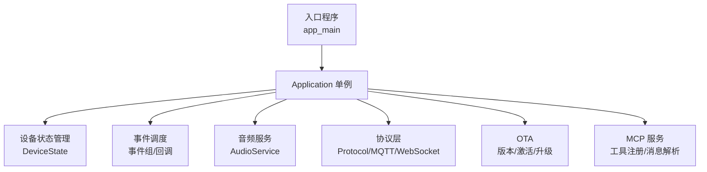
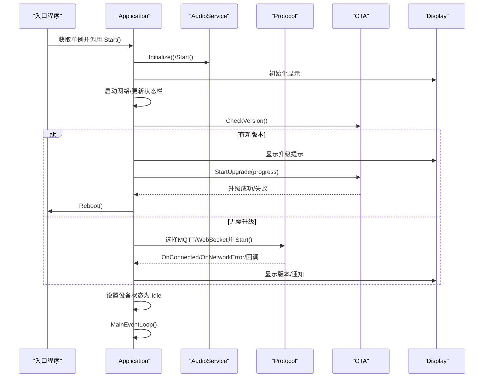
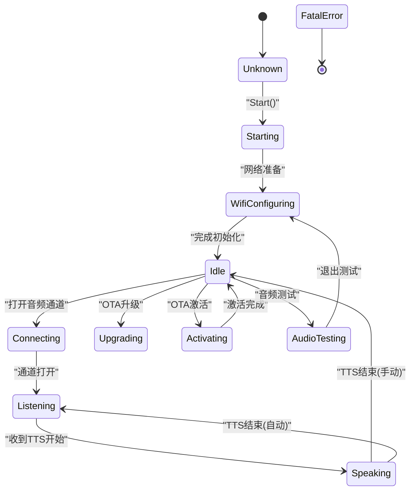
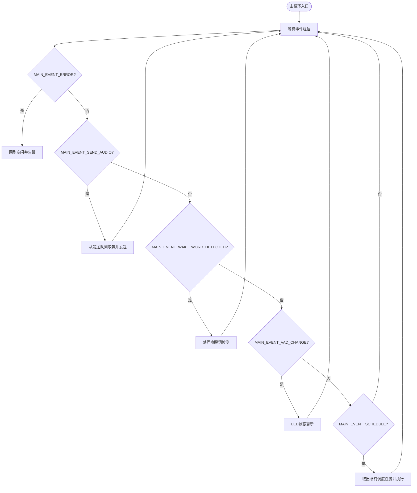
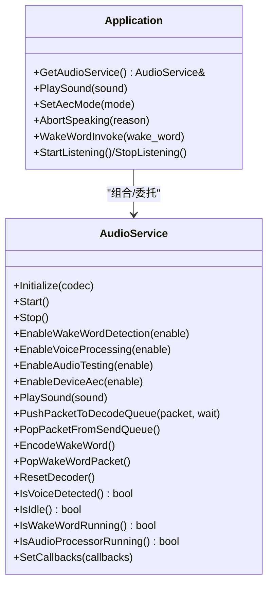
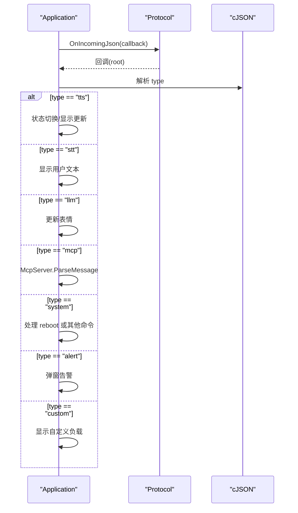
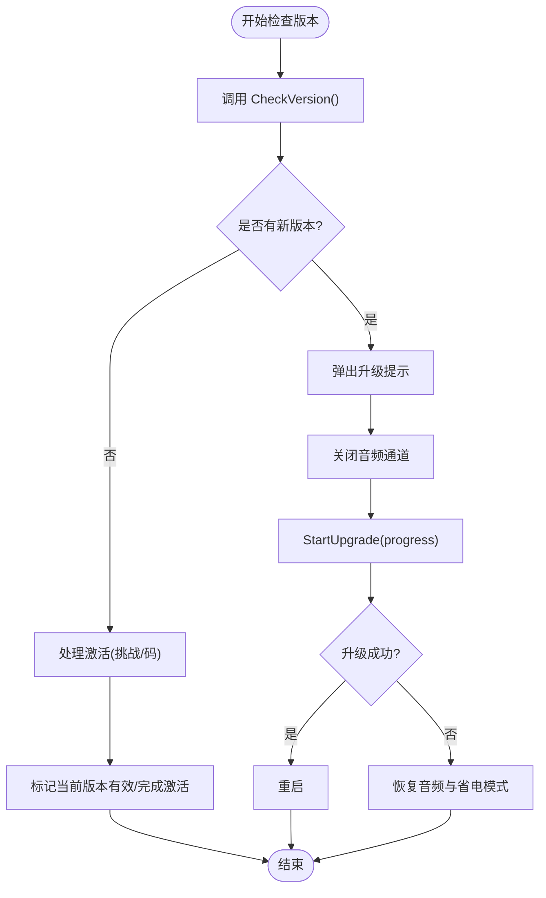
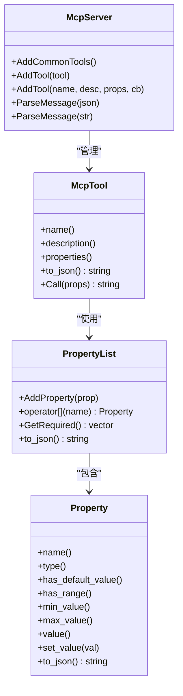
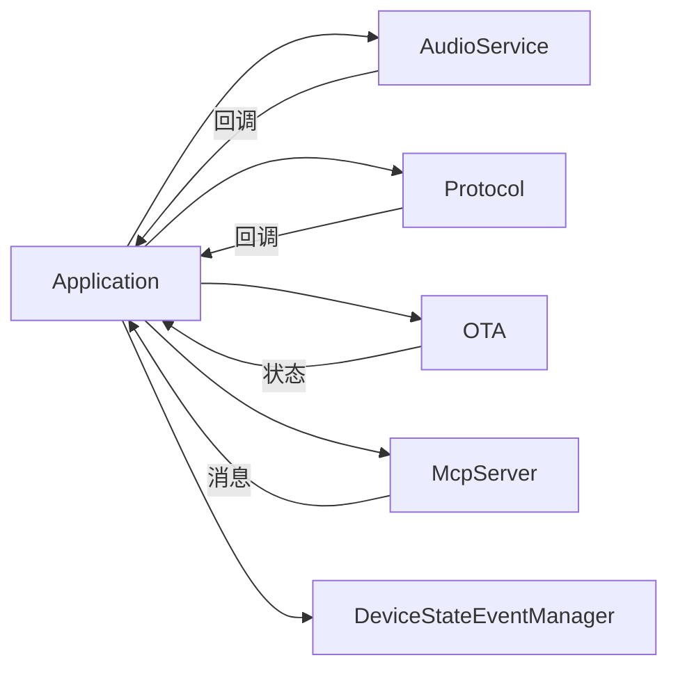

# 应用程序API

<cite>
**本文引用的文件**
- [main.cc](file://main.cc)
- [application.h](file://application.h)
- [application.cc](file://application.cc)
- [device_state.h](file://device_state.h)
- [device_state_event.h](file://device_state_event.h)
- [protocol.h](file://protocol.h)
- [audio_service.h](file://audio_service.h)
- [ota.h](file://ota.h)
- [mcp_server.h](file://mcp_server.h)
</cite>

## 目录
1. [简介](#简介)
2. [项目结构](#项目结构)
3. [核心组件](#核心组件)
4. [架构总览](#架构总览)
5. [详细组件分析](#详细组件分析)
6. [依赖关系分析](#依赖关系分析)
7. [性能考虑](#性能考虑)
8. [故障排查指南](#故障排查指南)
9. [结论](#结论)
10. [附录](#附录)

## 简介
本文件系统化梳理应用程序核心API，聚焦 Application 类的公共接口与关键子系统（设备状态管理、事件调度、音频控制、OTA/协议集成、MCP工具链）的使用方式与行为约束。文档同时给出线程安全与并发注意事项、典型调用流程图与最佳实践建议，帮助开发者在ESP32平台上正确集成与扩展该应用框架。

## 项目结构
- 入口程序负责初始化事件循环与NVDS存储，随后启动 Application 单例并进入主事件循环。
- Application 负责系统启动、网络与显示初始化、协议选择与连接、事件分发与状态机驱动、音频服务编解码与播放、OTA升级与激活流程、以及MCAP消息处理。
- 子系统包括：
  - 设备状态与事件：DeviceState 枚举与 DeviceStateEventManager 事件总线
  - 协议抽象：Protocol 抽象类及 MQTT/WebSocket 实现
  - 音频服务：AudioService 提供编码/解码、队列、回调与AEC开关
  - OTA：版本检查、激活、升级与服务器时间标记
  - MCP：工具注册与消息解析

**图表来源**
- [main.cc](file://main.cc#L13-L31)
- [application.h](file://application.h#L32-L88)
- [application.cc](file://application.cc#L328-L512)
- [protocol.h](file://protocol.h#L44-L95)
- [audio_service.h](file://audio_service.h#L81-L155)
- [ota.h](file://ota.h#L10-L55)
- [mcp_server.h](file://mcp_server.h#L252-L279)

**章节来源**
- [main.cc](file://main.cc#L13-L31)

## 核心组件
- Application 单例：提供 Start、MainEventLoop、设备状态查询与变更、事件调度、音频控制、OTA/协议交互、MCP消息发送、AEC模式切换、声音播放等公共接口。
- 设备状态：kDeviceStateUnknown 至 kDeviceStateFatalError 的完整状态集合，配合 DeviceStateEventManager 发布状态变更事件。
- 事件调度：通过 FreeRTOS 事件组与互斥队列实现跨任务安全调度，避免竞态。
- 音频服务：封装 Opus 编解码、音频输入输出任务、唤醒词检测、VAD回调、AEC开关与测试模式。
- 协议抽象：统一音频通道打开/关闭、文本/二进制消息收发、错误回调与会话管理。
- OTA：版本检查、激活挑战、升级进度回调、当前版本有效性标记与服务器时间可用性。
- MCP：工具定义、属性校验、消息解析与异步工具调用线程。

**章节来源**
- [application.h](file://application.h#L32-L88)
- [device_state.h](file://device_state.h#L4-L16)
- [device_state_event.h](file://device_state_event.h#L21-L37)
- [audio_service.h](file://audio_service.h#L81-L155)
- [protocol.h](file://protocol.h#L44-L95)
- [ota.h](file://ota.h#L10-L55)
- [mcp_server.h](file://mcp_server.h#L252-L279)

## 架构总览
Application 作为系统中枢，协调以下模块：
- 启动阶段：初始化显示、音频编解码器、启动音频服务；启动网络；检查版本/激活；选择MQTT或WebSocket协议；建立连接并注册回调。
- 运行阶段：主事件循环监听事件组位，按需执行调度任务、发送音频包、响应唤醒词/语音活动检测、处理远端TTS/STT/LLM/MCP/system指令。
- 状态机：根据设备状态驱动显示、LED、音频处理与唤醒词检测的启停。
- 升级与激活：OTA 流程中可弹出提示音效与屏幕状态，失败时自动退避重试，成功则重启。

**图表来源**
- [main.cc](file://main.cc#L27-L30)
- [application.cc](file://application.cc#L328-L512)
- [ota.h](file://ota.h#L15-L24)
- [protocol.h](file://protocol.h#L66-L76)

## 详细组件分析

### Application 类公共API
- 单例与生命周期
  - GetInstance(): 返回静态 Application 单例，线程安全；内部采用局部静态变量保证首次访问的原子性。
  - Start(): 完成显示、音频、网络初始化，检查版本/激活，选择协议并建立连接，完成后进入 kDeviceStateIdle。
  - MainEventLoop(): 主事件循环，优先级提升至3，阻塞等待事件组位，按位执行对应分支（发送音频、唤醒词检测、VAD变化、调度任务、网络错误）。
  - Reboot(): 触发系统重启。
- 设备状态管理
  - GetDeviceState(): 查询当前设备状态（只读）。
  - SetDeviceState(state): 变更设备状态，触发状态事件发布、LED与显示联动、音频处理开关切换。
  - CanEnterSleepMode(): 在空闲且无音频通道/音频服务空闲时允许进入睡眠。
- 事件调度
  - Schedule(callback): 将回调加入互斥保护的任务队列，设置事件组位以唤醒主循环。
  - 内部使用 std::mutex 与 std::deque 保证多任务安全；事件组位用于唤醒主循环。
- 音频控制
  - GetAudioService(): 返回音频服务引用，便于外部直接调用音频能力（如播放提示音）。
  - PlaySound(sound): 播放指定音效。
  - AbortSpeaking(reason): 中断正在播放的TTS，发送中断原因。
  - WakeWordInvoke(wake_word): 强制触发唤醒词路径（用于调试或远程唤醒）。
  - SetAecMode(mode)/GetAecMode(): 切换AEC模式（关闭/设备侧/服务侧），必要时关闭音频通道。
- 语音交互
  - ToggleChatState(): 在空闲/连接中切换到“连接并开始听写”，在说话中中断，听写中关闭通道。
  - StartListening()/StopListening(): 手动听写控制，支持手动停止模式。
  - IsVoiceDetected(): 查询VAD是否检测到语音。
- 协议与消息
  - SendMcpMessage(payload): 通过协议发送MCP消息。
  - 协议回调：OnConnected/OnNetworkError/OnIncomingAudio/OnIncomingJson/OnAudioChannelOpened/Closed 等。
- OTA与激活
  - CheckNewVersion(ota): 循环检查版本，失败指数退避，成功则升级并重启；支持激活码展示与激活挑战。
  - ShowActivationCode(code, message): 展示激活码并播报数字音效。
- 参数与返回值
  - 所有公开方法均为无异常抛出的同步接口；部分内部操作通过回调异步完成。
- 线程安全性
  - Schedule 与事件组位设置是跨任务安全的；SetDeviceState 内部维护状态机与显示/LED联动，不暴露共享可变状态给外部。
  - 音频服务与协议层各自持有内部锁，Application 仅通过回调与队列与其交互，避免直接竞争。

**章节来源**
- [application.h](file://application.h#L32-L88)
- [application.cc](file://application.cc#L328-L512)
- [application.cc](file://application.cc#L528-L583)
- [application.cc](file://application.cc#L634-L694)
- [application.cc](file://application.cc#L722-L776)

### 设备状态与事件
- 设备状态枚举
  - kDeviceStateUnknown、kDeviceStateStarting、kDeviceStateWifiConfiguring、kDeviceStateIdle、kDeviceStateConnecting、kDeviceStateListening、kDeviceStateSpeaking、kDeviceStateUpgrading、kDeviceStateActivating、kDeviceStateAudioTesting、kDeviceStateFatalError。
- 事件管理
  - DeviceStateEventManager：单例，提供注册回调、发布状态变更事件的能力；回调参数为前一状态与当前状态。
  - Application 在 SetDeviceState 中发布状态变更事件，供上层订阅者感知。

**图表来源**
- [device_state.h](file://device_state.h#L4-L16)
- [application.cc](file://application.cc#L634-L694)
- [device_state_event.h](file://device_state_event.h#L21-L37)

**章节来源**
- [device_state.h](file://device_state.h#L4-L16)
- [device_state_event.h](file://device_state_event.h#L21-L37)
- [application.cc](file://application.cc#L634-L694)

### 事件调度与主循环
- 事件组位
  - MAIN_EVENT_SCHEDULE、MAIN_EVENT_SEND_AUDIO、MAIN_EVENT_WAKE_WORD_DETECTED、MAIN_EVENT_VAD_CHANGE、MAIN_EVENT_ERROR、MAIN_EVENT_CHECK_NEW_VERSION_DONE。
- 主循环逻辑
  - 等待任一事件位；根据位执行对应分支：发送音频包、处理唤醒词、处理VAD变化、执行调度任务、处理网络错误。
  - 调度任务从互斥队列取出并顺序执行，避免与音频/协议回调并发修改共享状态。

**图表来源**
- [application.cc](file://application.cc#L540-L583)
- [application.cc](file://application.cc#L528-L535)

**章节来源**
- [application.cc](file://application.cc#L540-L583)
- [application.cc](file://application.cc#L528-L535)

### 音频服务与AEC
- 关键能力
  - 初始化/启动/停止、唤醒词检测、语音活动检测、音频处理开关、设备AEC开关、音频测试模式、播放提示音、解码队列入队/出队、读取音频数据、重置解码器。
- 队列与任务
  - 解码队列、发送队列、测试队列、编码任务队列、回放队列；分别由音频输入/输出/编解码任务消费。
- AEC模式
  - 通过 SetAecMode 切换（关闭/设备侧/服务侧），必要时关闭音频通道以生效。
- 线程模型
  - 音频服务内部使用事件组与条件变量，Application 通过回调与队列与其交互，避免直接竞争。

**图表来源**
- [audio_service.h](file://audio_service.h#L81-L155)
- [application.h](file://application.h#L61-L61)

**章节来源**
- [audio_service.h](file://audio_service.h#L81-L155)
- [application.cc](file://application.cc#L747-L776)

### 协议抽象与消息处理
- 协议接口
  - Start/OpenAudioChannel/CloseAudioChannel/IsAudioChannelOpened/SendAudio/SendWakeWordDetected/SendStartListening/SendStopListening/SendAbortSpeaking/SendMcpMessage。
  - 回调注册：OnIncomingAudio/OnIncomingJson/OnAudioChannelOpened/OnAudioChannelClosed/OnNetworkError/OnConnected/OnDisconnected。
- 消息类型处理
  - TTS 开始/结束/句子开始、STT 文本、LLM 情绪、MCP 消息、system reboot 命令、自定义消息（可选宏启用）。
- 监听模式
  - AutoStop/ManualStop/Realtime（需要AEC支持）。

**图表来源**
- [protocol.h](file://protocol.h#L44-L95)
- [application.cc](file://application.cc#L408-L496)

**章节来源**
- [protocol.h](file://protocol.h#L44-L95)
- [application.cc](file://application.cc#L408-L496)

### OTA 与激活
- 能力
  - CheckVersion/Activate/HasNewVersion/HasMqttConfig/HasWebsocketConfig/HasActivationCode/HasServerTime/StartUpgrade/MarkCurrentVersionValid。
  - 版本比较、激活挑战、序列号、超时、升级进度回调。
- 流程
  - 循环检查版本，失败指数退避；有新版本则弹出升级提示，关闭音频通道，开始升级；失败则恢复音频与省电模式；成功则重启。
  - 若存在激活码/挑战，则展示激活码并播报数字音效，轮询激活直至成功或超时。

**图表来源**
- [application.cc](file://application.cc#L70-L176)
- [ota.h](file://ota.h#L15-L31)

**章节来源**
- [application.cc](file://application.cc#L70-L176)
- [ota.h](file://ota.h#L15-L31)

### MCP 工具链
- 能力
  - 单例 McpServer：添加通用工具、注册工具、解析消息、异步工具调用线程。
  - 工具定义 McpTool：名称、描述、输入属性（布尔/整数/字符串）、默认值与范围限制、回调执行与结果封装。
  - 属性列表 PropertyList：必填项提取、JSON序列化。
- 使用
  - Application 在收到 mcp 类型消息时，调用 McpServer::ParseMessage 分发处理。

**图表来源**
- [mcp_server.h](file://mcp_server.h#L252-L279)
- [mcp_server.h](file://mcp_server.h#L174-L250)
- [mcp_server.h](file://mcp_server.h#L24-L122)

**章节来源**
- [mcp_server.h](file://mcp_server.h#L252-L279)
- [mcp_server.h](file://mcp_server.h#L174-L250)
- [mcp_server.h](file://mcp_server.h#L24-L122)

## 依赖关系分析
- 组件耦合
  - Application 与 AudioService、Protocol、OTA、McpServer 为组合关系；通过回调与队列解耦。
  - 设备状态事件通过 DeviceStateEventManager 广播，降低模块间直接依赖。
- 外部依赖
  - FreeRTOS 事件组/定时器/任务；cJSON；Opus 编解码；硬件编解码器与音频处理器。
- 潜在风险
  - 音频通道打开/关闭与AEC模式切换需谨慎，避免在非空闲状态下频繁切换导致资源争用。
  - OTA 升级路径需确保音频通道关闭与省电模式恢复，防止升级失败影响运行。

**图表来源**
- [application.h](file://application.h#L69-L76)
- [protocol.h](file://protocol.h#L58-L76)
- [audio_service.h](file://audio_service.h#L54-L59)
- [ota.h](file://ota.h#L10-L55)
- [mcp_server.h](file://mcp_server.h#L252-L279)
- [device_state_event.h](file://device_state_event.h#L21-L37)

**章节来源**
- [application.h](file://application.h#L69-L76)
- [protocol.h](file://protocol.h#L58-L76)
- [audio_service.h](file://audio_service.h#L54-L59)
- [ota.h](file://ota.h#L10-L55)
- [mcp_server.h](file://mcp_server.h#L252-L279)
- [device_state_event.h](file://device_state_event.h#L21-L37)

## 性能考虑
- 事件驱动与优先级
  - 主循环优先级设为3，避免被后台任务抢占；事件组位唤醒减少忙等。
- 音频队列容量
  - 发送/解码队列长度与帧时长相关，合理设置可避免阻塞与失真。
- AEC与采样率
  - 服务端采样率与设备输出采样率不一致可能导致重采样失真，应尽量匹配。
- OTA 升级
  - 指数退避与进度回调有助于用户体验与资源控制；升级期间关闭音频通道与省电模式可降低功耗。

[本节为通用指导，不直接分析具体文件]

## 故障排查指南
- 网络错误
  - OnNetworkError 回调会设置 MAIN_EVENT_ERROR，主循环将回到空闲并弹出告警；检查网络配置与OTA配置。
- 升级失败
  - 升级失败会恢复音频服务与省电模式并弹出错误提示；确认固件URL与存储空间充足。
- 唤醒词误触发
  - 在说话模式下会中断TTS；若频繁误触发，检查唤醒词检测开关与AEC模式。
- 状态卡死
  - 使用 SetDeviceState 显式切换状态；必要时通过 Schedule 注入状态重置任务。
- 音频无声/破音
  - 检查采样率匹配、AEC模式、音频通道状态与队列积压。

**章节来源**
- [application.cc](file://application.cc#L384-L387)
- [application.cc](file://application.cc#L550-L553)
- [application.cc](file://application.cc#L127-L134)
- [application.cc](file://application.cc#L696-L699)
- [application.cc](file://application.cc#L393-L399)

## 结论
Application 类提供了清晰的单例入口、完善的事件调度机制与强健的状态机，结合音频服务、协议抽象、OTA与MCP工具链，形成可扩展的ESP32语音交互框架。遵循本文的线程安全与最佳实践，可在保证稳定性的同时快速迭代功能。

[本节为总结性内容，不直接分析具体文件]

## 附录

### API 速查表（Application）
- GetInstance(): 单例获取
- Start(): 启动系统
- MainEventLoop(): 主事件循环
- GetDeviceState(): 查询设备状态
- IsVoiceDetected(): VAD检测
- Schedule(callback): 调度任务
- SetDeviceState(state): 设置设备状态
- Alert(status, message, emotion, sound): 告警提示
- DismissAlert(): 取消告警
- AbortSpeaking(reason): 中断TTS
- ToggleChatState(): 切换听写/连接
- StartListening()/StopListening(): 手动听写控制
- Reboot(): 重启
- WakeWordInvoke(wake_word): 强制唤醒词
- CanEnterSleepMode(): 是否可休眠
- SendMcpMessage(payload): 发送MCP消息
- SetAecMode(mode)/GetAecMode(): AEC模式
- PlaySound(sound): 播放音效
- GetAudioService(): 获取音频服务引用

**章节来源**
- [application.h](file://application.h#L42-L61)

### 设备状态枚举（DeviceState）
- kDeviceStateUnknown
- kDeviceStateStarting
- kDeviceStateWifiConfiguring
- kDeviceStateIdle
- kDeviceStateConnecting
- kDeviceStateListening
- kDeviceStateSpeaking
- kDeviceStateUpgrading
- kDeviceStateActivating
- kDeviceStateAudioTesting
- kDeviceStateFatalError

**章节来源**
- [device_state.h](file://device_state.h#L4-L16)

### 事件组位（MAIN_EVENT_*）
- MAIN_EVENT_SCHEDULE
- MAIN_EVENT_SEND_AUDIO
- MAIN_EVENT_WAKE_WORD_DETECTED
- MAIN_EVENT_VAD_CHANGE
- MAIN_EVENT_ERROR
- MAIN_EVENT_CHECK_NEW_VERSION_DONE

**章节来源**
- [application.h](file://application.h#L19-L25)

### 监听模式（ListeningMode）
- kListeningModeAutoStop
- kListeningModeManualStop
- kListeningModeRealtime

**章节来源**
- [protocol.h](file://protocol.h#L38-L42)

### AEC 模式（AecMode）
- kAecOff
- kAecOnDeviceSide
- kAecOnServerSide

**章节来源**
- [application.h](file://application.h#L26-L30)