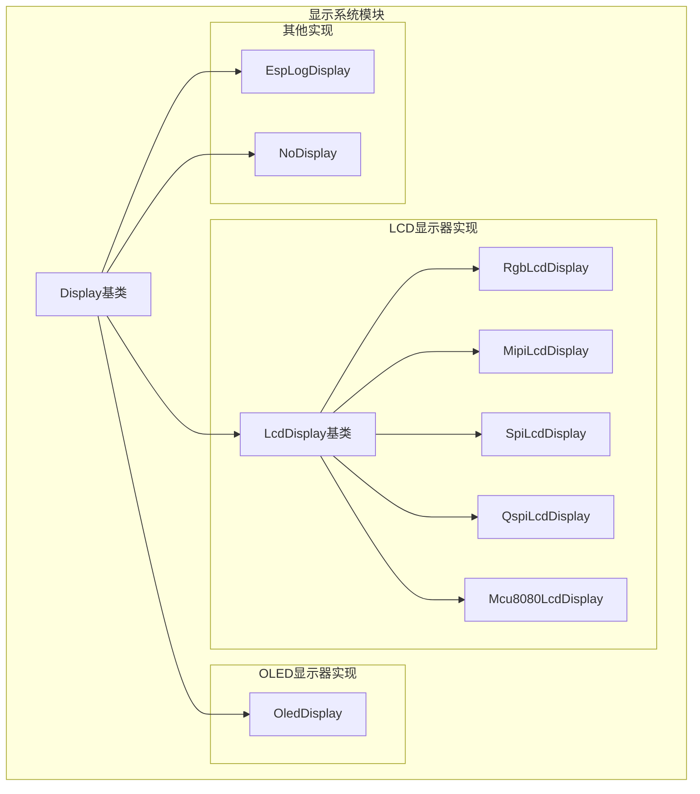
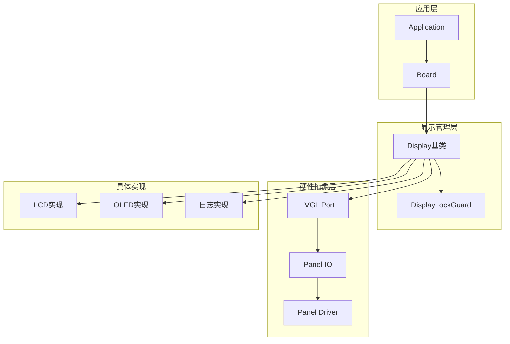
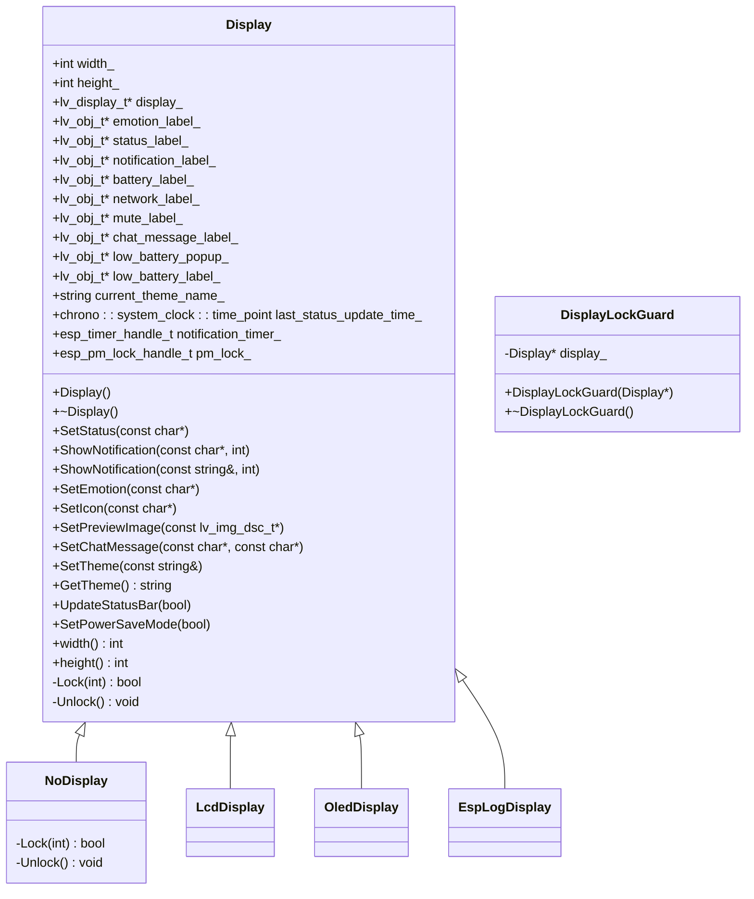
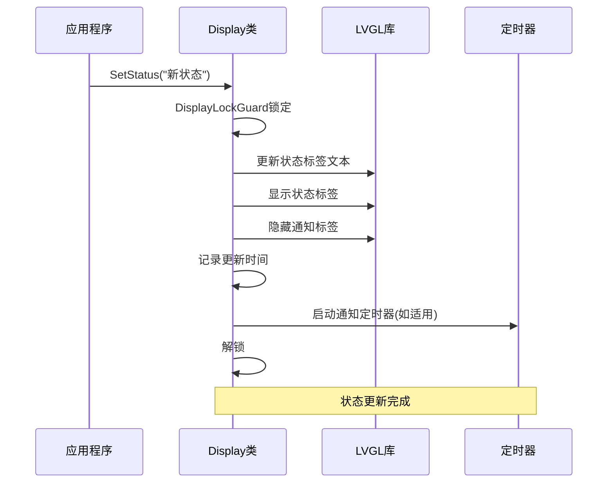
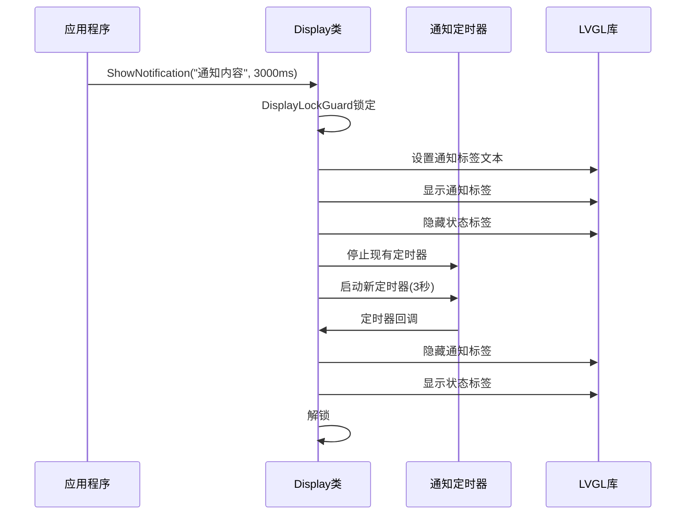
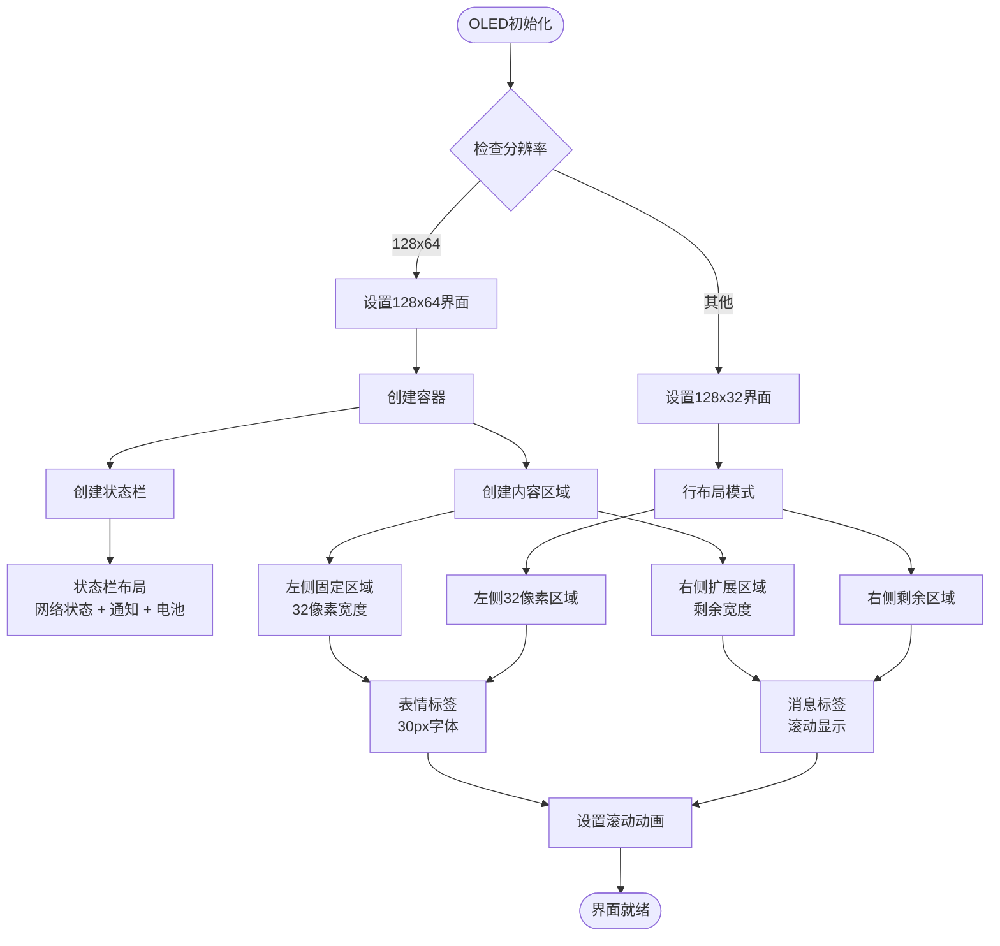
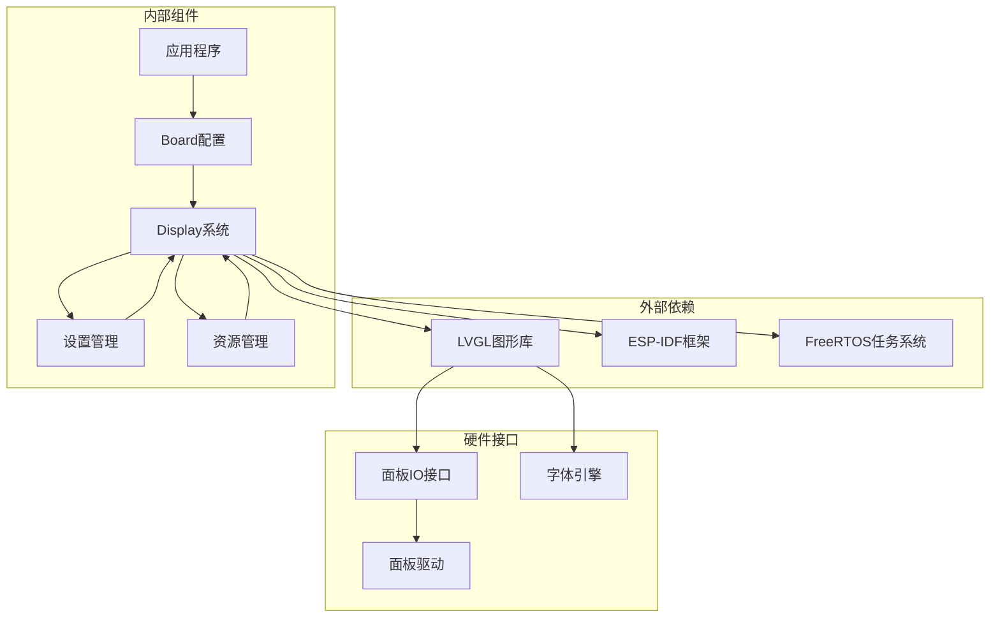

# 显示系统API

<cite>
**本文档引用的文件**
- [display.h](file://main/display/display.h)
- [display.cc](file://main/display/display.cc)
- [lcd_display.h](file://main/display/lcd_display.h)
- [lcd_display.cc](file://main/display/lcd_display.cc)
- [oled_display.h](file://main/display/oled_display.h)
- [oled_display.cc](file://main/display/oled_display.cc)
- [esplog_display.h](file://main/display/esplog_display.h)
- [esplog_display.cc](file://main/display/esplog_display.cc)
- [application.cc](file://main/application.cc)
- [atk_dnesp32s3.cc](file://main/boards/atk-dnesp32s3/atk_dnesp32s3.cc)
</cite>

## 目录
1. [简介](#简介)
2. [项目结构](#项目结构)
3. [核心组件](#核心组件)
4. [架构概览](#架构概览)
5. [详细组件分析](#详细组件分析)
6. [依赖关系分析](#依赖关系分析)
7. [性能考虑](#性能考虑)
8. [故障排除指南](#故障排除指南)
9. [结论](#结论)

## 简介

显示系统是基于ESP32平台的嵌入式设备中的重要组成部分，负责处理各种显示设备的初始化、内容绘制、字体渲染和颜色管理。该系统采用面向对象的设计模式，通过Display基类抽象出通用的显示功能，并针对不同的硬件类型提供了专门的实现。

本系统支持多种显示类型，包括LCD显示器（RGB LCD、MIPI LCD、SPI LCD、QSPI LCD、MCU8080 LCD）和OLED显示器，以及用于调试的日志显示。所有实现都基于LVGL图形库，提供了丰富的用户界面功能和良好的性能表现。

## 项目结构

显示系统位于main/display目录下，采用模块化设计，每个显示类型都有独立的头文件和实现文件：



**图表来源**
- [display.h](file://main/display/display.h#L18-L66)
- [lcd_display.h](file://main/display/lcd_display.h#L26-L106)
- [oled_display.h](file://main/display/oled_display.h#L9-L35)

**章节来源**
- [display.h](file://main/display/display.h#L1-L93)
- [lcd_display.h](file://main/display/lcd_display.h#L1-L107)
- [oled_display.h](file://main/display/oled_display.h#L1-L38)

## 核心组件

### Display基类

Display基类是整个显示系统的核心抽象，定义了所有显示设备的通用接口和基础功能。它继承自LVGL的lv_display_t类，提供了以下主要功能：

#### 公共接口

- **状态管理**: SetStatus() - 设置状态文本
- **通知系统**: ShowNotification() - 显示临时通知，支持字符串重载
- **情感显示**: SetEmotion() - 设置表情符号
- **聊天消息**: SetChatMessage() - 设置聊天内容
- **图标管理**: SetIcon() - 设置自定义图标
- **预览图像**: SetPreviewImage() - 设置预览图片
- **主题管理**: SetTheme() / GetTheme() - 主题切换和查询
- **状态栏**: UpdateStatusBar() - 更新状态栏信息
- **省电模式**: SetPowerSaveMode() - 设置省电模式

#### 关键特性

- **线程安全**: 通过DisplayLockGuard提供自动锁机制
- **电源管理**: 集成ESP-IDF电源管理锁
- **定时器支持**: 内置通知定时器
- **电池监控**: 集成电池状态显示
- **网络状态**: 支持网络连接状态显示

**章节来源**
- [display.h](file://main/display/display.h#L18-L66)
- [display.cc](file://main/display/display.cc#L17-L241)

### LCD显示器系列

LCD显示器系列提供了多种接口类型的实现，包括RGB、MIPI、SPI、QSPI和MCU8080接口。

#### 主要实现类型

- **RgbLcdDisplay**: RGB接口LCD显示器
- **MipiLcdDisplay**: MIPI DSI接口LCD显示器  
- **SpiLcdDisplay**: SPI接口LCD显示器
- **QspiLcdDisplay**: QSPI接口LCD显示器
- **Mcu8080LcdDisplay**: MCU 8080接口LCD显示器

#### 特色功能

- **旋转支持**: 支持镜像和XY轴交换
- **偏移调整**: 可配置显示偏移量
- **双缓冲**: 部分实现支持双缓冲渲染
- **DMA传输**: 优化的内存传输
- **主题系统**: 完整的深色/浅色主题支持

**章节来源**
- [lcd_display.h](file://main/display/lcd_display.h#L26-L106)
- [lcd_display.cc](file://main/display/lcd_display.cc#L70-L212)

### OLED显示器

OLED显示器实现专注于单色显示设备，提供了针对128x64和128x32像素分辨率的优化界面。

#### 特色功能

- **单色渲染**: 专为OLED单色像素优化
- **尺寸适配**: 自动适配不同分辨率的界面布局
- **动画支持**: 滚动文本动画效果
- **镜像支持**: 支持X/Y轴镜像显示

**章节来源**
- [oled_display.h](file://main/display/oled_display.h#L9-L35)
- [oled_display.cc](file://main/display/oled_display.cc#L16-L311)

### EspLogDisplay

EspLogDisplay是一个特殊的显示实现，主要用于调试目的，将所有显示操作重定向到ESP-IDF日志系统。

#### 功能特点

- **调试友好**: 所有显示操作输出到日志
- **无硬件依赖**: 不需要实际的显示硬件
- **开发工具**: 便于开发和测试阶段使用

**章节来源**
- [esplog_display.h](file://main/display/esplog_display.h#L8-L26)
- [esplog_display.cc](file://main/display/esplog_display.cc#L8-L45)

## 架构概览

显示系统采用分层架构设计，通过抽象基类和具体实现分离关注点：



**图表来源**
- [display.cc](file://main/display/display.cc#L17-L62)
- [lcd_display.cc](file://main/display/lcd_display.cc#L102-L142)
- [oled_display.cc](file://main/display/oled_display.cc#L22-L58)

## 详细组件分析

### Display基类详细分析

Display基类提供了完整的显示功能框架，包括状态管理、通知系统、主题管理和电源控制。

#### 类关系图



**图表来源**
- [display.h](file://main/display/display.h#L18-L92)

#### 关键方法流程

**状态更新流程**



**通知显示流程**



**章节来源**
- [display.cc](file://main/display/display.cc#L64-L91)
- [display.cc](file://main/display/display.cc#L17-L40)

### LCD显示器详细分析

LCD显示器实现提供了多种接口类型的完整支持，每种类型都有特定的配置参数和优化策略。

#### LCD实现类层次结构

```mermaid
classDiagram
class LcdDisplay {
+esp_lcd_panel_io_handle_t panel_io_
+esp_lcd_panel_handle_t panel_
+lv_draw_buf_t draw_buf_
+lv_obj_t* status_bar_
+lv_obj_t* content_
+lv_obj_t* container_
+lv_obj_t* side_bar_
+lv_obj_t* preview_image_
+DisplayFonts fonts_
+ThemeColors current_theme_
+LcdDisplay(io, panel, fonts, width, height)
+~LcdDisplay()
+SetEmotion(const char*)
+SetIcon(const char*)
+SetPreviewImage(const lv_img_dsc_t*)
+SetChatMessage(const char*, const char*)
+SetTheme(const string&)
-SetupUI()
-Lock(int) bool
-Unlock() void
}
class RgbLcdDisplay {
+RgbLcdDisplay(io, panel, width, height, offset_x, offset_y,
mirror_x, mirror_y, swap_xy, fonts)
}
class MipiLcdDisplay {
+MipiLcdDisplay(io, panel, width, height, offset_x, offset_y,
mirror_x, mirror_y, swap_xy, fonts)
}
class SpiLcdDisplay {
+SpiLcdDisplay(io, panel, width, height, offset_x, offset_y,
mirror_x, mirror_y, swap_xy, fonts)
}
class QspiLcdDisplay {
+QspiLcdDisplay(io, panel, width, height, offset_x, offset_y,
mirror_x, mirror_y, swap_xy, fonts)
}
class Mcu8080LcdDisplay {
+Mcu8080LcdDisplay(io, panel, width, height, offset_x, offset_y,
mirror_x, mirror_y, swap_xy, fonts)
}
Display <|-- LcdDisplay
LcdDisplay <|-- RgbLcdDisplay
LcdDisplay <|-- MipiLcdDisplay
LcdDisplay <|-- SpiLcdDisplay
LcdDisplay <|-- QspiLcdDisplay
LcdDisplay <|-- Mcu8080LcdDisplay
```

**图表来源**
- [lcd_display.h](file://main/display/lcd_display.h#L26-L106)

#### 主题系统实现

LCD显示器支持完整的主题系统，包括深色和浅色两种主题：

**主题配置参数**

| 参数名称 | 深色主题值 | 浅色主题值 |
|---------|-----------|-----------|
| background | #121212 | 白色 |
| text | 白色 | 黑色 |
| chat_background | #1E1E1E | #E0E0E0 |
| user_bubble | #1A6C37 | #95EC69 |
| assistant_bubble | #333333 | 白色 |
| system_bubble | #2A2A2A | #E0E0E0 |
| system_text | #AAAAAA | #666666 |
| border | #333333 | #E0E0E0 |
| low_battery | 红色 | 黑色 |

**章节来源**
- [lcd_display.cc](file://main/display/lcd_display.cc#L18-L65)
- [lcd_display.cc](file://main/display/lcd_display.cc#L70-L85)

### OLED显示器详细分析

OLED显示器实现针对单色OLED设备进行了专门优化，支持128x64和128x32两种常见分辨率。

#### OLED界面布局



**图表来源**
- [oled_display.cc](file://main/display/oled_display.cc#L120-L227)
- [oled_display.cc](file://main/display/oled_display.cc#L229-L309)

**章节来源**
- [oled_display.cc](file://main/display/oled_display.cc#L16-L65)

### 使用示例

#### 基础显示操作示例

以下示例展示了如何使用显示系统的基本功能：

**状态更新示例**
```cpp
// 获取显示实例
auto display = Board::GetInstance().GetDisplay();

// 设置状态文本
display->SetStatus("系统启动中...");

// 显示临时通知
display->ShowNotification("设备已连接", 3000);

// 设置表情
display->SetEmotion("smile");

// 设置聊天消息
display->SetChatMessage("assistant", "您好！有什么可以帮助您的吗？");
```

**主题切换示例**
```cpp
// 切换到深色主题
display->SetTheme("dark");

// 查询当前主题
auto currentTheme = display->GetTheme();
```

**章节来源**
- [application.cc](file://main/application.cc#L208-L226)
- [display.cc](file://main/display/display.cc#L227-L231)

## 依赖关系分析

显示系统与其他组件的依赖关系如下：



**图表来源**
- [display.cc](file://main/display/display.cc#L1-L14)
- [lcd_display.cc](file://main/display/lcd_display.cc#L1-L12)

**章节来源**
- [display.cc](file://main/display/display.cc#L1-L14)
- [lcd_display.cc](file://main/display/lcd_display.cc#L1-L12)

## 性能考虑

### 内存管理

显示系统在内存管理方面采用了多项优化策略：

- **双缓冲支持**: 部分LCD实现支持双缓冲，减少撕裂现象
- **DMA传输**: 使用DMA进行大块数据传输，减轻CPU负担
- **内存池**: 使用专门的内存分配策略，避免碎片化
- **图像缓存**: 图像数据使用适当的内存分配器

### 渲染优化

- **增量更新**: 仅更新发生变化的区域
- **动画节流**: 滚动动画根据性能自动调整速度
- **字体缓存**: 字体数据进行缓存，避免重复加载
- **主题预计算**: 主题颜色在初始化时计算，运行时直接使用

### 电源管理

- **动态频率**: 在显示更新时提升处理器频率
- **省电模式**: 空闲时自动降低功耗
- **背光控制**: 支持背光亮度调节

## 故障排除指南

### 常见问题及解决方案

**显示初始化失败**
- 检查硬件连接是否正确
- 验证电源供应是否稳定
- 确认SPI/I2C配置参数

**界面显示异常**
- 检查分辨率设置是否匹配硬件
- 验证旋转参数配置
- 确认字体文件是否正确加载

**性能问题**
- 检查内存使用情况
- 优化刷新频率设置
- 减少同时更新的对象数量

**章节来源**
- [display.cc](file://main/display/display.cc#L17-L40)
- [lcd_display.cc](file://main/display/lcd_display.cc#L102-L142)

## 结论

显示系统通过清晰的架构设计和完善的抽象机制，成功地支持了多种显示硬件类型。其主要优势包括：

1. **高度抽象**: 通过Display基类统一了不同硬件的接口
2. **灵活扩展**: 新的显示类型可以轻松添加到系统中
3. **性能优化**: 针对不同硬件类型进行了专门优化
4. **易于使用**: 提供了简单直观的API接口
5. **可靠稳定**: 包含完整的错误处理和恢复机制

该系统为ESP32平台上的嵌入式显示应用提供了坚实的基础，可以根据具体需求选择合适的显示类型和配置参数。