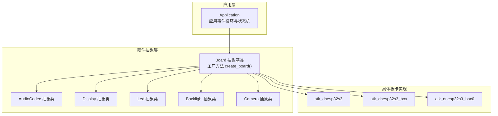
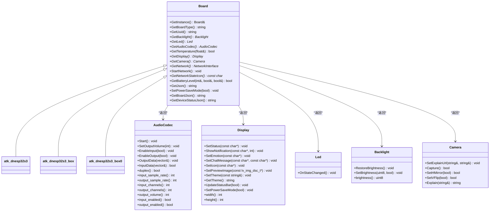
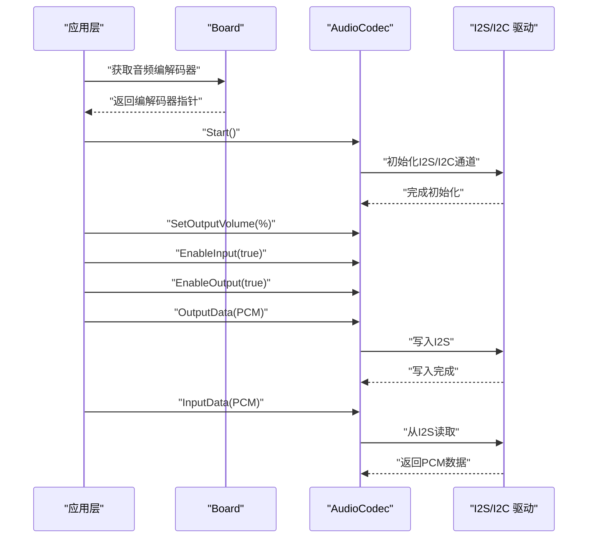
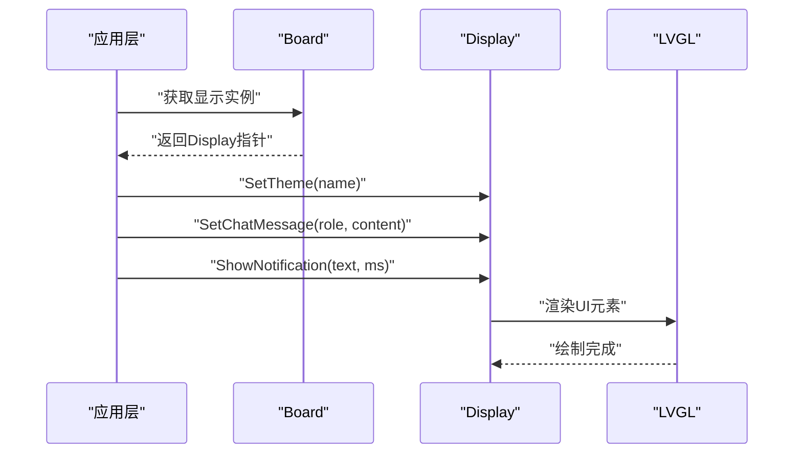
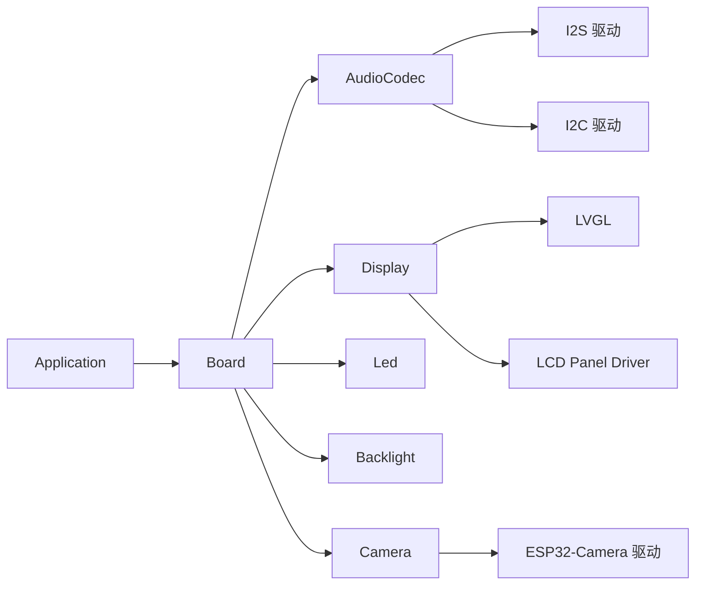

# 硬件抽象API

<cite>
**本文引用的文件**
- [main/boards/common/board.h](file://main/boards/common/board.h)
- [main/boards/common/backlight.h](file://main/boards/common/backlight.h)
- [main/boards/common/camera.h](file://main/boards/common/camera.h)
- [main/audio/audio_codec.h](file://main/audio/audio_codec.h)
- [main/audio/codecs/es8311_audio_codec.h](file://main/audio/codecs/es8311_audio_codec.h)
- [main/display/display.h](file://main/display/display.h)
- [main/led/led.h](file://main/led/led.h)
- [main/boards/atk-dnesp32s3/atk_dnesp32s3.cc](file://main/boards/atk-dnesp32s3/atk_dnesp32s3.cc)
- [main/boards/atk-dnesp32s3-box/atk_dnesp32s3_box.cc](file://main/boards/atk-dnesp32s3-box/atk_dnesp32s3_box.cc)
- [main/boards/atk-dnesp32s3-box0/atk_dnesp32s3_box0.cc](file://main/boards/atk-dnesp32s3-box0/atk_dnesp32s3_box0.cc)
- [main/application.h](file://main/application.h)
</cite>

## 目录
1. [简介](#简介)
2. [项目结构](#项目结构)
3. [核心组件](#核心组件)
4. [架构总览](#架构总览)
5. [详细组件分析](#详细组件分析)
6. [依赖关系分析](#依赖关系分析)
7. [性能考虑](#性能考虑)
8. [故障排查指南](#故障排查指南)
9. [结论](#结论)
10. [附录](#附录)

## 简介
本文件为硬件抽象层（HAL）的完整API文档，聚焦Board基类及其派生类的公共接口，覆盖硬件初始化、设备配置、资源管理、音频编解码、网络接口、显示驱动、LED控制、背光与电源管理等能力。文档同时给出引脚定义、时钟配置、硬件配置参数的使用方式，并提供多款开发板的适配示例，帮助开发者快速在不同硬件平台上集成统一的抽象接口。

## 项目结构
硬件抽象层主要位于以下目录：
- board抽象与各板卡实现：main/boards/common 与 main/boards/<具体板卡>/*
- 音频子系统：main/audio/* 与 main/audio/codecs/*
- 显示子系统：main/display/*
- LED与背光：main/led/*
- 应用入口与事件循环：main/application.h

图表来源
- [main/boards/common/board.h](file://main/boards/common/board.h#L18-L53)
- [main/audio/audio_codec.h](file://main/audio/audio_codec.h#L18-L57)
- [main/display/display.h](file://main/display/display.h#L18-L66)
- [main/led/led.h](file://main/led/led.h#L4-L15)
- [main/boards/common/backlight.h](file://main/boards/common/backlight.h#L10-L36)
- [main/boards/common/camera.h](file://main/boards/common/camera.h#L6-L13)
- [main/boards/atk-dnesp32s3/atk_dnesp32s3.cc](file://main/boards/atk-dnesp32s3/atk_dnesp32s3.cc#L51-L241)
- [main/boards/atk-dnesp32s3-box/atk_dnesp32s3_box.cc](file://main/boards/atk-dnesp32s3-box/atk_dnesp32s3_box.cc#L134-L311)
- [main/boards/atk-dnesp32s3-box0/atk_dnesp32s3_box0.cc](file://main/boards/atk-dnesp32s3-box0/atk_dnesp32s3_box0.cc#L26-L397)

章节来源
- [main/boards/common/board.h](file://main/boards/common/board.h#L1-L61)
- [main/application.h](file://main/application.h#L32-L88)

## 核心组件
本节概述Board抽象基类及各子系统的公共接口职责与典型调用流程。

- Board抽象基类
  - 提供单例访问入口与工厂方法create_board()，通过宏DECLARE_BOARD(类名)注册具体板卡实例。
  - 关键接口：获取板型字符串、UUID、背光、LED、音频编解码器、温度、显示、摄像头、网络接口、启动网络、网络状态图标、电池信息、JSON信息、省电模式开关、板级与设备状态JSON等。
- AudioCodec抽象类
  - 统一音频输入输出控制：启停、音量、输入/输出使能、读写数据；提供采样率、通道数、增益等运行态查询。
- Display抽象类
  - 屏幕状态栏更新、通知展示、表情/聊天内容/图标设置、主题切换、省电模式、尺寸查询；提供显示锁机制以保障线程安全。
- Led与Backlight抽象类
  - Led：根据设备状态切换LED行为。
  - Backlight：PWM背光亮度控制与渐变过渡定时器。
- Camera抽象类
  - 拍照、镜像/翻转、解释接口调用。

章节来源
- [main/boards/common/board.h](file://main/boards/common/board.h#L18-L53)
- [main/audio/audio_codec.h](file://main/audio/audio_codec.h#L18-L57)
- [main/display/display.h](file://main/display/display.h#L18-L66)
- [main/led/led.h](file://main/led/led.h#L4-L15)
- [main/boards/common/backlight.h](file://main/boards/common/backlight.h#L10-L36)
- [main/boards/common/camera.h](file://main/boards/common/camera.h#L6-L13)

## 架构总览
下图展示了应用层通过Board抽象访问底层硬件的交互关系，以及典型板卡对抽象接口的具体实现。

图表来源
- [main/boards/common/board.h](file://main/boards/common/board.h#L18-L53)
- [main/audio/audio_codec.h](file://main/audio/audio_codec.h#L18-L57)
- [main/display/display.h](file://main/display/display.h#L18-L66)
- [main/led/led.h](file://main/led/led.h#L4-L15)
- [main/boards/common/backlight.h](file://main/boards/common/backlight.h#L10-L36)
- [main/boards/common/camera.h](file://main/boards/common/camera.h#L6-L13)
- [main/boards/atk-dnesp32s3/atk_dnesp32s3.cc](file://main/boards/atk-dnesp32s3/atk_dnesp32s3.cc#L51-L241)
- [main/boards/atk-dnesp32s3-box/atk_dnesp32s3_box.cc](file://main/boards/atk-dnesp32s3-box/atk_dnesp32s3_box.cc#L134-L311)
- [main/boards/atk-dnesp32s3-box0/atk_dnesp32s3_box0.cc](file://main/boards/atk-dnesp32s3-box0/atk_dnesp32s3_box0.cc#L26-L397)

## 详细组件分析

### Board抽象与工厂机制
- 单例与工厂
  - 通过静态GetInstance()获取Board实例，内部委托create_board()工厂函数创建具体板卡对象。
  - 宏DECLARE_BOARD(类名)用于在具体板卡源文件中实现工厂函数。
- 关键接口
  - 获取板型、UUID、背光、LED、音频编解码器、温度、显示、摄像头、网络接口、启动网络、网络状态图标、电池信息、JSON信息、省电模式开关、板级与设备状态JSON等。
- 设计要点
  - Board为纯虚接口，具体板卡实现负责外设初始化与资源绑定。
  - 通过GetDisplay()/GetAudioCodec()/GetNetwork()等统一入口，屏蔽底层差异。

章节来源
- [main/boards/common/board.h](file://main/boards/common/board.h#L18-L53)
- [main/boards/atk-dnesp32s3/atk_dnesp32s3.cc](file://main/boards/atk-dnesp32s3/atk_dnesp32s3.cc#L243-L244)
- [main/boards/atk-dnesp32s3-box/atk_dnesp32s3_box.cc](file://main/boards/atk-dnesp32s3-box/atk_dnesp32s3_box.cc#L313-L314)
- [main/boards/atk-dnesp32s3-box0/atk_dnesp32s3_box0.cc](file://main/boards/atk-dnesp32s3-box0/atk_dnesp32s3_box0.cc#L397-L398)

### 音频编解码器抽象与实现
- AudioCodec抽象
  - 提供Start、SetOutputVolume、EnableInput/EnableOutput、InputData/OutputData等接口。
  - 运行态查询：duplex、采样率、通道数、音量、输入/输出使能状态。
- Es8311AudioCodec实现
  - 基于I2C与I2S STD模式，支持读写回调、音量控制、输入/输出使能。
  - 内部维护esp_codec_dev句柄与GPIO接口，支持PA引脚与反相配置。
- 典型调用序列
  - 应用层通过Board::GetAudioCodec()获取编解码器实例，随后调用Start与音量设置，再进行音频数据的输入/输出。

图表来源
- [main/audio/audio_codec.h](file://main/audio/audio_codec.h#L18-L57)
- [main/audio/codecs/es8311_audio_codec.h](file://main/audio/codecs/es8311_audio_codec.h#L13-L40)

章节来源
- [main/audio/audio_codec.h](file://main/audio/audio_codec.h#L18-L57)
- [main/audio/codecs/es8311_audio_codec.h](file://main/audio/codecs/es8311_audio_codec.h#L13-L40)

### 显示驱动抽象与实现
- Display抽象
  - 支持状态栏文本、通知、表情、聊天消息、图标、预览图、主题切换、省电模式与尺寸查询。
  - 提供DisplayLockGuard以确保线程安全的绘制操作。
- 典型实现
  - 各板卡通过SPI/LCD或I80总线连接屏幕，初始化面板IO与驱动后，封装为具体Display对象。
- 调用流程
  - 应用层通过Board::GetDisplay()获取显示实例，设置主题与内容，必要时加锁后再更新。

图表来源
- [main/display/display.h](file://main/display/display.h#L18-L66)
- [main/boards/atk-dnesp32s3/atk_dnesp32s3.cc](file://main/boards/atk-dnesp32s3/atk_dnesp32s3.cc#L101-L144)
- [main/boards/atk-dnesp32s3-box/atk_dnesp32s3_box.cc](file://main/boards/atk-dnesp32s3-box/atk_dnesp32s3_box.cc#L171-L256)

章节来源
- [main/display/display.h](file://main/display/display.h#L18-L66)
- [main/boards/atk-dnesp32s3/atk_dnesp32s3.cc](file://main/boards/atk-dnesp32s3/atk_dnesp32s3.cc#L101-L144)
- [main/boards/atk-dnesp32s3-box/atk_dnesp32s3_box.cc](file://main/boards/atk-dnesp32s3-box/atk_dnesp32s3_box.cc#L171-L256)

### LED与背光抽象
- Led抽象
  - OnStateChanged用于响应设备状态变化，具体板卡可实现不同LED行为。
- Backlight抽象
  - 提供SetBrightness与RestoreBrightness，内部使用定时器实现亮度渐变过渡。
  - PWM背光实现PwmBacklight，支持频率与输出极性配置。

章节来源
- [main/led/led.h](file://main/led/led.h#L4-L15)
- [main/boards/common/backlight.h](file://main/boards/common/backlight.h#L10-L36)

### 摄像头抽象
- Camera抽象
  - 支持设置解释URL与令牌、拍照、水平/垂直镜像、图像解释服务调用。
- 板卡实现
  - 部分板卡通过扩展I2C设备控制电源/复位引脚，结合ESP32-camera驱动完成初始化与帧缓冲管理。

章节来源
- [main/boards/common/camera.h](file://main/boards/common/camera.h#L6-L13)
- [main/boards/atk-dnesp32s3/atk_dnesp32s3.cc](file://main/boards/atk-dnesp32s3/atk_dnesp32s3.cc#L146-L201)

### 网络接口与电源管理
- 网络接口
  - Board提供GetNetwork()与StartNetwork()，具体板卡通过WiFi Station等实现网络接入。
- 电源管理
  - atk_dnesp32s3_box0演示了基于GPIO与定时器的电源管理：充电检测、低电压关机、背光省电、睡眠唤醒策略。

章节来源
- [main/boards/common/board.h](file://main/boards/common/board.h#L45-L50)
- [main/boards/atk-dnesp32s3-box0/atk_dnesp32s3_box0.cc](file://main/boards/atk-dnesp32s3-box0/atk_dnesp32s3_box0.cc#L47-L167)

## 依赖关系分析
- 组件耦合
  - Board作为门面，向上提供统一接口，向下依赖具体硬件实现。
  - 应用层仅依赖Board与抽象接口，避免直接耦合到具体板卡。
- 外部依赖
  - 音频：I2S、I2C、esp_codec_dev。
  - 显示：LVGL、LCD面板驱动（ST7789等）。
  - 网络：WiFi Station等。
- 可能的循环依赖
  - 通过前向声明与延迟绑定避免循环包含；工厂方法create_board()在具体板卡源文件中实现，防止跨模块循环依赖。

图表来源
- [main/application.h](file://main/application.h#L32-L88)
- [main/boards/common/board.h](file://main/boards/common/board.h#L18-L53)
- [main/audio/audio_codec.h](file://main/audio/audio_codec.h#L18-L57)
- [main/display/display.h](file://main/display/display.h#L18-L66)
- [main/boards/common/camera.h](file://main/boards/common/camera.h#L6-L13)

## 性能考虑
- DMA与缓冲
  - 音频编解码器使用DMA描述符与帧缓冲提升吞吐，建议合理设置DMA描述数量与帧大小以平衡延迟与稳定性。
- 显示刷新
  - 使用DisplayLockGuard保护绘制，避免频繁锁竞争；批量更新UI元素减少重绘次数。
- 省电策略
  - 通过PowerSaveTimer与背光渐变降低待机功耗；在低电量场景下及时进入睡眠或降频。
- I2S/I2C速率
  - 根据编解码器与屏幕规格选择合适的采样率与像素时钟，避免总线拥塞。

## 故障排查指南
- 音频无声/破音
  - 检查I2S引脚配置与MCLK设置；确认EnableInput/EnableOutput已开启；核对音量范围与采样率匹配。
- 显示异常
  - 确认面板IO与SPI/I80配置一致；检查背光引脚与极性；验证LVGL字体与主题资源加载。
- 按键无响应
  - 核对按键GPIO配置与中断优先级；检查按钮回调绑定是否正确。
- 低电量关机
  - 检查充电检测引脚状态与电源管理定时器逻辑；确认低电压阈值与关机电压设置。

## 结论
硬件抽象层通过Board与一系列抽象接口，实现了对音频、显示、LED、背光、摄像头与网络的统一封装。具体板卡只需实现Board接口与相关外设初始化，即可无缝接入应用层。借助DMA、定时器与LVGL等机制，系统在功能完整性与性能之间取得良好平衡。建议在新板卡适配时遵循现有接口约定，确保一致性与可维护性。

## 附录

### 开发板适配示例

#### atk_dnesp32s3
- 主要特性
  - I2C初始化与XL9555扩展IO控制；SPI连接ST7789屏幕；OV2640摄像头；内置LED；ES8388音频编解码器。
- 关键初始化流程
  - I2C总线与XL9555配置 → SPI总线配置 → ST7789面板初始化 → 按键绑定 → 摄像头初始化。
- 接口实现
  - GetAudioCodec返回Es8388AudioCodec实例；GetDisplay返回SPI LCD显示；GetLed返回SingleLed；GetCamera返回Esp32Camera。

章节来源
- [main/boards/atk-dnesp32s3/atk_dnesp32s3.cc](file://main/boards/atk-dnesp32s3/atk_dnesp32s3.cc#L59-L241)

#### atk_dnesp32s3_box
- 主要特性
  - I2C检测ES8311或使用自研双工通道；I80总线连接ST7789；XL9555输入端配置；按键处理。
- 关键初始化流程
  - I2C总线与XL9555输入端配置 → I80+面板IO初始化 → ST7789面板初始化 → 按键绑定。
- 接口实现
  - GetAudioCodec根据ES8311检测结果返回Es8311AudioCodec或自研双工通道；GetDisplay返回SPI LCD显示。

章节来源
- [main/boards/atk-dnesp32s3-box/atk_dnesp32s3_box.cc](file://main/boards/atk-dnesp32s3-box/atk_dnesp32s3_box.cc#L143-L311)

#### atk_dnesp32s3_box0
- 主要特性
  - 电源管理：充电检测、低电压关机、背光省电、睡眠唤醒；双侧按键调节音量；中间按键长按/短按组合控制。
- 关键初始化流程
  - 电源管理GPIO初始化 → 电源管理器与省电定时器 → I2C/SPI总线 → ST7789面板 → 按键绑定 → 背光PWM初始化。
- 接口实现
  - GetAudioCodec返回Es8311AudioCodec；GetDisplay返回SPI LCD显示；GetBacklight返回PwmBacklight；GetBatteryLevel返回电量与充放电状态；SetPowerSaveMode委托父类并联动显示与背光。

章节来源
- [main/boards/atk-dnesp32s3-box0/atk_dnesp32s3_box0.cc](file://main/boards/atk-dnesp32s3-box0/atk_dnesp32s3_box0.cc#L47-L397)

### 引脚与配置参数参考
- 音频编解码器
  - I2C引脚：SDA/SCL（由板卡配置文件定义）
  - I2S引脚：MCLK/BCLK/WS/DOUT/DIN（由板卡配置文件定义）
  - 编解码器地址：ES8311/ES8388等（由板卡配置文件定义）
- 显示
  - SPI/I80引脚：CS/DC/SCLK/MOSI等（由板卡配置文件定义）
  - 屏幕尺寸与偏移：DISPLAY_WIDTH/HEIGHT/OFFSET_X/Y（由板卡配置文件定义）
  - 背光引脚与极性：DISPLAY_BACKLIGHT_PIN/OUTPUT_INVERT（由板卡配置文件定义）
- 按键
  - 左/右/中键GPIO（由板卡配置文件定义），支持短按/长按/按下抬起事件绑定。
- 电源管理
  - CODEC_PWR_PIN/SYS_POW_PIN/CHG_CTRL_PIN/CHRG_PIN（由板卡配置文件定义）

章节来源
- [main/boards/atk-dnesp32s3/atk_dnesp32s3.cc](file://main/boards/atk-dnesp32s3/atk_dnesp32s3.cc#L61-L88)
- [main/boards/atk-dnesp32s3-box/atk_dnesp32s3_box.cc](file://main/boards/atk-dnesp32s3-box/atk_dnesp32s3_box.cc#L145-L168)
- [main/boards/atk-dnesp32s3-box0/atk_dnesp32s3_box0.cc](file://main/boards/atk-dnesp32s3-box0/atk_dnesp32s3_box0.cc#L53-L73)