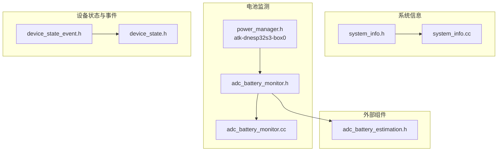
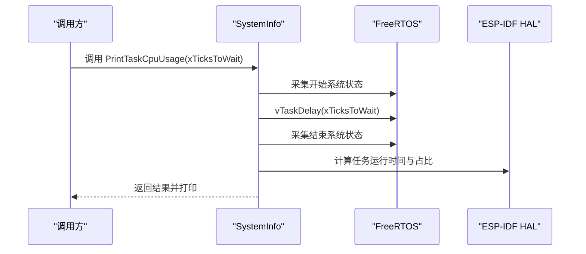
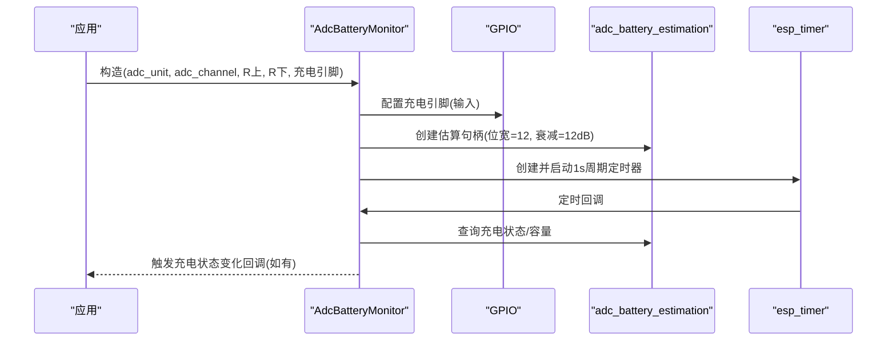
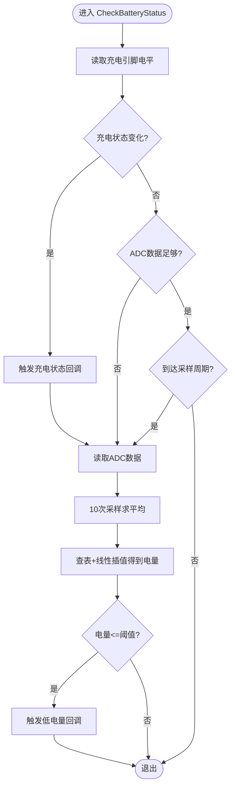
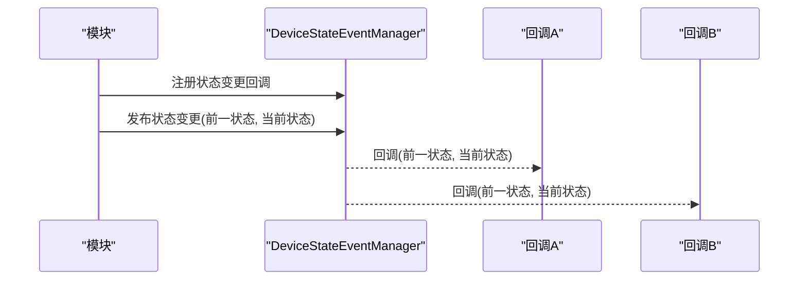
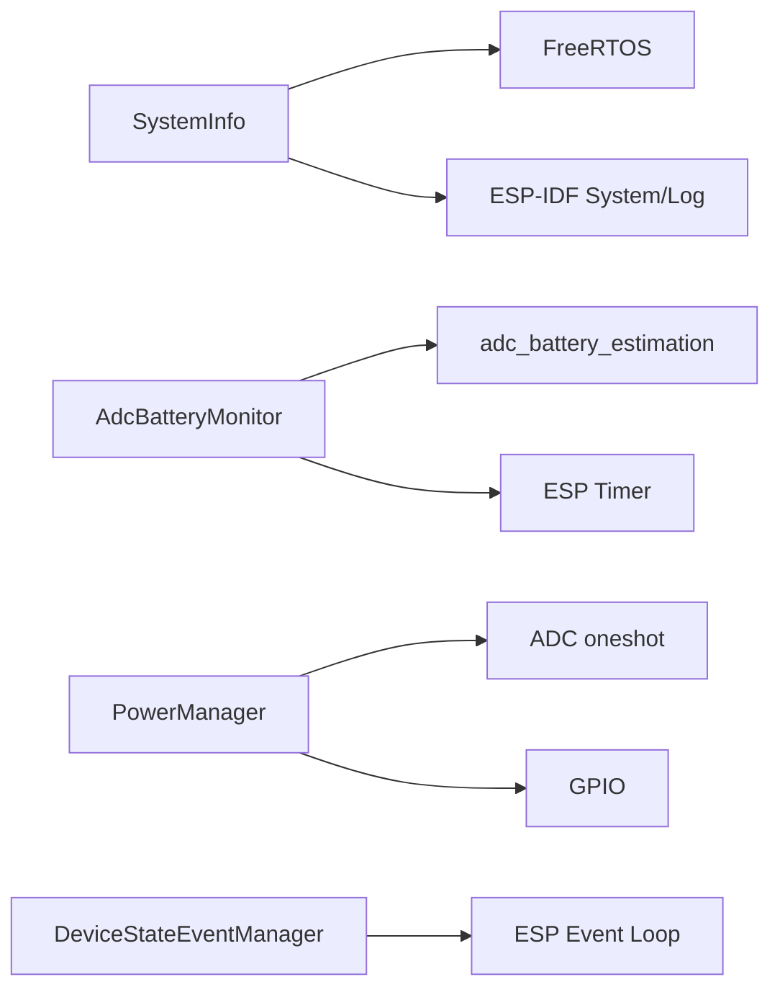

# 系统工具API

<cite>
**本文引用的文件**
- [main/system_info.h](file://main/system_info.h)
- [main/system_info.cc](file://main/system_info.cc)
- [main/boards/common/adc_battery_monitor.h](file://main/boards/common/adc_battery_monitor.h)
- [main/boards/common/adc_battery_monitor.cc](file://main/boards/common/adc_battery_monitor.cc)
- [main/boards/atk-dnesp32s3-box0/power_manager.h](file://main/boards/atk-dnesp32s3-box0/power_manager.h)
- [main/device_state.h](file://main/device_state.h)
- [main/device_state_event.h](file://main/device_state_event.h)
- [managed_components/espressif__adc_battery_estimation/include/adc_battery_estimation.h](file://managed_components/espressif__adc_battery_estimation/include/adc_battery_estimation.h)
</cite>

## 目录
1. [简介](#简介)
2. [项目结构](#项目结构)
3. [核心组件](#核心组件)
4. [架构总览](#架构总览)
5. [详细组件分析](#详细组件分析)
6. [依赖关系分析](#依赖关系分析)
7. [性能考虑](#性能考虑)
8. [故障排查指南](#故障排查指南)
9. [结论](#结论)
10. [附录](#附录)

## 简介
本文件为系统工具集的完整API文档，聚焦以下能力：
- 系统信息获取：芯片型号、MAC地址、闪存容量、堆内存统计、任务CPU使用率与列表打印
- 电池监测：基于ADC的电量估算与充电状态检测（两种实现）
- 温度检测：通过SoC温度传感器进行温度读取（由构建产物可见）
- 电源管理：设备状态机与事件总线，用于统一管理系统运行态与告警
- 性能统计：任务运行时间统计、CPU占用率计算
- 最佳实践与故障诊断：参数配置、采样策略、异常处理与排障建议

本API文档以“可读性优先”的方式呈现，避免直接粘贴源码，所有接口定义均以路径引用的方式标注来源。

## 项目结构
围绕系统工具API，相关模块主要分布在如下位置：
- 系统信息：main/system_info.h/.cc
- 电池监测：main/boards/common/adc_battery_monitor.h/.cc；以及各板卡的电源管理实现（如atk-dnesp32s3-box0/power_manager.h）
- 设备状态与事件：main/device_state.h/.event.h
- 外部组件：managed_components/espressif__adc_battery_estimation/include/adc_battery_estimation.h（用于ADC电量估算）



**图表来源**
- [main/system_info.h](file://main/system_info.h#L1-L22)
- [main/system_info.cc](file://main/system_info.cc#L1-L146)
- [main/boards/common/adc_battery_monitor.h](file://main/boards/common/adc_battery_monitor.h#L1-L31)
- [main/boards/common/adc_battery_monitor.cc](file://main/boards/common/adc_battery_monitor.cc#L1-L81)
- [main/boards/atk-dnesp32s3-box0/power_manager.h](file://main/boards/atk-dnesp32s3-box0/power_manager.h#L1-L194)
- [main/device_state.h](file://main/device_state.h#L1-L18)
- [main/device_state_event.h](file://main/device_state_event.h#L1-L39)
- [managed_components/espressif__adc_battery_estimation/include/adc_battery_estimation.h](file://managed_components/espressif__adc_battery_estimation/include/adc_battery_estimation.h)

**章节来源**
- [main/system_info.h](file://main/system_info.h#L1-L22)
- [main/system_info.cc](file://main/system_info.cc#L1-L146)
- [main/boards/common/adc_battery_monitor.h](file://main/boards/common/adc_battery_monitor.h#L1-L31)
- [main/boards/common/adc_battery_monitor.cc](file://main/boards/common/adc_battery_monitor.cc#L1-L81)
- [main/boards/atk-dnesp32s3-box0/power_manager.h](file://main/boards/atk-dnesp32s3-box0/power_manager.h#L1-L194)
- [main/device_state.h](file://main/device_state.h#L1-L18)
- [main/device_state_event.h](file://main/device_state_event.h#L1-L39)
- [managed_components/espressif__adc_battery_estimation/include/adc_battery_estimation.h](file://managed_components/espressif__adc_battery_estimation/include/adc_battery_estimation.h)

## 核心组件
- SystemInfo：系统信息与性能统计工具
  - 获取闪存大小、最小/当前空闲堆大小
  - 获取MAC地址、芯片型号
  - 打印任务CPU使用率、任务列表、堆统计
- AdcBatteryMonitor：基于ADC的电池监测（封装外部组件）
  - 充电状态检测、放电判断、电量百分比获取
  - 回调注册：充电状态变化通知
- PowerManager（atk-dnesp32s3-box0）：本地ADC电池监测
  - 基于GPIO与ADC的充电状态与电量估算
  - 低电量阈值检测与回调
- DeviceState/DeviceStateEventManager：设备状态机与事件总线
  - 统一的状态枚举与事件发布/订阅机制

**章节来源**
- [main/system_info.h](file://main/system_info.h#L9-L19)
- [main/system_info.cc](file://main/system_info.cc#L17-L145)
- [main/boards/common/adc_battery_monitor.h](file://main/boards/common/adc_battery_monitor.h#L9-L28)
- [main/boards/common/adc_battery_monitor.cc](file://main/boards/common/adc_battery_monitor.cc#L3-L81)
- [main/boards/atk-dnesp32s3-box0/power_manager.h](file://main/boards/atk-dnesp32s3-box0/power_manager.h#L10-L193)
- [main/device_state.h](file://main/device_state.h#L4-L16)
- [main/device_state_event.h](file://main/device_state_event.h#L21-L37)

## 架构总览
系统工具API采用“分层职责”设计：
- 系统信息层：提供底层系统指标（内存、任务、闪存）
- 电源监测层：提供电池与充电状态的抽象（两种实现并存）
- 设备状态层：提供统一的状态机与事件机制，供上层业务使用

```mermaid
classDiagram
class SystemInfo {
+GetFlashSize() size_t
+GetMinimumFreeHeapSize() size_t
+GetFreeHeapSize() size_t
+GetMacAddress() string
+GetChipModelName() string
+PrintTaskCpuUsage(xTicksToWait) esp_err_t
+PrintTaskList() void
+PrintHeapStats() void
}
class AdcBatteryMonitor {
+AdcBatteryMonitor(adc_unit, adc_channel, upper_resistor, lower_resistor, charging_pin)
+~AdcBatteryMonitor()
+IsCharging() bool
+IsDischarging() bool
+GetBatteryLevel() uint8_t
+OnChargingStatusChanged(callback) void
}
class PowerManager {
+PowerManager(charging_pin)
+~PowerManager()
+IsCharging() bool
+IsDischarging() bool
+GetBatteryLevel() uint8_t
+OnChargingStatusChanged(callback) void
+OnLowBatteryStatusChanged(callback) void
}
class DeviceStateEventManager {
+GetInstance() DeviceStateEventManager&
+RegisterStateChangeCallback(cb) void
+PostStateChangeEvent(prev, curr) void
+GetCallbacks() vector<function>
}
AdcBatteryMonitor --> "uses" adc_battery_estimation_h : "外部组件"
PowerManager --> "ADC oneshot" : "驱动"
PowerManager --> "GPIO" : "充电检测"
DeviceStateEventManager --> "DeviceState" : "事件载荷"
```

**图表来源**
- [main/system_info.h](file://main/system_info.h#L9-L19)
- [main/boards/common/adc_battery_monitor.h](file://main/boards/common/adc_battery_monitor.h#L9-L28)
- [main/boards/atk-dnesp32s3-box0/power_manager.h](file://main/boards/atk-dnesp32s3-box0/power_manager.h#L10-L193)
- [main/device_state_event.h](file://main/device_state_event.h#L21-L37)
- [managed_components/espressif__adc_battery_estimation/include/adc_battery_estimation.h](file://managed_components/espressif__adc_battery_estimation/include/adc_battery_estimation.h)

## 详细组件分析

### SystemInfo 系统信息与性能统计
- 功能要点
  - 获取闪存大小：通过底层API查询并返回字节单位
  - 内存统计：最小空闲堆与当前空闲堆
  - 网络标识：MAC地址（兼容不同目标芯片）
  - 芯片型号：返回编译配置中的目标名称
  - 任务性能：采集两次系统状态，计算每个任务的运行时间与占比
  - 任务列表与堆统计：输出可读字符串或日志
- 使用场景
  - 启动阶段诊断与资源评估
  - 运行期性能监控与瓶颈定位
  - OTA升级前的资源检查
- 注意事项
  - 任务CPU使用率计算需要两次采样间隔，采样间隔过短可能误差较大
  - 日志输出依赖ESP_LOG，需确保日志级别允许



**图表来源**
- [main/system_info.cc](file://main/system_info.cc#L50-L133)

**章节来源**
- [main/system_info.h](file://main/system_info.h#L9-L19)
- [main/system_info.cc](file://main/system_info.cc#L17-L145)

### AdcBatteryMonitor 基于ADC的电池监测（外部组件封装）
- 功能要点
  - 构造参数：ADC单元、通道、分压电阻、充电引脚
  - 充电状态检测：通过外部组件回调读取GPIO电平
  - 电量估算：基于外部组件提供的容量接口
  - 回调：充电状态变化通知
- 技术规格（来自构造与初始化）
  - ADC位宽：12位
  - ADC衰减：12dB
  - 采样周期：1秒（定时器周期）
- 适用场景
  - 需要与外部ADC电池估算组件集成的设备
  - 对充电状态与电量有实时需求的应用



**图表来源**
- [main/boards/common/adc_battery_monitor.cc](file://main/boards/common/adc_battery_monitor.cc#L3-L81)
- [main/boards/common/adc_battery_monitor.h](file://main/boards/common/adc_battery_monitor.h#L9-L28)
- [managed_components/espressif__adc_battery_estimation/include/adc_battery_estimation.h](file://managed_components/espressif__adc_battery_estimation/include/adc_battery_estimation.h)

**章节来源**
- [main/boards/common/adc_battery_monitor.h](file://main/boards/common/adc_battery_monitor.h#L9-L28)
- [main/boards/common/adc_battery_monitor.cc](file://main/boards/common/adc_battery_monitor.cc#L3-L81)

### PowerManager（atk-dnesp32s3-box0）本地ADC电池监测
- 功能要点
  - 充电状态：通过GPIO电平判断（低电平视为充电中）
  - 电量估算：滑动窗口平均ADC值，查表线性插值得到百分比
  - 低电量检测：超过阈值触发回调
  - 定时采样：每秒一次，但仅在必要时更新
- 技术规格（来自实现）
  - ADC单元：ADC_UNIT_1
  - ADC通道：ADC_CHANNEL_0
  - ADC位宽：12位
  - ADC衰减：12dB
  - 采样次数：10次取平均
  - 采样间隔：1秒
  - 低电量阈值：≤20%
  - 电量表：5段区间，线性插值
- 适用场景
  - 自研板卡的本地ADC电量方案
  - 不依赖外部组件的轻量级电池监测



**图表来源**
- [main/boards/atk-dnesp32s3-box0/power_manager.h](file://main/boards/atk-dnesp32s3-box0/power_manager.h#L27-L125)

**章节来源**
- [main/boards/atk-dnesp32s3-box0/power_manager.h](file://main/boards/atk-dnesp32s3-box0/power_manager.h#L10-L193)

### 设备状态机与事件总线
- DeviceState：设备运行态枚举，覆盖从启动到致命错误的全生命周期
- DeviceStateEventManager：单例事件管理器，支持注册回调、发布事件、并发安全
- 使用场景
  - 统一管理设备状态切换（如从“启动中”到“空闲”）
  - 事件驱动的UI/LED/音频提示联动
  - 跨模块解耦的状态传播



**图表来源**
- [main/device_state_event.h](file://main/device_state_event.h#L21-L37)
- [main/device_state.h](file://main/device_state.h#L4-L16)

**章节来源**
- [main/device_state.h](file://main/device_state.h#L4-L16)
- [main/device_state_event.h](file://main/device_state_event.h#L10-L37)

## 依赖关系分析
- SystemInfo 依赖 FreeRTOS、ESP-IDF系统与日志组件
- AdcBatteryMonitor 依赖外部组件 adc_battery_estimation 与 ESP Timer
- PowerManager 依赖 ESP ADC oneshot 与 GPIO
- 设备状态事件依赖 ESP Event Loop



**图表来源**
- [main/system_info.cc](file://main/system_info.cc#L1-L13)
- [main/boards/common/adc_battery_monitor.cc](file://main/boards/common/adc_battery_monitor.cc#L1-L44)
- [main/boards/atk-dnesp32s3-box0/power_manager.h](file://main/boards/atk-dnesp32s3-box0/power_manager.h#L130-L157)
- [main/device_state_event.h](file://main/device_state_event.h#L4-L10)

**章节来源**
- [main/system_info.cc](file://main/system_info.cc#L1-L13)
- [main/boards/common/adc_battery_monitor.cc](file://main/boards/common/adc_battery_monitor.cc#L1-L44)
- [main/boards/atk-dnesp32s3-box0/power_manager.h](file://main/boards/atk-dnesp32s3-box0/power_manager.h#L130-L157)
- [main/device_state_event.h](file://main/device_state_event.h#L4-L10)

## 性能考虑
- 采样频率与精度
  - SystemInfo任务CPU使用率计算：两次采样间隔越大，越稳定但越不实时
  - AdcBatteryMonitor：1秒周期，适合一般设备；若需更灵敏，可缩短周期并增加滤波
  - PowerManager：1秒周期，内部对ADC做10次采样取平均，兼顾噪声抑制
- 内存与功耗
  - SystemInfo的两次系统状态采集会临时分配数组，注意内存紧张场景
  - 电池监测定时器与ADC驱动在后台运行，建议在低功耗模式下合理降低采样频率
- 线程模型
  - 电池监测使用ESP Timer回调，避免阻塞主线程
  - 设备状态事件为同步回调，回调内应避免长时间阻塞

[本节为通用指导，无需列出具体文件来源]

## 故障排查指南
- 无法获取任务CPU使用率
  - 检查是否正确传入了两次采样间隔
  - 确认系统启用了运行时间统计功能
  - 参考：[main/system_info.cc](file://main/system_info.cc#L50-L133)
- 电量读数异常
  - 分压电阻配置是否正确（上下拉电阻）
  - ADC衰减与位宽设置是否匹配实际硬件
  - 是否存在外部干扰导致采样抖动
  - 参考：[main/boards/common/adc_battery_monitor.cc](file://main/boards/common/adc_battery_monitor.cc#L17-L32)
- 充电状态误判
  - 充电引脚电平逻辑是否与硬件一致（低电平表示充电中）
  - 是否存在上拉/下拉配置不当
  - 参考：[main/boards/atk-dnesp32s3-box0/power_manager.h](file://main/boards/atk-dnesp32s3-box0/power_manager.h#L27-L49)
- 低电量告警不触发
  - 低电量阈值是否合理
  - 采样周期是否过长导致响应滞后
  - 参考：[main/boards/atk-dnesp32s3-box0/power_manager.h](file://main/boards/atk-dnesp32s3-box0/power_manager.h#L21-L23)
- 设备状态事件未生效
  - 是否已注册回调
  - 是否在正确的线程上下文中发布事件
  - 参考：[main/device_state_event.h](file://main/device_state_event.h#L21-L37)

**章节来源**
- [main/system_info.cc](file://main/system_info.cc#L50-L133)
- [main/boards/common/adc_battery_monitor.cc](file://main/boards/common/adc_battery_monitor.cc#L17-L32)
- [main/boards/atk-dnesp32s3-box0/power_manager.h](file://main/boards/atk-dnesp32s3-box0/power_manager.h#L21-L49)
- [main/device_state_event.h](file://main/device_state_event.h#L21-L37)

## 结论
本系统工具集提供了从系统指标、电池监测到设备状态管理的完整能力矩阵。通过两套电池监测实现（外部组件封装与本地ADC方案），可在不同硬件形态下灵活选择；配合设备状态事件总线，可实现跨模块的解耦协作。建议在实际部署中结合应用场景调整采样频率与阈值，并关注内存与功耗的平衡。

[本节为总结性内容，无需列出具体文件来源]

## 附录

### API清单与说明（按模块）
- SystemInfo
  - 获取闪存大小：返回字节单位
  - 获取最小空闲堆：返回字节单位
  - 获取当前空闲堆：返回字节单位
  - 获取MAC地址：返回形如“xx:xx:xx:xx:xx:xx”的字符串
  - 获取芯片型号：返回编译目标名称
  - 打印任务CPU使用率：输出每个任务的运行时间与占比
  - 打印任务列表：输出可读的任务状态
  - 打印堆统计：输出内部SRAM的空闲与最小空闲
  - 参考：[main/system_info.h](file://main/system_info.h#L9-L19)，[main/system_info.cc](file://main/system_info.cc#L17-L145)

- AdcBatteryMonitor
  - 构造函数：指定ADC单元/通道、分压电阻、充电引脚
  - IsCharging：是否处于充电状态
  - IsDischarging：是否处于放电状态
  - GetBatteryLevel：返回电量百分比
  - OnChargingStatusChanged：注册充电状态变化回调
  - 参考：[main/boards/common/adc_battery_monitor.h](file://main/boards/common/adc_battery_monitor.h#L9-L28)，[main/boards/common/adc_battery_monitor.cc](file://main/boards/common/adc_battery_monitor.cc#L3-L81)

- PowerManager（atk-dnesp32s3-box0）
  - 构造函数：指定充电引脚
  - IsCharging/IsDischarging/GetBatteryLevel：同上
  - OnChargingStatusChanged/OnLowBatteryStatusChanged：注册回调
  - 参考：[main/boards/atk-dnesp32s3-box0/power_manager.h](file://main/boards/atk-dnesp32s3-box0/power_manager.h#L127-L193)

- 设备状态与事件
  - DeviceState：设备状态枚举
  - DeviceStateEventManager：单例事件管理器
  - 参考：[main/device_state.h](file://main/device_state.h#L4-L16)，[main/device_state_event.h](file://main/device_state_event.h#L21-L37)

**章节来源**
- [main/system_info.h](file://main/system_info.h#L9-L19)
- [main/system_info.cc](file://main/system_info.cc#L17-L145)
- [main/boards/common/adc_battery_monitor.h](file://main/boards/common/adc_battery_monitor.h#L9-L28)
- [main/boards/common/adc_battery_monitor.cc](file://main/boards/common/adc_battery_monitor.cc#L3-L81)
- [main/boards/atk-dnesp32s3-box0/power_manager.h](file://main/boards/atk-dnesp32s3-box0/power_manager.h#L127-L193)
- [main/device_state.h](file://main/device_state.h#L4-L16)
- [main/device_state_event.h](file://main/device_state_event.h#L21-L37)