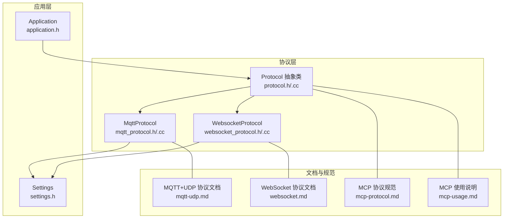
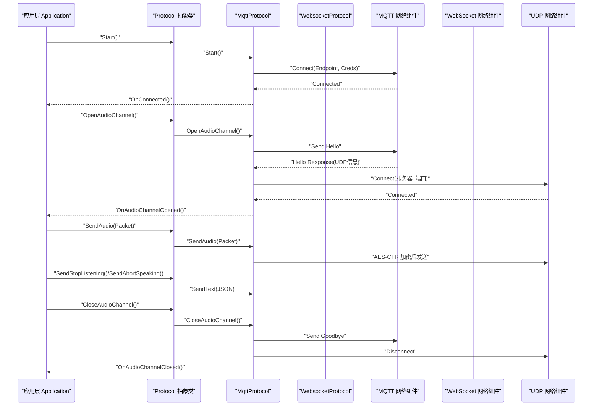
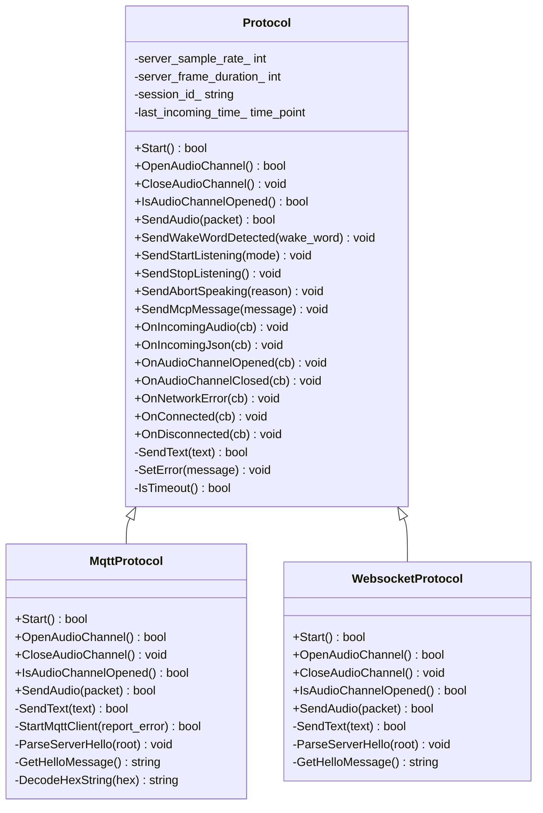
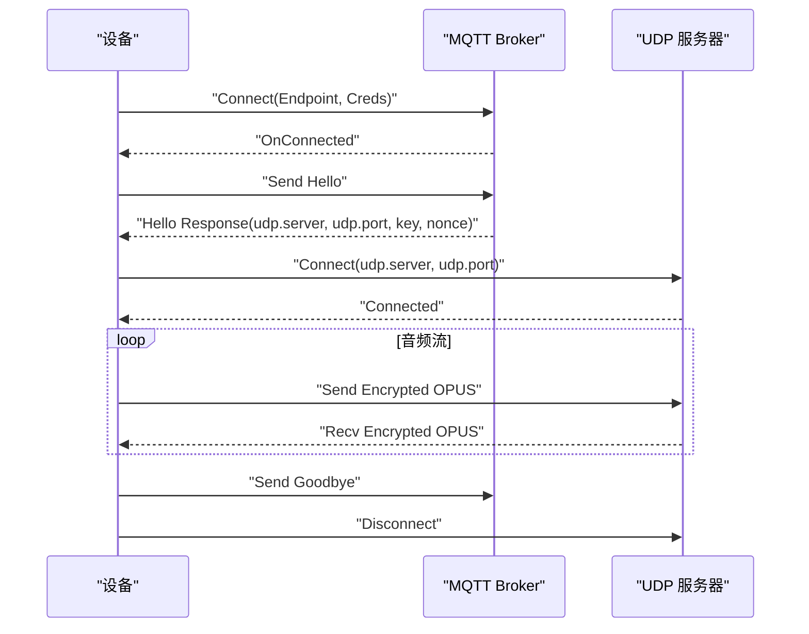
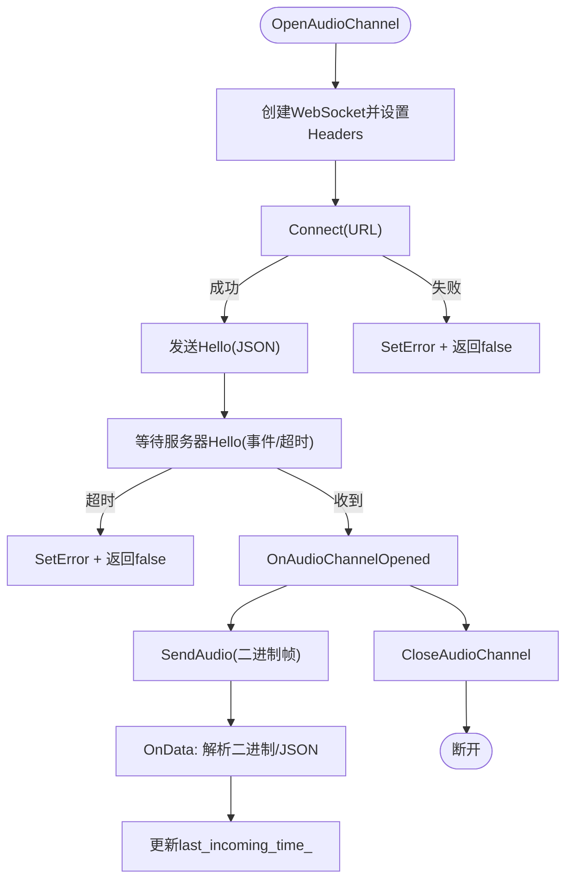
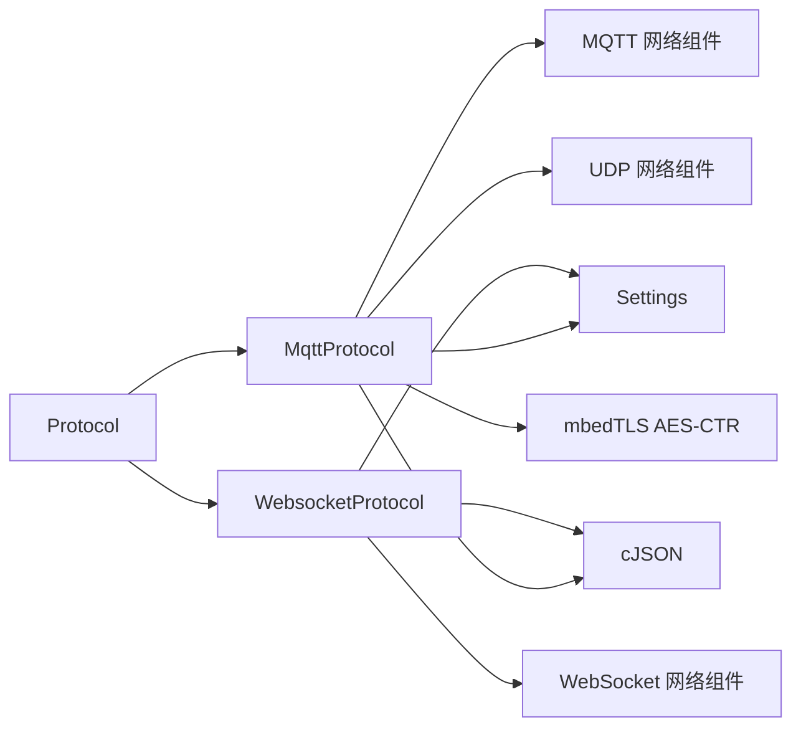

# 通信协议API

<cite>
**本文引用的文件**
- [protocol.h](file://main/protocols/protocol.h)
- [protocol.cc](file://main/protocols/protocol.cc)
- [mqtt_protocol.h](file://main/protocols/mqtt_protocol.h)
- [mqtt_protocol.cc](file://main/protocols/mqtt_protocol.cc)
- [websocket_protocol.h](file://main/protocols/websocket_protocol.h)
- [websocket_protocol.cc](file://main/protocols/websocket_protocol.cc)
- [application.h](file://main/application.h)
- [settings.h](file://main/settings.h)
- [mqtt-udp.md](file://docs/mqtt-udp.md)
- [websocket.md](file://docs/websocket.md)
- [mcp-protocol.md](file://docs/mcp-protocol.md)
- [mcp-usage.md](file://docs/mcp-usage.md)
</cite>

## 目录
1. [简介](#简介)
2. [项目结构](#项目结构)
3. [核心组件](#核心组件)
4. [架构总览](#架构总览)
5. [详细组件分析](#详细组件分析)
6. [依赖关系分析](#依赖关系分析)
7. [性能考量](#性能考量)
8. [故障排查指南](#故障排查指南)
9. [结论](#结论)
10. [附录](#附录)

## 简介
本文件为通信协议系统的完整API文档，聚焦于Protocol抽象类及其MQTT、WebSocket实现。文档覆盖协议初始化、连接管理、消息收发、状态监控、配置参数、消息格式、错误处理与安全机制，并提供不同协议的使用示例与性能优化建议。读者可据此快速理解并集成设备端与服务器之间的音视频与控制消息交互。

## 项目结构
通信协议相关代码位于main/protocols目录，配合应用层入口main/application.h与配置读写main/settings.h共同构成完整的协议栈。

图表来源
- [protocol.h](file://main/protocols/protocol.h#L44-L95)
- [mqtt_protocol.h](file://main/protocols/mqtt_protocol.h#L24-L57)
- [websocket_protocol.h](file://main/protocols/websocket_protocol.h#L13-L32)
- [application.h](file://main/application.h#L67-L69)
- [settings.h](file://main/settings.h#L7-L26)
- [mqtt-udp.md](file://docs/mqtt-udp.md#L1-L393)
- [websocket.md](file://docs/websocket.md#L1-L496)
- [mcp-protocol.md](file://docs/mcp-protocol.md#L1-L270)
- [mcp-usage.md](file://docs/mcp-usage.md#L1-L115)

章节来源
- [protocol.h](file://main/protocols/protocol.h#L1-L99)
- [protocol.cc](file://main/protocols/protocol.cc#L1-L91)
- [mqtt_protocol.h](file://main/protocols/mqtt_protocol.h#L1-L61)
- [mqtt_protocol.cc](file://main/protocols/mqtt_protocol.cc#L1-L369)
- [websocket_protocol.h](file://main/protocols/websocket_protocol.h#L1-L35)
- [websocket_protocol.cc](file://main/protocols/websocket_protocol.cc#L1-L254)
- [application.h](file://main/application.h#L1-L91)
- [settings.h](file://main/settings.h#L1-L29)
- [mqtt-udp.md](file://docs/mqtt-udp.md#L1-L393)
- [websocket.md](file://docs/websocket.md#L1-L496)
- [mcp-protocol.md](file://docs/mcp-protocol.md#L1-L270)
- [mcp-usage.md](file://docs/mcp-usage.md#L1-L115)

## 核心组件
- Protocol抽象类：定义统一的协议接口，包括音频通道管理、消息回调、通用控制消息发送（开始/停止监听、唤醒词检测、中止说话、MCP消息）、超时检测与错误上报等。
- MqttProtocol：基于MQTT控制通道与UDP音频通道的混合协议实现，负责MQTT连接、hello/goodbye消息、UDP通道建立与加密封装、序列号管理与错误处理。
- WebsocketProtocol：基于WebSocket的纯通道协议实现，负责握手、二进制协议版本适配（版本1/2/3）、音频帧解析与发送、JSON消息解析与回调。

章节来源
- [protocol.h](file://main/protocols/protocol.h#L44-L95)
- [protocol.cc](file://main/protocols/protocol.cc#L1-L91)
- [mqtt_protocol.h](file://main/protocols/mqtt_protocol.h#L24-L57)
- [websocket_protocol.h](file://main/protocols/websocket_protocol.h#L13-L32)

## 架构总览
协议层向上提供统一接口，向下分别对接MQTT与WebSocket网络组件。应用层通过Application持有Protocol实例，按需打开/关闭音频通道并发送控制消息。

图表来源
- [protocol.h](file://main/protocols/protocol.h#L66-L75)
- [protocol.cc](file://main/protocols/protocol.cc#L42-L79)
- [mqtt_protocol.cc](file://main/protocols/mqtt_protocol.cc#L44-L137)
- [mqtt_protocol.cc](file://main/protocols/mqtt_protocol.cc#L194-L274)
- [mqtt_protocol.cc](file://main/protocols/mqtt_protocol.cc#L177-L192)
- [mqtt-udp.md](file://docs/mqtt-udp.md#L22-L57)

章节来源
- [protocol.h](file://main/protocols/protocol.h#L44-L95)
- [protocol.cc](file://main/protocols/protocol.cc#L1-L91)
- [mqtt_protocol.cc](file://main/protocols/mqtt_protocol.cc#L1-L369)
- [mqtt-udp.md](file://docs/mqtt-udp.md#L1-L393)

## 详细组件分析

### Protocol 抽象类
- 职责
  - 统一音频通道生命周期管理：Start、OpenAudioChannel、CloseAudioChannel、IsAudioChannelOpened
  - 统一消息发送接口：SendAudio、SendWakeWordDetected、SendStartListening、SendStopListening、SendAbortSpeaking、SendMcpMessage
  - 统一回调注册：OnIncomingAudio、OnIncomingJson、OnAudioChannelOpened、OnAudioChannelClosed、OnNetworkError、OnConnected、OnDisconnected
  - 基础能力：超时检测IsTimeout、错误上报SetError、会话ID与采样率/帧时长参数维护
- 关键数据结构
  - AudioStreamPacket：包含采样率、帧时长、时间戳、payload
  - BinaryProtocol2/BinaryProtocol3：WebSocket二进制协议版本的打包结构
  - 枚举：AbortReason、ListeningMode
- 通用控制消息
  - WakeWordDetected、StartListening、StopListening、AbortSpeaking、McpMessage均通过SendText发送JSON

图表来源
- [protocol.h](file://main/protocols/protocol.h#L44-L95)
- [mqtt_protocol.h](file://main/protocols/mqtt_protocol.h#L24-L57)
- [websocket_protocol.h](file://main/protocols/websocket_protocol.h#L13-L32)

章节来源
- [protocol.h](file://main/protocols/protocol.h#L10-L95)
- [protocol.cc](file://main/protocols/protocol.cc#L1-L91)

### MqttProtocol 实现
- 初始化与连接
  - 通过Settings读取endpoint、client_id、username、password、keepalive、publish_topic
  - 创建MQTT客户端，设置心跳、连接/断开回调
  - OnMessage中解析JSON，识别hello/goodbye或其他业务消息
- 音频通道
  - OpenAudioChannel：发送hello消息，等待服务器响应；随后创建UDP并连接，设置OnMessage回调解析加密音频帧
  - SendAudio：使用AES-CTR对音频payload加密，附加nonce与序列号后发送
  - CloseAudioChannel：发送goodbye并断开UDP
- 错误与超时
  - SetError触发网络错误回调
  - IsTimeout基于last_incoming_time_判断通道超时
- 配置参数
  - MQTT：endpoint、client_id、username、password、keepalive、publish_topic
  - 音频参数：opus、采样率16kHz、单声道、帧时长60ms（设备端）

图表来源
- [mqtt_protocol.cc](file://main/protocols/mqtt_protocol.cc#L44-L137)
- [mqtt_protocol.cc](file://main/protocols/mqtt_protocol.cc#L194-L274)
- [mqtt_protocol.cc](file://main/protocols/mqtt_protocol.cc#L151-L175)
- [mqtt-udp.md](file://docs/mqtt-udp.md#L22-L57)

章节来源
- [mqtt_protocol.h](file://main/protocols/mqtt_protocol.h#L1-L61)
- [mqtt_protocol.cc](file://main/protocols/mqtt_protocol.cc#L1-L369)
- [mqtt-udp.md](file://docs/mqtt-udp.md#L61-L393)

### WebsocketProtocol 实现
- 初始化与连接
  - Start立即返回true（按需连接），OpenAudioChannel时才创建WebSocket并连接
  - 设置Authorization、Protocol-Version、Device-Id、Client-Id等头部
- 音频通道
  - SendAudio根据版本选择：直接发送二进制Opus（版本1）、或使用BinaryProtocol2/3（版本2/3）
  - OnData回调中解析二进制帧或JSON消息，触发相应回调
- 握手与会话
  - 发送hello消息，等待服务器hello确认；记录session_id与服务器音频参数
- 错误与超时
  - SendText失败时SetError；OnDisconnected触发通道关闭回调

图表来源
- [websocket_protocol.cc](file://main/protocols/websocket_protocol.cc#L82-L200)
- [websocket_protocol.cc](file://main/protocols/websocket_protocol.cc#L28-L72)
- [websocket_protocol.cc](file://main/protocols/websocket_protocol.cc#L111-L165)
- [websocket.md](file://docs/websocket.md#L7-L80)

章节来源
- [websocket_protocol.h](file://main/protocols/websocket_protocol.h#L1-L35)
- [websocket_protocol.cc](file://main/protocols/websocket_protocol.cc#L1-L254)
- [websocket.md](file://docs/websocket.md#L1-L496)

### 消息格式与协议版本

- 通用控制消息（通过SendText发送）
  - WakeWordDetected：type="listen", state="detect"
  - StartListening：type="listen", state="start"，mode可为auto/manual/realtime
  - StopListening：type="listen", state="stop"
  - AbortSpeaking：type="abort", reason可为wake_word_detected
  - MCP消息：type="mcp"，payload为JSON-RPC 2.0
- WebSocket二进制协议版本
  - 版本1：直接发送Opus二进制帧
  - 版本2：BinaryProtocol2，含version/type/reserved/timestamp/payload_size/payload
  - 版本3：BinaryProtocol3，含type/reserved/payload_size/payload
- MQTT+UDP音频包结构
  - 类型type=0x01，flags保留，payload_len、ssrc、timestamp、sequence、payload（加密Opus）

章节来源
- [protocol.cc](file://main/protocols/protocol.cc#L42-L79)
- [websocket.md](file://docs/websocket.md#L95-L125)
- [websocket.md](file://docs/websocket.md#L132-L292)
- [mqtt-udp.md](file://docs/mqtt-udp.md#L186-L223)

### 配置参数与使用示例

- MQTT配置（MqttProtocol）
  - endpoint：MQTT服务器地址与端口
  - client_id：设备唯一标识
  - username/password：认证凭据
  - keepalive：心跳间隔（秒）
  - publish_topic：发布主题
  - 音频参数：opus、16kHz、单声道、帧时长60ms
- WebSocket配置（WebsocketProtocol）
  - url：WebSocket服务器URL
  - token：访问令牌（可带Bearer前缀）
  - version：协议版本（1/2/3）
  - Headers：Protocol-Version、Device-Id、Client-Id
- 使用示例（基于代码行为）
  - MQTT+UDP：在Application中创建MqttProtocol实例，调用Start/OpenAudioChannel后发送音频；收到服务器hello后建立UDP通道
  - WebSocket：在需要时调用OpenAudioChannel，发送hello并等待确认；根据version选择二进制协议

章节来源
- [mqtt_protocol.cc](file://main/protocols/mqtt_protocol.cc#L54-L61)
- [websocket_protocol.cc](file://main/protocols/websocket_protocol.cc#L83-L89)
- [websocket_protocol.cc](file://main/protocols/websocket_protocol.cc#L100-L109)
- [application.h](file://main/application.h#L67-L69)
- [settings.h](file://main/settings.h#L7-L26)
- [mqtt-udp.md](file://docs/mqtt-udp.md#L259-L277)
- [websocket.md](file://docs/websocket.md#L82-L91)

## 依赖关系分析
- 组件耦合
  - Protocol为抽象基类，MqttProtocol/WebsocketProtocol继承实现，耦合度低
  - 两者均依赖Settings读取配置，依赖Board/Network组件创建MQTT/WebSocket/Udp实例
- 外部依赖
  - MQTT：esp-mqtt库
  - WebSocket：esp-websocket库
  - UDP：自定义Udp封装
  - JSON解析：cJSON
  - 加密：mbedTLS AES-CTR
- 潜在风险
  - MQTT断线自动重连，但UDP连接失败不自动重试，需依赖MQTT通道重新协商
  - WebSocket二进制协议版本需与服务器一致，否则解析失败

图表来源
- [protocol.h](file://main/protocols/protocol.h#L44-L95)
- [mqtt_protocol.h](file://main/protocols/mqtt_protocol.h#L5-L17)
- [websocket_protocol.h](file://main/protocols/websocket_protocol.h#L5-L9)
- [settings.h](file://main/settings.h#L7-L26)

章节来源
- [mqtt_protocol.h](file://main/protocols/mqtt_protocol.h#L1-L61)
- [websocket_protocol.h](file://main/protocols/websocket_protocol.h#L1-L35)
- [settings.h](file://main/settings.h#L1-L29)

## 性能考量
- 并发与资源
  - MqttProtocol使用互斥锁保护UDP连接，避免并发问题
  - 智能指针管理音频包与网络对象，减少内存泄漏风险
- 网络优化
  - WebSocket二进制协议版本2/3携带时间戳与payload_size，便于服务器端AEC与解析
  - MQTT+UDP分离控制与数据通道，提升实时性
- 超时与健康检查
  - 基类提供120秒超时检测，避免长时间无响应导致的状态僵化
  - 事件组用于握手等待，避免忙轮询

章节来源
- [mqtt_protocol.cc](file://main/protocols/mqtt_protocol.cc#L151-L175)
- [protocol.cc](file://main/protocols/protocol.cc#L81-L90)
- [websocket.md](file://docs/websocket.md#L323-L346)
- [mqtt-udp.md](file://docs/mqtt-udp.md#L323-L343)

## 故障排查指南
- 连接失败
  - MQTT：检查endpoint、认证信息、端口；查看OnDisconnected回调与SetError错误消息
  - WebSocket：检查url、token、headers；确认握手成功与hello确认
- 通道不可用
  - 检查IsAudioChannelOpened返回值与error_occurred_状态
  - 确认last_incoming_time_未超时
- 音频异常
  - MQTT+UDP：核对UDP服务器地址/端口、密钥与nonce；检查AES解密返回值
  - WebSocket：核对协议版本与二进制帧结构；确认Opus编码参数一致
- MCP消息
  - 确认payload为合法JSON-RPC 2.0；检查method与params/id匹配

章节来源
- [mqtt_protocol.cc](file://main/protocols/mqtt_protocol.cc#L74-L87)
- [websocket_protocol.cc](file://main/protocols/websocket_protocol.cc#L167-L172)
- [protocol.cc](file://main/protocols/protocol.cc#L35-L40)
- [mcp-protocol.md](file://docs/mcp-protocol.md#L7-L36)

## 结论
本协议体系通过统一的Protocol抽象，提供了MQTT+UDP与WebSocket两种高效稳定的通信路径。前者强调实时音频传输与加密，后者强调易部署与高可靠性。配合完善的错误处理、超时检测与MCP协议，系统在复杂网络环境下仍能保持良好的稳定性与扩展性。

## 附录

### API清单（Protocol抽象类）
- 生命周期
  - Start(): 启动协议
  - OpenAudioChannel(): 打开音频通道
  - CloseAudioChannel(): 关闭音频通道
  - IsAudioChannelOpened(): 查询通道状态
- 消息发送
  - SendAudio(packet): 发送音频帧
  - SendWakeWordDetected(wake_word): 唤醒词检测上报
  - SendStartListening(mode): 开始监听
  - SendStopListening(): 停止监听
  - SendAbortSpeaking(reason): 中止说话
  - SendMcpMessage(payload): 发送MCP消息
- 回调注册
  - OnIncomingAudio(cb)、OnIncomingJson(cb)、OnAudioChannelOpened(cb)、OnAudioChannelClosed(cb)、OnNetworkError(cb)、OnConnected(cb)、OnDisconnected(cb)

章节来源
- [protocol.h](file://main/protocols/protocol.h#L66-L75)
- [protocol.cc](file://main/protocols/protocol.cc#L7-L33)

### MQTT+UDP 与 WebSocket 的对比
- 传输通道：MQTT+UDP（控制+UDP音频），WebSocket（控制+WebSocket音频）
- 实时性：UDP更高
- 可靠性：WebSocket更高
- 复杂度：MQTT+UDP更高
- 加密：AES-CTR vs TLS
- 防火墙友好度：WebSocket更友好

章节来源
- [mqtt-udp.md](file://docs/mqtt-udp.md#L346-L357)
- [websocket.md](file://docs/websocket.md#L381-L398)