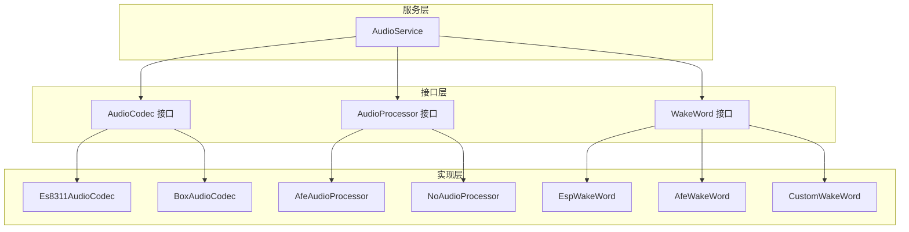
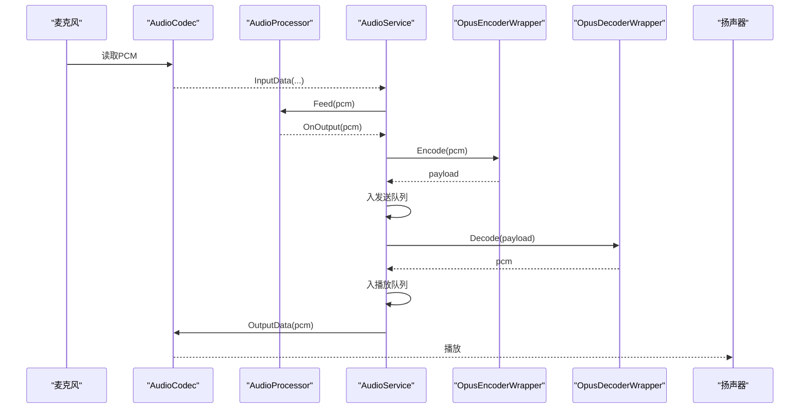
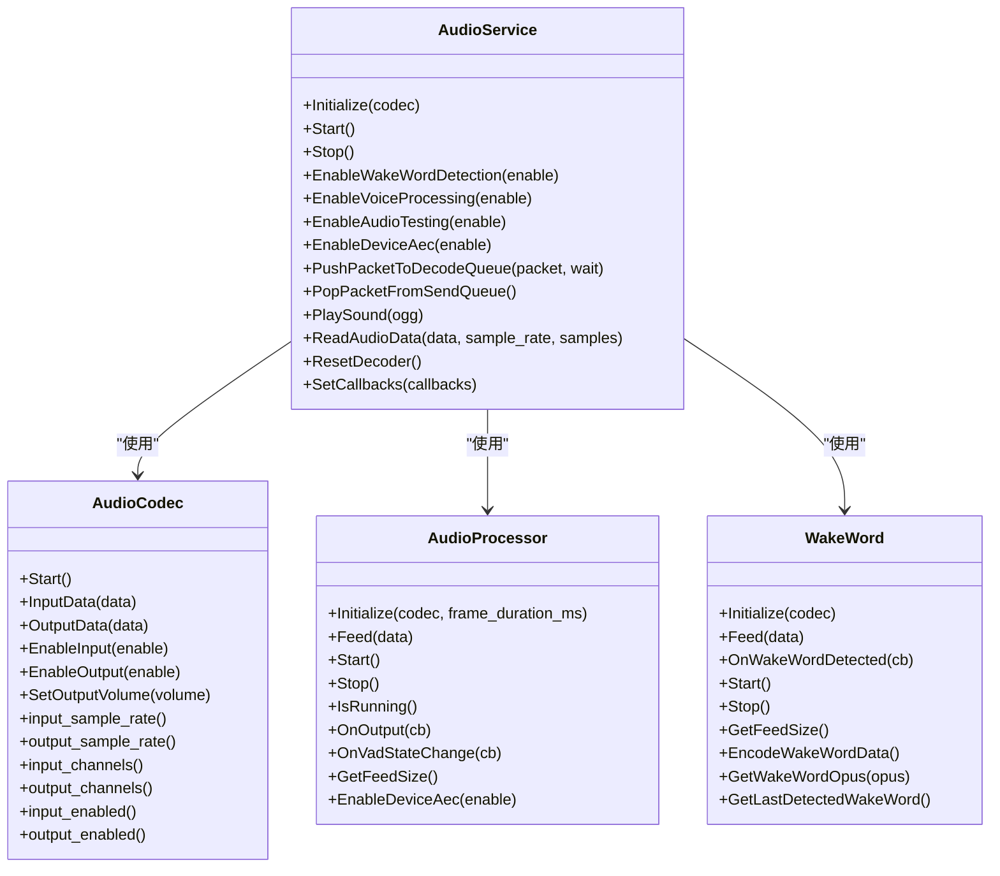

# 音频服务API

<cite>
**本文引用的文件**
- [main/audio/audio_service.h](file://main/audio/audio_service.h)
- [main/audio/audio_service.cc](file://main/audio/audio_service.cc)
- [main/audio/audio_codec.h](file://main/audio/audio_codec.h)
- [main/audio/audio_processor.h](file://main/audio/audio_processor.h)
- [main/audio/wake_word.h](file://main/audio/wake_word.h)
- [main/audio/codecs/box_audio_codec.h](file://main/audio/codecs/box_audio_codec.h)
- [main/audio/codecs/es8311_audio_codec.h](file://main/audio/codecs/es8311_audio_codec.h)
- [main/audio/processors/afe_audio_processor.h](file://main/audio/processors/afe_audio_processor.h)
- [main/audio/processors/no_audio_processor.h](file://main/audio/processors/no_audio_processor.h)
- [main/audio/wake_words/esp_wake_word.h](file://main/audio/wake_words/esp_wake_word.h)
- [main/audio/wake_words/afe_wake_word.h](file://main/audio/wake_words/afe_wake_word.h)
- [main/audio/wake_words/custom_wake_word.h](file://main/audio/wake_words/custom_wake_word.h)
- [main/audio/processors/audio_debugger.h](file://main/audio/processors/audio_debugger.h)
- [main/audio/processors/audio_debugger.cc](file://main/audio/processors/audio_debugger.cc)
</cite>

## 目录
1. [简介](#简介)
2. [项目结构](#项目结构)
3. [核心组件](#核心组件)
4. [架构总览](#架构总览)
5. [详细组件分析](#详细组件分析)
6. [依赖关系分析](#依赖关系分析)
7. [性能考量](#性能考量)
8. [故障排查指南](#故障排查指南)
9. [结论](#结论)
10. [附录](#附录)

## 简介
本文件为“音频服务系统”的完整API文档，聚焦于AudioService类及其相关组件（音频编解码器接口、音频处理器接口、唤醒词检测接口、音频队列与多线程管理）的公共API说明。内容涵盖：
- 音频初始化、编解码器配置、音频流处理、多线程音频管理
- 音频格式支持、采样率配置、音频质量控制
- 音频处理流程的API使用示例与最佳实践

## 项目结构
音频子系统位于main/audio目录，采用“接口抽象 + 多实现 + 服务编排”的分层设计：
- 接口层：AudioCodec、AudioProcessor、WakeWord
- 实现层：多种编解码器（如ES8311、Box）、处理器（AFE/No）、唤醒词（ESP/AFE/自定义）
- 服务层：AudioService负责任务调度、队列管理、编解码与播放控制

图表来源
- [main/audio/audio_codec.h](file://main/audio/audio_codec.h#L18-L60)
- [main/audio/audio_processor.h](file://main/audio/audio_processor.h#L10-L26)
- [main/audio/wake_word.h](file://main/audio/wake_word.h#L10-L26)
- [main/audio/codecs/es8311_audio_codec.h](file://main/audio/codecs/es8311_audio_codec.h#L13-L42)
- [main/audio/codecs/box_audio_codec.h](file://main/audio/codecs/box_audio_codec.h#L11-L41)
- [main/audio/processors/afe_audio_processor.h](file://main/audio/processors/afe_audio_processor.h#L16-L45)
- [main/audio/processors/no_audio_processor.h](file://main/audio/processors/no_audio_processor.h#L10-L33)
- [main/audio/wake_words/esp_wake_word.h](file://main/audio/wake_words/esp_wake_word.h#L16-L43)
- [main/audio/wake_words/afe_wake_word.h](file://main/audio/wake_words/afe_wake_word.h#L22-L61)
- [main/audio/wake_words/custom_wake_word.h](file://main/audio/wake_words/custom_wake_word.h#L20-L59)
- [main/audio/audio_service.h](file://main/audio/audio_service.h#L81-L157)

章节来源
- [main/audio/audio_service.h](file://main/audio/audio_service.h#L1-L157)
- [main/audio/audio_service.cc](file://main/audio/audio_service.cc#L1-L669)

## 核心组件
- AudioService：音频服务主控制器，负责初始化、启动/停止、事件组控制、队列管理、编解码与播放、回调注册、音频测试、设备回声消除开关等。
- AudioCodec：音频编解码器抽象接口，统一输入输出、采样率、通道数、音量、启用/禁用等能力。
- AudioProcessor：音频处理器抽象接口，统一初始化、喂入、开始/停止、运行状态、VAD回调、设备AEC开关等。
- WakeWord：唤醒词检测抽象接口，统一初始化、喂入、回调、开始/停止、编码唤醒词数据、获取最后检测到的唤醒词等。

章节来源
- [main/audio/audio_service.h](file://main/audio/audio_service.h#L81-L157)
- [main/audio/audio_codec.h](file://main/audio/audio_codec.h#L18-L60)
- [main/audio/audio_processor.h](file://main/audio/audio_processor.h#L10-L26)
- [main/audio/wake_word.h](file://main/audio/wake_word.h#L10-L26)

## 架构总览
音频系统采用“双任务 + 多队列”的异步架构：
- 输入任务：从编解码器读取PCM，按需送入唤醒词或音频处理器，再进入编码队列
- 编解码任务：从编码队列取出PCM进行Opus编码，放入发送队列；从解码队列取出Opus解码后放入播放队列
- 输出任务：从播放队列取出PCM写入编解码器进行播放
- 队列：解码队列、发送队列、测试队列、编码任务队列、播放队列；均带容量限制与条件变量保护
- 事件组：用于控制输入任务在不同模式下的分支（音频测试、唤醒词、语音处理）

图表来源
- [main/audio/audio_service.cc](file://main/audio/audio_service.cc#L209-L391)
- [main/audio/audio_service.h](file://main/audio/audio_service.h#L125-L154)

章节来源
- [main/audio/audio_service.cc](file://main/audio/audio_service.cc#L95-L137)

## 详细组件分析

### AudioService 类API
- 初始化与生命周期
  - Initialize(AudioCodec* codec)：启动编解码器，创建Opus编解码器与重采样器，根据配置选择音频处理器与唤醒词实现，注册处理器回调
  - Start()：创建并启动三个任务（输入/输出/编解码），启动电源定时器
  - Stop()：停止电源定时器，设置停止标志，清空各队列并通知等待线程
  - ResetDecoder()：重置解码器状态，清空时间戳与所有音频队列
- 功能开关
  - EnableWakeWordDetection(bool enable)：启用/禁用唤醒词检测，必要时初始化并启动
  - EnableVoiceProcessing(bool enable)：启用/禁用语音处理，必要时初始化并启动
  - EnableAudioTesting(bool enable)：启用/禁用音频测试模式，测试结束后将测试队列转存至解码队列
  - EnableDeviceAec(bool enable)：启用/禁用设备侧回声消除（通过处理器）
- 音频队列操作
  - PushPacketToDecodeQueue(std::unique_ptr<AudioStreamPacket> packet, bool wait=false)：向解码队列推入音频包，可阻塞等待
  - PopPacketFromSendQueue()：从发送队列弹出一个音频包
  - PopWakeWordPacket()：弹出一个唤醒词编码后的音频包
  - EncodeWakeWord()：触发唤醒词数据编码
  - GetLastWakeWord()：获取最近一次检测到的唤醒词字符串
  - IsVoiceDetected()：返回VAD检测状态
  - IsIdle()：判断所有队列是否为空
- 音频播放与读取
  - PlaySound(const std::string_view& ogg)：解析并播放OGG中的Opus音频，自动提取OpusHead信息并按包投递到解码队列
  - ReadAudioData(...)：从编解码器读取音频数据，按需重采样（输入/参考通道分离与重采样）
- 回调与状态
  - SetCallbacks(AudioServiceCallbacks& callbacks)：注册回调（发送队列可用、唤醒词检测、VAD变化、音频测试队列满）
  - IsWakeWordRunning()/IsAudioProcessorRunning()：查询运行状态

章节来源
- [main/audio/audio_service.h](file://main/audio/audio_service.h#L81-L157)
- [main/audio/audio_service.cc](file://main/audio/audio_service.cc#L33-L93)
- [main/audio/audio_service.cc](file://main/audio/audio_service.cc#L95-L152)
- [main/audio/audio_service.cc](file://main/audio/audio_service.cc#L154-L207)
- [main/audio/audio_service.cc](file://main/audio/audio_service.cc#L209-L391)
- [main/audio/audio_service.cc](file://main/audio/audio_service.cc#L431-L472)
- [main/audio/audio_service.cc](file://main/audio/audio_service.cc#L474-L536)
- [main/audio/audio_service.cc](file://main/audio/audio_service.cc#L542-L639)
- [main/audio/audio_service.cc](file://main/audio/audio_service.cc#L641-L669)

### 音频编解码器接口 AudioCodec
- 能力与属性
  - 启用/禁用输入/输出、设置输出音量、启动编解码器
  - 获取输入/输出采样率、通道数、是否全双工、是否启用等
- 关键方法
  - InputData(...)：从硬件读取PCM
  - OutputData(...)：向硬件写入PCM
  - Start()：初始化I2S/编解码器设备
- 典型实现
  - Es8311AudioCodec：基于esp_codec_dev的I2C驱动方案
  - BoxAudioCodec：支持MCLK/BCLK/WS/DOUT/DIN等引脚配置的立体声音频通道

章节来源
- [main/audio/audio_codec.h](file://main/audio/audio_codec.h#L18-L60)
- [main/audio/codecs/es8311_audio_codec.h](file://main/audio/codecs/es8311_audio_codec.h#L13-L42)
- [main/audio/codecs/box_audio_codec.h](file://main/audio/codecs/box_audio_codec.h#L11-L41)

### 音频处理器接口 AudioProcessor
- 统一接口
  - Initialize(AudioCodec*, int frame_duration_ms)
  - Feed(std::vector<int16_t>&&)
  - Start()/Stop()/IsRunning()
  - OnOutput()/OnVadStateChange()
  - GetFeedSize()
  - EnableDeviceAec(bool)
- 典型实现
  - AfeAudioProcessor：基于ESP-AT/AFE SR模型，内部有独立处理任务，支持VAD与回调
  - NoAudioProcessor：无处理的占位实现

章节来源
- [main/audio/audio_processor.h](file://main/audio/audio_processor.h#L10-L26)
- [main/audio/processors/afe_audio_processor.h](file://main/audio/processors/afe_audio_processor.h#L16-L45)
- [main/audio/processors/no_audio_processor.h](file://main/audio/processors/no_audio_processor.h#L10-L33)

### 唤醒词接口 WakeWord
- 统一接口
  - Initialize(AudioCodec*)
  - Feed(const std::vector<int16_t>&)
  - OnWakeWordDetected(callback)
  - Start()/Stop()/GetFeedSize()
  - EncodeWakeWordData()/GetWakeWordOpus()/GetLastDetectedWakeWord()
- 典型实现
  - EspWakeWord：基于ESP-NN WakeNet模型
  - AfeWakeWord：基于AFE SR模型，内置编码任务队列
  - CustomWakeWord：基于Multinet模型

章节来源
- [main/audio/wake_word.h](file://main/audio/wake_word.h#L10-L26)
- [main/audio/wake_words/esp_wake_word.h](file://main/audio/wake_words/esp_wake_word.h#L16-L43)
- [main/audio/wake_words/afe_wake_word.h](file://main/audio/wake_words/afe_wake_word.h#L22-L61)
- [main/audio/wake_words/custom_wake_word.h](file://main/audio/wake_words/custom_wake_word.h#L20-L59)

### 音频调试器 AudioDebugger
- 功能：在启用时将原始PCM通过UDP发送到指定服务器，便于网络侧调试
- 关键点：构造时解析“IP:PORT”，发送失败会记录日志

章节来源
- [main/audio/processors/audio_debugger.h](file://main/audio/processors/audio_debugger.h#L10-L22)
- [main/audio/processors/audio_debugger.cc](file://main/audio/processors/audio_debugger.cc#L16-L68)

## 依赖关系分析
- AudioService对以下组件存在直接依赖：
  - AudioCodec：输入/输出数据、采样率、通道数、音量
  - AudioProcessor：音频处理链路、VAD回调、设备AEC
  - WakeWord：唤醒词检测与编码
  - OpusEncoderWrapper/OpusDecoderWrapper：音频编解码
  - FreeRTOS：事件组、任务、定时器、互斥锁与条件变量
- 配置宏影响：
  - CONFIG_USE_AUDIO_PROCESSOR：选择AfeAudioProcessor或NoAudioProcessor
  - CONFIG_USE_AFE_WAKE_WORD/CONFIG_USE_ESP_WAKE_WORD/CONFIG_USE_CUSTOM_WAKE_WORD：选择唤醒词实现
  - CONFIG_USE_AUDIO_DEBUGGER：启用音频调试器

图表来源
- [main/audio/audio_service.h](file://main/audio/audio_service.h#L81-L157)
- [main/audio/audio_codec.h](file://main/audio/audio_codec.h#L18-L60)
- [main/audio/audio_processor.h](file://main/audio/audio_processor.h#L10-L26)
- [main/audio/wake_word.h](file://main/audio/wake_word.h#L10-L26)

章节来源
- [main/audio/audio_service.cc](file://main/audio/audio_service.cc#L5-L17)

## 性能考量
- 队列容量与背压
  - 发送/解码队列最大包数由帧时长与缓冲窗口决定，避免阻塞编解码任务
  - 编码任务与播放任务队列限制防止内存膨胀
- 重采样策略
  - 输入/参考通道分别重采样至目标采样率，输出端按目标采样率重采样
- 任务优先级与栈大小
  - 输入任务、输出任务、编解码任务分别设置不同优先级与栈深，确保实时性
- 功耗管理
  - 定时器监控最近输入/输出时间，超时自动关闭编解码器输入/输出以节能

章节来源
- [main/audio/audio_service.h](file://main/audio/audio_service.h#L37-L47)
- [main/audio/audio_service.cc](file://main/audio/audio_service.cc#L393-L406)
- [main/audio/audio_service.cc](file://main/audio/audio_service.cc#L656-L669)

## 故障排查指南
- 无法播放音频
  - 检查编解码器输出是否启用，确认输出通道与采样率配置正确
  - 使用ResetDecoder()重置解码器状态
- 音频卡顿或延迟
  - 检查发送/解码队列是否积压，适当增大队列容量或降低帧时长
  - 确认编解码任务未被阻塞，检查条件变量通知
- 唤醒词无效
  - 确认已调用EnableWakeWordDetection(true)，并完成Initialize
  - 检查OnWakeWordDetected回调是否注册
- 音频测试模式异常
  - 测试队列满时会自动停止，检查EnableAudioTesting(false)逻辑
- 调试定位
  - 启用CONFIG_USE_AUDIO_DEBUGGER，确认UDP服务器地址格式“IP:PORT”

章节来源
- [main/audio/audio_service.cc](file://main/audio/audio_service.cc#L139-L152)
- [main/audio/audio_service.cc](file://main/audio/audio_service.cc#L225-L245)
- [main/audio/audio_service.cc](file://main/audio/audio_service.cc#L474-L526)
- [main/audio/processors/audio_debugger.cc](file://main/audio/processors/audio_debugger.cc#L16-L68)

## 结论
AudioService通过清晰的接口抽象与严格的多线程队列管理，实现了从采集、处理、编码、传输到播放的完整音频链路。配合可插拔的编解码器、处理器与唤醒词实现，系统具备良好的扩展性与可维护性。建议在实际部署中结合硬件特性合理配置采样率、帧时长与队列容量，并利用回调与调试工具进行问题定位。

## 附录

### API使用示例（流程示意）
- 初始化与启动
  - 创建AudioCodec实例并传入AudioService::Initialize
  - 调用Start()启动任务
- 启用语音处理
  - EnableVoiceProcessing(true)后，音频输入将进入处理器链路
- 启用唤醒词检测
  - EnableWakeWordDetection(true)，注册OnWakeWordDetected回调
- 发送音频
  - 将PCM喂入处理器，经编码后从PopPacketFromSendQueue()获取包
- 播放音频
  - 将解码包通过PushPacketToDecodeQueue()投递，或直接调用PlaySound()播放本地OGG
- 停止与清理
  - Stop()停止任务并清空队列，ResetDecoder()重置解码器

章节来源
- [main/audio/audio_service.cc](file://main/audio/audio_service.cc#L95-L137)
- [main/audio/audio_service.cc](file://main/audio/audio_service.cc#L474-L536)
- [main/audio/audio_service.cc](file://main/audio/audio_service.cc#L542-L639)