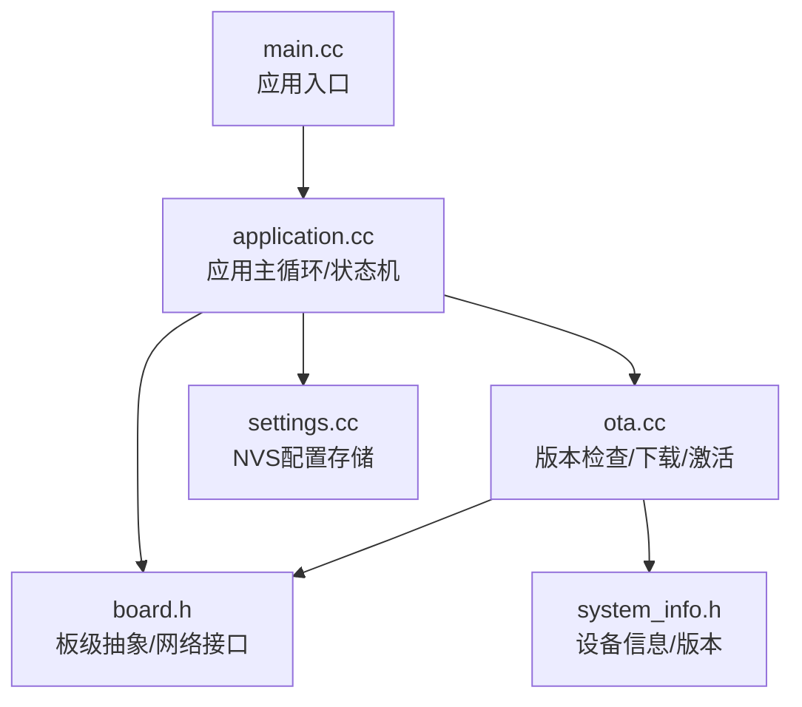
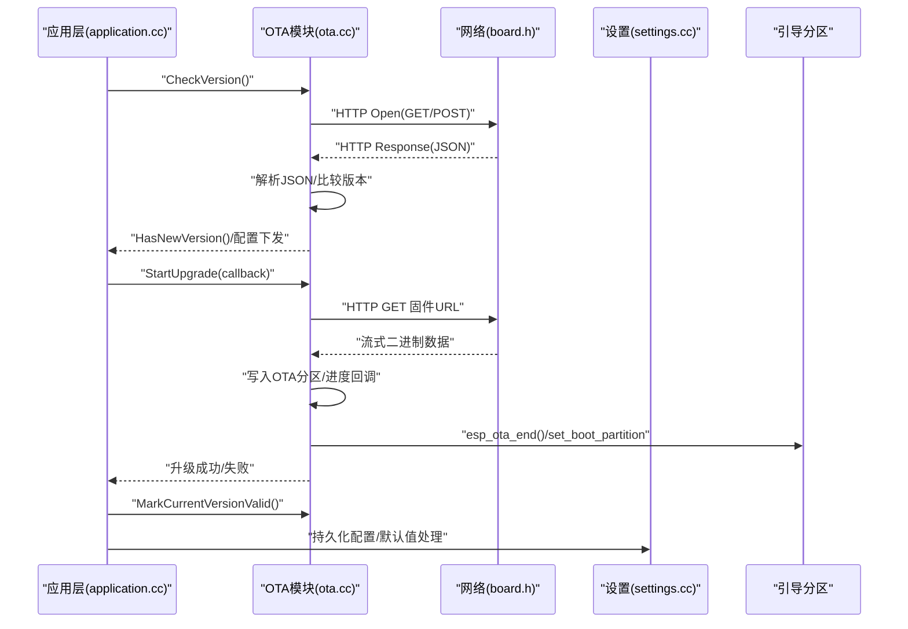
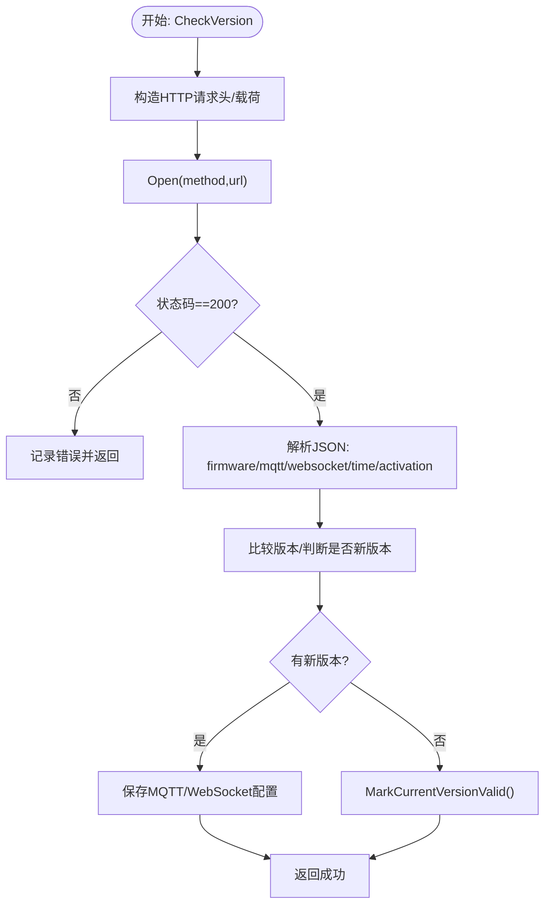
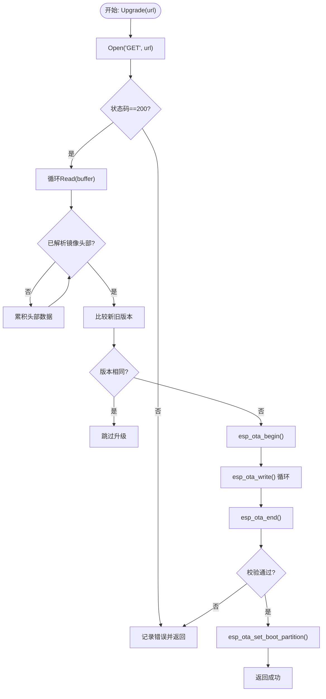
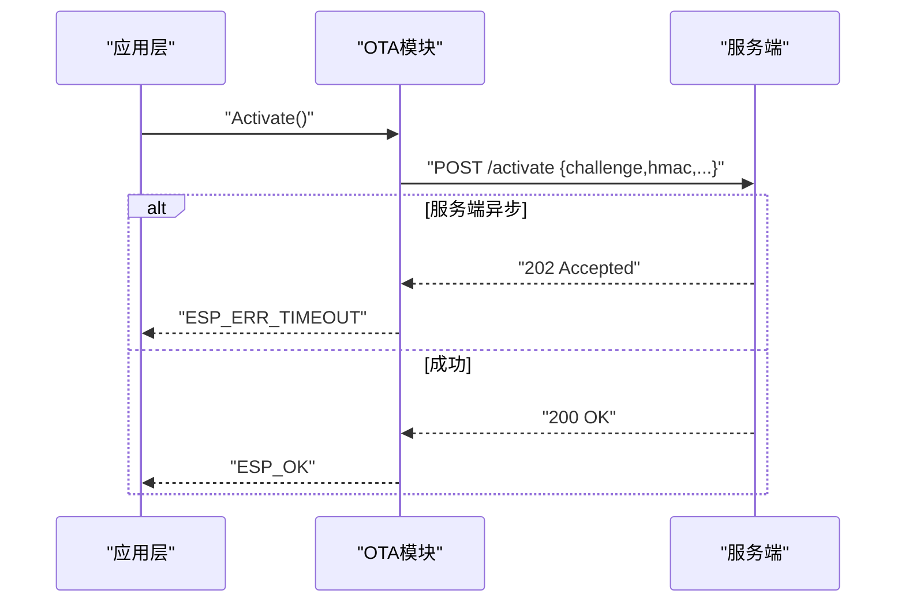
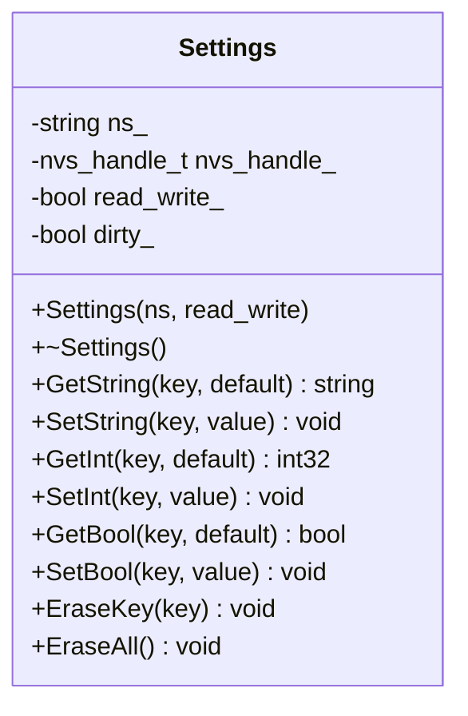
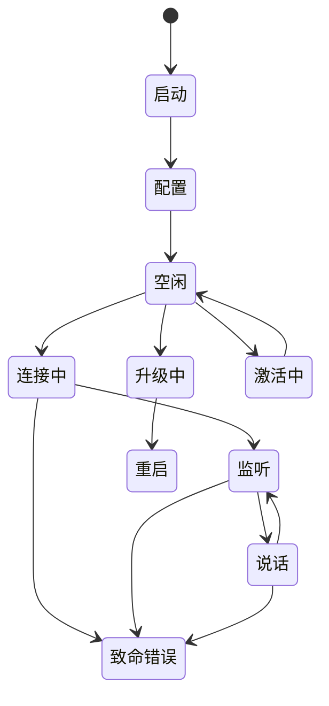
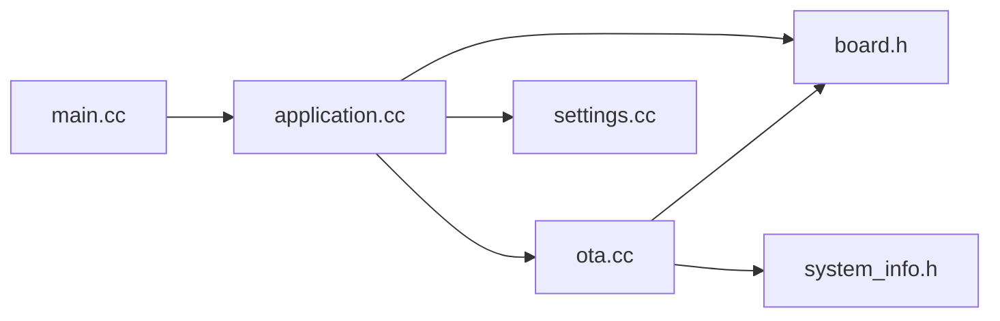
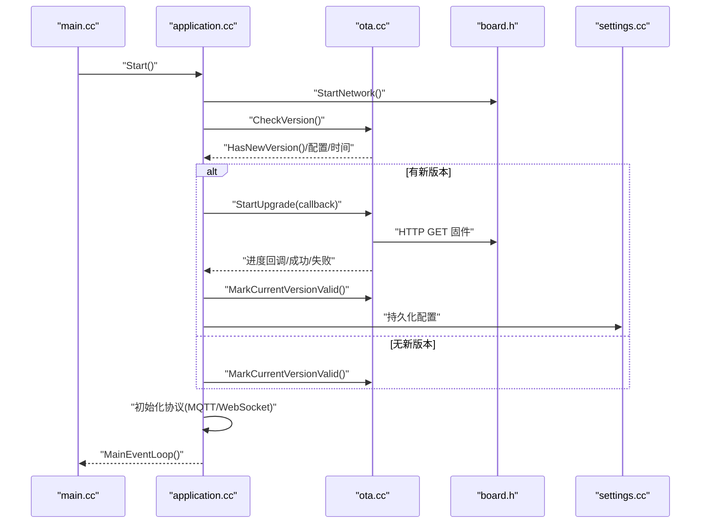

# OTA固件更新

<cite>
**本文引用的文件**
- [main.cc](file://main.cc)
- [application.cc](file://application.cc)
- [ota.cc](file://ota.cc)
- [ota.h](file://ota.h)
- [settings.cc](file://settings.cc)
- [settings.h](file://settings.h)
- [board.h](file://boards/common/board.h)
- [system_info.h](file://system_info.h)
</cite>

## 目录
1. [简介](#简介)
2. [项目结构](#项目结构)
3. [核心组件](#核心组件)
4. [架构总览](#架构总览)
5. [详细组件分析](#详细组件分析)
6. [依赖关系分析](#依赖关系分析)
7. [性能与网络优化](#性能与网络优化)
8. [故障排查与错误处理](#故障排查与错误处理)
9. [结论](#结论)
10. [附录：完整OTA工作流程](#附录完整ota工作流程)

## 简介
本文件面向嵌入式工程师与产品经理，系统性阐述该ESP32设备的OTA固件更新系统。内容覆盖版本检查机制、固件下载与写入流程、安装验证与回滚保障、激活流程（含挑战-应答与HMAC校验）、设置管理系统（NVS持久化）以及完整的端到端工作流。同时给出网络连接要求、带宽优化建议与断点续传现状说明，并提供故障恢复与错误处理策略。

## 项目结构
- 应用入口负责初始化硬件、网络与NVS，随后启动应用主循环与事件循环。
- 应用层负责状态机、UI/音频提示、协议选择（MQTT/WebSocket）以及调度OTA任务。
- OTA模块封装HTTP版本检查、固件下载、写入、校验与引导分区切换。
- 设置模块基于NVS提供键值型配置存储与默认值处理。
- 板级抽象提供网络接口、设备信息与UUID生成等通用能力。

**图表来源**
- [main.cc](file://main.cc#L13-L31)
- [application.cc](file://application.cc#L328-L512)
- [ota.cc](file://ota.cc#L43-L243)
- [settings.cc](file://settings.cc#L8-L109)
- [board.h](file://boards/common/board.h#L18-L53)
- [system_info.h](file://system_info.h#L9-L19)

**章节来源**
- [main.cc](file://main.cc#L13-L31)
- [application.cc](file://application.cc#L328-L512)
- [ota.cc](file://ota.cc#L43-L243)
- [settings.cc](file://settings.cc#L8-L109)
- [board.h](file://boards/common/board.h#L18-L53)
- [system_info.h](file://system_info.h#L9-L19)

## 核心组件
- 版本检查与远程配置下发：通过HTTP请求向服务器查询新版本与可选配置（MQTT/WebSocket），解析JSON响应并决定是否升级。
- 固件下载与写入：使用HTTP流式读取固件镜像，边读边写入OTA分区；在写入前解析镜像头部以确认版本差异，避免重复升级。
- 安装验证与引导切换：完成写入后进行镜像校验，成功则设置下次启动分区；若校验失败则中止并返回错误。
- 激活流程：支持两种模式：
  - 无序列号：直接上报设备信息与UA发起激活。
  - 有序列号：基于HMAC-SHA256对挑战进行签名，携带算法、序列号、挑战与签名发送至服务端。
- 设置管理：基于NVS的键值存储，支持字符串、整数、布尔类型，具备默认值与提交机制。
- 应用状态机：统一管理设备状态（空闲、连接中、监听、说话、升级中、激活中等），驱动UI与音频反馈。

**章节来源**
- [ota.cc](file://ota.cc#L76-L243)
- [ota.cc](file://ota.cc#L265-L373)
- [ota.cc](file://ota.cc#L444-L478)
- [settings.cc](file://settings.cc#L21-L109)
- [application.cc](file://application.cc#L70-L176)

## 架构总览
OTA系统采用“应用层调度 + OTA模块 + 板级网络 + NVS设置”的分层设计。应用层在启动时执行版本检查与激活，根据结果选择协议并进入正常运行态；当需要升级时，应用层暂停音频与电源节能，调用OTA模块进行下载与写入，完成后立即重启以进入新版本。

**图表来源**
- [application.cc](file://application.cc#L70-L176)
- [ota.cc](file://ota.cc#L76-L243)
- [ota.cc](file://ota.cc#L265-L373)
- [settings.cc](file://settings.cc#L21-L109)
- [board.h](file://boards/common/board.h#L45-L46)

## 详细组件分析

### 组件A：OTA版本检查与激活
- 版本检查
  - 读取当前应用版本，构造HTTP请求头（包含设备ID、客户端ID、语言、UA等），向配置的OTA地址发起请求。
  - 支持GET/POST两种方法：当设备JSON为空时GET，否则POST设备信息。
  - 解析响应中的firmware字段，比较版本号；若存在force=1则强制升级。
  - 同时解析activation、mqtt、websocket、server_time等字段，分别用于激活、协议配置与系统时间同步。
- 激活流程
  - 若无序列号：直接返回空载荷。
  - 若有序列号：使用HMAC-SHA256对challenge签名，生成包含算法、序列号、challenge与签名的JSON载荷。
  - 将载荷POST到“/activate”路径，支持202超时返回（表示服务端异步处理）。
- 配置下发
  - 对于mqtt/websocket配置，将键值对写入对应命名空间，便于后续协议初始化。

**图表来源**
- [ota.cc](file://ota.cc#L76-L243)
- [ota.cc](file://ota.cc#L444-L478)

**章节来源**
- [ota.cc](file://ota.cc#L43-L243)
- [ota.cc](file://ota.cc#L444-L478)

### 组件B：OTA固件下载与写入
- 下载阶段
  - 打开HTTP GET请求，读取响应体长度作为总大小，按固定缓冲区大小循环读取。
  - 每秒统计累计字节数与瞬时速度，回调上层显示进度与速率。
- 写入阶段
  - 在读取到足够镜像头部后，解析新版本描述，与当前版本对比，相同则跳过升级。
  - 初始化OTA句柄，将数据块顺序写入目标分区。
  - 结束写入并进行镜像校验；成功则设置下次启动分区；失败则中止并返回错误。
- 引导切换
  - 成功后由应用层触发重启，系统从新分区启动。

**图表来源**
- [ota.cc](file://ota.cc#L265-L373)

**章节来源**
- [ota.cc](file://ota.cc#L265-L373)

### 组件C：激活与挑战-应答（含HMAC）
- 当设备具备序列号时，服务端会下发挑战；设备侧使用HMAC-SHA256对挑战进行签名，生成JSON载荷并提交。
- 服务端可能返回202（异步处理），应用层按策略重试或等待。
- 无序列号场景下，激活流程简化为直接上报设备信息。

**图表来源**
- [ota.cc](file://ota.cc#L444-L478)

**章节来源**
- [ota.cc](file://ota.cc#L407-L442)
- [ota.cc](file://ota.cc#L444-L478)

### 组件D：设置管理系统（NVS）
- 提供字符串、整数、布尔类型的读写接口，支持默认值与惰性提交。
- 写入命名空间需具备读写权限；关闭时若脏标记被置位则提交变更。
- 适用于持久化MQTT/WebSocket配置项、开关类参数等。

**图表来源**
- [settings.cc](file://settings.cc#L8-L109)
- [settings.h](file://settings.h#L7-L26)

**章节来源**
- [settings.cc](file://settings.cc#L8-L109)
- [settings.h](file://settings.h#L7-L26)

### 组件E：应用状态机与UI/音频反馈
- 状态枚举覆盖启动、配置、空闲、连接、监听、说话、升级、激活、测试、致命错误等。
- 在版本检查与升级过程中，应用层控制显示与音频播放，确保用户感知。
- 升级成功后立即重启，失败则恢复音频与省电模式并继续运行。

**图表来源**
- [application.cc](file://application.cc#L21-L34)
- [application.cc](file://application.cc#L69-L176)

**章节来源**
- [application.cc](file://application.cc#L21-L34)
- [application.cc](file://application.cc#L69-L176)

## 依赖关系分析
- application.cc 依赖 ota.cc 进行版本检查与升级调度；依赖 board.h 获取网络接口与设备信息；依赖 settings.cc 进行配置持久化。
- ota.cc 依赖 board.h 的网络接口与设备描述；依赖 system_info.h 获取版本信息；依赖cJSON解析JSON响应。
- settings.cc 依赖NVS API进行键值存储与提交。
- main.cc 负责NVS初始化与应用生命周期启动。

**图表来源**
- [main.cc](file://main.cc#L13-L31)
- [application.cc](file://application.cc#L328-L512)
- [ota.cc](file://ota.cc#L43-L243)
- [settings.cc](file://settings.cc#L8-L109)
- [board.h](file://boards/common/board.h#L18-L53)
- [system_info.h](file://system_info.h#L9-L19)

**章节来源**
- [main.cc](file://main.cc#L13-L31)
- [application.cc](file://application.cc#L328-L512)
- [ota.cc](file://ota.cc#L43-L243)
- [settings.cc](file://settings.cc#L8-L109)
- [board.h](file://boards/common/board.h#L18-L53)
- [system_info.h](file://system_info.h#L9-L19)

## 性能与网络优化
- 带宽与速度统计
  - 下载循环每秒统计最近读取字节数与总进度，便于UI展示与用户体验反馈。
- 断点续传
  - 当前实现为顺序流式下载，未见断点续传逻辑；如需提升可靠性，可在后续版本引入范围请求与本地偏移记录。
- 重试策略
  - 版本检查阶段具备指数退避重试（初始10秒，每次翻倍，最多10次），降低网络波动影响。
- 电源与资源
  - 升级前关闭音频与省电模式，升级后重启；避免升级过程中的资源竞争与功耗异常。

**章节来源**
- [ota.cc](file://ota.cc#L296-L321)
- [application.cc](file://application.cc#L70-L101)

## 故障排查与错误处理
- 版本检查失败
  - 检查OTA URL是否有效、网络连通性、HTTP状态码；查看日志定位具体错误。
  - 指数退避重试后仍失败，应用层弹出错误提示并继续运行。
- 固件下载失败
  - 检查HTTP状态码、内容长度、网络中断；出现错误立即中止并释放句柄。
- 镜像校验失败
  - esp_ota_end返回校验失败时，记录错误并终止升级，避免引导损坏。
- 激活超时
  - 服务端返回202时视为超时，应用层按策略延时重试；若持续失败，记录错误并退出激活流程。
- NVS写入失败
  - 写入命名空间需具备读写权限；若只读命名空间写入，将产生告警但不写入。

**章节来源**
- [ota.cc](file://ota.cc#L96-L105)
- [ota.cc](file://ota.cc#L285-L294)
- [ota.cc](file://ota.cc#L355-L363)
- [ota.cc](file://ota.cc#L467-L474)
- [settings.cc](file://settings.cc#L40-L47)

## 结论
该OTA系统以清晰的分层设计实现了从版本检查、固件下载、安装验证到激活与配置下发的完整闭环。通过NVS持久化与应用状态机，系统在可靠性与用户体验之间取得平衡。建议后续增强断点续传与更细粒度的错误恢复策略，以进一步提升复杂网络环境下的成功率。

## 附录：完整OTA工作流程
- 启动阶段
  - 初始化事件循环与NVS；启动显示与音频；启动网络；更新状态栏。
- 版本检查
  - 发起HTTP请求，解析响应；若存在新版本则准备升级；若存在MQTT/WebSocket配置则优先使用对应协议；若存在server_time则同步系统时间。
- 升级流程
  - 关闭音频与省电模式；开始下载固件并显示进度；写入OTA分区；结束写入并校验；设置引导分区；重启进入新版本。
- 激活流程
  - 若服务端下发挑战且设备具备序列号，则进行HMAC签名并提交；支持202异步处理；成功后继续。
- 回滚与验证
  - 若升级失败，恢复音频与省电模式；若升级成功，应用层在后续周期内标记当前版本有效，避免重复升级。

**图表来源**
- [main.cc](file://main.cc#L13-L31)
- [application.cc](file://application.cc#L328-L512)
- [ota.cc](file://ota.cc#L76-L243)
- [ota.cc](file://ota.cc#L265-L373)
- [settings.cc](file://settings.cc#L21-L109)