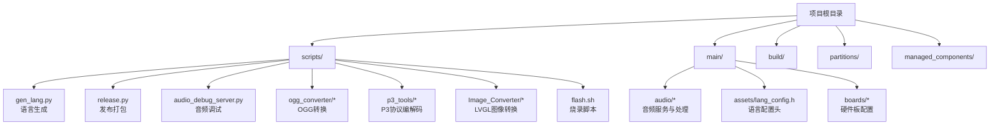
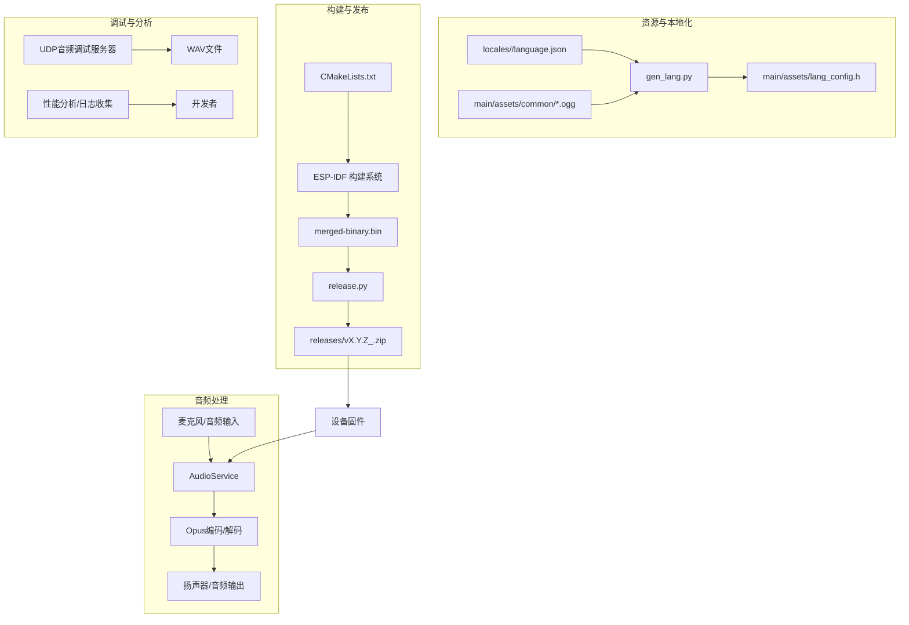
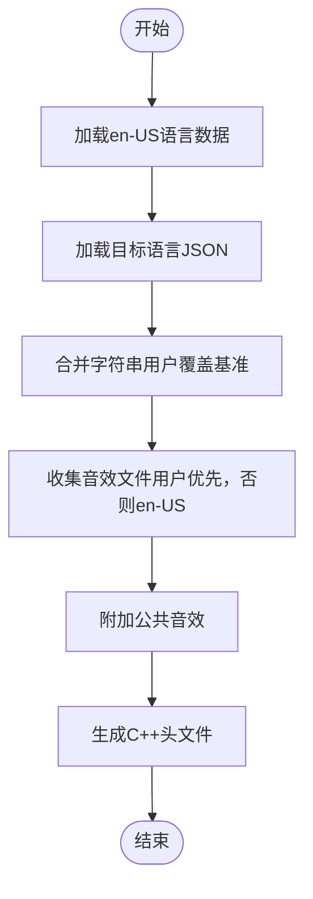
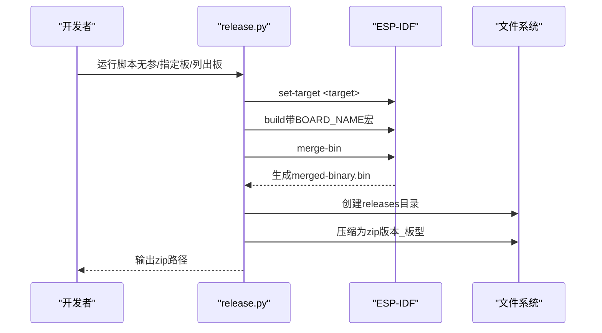
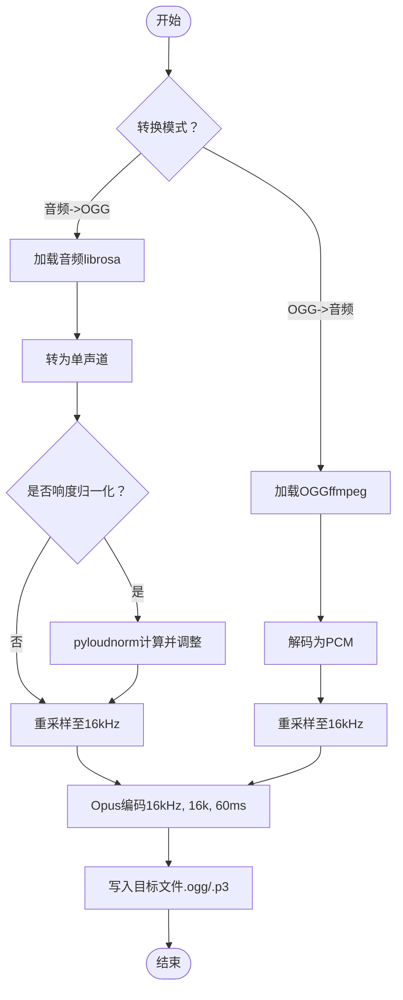
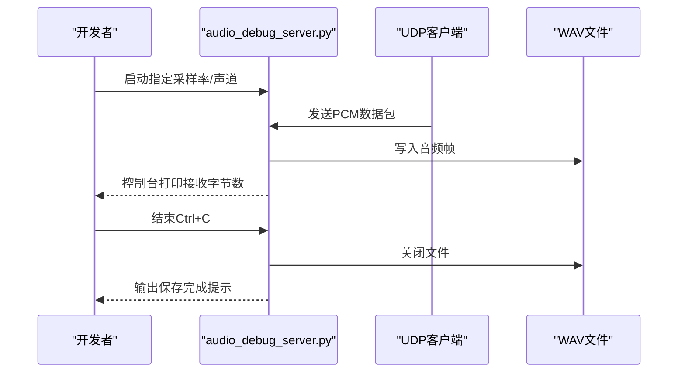
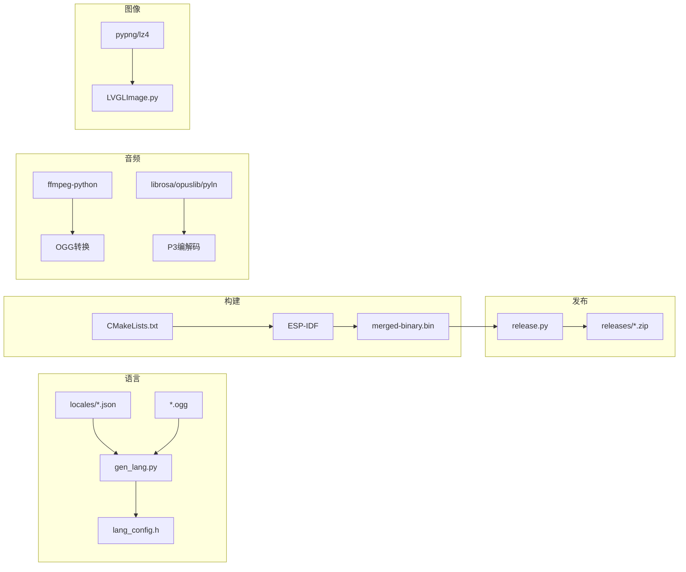

# 开发工具链

<cite>
**本文引用的文件**
- [scripts/gen_lang.py](file://scripts/gen_lang.py)
- [main/assets/lang_config.h](file://main/assets/lang_config.h)
- [scripts/audio_debug_server.py](file://scripts/audio_debug_server.py)
- [scripts/release.py](file://scripts/release.py)
- [scripts/flash.sh](file://scripts/flash.sh)
- [scripts/ogg_converter/xiaozhi_ogg_converter.py](file://scripts/ogg_converter/xiaozhi_ogg_converter.py)
- [scripts/p3_tools/batch_convert_gui.py](file://scripts/p3_tools/batch_convert_gui.py)
- [scripts/p3_tools/convert_audio_to_p3.py](file://scripts/p3_tools/convert_audio_to_p3.py)
- [scripts/p3_tools/convert_p3_to_audio.py](file://scripts/p3_tools/convert_p3_to_audio.py)
- [scripts/Image_Converter/LVGLImage.py](file://scripts/Image_Converter/LVGLImage.py)
- [main/audio/README.md](file://main/audio/README.md)
- [CMakeLists.txt](file://CMakeLists.txt)
- [sdkconfig.defaults.esp32s3](file://sdkconfig.defaults.esp32s3)
</cite>

## 目录
1. [简介](#简介)
2. [项目结构](#项目结构)
3. [核心组件](#核心组件)
4. [架构总览](#架构总览)
5. [详细组件分析](#详细组件分析)
6. [依赖关系分析](#依赖关系分析)
7. [性能考虑](#性能考虑)
8. [故障排查指南](#故障排查指南)
9. [结论](#结论)
10. [附录](#附录)

## 简介
本指南面向使用该ESP32开发工具链的工程师与测试人员，系统性介绍以下内容：
- 构建脚本：固件编译、合并二进制、打包发布、烧录等自动化流程
- 音频转换工具：OGG批量转换、P3协议编解码、响度归一化、质量优化
- 语言生成工具：多语言资源提取、翻译管理、本地化配置与回退机制
- 调试工具：音频调试服务器、性能分析与日志收集
- 开发环境配置与最佳实践
- CI/CD集成与自动化部署建议

## 项目结构
该项目采用ESP-IDF工程组织方式，核心目录与脚本分布如下：
- scripts：各类自动化脚本与工具（语言生成、音频转换、发布、调试、图像转换等）
- main：应用层源代码与资源（音频服务、显示、LED、协议、设备配置等）
- build：构建产物（合并二进制、分区表、链接脚本、中间产物等）
- partitions：分区表定义
- managed_components：第三方组件（LVGL、ESP-ADF、ESP-DSP、ESP-SR等）

图表来源
- [scripts/gen_lang.py](file://scripts/gen_lang.py#L1-L187)
- [scripts/release.py](file://scripts/release.py#L1-L154)
- [scripts/audio_debug_server.py](file://scripts/audio_debug_server.py#L1-L55)
- [scripts/ogg_converter/xiaozhi_ogg_converter.py](file://scripts/ogg_converter/xiaozhi_ogg_converter.py#L1-L231)
- [scripts/p3_tools/batch_convert_gui.py](file://scripts/p3_tools/batch_convert_gui.py#L1-L221)
- [scripts/Image_Converter/LVGLImage.py](file://scripts/Image_Converter/LVGLImage.py#L1-L800)
- [main/assets/lang_config.h](file://main/assets/lang_config.h#L1-L214)

章节来源
- [CMakeLists.txt](file://CMakeLists.txt#L1-L15)
- [sdkconfig.defaults.esp32s3](file://sdkconfig.defaults.esp32s3#L1-L22)

## 核心组件
- 语言生成工具：从多语言JSON生成C++语言配置头文件，支持en-US回退与音效资源绑定
- 发布打包工具：读取构建命令提取板型宏，合并二进制并压缩为zip
- 音频转换工具：GUI与命令行工具，支持OGG与P3协议互转、响度归一化、采样率统一
- 图像转换工具：将PNG等格式转换为LVGL二进制/数组，支持多种颜色格式与压缩
- 调试工具：UDP音频接收器，将PCM数据保存为WAV文件，便于离线分析
- 构建与烧录：CMake与ESP-IDF流程，配合脚本完成目标切换、构建、合并与烧录

章节来源
- [scripts/gen_lang.py](file://scripts/gen_lang.py#L1-L187)
- [scripts/release.py](file://scripts/release.py#L1-L154)
- [scripts/ogg_converter/xiaozhi_ogg_converter.py](file://scripts/ogg_converter/xiaozhi_ogg_converter.py#L1-L231)
- [scripts/p3_tools/batch_convert_gui.py](file://scripts/p3_tools/batch_convert_gui.py#L1-L221)
- [scripts/p3_tools/convert_audio_to_p3.py](file://scripts/p3_tools/convert_audio_to_p3.py#L1-L62)
- [scripts/p3_tools/convert_p3_to_audio.py](file://scripts/p3_tools/convert_p3_to_audio.py#L1-L52)
- [scripts/Image_Converter/LVGLImage.py](file://scripts/Image_Converter/LVGLImage.py#L1-L800)
- [scripts/audio_debug_server.py](file://scripts/audio_debug_server.py#L1-L55)
- [scripts/flash.sh](file://scripts/flash.sh#L1-L3)

## 架构总览
下图展示从资源到固件发布的端到端流程，以及音频数据在设备内的处理路径。

图表来源
- [scripts/gen_lang.py](file://scripts/gen_lang.py#L1-L187)
- [main/assets/lang_config.h](file://main/assets/lang_config.h#L1-L214)
- [scripts/release.py](file://scripts/release.py#L1-L154)
- [main/audio/README.md](file://main/audio/README.md#L1-L88)

## 详细组件分析

### 语言生成工具（多语言资源与本地化）
- 功能概述
  - 从assets/locales/<lang>/language.json加载语言字符串与音效映射
  - 以en-US为基准语言，用户语言覆盖缺失键值
  - 生成C++头文件，包含字符串常量与音效资源的std::string_view视图
  - 音效文件按用户语言优先，否则回退至en-US；公共音效来自common目录
- 使用方法
  - 命令行参数：--language（语言代码）、--output（输出头文件路径）
  - 输出：main/assets/lang_config.h
- 数据结构与回退策略
  - 字符串：字典合并，用户语言覆盖en-US
  - 音效：集合合并，用户语言优先，缺失回退en-US，公共音效附加
- 性能与复杂度
  - 时间复杂度：O(N)（N为字符串与音效数量）
  - 空间复杂度：O(N)（存储字符串与音效指针）
- 最佳实践
  - 保持en-US作为唯一完整语言源，其他语言仅维护差异项
  - 音效命名与目录结构保持一致，避免运行时查找失败

图表来源
- [scripts/gen_lang.py](file://scripts/gen_lang.py#L32-L175)
- [main/assets/lang_config.h](file://main/assets/lang_config.h#L1-L214)

章节来源
- [scripts/gen_lang.py](file://scripts/gen_lang.py#L1-L187)
- [main/assets/lang_config.h](file://main/assets/lang_config.h#L1-L214)

### 发布与打包工具（构建、合并、打包、烧录）
- 功能概述
  - 读取构建命令中的板型宏，识别目标板类型
  - 调用合并二进制命令，生成merged-binary.bin
  - 将二进制文件打包为releases/vX.Y.Z_<board>.zip
  - 提供批量发布能力，遍历boards配置并逐个构建与打包
- 使用方法
  - 当前板：直接运行脚本，自动识别板型与版本号
  - 指定板：传入板类型或all，可配合--config指定配置文件
  - 列出支持板：--list-boards，可选--json输出
- 流程图

图表来源
- [scripts/release.py](file://scripts/release.py#L45-L121)

章节来源
- [scripts/release.py](file://scripts/release.py#L1-L154)
- [CMakeLists.txt](file://CMakeLists.txt#L7-L7)

### 音频转换工具（OGG与P3协议）
- OGG批量转换工具
  - GUI界面：支持音频转OGG与OGG转音频，可选择目标文件、输出目录、响度归一化
  - 参数：采样率16kHz、单声道、码率16k、帧长60ms
  - 多线程：转换过程在独立线程执行，避免阻塞UI
- P3协议编解码工具
  - 音频转P3：响度归一化（可选）、重采样至16kHz、Opus编码、分帧写入
  - P3转音频：解析帧头、Opus解码、拼接PCM并保存为WAV
  - GUI：批量转换、进度条、日志输出
- 使用场景
  - OGG工具：统一设备侧音频格式，便于嵌入与播放
  - P3工具：协议兼容与跨平台播放验证

图表来源
- [scripts/ogg_converter/xiaozhi_ogg_converter.py](file://scripts/ogg_converter/xiaozhi_ogg_converter.py#L189-L207)
- [scripts/p3_tools/convert_audio_to_p3.py](file://scripts/p3_tools/convert_audio_to_p3.py#L11-L50)
- [scripts/p3_tools/convert_p3_to_audio.py](file://scripts/p3_tools/convert_p3_to_audio.py#L9-L44)

章节来源
- [scripts/ogg_converter/xiaozhi_ogg_converter.py](file://scripts/ogg_converter/xiaozhi_ogg_converter.py#L1-L231)
- [scripts/p3_tools/batch_convert_gui.py](file://scripts/p3_tools/batch_convert_gui.py#L1-L221)
- [scripts/p3_tools/convert_audio_to_p3.py](file://scripts/p3_tools/convert_audio_to_p3.py#L1-L62)
- [scripts/p3_tools/convert_p3_to_audio.py](file://scripts/p3_tools/convert_p3_to_audio.py#L1-L52)

### 图像转换工具（LVGL）
- 功能概述
  - 支持多种颜色格式与压缩方法（RLE/LZ4），生成LVGL二进制或C数组
  - 提供预乘Alpha、抖动、调色板量化等处理
  - 可从bin文件反向解析并导出PNG
- 使用要点
  - 颜色格式与位深自适应，自动计算stride与palette
  - 压缩选项影响体积与解码性能，需根据设备内存权衡
- 典型用途
  - 将位图素材转换为LVGL可直接使用的二进制资源，减少运行时开销

章节来源
- [scripts/Image_Converter/LVGLImage.py](file://scripts/Image_Converter/LVGLImage.py#L1-L800)

### 音频调试工具（UDP到WAV）
- 功能概述
  - 创建UDP套接字监听指定端口，接收PCM数据并写入WAV文件
  - 支持采样率与声道数参数，便于匹配设备端发送格式
- 使用场景
  - 设备端通过UDP发送音频帧，调试端接收并保存为WAV，用于离线分析与对比

图表来源
- [scripts/audio_debug_server.py](file://scripts/audio_debug_server.py#L11-L43)

章节来源
- [scripts/audio_debug_server.py](file://scripts/audio_debug_server.py#L1-L55)

### 构建与烧录
- 构建
  - 使用ESP-IDF构建系统，CMakeLists定义项目版本与编译选项
  - 板型宏由构建命令注入，发布脚本解析以确定目标板
- 烧录
  - 提供示例脚本，使用esptool.py将合并后的二进制烧录到设备

章节来源
- [CMakeLists.txt](file://CMakeLists.txt#L7-L7)
- [scripts/flash.sh](file://scripts/flash.sh#L1-L3)

## 依赖关系分析
- 语言生成
  - 输入：assets/locales/<lang>/language.json、assets/common/*.ogg、assets/locales/en-US/*
  - 输出：main/assets/lang_config.h
- 发布打包
  - 依赖：ESP-IDF构建产物（merged-binary.bin）、版本号（CMakeLists.txt）
- 音频转换
  - OGG：ffmpeg-python
  - P3：librosa、opuslib、pyloudnorm、numpy、tqdm、soundfile
- 图像转换
  - pypng、lz4
- 调试
  - Python标准库socket、wave

图表来源
- [scripts/gen_lang.py](file://scripts/gen_lang.py#L62-L175)
- [scripts/release.py](file://scripts/release.py#L29-L52)
- [scripts/ogg_converter/xiaozhi_ogg_converter.py](file://scripts/ogg_converter/xiaozhi_ogg_converter.py#L1-L231)
- [scripts/p3_tools/convert_audio_to_p3.py](file://scripts/p3_tools/convert_audio_to_p3.py#L1-L62)
- [scripts/Image_Converter/LVGLImage.py](file://scripts/Image_Converter/LVGLImage.py#L1-L800)

## 性能考虑
- 音频处理
  - 统一采样率与帧长可降低解码/编码开销，提升实时性
  - Opus编码参数（码率、帧长）与响度归一化会增加CPU占用，建议在离线工具中启用，在设备端谨慎使用
- 本地化资源
  - 语言字符串与音效均以内存视图形式访问，避免重复拷贝
  - 合理拆分公共音效与语言特定音效，减少冗余
- 发布流程
  - 合并二进制与ZIP压缩为轻量发布包，便于快速分发
- 图像资源
  - 选择合适的颜色格式与压缩算法，平衡存储空间与解码性能

## 故障排查指南
- 语言生成失败
  - 检查输入JSON结构是否包含language与strings字段
  - 确认en-US基准文件是否存在，否则回退机制不可用
- 发布脚本报错
  - set-target或build失败：确认ESP-IDF环境与目标板配置正确
  - merge-bin失败：检查分区表与链接脚本是否生成
- 音频转换异常
  - OGG转换：确保ffmpeg安装且路径可访问
  - P3转换：确认opus库与numpy版本兼容，必要时禁用响度归一化
- 调试服务器
  - UDP端口冲突或权限问题：更换端口或以管理员权限运行
- 烧录失败
  - 确认串口设备路径与波特率，检查esptool依赖

章节来源
- [scripts/gen_lang.py](file://scripts/gen_lang.py#L32-L80)
- [scripts/release.py](file://scripts/release.py#L92-L120)
- [scripts/ogg_converter/xiaozhi_ogg_converter.py](file://scripts/ogg_converter/xiaozhi_ogg_converter.py#L189-L207)
- [scripts/p3_tools/convert_audio_to_p3.py](file://scripts/p3_tools/convert_audio_to_p3.py#L19-L27)
- [scripts/audio_debug_server.py](file://scripts/audio_debug_server.py#L12-L14)
- [scripts/flash.sh](file://scripts/flash.sh#L2-L2)

## 结论
本工具链围绕“资源本地化—构建发布—音频处理—调试分析”形成闭环，既满足快速迭代的开发需求，又保证了多语言与多硬件平台的一致性。建议在团队内统一资源规范与转换参数，并结合CI/CD实现自动化构建与发布。

## 附录

### 开发环境配置与最佳实践
- 系统与工具
  - Python 3.8+，pip安装依赖（见各脚本requirements）
  - ESP-IDF v5+，目标芯片与SDK配置参考默认文件
- 资源规范
  - 语言文件遵循en-US为基准，其他语言仅维护差异
  - 音效命名与目录保持一致，避免运行时查找失败
- 构建与发布
  - 使用release.py进行批量发布，确保版本号与板型一致
  - 合并二进制前检查分区表与链接脚本
- 音频与图像
  - 统一采样率与帧长，减少设备端处理压力
  - 图像资源优先使用压缩格式，控制内存占用

章节来源
- [sdkconfig.defaults.esp32s3](file://sdkconfig.defaults.esp32s3#L1-L22)
- [main/audio/README.md](file://main/audio/README.md#L1-L88)

### CI/CD集成与自动化部署
- 触发条件
  - 推送标签或主分支变更触发构建
- 步骤建议
  - 安装ESP-IDF与Python依赖
  - 设置目标芯片与SDK配置
  - 执行构建与合并二进制
  - 运行发布脚本生成压缩包
  - 上传Artifacts或发布到制品库
- 自动化部署
  - 使用脚本将压缩包下载到测试设备并执行烧录
  - 记录构建日志与产物，便于追溯