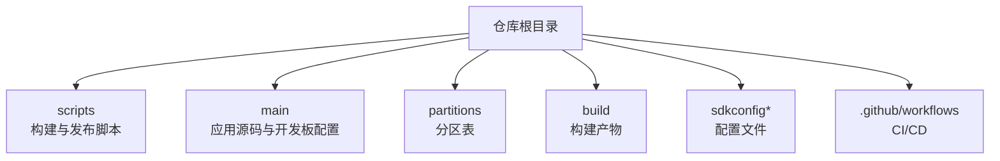
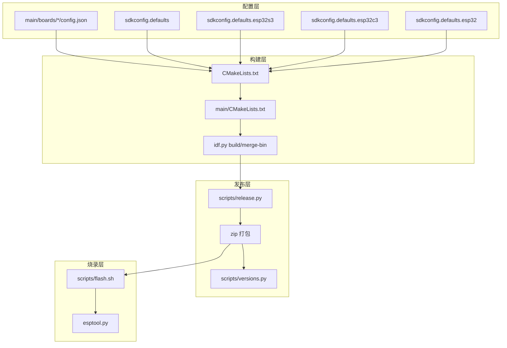
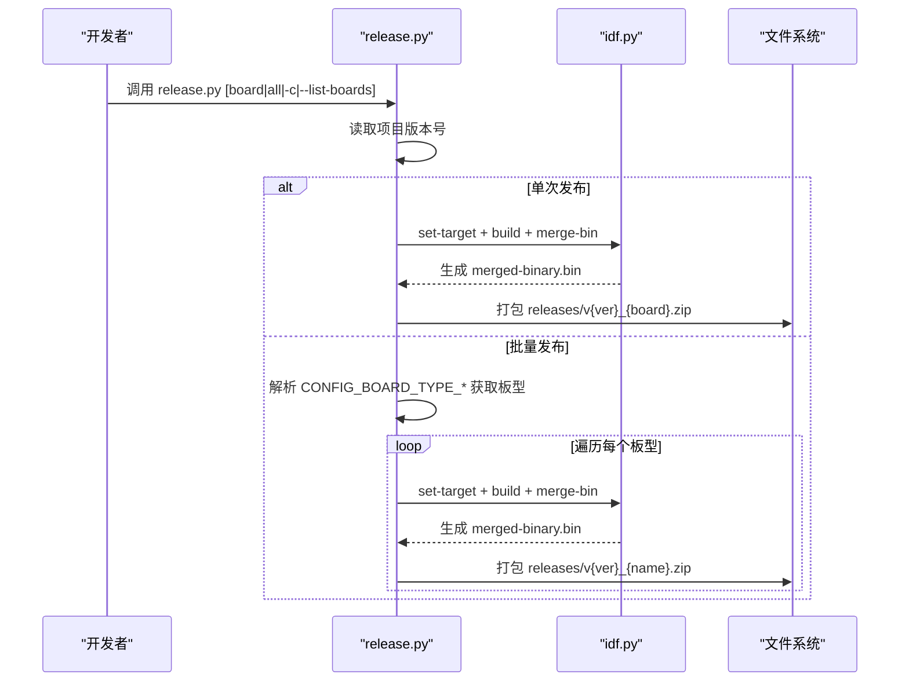
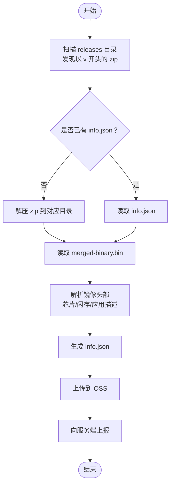
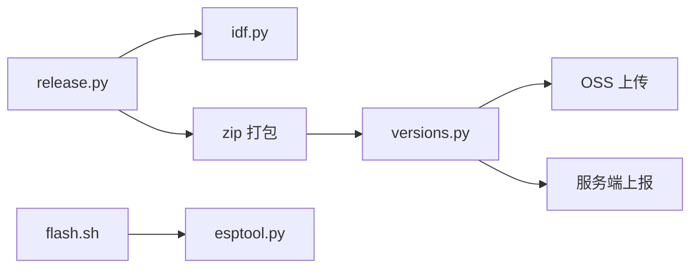

# 构建脚本

<cite>
**本文引用的文件**
- [scripts/flash.sh](file://scripts/flash.sh)
- [scripts/release.py](file://scripts/release.py)
- [scripts/versions.py](file://scripts/versions.py)
- [CMakeLists.txt](file://CMakeLists.txt)
- [main/CMakeLists.txt](file://main/CMakeLists.txt)
- [sdkconfig.defaults](file://sdkconfig.defaults)
- [sdkconfig.defaults.esp32s3](file://sdkconfig.defaults.esp32s3)
- [sdkconfig.defaults.esp32c3](file://sdkconfig.defaults.esp32c3)
- [sdkconfig.defaults.esp32](file://sdkconfig.defaults.esp32)
- [.github/workflows/build.yml](file://.github/workflows/build.yml)
- [main/boards/bread-compact-wifi/config.json](file://main/boards/bread-compact-wifi/config.json)
- [main/boards/esp-box-3/config.json](file://main/boards/esp-box-3/config.json)
- [main/boards/magiclick-2p4/config.json](file://main/boards/magiclick-2p4/config.json)
</cite>

## 目录
1. [简介](#简介)
2. [项目结构](#项目结构)
3. [核心组件](#核心组件)
4. [架构总览](#架构总览)
5. [详细组件分析](#详细组件分析)
6. [依赖关系分析](#依赖关系分析)
7. [性能与速度优化](#性能与速度优化)
8. [故障排查指南](#故障排查指南)
9. [结论](#结论)
10. [附录：CI/CD与自动化部署](#附录cicd与自动化部署)

## 简介
本指南面向使用 ESP-IDF 的嵌入式开发者，围绕仓库中的构建脚本与发布工具，提供从“串口烧录”到“自动化发布”的完整使用说明。内容涵盖：
- flash.sh 烧录脚本的串口参数、固件路径、烧录速度优化
- release.py 发布工具的版本管理、固件打包、多平台构建、发布流程
- 构建系统配置项（CMakeLists.txt、sdkconfig.defaults 及各芯片默认配置）
- 不同开发板的编译配置示例与最佳实践
- CI/CD 集成与自动化部署流程

## 项目结构
该仓库采用 ESP-IDF 标准工程结构，关键位置如下：
- scripts：构建与发布辅助脚本（flash.sh、release.py、versions.py 等）
- main：应用源码与按开发板分组的配置（boards/*）
- partitions：分区表 CSV 文件
- build：构建产物与中间文件（合并二进制、flash 参数等）
- sdkconfig*：默认配置与芯片差异化配置
- .github/workflows：CI/CD 工作流

## 核心组件
- flash.sh：一键烧录脚本，直接调用 esptool.py 写入合并后的二进制镜像
- release.py：发布工具，负责合并二进制、读取版本号、按开发板批量构建并打包
- versions.py：发布后处理工具，解析固件、提取设备信息并上传 OSS、上报服务端
- CMakeLists.txt：顶层构建入口，设置项目版本与编译选项
- main/CMakeLists.txt：按 CONFIG_* 选择开发板源码、语言资源、SPIFFS 资源等
- sdkconfig.defaults 与芯片默认配置：统一默认开关与芯片特性配置

章节来源
- file://scripts/flash.sh#L1-L3
- file://scripts/release.py#L1-L154
- file://scripts/versions.py#L1-L247
- file://CMakeLists.txt#L1-L15
- file://main/CMakeLists.txt#L1-L402
- file://sdkconfig.defaults#L1-L78

## 架构总览
下图展示从“开发板配置 → 构建 → 合并二进制 → 打包 → 发布”的整体流程。

图表来源
- [scripts/release.py](file://scripts/release.py#L45-L121)
- [scripts/versions.py](file://scripts/versions.py#L220-L247)
- [scripts/flash.sh](file://scripts/flash.sh#L1-L3)
- [CMakeLists.txt](file://CMakeLists.txt#L1-L15)
- [main/CMakeLists.txt](file://main/CMakeLists.txt#L1-L402)
- [sdkconfig.defaults](file://sdkconfig.defaults#L1-L78)
- [sdkconfig.defaults.esp32s3](file://sdkconfig.defaults.esp32s3#L1-L22)
- [sdkconfig.defaults.esp32c3](file://sdkconfig.defaults.esp32c3#L1-L13)
- [sdkconfig.defaults.esp32](file://sdkconfig.defaults.esp32#L1-L8)

## 详细组件分析

### flash.sh 烧录脚本
- 功能概述
  - 通过 esptool.py 将合并后的二进制镜像写入目标串口
  - 默认串口与波特率在脚本中硬编码，适合快速本地验证
- 关键点
  - 串口参数：需根据实际设备调整串口号
  - 波特率：默认较高，可按硬件能力降低以提升稳定性
  - 固件路径：依赖 build/merged-binary.bin，需先完成合并
- 使用建议
  - 在修改串口或波特率前，先确认设备连接与权限
  - 若烧录失败，优先检查串口占用与电源供电

章节来源
- file://scripts/flash.sh#L1-L3

### release.py 发布工具
- 自动化流程
  - 读取项目版本号（来自顶层 CMakeLists.txt）
  - 读取当前构建的 BOARD_TYPE（从 compile_commands.json 提取宏）
  - 调用 idf.py 合并二进制
  - 打包为 releases/v{version}_{board}.zip
- 多开发板批量发布
  - 解析 main/CMakeLists.txt 中的 CONFIG_BOARD_TYPE_* 条目，生成支持的板型列表
  - 支持指定 config.json 文件名（默认 config.json），逐个执行 set-target、追加 sdkconfig、构建、合并、打包
  - 对已存在的输出包进行跳过处理
- 命令行参数
  - 可选参数：board（单个板型或 all）、-c/--config（指定 config 文件名）、--list-boards（打印板型列表，可选 JSON 输出）

图表来源
- [scripts/release.py](file://scripts/release.py#L45-L121)

章节来源
- file://scripts/release.py#L1-L154

### 版本信息提取与发布后处理（versions.py）
- 功能概述
  - 解析 releases 下的 zip 包，解压并提取 merged-binary.bin
  - 从镜像中解析芯片型号、闪存容量、应用描述等信息
  - 生成 info.json 并上传至 OSS，随后向服务端上报
- 使用场景
  - 自动化发布后，统一收集固件元数据并归档

图表来源
- [scripts/versions.py](file://scripts/versions.py#L220-L247)

章节来源
- file://scripts/versions.py#L1-L247

### 构建系统配置与参数

#### 顶层 CMakeLists.txt
- 设置项目版本号与编译选项
- 引入 ESP-IDF 的项目构建模板

章节来源
- file://CMakeLists.txt#L1-L15

#### main/CMakeLists.txt
- 源码与包含目录组织
- 条件选择开发板源码（基于 CONFIG_BOARD_TYPE_*）
- 语言资源与 SPIFFS 资源生成（如特定板型）
- 编译宏定义：BOARD_TYPE、BOARD_NAME
- 生成语言配置头文件

章节来源
- file://main/CMakeLists.txt#L1-L402

#### sdkconfig.defaults 与芯片默认配置
- 统一默认配置（优化策略、分区表、LVGL、网络、任务栈等）
- 芯片差异化配置（ESP32S3、ESP32C3、ESP32 等）用于 Flash 模式、SPIRAM、缓存、默认语音模型等

章节来源
- file://sdkconfig.defaults#L1-L78
- file://sdkconfig.defaults.esp32s3#L1-L22
- file://sdkconfig.defaults.esp32c3#L1-L13
- file://sdkconfig.defaults.esp32#L1-L8

### 开发板编译配置示例与最佳实践

#### 示例：bread-compact-wifi
- 目标芯片：esp32s3
- 可选变体：OLED 128x32 或 128x64
- 最佳实践：按需启用显示驱动，避免不必要的外设配置

章节来源
- file://main/boards/bread-compact-wifi/config.json#L1-L17

#### 示例：esp-box-3
- 目标芯片：esp32s3
- 可选变体：启用 AEC（回声消除）相关配置
- 最佳实践：在需要高质量音频的场景开启相关功能

章节来源
- file://main/boards/esp-box-3/config.json#L1-L11

#### 示例：magiclick-2p4
- 目标芯片：esp32s3
- 可选变体：无额外 sdkconfig_append
- 最佳实践：保持最小配置以节省空间

章节来源
- file://main/boards/magiclick-2p4/config.json#L1-L9

#### 最佳实践清单
- 仅启用所需外设与显示驱动，减少 Flash 占用
- 针对不同芯片选择合适的 Flash 模式与 SPIRAM 配置
- 使用 BOARD_NAME 明确区分同一板型的不同变体
- 在批量发布时，先列出支持的板型，再按需选择

## 依赖关系分析
- 构建脚本依赖于 ESP-IDF 的构建系统（idf.py）与 esptool.py
- release.py 依赖于 main/CMakeLists.txt 中的 CONFIG_* 条目与各开发板 config.json
- versions.py 依赖于已生成的 releases 包与 OSS 服务端配置

图表来源
- [scripts/release.py](file://scripts/release.py#L45-L121)
- [scripts/versions.py](file://scripts/versions.py#L168-L218)
- [scripts/flash.sh](file://scripts/flash.sh#L1-L3)

章节来源
- file://scripts/release.py#L1-L154
- file://scripts/versions.py#L1-L247
- file://scripts/flash.sh#L1-L3

## 性能与速度优化
- 烧录速度优化
  - 降低 esptool.py 的波特率以提升稳定性（尤其在长线或噪声环境下）
  - 确保串口供电稳定，避免擦写中断
- 构建性能
  - 合理选择 CONFIG_COMPILER_OPTIMIZATION_* 与 CONFIG_ESP_DEFAULT_CPU_FREQ_MHZ
  - 针对 ESP32S3/S3 合理配置缓存与 SPIRAM，平衡性能与内存占用
- 发布效率
  - 批量发布时利用 --list-boards 与 -c 指定 config 文件，减少重复配置
  - 对已存在的输出包进行跳过，避免重复打包

## 故障排查指南
- 烧录失败
  - 检查串口号与权限；尝试降低波特率
  - 确认 merged-binary.bin 存在且由 idf.py merge-bin 生成
- 发布失败
  - 确认项目版本号可从 CMakeLists.txt 正常读取
  - 检查 compile_commands.json 是否包含 -DBOARD_TYPE 宏
  - 若批量发布找不到板型，请核对 main/CMakeLists.txt 中的 CONFIG_BOARD_TYPE_* 条目
- 发布后处理异常
  - 确认 OSS 访问凭据与服务端 URL/TOKEN 已正确设置
  - 检查 releases 下 zip 包命名规范（以 v 开头）

章节来源
- file://scripts/flash.sh#L1-L3
- file://scripts/release.py#L10-L27
- file://scripts/versions.py#L184-L218

## 结论
本指南提供了从本地烧录到自动化发布的完整路径：通过 flash.sh 快速验证，借助 release.py 实现多板型批量构建与打包，并用 versions.py 完成发布后处理与归档。结合 sdkconfig.defaults 与各开发板 config.json，可在保证功能的前提下实现体积与性能的平衡。建议在团队内统一使用 release.py 的批量发布流程，并在 CI/CD 中集成自动化部署。

## 附录：CI/CD 与自动化部署
- 工作流文件
  - 仓库提供 .github/workflows/build.yml，可用于定义构建、测试与发布流水线
- 建议流程
  - 触发条件：push/PR 至主分支或打 Tag
  - 步骤：安装 ESP-IDF、加载 sdkconfig.defaults、按板型批量构建、合并二进制、打包、上传 Artifacts、触发发布后处理
  - 安全：将 OSS 与服务端访问凭据保存为仓库 Secrets，供工作流使用

章节来源
- file://.github/workflows/build.yml