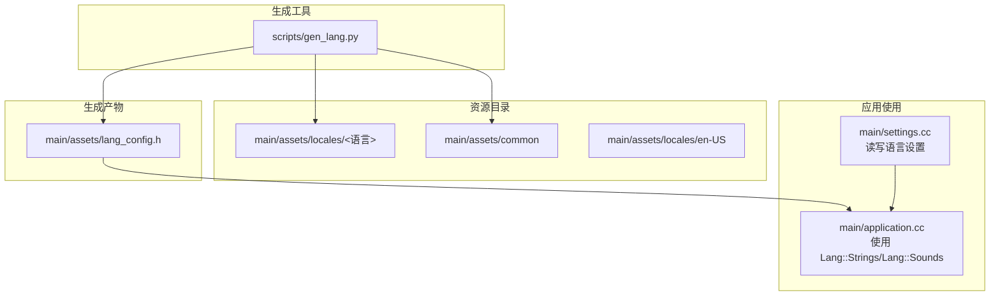
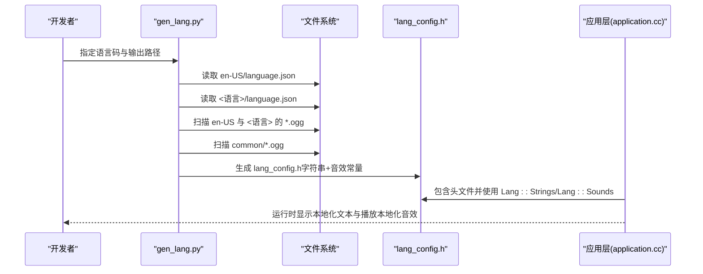
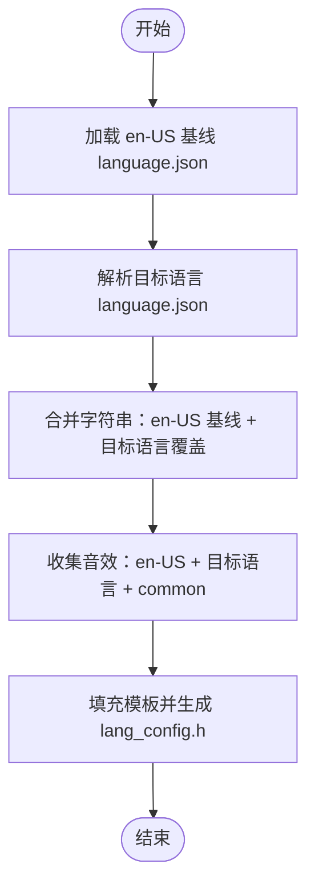
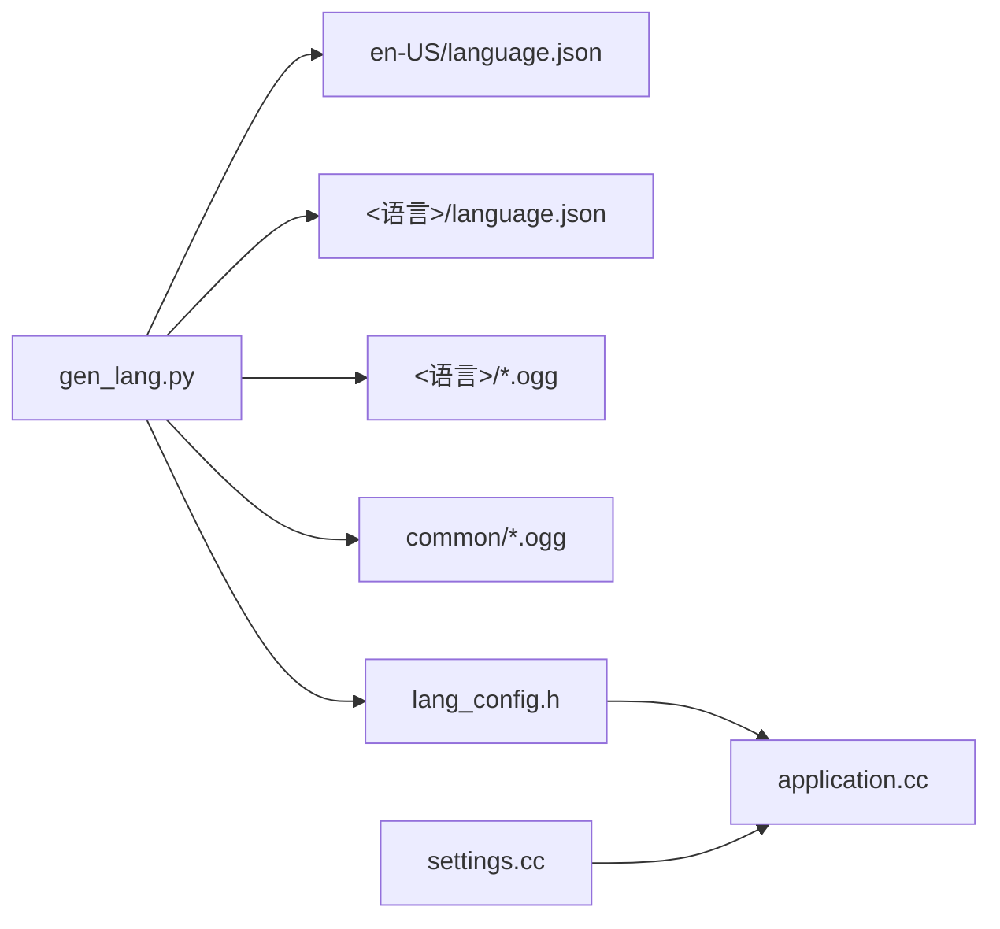

# 语言生成工具

<cite>
**本文引用的文件**
- [scripts/gen_lang.py](file://scripts/gen_lang.py)
- [main/assets/lang_config.h](file://main/assets/lang_config.h)
- [main/assets/locales/en-US/language.json](file://main/assets/locales/en-US/language.json)
- [main/assets/locales/zh-CN/language.json](file://main/assets/locales/zh-CN/language.json)
- [main/assets/locales/ar-SA/language.json](file://main/assets/locales/ar-SA/language.json)
- [main/assets/common/exclamation.ogg](file://main/assets/common/exclamation.ogg)
- [main/assets/common/success.ogg](file://main/assets/common/success.ogg)
- [main/assets/common/popup.ogg](file://main/assets/common/popup.ogg)
- [main/assets/common/vibration.ogg](file://main/assets/common/vibration.ogg)
- [main/assets/locales/en-US/activation.ogg](file://main/assets/locales/en-US/activation.ogg)
- [main/assets/locales/en-US/err_pin.ogg](file://main/assets/locales/en-US/err_pin.ogg)
- [main/assets/locales/en-US/err_reg.ogg](file://main/assets/locales/en-US/err_reg.ogg)
- [main/assets/locales/en-US/upgrade.ogg](file://main/assets/locales/en-US/upgrade.ogg)
- [main/assets/locales/en-US/welcome.ogg](file://main/assets/locales/en-US/welcome.ogg)
- [main/assets/locales/en-US/wificonfig.ogg](file://main/assets/locales/en-US/wificonfig.ogg)
- [main/assets/locales/en-US/0.ogg](file://main/assets/locales/en-US/0.ogg)
- [main/assets/locales/en-US/1.ogg](file://main/assets/locales/en-US/1.ogg)
- [main/assets/locales/en-US/2.ogg](file://main/assets/locales/en-US/2.ogg)
- [main/assets/locales/en-US/3.ogg](file://main/assets/locales/en-US/3.ogg)
- [main/assets/locales/en-US/4.ogg](file://main/assets/locales/en-US/4.ogg)
- [main/assets/locales/en-US/5.ogg](file://main/assets/locales/en-US/5.ogg)
- [main/assets/locales/en-US/6.ogg](file://main/assets/locales/en-US/6.ogg)
- [main/assets/locales/en-US/7.ogg](file://main/assets/locales/en-US/7.ogg)
- [main/assets/locales/en-US/8.ogg](file://main/assets/locales/en-US/8.ogg)
- [main/assets/locales/en-US/9.ogg](file://main/assets/locales/en-US/9.ogg)
- [main/application.h](file://main/application.h)
- [main/application.cc](file://main/application.cc)
- [main/settings.h](file://main/settings.h)
- [main/settings.cc](file://main/settings.cc)
</cite>

## 目录
1. [简介](#简介)
2. [项目结构](#项目结构)
3. [核心组件](#核心组件)
4. [架构总览](#架构总览)
5. [详细组件分析](#详细组件分析)
6. [依赖关系分析](#依赖关系分析)
7. [性能考虑](#性能考虑)
8. [故障排查指南](#故障排查指南)
9. [结论](#结论)
10. [附录](#附录)

## 简介
本文件面向“语言生成工具”的使用者与维护者，系统性讲解 gen_lang.py 的功能、实现原理与使用方式，涵盖多语言资源提取、翻译管理、本地化配置、语言切换与动态加载机制、新增语言支持步骤、维护与更新流程，以及实际生成示例与配置方法。目标是帮助读者在不深入底层代码的情况下，也能高效地完成语言资源的本地化与集成。

## 项目结构
语言资源与生成工具主要分布在以下位置：
- 资源与生成脚本
  - scripts/gen_lang.py：语言配置头文件生成器
  - main/assets/locales/<语言>/language.json：各语言字符串资源定义
  - main/assets/locales/<语言>/*.ogg：各语言音效资源
  - main/assets/common/*.ogg：公共资源音效（跨语言）
  - main/assets/lang_config.h：由 gen_lang.py 生成的最终语言配置头文件
- 应用层使用
  - main/application.h/.cc：应用逻辑，使用 Lang::Strings 与 Lang::Sounds
  - main/settings.h/.cc：设置存储接口（用于持久化语言选择）

图表来源
- [scripts/gen_lang.py](file://scripts/gen_lang.py#L1-L187)
- [main/assets/lang_config.h](file://main/assets/lang_config.h#L1-L214)
- [main/application.cc](file://main/application.cc#L1-L200)
- [main/settings.cc](file://main/settings.cc#L1-L109)

章节来源
- [scripts/gen_lang.py](file://scripts/gen_lang.py#L1-L187)
- [main/assets/lang_config.h](file://main/assets/lang_config.h#L1-L214)
- [main/application.cc](file://main/application.cc#L1-L200)
- [main/settings.cc](file://main/settings.cc#L1-L109)

## 核心组件
- 语言生成器（gen_lang.py）
  - 功能：读取指定语言的 language.json，合并 en-US 基线语言，生成 C++ 头文件 lang_config.h；同时收集该语言与 en-US、common 目录下的音效文件，生成对应的静态字符串视图常量，供应用直接播放。
  - 特点：以 en-US 作为回退基线，缺失键或音效自动回退至 en-US；公共音效统一暴露。
- 语言配置头文件（lang_config.h）
  - 结构：包含语言元数据、字符串常量、音效常量三部分，命名空间为 Lang。
  - 用途：被应用层直接包含，通过 Lang::Strings::<KEY> 与 Lang::Sounds::OGG_<NAME> 使用。
- 应用层（application.cc）
  - 使用示例：在升级、激活、错误提示等场景中，调用 Lang::Strings 中的文本与 Lang::Sounds 中的音效。
- 设置层（settings.h/.cc）
  - 提供 NVS 存储接口，可用于持久化当前语言码，配合应用层进行语言切换。

章节来源
- [scripts/gen_lang.py](file://scripts/gen_lang.py#L32-L175)
- [main/assets/lang_config.h](file://main/assets/lang_config.h#L11-L214)
- [main/application.cc](file://main/application.cc#L79-L176)
- [main/settings.h](file://main/settings.h#L7-L26)
- [main/settings.cc](file://main/settings.cc#L21-L108)

## 架构总览
语言生成工具的端到端工作流如下：

图表来源
- [scripts/gen_lang.py](file://scripts/gen_lang.py#L32-L175)
- [main/assets/lang_config.h](file://main/assets/lang_config.h#L1-L214)
- [main/application.cc](file://main/application.cc#L79-L176)

## 详细组件分析

### 语言生成器（gen_lang.py）详解
- 输入与输出
  - 输入：assets/locales/<语言>/language.json；assets/locales/<语言>/*.ogg；assets/locales/en-US/*.ogg；assets/common/*.ogg
  - 输出：main/assets/lang_config.h
- 数据合并策略
  - 字符串：以 en-US 为基线，<语言> 覆盖缺失项；未覆盖的键保持 en-US 值。
  - 音效：合并 en-US、<语言>、common 三者的所有文件名，优先使用 <语言>，否则回退 en-US，最后为公共音效。
- 生成内容
  - 字符串常量：Lang::Strings::<KEY>，KEY 为大写枚举式常量。
  - 音效常量：Lang::Sounds::OGG_<NAME>，对应二进制段符号，可直接传入播放器。
- 错误处理
  - 缺失 en-US 基线文件时，仅发出警告并继续运行，禁用回退机制。
  - language.json 结构非法时抛出异常。
- 命令行参数
  - --language：目标语言码（如 zh-CN、en-US、ja-JP）
  - --output：输出头文件路径（通常为 main/assets/lang_config.h）

图表来源
- [scripts/gen_lang.py](file://scripts/gen_lang.py#L32-L175)

章节来源
- [scripts/gen_lang.py](file://scripts/gen_lang.py#L32-L175)

### 语言配置头文件（lang_config.h）结构
- 语言元数据
  - Lang::CODE：当前语言码（如 zh-CN）
- 字符串资源
  - Lang::Strings::KEY：每个 KEY 对应一个字符串常量，来源于合并后的 language.json
- 音效资源
  - Lang::Sounds::OGG_<NAME>：每个音效文件生成对应的常量，内部封装二进制起止指针与长度，便于直接播放

章节来源
- [main/assets/lang_config.h](file://main/assets/lang_config.h#L11-L214)

### 应用层使用示例（application.cc）
- 文本使用
  - 示例：在检查新版本失败时，使用 Lang::Strings::CHECK_NEW_VERSION_FAILED 显示消息
- 音效使用
  - 示例：在错误提示时，使用 Lang::Sounds::OGG_EXCLAMATION 播放音效
  - 示例：激活码播报时，按数字映射到 Lang::Sounds::OGG_0..OGG_9

章节来源
- [main/application.cc](file://main/application.cc#L79-L176)

### 设置层（settings.h/.cc）与语言切换
- 设置接口
  - 提供 GetString/SetString/GetInt/SetInt/GetBool/SetBool 等方法，基于 NVS 存储
- 语言切换建议
  - 将当前语言码保存在 NVS（如 key 为 "lang"），应用启动时读取并决定生成哪个语言的 lang_config.h
  - 切换语言后重新生成 lang_config.h 并重启相关模块（如音频服务）

章节来源
- [main/settings.h](file://main/settings.h#L7-L26)
- [main/settings.cc](file://main/settings.cc#L21-L108)

## 依赖关系分析
- 生成器对资源的依赖
  - 必需：assets/locales/en-US/language.json
  - 可选：assets/locales/<语言>/language.json、assets/locales/<语言>/*.ogg、assets/common/*.ogg
- 应用对生成器产物的依赖
  - application.cc 直接包含 main/assets/lang_config.h 并使用 Lang 命名空间
- 设置层对 NVS 的依赖
  - settings.cc 通过 NVS 接口进行读写

图表来源
- [scripts/gen_lang.py](file://scripts/gen_lang.py#L32-L175)
- [main/assets/lang_config.h](file://main/assets/lang_config.h#L1-L214)
- [main/application.cc](file://main/application.cc#L1-L200)
- [main/settings.cc](file://main/settings.cc#L1-L109)

章节来源
- [scripts/gen_lang.py](file://scripts/gen_lang.py#L32-L175)
- [main/assets/lang_config.h](file://main/assets/lang_config.h#L1-L214)
- [main/application.cc](file://main/application.cc#L1-L200)
- [main/settings.cc](file://main/settings.cc#L1-L109)

## 性能考虑
- 生成阶段
  - 仅在构建或发布前运行一次，开销极小
- 运行阶段
  - 字符串常量为编译期常量，访问开销为常数时间
  - 音效常量为轻量包装，避免重复加载，减少内存占用
- 回退策略
  - en-US 基线与回退音效减少重复打包，提升构建效率

## 故障排查指南
- en-US 基线文件缺失
  - 现象：生成器发出警告并禁用回退机制
  - 处理：确保 assets/locales/en-US/language.json 存在且可读
- language.json 结构非法
  - 现象：生成器抛出异常
  - 处理：检查 language.json 是否包含 "language" 与 "strings" 字段，编码是否为 UTF-8
- 目标语言文件缺失
  - 现象：生成器抛出文件未找到异常
  - 处理：确认 assets/locales/<语言>/language.json 存在
- 音效文件未被打包
  - 现象：运行时报错找不到二进制符号
  - 处理：确保 assets/locales/<语言> 与 assets/common 下的 .ogg 文件存在且命名正确；检查构建系统是否将 .ogg 转为二进制段符号
- 应用无法显示本地化文本
  - 现象：显示英文或空值
  - 处理：确认生成的 lang_config.h 已被包含；确认 application.cc 中使用的是 Lang::Strings 的正确 KEY

章节来源
- [scripts/gen_lang.py](file://scripts/gen_lang.py#L32-L175)
- [main/application.cc](file://main/application.cc#L79-L176)

## 结论
gen_lang.py 将语言字符串与音效资源统一生成为 C++ 头文件，结合 en-US 基线与公共资源，实现了简洁高效的本地化方案。通过明确的资源组织与生成流程，开发者可以快速扩展新语言并安全地进行维护与更新。

## 附录

### 语言资源组织结构
- locales 目录
  - 每个语言子目录包含：language.json（字符串资源）、若干 *.ogg（音效资源）
  - 示例：main/assets/locales/en-US、main/assets/locales/zh-CN、main/assets/locales/ar-SA 等
- common 目录
  - 公共音效资源，跨语言共享
  - 示例：main/assets/common/exclamation.ogg、success.ogg、popup.ogg、vibration.ogg

章节来源
- [main/assets/locales/en-US/language.json](file://main/assets/locales/en-US/language.json#L1-L59)
- [main/assets/locales/zh-CN/language.json](file://main/assets/locales/zh-CN/language.json#L1-L59)
- [main/assets/locales/ar-SA/language.json](file://main/assets/locales/ar-SA/language.json#L1-L59)
- [main/assets/common/exclamation.ogg](file://main/assets/common/exclamation.ogg)
- [main/assets/common/success.ogg](file://main/assets/common/success.ogg)
- [main/assets/common/popup.ogg](file://main/assets/common/popup.ogg)
- [main/assets/common/vibration.ogg](file://main/assets/common/vibration.ogg)

### 语言配置文件格式
- language.json 结构要点
  - "language": {"type": "<语言码>"}
  - "strings": { "<KEY>": "<本地化字符串>", ... }
- 生成器要求
  - 必须包含 "language" 与 "strings" 字段
  - 字符串键名将转换为大写常量（如 "WARNING" → Lang::Strings::WARNING）

章节来源
- [main/assets/locales/en-US/language.json](file://main/assets/locales/en-US/language.json#L1-L59)
- [main/assets/locales/zh-CN/language.json](file://main/assets/locales/zh-CN/language.json#L1-L59)
- [scripts/gen_lang.py](file://scripts/gen_lang.py#L76-L86)

### 音频资源命名规范
- 目录规范
  - 语言音效：assets/locales/<语言>/<name>.ogg
  - 公共音效：assets/common/<name>.ogg
- 生成规则
  - 生成器会为每个 .ogg 文件生成 Lang::Sounds::OGG_<NAME> 常量
  - 优先使用目标语言音效，否则回退 en-US，最后为公共音效

章节来源
- [scripts/gen_lang.py](file://scripts/gen_lang.py#L108-L161)
- [main/assets/locales/en-US/activation.ogg](file://main/assets/locales/en-US/activation.ogg)
- [main/assets/locales/en-US/err_pin.ogg](file://main/assets/locales/en-US/err_pin.ogg)
- [main/assets/locales/en-US/err_reg.ogg](file://main/assets/locales/en-US/err_reg.ogg)
- [main/assets/locales/en-US/upgrade.ogg](file://main/assets/locales/en-US/upgrade.ogg)
- [main/assets/locales/en-US/welcome.ogg](file://main/assets/locales/en-US/welcome.ogg)
- [main/assets/locales/en-US/wificonfig.ogg](file://main/assets/locales/en-US/wificonfig.ogg)
- [main/assets/locales/en-US/0.ogg](file://main/assets/locales/en-US/0.ogg)
- [main/assets/locales/en-US/1.ogg](file://main/assets/locales/en-US/1.ogg)
- [main/assets/locales/en-US/2.ogg](file://main/assets/locales/en-US/2.ogg)
- [main/assets/locales/en-US/3.ogg](file://main/assets/locales/en-US/3.ogg)
- [main/assets/locales/en-US/4.ogg](file://main/assets/locales/en-US/4.ogg)
- [main/assets/locales/en-US/5.ogg](file://main/assets/locales/en-US/5.ogg)
- [main/assets/locales/en-US/6.ogg](file://main/assets/locales/en-US/6.ogg)
- [main/assets/locales/en-US/7.ogg](file://main/assets/locales/en-US/7.ogg)
- [main/assets/locales/en-US/8.ogg](file://main/assets/locales/en-US/8.ogg)
- [main/assets/locales/en-US/9.ogg](file://main/assets/locales/en-US/9.ogg)

### 语言切换与动态加载原理
- 语言切换流程
  - 读取 NVS 中的语言码（如 zh-CN）
  - 运行 gen_lang.py 生成 main/assets/lang_config.h
  - 重新编译应用，使用新的 Lang::Strings/Lang::Sounds
- 动态加载建议
  - 当前实现为静态生成，运行时不可热切换
  - 如需动态切换，可在应用层增加语言选择菜单与重新生成流程，并在切换后重启相关模块

章节来源
- [main/settings.cc](file://main/settings.cc#L21-L108)
- [scripts/gen_lang.py](file://scripts/gen_lang.py#L53-L175)
- [main/application.cc](file://main/application.cc#L79-L176)

### 新增语言支持步骤与最佳实践
- 步骤
  - 在 main/assets/locales/<新语言> 创建目录
  - 复制 assets/locales/en-US/language.json 并翻译 "strings" 部分
  - 将 assets/locales/en-US 下的 *.ogg 复制到 <新语言> 目录，按需替换为本地化音效
  - 运行 gen_lang.py 生成 lang_config.h
  - 在应用层引入并使用 Lang::Strings/Lang::Sounds
- 最佳实践
  - 保持 language.json 的键名与 en-US 一致，仅翻译值
  - 音效命名与 en-US 保持一致，缺失音效自动回退
  - 使用公共音效减少重复资源
  - 在 CI 中加入生成与校验步骤，确保每次变更都生成最新 lang_config.h

章节来源
- [scripts/gen_lang.py](file://scripts/gen_lang.py#L53-L175)
- [main/assets/locales/en-US/language.json](file://main/assets/locales/en-US/language.json#L1-L59)

### 语言资源维护与更新流程
- 更新流程
  - 修改 assets/locales/<语言>/language.json 或替换 *.ogg
  - 重新运行 gen_lang.py 生成 lang_config.h
  - 编译并验证应用行为
- 发布前检查
  - 确认 en-US 基线完整
  - 确认目标语言覆盖了常用键
  - 确认音效文件命名与数量符合预期

章节来源
- [scripts/gen_lang.py](file://scripts/gen_lang.py#L32-L175)

### 实际使用示例与配置方法
- 生成示例
  - 命令：python3 scripts/gen_lang.py --language zh-CN --output main/assets/lang_config.h
  - 行为：合并 en-US 与 zh-CN 的字符串，收集 zh-CN、en-US、common 的音效，生成 lang_config.h
- 应用示例
  - 文本使用：Lang::Strings::CHECKING_NEW_VERSION
  - 音效使用：Lang::Sounds::OGG_EXCLAMATION
- 设置示例
  - 读取语言码：settings.GetString("lang", "en-US")
  - 设置语言码：settings.SetString("lang", "zh-CN")

章节来源
- [scripts/gen_lang.py](file://scripts/gen_lang.py#L176-L187)
- [main/application.cc](file://main/application.cc#L79-L176)
- [main/settings.cc](file://main/settings.cc#L21-L108)