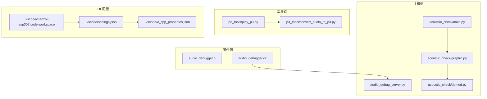
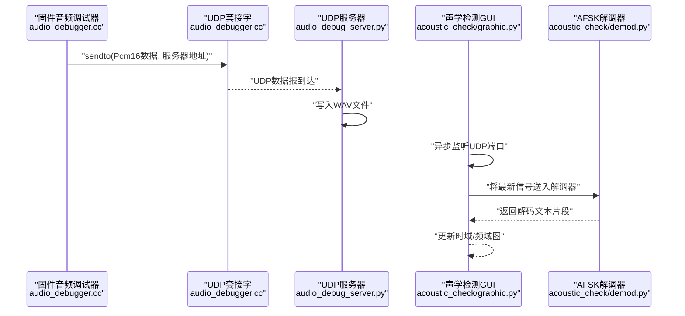
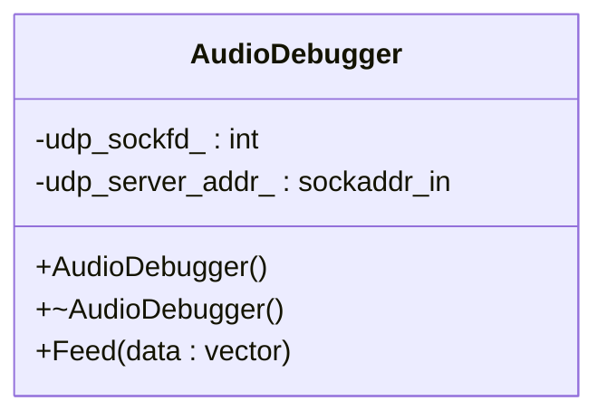
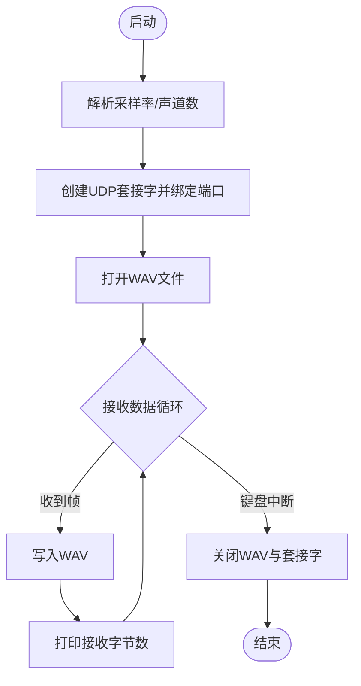
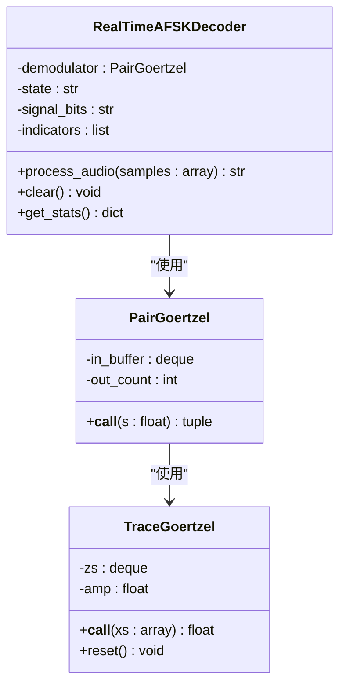
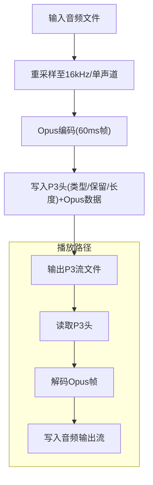
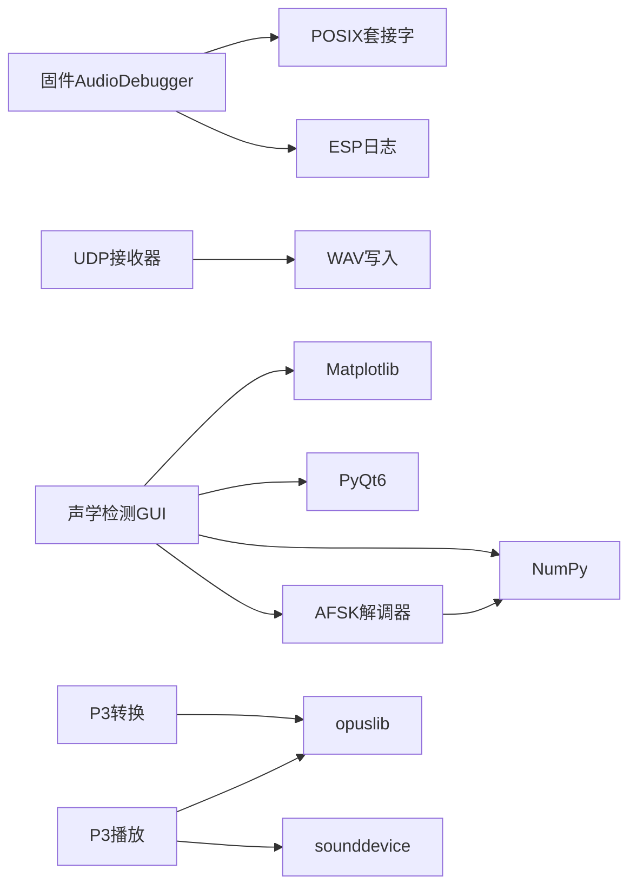

# 调试工具

<cite>
**本文引用的文件**
- [scripts/audio_debug_server.py](file://scripts/audio_debug_server.py)
- [main/audio/processors/audio_debugger.h](file://main/audio/processors/audio_debugger.h)
- [main/audio/processors/audio_debugger.cc](file://main/audio/processors/audio_debugger.cc)
- [scripts/acoustic_check/main.py](file://scripts/acoustic_check/main.py)
- [scripts/acoustic_check/graphic.py](file://scripts/acoustic_check/graphic.py)
- [scripts/acoustic_check/demod.py](file://scripts/acoustic_check/demod.py)
- [scripts/acoustic_check/readme.md](file://scripts/acoustic_check/readme.md)
- [scripts/p3_tools/play_p3.py](file://scripts/p3_tools/play_p3.py)
- [scripts/p3_tools/convert_audio_to_p3.py](file://scripts/p3_tools/convert_audio_to_p3.py)
- [.vscode/settings.json](file://.vscode/settings.json)
- [.vscode/c_cpp_properties.json](file://.vscode/c_cpp_properties.json)
- [.vscode/xiaozhi-esp307.code-workspace](file://.vscode/xiaozhi-esp307.code-workspace)
</cite>

## 目录
1. [简介](#简介)
2. [项目结构](#项目结构)
3. [核心组件](#核心组件)
4. [架构总览](#架构总览)
5. [详细组件分析](#详细组件分析)
6. [依赖关系分析](#依赖关系分析)
7. [性能考量](#性能考量)
8. [故障排查指南](#故障排查指南)
9. [结论](#结论)
10. [附录](#附录)

## 简介
本指南面向开发者与测试工程师，系统讲解本项目的音频调试工具链：包括音频调试服务器的配置与使用、客户端（ESP32固件）如何发送音频流、实时音频监控与频谱分析、声学检测工具（AFSK解调与GUI可视化）、以及开发调试最佳实践（日志、性能、内存、断点）。同时提供与VS Code的集成配置建议与常见问题诊断。

## 项目结构
围绕“音频调试”主题，相关文件主要分布在以下位置：
- 固件侧：音频调试器类负责将PCM数据通过UDP发送到主机
- 主机侧：UDP接收脚本与声学检测GUI，支持时域/频域可视化、AFSK解调、音频保存
- P3工具链：将音频转换为P3流（Opus封装），并支持播放
- IDE配置：VS Code工作区与C/C++编译配置

**图表来源**
- [main/audio/processors/audio_debugger.h](file://main/audio/processors/audio_debugger.h#L1-L22)
- [main/audio/processors/audio_debugger.cc](file://main/audio/processors/audio_debugger.cc#L1-L68)
- [scripts/audio_debug_server.py](file://scripts/audio_debug_server.py#L1-L55)
- [scripts/acoustic_check/main.py](file://scripts/acoustic_check/main.py#L1-L19)
- [scripts/acoustic_check/graphic.py](file://scripts/acoustic_check/graphic.py#L1-L444)
- [scripts/acoustic_check/demod.py](file://scripts/acoustic_check/demod.py#L1-L281)
- [.vscode/settings.json](file://.vscode/settings.json)
- [.vscode/c_cpp_properties.json](file://.vscode/c_cpp_properties.json)
- [.vscode/xiaozhi-esp307.code-workspace](file://.vscode/xiaozhi-esp307.code-workspace)

**章节来源**
- [scripts/audio_debug_server.py](file://scripts/audio_debug_server.py#L1-L55)
- [main/audio/processors/audio_debugger.h](file://main/audio/processors/audio_debugger.h#L1-L22)
- [main/audio/processors/audio_debugger.cc](file://main/audio/processors/audio_debugger.cc#L1-L68)
- [scripts/acoustic_check/main.py](file://scripts/acoustic_check/main.py#L1-L19)
- [scripts/acoustic_check/graphic.py](file://scripts/acoustic_check/graphic.py#L1-L444)
- [scripts/acoustic_check/demod.py](file://scripts/acoustic_check/demod.py#L1-L281)
- [scripts/p3_tools/play_p3.py](file://scripts/p3_tools/play_p3.py#L1-L72)
- [scripts/p3_tools/convert_audio_to_p3.py](file://scripts/p3_tools/convert_audio_to_p3.py#L1-L62)
- [.vscode/settings.json](file://.vscode/settings.json)
- [.vscode/c_cpp_properties.json](file://.vscode/c_cpp_properties.json)
- [.vscode/xiaozhi-esp307.code-workspace](file://.vscode/xiaozhi-esp307.code-workspace)

## 核心组件
- 固件侧音频调试器：在启用开关下，将PCM样本打包并通过UDP发送到指定地址
- 主机侧UDP接收器：绑定本地端口，接收二进制PCM并写入WAV文件
- 声学检测GUI：基于PyQt6/Matplotlib，实时绘制时域/频域图，内置AFSK解调器
- P3工具链：将音频编码为P3流（Opus封装），并支持播放
- IDE集成：VS Code工作区与C/C++编译配置，便于断点与日志调试

**章节来源**
- [main/audio/processors/audio_debugger.h](file://main/audio/processors/audio_debugger.h#L1-L22)
- [main/audio/processors/audio_debugger.cc](file://main/audio/processors/audio_debugger.cc#L1-L68)
- [scripts/audio_debug_server.py](file://scripts/audio_debug_server.py#L1-L55)
- [scripts/acoustic_check/graphic.py](file://scripts/acoustic_check/graphic.py#L1-L444)
- [scripts/acoustic_check/demod.py](file://scripts/acoustic_check/demod.py#L1-L281)
- [scripts/p3_tools/play_p3.py](file://scripts/p3_tools/play_p3.py#L1-L72)
- [scripts/p3_tools/convert_audio_to_p3.py](file://scripts/p3_tools/convert_audio_to_p3.py#L1-L62)

## 架构总览
下面的时序图展示了从固件采集/处理PCM，到主机接收并可视化的完整流程。

**图表来源**
- [main/audio/processors/audio_debugger.cc](file://main/audio/processors/audio_debugger.cc#L54-L66)
- [scripts/audio_debug_server.py](file://scripts/audio_debug_server.py#L25-L43)
- [scripts/acoustic_check/graphic.py](file://scripts/acoustic_check/graphic.py#L327-L374)
- [scripts/acoustic_check/demod.py](file://scripts/acoustic_check/demod.py#L179-L224)

## 详细组件分析

### 固件侧音频调试器（AudioDebugger）
- 功能要点
  - 在启用宏开关下初始化UDP套接字
  - 解析配置中的“IP:PORT”，建立目标地址
  - 将输入的16位PCM样本按字节发送
  - 日志记录发送状态与错误
- 关键行为
  - 构造函数：解析服务器地址并校验格式
  - 析构函数：关闭UDP套接字
  - Feed接口：发送PCM数据，失败时记录警告日志

**图表来源**
- [main/audio/processors/audio_debugger.h](file://main/audio/processors/audio_debugger.h#L10-L20)
- [main/audio/processors/audio_debugger.cc](file://main/audio/processors/audio_debugger.cc#L16-L66)

**章节来源**
- [main/audio/processors/audio_debugger.h](file://main/audio/processors/audio_debugger.h#L1-L22)
- [main/audio/processors/audio_debugger.cc](file://main/audio/processors/audio_debugger.cc#L1-L68)

### 主机侧UDP音频接收器（audio_debug_server.py）
- 功能要点
  - 创建UDP套接字并绑定本地端口
  - 接收二进制PCM数据，写入WAV文件
  - 支持采样率与声道数参数
  - 键盘中断优雅退出并保存文件
- 关键行为
  - 参数解析：采样率、声道数
  - 循环接收：每帧写入WAV
  - 终止：关闭文件与套接字

**图表来源**
- [scripts/audio_debug_server.py](file://scripts/audio_debug_server.py#L11-L43)

**章节来源**
- [scripts/audio_debug_server.py](file://scripts/audio_debug_server.py#L1-L55)

### 声学检测GUI与AFSK解调器
- GUI功能
  - 异步监听UDP端口，接收PCM数据
  - 实时绘制时域/频域图
  - AFSK解调器：基于Goertzel算法，识别Mark/Space频率，输出ASCII文本
  - 支持保存音频为WAV
- 解调器实现
  - TraceGoertzel：单频Goertzel，计算复振幅
  - PairGoertzel：双频Goertzel，输出mark概率
  - RealTimeAFSKDecoder：状态机驱动，起始帧触发，结束帧终止，比特拼接与ASCII解码

**图表来源**
- [scripts/acoustic_check/demod.py](file://scripts/acoustic_check/demod.py#L9-L62)
- [scripts/acoustic_check/demod.py](file://scripts/acoustic_check/demod.py#L64-L124)
- [scripts/acoustic_check/demod.py](file://scripts/acoustic_check/demod.py#L126-L281)

**章节来源**
- [scripts/acoustic_check/graphic.py](file://scripts/acoustic_check/graphic.py#L1-L444)
- [scripts/acoustic_check/demod.py](file://scripts/acoustic_check/demod.py#L1-L281)
- [scripts/acoustic_check/readme.md](file://scripts/acoustic_check/readme.md#L1-L23)

### P3工具链（Opus封装与播放）
- 转换工具
  - 将任意音频转为16kHz、单声道、Opus封装的P3流，按60ms帧切片
  - 可选响度归一化
- 播放工具
  - 读取P3文件，解码Opus，输出到音频流播放

**图表来源**
- [scripts/p3_tools/convert_audio_to_p3.py](file://scripts/p3_tools/convert_audio_to_p3.py#L11-L50)
- [scripts/p3_tools/play_p3.py](file://scripts/p3_tools/play_p3.py#L8-L61)

**章节来源**
- [scripts/p3_tools/convert_audio_to_p3.py](file://scripts/p3_tools/convert_audio_to_p3.py#L1-L62)
- [scripts/p3_tools/play_p3.py](file://scripts/p3_tools/play_p3.py#L1-L72)

## 依赖关系分析
- 固件侧依赖
  - ESP-IDF网络与日志库（仅在启用宏时编译）
  - POSIX套接字API用于UDP通信
- 主机侧依赖
  - Python标准库socket/wave
  - PyQt6/Matplotlib用于GUI与绘图
  - NumPy用于数值计算
  - asyncio用于异步UDP监听
- 声学检测依赖
  - AFSK解调器依赖NumPy与自定义Goertzel实现
- P3工具链依赖
  - opuslib、sounddevice、librosa、pyloudnorm

**图表来源**
- [main/audio/processors/audio_debugger.cc](file://main/audio/processors/audio_debugger.cc#L1-L11)
- [scripts/audio_debug_server.py](file://scripts/audio_debug_server.py#L1-L2)
- [scripts/acoustic_check/graphic.py](file://scripts/acoustic_check/graphic.py#L1-L17)
- [scripts/acoustic_check/demod.py](file://scripts/acoustic_check/demod.py#L1-L7)
- [scripts/p3_tools/play_p3.py](file://scripts/p3_tools/play_p3.py#L1-L6)
- [scripts/p3_tools/convert_audio_to_p3.py](file://scripts/p3_tools/convert_audio_to_p3.py#L1-L9)

**章节来源**
- [main/audio/processors/audio_debugger.cc](file://main/audio/processors/audio_debugger.cc#L1-L11)
- [scripts/audio_debug_server.py](file://scripts/audio_debug_server.py#L1-L2)
- [scripts/acoustic_check/graphic.py](file://scripts/acoustic_check/graphic.py#L1-L17)
- [scripts/acoustic_check/demod.py](file://scripts/acoustic_check/demod.py#L1-L7)
- [scripts/p3_tools/play_p3.py](file://scripts/p3_tools/play_p3.py#L1-L6)
- [scripts/p3_tools/convert_audio_to_p3.py](file://scripts/p3_tools/convert_audio_to_p3.py#L1-L9)

## 性能考量
- UDP接收器
  - 使用固定缓冲与循环写入，避免频繁系统调用
  - 建议在高吞吐场景下考虑环形缓冲与后台线程
- GUI与解调
  - FFT与Goertzel计算复杂度较高，建议限制显示窗口长度与采样率
  - 解调器按比特周期输出，避免每采样点都做昂贵运算
- P3工具链
  - Opus编码帧长60ms，适合低延迟语音；若需更低延迟可减小帧长但会增加CPU
  - 响度归一化可能引入失真，建议对TTS或已归一化音频禁用

[本节为通用指导，无需列出具体文件来源]

## 故障排查指南
- 固件无法发送UDP
  - 检查宏开关是否启用，服务器地址格式是否为“IP:PORT”
  - 查看日志中“Failed to create UDP socket”或“Failed to send audio data”
- 主机无法接收
  - 确认监听地址与端口正确，防火墙放行UDP
  - 检查WAV文件是否被占用或磁盘空间不足
- GUI无数据显示
  - 确认已点击“开始监听”，端口格式合法
  - 检查解调器统计信息，确认已进入“entering”状态
- AFSK解码不稳定
  - 调整阈值与窗口大小，关注“mark/space频率”与“比特率”匹配
  - 不同硬件平台的ADC/麦克风差异较大，参考声学检测测试记录
- P3播放无声或失真
  - 确认采样率与声道数参数，检查Opus解码器初始化
  - 若启用响度归一化，尝试禁用以避免过度压缩

**章节来源**
- [main/audio/processors/audio_debugger.cc](file://main/audio/processors/audio_debugger.cc#L34-L42)
- [scripts/audio_debug_server.py](file://scripts/audio_debug_server.py#L25-L43)
- [scripts/acoustic_check/graphic.py](file://scripts/acoustic_check/graphic.py#L327-L374)
- [scripts/acoustic_check/demod.py](file://scripts/acoustic_check/demod.py#L129-L177)
- [scripts/p3_tools/play_p3.py](file://scripts/p3_tools/play_p3.py#L13-L27)

## 结论
本调试工具链覆盖了从固件到主机的完整音频调试闭环：固件侧通过AudioDebugger将PCM经UDP发送，主机侧用UDP接收器与声学检测GUI进行可视化与解调，辅以P3工具链完成音频编码/播放。结合日志与IDE配置，可高效定位音频质量、频谱异常、回声与噪声等问题，并形成可重复的测试流程。

[本节为总结性内容，无需列出具体文件来源]

## 附录

### 使用步骤速查
- 启用固件侧调试
  - 在配置中启用音频调试宏，并设置UDP服务器地址为“本机IP:8000”
  - 参考：[main/audio/processors/audio_debugger.cc](file://main/audio/processors/audio_debugger.cc#L20-L38)
- 启动主机侧UDP接收
  - 运行脚本，指定采样率与声道数，默认监听0.0.0.0:8000
  - 参考：[scripts/audio_debug_server.py](file://scripts/audio_debug_server.py#L46-L54)
- 启动声学检测GUI
  - 运行主程序，设置监听地址与端口，点击“开始监听”
  - 参考：[scripts/acoustic_check/main.py](file://scripts/acoustic_check/main.py#L11-L18)，[scripts/acoustic_check/graphic.py](file://scripts/acoustic_check/graphic.py#L327-L374)
- 分析与保存
  - 在GUI中查看时域/频域图与解码文本，必要时保存音频
  - 参考：[scripts/acoustic_check/graphic.py](file://scripts/acoustic_check/graphic.py#L402-L423)
- P3工具链
  - 转换：将音频转为P3流；播放：读取P3并播放
  - 参考：[scripts/p3_tools/convert_audio_to_p3.py](file://scripts/p3_tools/convert_audio_to_p3.py#L51-L62)，[scripts/p3_tools/play_p3.py](file://scripts/p3_tools/play_p3.py#L63-L71)

**章节来源**
- [main/audio/processors/audio_debugger.cc](file://main/audio/processors/audio_debugger.cc#L20-L38)
- [scripts/audio_debug_server.py](file://scripts/audio_debug_server.py#L46-L54)
- [scripts/acoustic_check/main.py](file://scripts/acoustic_check/main.py#L11-L18)
- [scripts/acoustic_check/graphic.py](file://scripts/acoustic_check/graphic.py#L327-L374)
- [scripts/acoustic_check/graphic.py](file://scripts/acoustic_check/graphic.py#L402-L423)
- [scripts/p3_tools/convert_audio_to_p3.py](file://scripts/p3_tools/convert_audio_to_p3.py#L51-L62)
- [scripts/p3_tools/play_p3.py](file://scripts/p3_tools/play_p3.py#L63-L71)

### 开发调试最佳实践
- 日志配置
  - 固件侧使用ESP日志等级区分信息/调试/警告
  - 参考：[main/audio/processors/audio_debugger.cc](file://main/audio/processors/audio_debugger.cc#L33-L41)
- 性能监控
  - GUI中观察接收数据量与解码统计，定位瓶颈
  - 参考：[scripts/acoustic_check/graphic.py](file://scripts/acoustic_check/graphic.py#L394-L401)，[scripts/acoustic_check/demod.py](file://scripts/acoustic_check/demod.py#L269-L281)
- 内存分析
  - 关注GUI中的双端队列长度与时域/频域缓冲，避免无限增长
  - 参考：[scripts/acoustic_check/graphic.py](file://scripts/acoustic_check/graphic.py#L66-L71)
- 断点调试
  - 在AudioDebugger::Feed处设置断点，验证UDP发送路径
  - 在GUI的解调回调中设置断点，检查解码状态机
  - 参考：[main/audio/processors/audio_debugger.cc](file://main/audio/processors/audio_debugger.cc#L54-L66)，[scripts/acoustic_check/graphic.py](file://scripts/acoustic_check/graphic.py#L285-L301)

**章节来源**
- [main/audio/processors/audio_debugger.cc](file://main/audio/processors/audio_debugger.cc#L33-L41)
- [scripts/acoustic_check/graphic.py](file://scripts/acoustic_check/graphic.py#L394-L401)
- [scripts/acoustic_check/demod.py](file://scripts/acoustic_check/demod.py#L269-L281)
- [scripts/acoustic_check/graphic.py](file://scripts/acoustic_check/graphic.py#L66-L71)

### IDE集成配置（VS Code）
- 工作区与设置
  - 使用工作区文件统一团队配置
  - 参考：[.vscode/xiaozhi-esp307.code-workspace](file://.vscode/xiaozhi-esp307.code-workspace)
- C/C++编译配置
  - 配置包含路径、编译选项与IntelliSense
  - 参考：[.vscode/c_cpp_properties.json](file://.vscode/c_cpp_properties.json)
- 通用设置
  - 语言、缩进、编码等基础偏好
  - 参考：[.vscode/settings.json](file://.vscode/settings.json)

**章节来源**
- [.vscode/xiaozhi-esp307.code-workspace](file://.vscode/xiaozhi-esp307.code-workspace)
- [.vscode/c_cpp_properties.json](file://.vscode/c_cpp_properties.json)
- [.vscode/settings.json](file://.vscode/settings.json)