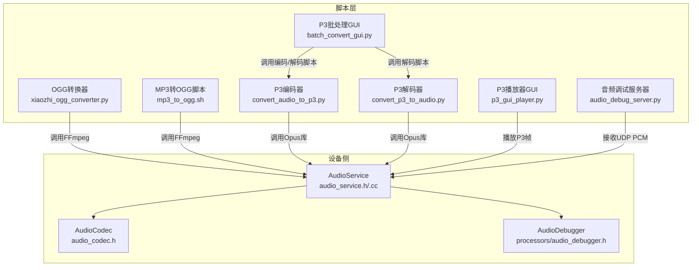
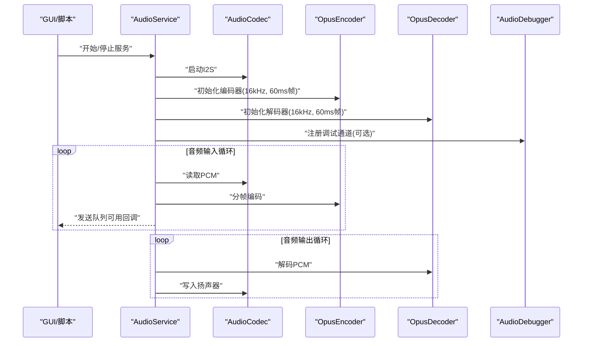
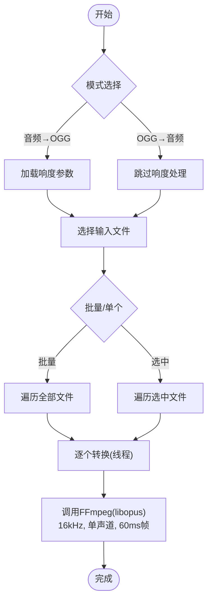
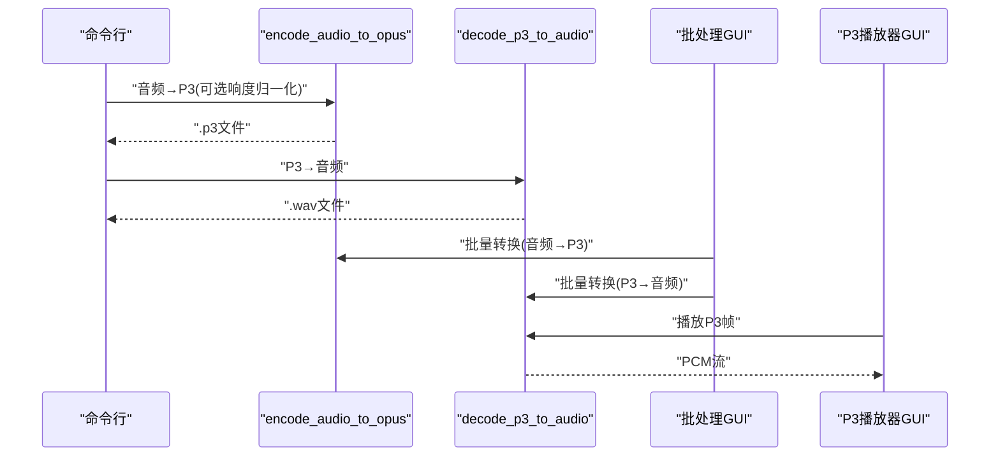
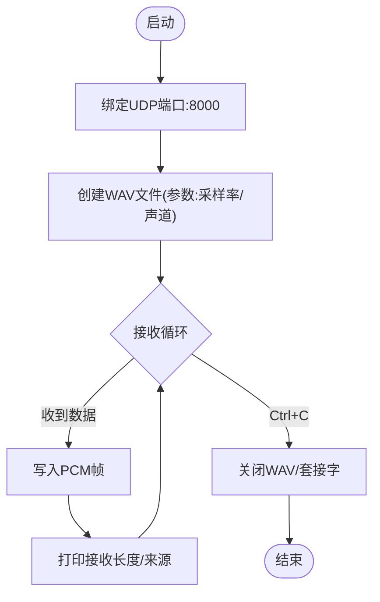
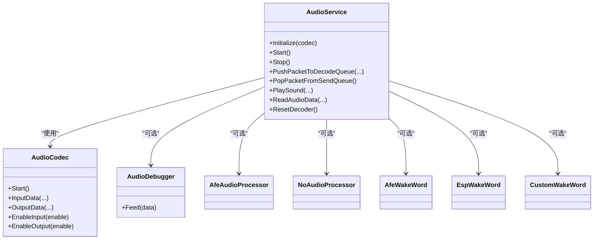
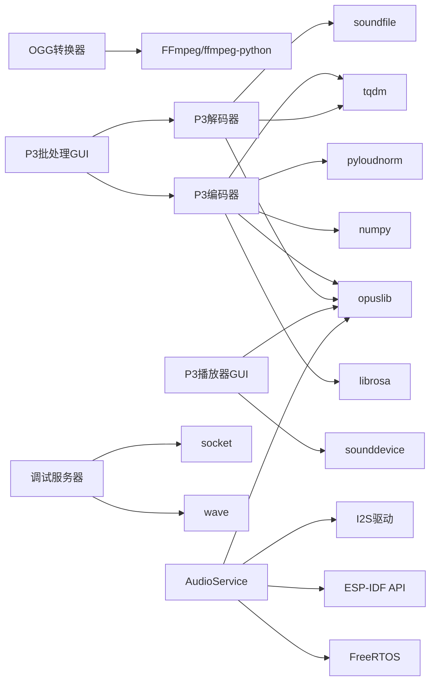

# 音频处理工具

<cite>
**本文引用的文件**
- [scripts/ogg_converter/xiaozhi_ogg_converter.py](file://scripts/ogg_converter/xiaozhi_ogg_converter.py)
- [scripts/ogg_converter/README.md](file://scripts/ogg_converter/README.md)
- [scripts/mp3_to_ogg.sh](file://scripts/mp3_to_ogg.sh)
- [scripts/p3_tools/convert_audio_to_p3.py](file://scripts/p3_tools/convert_audio_to_p3.py)
- [scripts/p3_tools/convert_p3_to_audio.py](file://scripts/p3_tools/convert_p3_to_audio.py)
- [scripts/p3_tools/batch_convert_gui.py](file://scripts/p3_tools/batch_convert_gui.py)
- [scripts/p3_tools/p3_gui_player.py](file://scripts/p3_tools/p3_gui_player.py)
- [scripts/audio_debug_server.py](file://scripts/audio_debug_server.py)
- [main/audio/audio_service.h](file://main/audio/audio_service.h)
- [main/audio/audio_service.cc](file://main/audio/audio_service.cc)
- [main/audio/audio_codec.h](file://main/audio/audio_codec.h)
- [main/audio/processors/audio_debugger.h](file://main/audio/processors/audio_debugger.h)
</cite>

## 目录
1. [简介](#简介)
2. [项目结构](#项目结构)
3. [核心组件](#核心组件)
4. [架构总览](#架构总览)
5. [详细组件分析](#详细组件分析)
6. [依赖关系分析](#依赖关系分析)
7. [性能与质量建议](#性能与质量建议)
8. [故障排查指南](#故障排查指南)
9. [结论](#结论)
10. [附录：命令行与使用示例](#附录命令行与使用示例)

## 简介
本指南面向音频处理工具使用者与开发者，系统介绍以下能力：
- OGG音频转换器：支持MP3等音频到OGG的批量转换、响度归一化、批量处理。
- P3音频工具集：音频到P3协议帧的编码、P3到音频的解码、P3播放器、GUI批处理。
- 音频调试服务器：UDP接收PCM流并保存为WAV，便于实时监控与质量分析。
- 设备侧音频服务：设备端音频采集、处理、编码、解码、播放与调试通道集成。

## 项目结构
围绕音频处理的关键位置如下：
- 脚本层（Python/Shell）：提供跨平台的音频转换、播放与调试工具。
- 设备侧（C++/ESP-IDF）：提供音频编解码、处理器、唤醒词、调试器与服务框架。

图表来源
- [scripts/ogg_converter/xiaozhi_ogg_converter.py](file://scripts/ogg_converter/xiaozhi_ogg_converter.py#L1-L231)
- [scripts/mp3_to_ogg.sh](file://scripts/mp3_to_ogg.sh#L1-L4)
- [scripts/p3_tools/convert_audio_to_p3.py](file://scripts/p3_tools/convert_audio_to_p3.py#L1-L62)
- [scripts/p3_tools/convert_p3_to_audio.py](file://scripts/p3_tools/convert_p3_to_audio.py#L1-L52)
- [scripts/p3_tools/batch_convert_gui.py](file://scripts/p3_tools/batch_convert_gui.py#L1-L221)
- [scripts/p3_tools/p3_gui_player.py](file://scripts/p3_tools/p3_gui_player.py#L1-L242)
- [scripts/audio_debug_server.py](file://scripts/audio_debug_server.py#L1-L55)
- [main/audio/audio_service.h](file://main/audio/audio_service.h#L1-L157)
- [main/audio/audio_service.cc](file://main/audio/audio_service.cc#L1-L200)
- [main/audio/audio_codec.h](file://main/audio/audio_codec.h#L1-L60)
- [main/audio/processors/audio_debugger.h](file://main/audio/processors/audio_debugger.h#L1-L22)

章节来源
- [scripts/ogg_converter/xiaozhi_ogg_converter.py](file://scripts/ogg_converter/xiaozhi_ogg_converter.py#L1-L231)
- [scripts/p3_tools/batch_convert_gui.py](file://scripts/p3_tools/batch_convert_gui.py#L1-L221)
- [scripts/p3_tools/p3_gui_player.py](file://scripts/p3_tools/p3_gui_player.py#L1-L242)
- [scripts/audio_debug_server.py](file://scripts/audio_debug_server.py#L1-L55)
- [main/audio/audio_service.h](file://main/audio/audio_service.h#L1-L157)
- [main/audio/audio_service.cc](file://main/audio/audio_service.cc#L1-L200)
- [main/audio/audio_codec.h](file://main/audio/audio_codec.h#L1-L60)
- [main/audio/processors/audio_debugger.h](file://main/audio/processors/audio_debugger.h#L1-L22)

## 核心组件
- OGG转换器（GUI/脚本）：支持MP3/音频→OGG与OGG→音频双向转换；可选响度归一化；批量文件管理与线程化转换。
- P3工具集：命令行音频→P3编码（响度可选）、P3→音频解码、P3播放器GUI、P3批处理GUI。
- 音频调试服务器：UDP监听并写入WAV文件，用于实时监控与质量分析。
- 设备侧音频服务：I2S音频采集/播放、音频处理器、唤醒词检测、Opus编解码、调试通道、多队列任务模型。

章节来源
- [scripts/ogg_converter/xiaozhi_ogg_converter.py](file://scripts/ogg_converter/xiaozhi_ogg_converter.py#L1-L231)
- [scripts/p3_tools/convert_audio_to_p3.py](file://scripts/p3_tools/convert_audio_to_p3.py#L1-L62)
- [scripts/p3_tools/convert_p3_to_audio.py](file://scripts/p3_tools/convert_p3_to_audio.py#L1-L52)
- [scripts/p3_tools/p3_gui_player.py](file://scripts/p3_tools/p3_gui_player.py#L1-L242)
- [scripts/audio_debug_server.py](file://scripts/audio_debug_server.py#L1-L55)
- [main/audio/audio_service.h](file://main/audio/audio_service.h#L1-L157)
- [main/audio/audio_service.cc](file://main/audio/audio_service.cc#L1-L200)

## 架构总览
设备侧采用“采集/播放+编解码”双任务模型，配合多队列（发送、测试、播放、解码）与事件组控制状态。脚本层通过FFmpeg或Opus库实现离线转换与播放，同时提供GUI提升易用性。

图表来源
- [main/audio/audio_service.h](file://main/audio/audio_service.h#L81-L157)
- [main/audio/audio_service.cc](file://main/audio/audio_service.cc#L33-L137)
- [main/audio/audio_codec.h](file://main/audio/audio_codec.h#L18-L60)
- [main/audio/processors/audio_debugger.h](file://main/audio/processors/audio_debugger.h#L10-L22)

## 详细组件分析

### OGG音频转换器（GUI）
- 功能要点
  - 双向模式：音频→OGG、OGG→音频。
  - 响度归一化：可选开启目标LUFS值；关闭时跳过响度调整。
  - 批量处理：树形列表选择文件，支持全选/选中转换。
  - 线程化转换：避免阻塞UI。
  - 输出目录可配置，自动创建。
- 关键流程（音频→OGG）

图表来源
- [scripts/ogg_converter/xiaozhi_ogg_converter.py](file://scripts/ogg_converter/xiaozhi_ogg_converter.py#L164-L226)

章节来源
- [scripts/ogg_converter/xiaozhi_ogg_converter.py](file://scripts/ogg_converter/xiaozhi_ogg_converter.py#L1-L231)
- [scripts/ogg_converter/README.md](file://scripts/ogg_converter/README.md#L1-L30)
- [scripts/mp3_to_ogg.sh](file://scripts/mp3_to_ogg.sh#L1-L4)

### P3音频工具集
- 编码器（音频→P3）
  - 支持响度归一化（可禁用），重采样至16kHz，单声道，60ms帧，逐帧Opus编码并写入自定义二进制包头。
  - 命令行参数：输入文件、输出文件、目标LUFS、禁用响度开关。
- 解码器（P3→音频）
  - 读取自定义包头，解析长度，Opus解码为PCM，合并后写入WAV。
- 批处理GUI（P3）
  - 支持音频→P3与P3→音频双向，响度设置，批量选择与线程转换。
- P3播放器GUI
  - 读取P3帧，解码并推送到系统音频输出流，支持播放/暂停/停止/循环。

图表来源
- [scripts/p3_tools/convert_audio_to_p3.py](file://scripts/p3_tools/convert_audio_to_p3.py#L11-L62)
- [scripts/p3_tools/convert_p3_to_audio.py](file://scripts/p3_tools/convert_p3_to_audio.py#L9-L52)
- [scripts/p3_tools/batch_convert_gui.py](file://scripts/p3_tools/batch_convert_gui.py#L190-L217)
- [scripts/p3_tools/p3_gui_player.py](file://scripts/p3_tools/p3_gui_player.py#L12-L73)

章节来源
- [scripts/p3_tools/convert_audio_to_p3.py](file://scripts/p3_tools/convert_audio_to_p3.py#L1-L62)
- [scripts/p3_tools/convert_p3_to_audio.py](file://scripts/p3_tools/convert_p3_to_audio.py#L1-L52)
- [scripts/p3_tools/batch_convert_gui.py](file://scripts/p3_tools/batch_convert_gui.py#L1-L221)
- [scripts/p3_tools/p3_gui_player.py](file://scripts/p3_tools/p3_gui_player.py#L1-L242)

### 音频调试服务器（UDP→WAV）
- 功能要点
  - 绑定UDP端口，接收PCM数据，按采样率/声道参数写入WAV文件。
  - 实时打印接收字节数与来源地址，支持中断安全退出。
  - 命令行参数：采样率（默认16kHz）、声道数（默认2）。
- 使用场景
  - 设备侧音频流实时监控、质量分析、问题定位。

图表来源
- [scripts/audio_debug_server.py](file://scripts/audio_debug_server.py#L11-L44)

章节来源
- [scripts/audio_debug_server.py](file://scripts/audio_debug_server.py#L1-L55)

### 设备侧音频服务（AudioService）
- 数据通路
  - 录音路径：麦克风→处理器→编码队列→Opus编码→发送队列→网络/存储。
  - 播放路径：网络/存储→解码队列→Opus解码→播放队列→扬声器。
- 关键特性
  - 多任务模型：音频输入/输出/编解码分离任务。
  - 多队列容量：根据60ms帧长限制队列深度，保障实时性。
  - 事件组：运行状态与回调（唤醒词、VAD变化、测试队列满）。
  - 采样率/通道适配：I2S采样率与16kHz参考之间通过重采样器适配。
  - 调试通道：可选的UDP调试输出。
- 类关系示意

图表来源
- [main/audio/audio_service.h](file://main/audio/audio_service.h#L81-L157)
- [main/audio/audio_codec.h](file://main/audio/audio_codec.h#L18-L60)
- [main/audio/processors/audio_debugger.h](file://main/audio/processors/audio_debugger.h#L10-L22)

章节来源
- [main/audio/audio_service.h](file://main/audio/audio_service.h#L1-L157)
- [main/audio/audio_service.cc](file://main/audio/audio_service.cc#L33-L137)
- [main/audio/audio_codec.h](file://main/audio/audio_codec.h#L1-L60)
- [main/audio/processors/audio_debugger.h](file://main/audio/processors/audio_debugger.h#L1-L22)

## 依赖关系分析
- 脚本层依赖
  - OGG转换器：ffmpeg-python（或系统ffmpeg）。
  - P3工具集：librosa、opuslib、numpy、tqdm、pyloudnorm、soundfile、tqdm。
  - 调试服务器：标准socket/wave库。
- 设备侧依赖
  - FreeRTOS、ESP-IDF、Opus编解码库、I2S驱动、音频处理器/唤醒词组件（可选）。

图表来源
- [scripts/ogg_converter/xiaozhi_ogg_converter.py](file://scripts/ogg_converter/xiaozhi_ogg_converter.py#L1-L231)
- [scripts/p3_tools/convert_audio_to_p3.py](file://scripts/p3_tools/convert_audio_to_p3.py#L1-L62)
- [scripts/p3_tools/convert_p3_to_audio.py](file://scripts/p3_tools/convert_p3_to_audio.py#L1-L52)
- [scripts/p3_tools/batch_convert_gui.py](file://scripts/p3_tools/batch_convert_gui.py#L1-L221)
- [scripts/p3_tools/p3_gui_player.py](file://scripts/p3_tools/p3_gui_player.py#L1-L242)
- [scripts/audio_debug_server.py](file://scripts/audio_debug_server.py#L1-L55)
- [main/audio/audio_service.cc](file://main/audio/audio_service.cc#L1-L200)

章节来源
- [scripts/ogg_converter/xiaozhi_ogg_converter.py](file://scripts/ogg_converter/xiaozhi_ogg_converter.py#L1-L231)
- [scripts/p3_tools/convert_audio_to_p3.py](file://scripts/p3_tools/convert_audio_to_p3.py#L1-L62)
- [scripts/p3_tools/convert_p3_to_audio.py](file://scripts/p3_tools/convert_p3_to_audio.py#L1-L52)
- [scripts/p3_tools/batch_convert_gui.py](file://scripts/p3_tools/batch_convert_gui.py#L1-L221)
- [scripts/p3_tools/p3_gui_player.py](file://scripts/p3_tools/p3_gui_player.py#L1-L242)
- [scripts/audio_debug_server.py](file://scripts/audio_debug_server.py#L1-L55)
- [main/audio/audio_service.cc](file://main/audio/audio_service.cc#L1-L200)

## 性能与质量建议
- 采样率与帧长
  - 推荐统一为16kHz、60ms帧长，以匹配设备侧编解码器配置，降低重采样与延迟。
- 响度归一化
  - 对TTS或已响度标准化的音频，建议禁用自动响度调整，避免引入失真。
- 批处理策略
  - GUI批处理采用线程化转换，注意磁盘IO与内存占用；建议分批处理大文件集合。
- 调试与监控
  - 使用调试服务器录制WAV，结合播放器对比不同源的音频质量；关注丢包/抖动导致的断续。
- 设备侧优化
  - 合理设置队列深度与事件回调，避免阻塞；确保I2S采样率与通道配置一致。

## 故障排查指南
- OGG转换失败
  - 检查输入文件格式是否被ffmpeg识别；确认输出目录存在且有写权限；查看日志输出。
- P3解码异常
  - 确认输入P3文件完整且包头正确；检查采样率/声道参数一致性；尝试用播放器GUI验证文件有效性。
- 调试服务器无数据
  - 确认客户端向0.0.0.0:8000发送UDP数据；检查防火墙/网络；确认采样率/声道参数与发送端一致。
- 设备侧无声/爆音
  - 检查I2S引脚配置与板卡硬件；确认采样率重采样器参数；排查音量/增益设置。

章节来源
- [scripts/ogg_converter/xiaozhi_ogg_converter.py](file://scripts/ogg_converter/xiaozhi_ogg_converter.py#L188-L226)
- [scripts/p3_tools/convert_p3_to_audio.py](file://scripts/p3_tools/convert_p3_to_audio.py#L38-L43)
- [scripts/audio_debug_server.py](file://scripts/audio_debug_server.py#L25-L43)
- [main/audio/audio_service.cc](file://main/audio/audio_service.cc#L154-L200)

## 结论
该音频处理工具链覆盖从脚本层的批量转换与播放，到设备侧的实时编解码与调试通道，形成完整的开发与运维闭环。通过统一的采样率与帧长策略、合理的响度与重采样处理，以及可视化GUI与UDP调试工具，能够高效完成从音频素材准备到设备侧质量验证的全流程工作。

## 附录：命令行与使用示例

- OGG转换器（GUI）
  - 启动：运行脚本后选择模式（音频→OGG/OGG→音频），勾选响度归一化（可选），选择文件，设置输出目录，点击“转换全部/选中文件”。
  - 依赖安装与运行参见脚本内说明。
  - 参考路径
    - [scripts/ogg_converter/README.md](file://scripts/ogg_converter/README.md#L17-L29)

- MP3到OGG（Shell）
  - 示例：将输入MP3转换为16kHz、单声道、60ms帧的OGG。
  - 参考路径
    - [scripts/mp3_to_ogg.sh](file://scripts/mp3_to_ogg.sh#L1-L4)

- P3编码（命令行）
  - 参数
    - 输入音频文件
    - 输出.p3文件
    - -l/--lufs 目标响度（默认-16 LUFS）
    - -d/--disable-loudnorm 禁用响度归一化
  - 示例
    - python convert_audio_to_p3.py input.wav output.p3
    - python convert_audio_to_p3.py input.mp3 output.p3 -l -24 -d
  - 参考路径
    - [scripts/p3_tools/convert_audio_to_p3.py](file://scripts/p3_tools/convert_audio_to_p3.py#L51-L62)

- P3解码（命令行）
  - 示例：将.p3解码为16kHz、单声道、PCM_16的WAV。
  - 参考路径
    - [scripts/p3_tools/convert_p3_to_audio.py](file://scripts/p3_tools/convert_p3_to_audio.py#L46-L52)

- P3播放器（GUI）
  - 功能：添加P3文件、播放/暂停/停止、循环播放、移除文件。
  - 参考路径
    - [scripts/p3_tools/p3_gui_player.py](file://scripts/p3_tools/p3_gui_player.py#L134-L236)

- 调试服务器（UDP→WAV）
  - 参数
    - --samplerate/-s 采样率（默认16000）
    - --channels/-c 声道数（默认2）
  - 示例：python audio_debug_server.py --samplerate 16000 --channels 1
  - 参考路径
    - [scripts/audio_debug_server.py](file://scripts/audio_debug_server.py#L46-L54)