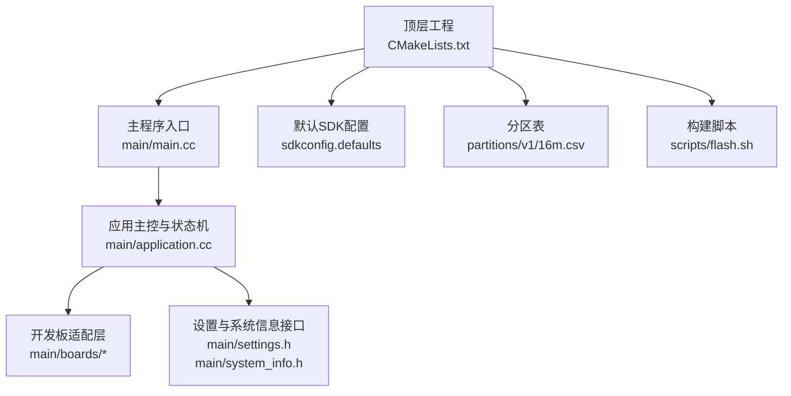
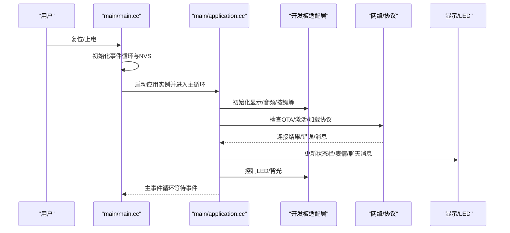
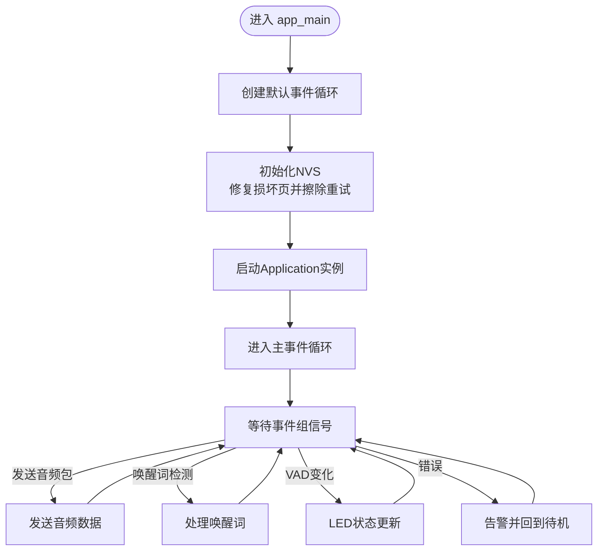
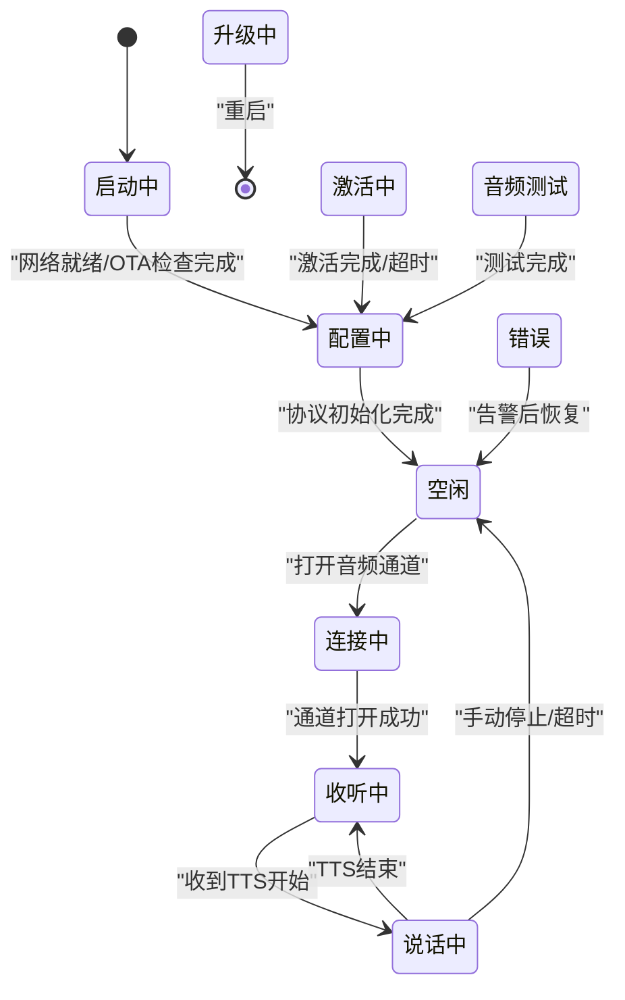
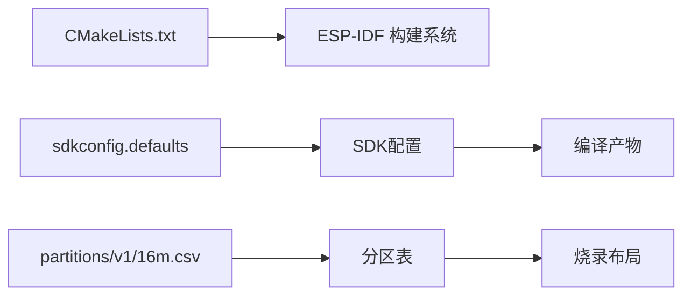

# 快速开始

<cite>
**本文引用的文件**
- [CMakeLists.txt](file://CMakeLists.txt)
- [sdkconfig.defaults](file://sdkconfig.defaults)
- [sdkconfig](file://sdkconfig)
- [main/main.cc](file://main/main.cc)
- [main/application.cc](file://main/application.cc)
- [main/boards/README.md](file://main/boards/README.md)
- [partitions/v1/16m.csv](file://partitions/v1/16m.csv)
- [scripts/flash.sh](file://scripts/flash.sh)
- [main/settings.h](file://main/settings.h)
- [main/system_info.h](file://main/system_info.h)
</cite>

## 目录
1. [简介](#简介)
2. [项目结构](#项目结构)
3. [核心组件](#核心组件)
4. [架构总览](#架构总览)
5. [详细组件分析](#详细组件分析)
6. [依赖分析](#依赖分析)
7. [性能考虑](#性能考虑)
8. [故障排除指南](#故障排除指南)
9. [结论](#结论)
10. [附录](#附录)

## 简介
本指南面向首次接触小智ESP32智能语音助手的新手开发者，帮助你在最短时间内完成开发环境搭建、项目克隆、SDK参数配置、编译与烧录，并顺利启动设备完成首次运行（含硬件连接、WiFi配置、设备激活）。文档基于仓库中的实际文件进行梳理，确保每一步都有明确的依据来源。

## 项目结构
该工程采用ESP-IDF标准工程组织方式，核心入口位于main目录，应用主循环与业务状态机在其中实现；构建系统由顶层CMakeLists.txt驱动；默认SDK配置位于sdkconfig.defaults；分区表位于partitions目录；开发板适配层位于main/boards；脚本位于scripts目录。

**图示来源**
- [CMakeLists.txt](file://CMakeLists.txt#L1-L15)
- [main/main.cc](file://main/main.cc#L1-L32)
- [main/application.cc](file://main/application.cc#L1-L776)
- [sdkconfig.defaults](file://sdkconfig.defaults#L1-L78)
- [partitions/v1/16m.csv](file://partitions/v1/16m.csv#L1-L9)
- [scripts/flash.sh](file://scripts/flash.sh#L1-L3)
- [main/boards/README.md](file://main/boards/README.md#L1-L335)
- [main/settings.h](file://main/settings.h#L1-L29)
- [main/system_info.h](file://main/system_info.h#L1-L22)

**章节来源**
- [CMakeLists.txt](file://CMakeLists.txt#L1-L15)
- [sdkconfig.defaults](file://sdkconfig.defaults#L1-L78)
- [partitions/v1/16m.csv](file://partitions/v1/16m.csv#L1-L9)
- [scripts/flash.sh](file://scripts/flash.sh#L1-L3)
- [main/boards/README.md](file://main/boards/README.md#L1-L335)

## 核心组件
- 应用主入口：负责事件循环初始化、NVS闪存初始化、应用实例启动与主事件循环。
- 应用主控与状态机：负责设备状态管理、协议初始化（MQTT/WebSocket）、OTA版本检查与激活、音视频处理调度、显示与LED联动。
- 开发板适配层：抽象不同硬件平台的初始化差异，统一对外接口。
- 设置与系统信息：提供NVS键值存储封装与系统资源统计打印能力。

**章节来源**
- [main/main.cc](file://main/main.cc#L1-L32)
- [main/application.cc](file://main/application.cc#L1-L776)
- [main/boards/README.md](file://main/boards/README.md#L1-L335)
- [main/settings.h](file://main/settings.h#L1-L29)
- [main/system_info.h](file://main/system_info.h#L1-L22)

## 架构总览
应用从app_main进入，初始化事件循环与NVS，随后启动Application单例并进入主事件循环。Application根据设备状态驱动协议连接、音视频编码/解码、OTA检查与激活、显示与LED反馈。

**图示来源**
- [main/main.cc](file://main/main.cc#L13-L31)
- [main/application.cc](file://main/application.cc#L328-L512)

## 详细组件分析

### 组件A：应用主入口与主事件循环
- 负责创建默认事件循环、初始化NVS（修复损坏页并擦除重试）、启动Application并进入主事件循环。
- 关键行为：事件组触发、任务调度、错误处理与告警展示。

**图示来源**
- [main/main.cc](file://main/main.cc#L13-L31)
- [main/application.cc](file://main/application.cc#L540-L583)

**章节来源**
- [main/main.cc](file://main/main.cc#L13-L31)
- [main/application.cc](file://main/application.cc#L540-L583)

### 组件B：应用主控与状态机
- 设备状态：未知/启动中/配置中/空闲/连接中/收听中/说话中/升级中/激活中/音频测试/致命错误/无效状态。
- 关键职责：OTA版本检查与激活、协议选择（MQTT/WebSocket）、音视频通道打开/关闭、消息解析与显示/LED联动、异常告警与恢复。
- 事件驱动：通过事件组触发发送音频、唤醒词检测、VAD变化、错误等。

**图示来源**
- [main/application.cc](file://main/application.cc#L21-L34)
- [main/application.cc](file://main/application.cc#L634-L694)

**章节来源**
- [main/application.cc](file://main/application.cc#L1-L776)

### 组件C：开发板适配层
- 提供统一的板级抽象，包括音频编解码器、显示、按键、背光等初始化与接口。
- 新增开发板需遵循“config.h + config.json + 板级实现 + 注册”四件套，避免OTA覆盖风险。

**章节来源**
- [main/boards/README.md](file://main/boards/README.md#L1-L335)

### 组件D：设置与系统信息
- Settings：基于NVS的键值存储封装，支持字符串/整型/布尔读写与擦除。
- SystemInfo：提供系统资源统计（堆内存、任务列表、CPU使用情况等）打印接口。

**章节来源**
- [main/settings.h](file://main/settings.h#L1-L29)
- [main/system_info.h](file://main/system_info.h#L1-L22)

## 依赖分析
- 构建系统：顶层CMakeLists.txt引入ESP-IDF构建系统，项目名为xiaozhi。
- 默认SDK配置：sdkconfig.defaults定义了分区表、HTTPD最大请求长度、LVGL配置、编译优化等。
- 分区表：v1/16m.csv定义了NVS、OTA数据、PHY初始化、SPIFFS模型分区与两个OTA槽位。
- 运行时配置：sdkconfig为ESP-IDF生成的最终配置快照，包含SoC能力、网络、I2S、LEDC等。

**图示来源**
- [CMakeLists.txt](file://CMakeLists.txt#L12-L13)
- [sdkconfig.defaults](file://sdkconfig.defaults#L13-L15)
- [partitions/v1/16m.csv](file://partitions/v1/16m.csv#L1-L9)
- [sdkconfig](file://sdkconfig#L1-L200)

**章节来源**
- [CMakeLists.txt](file://CMakeLists.txt#L1-L15)
- [sdkconfig.defaults](file://sdkconfig.defaults#L1-L78)
- [partitions/v1/16m.csv](file://partitions/v1/16m.csv#L1-L9)
- [sdkconfig](file://sdkconfig#L1-L200)

## 性能考虑
- 编译优化：默认启用按大小优化与C++异常池配置，有助于减小体积与提升稳定性。
- LVGL裁剪：禁用大量非必要控件与压缩字体，降低Flash占用。
- 任务优先级：主事件循环提升优先级，避免被后台任务抢占。
- 内存统计：定期打印堆栈与任务统计，便于定位内存压力。

**章节来源**
- [sdkconfig.defaults](file://sdkconfig.defaults#L1-L78)
- [main/application.cc](file://main/application.cc#L540-L583)
- [main/system_info.h](file://main/system_info.h#L16-L18)

## 故障排除指南
- NVS损坏/版本不匹配：应用入口会自动擦除并重新初始化NVS，若仍失败请检查串口日志与供电稳定性。
- OTA激活失败：应用内置指数回退重试机制，若多次失败可检查网络连通性与OTA服务端状态。
- 协议连接失败：查看协议回调中的错误事件，确认MQTT/WS配置是否下发，网络是否可达。
- 音频无输出/失真：检查采样率一致性与AEC模式配置，必要时关闭设备侧AEC以避免重采样。
- 显示异常：核对SPI/I2C引脚与面板驱动配置，确认颜色反转/镜像/旋转参数。
- 无法烧录：确认串口设备路径与波特率，参考脚本中的esptool命令参数。

**章节来源**
- [main/main.cc](file://main/main.cc#L18-L25)
- [main/application.cc](file://main/application.cc#L70-L176)
- [main/application.cc](file://main/application.cc#L380-L407)
- [scripts/flash.sh](file://scripts/flash.sh#L1-L3)

## 结论
通过本指南，你可以在本地完成ESP-IDF环境准备、工程克隆与配置、编译与烧录，并在设备上完成首次运行（WiFi配置、OTA激活、协议连接）。建议在首次运行前准备好对应开发板的config.h与config.json，并根据硬件手册核对引脚映射与供电设计。

## 附录

### A. 开发环境与工具链准备（概览）
- 安装ESP-IDF：参考官方文档安装最新版本（本工程基于ESP-IDF 6.x）。
- 工具链：确保Python、CMake、Ninja、esptool等工具可用。
- IDE：推荐VS Code + ESP-IDF扩展，或直接使用命令行。

[本节为通用指导，不直接分析具体文件，故无“章节来源”]

### B. 克隆项目与配置SDK参数
- 克隆仓库到本地后，确认顶层CMakeLists.txt与sdkconfig.defaults存在。
- 若需针对特定开发板，参考开发板适配指南创建config.h与config.json，并通过构建脚本或idf.py进行差异化编译。

**章节来源**
- [CMakeLists.txt](file://CMakeLists.txt#L1-L15)
- [sdkconfig.defaults](file://sdkconfig.defaults#L1-L78)
- [main/boards/README.md](file://main/boards/README.md#L1-L335)

### C. 编译与烧录
- 编译：使用idf.py或CMake/Ninja完成构建。
- 烧录：可使用脚本或idf.py flash；脚本示例中使用esptool.py写入合并后的二进制镜像。

**章节来源**
- [scripts/flash.sh](file://scripts/flash.sh#L1-L3)

### D. 第一次运行流程（硬件、WiFi、激活）
- 硬件连接：根据所选开发板的config.h核对I2C/SPI/按键/背光等引脚，确保供电与上拉电阻满足芯片要求。
- WiFi配置：若处于配置中状态，可通过按键触发音频测试/返回配置流程，直至显示网络已连接。
- 设备激活：若OTA下发了激活码/挑战，应用会提示并等待用户输入或自动激活，完成后进入空闲状态。

**章节来源**
- [main/application.cc](file://main/application.cc#L228-L240)
- [main/application.cc](file://main/application.cc#L153-L175)