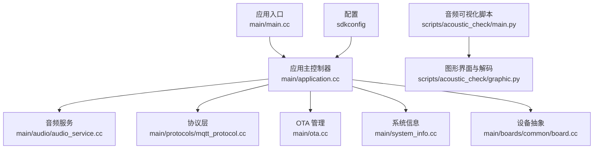
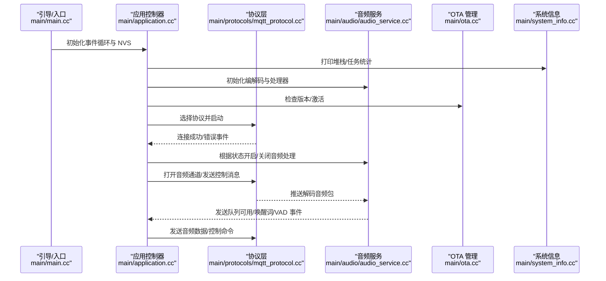
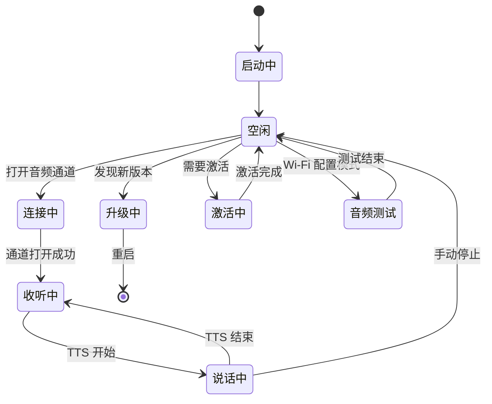
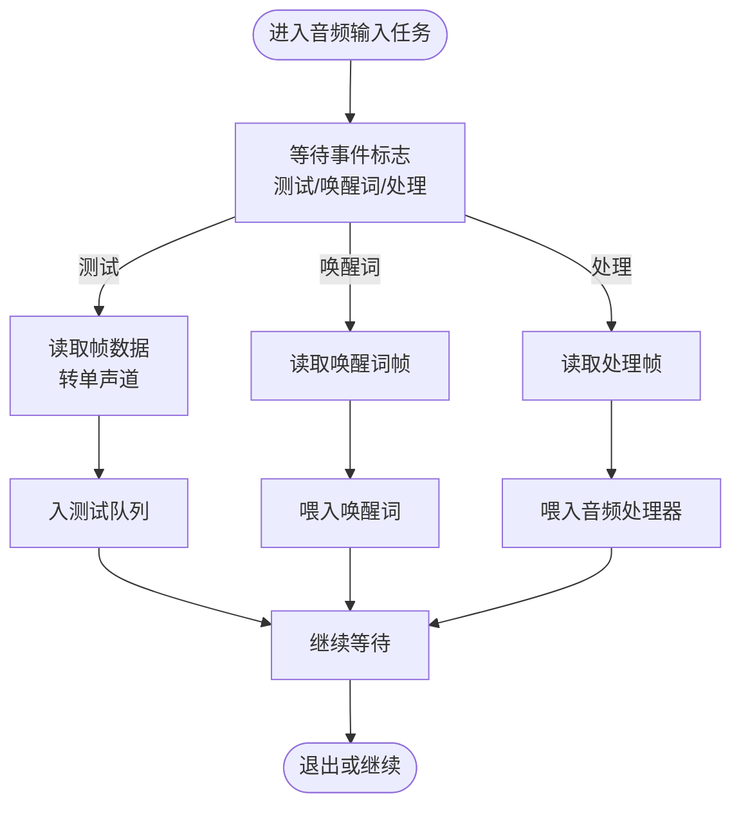
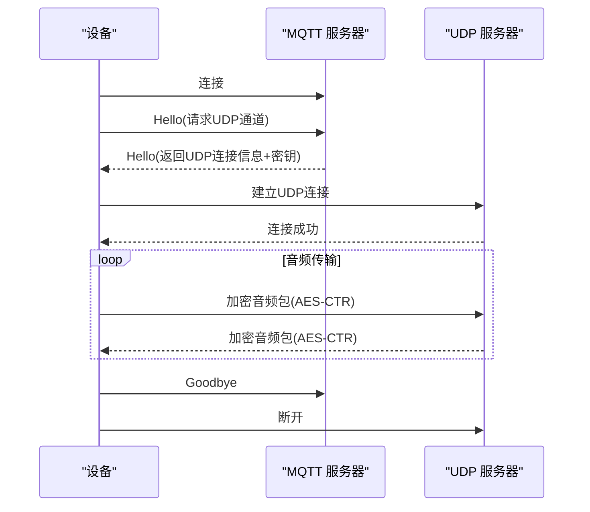
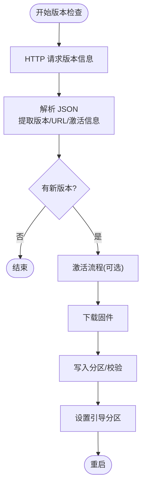
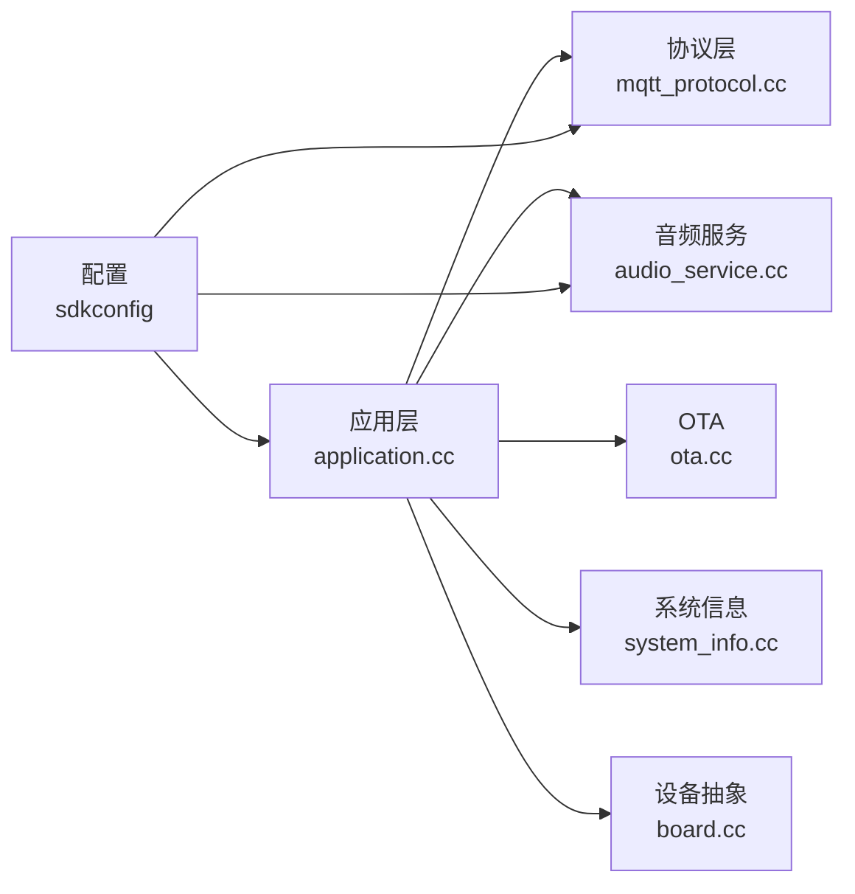

# 故障排除指南

<cite>
**本文引用的文件**
- [main/main.cc](file://main/main.cc)
- [main/application.cc](file://main/application.cc)
- [main/audio/audio_service.cc](file://main/audio/audio_service.cc)
- [main/ota.cc](file://main/ota.cc)
- [main/protocols/mqtt_protocol.cc](file://main/protocols/mqtt_protocol.cc)
- [main/boards/common/board.cc](file://main/boards/common/board.cc)
- [main/system_info.cc](file://main/system_info.cc)
- [scripts/acoustic_check/main.py](file://scripts/acoustic_check/main.py)
- [scripts/acoustic_check/graphic.py](file://scripts/acoustic_check/graphic.py)
- [docs/mqtt-udp.md](file://docs/mqtt-udp.md)
- [sdkconfig](file://sdkconfig)
- [main/device_state.h](file://main/device_state.h)
</cite>

## 目录
1. [简介](#简介)
2. [项目结构](#项目结构)
3. [核心组件](#核心组件)
4. [架构总览](#架构总览)
5. [详细组件分析](#详细组件分析)
6. [依赖关系分析](#依赖关系分析)
7. [性能考量](#性能考量)
8. [故障排除指南](#故障排除指南)
9. [结论](#结论)
10. [附录](#附录)

## 简介
本指南面向开发者与运维人员，聚焦于该 ESP32 语音交互设备在实际部署与运行中的常见问题与排障方法。内容覆盖编译错误、运行时崩溃、硬件连接问题、音频相关问题、网络连接问题（WiFi、MQTT、OTA）、系统性能优化与监控，以及社区支持与反馈渠道。文档结合代码实现与配置文件，提供可操作的诊断步骤与定位策略。

## 项目结构
该项目采用 ESP-IDF 工程组织方式，核心应用入口位于 main 目录，音频子系统、协议层、OTA、系统信息与设备抽象分别独立模块化，便于维护与扩展。构建产物位于 build 目录，脚本目录 scripts 提供辅助工具（如音频监听与可视化）。

**图表来源**
- [main/main.cc](file://main/main.cc#L13-L31)
- [main/application.cc](file://main/application.cc#L328-L512)
- [main/audio/audio_service.cc](file://main/audio/audio_service.cc#L33-L137)
- [main/ota.cc](file://main/ota.cc#L25-L71)
- [main/protocols/mqtt_protocol.cc](file://main/protocols/mqtt_protocol.cc#L44-L137)
- [main/system_info.cc](file://main/system_info.cc#L17-L48)
- [main/boards/common/board.cc](file://main/boards/common/board.cc#L69-L162)
- [sdkconfig](file://sdkconfig#L604-L605)
- [scripts/acoustic_check/main.py](file://scripts/acoustic_check/main.py#L11-L18)
- [scripts/acoustic_check/graphic.py](file://scripts/acoustic_check/graphic.py#L425-L444)

**章节来源**
- [main/main.cc](file://main/main.cc#L13-L31)
- [main/application.cc](file://main/application.cc#L328-L512)
- [sdkconfig](file://sdkconfig#L604-L605)

## 核心组件
- 应用主控制器：负责设备状态机、协议初始化、事件循环、OTA 检查与升级、音频通道控制。
- 音频服务：封装编解码、输入输出任务、唤醒词检测、音频测试、功耗管理。
- 协议层（MQTT + UDP）：通过 MQTT 建立控制通道，协商 UDP 音频通道，实现加密音频传输与会话管理。
- OTA 管理：版本检查、激活流程、固件下载与写入、引导分区切换与校验。
- 系统信息：获取芯片信息、内存与分区状态、打印任务与堆栈统计。
- 设备抽象：统一设备标识、JSON 上报、网络能力接口。
- 配置：通过 sdkconfig 控制功能开关（唤醒词、音频处理器、AEC、调试器等）。

**章节来源**
- [main/application.cc](file://main/application.cc#L36-L68)
- [main/audio/audio_service.cc](file://main/audio/audio_service.cc#L33-L93)
- [main/protocols/mqtt_protocol.cc](file://main/protocols/mqtt_protocol.cc#L13-L42)
- [main/ota.cc](file://main/ota.cc#L25-L41)
- [main/system_info.cc](file://main/system_info.cc#L17-L48)
- [main/boards/common/board.cc](file://main/boards/common/board.cc#L14-L22)
- [sdkconfig](file://sdkconfig#L702-L707)

## 架构总览
系统采用“事件驱动 + 分层协议”的架构：应用层调度事件，音频层负责实时编解码与播放，协议层负责与云端的控制与音频通道交互，OTA 层负责固件生命周期管理。

**图表来源**
- [main/main.cc](file://main/main.cc#L13-L31)
- [main/application.cc](file://main/application.cc#L328-L512)
- [main/protocols/mqtt_protocol.cc](file://main/protocols/mqtt_protocol.cc#L44-L137)
- [main/audio/audio_service.cc](file://main/audio/audio_service.cc#L95-L137)
- [main/ota.cc](file://main/ota.cc#L76-L243)
- [main/system_info.cc](file://main/system_info.cc#L141-L145)

## 详细组件分析

### 应用主控制器（Application）
- 负责设备状态机与事件循环，根据协议回调与用户交互切换状态（空闲、连接中、收听、说话、升级、激活、音频测试等）。
- 在启动阶段初始化显示、音频、网络、协议，并进行版本检查与协议选择。
- 提供调度器将后台任务安全注入主事件循环，避免并发竞争。

**图表来源**
- [main/application.cc](file://main/application.cc#L634-L694)
- [main/device_state.h](file://main/device_state.h#L4-L16)

**章节来源**
- [main/application.cc](file://main/application.cc#L328-L512)
- [main/device_state.h](file://main/device_state.h#L4-L16)

### 音频服务（AudioService）
- 负责编解码、音频输入/输出任务、唤醒词检测、音频测试、设备 AEC 开关、功耗管理（输入/输出超时自动关闭）。
- 采用多队列与多任务模型，编码与解码分离，避免阻塞；支持 Opus 编解码与重采样。
- 提供播放内嵌 OGG 的能力，解析 Ogg 页面并逐包推送解码队列。

**图表来源**
- [main/audio/audio_service.cc](file://main/audio/audio_service.cc#L209-L276)

**章节来源**
- [main/audio/audio_service.cc](file://main/audio/audio_service.cc#L33-L137)
- [main/audio/audio_service.cc](file://main/audio/audio_service.cc#L209-L391)

### 协议层（MQTT + UDP）
- 通过 MQTT 建立控制通道，发送 Hello 申请 UDP 音频通道，握手成功后建立 UDP 连接进行加密音频传输。
- 支持会话管理、序列号校验、超时检测与自动重连。

**图表来源**
- [docs/mqtt-udp.md](file://docs/mqtt-udp.md#L24-L57)
- [main/protocols/mqtt_protocol.cc](file://main/protocols/mqtt_protocol.cc#L194-L274)

**章节来源**
- [main/protocols/mqtt_protocol.cc](file://main/protocols/mqtt_protocol.cc#L44-L137)
- [docs/mqtt-udp.md](file://docs/mqtt-udp.md#L75-L112)

### OTA 管理
- 通过 HTTP 检查版本、下发激活挑战、下载固件、写入分区、设置引导分区并校验。
- 支持强制升级标记、版本比较、进度与速度上报。

**图表来源**
- [main/ota.cc](file://main/ota.cc#L76-L243)
- [main/ota.cc](file://main/ota.cc#L265-L373)

**章节来源**
- [main/ota.cc](file://main/ota.cc#L25-L71)
- [main/ota.cc](file://main/ota.cc#L76-L243)
- [main/ota.cc](file://main/ota.cc#L265-L373)

### 系统信息与设备抽象
- 提供芯片型号、MAC 地址、闪存容量、最小空闲堆、任务 CPU 使用率与列表打印、堆统计等能力。
- 设备抽象负责生成/持久化 UUID、拼装上报 JSON、导出板级信息。

**章节来源**
- [main/system_info.cc](file://main/system_info.cc#L17-L48)
- [main/system_info.cc](file://main/system_info.cc#L50-L145)
- [main/boards/common/board.cc](file://main/boards/common/board.cc#L14-L22)
- [main/boards/common/board.cc](file://main/boards/common/board.cc#L69-L162)

## 依赖关系分析
- 应用层依赖协议层与音频服务；协议层依赖网络抽象；OTA 依赖网络与分区；系统信息与设备抽象为上层提供只读能力。
- 配置文件 sdkconfig 控制功能开关，如唤醒词、音频处理器、AEC、调试器等。

**图表来源**
- [main/application.cc](file://main/application.cc#L328-L512)
- [main/protocols/mqtt_protocol.cc](file://main/protocols/mqtt_protocol.cc#L44-L137)
- [main/audio/audio_service.cc](file://main/audio/audio_service.cc#L33-L93)
- [main/ota.cc](file://main/ota.cc#L25-L41)
- [main/system_info.cc](file://main/system_info.cc#L17-L48)
- [main/boards/common/board.cc](file://main/boards/common/board.cc#L14-L22)
- [sdkconfig](file://sdkconfig#L702-L707)

**章节来源**
- [sdkconfig](file://sdkconfig#L702-L707)

## 性能考量
- 任务优先级与事件驱动：主事件循环提升优先级，避免被后台任务抢占；事件组触发批量处理，降低上下文切换。
- 音频路径：编码/解码与播放分离，队列长度限制与超时关闭输入输出，减少内存占用与功耗。
- 系统监控：周期性打印堆栈与最小空闲堆，定期打印任务 CPU 使用率，辅助定位热点任务。
- 配置优化：根据目标平台启用合适的音频模型与唤醒词，避免不必要的计算开销。

**章节来源**
- [main/application.cc](file://main/application.cc#L540-L583)
- [main/audio/audio_service.cc](file://main/audio/audio_service.cc#L314-L391)
- [main/system_info.cc](file://main/system_info.cc#L50-L145)
- [sdkconfig](file://sdkconfig#L702-L707)

## 故障排除指南

### 一、编译错误
- 症状：CMake/ESP-IDF 报错、找不到组件、SDK 配置不匹配。
- 诊断步骤：
  - 确认 ESP-IDF 版本与工程配置一致（工程声明为 6.0.0）。
  - 检查 sdkconfig 中的功能开关是否与可用组件匹配（如唤醒词、音频处理器、AEC）。
  - 清理构建缓存并重新生成：删除 build/.ninja_deps、build/build.ninja 并重新配置。
  - 检查分区表与引导器设置是否正确。
- 常见原因：
  - 组件版本不兼容或缺失。
  - 配置项冲突（如同时启用设备端与服务端 AEC）。
- 参考文件：
  - [sdkconfig](file://sdkconfig#L3-L5)
  - [sdkconfig](file://sdkconfig#L604-L605)
  - [sdkconfig](file://sdkconfig#L702-L707)

**章节来源**
- [sdkconfig](file://sdkconfig#L3-L5)
- [sdkconfig](file://sdkconfig#L604-L605)
- [sdkconfig](file://sdkconfig#L702-L707)

### 二、运行时崩溃/卡死
- 症状：启动后无响应、状态卡在“连接中”或“收听中”、重启循环。
- 诊断步骤：
  - 查看日志中是否有 NVS 初始化失败与擦除提示（入口会尝试擦除修复）。
  - 检查事件循环优先级与事件组触发是否正常，确认主事件循环未被阻塞。
  - 观察音频任务是否异常退出（输入/输出/编解码任务日志）。
  - 使用系统信息接口打印最小空闲堆与任务列表，定位内存压力。
- 常见原因：
  - NVS 分区损坏导致初始化失败。
  - 音频队列满导致阻塞，或解码失败引发异常。
  - 事件组未正确触发，导致状态机停滞。
- 参考文件：
  - [main/main.cc](file://main/main.cc#L19-L25)
  - [main/application.cc](file://main/application.cc#L540-L583)
  - [main/audio/audio_service.cc](file://main/audio/audio_service.cc#L209-L276)
  - [main/system_info.cc](file://main/system_info.cc#L141-L145)

**章节来源**
- [main/main.cc](file://main/main.cc#L19-L25)
- [main/application.cc](file://main/application.cc#L540-L583)
- [main/audio/audio_service.cc](file://main/audio/audio_service.cc#L209-L276)
- [main/system_info.cc](file://main/system_info.cc#L141-L145)

### 三、硬件连接问题
- 症状：无法联网、Wi-Fi 配置页面无法访问、设备无显示/指示灯异常。
- 诊断步骤：
  - 确认设备抽象是否正确生成 UUID 并持久化。
  - 检查网络接口初始化顺序与超时设置。
  - 若使用特定开发板，请确认对应 board 配置与引脚映射。
- 参考文件：
  - [main/boards/common/board.cc](file://main/boards/common/board.cc#L14-L22)
  - [main/boards/common/board.cc](file://main/boards/common/board.cc#L69-L162)

**章节来源**
- [main/boards/common/board.cc](file://main/boards/common/board.cc#L14-L22)
- [main/boards/common/board.cc](file://main/boards/common/board.cc#L69-L162)

### 四、音频相关问题
- 症状：无声、破音、延迟大、噪声干扰、唤醒词误检/漏检。
- 诊断步骤：
  - 使用音频可视化脚本监听 UDP 音频流，确认数据到达与解码结果。
  - 检查音频采样率与帧时长是否与协议一致，必要时进行重采样。
  - 确认音频处理器与唤醒词模块初始化成功，事件回调是否触发 VAD/唤醒词。
  - 检查 AES 解密与序列号校验，避免乱序或重复包导致异常。
  - 使用“音频测试”模式，通过按键触发测试通道，观察回放队列是否填充。
- 参考文件：
  - [scripts/acoustic_check/main.py](file://scripts/acoustic_check/main.py#L11-L18)
  - [scripts/acoustic_check/graphic.py](file://scripts/acoustic_check/graphic.py#L327-L374)
  - [main/audio/audio_service.cc](file://main/audio/audio_service.cc#L393-L406)
  - [main/audio/audio_service.cc](file://main/audio/audio_service.cc#L515-L526)
  - [main/protocols/mqtt_protocol.cc](file://main/protocols/mqtt_protocol.cc#L222-L266)

**章节来源**
- [scripts/acoustic_check/main.py](file://scripts/acoustic_check/main.py#L11-L18)
- [scripts/acoustic_check/graphic.py](file://scripts/acoustic_check/graphic.py#L327-L374)
- [main/audio/audio_service.cc](file://main/audio/audio_service.cc#L393-L406)
- [main/audio/audio_service.cc](file://main/audio/audio_service.cc#L515-L526)
- [main/protocols/mqtt_protocol.cc](file://main/protocols/mqtt_protocol.cc#L222-L266)

### 五、网络连接问题
- WiFi 连接失败
  - 检查 Wi-Fi 配置页面是否可达，确认设备处于“Wi-Fi 配置”状态。
  - 查看网络接口初始化与超时设置，确认 DNS 与路由可达。
- MQTT 连接异常
  - 检查 MQTT 端点、用户名/密码、KeepAlive 设置。
  - 观察自动重连逻辑与错误上报，确认 Hello 握手是否成功。
  - 核对 UDP 服务器地址与端口、密钥与随机数是否正确。
- OTA 更新失败
  - 检查版本检查 URL 与 HTTP 状态码，确认 JSON 格式正确。
  - 下载过程中关注进度与速度，留意校验失败与引导分区设置。
  - 若为激活流程，确认激活挑战与 HMAC 计算是否成功。
- 参考文件：
  - [main/ota.cc](file://main/ota.cc#L43-L71)
  - [main/ota.cc](file://main/ota.cc#L76-L243)
  - [main/ota.cc](file://main/ota.cc#L265-L373)
  - [main/protocols/mqtt_protocol.cc](file://main/protocols/mqtt_protocol.cc#L44-L137)
  - [docs/mqtt-udp.md](file://docs/mqtt-udp.md#L280-L300)

**章节来源**
- [main/ota.cc](file://main/ota.cc#L43-L71)
- [main/ota.cc](file://main/ota.cc#L76-L243)
- [main/ota.cc](file://main/ota.cc#L265-L373)
- [main/protocols/mqtt_protocol.cc](file://main/protocols/mqtt_protocol.cc#L44-L137)
- [docs/mqtt-udp.md](file://docs/mqtt-udp.md#L280-L300)

### 六、系统性能优化与监控
- 优化建议：
  - 合理设置音频帧时长与采样率，平衡延迟与质量。
  - 限制音频队列长度，避免内存峰值过高。
  - 启用功耗管理，空闲时自动关闭音频输入/输出。
  - 使用系统信息接口定期打印堆栈与任务 CPU 使用率，定位热点。
- 监控方法：
  - 定时打印最小空闲堆与堆统计，关注趋势变化。
  - 使用任务列表与 CPU 使用率接口，识别高占用任务。
- 参考文件：
  - [main/system_info.cc](file://main/system_info.cc#L50-L145)
  - [main/audio/audio_service.cc](file://main/audio/audio_service.cc#L656-L669)

**章节来源**
- [main/system_info.cc](file://main/system_info.cc#L50-L145)
- [main/audio/audio_service.cc](file://main/audio/audio_service.cc#L656-L669)

### 七、社区支持与问题反馈
- 仓库提供 GitHub Issues 模板与工作流，建议按模板提交问题，附带：
  - 设备型号与板卡配置
  - 日志片段（含错误码与状态机）
  - 复现步骤与预期/实际行为
  - 系统信息（MAC、芯片型号、分区表摘要）

[本节为通用指导，不直接分析具体文件]

## 结论
本指南基于代码实现与配置文件，提供了从编译、运行、网络到音频与性能的全链路排障方法。建议在问题定位时遵循“日志优先、状态机核对、协议握手验证、音频链路检查、系统资源监控”的流程，结合脚本工具与系统信息接口快速收敛问题根因。

## 附录
- 快速参考清单
  - 编译：ESP-IDF 6.0.0、组件版本匹配、清理构建缓存
  - 运行：NVS 擦除修复、事件循环优先级、音频任务健康
  - 网络：Wi-Fi 配置页面、MQTT 端点与认证、OTA URL 与激活
  - 音频：采样率/帧时长一致性、AES 解密与序列号、音频测试模式
  - 性能：最小空闲堆、任务 CPU 使用率、队列长度与功耗管理

[本节为通用指导，不直接分析具体文件]