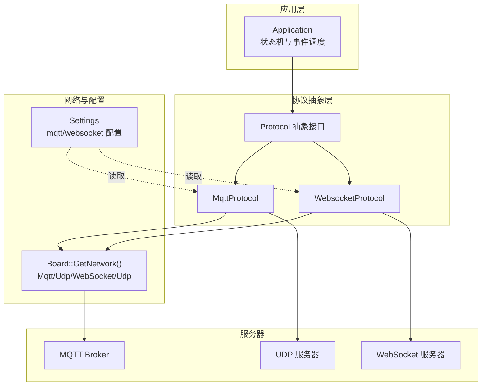
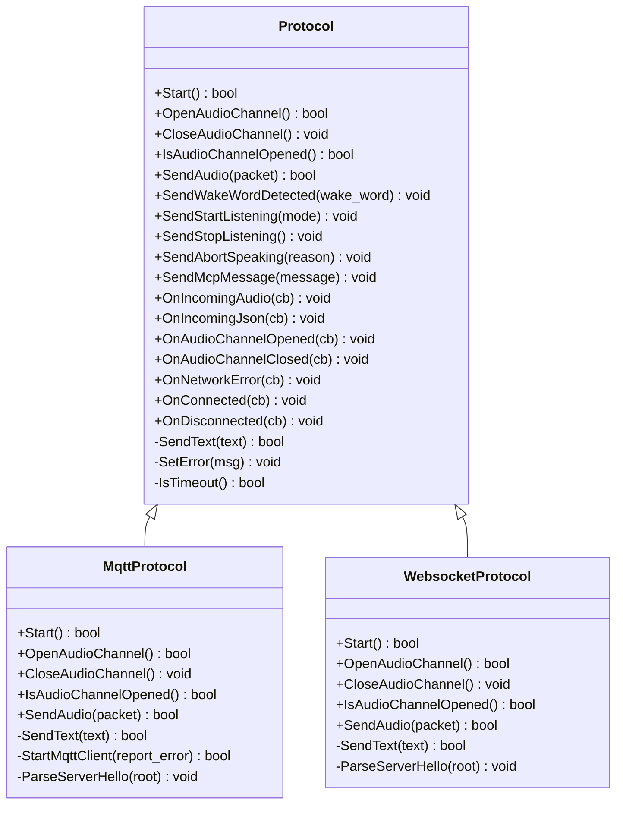
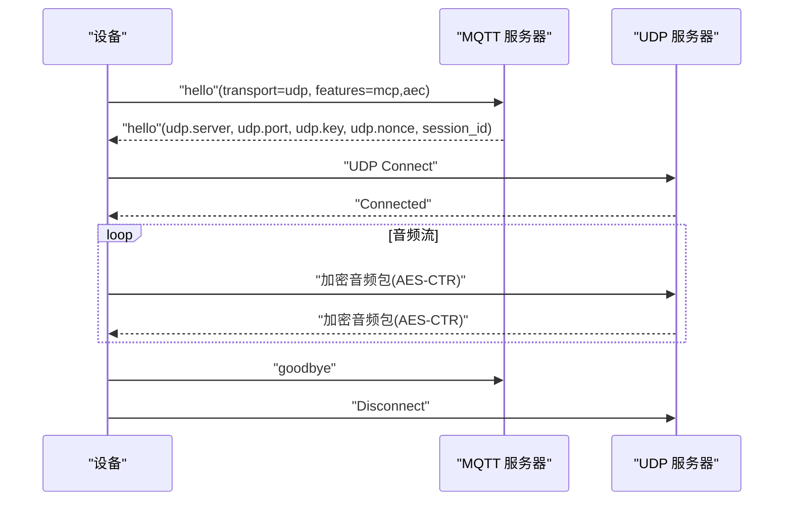
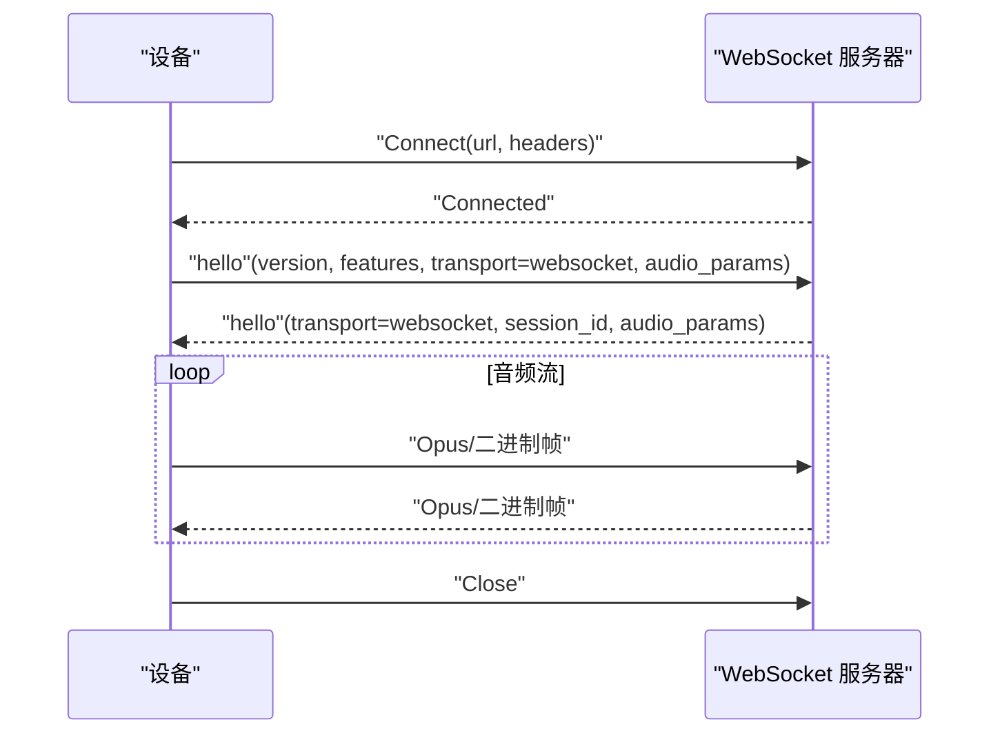
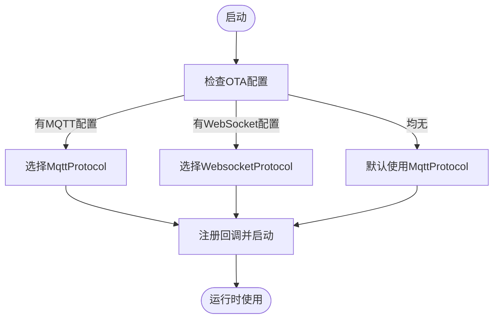
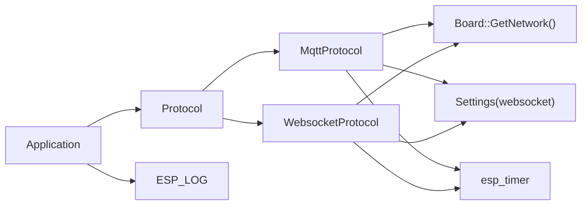

# 协议抽象层设计

<cite>
**本文引用的文件**
- [main/protocols/protocol.h](file://main/protocols/protocol.h)
- [main/protocols/protocol.cc](file://main/protocols/protocol.cc)
- [main/protocols/mqtt_protocol.h](file://main/protocols/mqtt_protocol.h)
- [main/protocols/mqtt_protocol.cc](file://main/protocols/mqtt_protocol.cc)
- [main/protocols/websocket_protocol.h](file://main/protocols/websocket_protocol.h)
- [main/protocols/websocket_protocol.cc](file://main/protocols/websocket_protocol.cc)
- [docs/mqtt-udp.md](file://docs/mqtt-udp.md)
- [docs/websocket.md](file://docs/websocket.md)
- [main/application.h](file://main/application.h)
- [main/application.cc](file://main/application.cc)
- [main/settings.h](file://main/settings.h)
</cite>

## 目录
1. [引言](#引言)
2. [项目结构](#项目结构)
3. [核心组件](#核心组件)
4. [架构总览](#架构总览)
5. [详细组件分析](#详细组件分析)
6. [依赖关系分析](#依赖关系分析)
7. [性能考量](#性能考量)
8. [故障排查指南](#故障排查指南)
9. [结论](#结论)
10. [附录](#附录)

## 引言
本文件面向小智ESP32智能语音助手项目的“协议抽象层”，系统阐述如何通过统一的Protocol接口屏蔽MQTT+UDP与WebSocket两类通信协议的差异，实现上层应用与底层传输的解耦。文档重点覆盖：
- 抽象接口设计思想与职责边界
- 协议选择机制（运行时选择、优先级策略）
- 与上层应用的交互模式（消息封装、事件传递、错误处理）
- MQTT与WebSocket实现差异及适用场景
- 协议扩展指南与最佳实践（性能优化、安全加固）

## 项目结构
协议抽象层位于main/protocols目录，包含抽象接口与两个具体实现：
- 抽象层：protocol.h/.cc
- MQTT实现：mqtt_protocol.h/.cc
- WebSocket实现：websocket_protocol.h/.cc

上层应用通过application.cc在启动阶段按OTA配置动态选择协议实例，并通过统一接口与协议层交互。

图表来源
- [main/application.cc](file://main/application.cc#L368-L378)
- [main/protocols/protocol.h](file://main/protocols/protocol.h#L44-L95)
- [main/protocols/mqtt_protocol.h](file://main/protocols/mqtt_protocol.h#L24-L57)
- [main/protocols/websocket_protocol.h](file://main/protocols/websocket_protocol.h#L13-L32)

章节来源
- [main/protocols/protocol.h](file://main/protocols/protocol.h#L1-L99)
- [main/protocols/mqtt_protocol.h](file://main/protocols/mqtt_protocol.h#L1-L61)
- [main/protocols/websocket_protocol.h](file://main/protocols/websocket_protocol.h#L1-L35)
- [main/application.cc](file://main/application.cc#L368-L378)

## 核心组件
- Protocol抽象接口：定义统一的生命周期、音频通道、消息发送与事件回调，屏蔽具体传输细节。
- MqttProtocol：基于MQTT控制通道与UDP音频通道的混合方案，支持AES-CTR加密与序列号防护。
- WebsocketProtocol：基于WebSocket的单一通道方案，支持多版本二进制协议封装。
- Application：在启动阶段依据OTA配置选择具体协议实例，并将协议事件映射到设备状态机。

章节来源
- [main/protocols/protocol.h](file://main/protocols/protocol.h#L44-L95)
- [main/protocols/protocol.cc](file://main/protocols/protocol.cc#L7-L90)
- [main/protocols/mqtt_protocol.h](file://main/protocols/mqtt_protocol.h#L24-L57)
- [main/protocols/websocket_protocol.h](file://main/protocols/websocket_protocol.h#L13-L32)
- [main/application.cc](file://main/application.cc#L368-L378)

## 架构总览
协议抽象层采用“接口+多实现”的模式，上层仅依赖Protocol接口，运行时通过Application注入具体协议实例。MQTT+UDP方案适合对实时性要求高且网络环境允许UDP直连的场景；WebSocket方案更易穿透防火墙，适合广泛部署。

图表来源
- [main/protocols/protocol.h](file://main/protocols/protocol.h#L44-L95)
- [main/protocols/mqtt_protocol.h](file://main/protocols/mqtt_protocol.h#L24-L57)
- [main/protocols/websocket_protocol.h](file://main/protocols/websocket_protocol.h#L13-L32)

## 详细组件分析

### 抽象接口Protocol
- 职责边界
  - 生命周期：Start、OpenAudioChannel、CloseAudioChannel、IsAudioChannelOpened
  - 音频通道：SendAudio、OnIncomingAudio回调
  - 控制消息：SendWakeWordDetected、SendStartListening、SendStopListening、SendAbortSpeaking、SendMcpMessage、OnIncomingJson回调
  - 连接事件：OnConnected、OnDisconnected、OnAudioChannelOpened、OnAudioChannelClosed、OnNetworkError
  - 辅助：server_sample_rate、server_frame_duration、session_id、超时检测IsTimeout
- 设计要点
  - 将“控制消息”与“音频数据”分离，统一通过SendText与二进制帧发送
  - 通过回调将底层事件上抛至上层应用，避免协议细节泄露

章节来源
- [main/protocols/protocol.h](file://main/protocols/protocol.h#L44-L95)
- [main/protocols/protocol.cc](file://main/protocols/protocol.cc#L7-L90)

### MQTT+UDP实现（MqttProtocol）
- 运行机制
  - 控制通道：MQTT（TLS端口8883），用于握手、控制消息与会话管理
  - 音频通道：UDP（由服务器分配IP/端口），使用AES-CTR加密，带序列号与时间戳
  - 通道建立：设备先通过MQTT发送hello，服务器返回udp配置与密钥，随后建立UDP连接
- 关键特性
  - 事件驱动：使用FreeRTOS事件组等待服务器hello，超时即报错
  - 并发安全：音频发送使用互斥锁保护UDP连接
  - 自动重连：MQTT断开后定时器触发重连
  - 超时检测：基于last_incoming_time_判断通道活性
- 二进制封装
  - 使用BinaryProtocol2/3结构承载音频数据，含版本、类型、payload_size、payload等字段

图表来源
- [docs/mqtt-udp.md](file://docs/mqtt-udp.md#L24-L57)
- [main/protocols/mqtt_protocol.cc](file://main/protocols/mqtt_protocol.cc#L44-L137)
- [main/protocols/mqtt_protocol.cc](file://main/protocols/mqtt_protocol.cc#L194-L274)

章节来源
- [main/protocols/mqtt_protocol.h](file://main/protocols/mqtt_protocol.h#L24-L57)
- [main/protocols/mqtt_protocol.cc](file://main/protocols/mqtt_protocol.cc#L44-L137)
- [main/protocols/mqtt_protocol.cc](file://main/protocols/mqtt_protocol.cc#L194-L274)
- [docs/mqtt-udp.md](file://docs/mqtt-udp.md#L1-L393)

### WebSocket实现（WebsocketProtocol）
- 运行机制
  - 连接时机：仅在需要音频通道时才建立WebSocket连接
  - 握手：连接后发送hello，等待服务器hello确认
  - 二进制协议：支持版本1（直接Opus）、版本2（含时间戳）与版本3（简化）
  - 认证：Authorization、Protocol-Version、Device-Id、Client-Id头部
- 关键特性
  - 事件驱动：等待服务器hello，超时触发错误
  - 通道状态：IsAudioChannelOpened基于连接状态与超时检测
  - 回调处理：OnData中区分binary与text，分别处理音频与JSON

图表来源
- [docs/websocket.md](file://docs/websocket.md#L7-L80)
- [main/protocols/websocket_protocol.cc](file://main/protocols/websocket_protocol.cc#L23-L200)

章节来源
- [main/protocols/websocket_protocol.h](file://main/protocols/websocket_protocol.h#L13-L32)
- [main/protocols/websocket_protocol.cc](file://main/protocols/websocket_protocol.cc#L23-L200)
- [docs/websocket.md](file://docs/websocket.md#L1-L496)

### 协议选择机制与运行时切换
- 选择策略
  - 启动阶段：Application依据OTA配置决定使用MQTT还是WebSocket
  - 优先级：若OTA同时存在两者配置，按MQTT优先；否则回退到MQTT
- 运行时切换
  - 当前实现为一次性选择；若需运行时切换，可在Application中增加协议工厂与动态替换逻辑
- 配置来源
  - Settings读取“mqtt”或“websocket”命名空间下的配置项，如endpoint、url、token、version等

图表来源
- [main/application.cc](file://main/application.cc#L368-L378)
- [main/settings.h](file://main/settings.h#L7-L26)

章节来源
- [main/application.cc](file://main/application.cc#L368-L378)
- [main/settings.h](file://main/settings.h#L7-L26)

### 与上层应用的交互模式
- 事件传递
  - 协议层通过回调将“音频到达”、“JSON消息”、“通道开启/关闭”、“网络错误”等事件上抛
  - Application将这些事件映射到设备状态机（如从Idle到Listening/Speaking）
- 消息封装
  - 控制消息统一为JSON，包含type、session_id、features等字段
  - 音频数据通过SendAudio传入，由具体协议封装为二进制帧或直接发送
- 错误处理
  - 协议层通过SetError上报错误，Application捕获后触发错误事件并显示提示

章节来源
- [main/protocols/protocol.cc](file://main/protocols/protocol.cc#L35-L49)
- [main/protocols/protocol.cc](file://main/protocols/protocol.cc#L81-L90)
- [main/application.cc](file://main/application.cc#L380-L407)

### MQTT与WebSocket的实现差异与适用场景
- 传输通道
  - MQTT+UDP：控制与音频分离，音频通道采用UDP+加密，实时性更好
  - WebSocket：单一通道，易于穿越防火墙，部署更简单
- 加密与可靠性
  - MQTT+UDP：UDP侧AES-CTR加密，序列号与时间戳防重放
  - WebSocket：TLS加密，可靠性更高
- 适用场景
  - MQTT+UDP：对实时性敏感、网络可控的场景
  - WebSocket：广泛部署、NAT/防火墙受限的场景

章节来源
- [docs/mqtt-udp.md](file://docs/mqtt-udp.md#L346-L358)
- [docs/websocket.md](file://docs/websocket.md#L381-L402)

## 依赖关系分析
- 组件耦合
  - Application依赖Protocol接口，不直接依赖具体实现，耦合度低
  - MqttProtocol与WebsocketProtocol共享Protocol接口，彼此独立
- 外部依赖
  - 网络层：Board::GetNetwork()提供Mqtt/Udp/WebSocket工厂
  - 配置层：Settings提供命名空间配置读写
  - 日志与定时器：ESP_LOG、FreeRTOS事件组、esp_timer
- 潜在风险
  - MQTT+UDP方案对网络复杂度更高，需关注防火墙与NAT
  - WebSocket方案在高并发下需注意连接数与资源占用

图表来源
- [main/application.cc](file://main/application.cc#L368-L378)
- [main/protocols/mqtt_protocol.cc](file://main/protocols/mqtt_protocol.cc#L54-L61)
- [main/protocols/websocket_protocol.cc](file://main/protocols/websocket_protocol.cc#L83-L94)

章节来源
- [main/application.cc](file://main/application.cc#L368-L378)
- [main/protocols/mqtt_protocol.cc](file://main/protocols/mqtt_protocol.cc#L54-L61)
- [main/protocols/websocket_protocol.cc](file://main/protocols/websocket_protocol.cc#L83-L94)

## 性能考量
- 并发与锁
  - MQTT+UDP：音频发送加互斥锁，避免UDP对象并发访问
- 内存管理
  - 使用智能指针管理网络对象与音频包，及时释放资源
- 网络优化
  - UDP复用连接，减少握手开销；序列号连续性检查降低重传
- 实时性
  - WebSocket二进制协议版本2携带时间戳，有利于服务端AEC处理
- 超时与健康检查
  - 基类提供超时检测，避免僵尸通道占用资源

章节来源
- [docs/mqtt-udp.md](file://docs/mqtt-udp.md#L323-L343)
- [main/protocols/protocol.cc](file://main/protocols/protocol.cc#L81-L90)
- [main/protocols/mqtt_protocol.cc](file://main/protocols/mqtt_protocol.cc#L151-L175)

## 故障排查指南
- 常见问题
  - MQTT连接失败：检查endpoint、用户名密码、keepalive；观察自动重连日志
  - WebSocket连接失败：检查url、token、headers；确认服务器握手逻辑
  - 音频通道无法打开：确认hello交换成功、服务器返回udp配置与密钥
  - 超时：检查last_incoming_time_与IsTimeout判定
- 定位方法
  - 查看协议层日志标签（MQTT/WS）与错误回调
  - 使用事件组状态与定时器触发点定位问题环节
- 处理建议
  - MQTT+UDP：优先检查UDP可达性与密钥/随机数一致性
  - WebSocket：优先检查握手headers与服务器返回的transport字段

章节来源
- [main/protocols/mqtt_protocol.cc](file://main/protocols/mqtt_protocol.cc#L74-L87)
- [main/protocols/websocket_protocol.cc](file://main/protocols/websocket_protocol.cc#L167-L172)
- [main/protocols/protocol.cc](file://main/protocols/protocol.cc#L81-L90)

## 结论
协议抽象层通过统一接口屏蔽了MQTT+UDP与WebSocket的差异，使上层应用无需关心底层传输细节。运行时选择机制与清晰的事件回调模型，使得系统具备良好的可维护性与可扩展性。针对不同网络环境与实时性需求，可灵活选择协议方案，并通过统一接口平滑演进。

## 附录

### 协议扩展指南（新增协议支持）
- 步骤
  - 新建类继承Protocol，实现Start、OpenAudioChannel、CloseAudioChannel、IsAudioChannelOpened、SendAudio、SendText等方法
  - 在Application启动阶段增加配置读取与实例化逻辑，按优先级选择新协议
  - 注册回调：OnConnected、OnDisconnected、OnIncomingJson、OnIncomingAudio、OnAudioChannelOpened/Closed、OnNetworkError
  - 在docs中补充协议流程、消息格式与部署建议
- 注意事项
  - 保持与现有控制消息格式兼容（type、session_id、features等）
  - 明确音频封装格式与采样率/帧时长参数
  - 考虑超时与错误处理的一致性

章节来源
- [main/protocols/protocol.h](file://main/protocols/protocol.h#L44-L95)
- [main/application.cc](file://main/application.cc#L368-L378)
- [docs/websocket.md](file://docs/websocket.md#L381-L402)