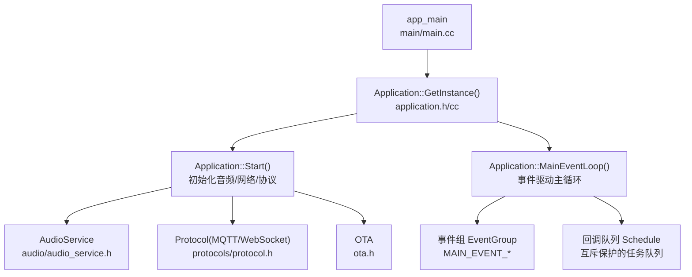
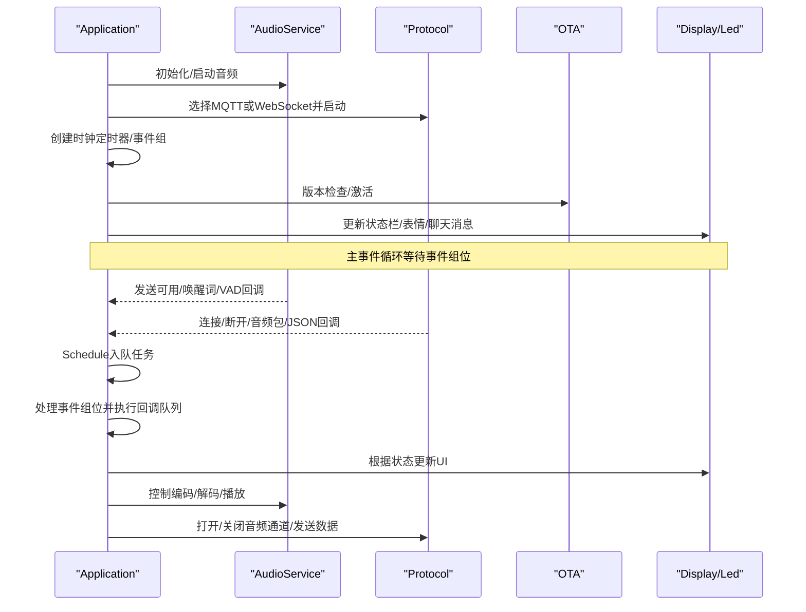
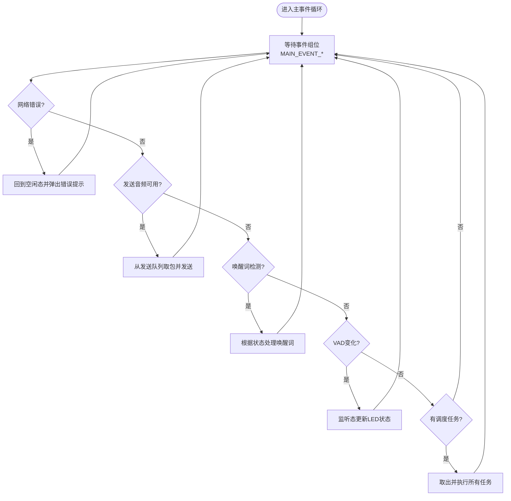
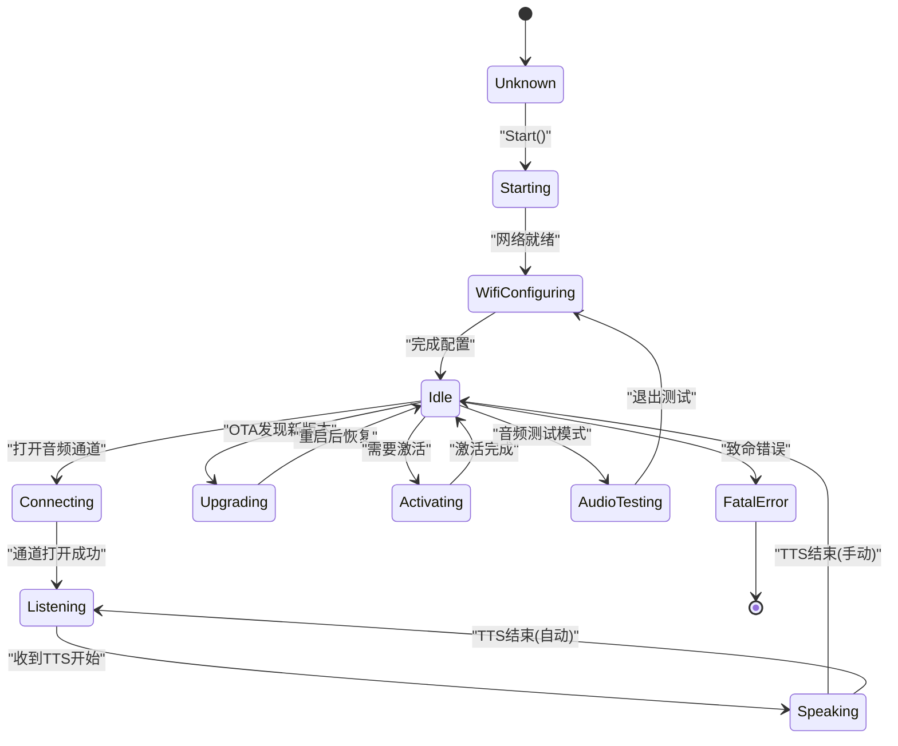
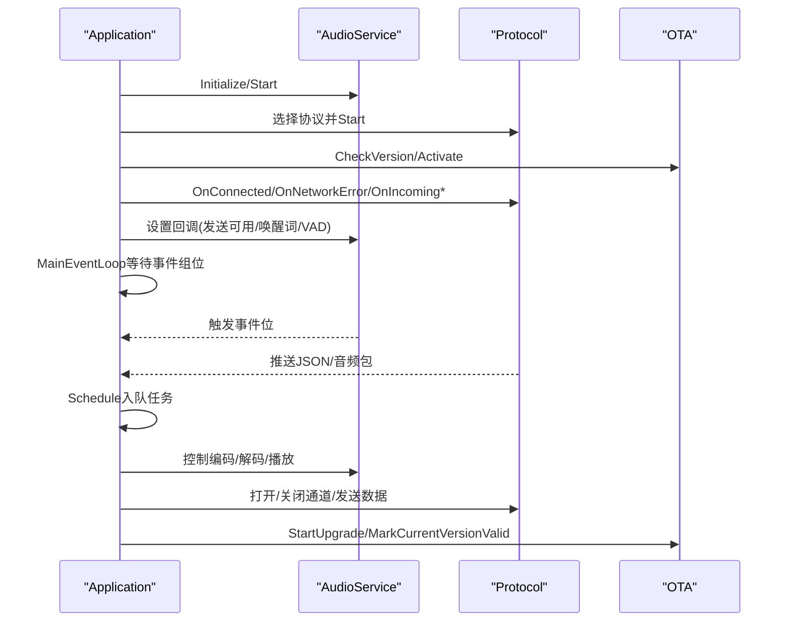
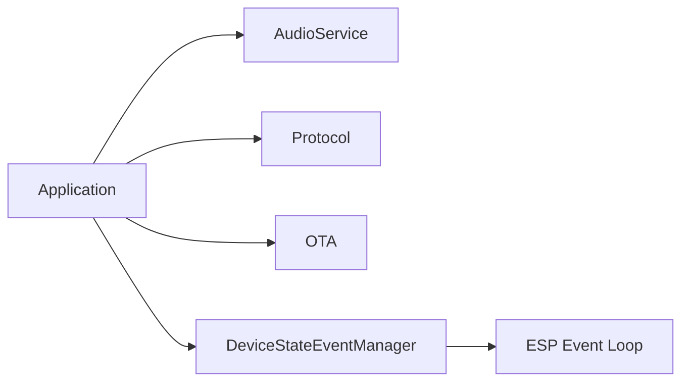

# 应用程序核心

<cite>
**本文引用的文件列表**
- [main/application.h](file://main/application.h)
- [main/application.cc](file://main/application.cc)
- [main/main.cc](file://main/main.cc)
- [main/device_state.h](file://main/device_state.h)
- [main/device_state_event.h](file://main/device_state_event.h)
- [main/device_state_event.cc](file://main/device_state_event.cc)
- [main/audio/audio_service.h](file://main/audio/audio_service.h)
- [main/protocols/protocol.h](file://main/protocols/protocol.h)
- [main/ota.h](file://main/ota.h)
- [main/settings.h](file://main/settings.h)
</cite>

## 目录
1. [简介](#简介)
2. [项目结构](#项目结构)
3. [核心组件](#核心组件)
4. [架构总览](#架构总览)
5. [详细组件分析](#详细组件分析)
6. [依赖关系分析](#依赖关系分析)
7. [性能考量](#性能考量)
8. [故障排查指南](#故障排查指南)
9. [结论](#结论)
10. [附录：使用示例路径](#附录使用示例路径)

## 简介
本文件面向“小智ESP32智能语音助手”项目的应用程序核心模块，聚焦于Application类作为单例模式的主控制器设计，系统性阐述其生命周期管理、事件驱动机制、状态管理模式，并深入解析主事件循环（基于FreeRTOS事件组）的工作原理、任务调度与音频处理调度。同时，文档说明设备状态管理（DeviceState及其转换逻辑）、监听模式管理、以及Application与AudioService、Protocol、OTA等子系统的集成方式，并提供可直接定位到源码的示例路径，帮助开发者快速上手与扩展。

## 项目结构
Application位于main目录下，是系统启动入口与主控制中枢，负责：
- 初始化硬件与外设（显示、音频编解码器、网络）
- 启动协议栈（MQTT/WebSocket）
- 管理设备状态机与事件分发
- 协调音频服务与OTA升级流程
- 提供统一的API用于外部模块触发状态切换与事件处理



图表来源
- [main/main.cc](file://main/main.cc#L13-L31)
- [main/application.h](file://main/application.h#L32-L88)
- [main/application.cc](file://main/application.cc#L328-L512)
- [main/audio/audio_service.h](file://main/audio/audio_service.h#L81-L157)
- [main/protocols/protocol.h](file://main/protocols/protocol.h#L44-L95)
- [main/ota.h](file://main/ota.h#L10-L55)

章节来源
- [main/main.cc](file://main/main.cc#L13-L31)
- [main/application.h](file://main/application.h#L32-L88)
- [main/application.cc](file://main/application.cc#L328-L512)

## 核心组件
- Application（单例）：系统主控制器，封装设备状态、事件循环、任务调度、与子系统集成。
- AudioService：音频采集、编码、解码、播放与队列管理，支持唤醒词检测、VAD、AEC等。
- Protocol：抽象协议接口（MQTT/WebSocket），定义音频通道、消息回调与控制命令。
- OTA：固件版本检查、激活流程、升级执行。
- 设备状态机：DeviceState枚举与状态变更事件管理。
- 事件系统：基于FreeRTOS事件组与ESP Event Loop的状态事件分发。

章节来源
- [main/application.h](file://main/application.h#L32-L88)
- [main/audio/audio_service.h](file://main/audio/audio_service.h#L81-L157)
- [main/protocols/protocol.h](file://main/protocols/protocol.h#L44-L95)
- [main/ota.h](file://main/ota.h#L10-L55)
- [main/device_state.h](file://main/device_state.h#L4-L16)
- [main/device_state_event.h](file://main/device_state_event.h#L21-L37)

## 架构总览
Application采用“单例+事件驱动”的架构：
- 单例确保全局唯一控制中心，避免多实例竞争资源。
- 主事件循环通过事件组等待多种事件（定时器、音频发送可用、唤醒词检测、VAD变化、网络错误），在统一优先级下串行处理回调队列中的任务，保证状态一致性与线程安全。
- 与AudioService、Protocol、OTA的交互以回调与队列形式解耦，遵循“只在主循环中修改状态”的原则。



图表来源
- [main/application.cc](file://main/application.cc#L328-L512)
- [main/application.cc](file://main/application.cc#L540-L583)
- [main/audio/audio_service.h](file://main/audio/audio_service.h#L81-L157)
- [main/protocols/protocol.h](file://main/protocols/protocol.h#L44-L95)
- [main/ota.h](file://main/ota.h#L10-L55)

## 详细组件分析

### Application类（单例主控制器）
- 单例与线程安全：提供静态GetInstance，删除拷贝构造与赋值，内部使用互斥锁保护任务队列。
- 生命周期管理：Start完成硬件初始化、网络启动、协议选择与启动；MainEventLoop作为事件驱动主循环。
- 事件驱动：使用FreeRTOS事件组聚合多个事件源（音频发送可用、唤醒词检测、VAD变化、网络错误、任务调度），在主循环中统一处理。
- 状态管理：维护DeviceState，通过SetDeviceState触发状态变更事件，联动显示与LED。
- 音频处理调度：通过AudioService回调将音频事件转化为事件组位，主循环批量发送音频包。
- 子系统集成：与AudioService、Protocol、OTA协作，处理升级、激活、连接、TTS/STT/LLM/MCP等消息。

```mermaid
classDiagram
class Application {
+GetInstance() Application&
+Start() void
+MainEventLoop() void
+GetDeviceState() DeviceState
+IsVoiceDetected() bool
+Schedule(callback) void
+SetDeviceState(state) void
+Alert(status,message,emotion,sound) void
+DismissAlert() void
+AbortSpeaking(reason) void
+ToggleChatState() void
+StartListening() void
+StopListening() void
+Reboot() void
+WakeWordInvoke(wake_word) void
+CanEnterSleepMode() bool
+SendMcpMessage(payload) void
+SetAecMode(mode) void
+GetAecMode() AecMode
+PlaySound(sound) void
+GetAudioService() AudioService&
-OnWakeWordDetected() void
-CheckNewVersion(ota) void
-ShowActivationCode(code,msg) void
-OnClockTimer() void
-SetListeningMode(mode) void
-event_group_ : EventGroupHandle_t
-audio_service_ : AudioService
-protocol_ : unique_ptr~Protocol~
-device_state_ : DeviceState
-aec_mode_ : AecMode
-listening_mode_ : ListeningMode
-clock_timer_handle_ : esp_timer_handle_t
-main_tasks_ : deque<function<void()>>
-mutex_ : mutex
}
class AudioService {
+Initialize(codec) void
+Start() void
+Stop() void
+EnableWakeWordDetection(enable) void
+EnableVoiceProcessing(enable) void
+EnableAudioTesting(enable) void
+EnableDeviceAec(enable) void
+SetCallbacks(callbacks) void
+PushPacketToDecodeQueue(packet) bool
+PopPacketFromSendQueue() unique_ptr~AudioStreamPacket~
+PlaySound(sound) void
+IsVoiceDetected() bool
+IsIdle() bool
}
class Protocol {
<<abstract>>
+Start() bool
+OpenAudioChannel() bool
+CloseAudioChannel() void
+IsAudioChannelOpened() bool
+SendAudio(packet) bool
+SendWakeWordDetected(wake_word) void
+SendStartListening(mode) void
+SendStopListening() void
+SendAbortSpeaking(reason) void
+SendMcpMessage(msg) void
+OnIncomingAudio(cb) void
+OnIncomingJson(cb) void
+OnAudioChannelOpened(cb) void
+OnAudioChannelClosed(cb) void
+OnNetworkError(cb) void
+OnConnected(cb) void
+OnDisconnected(cb) void
}
class Ota {
+CheckVersion() bool
+Activate() esp_err_t
+HasNewVersion() bool
+HasMqttConfig() bool
+HasWebsocketConfig() bool
+HasActivationCode() bool
+HasServerTime() bool
+StartUpgrade(cb) bool
+MarkCurrentVersionValid() void
+GetFirmwareVersion() string
+GetCurrentVersion() string
+GetActivationMessage() string
+GetActivationCode() string
+GetCheckVersionUrl() string
}
Application --> AudioService : "组合"
Application --> Protocol : "组合"
Application --> Ota : "组合"
```

图表来源
- [main/application.h](file://main/application.h#L32-L88)
- [main/audio/audio_service.h](file://main/audio/audio_service.h#L81-L157)
- [main/protocols/protocol.h](file://main/protocols/protocol.h#L44-L95)
- [main/ota.h](file://main/ota.h#L10-L55)

章节来源
- [main/application.h](file://main/application.h#L32-L88)
- [main/application.cc](file://main/application.cc#L36-L68)

### 主事件循环与事件组
- 事件组位定义：包含“调度任务”“发送音频”“唤醒词检测”“VAD变化”“网络错误”“新版本检查完成”等位。
- 主循环优先级：提升自身优先级，避免被后台任务抢占。
- 事件等待与处理：等待事件组位，按位处理：
  - 网络错误：回到空闲态并弹出错误提示。
  - 发送音频：从发送队列取出音频包并发送。
  - 唤醒词检测：根据当前状态决定是否开启音频通道、进入监听或播放提示音。
  - VAD变化：若处于监听态，点亮LED。
  - 调度任务：从互斥保护的队列取出所有待执行任务并依次执行。



图表来源
- [main/application.cc](file://main/application.cc#L540-L583)
- [main/application.cc](file://main/application.cc#L585-L621)

章节来源
- [main/application.cc](file://main/application.cc#L540-L583)

### 设备状态管理与监听模式
- 设备状态机：覆盖启动、配置、空闲、连接、监听、说话、升级、激活、音频测试、致命错误等状态。
- 状态转换：SetDeviceState记录前一状态，触发DeviceStateEventManager广播事件，随后根据新状态更新显示、LED与音频处理开关。
- 监听模式：支持自动停止、手动停止、实时模式（需AEC）。切换监听模式会进入监听态，并在必要时打开音频通道。



图表来源
- [main/device_state.h](file://main/device_state.h#L4-L16)
- [main/application.cc](file://main/application.cc#L634-L694)

章节来源
- [main/device_state.h](file://main/device_state.h#L4-L16)
- [main/application.cc](file://main/application.cc#L634-L694)

### Application与子系统的集成
- 与AudioService集成：
  - 初始化与启动：设置回调（发送可用、唤醒词检测、VAD变化）。
  - 音频通道打开/关闭：根据状态切换，必要时调整电源省电模式。
  - 监听模式：根据AEC模式选择自动/手动/实时监听。
- 与Protocol集成：
  - 协议选择：优先使用OTA配置的MQTT或WebSocket，默认MQTT。
  - 回调处理：连接/断开、网络错误、音频包、JSON消息（TTS/STT/LLM/MCP/system等）。
  - 控制命令：发送开始/停止监听、中止说话、发送唤醒词检测、发送MCP消息。
- 与OTA集成：
  - 版本检查：带指数退避重试，失败弹出提示并等待。
  - 激活流程：显示激活码并播报数字音效，轮询激活直到成功或超时。
  - 升级流程：关闭音频通道、降功耗、执行升级、失败则恢复并提示，成功则立即重启。



图表来源
- [main/application.cc](file://main/application.cc#L328-L512)
- [main/application.cc](file://main/application.cc#L70-L176)
- [main/application.cc](file://main/application.cc#L540-L583)
- [main/audio/audio_service.h](file://main/audio/audio_service.h#L81-L157)
- [main/protocols/protocol.h](file://main/protocols/protocol.h#L44-L95)
- [main/ota.h](file://main/ota.h#L10-L55)

章节来源
- [main/application.cc](file://main/application.cc#L328-L512)
- [main/application.cc](file://main/application.cc#L70-L176)

## 依赖关系分析
- 组件耦合：
  - Application强依赖AudioService与Protocol（组合关系），弱依赖OTA。
  - 设备状态事件通过DeviceStateEventManager广播，降低耦合。
- 外部依赖：
  - FreeRTOS事件组与定时器、ESP Event Loop、cJSON、Opus编解码库、网络栈。
- 可能的循环依赖：
  - 通过头文件前置声明与分离实现避免循环包含。



图表来源
- [main/application.h](file://main/application.h#L14-L17)
- [main/device_state_event.h](file://main/device_state_event.h#L10-L14)

章节来源
- [main/application.h](file://main/application.h#L14-L17)
- [main/device_state_event.h](file://main/device_state_event.h#L10-L14)

## 性能考量
- 事件驱动与优先级：主事件循环提升优先级，避免被低优先级任务抢占，确保状态一致性与响应性。
- 队列容量与帧长：音频队列容量与OPUS帧长（60ms）匹配，减少阻塞与抖动。
- 功耗管理：音频通道关闭时启用省电模式，升级时强制关闭并降功耗。
- 调度策略：所有跨线程操作通过Schedule入队，避免直接并发访问共享资源。

## 故障排查指南
- 网络错误：事件循环检测到网络错误后会回到空闲态并弹出错误提示，检查网络配置与OTA配置。
- 升级失败：升级失败会重启音频服务并恢复省电模式，检查OTA URL与服务器可达性。
- 唤醒词误触发：检查唤醒词模型与环境噪声，必要时切换监听模式或关闭唤醒词检测。
- 状态卡死：确认主事件循环正常运行，检查是否有长时间阻塞在Schedule任务中。

章节来源
- [main/application.cc](file://main/application.cc#L550-L553)
- [main/application.cc](file://main/application.cc#L127-L142)
- [main/application.cc](file://main/application.cc#L634-L694)

## 结论
Application以单例与事件驱动为核心，构建了稳定、可扩展的主控制器。通过清晰的状态机、严格的任务调度与与AudioService、Protocol、OTA的解耦集成，系统实现了从启动、连接、语音交互到OTA升级的完整闭环。建议在扩展新功能时遵循“只在主循环中修改状态、所有跨线程操作走Schedule”的原则，确保系统稳定性与可维护性。

## 附录：使用示例路径
以下示例均提供到源码文件与行号的精确路径，便于快速定位与参考。

- 系统初始化与启动
  - 入口函数与单例启动：[main/main.cc](file://main/main.cc#L13-L31)
  - Application::Start初始化流程：[main/application.cc](file://main/application.cc#L328-L512)

- 状态切换与事件处理
  - 设备状态枚举与转换：[main/device_state.h](file://main/device_state.h#L4-L16)
  - 状态变更事件管理：[main/device_state_event.h](file://main/device_state_event.h#L21-L37)，[main/device_state_event.cc](file://main/device_state_event.cc#L15-L21)
  - Application状态设置与UI联动：[main/application.cc](file://main/application.cc#L634-L694)

- 主事件循环与任务调度
  - 事件组位定义与等待：[main/application.h](file://main/application.h#L19-L25)，[main/application.cc](file://main/application.cc#L540-L583)
  - Schedule入队与执行：[main/application.cc](file://main/application.cc#L529-L535)，[main/application.cc](file://main/application.cc#L574-L581)

- 音频处理调度
  - AudioService回调注册与事件触发：[main/application.cc](file://main/application.cc#L340-L350)
  - 发送队列批量发送：[main/application.cc](file://main/application.cc#L555-L561)

- 监听模式管理
  - 监听模式枚举与设置：[main/protocols/protocol.h](file://main/protocols/protocol.h#L38-L42)，[main/application.cc](file://main/application.cc#L629-L632)

- 与AudioService集成
  - 初始化与启动：[main/application.cc](file://main/application.cc#L335-L339)
  - 监听模式切换与通道打开：[main/application.cc](file://main/application.cc#L247-L257)，[main/application.cc](file://main/application.cc#L284-L294)

- 与Protocol集成
  - 协议选择与启动：[main/application.cc](file://main/application.cc#L371-L378)
  - JSON消息处理（TTS/STT/LLM/MCP/system）：[main/application.cc](file://main/application.cc#L408-L496)
  - 音频通道打开/关闭回调：[main/application.cc](file://main/application.cc#L393-L407)

- 与OTA集成
  - 版本检查与激活流程：[main/application.cc](file://main/application.cc#L70-L176)
  - 升级执行与回退：[main/application.cc](file://main/application.cc#L119-L142)
  - 标记当前版本有效：[main/application.cc](file://main/application.cc#L146)

- 系统信息与调试
  - 定时器更新状态栏与内存统计：[main/application.cc](file://main/application.cc#L514-L526)
  - Heap统计打印：[main/application.cc](file://main/application.cc#L511)