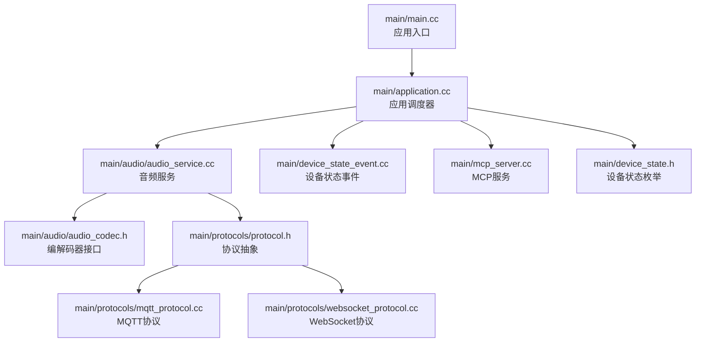
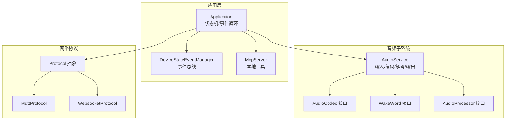
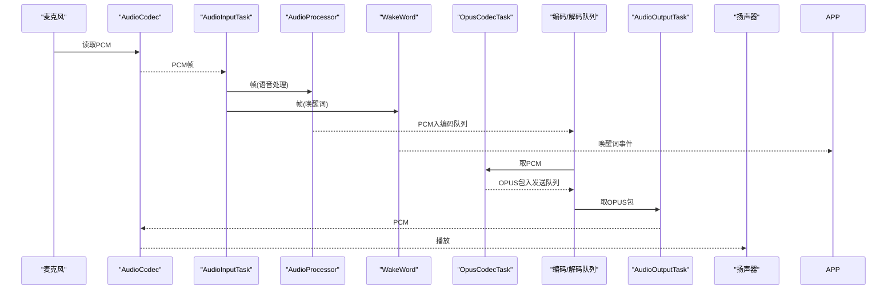
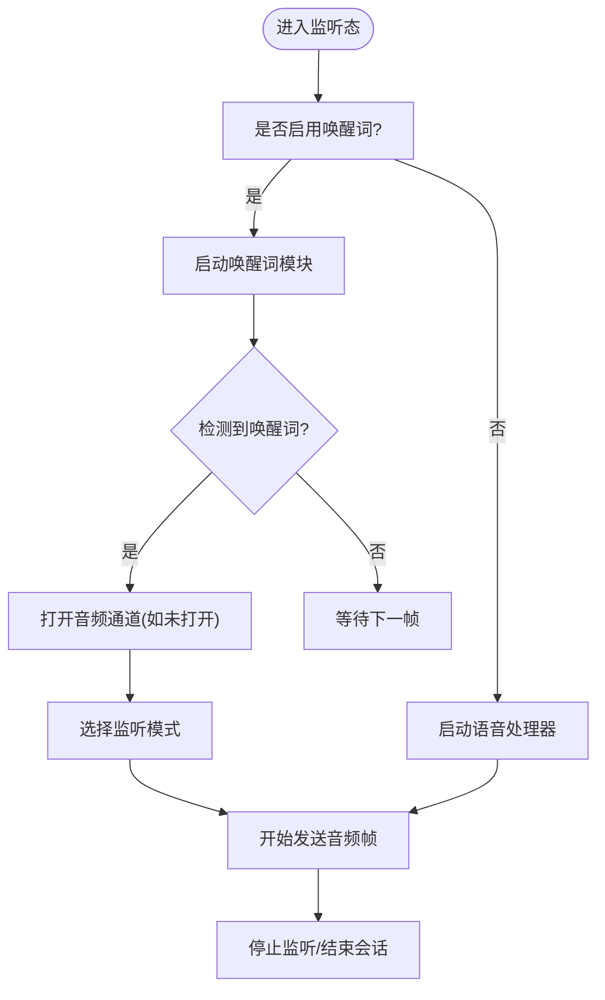
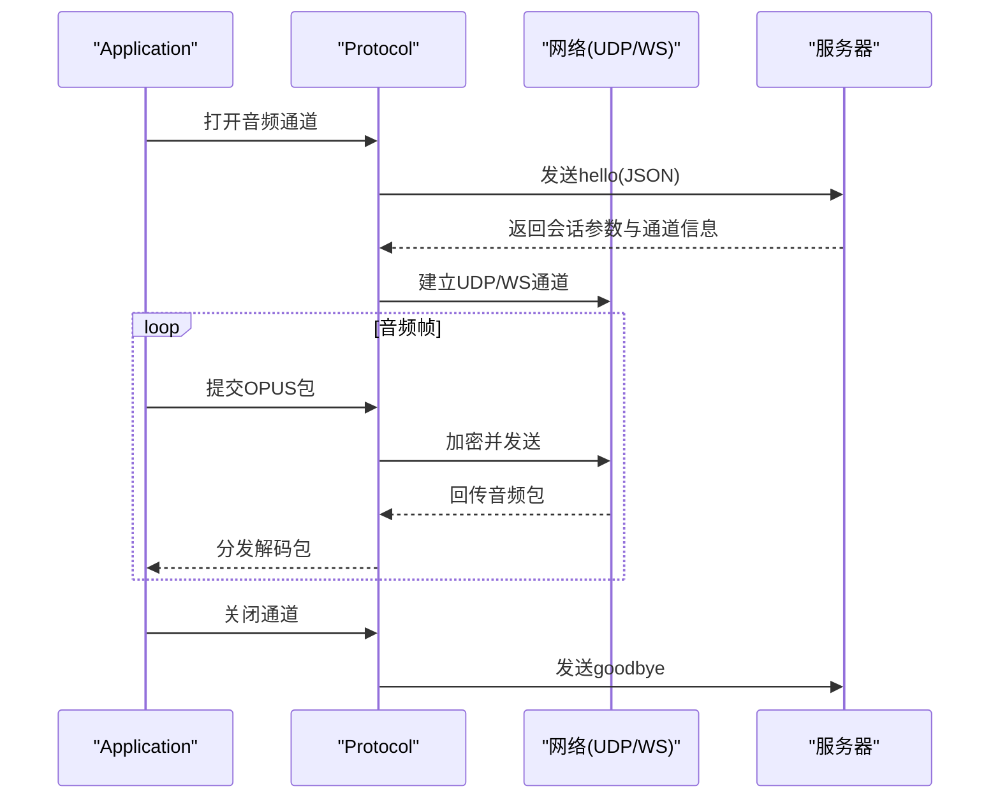
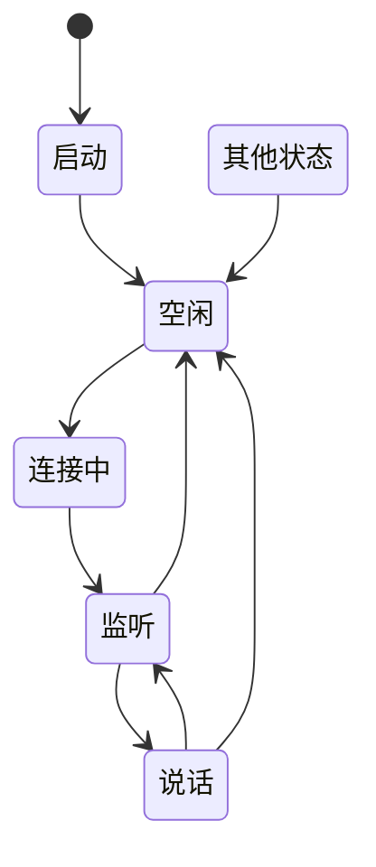
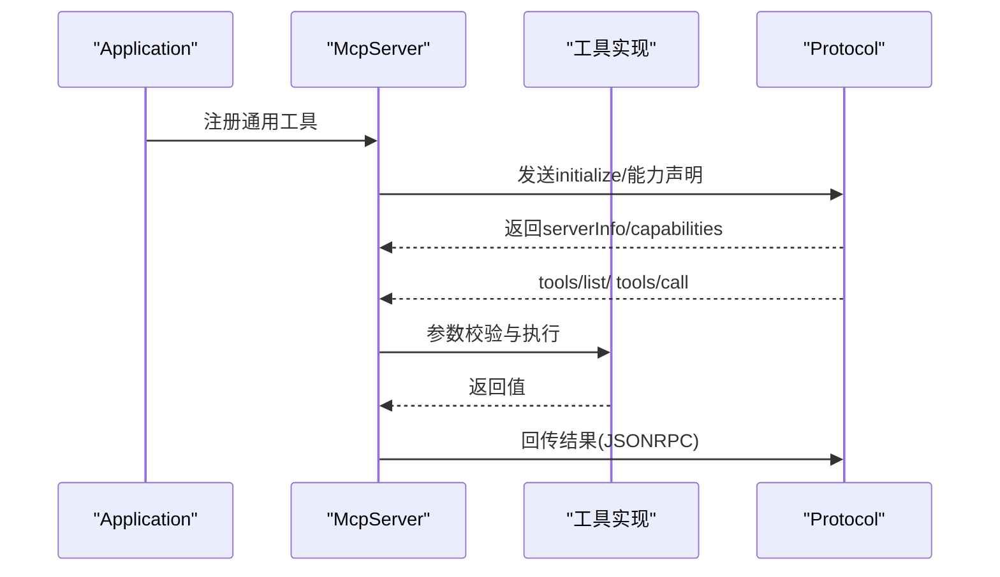
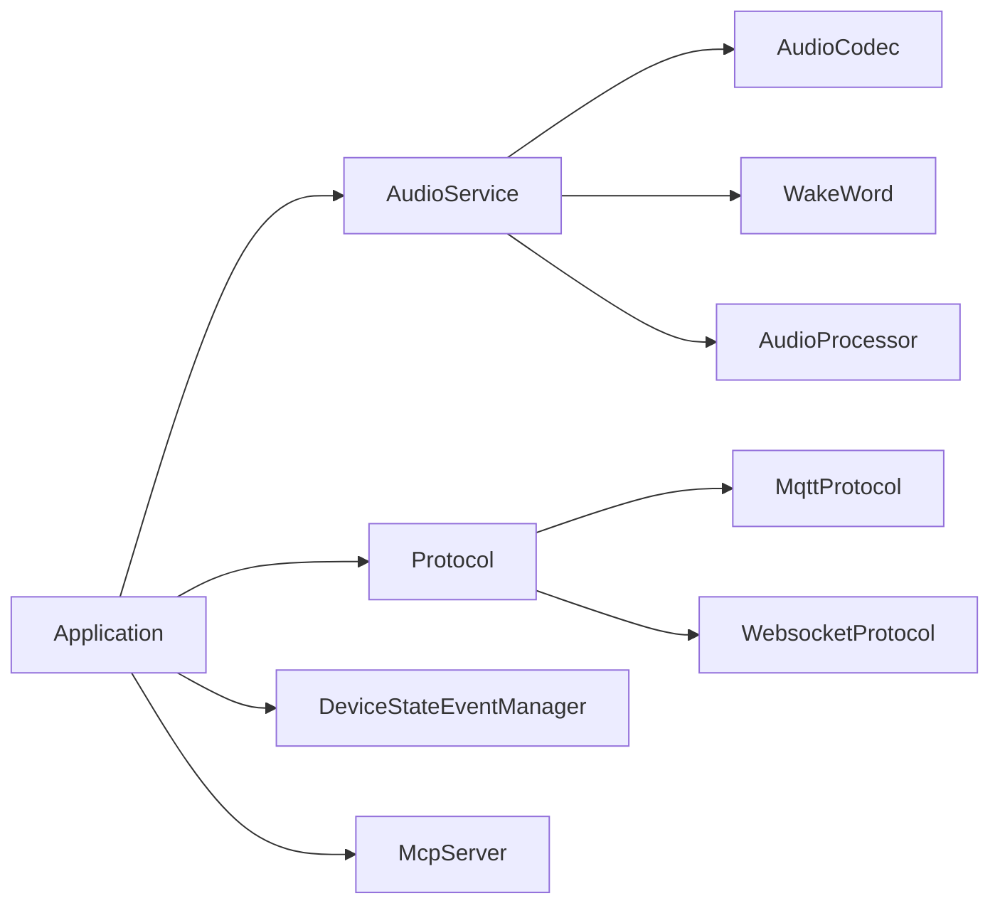

# 数据流设计

<cite>
**本文引用的文件**
- [main.cc](file://main/main.cc)
- [application.cc](file://main/application.cc)
- [audio_service.cc](file://main/audio/audio_service.cc)
- [audio_service.h](file://main/audio/audio_service.h)
- [audio_codec.h](file://main/audio/audio_codec.h)
- [protocol.h](file://main/protocols/protocol.h)
- [mqtt_protocol.cc](file://main/protocols/mqtt_protocol.cc)
- [websocket_protocol.cc](file://main/protocols/websocket_protocol.cc)
- [device_state_event.cc](file://main/device_state_event.cc)
- [mcp_server.cc](file://main/mcp_server.cc)
- [device_state.h](file://main/device_state.h)
- [wake_word.h](file://main/audio/wake_word.h)
- [audio_processor.h](file://main/audio/audio_processor.h)
</cite>

## 目录
1. [引言](#引言)
2. [项目结构](#项目结构)
3. [核心组件](#核心组件)
4. [架构总览](#架构总览)
5. [详细组件分析](#详细组件分析)
6. [依赖关系分析](#依赖关系分析)
7. [性能考量](#性能考量)
8. [故障排查指南](#故障排查指南)
9. [结论](#结论)
10. [附录](#附录)

## 引言
本文件面向“小智ESP32智能语音助手”项目的开发者与维护者，系统化梳理并阐述项目中的数据流设计。重点覆盖以下方面：
- 音频采集与处理流水线（从麦克风到编码、发送、解码与播放）
- 语音识别与唤醒词检测链路
- 网络通信数据流（MQTT/WS）与会话管理
- 设备状态变更流程与事件驱动机制
- 数据缓冲与队列管理策略
- 并发控制与线程安全
- 性能优化建议与调优指南

## 项目结构
项目采用模块化组织，核心入口位于主程序，应用层协调音频服务、协议栈与显示/LED等外设；音频子系统通过任务与队列实现高实时性与低耦合；协议层支持MQTT与WebSocket两种传输；MCP服务提供本地工具能力。

**图示来源**
- [main.cc](file://main/main.cc#L13-L31)
- [application.cc](file://main/application.cc#L328-L512)
- [audio_service.cc](file://main/audio/audio_service.cc#L95-L137)
- [protocol.h](file://main/protocols/protocol.h#L44-L95)
- [mqtt_protocol.cc](file://main/protocols/mqtt_protocol.cc#L44-L137)
- [websocket_protocol.cc](file://main/protocols/websocket_protocol.cc#L23-L76)
- [device_state_event.cc](file://main/device_state_event.cc#L1-L46)
- [mcp_server.cc](file://main/mcp_server.cc#L31-L108)
- [device_state.h](file://main/device_state.h#L4-L16)

**章节来源**
- [main.cc](file://main/main.cc#L13-L31)
- [application.cc](file://main/application.cc#L328-L512)

## 核心组件
- 应用调度器（Application）：负责启动顺序、状态机切换、事件循环、协议初始化与回调分发。
- 音频服务（AudioService）：封装编解码、重采样、编码/解码、队列与任务、唤醒词与语音处理模块。
- 协议抽象（Protocol）及实现（MQTT/WebSocket）：统一音频通道打开/关闭、文本与二进制消息收发、会话与错误处理。
- 设备状态事件（DeviceStateEventManager）：基于ESP Event的事件总线，广播状态变更。
- MCP服务（McpServer）：解析与执行本地工具调用，支持异步线程执行与结果回传。

**章节来源**
- [application.cc](file://main/application.cc#L328-L512)
- [audio_service.cc](file://main/audio/audio_service.cc#L33-L93)
- [protocol.h](file://main/protocols/protocol.h#L44-L95)
- [mqtt_protocol.cc](file://main/protocols/mqtt_protocol.cc#L13-L42)
- [websocket_protocol.cc](file://main/protocols/websocket_protocol.cc#L15-L21)
- [device_state_event.cc](file://main/device_state_event.cc#L1-L46)
- [mcp_server.cc](file://main/mcp_server.cc#L21-L29)

## 架构总览
系统以“应用调度器”为中心，围绕其构建“音频采集/处理/播放”与“网络协议”两条主线，并通过“设备状态事件”实现跨模块解耦。

**图示来源**
- [application.cc](file://main/application.cc#L328-L512)
- [audio_service.cc](file://main/audio/audio_service.cc#L33-L93)
- [protocol.h](file://main/protocols/protocol.h#L44-L95)
- [mqtt_protocol.cc](file://main/protocols/mqtt_protocol.cc#L13-L42)
- [websocket_protocol.cc](file://main/protocols/websocket_protocol.cc#L15-L21)
- [device_state_event.cc](file://main/device_state_event.cc#L1-L46)
- [mcp_server.cc](file://main/mcp_server.cc#L21-L29)

## 详细组件分析

### 音频采集处理流水线
- 输入路径：AudioInputTask从编解码器读取PCM，按需进行重采样与通道合并，喂给语音处理器或唤醒词模块。
- 处理路径：语音处理器输出PCM帧进入编码队列；唤醒词模块独立运行，检测到关键词后触发事件。
- 编码路径：OpusCodecTask批量从编码队列取出PCM，进行Opus编码，生成音频包入发送队列。
- 输出路径：AudioOutputTask从播放队列取出PCM，写入编解码器输出到扬声器。
- 测试路径：音频测试模式下，输入数据直接进入测试编码队列，结束后回放到播放队列。

**图示来源**
- [audio_service.cc](file://main/audio/audio_service.cc#L209-L276)
- [audio_service.cc](file://main/audio/audio_service.cc#L314-L391)
- [audio_service.cc](file://main/audio/audio_service.cc#L278-L312)
- [audio_service.h](file://main/audio/audio_service.h#L125-L154)

**章节来源**
- [audio_service.cc](file://main/audio/audio_service.cc#L95-L137)
- [audio_service.cc](file://main/audio/audio_service.cc#L154-L207)
- [audio_service.cc](file://main/audio/audio_service.cc#L209-L276)
- [audio_service.cc](file://main/audio/audio_service.cc#L278-L312)
- [audio_service.cc](file://main/audio/audio_service.cc#L314-L391)
- [audio_service.h](file://main/audio/audio_service.h#L26-L53)

### 语音识别处理链路
- 唤醒词检测：当处于空闲态且启用唤醒词时，AudioService启动唤醒词模块；检测到唤醒词后，应用层根据配置决定是否立即开启音频通道并进入监听态。
- VAD联动：语音处理器输出VAD状态变化事件，应用层可据此更新LED状态。
- 语音处理开关：监听态开启语音处理，停止态关闭，避免误触发。

**图示来源**
- [application.cc](file://main/application.cc#L585-L621)
- [audio_service.cc](file://main/audio/audio_service.cc#L474-L513)
- [audio_service.cc](file://main/audio/audio_service.cc#L63-L80)

**章节来源**
- [application.cc](file://main/application.cc#L585-L621)
- [audio_service.cc](file://main/audio/audio_service.cc#L474-L513)

### 网络通信数据流
- 通道建立：协议实现负责连接Broker或WebSocket服务器，发送“hello”握手消息，等待服务器返回会话参数与UDP/WS通道信息。
- 音频加密：MQTT通道采用AES-CTR对音频包进行加密，包含类型、长度、SSRC、时间戳、序列号等字段。
- 文本消息：JSON消息通过文本通道下发，应用层解析后分派至显示、MCP或其他业务逻辑。
- 错误与超时：协议层维护错误状态与超时检测，断开后自动重连或回调通知。

**图示来源**
- [mqtt_protocol.cc](file://main/protocols/mqtt_protocol.cc#L194-L274)
- [websocket_protocol.cc](file://main/protocols/websocket_protocol.cc#L82-L200)
- [protocol.h](file://main/protocols/protocol.h#L58-L76)

**章节来源**
- [mqtt_protocol.cc](file://main/protocols/mqtt_protocol.cc#L139-L175)
- [mqtt_protocol.cc](file://main/protocols/mqtt_protocol.cc#L222-L266)
- [websocket_protocol.cc](file://main/protocols/websocket_protocol.cc#L28-L58)
- [websocket_protocol.cc](file://main/protocols/websocket_protocol.cc#L111-L165)

### 设备状态变更流程
- 状态枚举：定义了从启动、空闲、连接中、监听、说话、升级、激活、音频测试到致命错误等状态。
- 事件总线：应用层在状态切换时发布事件，订阅方（如LED、显示）接收并更新界面。
- 主事件循环：应用层通过事件组等待发送队列可用、唤醒词检测、VAD变化等事件，驱动主循环执行任务。

**图示来源**
- [device_state.h](file://main/device_state.h#L4-L16)
- [application.cc](file://main/application.cc#L634-L694)
- [device_state_event.cc](file://main/device_state_event.cc#L15-L21)

**章节来源**
- [application.cc](file://main/application.cc#L634-L694)
- [device_state_event.cc](file://main/device_state_event.cc#L15-L21)

### MCP本地工具链路
- 工具注册：应用启动时向MCP服务注册通用工具（设备状态、音量、屏幕亮度、拍照解释等），并支持动态扩展。
- 能力声明：初始化阶段解析服务器能力，按需配置相机解释URL等。
- 工具调用：解析“tools/call”，校验参数，启动独立线程执行工具，避免阻塞主事件循环，并将结果通过协议回传。

**图示来源**
- [mcp_server.cc](file://main/mcp_server.cc#L31-L108)
- [mcp_server.cc](file://main/mcp_server.cc#L154-L238)
- [mcp_server.cc](file://main/mcp_server.cc#L308-L367)

**章节来源**
- [mcp_server.cc](file://main/mcp_server.cc#L31-L108)
- [mcp_server.cc](file://main/mcp_server.cc#L154-L238)
- [mcp_server.cc](file://main/mcp_server.cc#L308-L367)

## 依赖关系分析
- 组件耦合与内聚：应用层作为调度中枢，通过回调与事件与音频、协议、MCP解耦；音频服务内部通过任务与队列隔离不同阶段。
- 外部依赖：MQTT/WS网络库、JSON解析库、Opus编解码与重采样库、ESP-IDF事件与定时器。
- 潜在环依赖：当前结构未见明显循环依赖；协议抽象屏蔽具体实现差异。

**图示来源**
- [application.cc](file://main/application.cc#L328-L512)
- [audio_service.cc](file://main/audio/audio_service.cc#L33-L93)
- [protocol.h](file://main/protocols/protocol.h#L44-L95)
- [mqtt_protocol.cc](file://main/protocols/mqtt_protocol.cc#L13-L42)
- [websocket_protocol.cc](file://main/protocols/websocket_protocol.cc#L15-L21)
- [device_state_event.cc](file://main/device_state_event.cc#L1-L46)
- [mcp_server.cc](file://main/mcp_server.cc#L21-L29)

**章节来源**
- [application.cc](file://main/application.cc#L328-L512)
- [audio_service.cc](file://main/audio/audio_service.cc#L33-L93)
- [protocol.h](file://main/protocols/protocol.h#L44-L95)

## 性能考量
- 队列容量与背压：编码/解码/播放队列均有限容量，防止内存膨胀；发送队列与解码队列容量按帧时长折算，确保端到端延迟可控。
- 任务优先级与亲和：音频输入任务绑定特定核心，降低抖动；主事件循环提升优先级以减少被后台任务打断。
- 功耗管理：空闲态与通道关闭时自动关闭编解码器输入/输出，定时器周期性检查功耗状态。
- 重采样与带宽：输入/输出重采样按需配置，避免不必要的CPU消耗；音频测试模式限制最大时长，防止资源占用过久。
- 线程与锁：音频服务内部使用互斥锁与条件变量保护队列；事件组用于跨任务通知，避免忙等。

**章节来源**
- [audio_service.h](file://main/audio/audio_service.h#L37-L47)
- [audio_service.cc](file://main/audio/audio_service.cc#L95-L137)
- [audio_service.cc](file://main/audio/audio_service.cc#L139-L153)
- [audio_service.cc](file://main/audio/audio_service.cc#L656-L669)

## 故障排查指南
- 网络异常：协议层记录错误并触发事件，应用层弹出告警；检查MQTT/WS连接参数、证书与防火墙。
- 音频无声/破音：确认编解码器启停状态、采样率匹配、重采样参数；检查音频功率定时器是否正确关闭。
- 唤醒词不灵敏：检查唤醒词模型与阈值配置；确认音频输入增益与通道选择。
- MCP工具失败：查看工具参数校验与线程栈大小；关注JSONRPC返回的错误消息。
- 状态卡死：检查设备状态事件是否正常发布与消费；确认主事件循环是否被阻塞。

**章节来源**
- [mqtt_protocol.cc](file://main/protocols/mqtt_protocol.cc#L74-L87)
- [websocket_protocol.cc](file://main/protocols/websocket_protocol.cc#L167-L172)
- [audio_service.cc](file://main/audio/audio_service.cc#L656-L669)
- [mcp_server.cc](file://main/mcp_server.cc#L344-L367)
- [device_state_event.cc](file://main/device_state_event.cc#L15-L21)

## 结论
本项目通过清晰的模块划分与事件驱动机制，实现了从音频采集、处理、编码到网络传输与本地工具执行的完整数据流闭环。队列与任务模型保证了实时性与稳定性，协议抽象提供了灵活的传输选择。建议在后续版本中进一步细化统计指标与日志分级，以辅助更精细的性能分析与问题定位。

## 附录
- 关键数据结构与接口
  - 音频包：包含采样率、帧时长、时间戳与负载。
  - 协议回调：文本消息、音频包、通道开启/关闭、网络错误、连接/断开。
  - 设备状态：枚举定义了全生命周期状态。
  - 唤醒词与语音处理器：抽象接口便于替换实现。

**章节来源**
- [protocol.h](file://main/protocols/protocol.h#L10-L15)
- [protocol.h](file://main/protocols/protocol.h#L58-L95)
- [device_state.h](file://main/device_state.h#L4-L16)
- [wake_word.h](file://main/audio/wake_word.h#L10-L23)
- [audio_processor.h](file://main/audio/audio_processor.h#L10-L23)