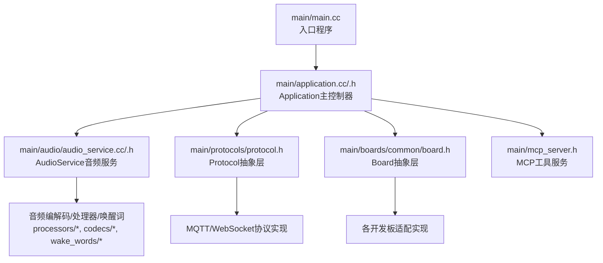
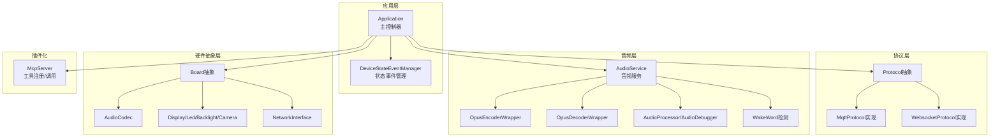
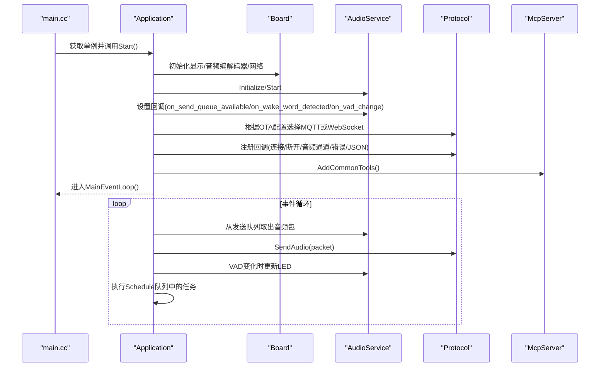
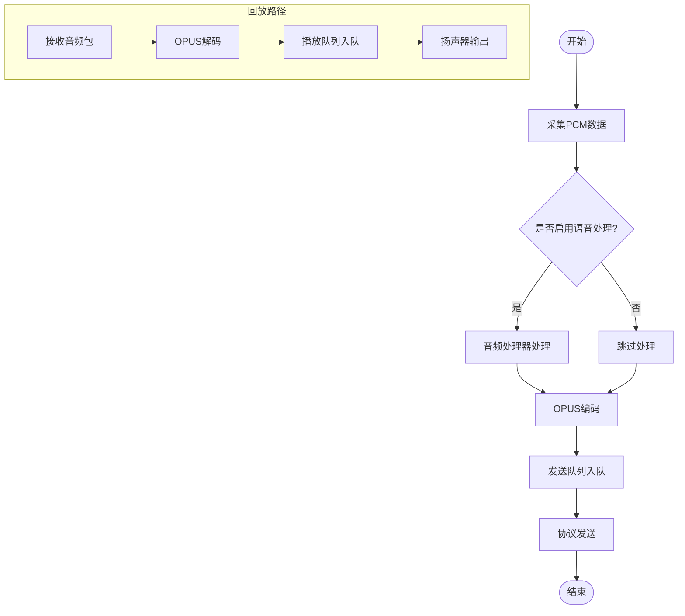
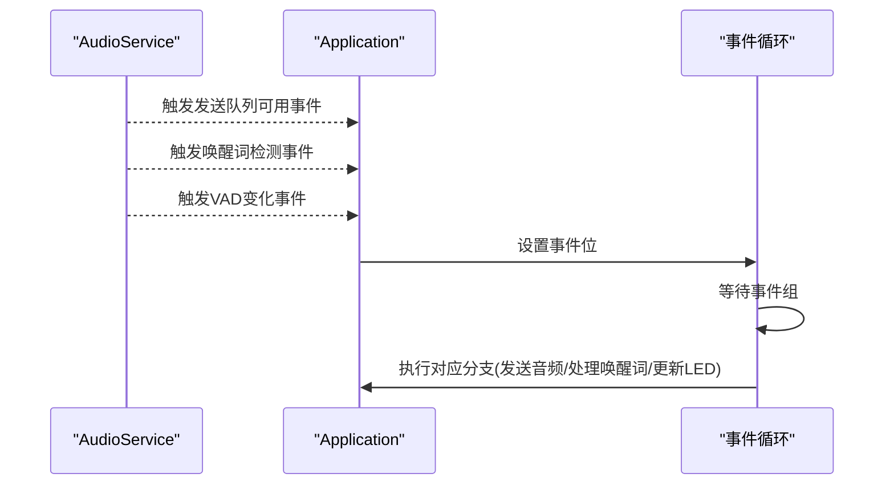
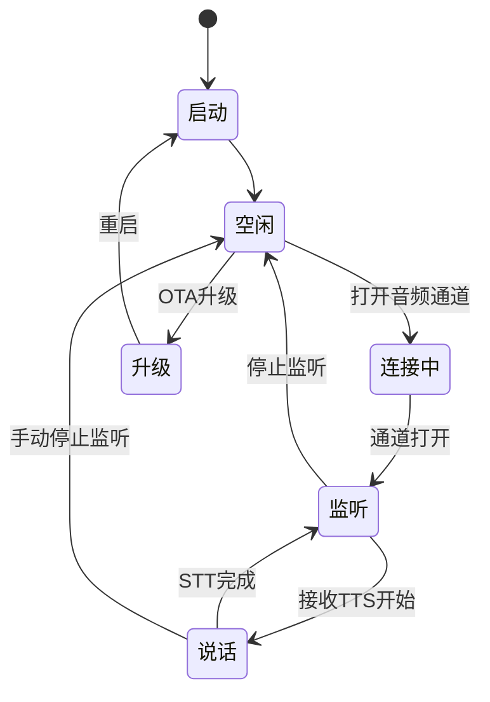
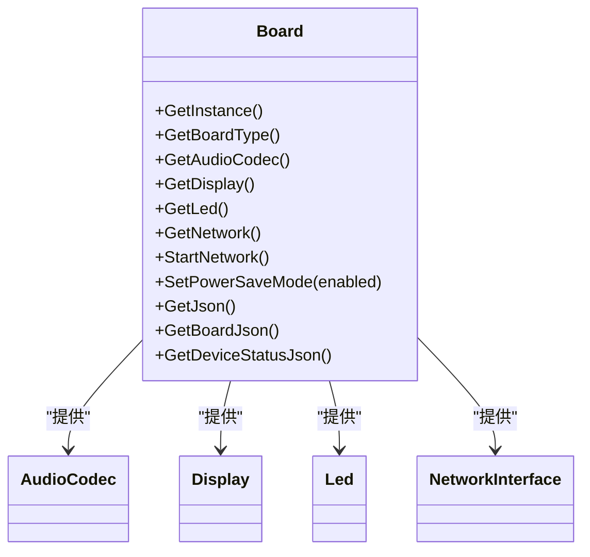
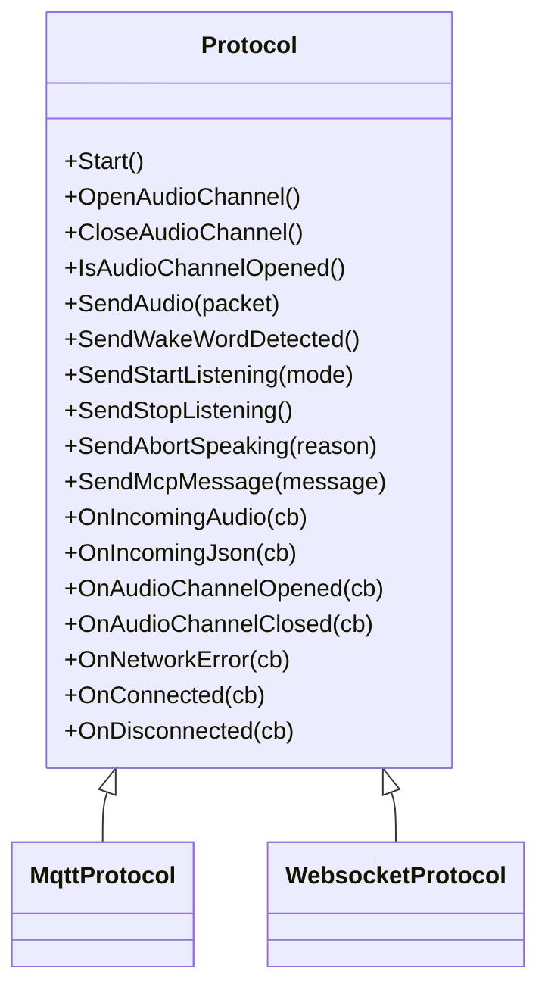
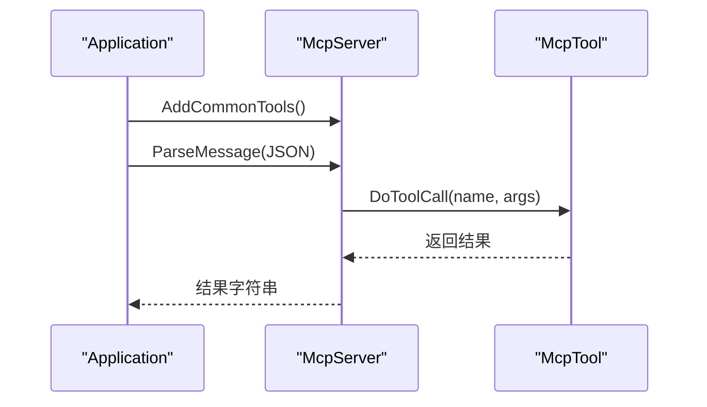
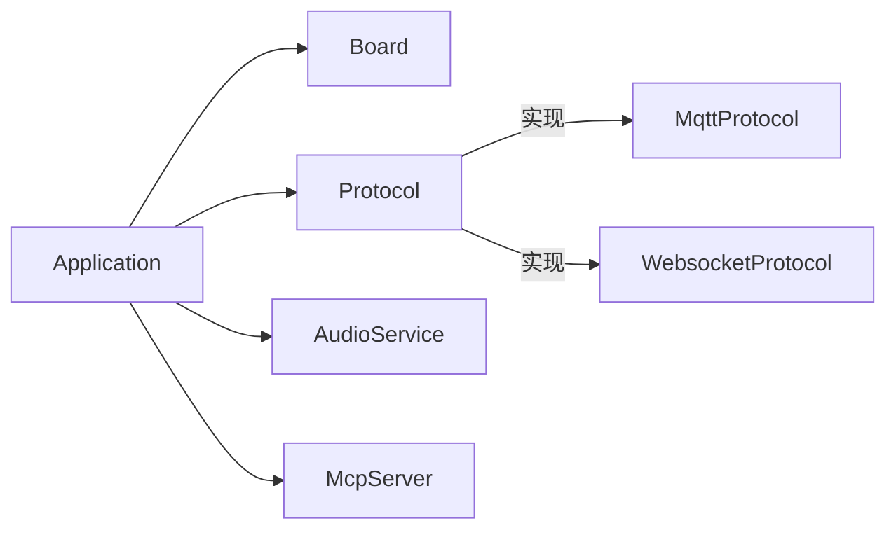

# 核心架构设计

<cite>
**本文档引用的文件**
- [main.cc](file://main/main.cc)
- [application.h](file://main/application.h)
- [application.cc](file://main/application.cc)
- [device_state.h](file://main/device_state.h)
- [device_state_event.h](file://main/device_state_event.h)
- [audio_service.h](file://main/audio/audio_service.h)
- [audio_service.cc](file://main/audio/audio_service.cc)
- [protocol.h](file://main/protocols/protocol.h)
- [board.h](file://main/boards/common/board.h)
- [mcp_server.h](file://main/mcp_server.h)
</cite>

## 目录
1. [引言](#引言)
2. [项目结构](#项目结构)
3. [核心组件](#核心组件)
4. [架构总览](#架构总览)
5. [详细组件分析](#详细组件分析)
6. [依赖关系分析](#依赖关系分析)
7. [性能考虑](#性能考虑)
8. [故障排查指南](#故障排查指南)
9. [结论](#结论)

## 引言
本文件面向“小智ESP32智能语音助手”项目，系统性阐述其核心架构设计与实现要点。重点包括：
- 分层架构：应用层、协议层、音频层、板级抽象层的职责划分与协作方式
- 模块化与插件化：通过Board抽象层实现多硬件平台适配；通过Protocol抽象层支持多种通信协议；通过MCP（Model Context Protocol）实现插件化能力扩展
- 主控制器Application设计理念：统一的状态机、事件驱动循环、异步任务调度
- 数据流与控制流：从麦克风采集到远端服务器，再从服务器返回音频播放的完整链路
- 设计模式应用：单例模式用于全局实例管理，工厂模式用于协议选择，观察者模式用于状态事件广播

## 项目结构
项目采用“功能域+层次化”的组织方式：
- main目录为核心业务逻辑与基础设施
  - application.*：应用主控制器，负责启动流程、状态管理、事件循环
  - audio/*：音频子系统，包含编解码、处理器、唤醒词检测、调试器等
  - protocols/*：通信协议抽象与实现（MQTT/WebSocket）
  - boards/common/board.h：硬件抽象接口，屏蔽不同开发板差异
  - mcp_server.h：MCP协议工具注册与调用框架
- managed_components：第三方组件库（音频、显示、网络等）

**图示来源**
- [main.cc](file://main/main.cc#L13-L31)
- [application.cc](file://main/application.cc#L328-L512)
- [audio_service.cc](file://main/audio/audio_service.cc#L95-L137)
- [protocol.h](file://main/protocols/protocol.h#L44-L95)
- [board.h](file://main/boards/common/board.h#L18-L53)
- [mcp_server.h](file://main/mcp_server.h#L252-L279)

**章节来源**
- [main.cc](file://main/main.cc#L13-L31)

## 核心组件
- Application（主控制器）
  - 单例模式：全局唯一实例，集中管理设备状态、事件循环、协议与音频服务
  - 事件驱动：基于事件组触发音频发送、唤醒词检测、VAD变化、错误等事件
  - 状态机：定义完整的设备状态集合，驱动UI与LED反馈
  - 异步调度：通过队列与互斥锁保护任务队列，确保跨任务安全执行
- AudioService（音频服务）
  - 双任务模型：音频输入/输出任务与OPUS编解码任务分离，提升实时性
  - 多队列：编码/解码/播放/测试队列，配合容量限制保证稳定性
  - 功能开关：可动态启用/禁用唤醒词、语音处理、设备AEC、音频测试
- Protocol（协议抽象）
  - 抽象接口：统一Start/Open/Close/Send等方法，屏蔽MQTT/WebSocket差异
  - 回调机制：对音频帧、JSON消息、通道开闭、网络错误等事件回调
- Board（硬件抽象）
  - 工厂式接口：通过静态工厂获取具体板级实例，隐藏创建细节
  - 统一接口：音频编解码器、显示、LED、网络、电源管理等能力统一抽象
- MCP（插件化）
  - 工具注册：以工具名称、描述、参数Schema注册能力
  - 调用执行：解析调用参数，执行回调并返回结果

**章节来源**
- [application.h](file://main/application.h#L32-L88)
- [application.cc](file://main/application.cc#L328-L512)
- [audio_service.h](file://main/audio/audio_service.h#L81-L155)
- [audio_service.cc](file://main/audio/audio_service.cc#L95-L137)
- [protocol.h](file://main/protocols/protocol.h#L44-L95)
- [board.h](file://main/boards/common/board.h#L18-L53)
- [mcp_server.h](file://main/mcp_server.h#L252-L279)

## 架构总览
整体架构遵循“主控制器+抽象层+插件化”的设计原则，Application作为中枢协调各子系统，Board抽象层隔离硬件差异，Protocol抽象层支持多种通信协议，MCP提供插件化扩展能力。

**图示来源**
- [application.cc](file://main/application.cc#L328-L512)
- [audio_service.cc](file://main/audio/audio_service.cc#L33-L93)
- [protocol.h](file://main/protocols/protocol.h#L44-L95)
- [board.h](file://main/boards/common/board.h#L18-L53)
- [mcp_server.h](file://main/mcp_server.h#L252-L279)

## 详细组件分析

### Application主控制器
- 单例与生命周期
  - 单例：全局唯一实例，禁止拷贝
  - 生命周期：Start初始化硬件与服务，MainEventLoop进入事件驱动循环
- 事件驱动与状态机
  - 事件组：用于唤醒发送音频、唤醒词检测、VAD变化、错误等
  - 状态机：覆盖启动、配置、空闲、连接中、监听、说话、升级、激活、音频测试、致命错误等状态
  - 状态变更：通过DeviceStateEventManager广播状态变更事件
- 协议选择与初始化
  - 基于OTA配置选择MQTT或WebSocket协议
  - 注册回调：连接成功、网络错误、音频通道开闭、接收音频/JSON等
- 音频通道控制
  - 打开/关闭音频通道、发送开始/停止监听、中止说话、发送唤醒词检测
- 异步任务调度
  - Schedule将任务入队并通过事件唤醒主循环执行

**图示来源**
- [main.cc](file://main/main.cc#L27-L30)
- [application.cc](file://main/application.cc#L328-L512)
- [audio_service.cc](file://main/audio/audio_service.cc#L538-L540)

**章节来源**
- [application.h](file://main/application.h#L32-L88)
- [application.cc](file://main/application.cc#L328-L512)
- [device_state.h](file://main/device_state.h#L4-L16)
- [device_state_event.h](file://main/device_state_event.h#L21-L37)

### 音频处理流水线
- 数据路径
  - 录音采集 → 音频处理器/唤醒词 → 编码队列 → OPUS编码 → 发送队列 → 协议发送
  - 服务器音频 → 解码队列 → OPUS解码 → 播放队列 → 扬声器输出
- 任务与队列
  - 输入/输出/编解码三类任务分离，避免阻塞
  - 编码/解码/播放/测试队列容量限制，防止内存膨胀
- 实时性保障
  - 定时器监控音频功耗，空闲自动关闭输入/输出
  - 服务器AEC模式下维护时间戳队列，保证对齐

**图示来源**
- [audio_service.h](file://main/audio/audio_service.h#L26-L44)
- [audio_service.cc](file://main/audio/audio_service.cc#L314-L391)

**章节来源**
- [audio_service.h](file://main/audio/audio_service.h#L81-L155)
- [audio_service.cc](file://main/audio/audio_service.cc#L95-L137)

### 事件驱动机制
- 事件源
  - 音频服务回调：发送队列可用、唤醒词检测、VAD变化
  - 协议回调：连接/断开、音频通道开闭、网络错误、接收JSON
- 事件聚合
  - Application使用事件组聚合多个事件，统一唤醒主循环
- 任务调度
  - Schedule将外部任务安全入队，主循环顺序执行，避免竞态

**图示来源**
- [application.cc](file://main/application.cc#L340-L350)
- [application.cc](file://main/application.cc#L544-L582)

**章节来源**
- [application.cc](file://main/application.cc#L544-L582)

### 状态管理模式
- 状态枚举
  - 定义从启动到致命错误的完整状态序列
- 状态切换
  - Application根据当前状态与条件切换下一状态，并更新UI/LED
  - 状态变更通过DeviceStateEventManager广播，供其他模块订阅
- 电源与休眠
  - CanEnterSleepMode综合判断设备状态、协议通道、音频服务空闲度决定是否允许进入睡眠

**图示来源**
- [device_state.h](file://main/device_state.h#L4-L16)
- [application.cc](file://main/application.cc#L634-L694)

**章节来源**
- [device_state.h](file://main/device_state.h#L4-L16)
- [application.cc](file://main/application.cc#L634-L694)

### Board抽象层与硬件适配
- 抽象接口
  - 提供获取显示、LED、音频编解码器、网络、温度、电池、JSON信息等统一接口
  - 工厂宏DECLARE_BOARD用于生成具体板级实例
- 适配策略
  - 不同开发板实现Board接口，Application仅依赖抽象接口，实现跨板移植

**图示来源**
- [board.h](file://main/boards/common/board.h#L18-L53)

**章节来源**
- [board.h](file://main/boards/common/board.h#L18-L53)

### Protocol抽象层与通信协议
- 抽象接口
  - 统一Start、OpenAudioChannel、CloseAudioChannel、SendAudio、回调注册等
- 具体实现
  - MQTT与WebSocket协议实现，Application按OTA配置选择其一
- 事件回调
  - 对音频帧、JSON消息、通道开闭、网络错误进行回调处理

**图示来源**
- [protocol.h](file://main/protocols/protocol.h#L44-L95)

**章节来源**
- [protocol.h](file://main/protocols/protocol.h#L44-L95)

### MCP插件化架构
- 工具注册
  - 通过McpTool定义工具名称、描述、参数Schema与回调
- 能力发现
  - 通过AddTool/AddCommonTools注册工具，供上层调用
- 调用执行
  - 解析调用参数，执行回调并返回结果内容

**图示来源**
- [application.cc](file://main/application.cc#L408-L496)
- [mcp_server.h](file://main/mcp_server.h#L252-L279)

**章节来源**
- [mcp_server.h](file://main/mcp_server.h#L174-L279)

## 依赖关系分析
- 组件耦合
  - Application高内聚，低耦合：通过抽象接口依赖Board、Protocol、AudioService
  - Board抽象屏蔽硬件差异，便于扩展新板型
  - Protocol抽象屏蔽通信协议差异，便于替换或扩展
- 关键依赖链
  - Application → Board（硬件资源）
  - Application → Protocol（通信）
  - Application → AudioService（音频）
  - Application → McpServer（插件）
- 循环依赖规避
  - 通过头文件前向声明与运行时依赖避免循环包含

**图示来源**
- [application.cc](file://main/application.cc#L362-L378)
- [protocol.h](file://main/protocols/protocol.h#L44-L95)

**章节来源**
- [application.cc](file://main/application.cc#L362-L378)
- [protocol.h](file://main/protocols/protocol.h#L44-L95)

## 性能考虑
- 任务分离与优先级
  - 音频输入/输出/编解码任务分离，避免相互阻塞
  - 主事件循环提升优先级，减少后台任务抢占
- 队列容量与背压
  - 编码/解码/播放/测试队列容量限制，防止内存占用过高
- 采样率与重采样
  - 根据协议与硬件采样率差异进行重采样，平衡音质与CPU
- 功耗管理
  - 音频空闲超时自动关闭输入/输出，降低功耗
- AEC模式
  - 设备侧AEC与服务端AEC的切换需关闭音频通道，避免状态不一致

[本节为通用指导，无需列出具体文件来源]

## 故障排查指南
- 网络错误
  - Application注册OnNetworkError回调，设置错误事件并弹出告警
- 版本检查失败
  - CheckNewVersion循环重试，指数退避，超过阈值退出
- 升级失败
  - 升级失败后重启音频服务并恢复省电模式，继续运行
- 唤醒词误触发
  - 根据AEC模式调整监听模式，必要时禁用设备侧AEC
- 音频无声
  - 检查音频输出使能、播放队列、解码器状态与重采样配置

**章节来源**
- [application.cc](file://main/application.cc#L70-L176)
- [application.cc](file://main/application.cc#L384-L387)
- [audio_service.cc](file://main/audio/audio_service.cc#L656-L669)

## 结论
本项目通过清晰的分层架构与抽象接口，实现了硬件无关、协议无关、能力可插拔的智能语音助手系统。Application作为主控制器，结合事件驱动与状态机，有效协调音频、通信与显示等子系统；Board与Protocol抽象层确保了良好的可移植性与可扩展性；MCP插件化机制为后续功能扩展提供了便利。该架构既满足实时性要求，又兼顾了可维护性与可演进性。