# 硬件抽象层设计

<cite>
**本文引用的文件**
- [main/boards/README.md](file://main/boards/README.md)
- [main/CMakeLists.txt](file://main/CMakeLists.txt)
- [main/application.h](file://main/application.h)
- [main/main.cc](file://main/main.cc)
- [main/device_state.h](file://main/device_state.h)
- [main/boards/common/board.h](file://main/boards/common/board.h)
- [main/boards/common/wifi_board.h](file://main/boards/common/wifi_board.h)
- [main/boards/common/ml307_board.h](file://main/boards/common/ml307_board.h)
- [main/boards/common/dual_network_board.h](file://main/boards/common/dual_network_board.h)
- [main/boards/common/backlight.h](file://main/boards/common/backlight.h)
- [main/led/led.h](file://main/led/led.h)
- [main/display/display.h](file://main/display/display.h)
- [main/audio/audio_codec.h](file://main/audio/audio_codec.h)
</cite>

## 目录
1. [简介](#简介)
2. [项目结构](#项目结构)
3. [核心组件](#核心组件)
4. [架构总览](#架构总览)
5. [详细组件分析](#详细组件分析)
6. [依赖分析](#依赖分析)
7. [性能考虑](#性能考虑)
8. [故障排查指南](#故障排查指南)
9. [结论](#结论)
10. [附录](#附录)

## 简介
本文件系统化阐述“小智ESP32智能语音助手”项目的硬件抽象层（HAL）设计，重点说明如何通过统一的Board抽象接口适配70+种不同开发板硬件；解析HAL层次结构（通用硬件接口、网络接口、音频接口、显示接口等）；梳理开发板配置管理机制（config.h、config.json、Kconfig/SDK配置）；总结硬件资源的动态分配与管理策略，并给出为新硬件平台添加支持的最佳实践与扩展指南。

## 项目结构
项目采用“按板级目录组织 + 统一抽象接口 + 构建期选择”的组织方式：
- 每个开发板在 main/boards/<开发板名>/ 下提供独立的板级实现与配置
- 顶层构建脚本根据Kconfig/SDK配置选择具体板级源文件进行编译
- 通过宏与CMake条件分支实现“同一套应用逻辑适配多款硬件”

图示来源
- [main/main.cc](file://main/main.cc#L13-L31)
- [main/application.h](file://main/application.h#L32-L87)
- [main/boards/common/board.h](file://main/boards/common/board.h#L18-L53)
- [main/boards/common/wifi_board.h](file://main/boards/common/wifi_board.h#L6-L22)
- [main/boards/common/ml307_board.h](file://main/boards/common/ml307_board.h#L9-L27)
- [main/boards/common/dual_network_board.h](file://main/boards/common/dual_network_board.h#L16-L57)
- [main/audio/audio_codec.h](file://main/audio/audio_codec.h#L18-L57)
- [main/display/display.h](file://main/display/display.h#L18-L66)
- [main/boards/common/backlight.h](file://main/boards/common/backlight.h#L10-L36)
- [main/led/led.h](file://main/led/led.h#L4-L16)
- [main/CMakeLists.txt](file://main/CMakeLists.txt#L36-L230)

章节来源
- [main/CMakeLists.txt](file://main/CMakeLists.txt#L36-L230)
- [main/boards/README.md](file://main/boards/README.md#L1-L335)

## 核心组件
- Board抽象基类：定义统一的硬件能力接口（音频、显示、背光、LED、网络、电源管理等），并通过工厂函数与宏完成实例化与注册
- WifiBoard/Ml307Board/DualNetworkBoard：针对不同网络形态的板级实现，封装网络启动、状态图标、设备信息JSON等
- Display/AudioCodec/Led/Backlight：各子系统的抽象接口，屏蔽底层驱动差异
- 应用层与设备状态：应用层协调事件循环、设备状态机与各子系统交互

章节来源
- [main/boards/common/board.h](file://main/boards/common/board.h#L18-L53)
- [main/boards/common/wifi_board.h](file://main/boards/common/wifi_board.h#L6-L22)
- [main/boards/common/ml307_board.h](file://main/boards/common/ml307_board.h#L9-L27)
- [main/boards/common/dual_network_board.h](file://main/boards/common/dual_network_board.h#L16-L57)
- [main/display/display.h](file://main/display/display.h#L18-L66)
- [main/audio/audio_codec.h](file://main/audio/audio_codec.h#L18-L57)
- [main/led/led.h](file://main/led/led.h#L4-L16)
- [main/boards/common/backlight.h](file://main/boards/common/backlight.h#L10-L36)
- [main/application.h](file://main/application.h#L32-L87)
- [main/device_state.h](file://main/device_state.h#L4-L16)

## 架构总览
硬件抽象层通过“接口抽象 + 工厂注册 + 构建期选择”的方式，将应用逻辑与具体硬件解耦：
- 接口抽象：Board及其派生类定义统一能力契约
- 工厂注册：通过宏在各开发板实现中注册实例
- 构建期选择：CMake依据Kconfig/SDK配置选择对应板级源码参与编译
- 运行时装配：Board::GetInstance返回全局单例，调用其虚函数接口

图示来源
- [main/boards/common/board.h](file://main/boards/common/board.h#L18-L53)
- [main/boards/common/wifi_board.h](file://main/boards/common/wifi_board.h#L6-L22)
- [main/boards/common/ml307_board.h](file://main/boards/common/ml307_board.h#L9-L27)
- [main/boards/common/dual_network_board.h](file://main/boards/common/dual_network_board.h#L16-L57)

## 详细组件分析

### Board抽象接口与工厂注册
- 设计要点
  - 单例工厂：GetInstance内部通过create_board()工厂函数返回具体板级实例
  - 虚函数契约：统一声明GetAudioCodec/GetDisplay/GetBacklight/GetNetwork/SetPowerSaveMode等接口
  - 宏注册：通过DECLARE_BOARD在各开发板实现中注册实例，避免在应用层硬编码
- 适用场景
  - 任意新增开发板只需实现对应类并使用宏注册，即可无缝接入统一应用层

章节来源
- [main/boards/common/board.h](file://main/boards/common/board.h#L18-L53)
- [main/boards/common/board.h](file://main/boards/common/board.h#L55-L58)

### WifiBoard与Ml307Board
- WifiBoard
  - 提供Wi-Fi网络启动、配置模式进入、网络状态图标、设备状态JSON等
  - 默认音频/显示/背光接口可按需覆盖
- Ml307Board
  - 封装AT模组（ML307）初始化与网络管理，提供与WifiBoard一致的接口语义
- 适用场景
  - 需要固定网络形态的开发板选择其一；若需双栈切换，使用DualNetworkBoard

章节来源
- [main/boards/common/wifi_board.h](file://main/boards/common/wifi_board.h#L6-L22)
- [main/boards/common/ml307_board.h](file://main/boards/common/ml307_board.h#L9-L27)

### DualNetworkBoard（双栈切换）
- 设计要点
  - 内部持有当前活动的Board实例，支持在WiFi与ML307之间切换
  - 从设置中加载默认网络类型，持久化切换结果
  - 通过组合复用各网络板的能力，对外暴露统一接口
- 适用场景
  - 同一产品线同时支持Wi-Fi与4G两种网络形态的硬件平台

图示来源
- [main/boards/common/dual_network_board.h](file://main/boards/common/dual_network_board.h#L16-L57)
- [main/boards/common/wifi_board.h](file://main/boards/common/wifi_board.h#L15-L18)
- [main/boards/common/ml307_board.h](file://main/boards/common/ml307_board.h#L21-L24)

### 显示接口（Display）
- 设计要点
  - 抽象出状态栏、通知、表情、聊天消息等UI元素更新接口
  - 提供电源节省模式、主题切换、字体集等能力
  - 通过DisplayLockGuard保证并发安全
- 适用场景
  - 多种屏控驱动（SPI/QSPI等）通过统一接口适配

章节来源
- [main/display/display.h](file://main/display/display.h#L18-L66)

### 背光接口（Backlight）
- 设计要点
  - 抽象亮度设置与过渡定时器，PWM背光实现具体细节
  - 支持恢复亮度、临时/永久亮度设置
- 适用场景
  - 不同背光控制方案（GPIO/PWM）通过统一接口适配

章节来源
- [main/boards/common/backlight.h](file://main/boards/common/backlight.h#L10-L36)

### LED接口（Led）
- 设计要点
  - 设备状态变化时触发LED行为
  - 提供空实现NoLed便于无LED场景

章节来源
- [main/led/led.h](file://main/led/led.h#L4-L16)

### 音频编解码接口（AudioCodec）
- 设计要点
  - 统一输入/输出使能、音量、采样率、声道数等参数
  - DMA描述符与帧数常量标准化
  - 通过虚函数Read/Write屏蔽底层I2S/编解码器差异
- 适用场景
  - 多种编解码器（ES8311/ES8374/ES8388/ES8389等）通过统一接口适配

章节来源
- [main/audio/audio_codec.h](file://main/audio/audio_codec.h#L18-L57)

### 开发板配置管理机制
- config.h
  - 定义硬件引脚映射、显示参数、音频采样率/I2S引脚、编解码器地址等
  - 作为板级配置的集中地，被各板级实现与音频/显示等模块引用
- config.json
  - 指定目标芯片、编译构建项（如分区表、Flash大小等）
  - 通过builds数组支持差异化命名与SDK配置
- Kconfig/SDK配置
  - CMake根据CONFIG_BOARD_TYPE_*选择具体板级目录与源文件
  - 通过target_compile_definitions注入BOARD_TYPE/BOARD_NAME宏

图示来源
- [main/CMakeLists.txt](file://main/CMakeLists.txt#L36-L230)
- [main/boards/README.md](file://main/boards/README.md#L88-L106)

章节来源
- [main/boards/README.md](file://main/boards/README.md#L30-L106)
- [main/CMakeLists.txt](file://main/CMakeLists.txt#L36-L230)

### 硬件资源的动态分配与管理策略
- 动态实例化
  - Board::GetInstance通过工厂函数延迟创建具体板级实例
- 资源生命周期
  - 各子系统（音频、显示、LED、背光）在板级构造函数中初始化
  - 应用层通过Application协调事件与状态，避免跨模块竞态
- 并发与锁
  - Display提供DisplayLockGuard保护渲染过程
  - FreeRTOS事件组用于应用层任务调度与事件同步
- 电源与省电
  - Board接口提供SetPowerSaveMode，由具体板级实现控制外设与显示背光

章节来源
- [main/boards/common/board.h](file://main/boards/common/board.h#L31-L34)
- [main/display/display.h](file://main/display/display.h#L69-L82)
- [main/application.h](file://main/application.h#L67-L87)

## 依赖分析
- 组件耦合
  - 应用层仅依赖Board抽象接口，不直接依赖具体板级实现
  - 各子系统（音频/显示/LED/背光）通过Board接口访问，降低耦合度
- 直接/间接依赖
  - 构建期：CMake根据BOARD_TYPE选择源码，间接决定运行时实例类型
  - 运行时：Board::GetInstance返回具体实例，调用其虚函数
- 扩展点
  - 新增开发板：实现类 + config.h + config.json + 宏注册
  - 新增子系统：在Board中增加新接口，各板级按需实现

```mermaid
graph LR
APP["应用层<br/>application.h"] --> IF["Board抽象<br/>board.h"]
IF --> AUD["音频接口<br/>audio_codec.h"]
IF --> DISP["显示接口<br/>display.h"]
IF --> LED["LED接口<br/>led.h"]
IF --> BL["背光接口<br/>backlight.h"]
IF --> NET["网络接口<br/>wifi_board.h / ml307_board.h"]
CMAKE["构建系统<br/>CMakeLists.txt"] --> SRC["板级源码<br/>boards/<BOARD_TYPE>/*.cc"]
SRC --> IF
```

图示来源
- [main/application.h](file://main/application.h#L61-L76)
- [main/boards/common/board.h](file://main/boards/common/board.h#L41-L47)
- [main/audio/audio_codec.h](file://main/audio/audio_codec.h#L23-L29)
- [main/display/display.h](file://main/display/display.h#L23-L33)
- [main/led/led.h](file://main/led/led.h#L7-L8)
- [main/boards/common/backlight.h](file://main/boards/common/backlight.h#L16-L17)
- [main/boards/common/wifi_board.h](file://main/boards/common/wifi_board.h#L14-L17)
- [main/boards/common/ml307_board.h](file://main/boards/common/ml307_board.h#L20-L23)
- [main/CMakeLists.txt](file://main/CMakeLists.txt#L226-L230)

章节来源
- [main/CMakeLists.txt](file://main/CMakeLists.txt#L226-L230)
- [main/application.h](file://main/application.h#L61-L76)

## 性能考虑
- 音频处理
  - DMA描述符与帧数参数标准化，减少上下文切换开销
  - 输入/输出使能与采样率/声道数配置应与实际硬件匹配，避免无效数据搬运
- 显示渲染
  - 通过DisplayLockGuard保护渲染，避免频繁锁竞争
  - 电源节省模式在空闲时降低刷新频率或关闭非必要组件
- 网络切换
  - DualNetworkBoard在切换前后清理/重建网络句柄，避免资源泄漏
- 事件调度
  - 应用层使用事件组与定时器，避免忙轮询

## 故障排查指南
- 显示异常
  - 检查SPI/QSPI配置、DC/CS引脚、颜色反转/镜像/旋转参数是否与config.h一致
  - 确认字体与主题资源已正确生成并嵌入
- 音频无声/杂音
  - 核对I2S引脚与编解码器地址、采样率与声道数
  - 检查PA使能引脚与功放配置
- 无法联网
  - 确认Wi-Fi凭据或AT命令参数
  - 检查网络板类型与默认网络设置
- OTA/升级失败
  - 确认分区表与Flash大小配置与config.json一致
- 电源管理
  - 检查SetPowerSaveMode实现与外设使能状态

章节来源
- [main/boards/README.md](file://main/boards/README.md#L324-L329)
- [main/CMakeLists.txt](file://main/CMakeLists.txt#L298-L305)

## 结论
该硬件抽象层通过统一接口、工厂注册与构建期选择，成功将70+种开发板的硬件差异屏蔽在Board抽象之下，使应用层与子系统保持稳定不变。配合config.h/config.json与Kconfig/SDK配置，项目实现了高度可扩展、可维护的硬件适配体系。建议在新增硬件平台时严格遵循本文最佳实践，确保一致性与可移植性。

## 附录

### 最佳实践与扩展指南
- 新增开发板步骤
  - 在main/boards/下创建新目录，编写config.h与config.json
  - 实现板级类（继承WifiBoard/Ml307Board/DualNetworkBoard之一），重写所需虚函数
  - 在实现文件末尾使用DECLARE_BOARD注册实例
  - 在CMake中为新开发板类型添加Kconfig/SDK配置与源码选择
- 配置文件规范
  - config.h：集中定义引脚、显示参数、音频参数、编解码器地址
  - config.json：目标芯片、分区表、额外SDK配置
- 代码组织
  - 将共用逻辑放入boards/common，避免重复
  - 子系统接口尽量保持稳定，新增能力通过扩展而非破坏性修改
- 测试与验证
  - 分步验证：先显示后音频，再网络与外设
  - 使用不同语言/主题资源验证UI与声音资源加载

章节来源
- [main/boards/README.md](file://main/boards/README.md#L20-L118)
- [main/CMakeLists.txt](file://main/CMakeLists.txt#L36-L230)