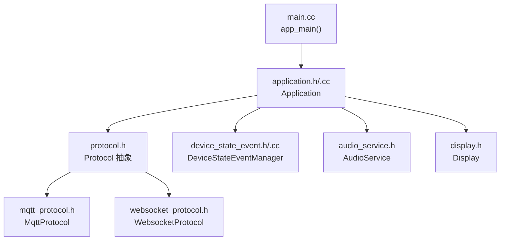
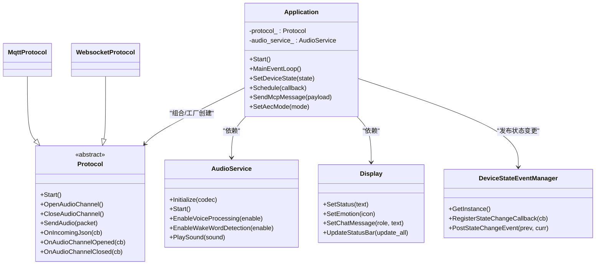
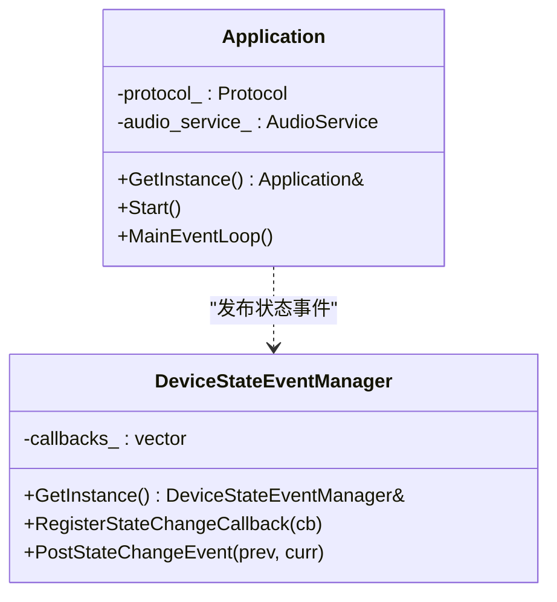
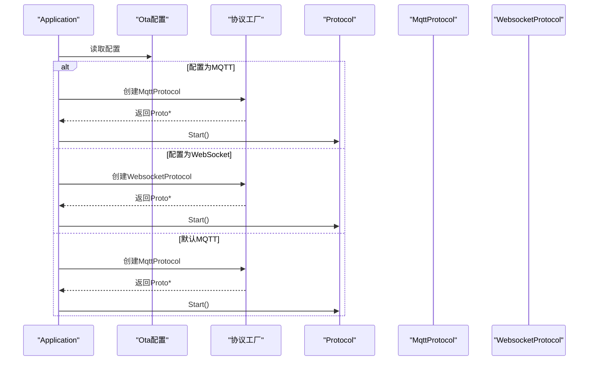
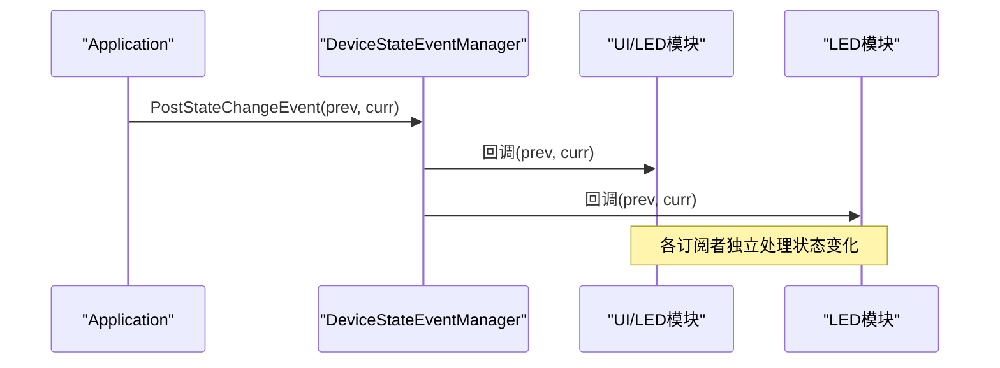
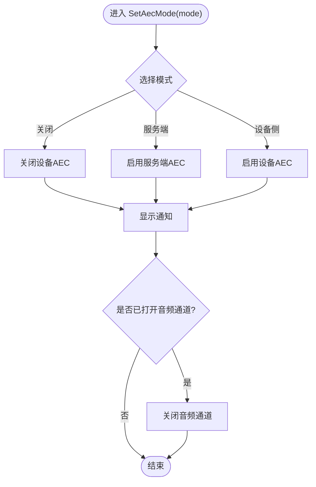
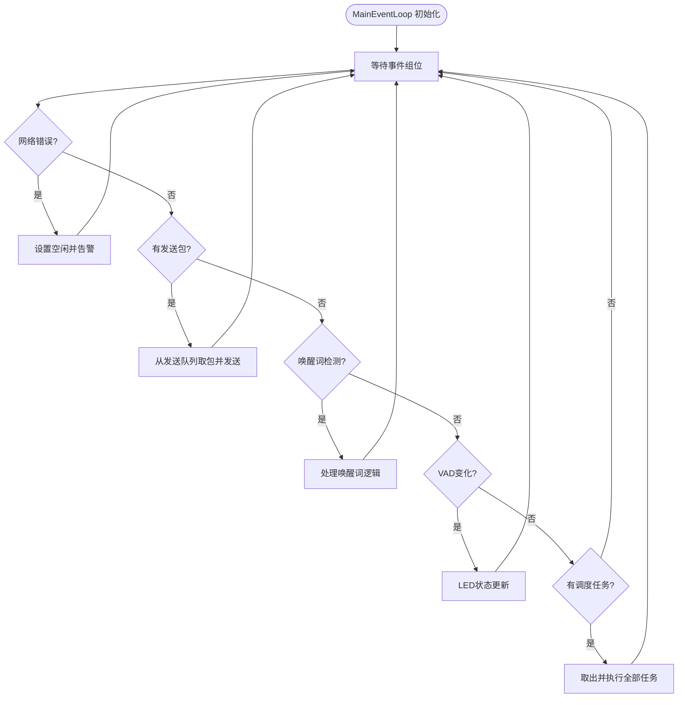
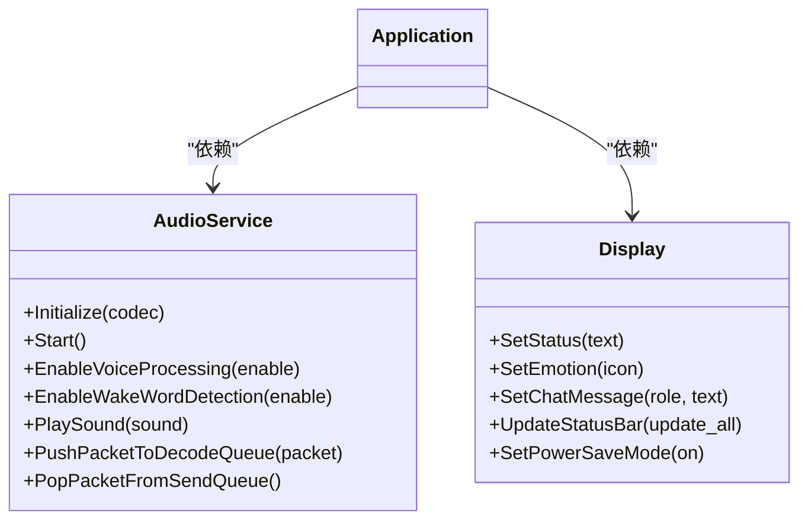
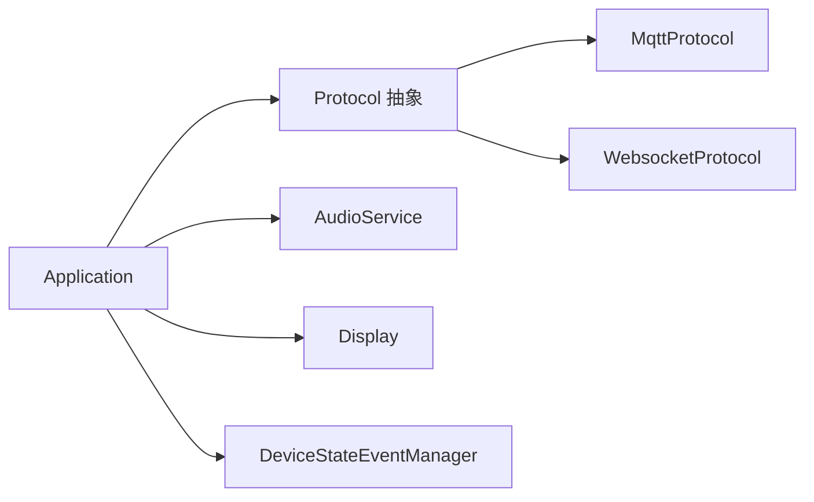

# 设计模式应用

<cite>
**本文引用的文件**
- [main.cc](file://main/main.cc)
- [application.h](file://main/application.h)
- [application.cc](file://main/application.cc)
- [protocol.h](file://main/protocols/protocol.h)
- [mqtt_protocol.h](file://main/protocols/mqtt_protocol.h)
- [websocket_protocol.h](file://main/protocols/websocket_protocol.h)
- [device_state_event.h](file://main/device_state_event.h)
- [device_state_event.cc](file://main/device_state_event.cc)
- [audio_service.h](file://main/audio/audio_service.h)
- [display.h](file://main/display/display.h)
</cite>

## 目录
1. [引言](#引言)
2. [项目结构](#项目结构)
3. [核心组件](#核心组件)
4. [架构总览](#架构总览)
5. [详细组件分析](#详细组件分析)
6. [依赖关系分析](#依赖关系分析)
7. [性能考量](#性能考量)
8. [故障排查指南](#故障排查指南)
9. [结论](#结论)
10. [附录：设计模式使用指南与最佳实践](#附录设计模式使用指南与最佳实践)

## 引言
本文件聚焦于小智ESP32智能语音助手项目中的设计模式应用，系统梳理并深入解析以下模式在代码中的落地与协同：
- 单例模式：Application类与DeviceStateEventManager的全局唯一实例化
- 工厂模式：基于OTA配置动态创建协议对象（MQTT或WebSocket）
- 观察者模式：设备状态事件的发布/订阅与回调分发
- 策略模式：运行时根据配置切换AEC模式与协议策略
- 调度与异步：主线程事件循环与跨线程任务调度

通过对这些模式的实现细节、协作关系与性能影响进行分析，帮助开发者理解系统架构、遵循最佳实践，并有效避免反模式。

## 项目结构
从入口到核心运行时的关键路径如下：
- 入口程序负责初始化环境并启动Application
- Application负责系统生命周期、事件循环、协议选择与状态机
- 协议层抽象出统一接口，具体实现通过工厂方法按配置创建
- 设备状态事件通过观察者模式广播给注册方
- 音频服务与显示模块作为子系统被Application协调

**图表来源**
- [main.cc](file://main/main.cc#L13-L31)
- [application.h](file://main/application.h#L32-L88)
- [protocol.h](file://main/protocols/protocol.h#L44-L95)
- [mqtt_protocol.h](file://main/protocols/mqtt_protocol.h#L24-L57)
- [websocket_protocol.h](file://main/protocols/websocket_protocol.h#L13-L32)
- [device_state_event.h](file://main/device_state_event.h#L21-L37)
- [audio_service.h](file://main/audio/audio_service.h#L81-L155)
- [display.h](file://main/display/display.h#L18-L66)

**章节来源**
- [main.cc](file://main/main.cc#L13-L31)

## 核心组件
- Application：系统主控制器，负责启动、事件循环、状态管理、协议选择与资源协调
- Protocol及其派生类：抽象协议接口与MQTT/WebSocket具体实现
- DeviceStateEventManager：设备状态事件的观察者中心
- AudioService：音频采集、编码、解码、播放与队列调度
- Display：显示抽象与主题、状态、通知管理

**章节来源**
- [application.h](file://main/application.h#L32-L88)
- [application.cc](file://main/application.cc#L328-L512)
- [protocol.h](file://main/protocols/protocol.h#L44-L95)
- [mqtt_protocol.h](file://main/protocols/mqtt_protocol.h#L24-L57)
- [websocket_protocol.h](file://main/protocols/websocket_protocol.h#L13-L32)
- [device_state_event.h](file://main/device_state_event.h#L21-L37)
- [device_state_event.cc](file://main/device_state_event.cc#L5-L46)
- [audio_service.h](file://main/audio/audio_service.h#L81-L155)
- [display.h](file://main/display/display.h#L18-L66)

## 架构总览
系统采用“主控制器 + 子系统 + 可插拔协议”的分层架构：
- 主控制器(Application)统一编排，通过事件组与条件变量驱动异步流程
- 协议层通过工厂方法按配置创建具体实现，屏蔽网络差异
- 观察者模式用于设备状态广播，便于UI、LED等模块响应
- 音频服务与显示模块以独立子系统存在，由Application协调其生命周期与资源占用

**图表来源**
- [application.h](file://main/application.h#L32-L88)
- [application.cc](file://main/application.cc#L362-L378)
- [protocol.h](file://main/protocols/protocol.h#L44-L95)
- [mqtt_protocol.h](file://main/protocols/mqtt_protocol.h#L24-L57)
- [websocket_protocol.h](file://main/protocols/websocket_protocol.h#L13-L32)
- [device_state_event.h](file://main/device_state_event.h#L21-L37)
- [audio_service.h](file://main/audio/audio_service.h#L81-L155)
- [display.h](file://main/display/display.h#L18-L66)

## 详细组件分析

### 单例模式：Application与DeviceStateEventManager
- Application：通过静态局部变量确保全局唯一实例，禁用拷贝构造与赋值，保证线程安全地访问全局状态与资源
- DeviceStateEventManager：同样采用静态局部变量实现单例，封装事件注册、发布与回调执行，内部使用ESP-IDF事件框架完成跨线程回调分发

**图表来源**
- [application.h](file://main/application.h#L34-L40)
- [application.cc](file://main/application.cc#L645-L646)
- [device_state_event.h](file://main/device_state_event.h#L21-L37)
- [device_state_event.cc](file://main/device_state_event.cc#L5-L21)

**章节来源**
- [application.h](file://main/application.h#L34-L40)
- [application.cc](file://main/application.cc#L645-L646)
- [device_state_event.h](file://main/device_state_event.h#L21-L37)
- [device_state_event.cc](file://main/device_state_event.cc#L5-L21)

### 工厂模式：协议创建
- Application在启动阶段读取OTA配置，依据是否存在MQTT或WebSocket配置决定创建MqttProtocol或WebsocketProtocol实例
- 该过程体现了“对扩展开放、对修改关闭”的开闭原则，新增协议仅需实现Protocol接口并在此处接入

**图表来源**
- [application.cc](file://main/application.cc#L362-L378)
- [protocol.h](file://main/protocols/protocol.h#L44-L95)
- [mqtt_protocol.h](file://main/protocols/mqtt_protocol.h#L24-L57)
- [websocket_protocol.h](file://main/protocols/websocket_protocol.h#L13-L32)

**章节来源**
- [application.cc](file://main/application.cc#L362-L378)

### 观察者模式：设备状态事件
- 发布端：Application在状态切换时调用DeviceStateEventManager::PostStateChangeEvent，携带前一状态与当前状态
- 订阅端：各模块可调用RegisterStateChangeCallback注册回调；事件框架在回调中遍历所有已注册回调并逐一调用
- 该模式使UI、LED、日志等模块无需耦合到Application内部状态机，降低模块间耦合

**图表来源**
- [application.cc](file://main/application.cc#L645-L646)
- [device_state_event.cc](file://main/device_state_event.cc#L15-L21)
- [device_state_event.cc](file://main/device_state_event.cc#L34-L41)

**章节来源**
- [application.cc](file://main/application.cc#L645-L646)
- [device_state_event.h](file://main/device_state_event.h#L21-L37)
- [device_state_event.cc](file://main/device_state_event.cc#L15-L21)
- [device_state_event.cc](file://main/device_state_event.cc#L34-L41)

### 策略模式：协议选择与AEC策略
- 协议策略：Application根据OTA配置在MQTT与WebSocket之间动态选择，体现运行时策略切换
- AEC策略：Application维护AEC模式枚举，支持关闭、设备侧、服务端三种模式，通过SetAecMode统一切换，并在必要时关闭音频通道以生效

**图表来源**
- [application.cc](file://main/application.cc#L747-L772)

**章节来源**
- [application.cc](file://main/application.cc#L747-L772)

### 异步与事件循环：主线程调度
- Application通过事件组与条件变量驱动多个异步源（音频发送可用、唤醒词检测、VAD变化、网络错误、调度队列）的事件循环
- 外部模块可通过Schedule提交任务，Application在事件循环中取出并串行执行，保证对共享资源（如协议通道、显示）的安全访问

**图表来源**
- [application.cc](file://main/application.cc#L540-L583)
- [application.cc](file://main/application.cc#L528-L535)

**章节来源**
- [application.cc](file://main/application.cc#L540-L583)
- [application.cc](file://main/application.cc#L528-L535)

### 音频服务与显示：子系统协作
- AudioService负责音频输入/输出、编码/解码、队列与定时器，提供回调接口供Application感知发送可用、唤醒词检测、VAD变化等事件
- Display抽象了状态、表情、聊天消息、通知与状态栏的更新，配合电源节省模式与主题切换

**图表来源**
- [audio_service.h](file://main/audio/audio_service.h#L81-L155)
- [display.h](file://main/display/display.h#L18-L66)
- [application.cc](file://main/application.cc#L335-L350)
- [application.cc](file://main/application.cc#L380-L407)

**章节来源**
- [audio_service.h](file://main/audio/audio_service.h#L81-L155)
- [display.h](file://main/display/display.h#L18-L66)
- [application.cc](file://main/application.cc#L335-L350)
- [application.cc](file://main/application.cc#L380-L407)

## 依赖关系分析
- 组件内聚与耦合
  - Application高内聚地管理状态机与事件循环，通过组合持有Protocol、AudioService、Display等子系统
  - 协议层通过Protocol抽象隔离具体实现，符合依赖倒置原则
  - 设备状态事件通过观察者模式解耦发布与订阅方
- 外部依赖
  - ESP-IDF事件框架、FreeRTOS事件组与定时器、LVGL显示框架、cJSON序列化库
- 潜在环依赖
  - 未发现直接环依赖；Application与DeviceStateEventManager通过回调间接交互，不构成编译期环

**图表来源**
- [application.h](file://main/application.h#L69-L76)
- [protocol.h](file://main/protocols/protocol.h#L44-L95)
- [mqtt_protocol.h](file://main/protocols/mqtt_protocol.h#L24-L57)
- [websocket_protocol.h](file://main/protocols/websocket_protocol.h#L13-L32)
- [device_state_event.h](file://main/device_state_event.h#L21-L37)

**章节来源**
- [application.h](file://main/application.h#L69-L76)
- [protocol.h](file://main/protocols/protocol.h#L44-L95)

## 性能考量
- 事件驱动与优先级
  - Application提升自身优先级以避免后台任务抢占，确保事件循环及时响应
- 队列容量与背压
  - 音频解码/发送队列容量与帧长相关，合理设置可减少阻塞与抖动
- 资源占用控制
  - 在空闲态启用显示与音频的省电模式，结合CanEnterSleepMode判断睡眠时机
- 网络与协议
  - MQTT与WebSocket在连接建立、心跳与重连策略上有所差异，应根据部署场景选择合适协议

[本节为通用指导，不直接分析具体文件]

## 故障排查指南
- 状态异常与告警
  - Application在网络错误时设置空闲并弹出告警，检查最近一次错误信息并确认协议回调链路
- 唤醒词与VAD
  - 若唤醒词触发但未进入监听态，检查唤醒词检测回调与事件循环中唤醒词分支逻辑
- 音频通道
  - 打开/关闭音频通道失败时，确认采样率匹配与设备AEC配置一致性
- 事件回调未触发
  - 确认DeviceStateEventManager的回调注册与事件发布是否在同一事件循环上下文中

**章节来源**
- [application.cc](file://main/application.cc#L384-L387)
- [application.cc](file://main/application.cc#L550-L553)
- [application.cc](file://main/application.cc#L563-L565)
- [device_state_event.cc](file://main/device_state_event.cc#L15-L21)

## 结论
本项目通过单例、工厂、观察者与策略等设计模式，构建了清晰、可扩展且易于维护的嵌入式语音助手架构。Application作为主控制器，借助事件驱动与异步调度，将协议、音频与显示等子系统有机整合；DeviceStateEventManager以观察者模式解耦状态变更传播；工厂与策略模式则让协议与AEC策略在运行时灵活切换。遵循本文的最佳实践与反模式规避建议，有助于进一步增强系统的稳定性与可演进性。

[本节为总结，不直接分析具体文件]

## 附录：设计模式使用指南与最佳实践
- 单例模式
  - 使用静态局部变量实现线程安全的惰性初始化
  - 明确禁止拷贝构造与赋值，避免多实例产生
  - 将单例作为“全局上下文”而非“上帝对象”，避免过度集中职责
- 工厂模式
  - 将“创建对象”的职责集中在一处，便于扩展新协议或硬件平台
  - 对外暴露统一接口，内部通过配置或运行时条件选择具体实现
- 观察者模式
  - 严格区分发布与订阅，避免回调中做重工作导致事件循环阻塞
  - 使用轻量数据结构传递事件载荷，必要时采用浅拷贝或移动语义
- 策略模式
  - 将可变因素（协议类型、AEC模式）抽象为策略接口，运行时切换
  - 在切换策略时，确保清理或重建相关资源（如关闭音频通道）
- 异步与调度
  - 使用事件组与条件变量协调多源异步事件，避免忙等
  - 将耗时操作放入专用任务或队列，主线程保持低延迟
- 反模式识别与规避
  - 避免在回调中直接阻塞或长时间计算，改用队列或任务投递
  - 避免在多个位置重复创建单例或共享资源，统一由Application管理
  - 避免在状态机中直接耦合UI/LED逻辑，通过观察者或回调解耦

[本节为通用指导，不直接分析具体文件]