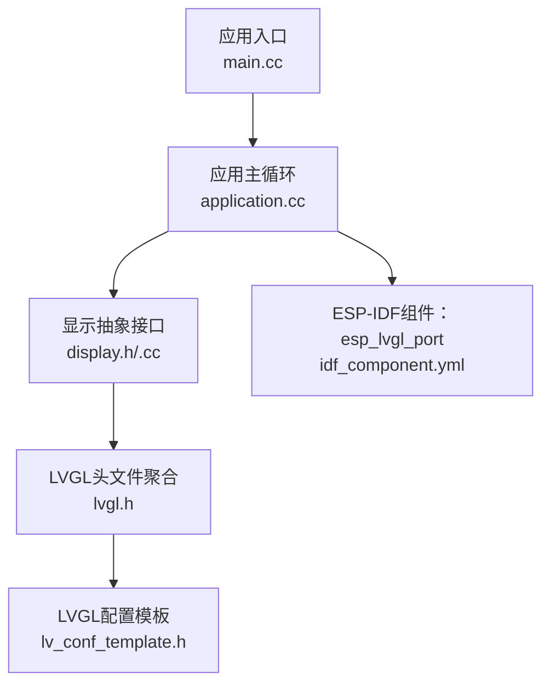
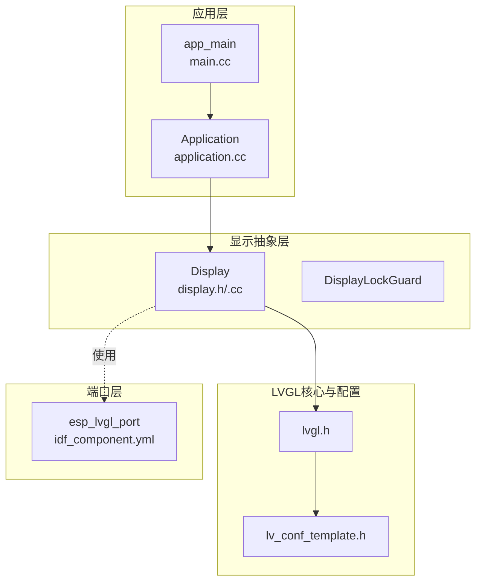
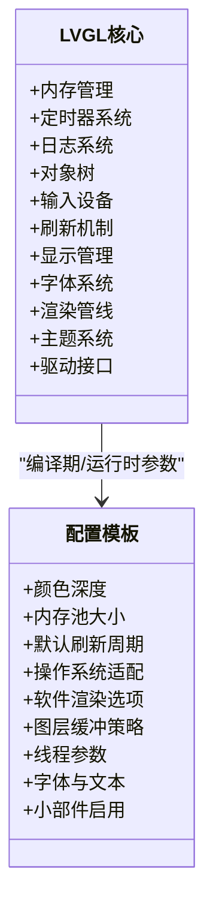
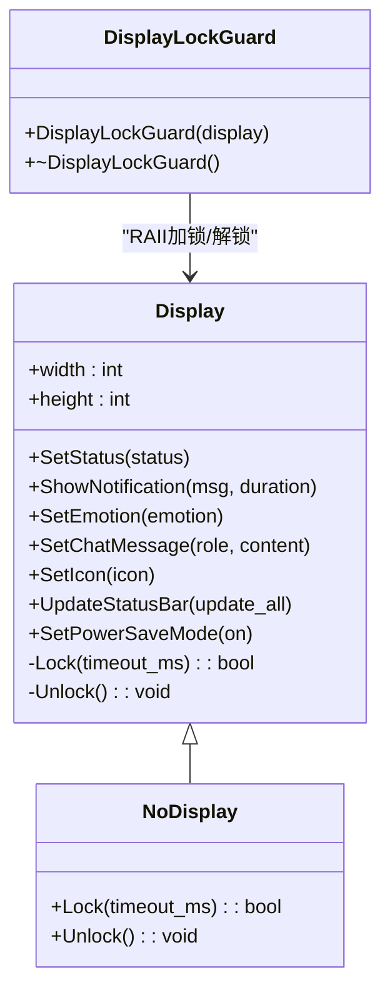
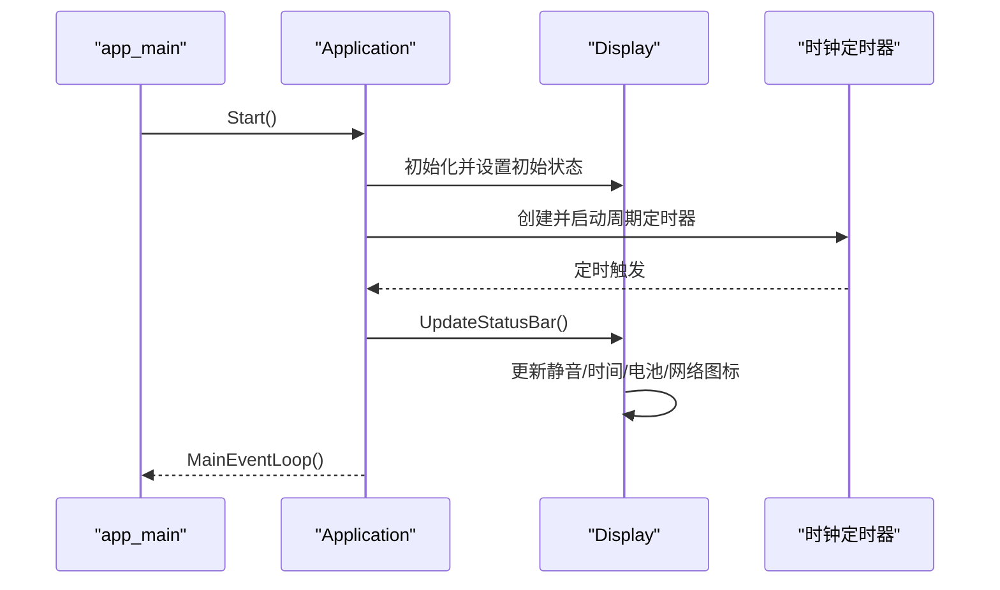
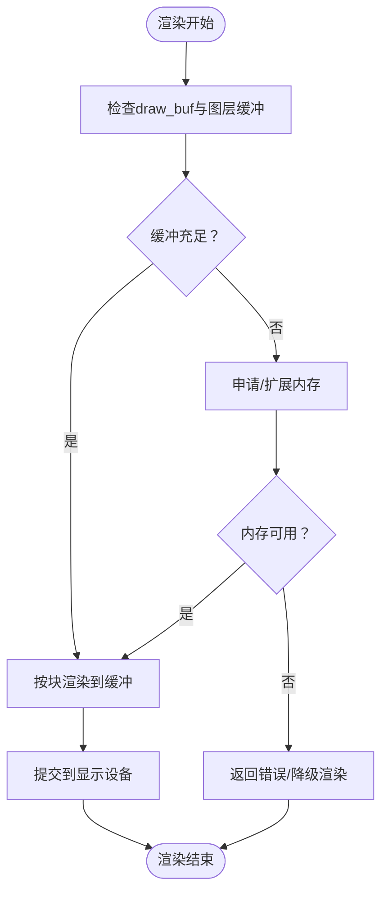
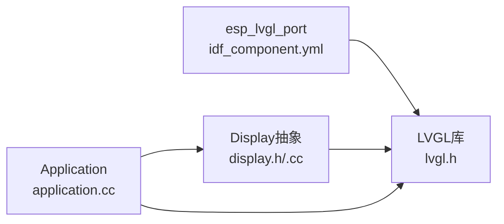

# LVGL图形界面集成

<cite>
**本文档引用的文件**
- [lvgl.h](file://managed_components/lvgl__lvgl/lvgl.h)
- [lv_conf_template.h](file://managed_components/lvgl__lvgl/lv_conf_template.h)
- [idf_component.yml](file://managed_components/espressif__esp_lvgl_port/idf_component.yml)
- [display.h](file://main/display/display.h)
- [display.cc](file://main/display/display.cc)
- [application.cc](file://main/application.cc)
- [main.cc](file://main/main.cc)
</cite>

## 目录
1. [简介](#简介)
2. [项目结构](#项目结构)
3. [核心组件](#核心组件)
4. [架构总览](#架构总览)
5. [详细组件分析](#详细组件分析)
6. [依赖关系分析](#依赖关系分析)
7. [性能考虑](#性能考虑)
8. [故障排除指南](#故障排除指南)
9. [结论](#结论)
10. [附录](#附录)

## 简介
本文件面向在ESP-IDF环境中集成LVGL图形界面的开发者，系统性阐述LVGL与ESP-IDF的集成方式、配置方法、端口层实现原理与适配机制；深入分析LVGL的内存管理策略、渲染管线、输入处理等核心功能；说明LVGL的事件系统、对象模型、动画框架等高级特性；介绍性能优化技术（渲染优化、内存池管理、帧率控制）；提供LVGL组件自定义开发指南与最佳实践；并给出调试工具使用方法与常见问题解决方案。本文所有技术要点均基于仓库中实际代码文件进行分析与总结。

## 项目结构
该项目采用ESP-IDF工程组织方式，主程序入口位于main目录，图形界面相关代码集中在display模块中，并通过LVGL库与ESP-IDF组件生态协同工作。LVGL库以组件形式引入，端口层由ESP-IDF官方提供的esp_lvgl_port组件负责，负责将LVGL与硬件显示驱动、输入设备、文件系统等对接。

**图表来源**
- [main.cc](file://main/main.cc#L13-L31)
- [application.cc](file://main/application.cc#L328-L512)
- [display.h](file://main/display/display.h#L1-L93)
- [display.cc](file://main/display/display.cc#L1-L241)
- [lvgl.h](file://managed_components/lvgl__lvgl/lvgl.h#L1-L207)
- [lv_conf_template.h](file://managed_components/lvgl__lvgl/lv_conf_template.h#L1-L800)
- [idf_component.yml](file://managed_components/espressif__esp_lvgl_port/idf_component.yml#L1-L13)

**章节来源**
- [main.cc](file://main/main.cc#L13-L31)
- [application.cc](file://main/application.cc#L328-L512)
- [display.h](file://main/display/display.h#L1-L93)
- [display.cc](file://main/display/display.cc#L1-L241)
- [lvgl.h](file://managed_components/lvgl__lvgl/lvgl.h#L1-L207)
- [lv_conf_template.h](file://managed_components/lvgl__lvgl/lv_conf_template.h#L1-L800)
- [idf_component.yml](file://managed_components/espressif__esp_lvgl_port/idf_component.yml#L1-L13)

## 核心组件
- LVGL核心库：通过lvgl.h统一包含LVGL子系统头文件，涵盖内存、定时器、日志、对象树、输入设备、刷新、显示、字体、渲染、主题、驱动等模块。
- LVGL配置模板：提供颜色深度、内存分配、操作系统适配、渲染配置、字体与文本设置、小部件启用等大量可调参数。
- 显示抽象类：Display类封装了屏幕尺寸、状态栏、通知、表情、聊天消息、电源管理锁等通用UI能力，并通过友元关系与DisplayLockGuard配合实现线程安全的绘制。
- 应用主循环：Application类负责启动音频服务、网络、协议栈，调度事件组，处理状态机切换，并通过Display接口更新UI。
- 端口层组件：esp_lvgl_port作为ESP-IDF平台的LVGL端口层，负责与硬件显示、触摸、文件系统等对接（具体实现由该组件提供）。

**章节来源**
- [lvgl.h](file://managed_components/lvgl__lvgl/lvgl.h#L21-L136)
- [lv_conf_template.h](file://managed_components/lvgl__lvgl/lv_conf_template.h#L29-L122)
- [display.h](file://main/display/display.h#L18-L93)
- [display.cc](file://main/display/display.cc#L17-L195)
- [application.cc](file://main/application.cc#L328-L512)
- [idf_component.yml](file://managed_components/espressif__esp_lvgl_port/idf_component.yml#L1-L13)

## 架构总览
LVGL在ESP-IDF中的集成遵循“应用层-显示抽象层-LVGL核心-LVGL配置-端口层”的分层设计。应用层通过Application协调各子系统，Display抽象层封装LVGL对象与状态更新，LVGL核心提供对象模型与渲染能力，配置模板决定运行时行为，端口层负责与硬件交互。

**图表来源**
- [main.cc](file://main/main.cc#L13-L31)
- [application.cc](file://main/application.cc#L328-L512)
- [display.h](file://main/display/display.h#L18-L93)
- [display.cc](file://main/display/display.cc#L17-L195)
- [lvgl.h](file://managed_components/lvgl__lvgl/lvgl.h#L1-L207)
- [lv_conf_template.h](file://managed_components/lvgl__lvgl/lv_conf_template.h#L1-L800)
- [idf_component.yml](file://managed_components/espressif__esp_lvgl_port/idf_component.yml#L1-L13)

## 详细组件分析

### LVGL核心与配置分析
- 头文件聚合：lvgl.h集中包含LVGL子系统头文件，便于应用侧统一引用，减少分散依赖。
- 配置模板：提供丰富的编译期开关与运行时参数，如颜色深度、内存大小、默认刷新周期、操作系统适配、软件渲染支持、图层缓冲策略、线程优先级与栈大小等。这些参数直接影响内存占用、渲染性能与功能完备性。

**图表来源**
- [lvgl.h](file://managed_components/lvgl__lvgl/lvgl.h#L21-L136)
- [lv_conf_template.h](file://managed_components/lvgl__lvgl/lv_conf_template.h#L29-L122)

**章节来源**
- [lvgl.h](file://managed_components/lvgl__lvgl/lvgl.h#L21-L136)
- [lv_conf_template.h](file://managed_components/lvgl__lvgl/lv_conf_template.h#L29-L122)

### 显示抽象层与端口层适配
- Display类：封装屏幕宽高、状态栏控件（网络、静音、电池、表情、通知、聊天消息）、通知定时器、电源管理锁等；提供虚函数接口供具体板卡实现，确保跨硬件的一致性。
- DisplayLockGuard：通过RAII在绘制期间自动加锁/解锁，避免并发更新导致的竞态条件。
- 端口层：esp_lvgl_port组件提供与ESP-IDF生态的对接（显示、输入、文件系统），具体API与实现由该组件提供，本仓库通过idf_component.yml声明依赖。

**图表来源**
- [display.h](file://main/display/display.h#L18-L93)
- [display.cc](file://main/display/display.cc#L17-L195)

**章节来源**
- [display.h](file://main/display/display.h#L18-L93)
- [display.cc](file://main/display/display.cc#L17-L195)
- [idf_component.yml](file://managed_components/espressif__esp_lvgl_port/idf_component.yml#L1-L13)

### 应用主循环与UI更新流程
- 启动阶段：初始化事件循环、NVS、音频服务与网络，创建时钟定时器，等待网络就绪后检查版本与协议配置，最终进入空闲状态。
- UI更新：通过Display接口设置状态、表情、聊天消息、通知等；状态栏定时更新（静音图标、时间、电池、网络状态）。
- 事件调度：使用FreeRTOS事件组与回调队列，保证UI更新与业务逻辑解耦，避免阻塞渲染线程。

**图表来源**
- [main.cc](file://main/main.cc#L13-L31)
- [application.cc](file://main/application.cc#L328-L512)
- [display.cc](file://main/display/display.cc#L93-L195)

**章节来源**
- [main.cc](file://main/main.cc#L13-L31)
- [application.cc](file://main/application.cc#L328-L512)
- [display.cc](file://main/display/display.cc#L93-L195)

### 渲染管线与内存管理策略
- 渲染管线：LVGL通过draw_buf与draw_unit进行分块渲染，支持软件渲染与多线程渲染（需操作系统支持）。可通过配置项调整图层缓冲大小、最大内存限制、线程栈与优先级等。
- 内存管理：内置malloc包装与内存池配置，支持静态内存池或动态分配；可通过配置调整内存池大小与扩展策略，以满足不同分辨率与复杂度场景。

**图表来源**
- [lv_conf_template.h](file://managed_components/lvgl__lvgl/lv_conf_template.h#L145-L166)

**章节来源**
- [lv_conf_template.h](file://managed_components/lvgl__lvgl/lv_conf_template.h#L145-L166)

### 输入处理与事件系统
- 输入设备：LVGL通过indev子系统统一管理输入设备（按键、触摸、鼠标等），支持手势识别与事件派发。
- 事件系统：LVGL对象模型支持事件回调注册与派发，结合应用层事件组实现UI与业务逻辑的解耦。

**章节来源**
- [lvgl.h](file://managed_components/lvgl__lvgl/lvgl.h#L43-L48)

### 动画框架与对象模型
- 对象模型：LVGL以对象树为核心，每个对象可拥有样式、属性、事件回调与动画目标。
- 动画框架：支持属性级动画与时间线，可与渲染管线协同工作，实现平滑过渡效果。

**章节来源**
- [lvgl.h](file://managed_components/lvgl__lvgl/lvgl.h#L43-L86)

## 依赖关系分析
- 组件依赖：esp_lvgl_port声明依赖LVGL库版本范围，并指定ESP-IDF版本要求。
- 运行时依赖：Display类依赖LVGL对象类型与标签控件；应用层依赖Display接口与事件组；端口层为显示与输入提供底层适配。

**图表来源**
- [idf_component.yml](file://managed_components/espressif__esp_lvgl_port/idf_component.yml#L1-L13)
- [lvgl.h](file://managed_components/lvgl__lvgl/lvgl.h#L1-L207)
- [display.h](file://main/display/display.h#L1-L93)
- [application.cc](file://main/application.cc#L328-L512)

**章节来源**
- [idf_component.yml](file://managed_components/espressif__esp_lvgl_port/idf_component.yml#L1-L13)
- [lvgl.h](file://managed_components/lvgl__lvgl/lvgl.h#L1-L207)
- [display.h](file://main/display/display.h#L1-L93)
- [application.cc](file://main/application.cc#L328-L512)

## 性能考虑
- 帧率控制：通过默认刷新周期参数控制渲染频率，结合DisplayLockGuard与电源管理锁避免频繁唤醒导致的抖动。
- 渲染优化：合理设置图层缓冲大小与最大内存限制，启用必要的渲染加速（如软件渲染复杂度开关），并根据目标平台调整线程栈与优先级。
- 内存池管理：根据屏幕分辨率与小部件复杂度调整内存池大小与扩展策略，避免碎片化与频繁分配。
- 事件调度：使用事件组与回调队列降低UI更新对主线程的影响，确保渲染流畅。

**章节来源**
- [lv_conf_template.h](file://managed_components/lvgl__lvgl/lv_conf_template.h#L90-L122)
- [display.cc](file://main/display/display.cc#L132-L195)

## 故障排除指南
- 显示异常或闪烁：检查默认刷新周期与图层缓冲配置，确认渲染线程栈与优先级设置是否合理。
- 内存不足：调整内存池大小与扩展策略，或减少复杂度（如关闭部分渲染特性或减少图层数量）。
- UI更新冲突：确保使用DisplayLockGuard保护UI更新路径，避免多任务并发写入。
- 端口层问题：核对esp_lvgl_port组件版本与LVGL版本兼容性，确认显示与输入设备初始化顺序正确。

**章节来源**
- [lv_conf_template.h](file://managed_components/lvgl__lvgl/lv_conf_template.h#L70-L122)
- [display.cc](file://main/display/display.cc#L17-L195)
- [idf_component.yml](file://managed_components/espressif__esp_lvgl_port/idf_component.yml#L1-L13)

## 结论
本项目通过清晰的分层设计实现了LVGL在ESP-IDF环境中的稳定集成：应用层负责业务逻辑与事件调度，显示抽象层屏蔽硬件差异，LVGL核心提供强大的对象模型与渲染能力，配置模板提供灵活的参数化控制，端口层完成与硬件的对接。遵循本文档的配置建议、性能优化策略与最佳实践，可在资源受限的嵌入式平台上获得流畅且可维护的图形界面体验。

## 附录
- 自定义开发建议：新增UI组件时，优先复用现有样式与主题；使用事件回调而非轮询；合理拆分渲染任务，避免单帧过载。
- 调试工具：结合LVGL日志宏与断言配置定位问题；利用渲染调试覆盖层快速定位重绘区域；通过事件跟踪与计时器统计评估性能瓶颈。