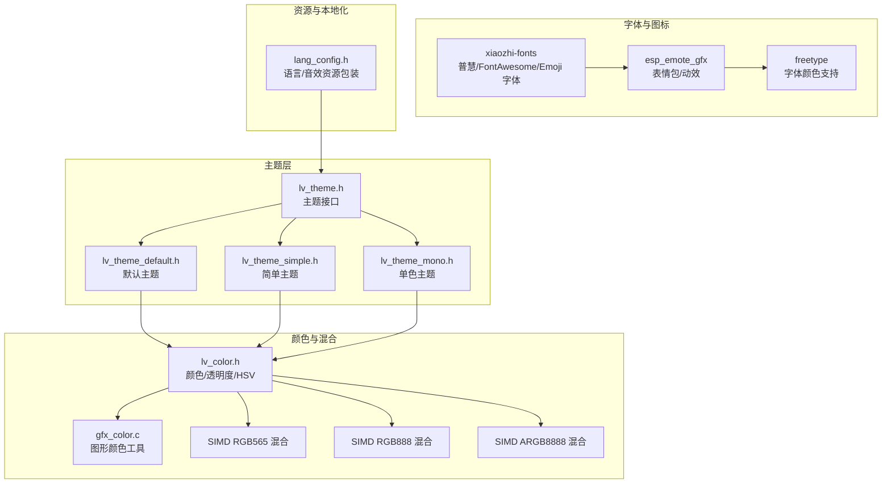
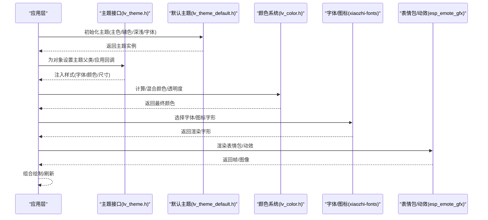
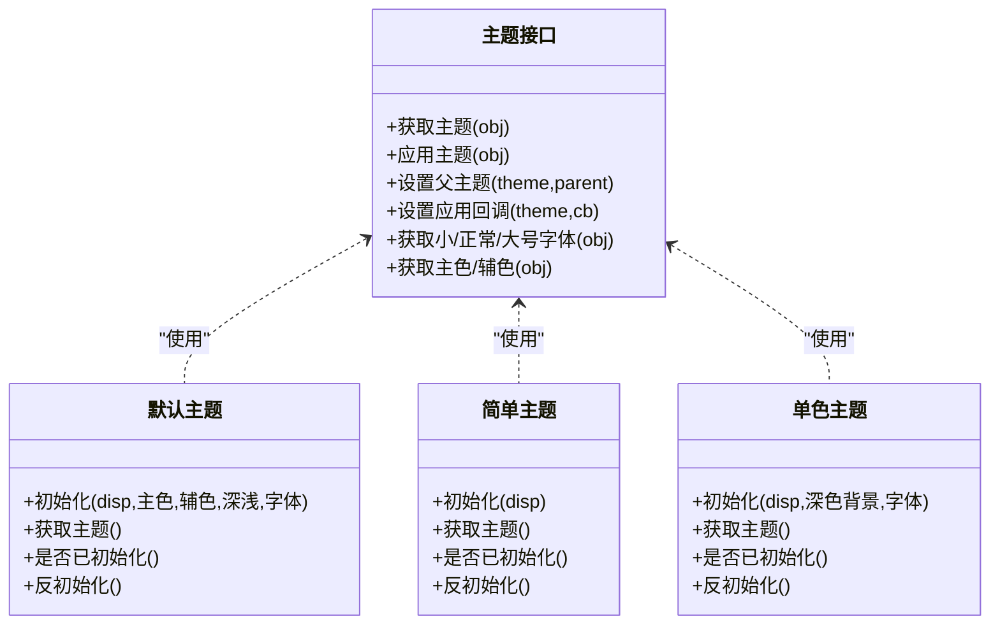
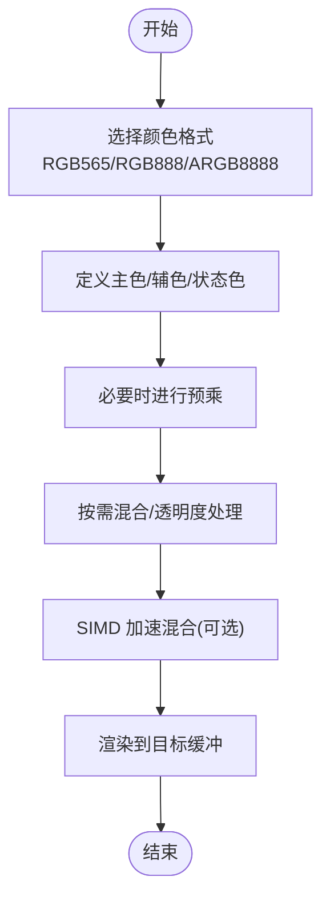
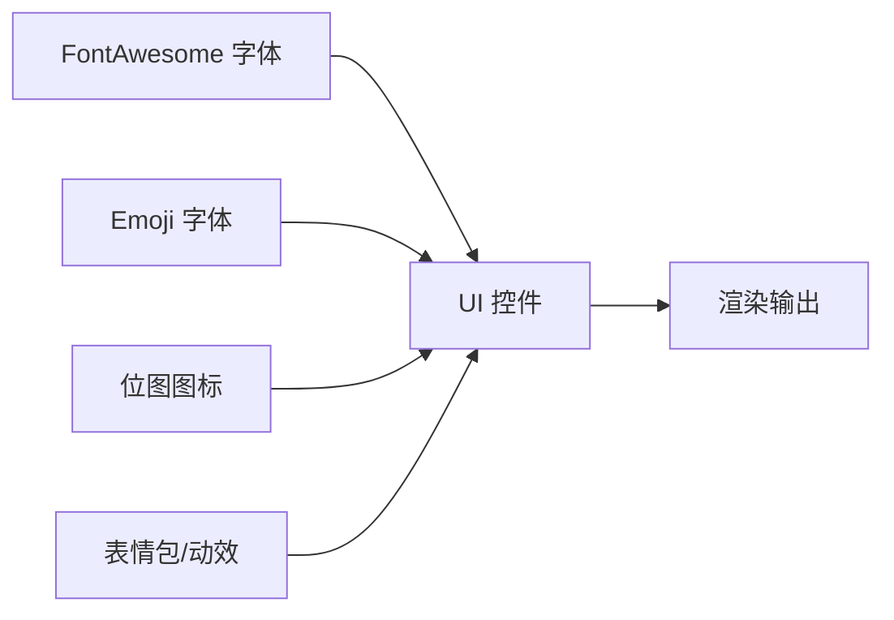
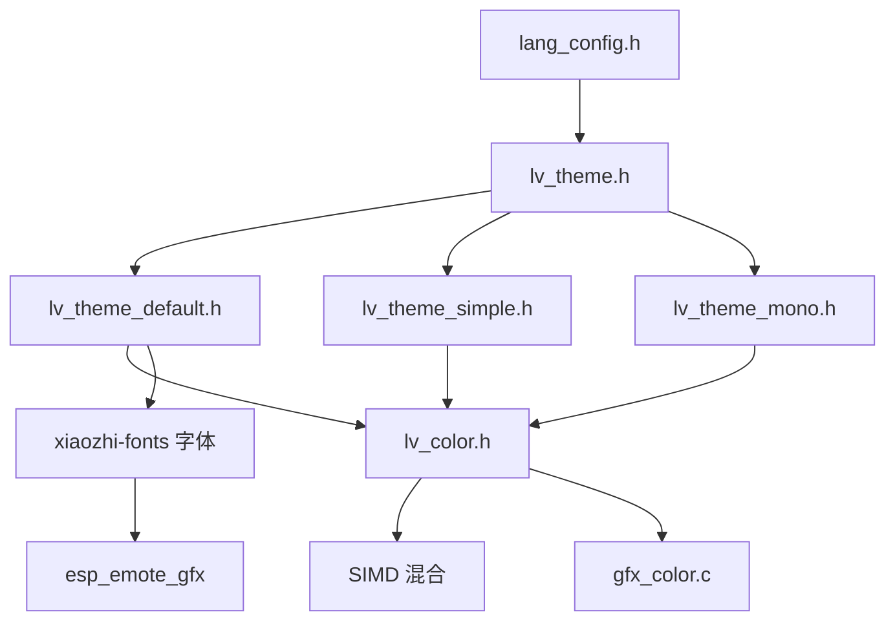

# 主题系统

<cite>
**本文引用的文件**
- [main/assets/lang_config.h](file://main/assets/lang_config.h)
- [managed_components/lvgl__lvgl/src/themes/lv_theme.h](file://managed_components/lvgl__lvgl/src/themes/lv_theme.h)
- [managed_components/lvgl__lvgl/src/themes/default/lv_theme_default.h](file://managed_components/lvgl__lvgl/src/themes/default/lv_theme_default.h)
- [managed_components/lvgl__lvgl/src/themes/simple/lv_theme_simple.h](file://managed_components/lvgl__lvgl/src/themes/simple/lv_theme_simple.h)
- [managed_components/lvgl__lvgl/src/themes/mono/lv_theme_mono.h](file://managed_components/lvgl__lvgl/src/themes/mono/lv_theme_mono.h)
- [managed_components/lvgl__lvgl/src/misc/lv_color.h](file://managed_components/lvgl__lvgl/src/misc/lv_color.h)
- [managed_components/78__xiaozhi-fonts/src/font_puhui_14_1.c](file://managed_components/78__xiaozhi-fonts/src/font_puhui_14_1.c)
- [managed_components/78__xiaozhi-fonts/src/font_puhui_16_4.c](file://managed_components/78__xiaozhi-fonts/src/font_puhui_16_4.c)
- [managed_components/78__xiaozhi-fonts/src/font_puhui_20_4.c](file://managed_components/78__xiaozhi-fonts/src/font_puhui_20_4.c)
- [managed_components/78__xiaozhi-fonts/src/font_puhui_30_4.c](file://managed_components/78__xiaozhi-fonts/src/font_puhui_30_4.c)
- [managed_components/78__xiaozhi-fonts/src/font_puhui_basic_14_1.c](file://managed_components/78__xiaozhi-fonts/src/font_puhui_basic_14_1.c)
- [managed_components/78__xiaozhi-fonts/src/font_puhui_basic_16_4.c](file://managed_components/78__xiaozhi-fonts/src/font_puhui_basic_16_4.c)
- [managed_components/78__xiaozhi-fonts/src/font_puhui_basic_20_4.c](file://managed_components/78__xiaozhi-fonts/src/font_puhui_basic_20_4.c)
- [managed_components/78__xiaozhi-fonts/src/font_puhui_basic_30_4.c](file://managed_components/78__xiaozhi-fonts/src/font_puhui_basic_30_4.c)
- [managed_components/78__xiaozhi-fonts/src/font_awesome_14_1.c](file://managed_components/78__xiaozhi-fonts/src/font_awesome_14_1.c)
- [managed_components/78__xiaozhi-fonts/src/font_awesome_16_4.c](file://managed_components/78__xiaozhi-fonts/src/font_awesome_16_4.c)
- [managed_components/78__xiaozhi-fonts/src/font_awesome_20_4.c](file://managed_components/78__xiaozhi-fonts/src/font_awesome_20_4.c)
- [managed_components/78__xiaozhi-fonts/src/font_awesome_30_1.c](file://managed_components/78__xiaozhi-fonts/src/font_awesome_30_1.c)
- [managed_components/78__xiaozhi-fonts/src/font_awesome_30_4.c](file://managed_components/78__xiaozhi-fonts/src/font_awesome_30_4.c)
- [managed_components/78__xiaozhi-fonts/src/font_emoji_32.c](file://managed_components/78__xiaozhi-fonts/src/font_emoji_32.c)
- [managed_components/78__xiaozhi-fonts/src/font_emoji_64.c](file://managed_components/78__xiaozhi-fonts/src/font_emoji_64.c)
- [managed_components/espressif2022__esp_emote_gfx/src/core/gfx_color.c](file://managed_components/espressif2022__esp_emote_gfx/src/core/gfx_color.c)
- [managed_components/espressif__esp_lvgl_port/src/lvgl9/simd/lv_color_blend_to_rgb565_esp30404.c](file://managed_components/espressif__esp_lvgl_port/src/lvgl9/simd/lv_color_blend_to_rgb565_esp32s3.S)
- [managed_components/espressif__esp_lvgl_port/src/lvgl9/simd/lv_color_blend_to_rgb888_esp32s3.S](file://managed_components/espressif__esp_lvgl_port/src/lvgl9/simd/lv_color_blend_to_rgb888_esp32s3.S)
- [managed_components/espressif__esp_lvgl_port/src/lvgl9/simd/lv_color_blend_to_argb8888_esp32s3.S](file://managed_components/espressif__esp_lvgl_port/src/lvgl9/simd/lv_color_blend_to_argb8888_esp32s3.S)
- [managed_components/espressif__esp_emote_gfx/include/esp_emote_gfx.h](file://managed_components/espressif2022__esp_emote_gfx/include/esp_emote_gfx.h)
- [managed_components/espressif__esp_emote_gfx/src/widget/gfx_font_ft.c](file://managed_components/espressif2022__esp_emote_gfx/src/widget/gfx_font_ft.c)
- [managed_components/espressif__esp_emote_gfx/src/widget/gfx_font_lv.c](file://managed_components/espressif2022__esp_emote_gfx/src/widget/gfx_font_lv.c)
- [managed_components/espressif__freetype/freetype/include/freetype/ftcolor.h](file://managed_components/espressif__freetype/freetype/include/freetype/ftcolor.h)
- [managed_components/espressif__freetype/freetype/src/base/ftcolor.c](file://managed_components/espressif__freetype/freetype/src/base/ftcolor.c)
- [managed_components/lvgl__lvgl/docs/src/details/main-modules/color.rst](file://managed_components/lvgl__lvgl/docs/src/details/main-modules/color.rst)
- [managed_components/lvgl__lvgl/docs/src/details/main-modules/display/color_format.rst](file://managed_components/lvgl__lvgl/docs/src/details/main-modules/display/color_format.rst)
</cite>

## 目录
1. [引言](#引言)
2. [项目结构](#项目结构)
3. [核心组件](#核心组件)
4. [架构总览](#架构总览)
5. [详细组件分析](#详细组件分析)
6. [依赖关系分析](#依赖关系分析)
7. [性能考量](#性能考量)
8. [故障排查指南](#故障排查指南)
9. [结论](#结论)
10. [附录](#附录)

## 引言
本文件面向“主题系统”的技术文档，聚焦于以下目标：
- 主题架构与实现原理：主题接口、主题链式继承、动态应用机制
- 主题配置：主色调、辅色调、状态色的来源与使用规范
- 图标资源：SVG 矢量图标、位图图标、动态图标在系统中的组织与管理
- 动画效果：过渡动画、状态动画、交互反馈的配置与实现思路
- 主题定制：CSS 样式编写、资源文件管理、性能优化要点
- 兼容性与向后兼容：跨显示驱动、颜色格式、字体与图标库的兼容策略

本主题系统以 LVGL 为主题框架，结合自研字体与表情包/动效组件，形成可扩展、可配置的嵌入式 UI 主题体系。

## 项目结构
主题系统涉及的关键模块与文件分布如下：
- 主题接口与默认/简单/单色主题：位于 LVGL 主题头文件与各主题头文件中
- 颜色模型与混合：LVGL 颜色类型、透明度、HSV 转换、预乘与混合
- 字体与图标：自研字体组件与 FontAwesome/Emoji 字体资源
- 表情包/动效：表情包图形与字体渲染组件
- 语言与音效：语言字符串与音效资源的 C++ 包装

图表来源
- [managed_components/lvgl__lvgl/src/themes/lv_theme.h](file://managed_components/lvgl__lvgl/src/themes/lv_theme.h#L1-L109)
- [managed_components/lvgl__lvgl/src/themes/default/lv_theme_default.h](file://managed_components/lvgl__lvgl/src/themes/default/lv_theme_default.h#L1-L72)
- [managed_components/lvgl__lvgl/src/themes/simple/lv_theme_simple.h](file://managed_components/lvgl__lvgl/src/themes/simple/lv_theme_simple.h#L1-L68)
- [managed_components/lvgl__lvgl/src/themes/mono/lv_theme_mono.h](file://managed_components/lvgl__lvgl/src/themes/mono/lv_theme_mono.h#L1-L69)
- [managed_components/lvgl__lvgl/src/misc/lv_color.h](file://managed_components/lvgl__lvgl/src/misc/lv_color.h#L1-L468)
- [managed_components/espressif2022__esp_emote_gfx/src/core/gfx_color.c](file://managed_components/espressif2022__esp_emote_gfx/src/core/gfx_color.c)
- [managed_components/78__xiaozhi-fonts/src/font_puhui_14_1.c](file://managed_components/78__xiaozhi-fonts/src/font_puhui_14_1.c)
- [managed_components/78__xiaozhi-fonts/src/font_awesome_16_4.c](file://managed_components/78__xiaozhi-fonts/src/font_awesome_16_4.c)
- [managed_components/78__xiaozhi-fonts/src/font_emoji_64.c](file://managed_components/78__xiaozhi-fonts/src/font_emoji_64.c)
- [managed_components/espressif__esp_emote_gfx/include/esp_emote_gfx.h](file://managed_components/espressif2022__esp_emote_gfx/include/esp_emote_gfx.h)
- [managed_components/espressif__freetype/freetype/include/freetype/ftcolor.h](file://managed_components/espressif__freetype/freetype/include/freetype/ftcolor.h)

章节来源
- [managed_components/lvgl__lvgl/src/themes/lv_theme.h](file://managed_components/lvgl__lvgl/src/themes/lv_theme.h#L1-L109)
- [managed_components/lvgl__lvgl/src/misc/lv_color.h](file://managed_components/lvgl__lvgl/src/misc/lv_color.h#L1-L468)
- [main/assets/lang_config.h](file://main/assets/lang_config.h#L1-L214)

## 核心组件
- 主题接口与应用
  - 通过主题接口函数获取对象所在显示的当前主题、为对象应用主题、设置主题父类（链式继承）、设置应用回调（按对象类型注入样式）
  - 提供获取小/正常/大号字体、主色、辅色等能力
- 默认/简单/单色主题
  - 默认主题：支持主色、辅色、深浅模式、字体参数初始化；提供查询/反初始化能力
  - 简单主题：最小化样式，便于快速搭建界面
  - 单色主题：黑白或灰阶风格，适合低带宽/低功耗场景
- 颜色系统
  - RGB888 基础色、ARGB8888、RGB565、索引色、YUV 等多种颜色格式
  - 透明度枚举与混合宏、HSV 转换、亮度计算、预乘处理
  - SIMD 加速的颜色混合路径，针对 RGB565/RGB888/ARGB8888 的平台优化
- 字体与图标
  - 自研字体：普慧系列多字号变体
  - 图标字体：FontAwesome 多字号变体
  - Emoji 字体：32/64 尺寸变体
  - 表情包/动效：基于 LVGL 的表情包渲染与字体渲染组件
- 语言与音效
  - 语言字符串常量与音效资源的 C++ 视图包装，便于主题层统一调用

章节来源
- [managed_components/lvgl__lvgl/src/themes/lv_theme.h](file://managed_components/lvgl__lvgl/src/themes/lv_theme.h#L32-L94)
- [managed_components/lvgl__lvgl/src/themes/default/lv_theme_default.h](file://managed_components/lvgl__lvgl/src/themes/default/lv_theme_default.h#L41-L54)
- [managed_components/lvgl__lvgl/src/themes/simple/lv_theme_simple.h](file://managed_components/lvgl__lvgl/src/themes/simple/lv_theme_simple.h#L38-L50)
- [managed_components/lvgl__lvgl/src/themes/mono/lv_theme_mono.h](file://managed_components/lvgl__lvgl/src/themes/mono/lv_theme_mono.h#L39-L51)
- [managed_components/lvgl__lvgl/src/misc/lv_color.h](file://managed_components/lvgl__lvgl/src/misc/lv_color.h#L109-L137)
- [managed_components/lvgl__lvgl/src/misc/lv_color.h](file://managed_components/lvgl__lvgl/src/misc/lv_color.h#L235-L343)
- [managed_components/lvgl__lvgl/src/misc/lv_color.h](file://managed_components/lvgl__lvgl/src/misc/lv_color.h#L372-L395)
- [managed_components/lvgl__lvgl/src/misc/lv_color.h](file://managed_components/lvgl__lvgl/src/misc/lv_color.h#L411-L441)
- [managed_components/78__xiaozhi-fonts/src/font_puhui_14_1.c](file://managed_components/78__xiaozhi-fonts/src/font_puhui_14_1.c)
- [managed_components/78__xiaozhi-fonts/src/font_awesome_16_4.c](file://managed_components/78__xiaozhi-fonts/src/font_awesome_16_4.c)
- [managed_components/78__xiaozhi-fonts/src/font_emoji_64.c](file://managed_components/78__xiaozhi-fonts/src/font_emoji_64.c)
- [managed_components/espressif2022__esp_emote_gfx/include/esp_emote_gfx.h](file://managed_components/espressif2022__esp_emote_gfx/include/esp_emote_gfx.h)
- [main/assets/lang_config.h](file://main/assets/lang_config.h#L16-L212)

## 架构总览
主题系统围绕 LVGL 主题接口构建，通过“主题初始化/应用/继承”三层机制实现动态主题切换与样式注入；颜色系统提供统一的色彩模型与混合策略；字体与图标资源通过组件化打包，配合表情包/动效组件实现丰富的视觉表达；语言与音效资源为主题层提供一致的文案与听觉反馈。

图表来源
- [managed_components/lvgl__lvgl/src/themes/lv_theme.h](file://managed_components/lvgl__lvgl/src/themes/lv_theme.h#L37-L60)
- [managed_components/lvgl__lvgl/src/themes/default/lv_theme_default.h](file://managed_components/lvgl__lvgl/src/themes/default/lv_theme_default.h#L41-L42)
- [managed_components/lvgl__lvgl/src/misc/lv_color.h](file://managed_components/lvgl__lvgl/src/misc/lv_color.h#L354-L354)
- [managed_components/78__xiaozhi-fonts/src/font_puhui_20_4.c](file://managed_components/78__xiaozhi-fonts/src/font_puhui_20_4.c)
- [managed_components/78__xiaozhi-fonts/src/font_awesome_30_4.c](file://managed_components/78__xiaozhi-fonts/src/font_awesome_30_4.c)
- [managed_components/78__xiaozhi-fonts/src/font_emoji_32.c](file://managed_components/78__xiaozhi-fonts/src/font_emoji_32.c)
- [managed_components/espressif2022__esp_emote_gfx/include/esp_emote_gfx.h](file://managed_components/espressif2022__esp_emote_gfx/include/esp_emote_gfx.h)

## 详细组件分析

### 主题接口与动态切换
- 主题获取与应用
  - 从对象获取其显示的当前主题
  - 对对象应用当前活动主题
- 主题继承与回调
  - 设置主题父类，形成链式继承，基色/样式可叠加
  - 设置应用回调，按对象类型注入样式（如按钮、文本、滑条等）
- 字体与颜色查询
  - 获取小/正常/大号字体
  - 获取主色、辅色，用于控件高亮、强调、状态指示

图表来源
- [managed_components/lvgl__lvgl/src/themes/lv_theme.h](file://managed_components/lvgl__lvgl/src/themes/lv_theme.h#L37-L94)
- [managed_components/lvgl__lvgl/src/themes/default/lv_theme_default.h](file://managed_components/lvgl__lvgl/src/themes/default/lv_theme_default.h#L41-L54)
- [managed_components/lvgl__lvgl/src/themes/simple/lv_theme_simple.h](file://managed_components/lvgl__lvgl/src/themes/simple/lv_theme_simple.h#L38-L50)
- [managed_components/lvgl__lvgl/src/themes/mono/lv_theme_mono.h](file://managed_components/lvgl__lvgl/src/themes/mono/lv_theme_mono.h#L39-L51)

章节来源
- [managed_components/lvgl__lvgl/src/themes/lv_theme.h](file://managed_components/lvgl__lvgl/src/themes/lv_theme.h#L32-L94)
- [managed_components/lvgl__lvgl/src/themes/default/lv_theme_default.h](file://managed_components/lvgl__lvgl/src/themes/default/lv_theme_default.h#L41-L54)
- [managed_components/lvgl__lvgl/src/themes/simple/lv_theme_simple.h](file://managed_components/lvgl__lvgl/src/themes/simple/lv_theme_simple.h#L38-L50)
- [managed_components/lvgl__lvgl/src/themes/mono/lv_theme_mono.h](file://managed_components/lvgl__lvgl/src/themes/mono/lv_theme_mono.h#L39-L51)

### 颜色方案与管理
- 颜色模型
  - RGB888 基础色、ARGB8888、RGB565、索引色、YUV 等
  - 支持透明度枚举与混合宏、HSV 转换、亮度计算、预乘处理
- 混合与优化
  - 提供颜色混合函数与 SIMD 加速路径（RGB565/RGB888/ARGB8888）
  - 针对不同颜色深度与格式进行优化，降低内存占用与提升渲染速度
- 使用规范
  - 主色用于强调/选中/成功状态；辅色用于次要操作/禁用/警告
  - 状态色用于错误/危险/提示等语义化表达
  - 深浅模式下，通过明暗调整与对比度保障可读性

图表来源
- [managed_components/lvgl__lvgl/src/misc/lv_color.h](file://managed_components/lvgl__lvgl/src/misc/lv_color.h#L235-L354)
- [managed_components/lvgl__lvgl/src/misc/lv_color.h](file://managed_components/lvgl__lvgl/src/misc/lv_color.h#L372-L395)
- [managed_components/lvgl__lvgl/src/misc/lv_color.h](file://managed_components/lvgl__lvgl/src/misc/lv_color.h#L411-L441)
- [managed_components/espressif__esp_lvgl_port/src/lvgl9/simd/lv_color_blend_to_rgb565_esp32s3.S](file://managed_components/espressif__esp_lvgl_port/src/lvgl9/simd/lv_color_blend_to_rgb565_esp32s3.S)
- [managed_components/espressif__esp_lvgl_port/src/lvgl9/simd/lv_color_blend_to_rgb888_esp32s3.S](file://managed_components/espressif__esp_lvgl_port/src/lvgl9/simd/lv_color_blend_to_rgb888_esp32s3.S)
- [managed_components/espressif__esp_lvgl_port/src/lvgl9/simd/lv_color_blend_to_argb8888_esp32s3.S](file://managed_components/espressif__esp_lvgl_port/src/lvgl9/simd/lv_color_blend_to_argb8888_esp32s3.S)

章节来源
- [managed_components/lvgl__lvgl/src/misc/lv_color.h](file://managed_components/lvgl__lvgl/src/misc/lv_color.h#L109-L137)
- [managed_components/lvgl__lvgl/src/misc/lv_color.h](file://managed_components/lvgl__lvgl/src/misc/lv_color.h#L235-L354)
- [managed_components/lvgl__lvgl/src/misc/lv_color.h](file://managed_components/lvgl__lvgl/src/misc/lv_color.h#L372-L395)
- [managed_components/lvgl__lvgl/src/misc/lv_color.h](file://managed_components/lvgl__lvgl/src/misc/lv_color.h#L411-L441)

### 图标资源组织与管理
- 字体化图标
  - FontAwesome 字体提供大量矢量图标，支持多字号适配
  - Emoji 字体提供表情符号，支持 32/64 尺寸
- 位图图标
  - 可通过位图资源与 LVGL 图像控件组合使用
- 动态图标/动效
  - 表情包/动效组件提供动态帧序列与播放控制
  - 可与字体图标联动，实现状态反馈与交互提示

图表来源
- [managed_components/78__xiaozhi-fonts/src/font_awesome_20_4.c](file://managed_components/78__xiaozhi-fonts/src/font_awesome_20_4.c)
- [managed_components/78__xiaozhi-fonts/src/font_emoji_64.c](file://managed_components/78__xiaozhi-fonts/src/font_emoji_64.c)
- [managed_components/78__xiaozhi-fonts/src/font_puhui_16_4.c](file://managed_components/78__xiaozhi-fonts/src/font_puhui_16_4.c)
- [managed_components/espressif2022__esp_emote_gfx/include/esp_emote_gfx.h](file://managed_components/espressif2022__esp_emote_gfx/include/esp_emote_gfx.h)

章节来源
- [managed_components/78__xiaozhi-fonts/src/font_awesome_14_1.c](file://managed_components/78__xiaozhi-fonts/src/font_awesome_14_1.c)
- [managed_components/78__xiaozhi-fonts/src/font_awesome_16_4.c](file://managed_components/78__xiaozhi-fonts/src/font_awesome_16_4.c)
- [managed_components/78__xiaozhi-fonts/src/font_awesome_30_1.c](file://managed_components/78__xiaozhi-fonts/src/font_awesome_30_1.c)
- [managed_components/78__xiaozhi-fonts/src/font_awesome_30_4.c](file://managed_components/78__xiaozhi-fonts/src/font_awesome_30_4.c)
- [managed_components/78__xiaozhi-fonts/src/font_emoji_32.c](file://managed_components/78__xiaozhi-fonts/src/font_emoji_32.c)
- [managed_components/78__xiaozhi-fonts/src/font_emoji_64.c](file://managed_components/78__xiaozhi-fonts/src/font_emoji_64.c)
- [managed_components/78__xiaozhi-fonts/src/font_puhui_14_1.c](file://managed_components/78__xiaozhi-fonts/src/font_puhui_14_1.c)
- [managed_components/78__xiaozhi-fonts/src/font_puhui_16_4.c](file://managed_components/78__xiaozhi-fonts/src/font_puhui_16_4.c)
- [managed_components/78__xiaozhi-fonts/src/font_puhui_20_4.c](file://managed_components/78__xiaozhi-fonts/src/font_puhui_20_4.c)
- [managed_components/78__xiaozhi-fonts/src/font_puhui_30_4.c](file://managed_components/78__xiaozhi-fonts/src/font_puhui_30_4.c)
- [managed_components/espressif2022__esp_emote_gfx/include/esp_emote_gfx.h](file://managed_components/espressif2022__esp_emote_gfx/include/esp_emote_gfx.h)

### 动画效果配置与实现
- 过渡动画
  - 通过主题层样式与 LVGL 动画 API 实现控件显隐、尺寸变化、透明度过渡
- 状态动画
  - 成功/失败/警告等状态使用图标与颜色组合表达
- 交互反馈
  - 按钮点击、滑动反馈可通过颜色/阴影/缩放等样式变化体现
- 动态图标/动效
  - 表情包/动效组件提供帧序列与播放控制，适合加载、错误、完成等场景

章节来源
- [managed_components/espressif2022__esp_emote_gfx/src/widget/gfx_font_ft.c](file://managed_components/espressif2022__esp_emote_gfx/src/widget/gfx_font_ft.c)
- [managed_components/espressif2022__esp_emote_gfx/src/widget/gfx_font_lv.c](file://managed_components/espressif2022__esp_emote_gfx/src/widget/gfx_font_lv.c)

### 主题定制开发指南
- CSS 样式编写
  - 在 LVGL 中通过样式对象设置边框、圆角、内/外边距、背景、字体、颜色等属性
  - 利用主题回调统一注入样式，减少重复代码
- 资源文件管理
  - 字体与图标以组件形式打包，按需启用不同字号与图标集
  - 语言与音效资源通过 C++ 包装，便于主题层统一访问
- 性能优化
  - 优先使用 RGB565/ARGB8888 等与硬件匹配的颜色格式
  - 启用 SIMD 加速混合路径，减少 CPU 占用
  - 控制图标与字体大小，避免过度渲染
- 主题兼容性
  - 通过主题父类链实现兼容性：基础主题提供通用样式，派生主题覆盖差异
  - 颜色格式与字体资源在不同显示驱动上保持一致性

章节来源
- [managed_components/lvgl__lvgl/src/themes/lv_theme.h](file://managed_components/lvgl__lvgl/src/themes/lv_theme.h#L46-L60)
- [managed_components/lvgl__lvgl/src/misc/lv_color.h](file://managed_components/lvgl__lvgl/src/misc/lv_color.h#L235-L354)
- [managed_components/espressif__esp_lvgl_port/src/lvgl9/simd/lv_color_blend_to_rgb565_esp32s3.S](file://managed_components/espressif__esp_lvgl_port/src/lvgl9/simd/lv_color_blend_to_rgb565_esp32s3.S)
- [main/assets/lang_config.h](file://main/assets/lang_config.h#L16-L212)

## 依赖关系分析
- 主题接口依赖 LVGL 核心对象与显示设备
- 默认/简单/单色主题依赖颜色系统与字体资源
- 颜色系统依赖 SIMD 平台优化与图形颜色工具
- 字体与图标依赖自研字体组件与表情包/动效组件
- 语言与音效资源为主题层提供统一的文案与听觉反馈

图表来源
- [managed_components/lvgl__lvgl/src/themes/lv_theme.h](file://managed_components/lvgl__lvgl/src/themes/lv_theme.h#L100-L102)
- [managed_components/lvgl__lvgl/src/themes/default/lv_theme_default.h](file://managed_components/lvgl__lvgl/src/themes/default/lv_theme_default.h#L16-L16)
- [managed_components/lvgl__lvgl/src/themes/simple/lv_theme_simple.h](file://managed_components/lvgl__lvgl/src/themes/simple/lv_theme_simple.h#L16-L17)
- [managed_components/lvgl__lvgl/src/themes/mono/lv_theme_mono.h](file://managed_components/lvgl__lvgl/src/themes/mono/lv_theme_mono.h#L16-L16)
- [managed_components/lvgl__lvgl/src/misc/lv_color.h](file://managed_components/lvgl__lvgl/src/misc/lv_color.h#L1-L468)
- [managed_components/espressif2022__esp_emote_gfx/src/core/gfx_color.c](file://managed_components/espressif2022__esp_emote_gfx/src/core/gfx_color.c)
- [managed_components/78__xiaozhi-fonts/src/font_puhui_30_4.c](file://managed_components/78__xiaozhi-fonts/src/font_puhui_30_4.c)
- [managed_components/espressif2022__esp_emote_gfx/include/esp_emote_gfx.h](file://managed_components/espressif2022__esp_emote_gfx/include/esp_emote_gfx.h)
- [main/assets/lang_config.h](file://main/assets/lang_config.h#L1-L214)

章节来源
- [managed_components/lvgl__lvgl/src/themes/lv_theme.h](file://managed_components/lvgl__lvgl/src/themes/lv_theme.h#L100-L102)
- [managed_components/lvgl__lvgl/src/misc/lv_color.h](file://managed_components/lvgl__lvgl/src/misc/lv_color.h#L1-L468)

## 性能考量
- 颜色格式选择
  - 在 16/24/32 色深下选择最接近硬件原生的颜色格式，减少转换开销
- SIMD 加速
  - 启用平台特定的 SIMD 混合路径，显著提升颜色混合性能
- 字体与图标
  - 优先使用合适字号，避免过大字形导致的带宽与内存压力
  - 动态图标/动效按需播放，避免不必要的渲染
- 内存与带宽
  - 控制主题样式复杂度，减少重复样式注入
  - 合理组织资源，避免频繁解压/解码

## 故障排查指南
- 主题未生效
  - 检查对象是否正确绑定到当前显示的主题
  - 确认主题父类链是否正确设置，避免样式被覆盖
- 颜色异常
  - 核对颜色格式与目标缓冲格式是否匹配
  - 检查透明度与预乘设置是否正确
- 字体/图标不显示
  - 确认字体资源已正确打包并启用
  - 检查字形索引与字符编码映射
- 动效不播放
  - 检查表情包/动效组件初始化与播放控制逻辑
  - 确认帧序列与渲染路径有效

章节来源
- [managed_components/lvgl__lvgl/src/themes/lv_theme.h](file://managed_components/lvgl__lvgl/src/themes/lv_theme.h#L37-L60)
- [managed_components/lvgl__lvgl/src/misc/lv_color.h](file://managed_components/lvgl__lvgl/src/misc/lv_color.h#L235-L354)
- [managed_components/espressif2022__esp_emote_gfx/src/widget/gfx_font_ft.c](file://managed_components/espressif2022__esp_emote_gfx/src/widget/gfx_font_ft.c)
- [managed_components/espressif2022__esp_emote_gfx/src/widget/gfx_font_lv.c](file://managed_components/espressif2022__esp_emote_gfx/src/widget/gfx_font_lv.c)

## 结论
本主题系统以 LVGL 为核心，结合颜色系统、字体与图标资源、表情包/动效组件以及语言与音效资源，形成了可扩展、可配置且高性能的嵌入式 UI 主题体系。通过主题接口与继承机制实现动态切换，通过颜色与混合优化保证渲染效率，通过字体与图标组件提供丰富的视觉表达，通过语言与音效资源完善用户体验。遵循本文档的定制与优化建议，可在不同硬件平台上实现一致且高质量的主题表现。

## 附录
- 文档与规范参考
  - 颜色模块与显示颜色格式文档
  - LVGL 颜色与混合 API 参考

章节来源
- [managed_components/lvgl__lvgl/docs/src/details/main-modules/color.rst](file://managed_components/lvgl__lvgl/docs/src/details/main-modules/color.rst)
- [managed_components/lvgl__lvgl/docs/src/details/main-modules/display/color_format.rst](file://managed_components/lvgl__lvgl/docs/src/details/main-modules/display/color_format.rst)