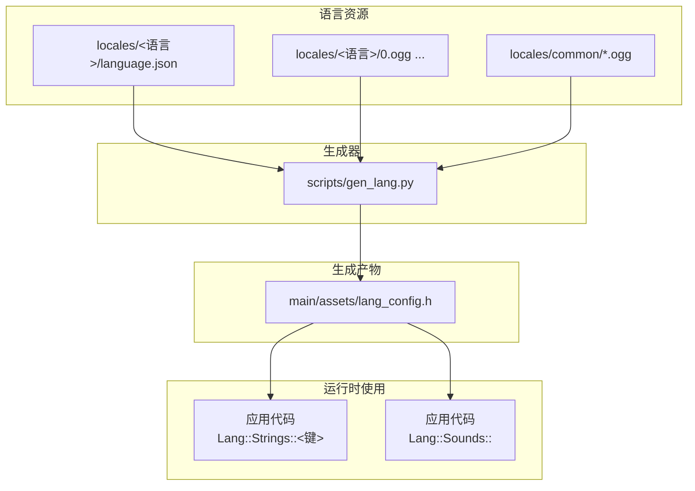
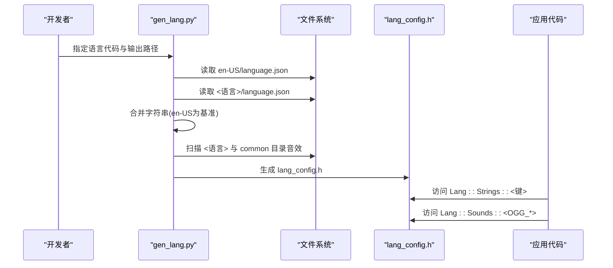
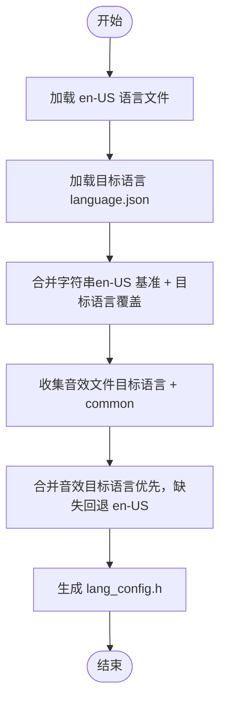
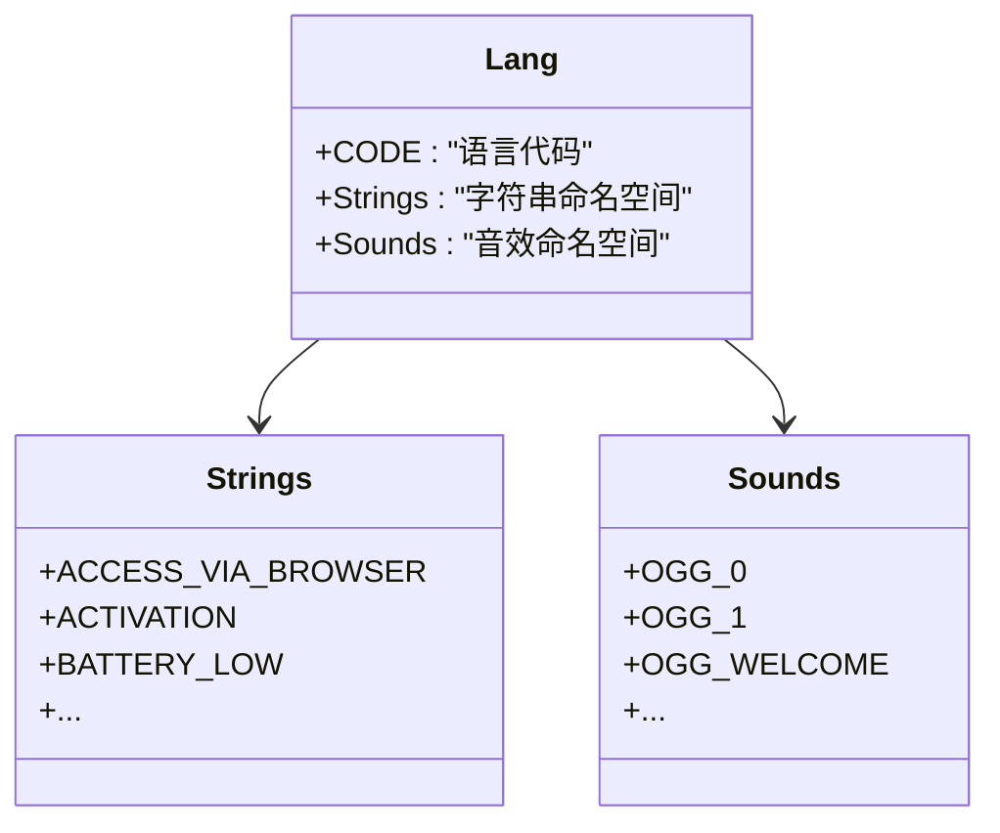
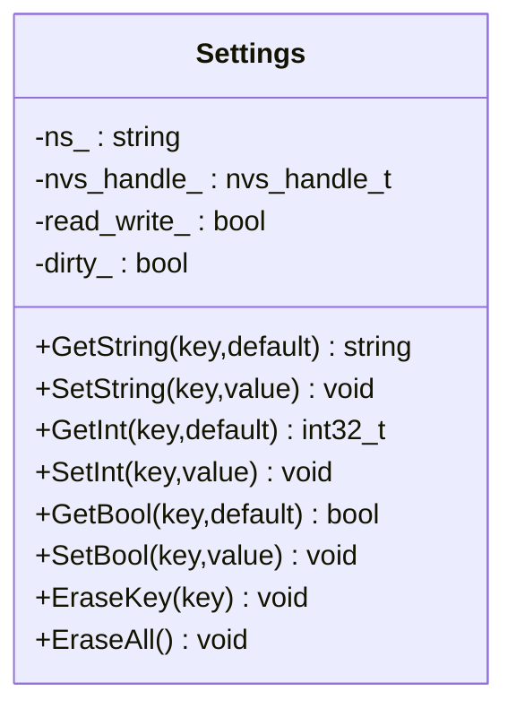
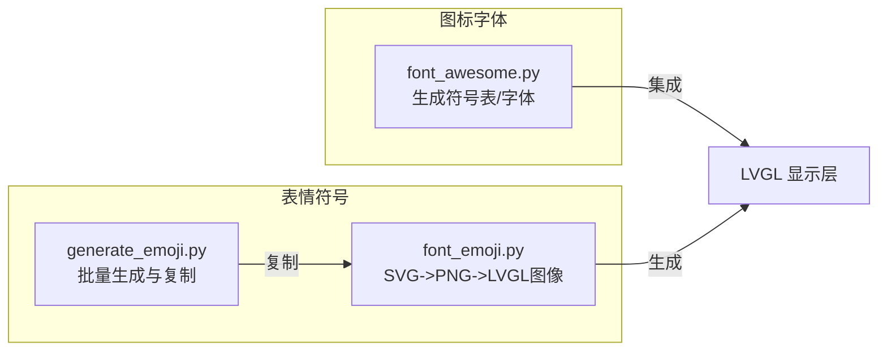
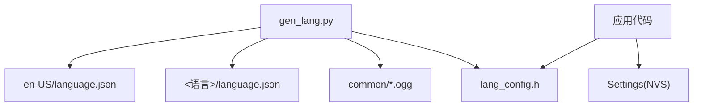

# 多语言支持系统

<cite>
**本文引用的文件**
- [main/assets/lang_config.h](file://main/assets/lang_config.h)
- [scripts/gen_lang.py](file://scripts/gen_lang.py)
- [main/assets/locales/en-US/language.json](file://main/assets/locales/en-US/language.json)
- [main/assets/locales/zh-CN/language.json](file://main/assets/locales/zh-CN/language.json)
- [main/settings.h](file://main/settings.h)
- [main/settings.cc](file://main/settings.cc)
- [managed_components/78__xiaozhi-fonts/font_awesome.py](file://managed_components/78__xiaozhi-fonts/font_awesome.py)
- [managed_components/78__xiaozhi-fonts/font_emoji.py](file://managed_components/78__xiaozhi-fonts/font_emoji.py)
- [managed_components/78__xiaozhi-fonts/generate_emoji.py](file://managed_components/78__xiaozhi-fonts/generate_emoji.py)
</cite>

## 目录
1. [简介](#简介)
2. [项目结构](#项目结构)
3. [核心组件](#核心组件)
4. [架构总览](#架构总览)
5. [详细组件分析](#详细组件分析)
6. [依赖关系分析](#依赖关系分析)
7. [性能考量](#性能考量)
8. [故障排查指南](#故障排查指南)
9. [结论](#结论)
10. [附录](#附录)

## 简介
本技术文档围绕多语言支持系统展开，系统性阐述语言配置文件结构与组织方式、语言资源加载与回退机制、音效资源打包与访问、字体与图标/表情符号的生成与集成、国际化文本存储与占位符处理、界面布局适配与RTL支持建议，以及语言包生成、维护与更新的最佳实践。文档面向不同技术背景的读者，既提供高层概览也包含代码级分析与可视化图示。

## 项目结构
多语言支持系统主要由以下部分组成：
- 语言配置生成器：通过脚本读取各语言的language.json，合并en-US基准语言，生成C++头文件供应用直接使用。
- 语言资源：按语言代码分目录存放，包含字符串键值与音效文件。
- 设置持久化：使用NVS进行语言偏好等设置的读写。
- 字体与图标/表情：通过独立工具链生成LVGL可用的字体与图像资源，并在构建阶段集成。

**图表来源**
- [scripts/gen_lang.py](file://scripts/gen_lang.py#L53-L175)
- [main/assets/lang_config.h](file://main/assets/lang_config.h#L11-L214)

**章节来源**
- [scripts/gen_lang.py](file://scripts/gen_lang.py#L1-L187)
- [main/assets/locales/en-US/language.json](file://main/assets/locales/en-US/language.json)
- [main/assets/locales/zh-CN/language.json](file://main/assets/locales/zh-CN/language.json)
- [main/assets/lang_config.h](file://main/assets/lang_config.h#L1-L214)

## 核心组件
- 语言配置生成器：负责读取语言JSON、合并en-US基准、生成C++头文件，包含字符串与音效两部分。
- 语言配置头文件：提供编译期常量字符串与音效二进制视图，便于直接在固件中使用。
- 设置模块：提供NVS封装，用于保存语言偏好等用户设置。
- 字体与图标/表情工具：生成LVGL字体与表情图像资源，支持不同尺寸与颜色格式。

**章节来源**
- [scripts/gen_lang.py](file://scripts/gen_lang.py#L53-L175)
- [main/assets/lang_config.h](file://main/assets/lang_config.h#L11-L214)
- [main/settings.h](file://main/settings.h#L7-L26)
- [main/settings.cc](file://main/settings.cc#L8-L109)
- [managed_components/78__xiaozhi-fonts/font_awesome.py](file://managed_components/78__xiaozhi-fonts/font_awesome.py#L179-L306)
- [managed_components/78__xiaozhi-fonts/font_emoji.py](file://managed_components/78__xiaozhi-fonts/font_emoji.py#L98-L118)
- [managed_components/78__xiaozhi-fonts/generate_emoji.py](file://managed_components/78__xiaozhi-fonts/generate_emoji.py#L10-L41)

## 架构总览
下图展示了从语言JSON到应用可直接使用的语言配置的完整流程，以及运行时对字符串与音效的访问路径。

**图表来源**
- [scripts/gen_lang.py](file://scripts/gen_lang.py#L32-L175)
- [main/assets/lang_config.h](file://main/assets/lang_config.h#L11-L214)

## 详细组件分析

### 语言配置生成器（gen_lang.py）
- 输入：en-US/language.json作为基准；目标语言/<语言>/language.json作为增量；common目录下的通用音效。
- 合并策略：字符串以en-US为基准，目标语言覆盖缺失项；音效以目标语言为主，缺失回退至en-US，common音效统一打包。
- 输出：lang_config.h，包含语言元数据、字符串常量与音效二进制视图。
- 错误处理：对JSON解析失败与文件缺失给出告警，避免构建中断。

**图表来源**
- [scripts/gen_lang.py](file://scripts/gen_lang.py#L32-L175)

**章节来源**
- [scripts/gen_lang.py](file://scripts/gen_lang.py#L32-L175)

### 语言配置头文件（lang_config.h）
- 结构：命名空间Lang内包含CODE、Strings与Sounds三部分。
- 字符串：以constexpr常量形式提供，键名大写，值为UTF-8字符串字面量。
- 音效：通过二进制符号的string_view包装，便于直接传递给音频播放器。
- 回退机制：生成器保证缺失键回退至en-US，确保界面不出现空白。

**图表来源**
- [main/assets/lang_config.h](file://main/assets/lang_config.h#L11-L214)

**章节来源**
- [main/assets/lang_config.h](file://main/assets/lang_config.h#L11-L214)

### 设置模块（Settings）
- 功能：提供字符串、整数、布尔等键值的读写接口，基于NVS。
- 使用场景：保存用户选择的语言代码，以便启动时加载对应语言配置。
- 注意：仅在读写模式打开时才允许写入，否则会记录告警日志。

**图表来源**
- [main/settings.h](file://main/settings.h#L7-L26)
- [main/settings.cc](file://main/settings.cc#L8-L109)

**章节来源**
- [main/settings.h](file://main/settings.h#L7-L26)
- [main/settings.cc](file://main/settings.cc#L8-L109)

### 字体与图标/表情系统
- 字体与图标：
  - 使用font_awesome.py将图标映射转换为LVGL可用的字体或符号表，支持不同字号与位深。
  - 可生成LVGL格式的字体文件或图像转储，便于调试与验证。
- 表情符号：
  - 使用font_emoji.py批量下载Twemoji SVG并转换为PNG，再生成LVGL图像数组与二进制文件。
  - generate_emoji.py自动化批量生成不同尺寸的表情资源，并复制到src/emoji目录。

**图表来源**
- [managed_components/78__xiaozhi-fonts/font_awesome.py](file://managed_components/78__xiaozhi-fonts/font_awesome.py#L179-L306)
- [managed_components/78__xiaozhi-fonts/font_emoji.py](file://managed_components/78__xiaozhi-fonts/font_emoji.py#L98-L118)
- [managed_components/78__xiaozhi-fonts/generate_emoji.py](file://managed_components/78__xiaozhi-fonts/generate_emoji.py#L10-L41)

**章节来源**
- [managed_components/78__xiaozhi-fonts/font_awesome.py](file://managed_components/78__xiaozhi-fonts/font_awesome.py#L179-L306)
- [managed_components/78__xiaozhi-fonts/font_emoji.py](file://managed_components/78__xiaozhi-fonts/font_emoji.py#L98-L118)
- [managed_components/78__xiaozhi-fonts/generate_emoji.py](file://managed_components/78__xiaozhi-fonts/generate_emoji.py#L10-L41)

## 依赖关系分析
- 语言生成器依赖：
  - en-US/language.json作为基准语言。
  - 目标语言/<语言>/language.json作为增量覆盖。
  - 目标语言与common目录下的音效文件。
- 运行时依赖：
  - 应用代码通过lang_config.h提供的常量访问字符串与音效。
  - Settings模块用于持久化语言偏好。

**图表来源**
- [scripts/gen_lang.py](file://scripts/gen_lang.py#L32-L175)
- [main/assets/lang_config.h](file://main/assets/lang_config.h#L11-L214)
- [main/settings.h](file://main/settings.h#L7-L26)

**章节来源**
- [scripts/gen_lang.py](file://scripts/gen_lang.py#L32-L175)
- [main/assets/lang_config.h](file://main/assets/lang_config.h#L11-L214)
- [main/settings.h](file://main/settings.h#L7-L26)

## 性能考量
- 字符串与音效打包：
  - 通过二进制符号与string_view减少运行时内存分配与拷贝开销。
  - 合并策略避免重复资源，降低固件体积。
- 字体与表情生成：
  - 采用预生成与缓存（build目录）的方式，避免每次构建都进行昂贵的矢量转栅格过程。
  - 不同尺寸与颜色格式的资源按需生成，平衡显示质量与内存占用。
- NVS访问：
  - 读写分离与延迟提交，减少不必要的NVS写操作。

[本节为通用性能建议，无需具体文件引用]

## 故障排查指南
- 语言文件缺失：
  - 现象：生成器报错或告警，构建失败或运行时出现回退。
  - 排查：确认en-US/language.json与目标语言/<语言>/language.json存在且可读。
- JSON解析错误：
  - 现象：生成器提示解析失败。
  - 排查：检查language.json语法与字符编码（UTF-8）。
- 音效文件不匹配：
  - 现象：运行时找不到对应音效。
  - 排查：确认目标语言目录与common目录中的音效命名一致，生成器会优先使用目标语言，缺失回退至en-US。
- NVS写入失败：
  - 现象：设置写入告警。
  - 排查：确认Settings构造参数是否以读写模式打开命名空间。

**章节来源**
- [scripts/gen_lang.py](file://scripts/gen_lang.py#L32-L175)
- [main/settings.cc](file://main/settings.cc#L40-L109)

## 结论
该多语言支持系统通过“基准+增量”的语言合并策略、预编译的字符串与音效资源、以及可扩展的字体与图标/表情生成工具链，实现了高效、稳定且易于维护的国际化能力。配合NVS设置模块，可在设备端持久化语言偏好，实现动态切换的基础能力。后续可在UI布局与RTL支持方面进一步完善，以满足更广泛的本地化需求。

[本节为总结性内容，无需具体文件引用]

## 附录

### 语言代码规范与区域设置
- 语言代码采用BCP 47风格，如zh-CN、en-US、ja-JP等。
- 区域设置影响数字、日期、货币等格式化，但当前仓库未提供专门的格式化模块，建议在应用层补充相应逻辑。

[本节为通用规范说明，无需具体文件引用]

### 字符编码与文本存储
- 语言JSON与生成的头文件均使用UTF-8编码，确保多语言字符正确显示。
- 字符串以C++ constexpr常量形式嵌入固件，避免运行时解析成本。

**章节来源**
- [scripts/gen_lang.py](file://scripts/gen_lang.py#L32-L175)
- [main/assets/lang_config.h](file://main/assets/lang_config.h#L11-L214)

### 翻译键值管理与占位符替换
- 键值管理：键名统一大写，值为UTF-8字符串字面量，便于在C++中直接使用。
- 占位符替换：当前生成器未内置占位符替换逻辑，建议在应用层引入轻量的格式化函数（如std::format或自定义实现）以支持参数化文本。

**章节来源**
- [scripts/gen_lang.py](file://scripts/gen_lang.py#L102-L107)
- [main/assets/lang_config.h](file://main/assets/lang_config.h#L16-L61)

### 动态切换与缓存策略
- 动态切换：通过Settings保存当前语言代码，重启或调用语言切换流程重新生成/加载对应lang_config.h。
- 缓存策略：字符串与音效以编译期常量形式驻留，无需额外缓存；音效以string_view访问，避免重复加载。

**章节来源**
- [main/settings.h](file://main/settings.h#L7-L26)
- [main/settings.cc](file://main/settings.cc#L8-L109)
- [main/assets/lang_config.h](file://main/assets/lang_config.h#L11-L214)

### 字体管理与渲染
- 字体生成：font_awesome.py支持生成图标字体与符号表，font_emoji.py支持表情符号的SVG->PNG->LVGL图像转换。
- 集成方式：生成的.c/.bin文件集成到构建流程，最终链接到固件镜像。
- 渲染建议：针对中文字体，建议在LVGL中配置合适的字体子集与位深，平衡清晰度与内存占用。

**章节来源**
- [managed_components/78__xiaozhi-fonts/font_awesome.py](file://managed_components/78__xiaozhi-fonts/font_awesome.py#L179-L306)
- [managed_components/78__xiaozhi-fonts/font_emoji.py](file://managed_components/78__xiaozhi-fonts/font_emoji.py#L98-L118)
- [managed_components/78__xiaozhi-fonts/generate_emoji.py](file://managed_components/78__xiaozhi-fonts/generate_emoji.py#L10-L41)

### 布局适配与RTL支持
- 布局适配：建议在UI层引入方向感知的布局管理器，根据语言代码自动调整对齐与间距。
- RTL支持：对于阿拉伯语、希伯来语等从右到左书写的语言，需在UI层启用RTL模式并反转控件顺序与图标镜像。

[本节为通用实现建议，无需具体文件引用]

### 语言包生成、维护与更新最佳实践
- 生成流程：
  - 在scripts/gen_lang.py中指定语言代码与输出路径，确保en-US与目标语言language.json完整。
  - 生成lang_config.h后，重新构建固件以包含新的语言资源。
- 维护策略：
  - 以en-US为唯一真实源，其他语言仅保留差异键值。
  - 对音效文件命名保持一致性，缺失时回退至en-US。
- 更新流程：
  - 新增语言：新增locales/<新语言>/language.json与对应音效文件，运行生成器。
  - 修订键值：修改en-US或目标语言文件后，重新生成并验证界面显示。

**章节来源**
- [scripts/gen_lang.py](file://scripts/gen_lang.py#L176-L187)
- [main/assets/locales/en-US/language.json](file://main/assets/locales/en-US/language.json)
- [main/assets/locales/zh-CN/language.json](file://main/assets/locales/zh-CN/language.json)