# 显示驱动实现

<cite>
**本文档引用的文件**
- [display.h](file://main/display/display.h)
- [display.cc](file://main/display/display.cc)
- [lcd_display.h](file://main/display/lcd_display.h)
- [lcd_display.cc](file://main/display/lcd_display.cc)
- [oled_display.h](file://main/display/oled_display.h)
- [oled_display.cc](file://main/display/oled_display.cc)
</cite>

## 目录
1. [简介](#简介)
2. [项目结构](#项目结构)
3. [核心组件](#核心组件)
4. [架构概览](#架构概览)
5. [详细组件分析](#详细组件分析)
6. [依赖关系分析](#依赖关系分析)
7. [性能考虑](#性能考虑)
8. [故障排除指南](#故障排除指南)
9. [结论](#结论)

## 简介

本文件为显示驱动实现的技术文档，深入解析了基于ESP-IDF和LVGL的显示系统架构。该系统提供了统一的显示抽象层，支持多种显示设备类型，包括LCD显示器和OLED显示器。文档详细说明了Display基类的设计理念、LCD和OLED驱动的具体实现差异，以及完整的初始化流程、内存管理和性能优化策略。

## 项目结构

显示驱动模块位于`main/display/`目录下，采用清晰的层次化设计：

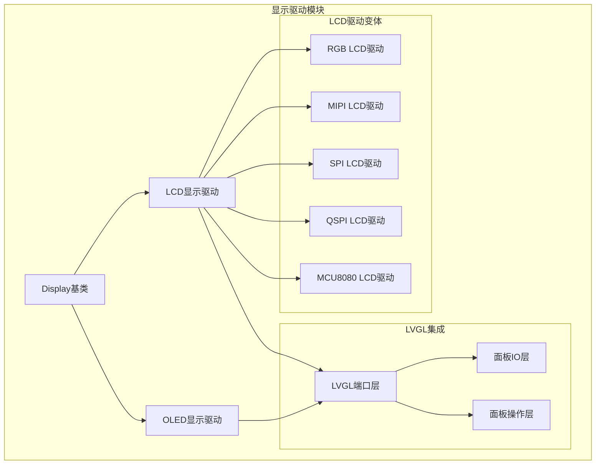

**图表来源**
- [display.h](file://main/display/display.h#L18-L66)
- [lcd_display.h](file://main/display/lcd_display.h#L26-L106)
- [oled_display.h](file://main/display/oled_display.h#L9-L35)

**章节来源**
- [display.h](file://main/display/display.h#L1-L93)
- [lcd_display.h](file://main/display/lcd_display.h#L1-L107)
- [oled_display.h](file://main/display/oled_display.h#L1-L38)

## 核心组件

### Display基类设计

Display基类是整个显示系统的抽象核心，定义了统一的显示接口和通用功能：

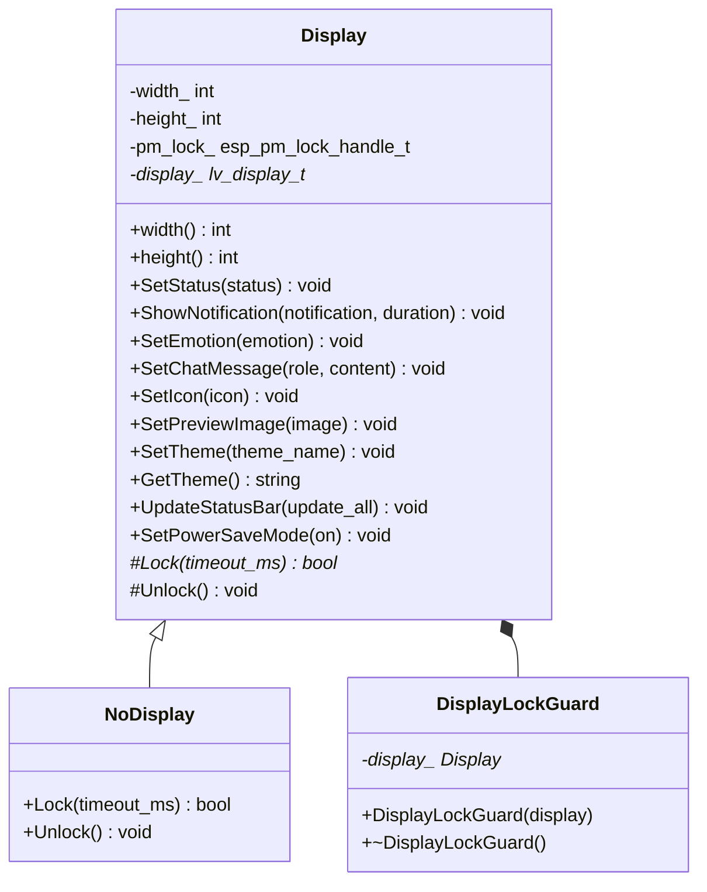

**图表来源**
- [display.h](file://main/display/display.h#L18-L66)

Display基类的核心特性包括：

1. **抽象接口设计**：定义了完整的显示控制接口，包括状态显示、通知显示、情感表达、聊天消息等
2. **线程安全机制**：通过DisplayLockGuard实现显示操作的互斥访问
3. **电源管理集成**：集成了ESP-IDF的电源管理锁机制
4. **主题系统**：支持动态主题切换和持久化存储

**章节来源**
- [display.h](file://main/display/display.h#L18-L66)
- [display.cc](file://main/display/display.cc#L17-L62)

### LCD显示驱动架构

LCD显示驱动采用多态继承设计，支持多种接口类型的LCD显示器：

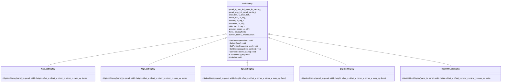

**图表来源**
- [lcd_display.h](file://main/display/lcd_display.h#L26-L106)

**章节来源**
- [lcd_display.h](file://main/display/lcd_display.h#L26-L106)

### OLED显示驱动设计

OLED显示驱动针对单色显示特性进行了专门优化：

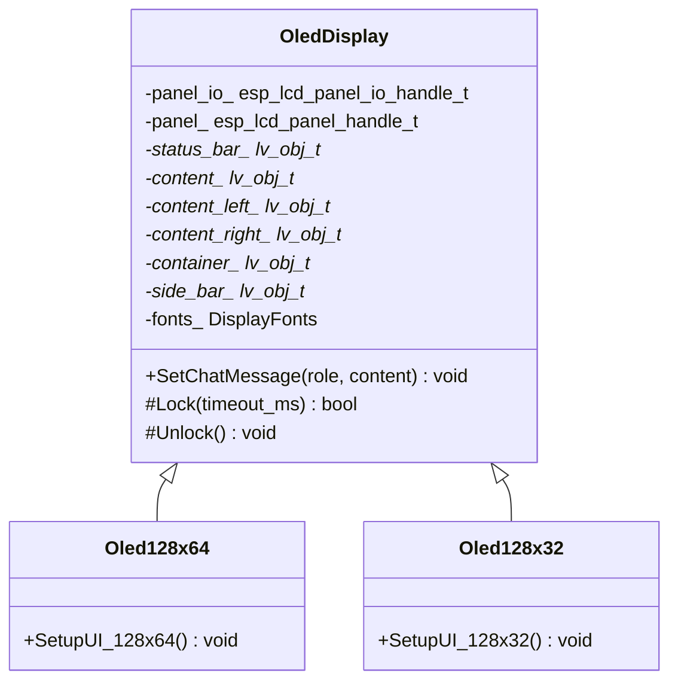

**图表来源**
- [oled_display.h](file://main/display/oled_display.h#L9-L35)

**章节来源**
- [oled_display.h](file://main/display/oled_display.h#L9-L35)

## 架构概览

显示系统采用分层架构设计，实现了高度的模块化和可扩展性：

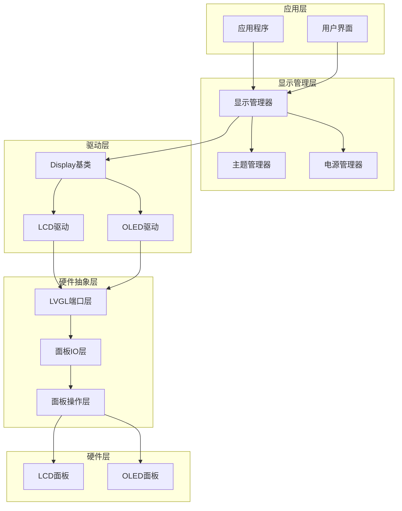

**图表来源**
- [display.cc](file://main/display/display.cc#L93-L195)
- [lcd_display.cc](file://main/display/lcd_display.cc#L102-L142)
- [oled_display.cc](file://main/display/oled_display.cc#L22-L58)

## 详细组件分析

### Display基类实现详解

Display基类提供了完整的显示控制框架，包括状态管理、通知系统和电源管理：

#### 初始化流程

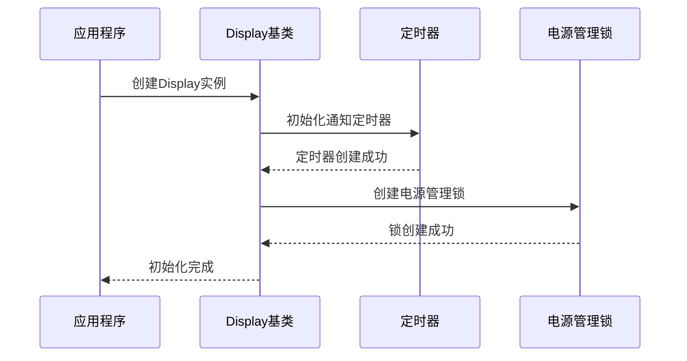

**图表来源**
- [display.cc](file://main/display/display.cc#L17-L40)

#### 状态更新机制

Display基类实现了智能的状态更新系统，能够根据设备状态自动切换显示内容：

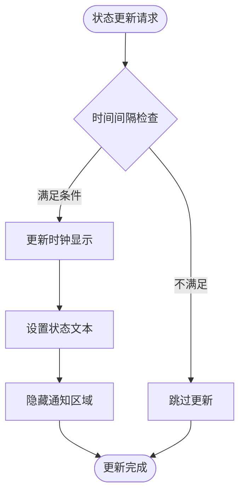

**图表来源**
- [display.cc](file://main/display/display.cc#L115-L130)

**章节来源**
- [display.cc](file://main/display/display.cc#L64-L195)

### LCD显示驱动实现

LCD显示驱动针对不同接口类型提供了专门的实现，每种类型都有其特定的初始化参数和配置选项。

#### RGB LCD驱动实现

RGB LCD驱动支持双缓冲技术和垂直同步，提供最佳的显示性能：

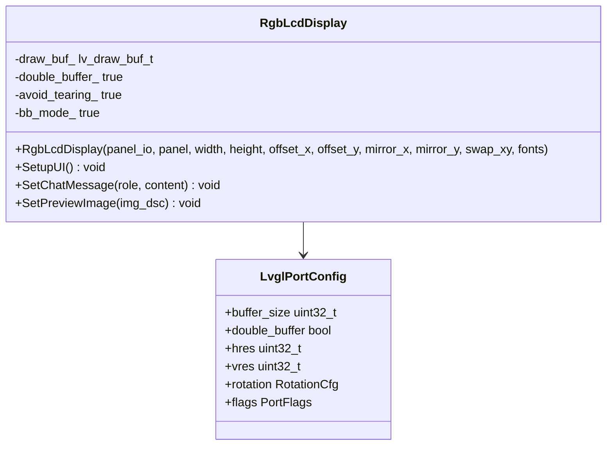

**图表来源**
- [lcd_display.cc](file://main/display/lcd_display.cc#L152-L212)

#### SPI LCD驱动实现

SPI LCD驱动针对成本敏感的应用场景，提供了简化的配置选项：

**章节来源**
- [lcd_display.cc](file://main/display/lcd_display.cc#L87-L149)

### OLED显示驱动实现

OLED显示驱动针对单色显示特性进行了专门优化，支持不同的分辨率配置：

#### 128x64分辨率配置

128x64分辨率的OLED驱动实现了复杂的布局管理系统：

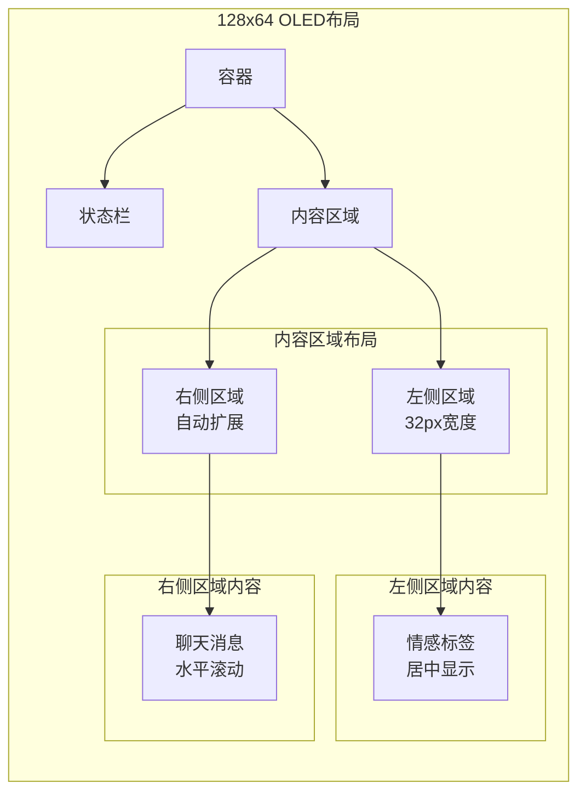

**图表来源**
- [oled_display.cc](file://main/display/oled_display.cc#L120-L186)

**章节来源**
- [oled_display.cc](file://main/display/oled_display.cc#L120-L311)

## 依赖关系分析

显示驱动系统具有清晰的依赖层次结构，各组件之间的耦合度较低，便于维护和扩展：

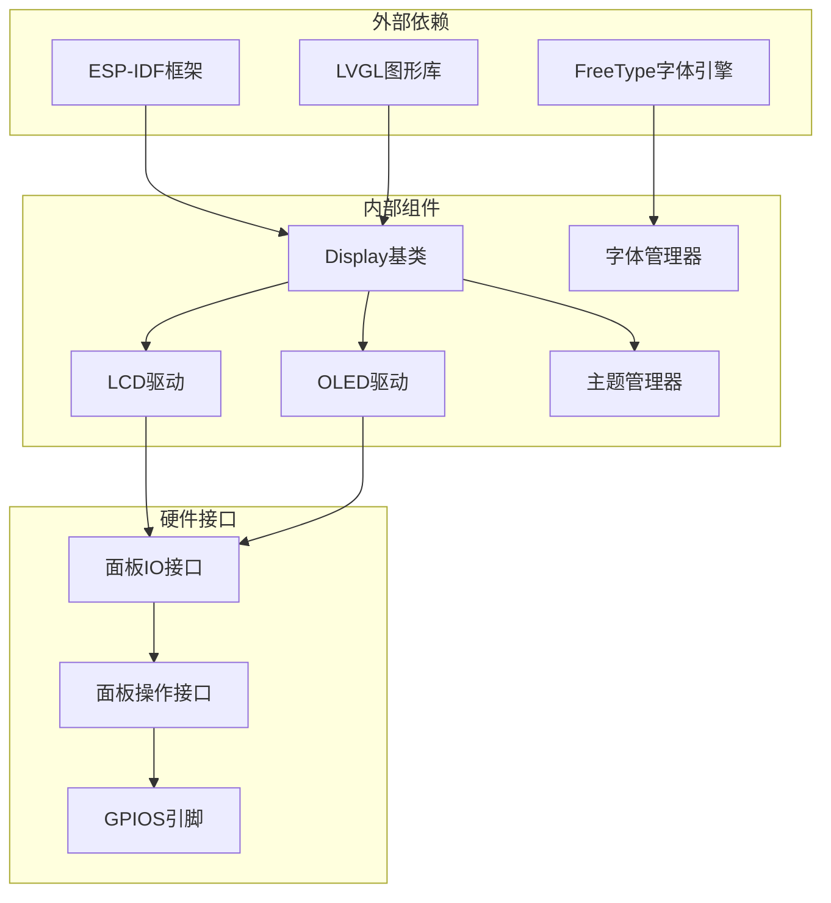

**图表来源**
- [display.h](file://main/display/display.h#L4-L10)
- [lcd_display.h](file://main/display/lcd_display.h#L6-L8)
- [oled_display.h](file://main/display/oled_display.h#L6-L7)

**章节来源**
- [display.h](file://main/display/display.h#L1-L11)
- [lcd_display.h](file://main/display/lcd_display.h#L1-L9)
- [oled_display.h](file://main/display/oled_display.h#L1-L8)

## 性能考虑

### 内存管理策略

显示驱动系统采用了多种内存管理优化策略：

1. **双缓冲技术**：RGB LCD驱动使用双缓冲减少撕裂现象
2. **内存池管理**：图像数据使用专门的内存分配策略
3. **资源回收**：及时释放不再使用的显示资源

### 刷新率优化

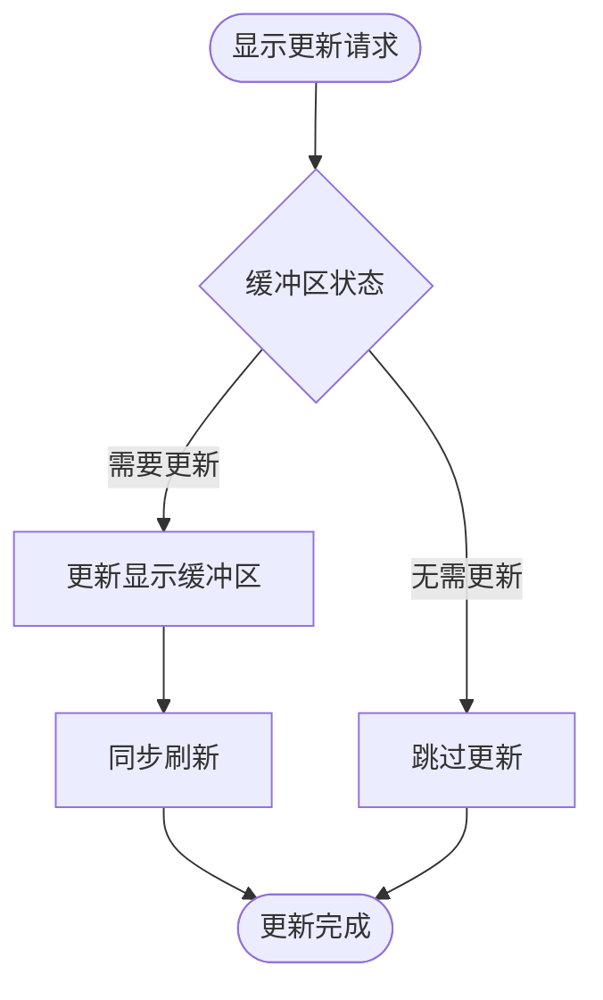

**图表来源**
- [lcd_display.cc](file://main/display/lcd_display.cc#L174-L201)

### 功耗优化

显示驱动系统实现了多层次的功耗管理：

1. **电源管理锁**：通过ESP-IDF的电源管理机制控制CPU频率
2. **动态亮度调节**：根据使用场景调整显示亮度
3. **睡眠模式**：支持低功耗睡眠状态

**章节来源**
- [display.cc](file://main/display/display.cc#L132-L194)
- [lcd_display.cc](file://main/display/lcd_display.cc#L174-L201)

## 故障排除指南

### 常见显示问题及解决方案

#### 显示初始化失败

**问题症状**：设备启动时显示无法正常工作

**可能原因**：
1. LCD面板连接错误
2. SPI/I2C通信失败
3. 电源供应不足

**解决方案**：
1. 检查硬件连接
2. 验证引脚配置
3. 确认电源电压

#### 图像显示异常

**问题症状**：图像显示扭曲或颜色错误

**可能原因**：
1. 颜色格式配置错误
2. 旋转参数设置不当
3. 缓冲区大小不足

**解决方案**：
1. 检查颜色格式设置
2. 调整旋转参数
3. 增加缓冲区大小

#### 性能问题

**问题症状**：显示更新缓慢或卡顿

**可能原因**：
1. 缓冲区配置不当
2. 双缓冲未启用
3. 电源管理设置问题

**解决方案**：
1. 启用双缓冲模式
2. 优化缓冲区大小
3. 调整电源管理设置

**章节来源**
- [display.cc](file://main/display/display.cc#L17-L40)
- [lcd_display.cc](file://main/display/lcd_display.cc#L102-L142)
- [oled_display.cc](file://main/display/oled_display.cc#L22-L58)

## 结论

显示驱动实现展现了优秀的软件架构设计，通过抽象基类和多态继承实现了高度的可扩展性和代码复用。系统支持多种显示设备类型，针对不同硬件特性提供了专门的优化方案。

主要优势包括：
1. **模块化设计**：清晰的层次结构便于维护和扩展
2. **性能优化**：多种缓冲技术和电源管理策略
3. **兼容性强**：支持多种接口类型的显示设备
4. **易于使用**：统一的API接口简化了集成过程

该实现为嵌入式显示系统提供了一个可靠、高效的解决方案，适合各种物联网和嵌入式应用场景。