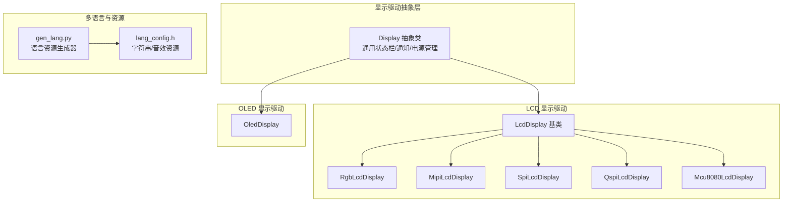
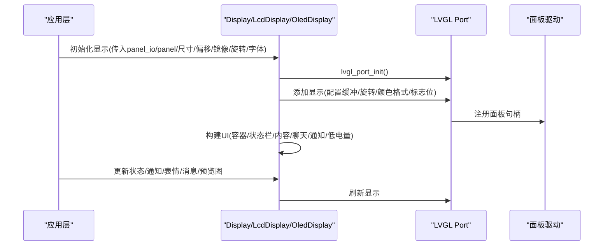
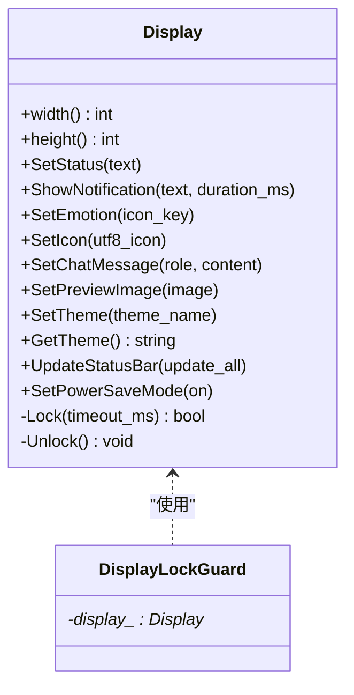
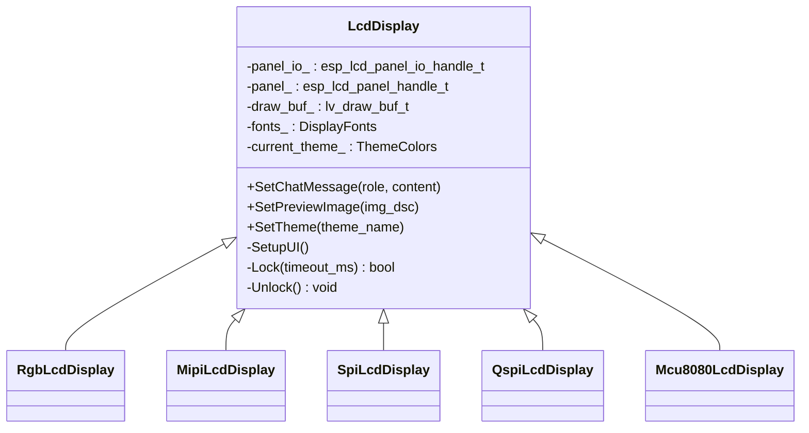
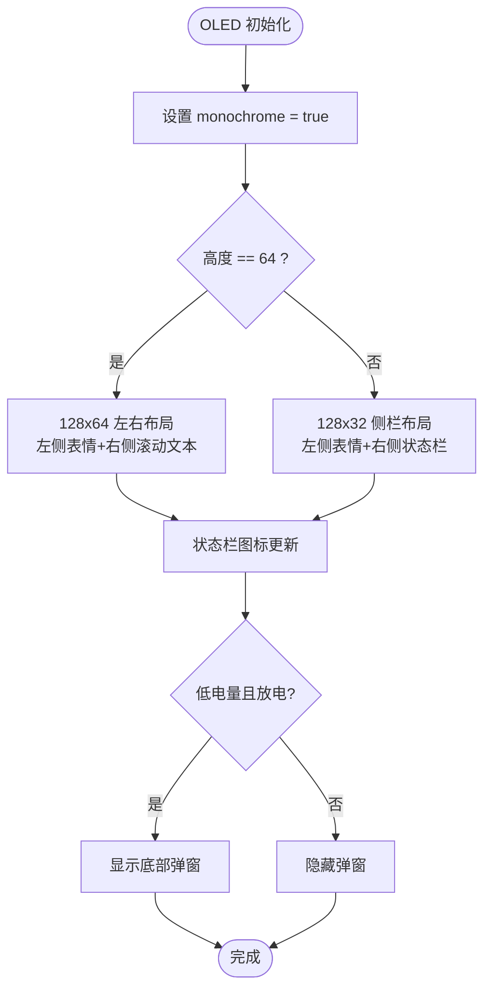
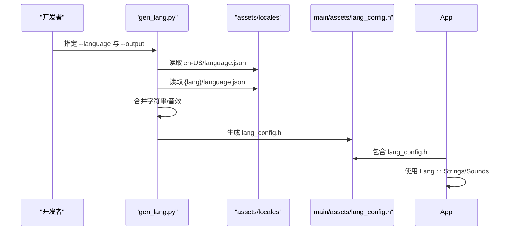
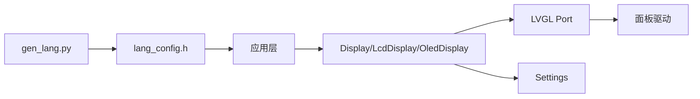

# 用户界面系统

<cite>
**本文引用的文件**
- [main/display/display.h](file://main/display/display.h)
- [main/display/display.cc](file://main/display/display.cc)
- [main/display/lcd_display.h](file://main/display/lcd_display.h)
- [main/display/lcd_display.cc](file://main/display/lcd_display.cc)
- [main/display/oled_display.h](file://main/display/oled_display.h)
- [main/display/oled_display.cc](file://main/display/oled_display.cc)
- [main/assets/lang_config.h](file://main/assets/lang_config.h)
- [scripts/gen_lang.py](file://scripts/gen_lang.py)
</cite>

## 目录
1. [简介](#简介)
2. [项目结构](#项目结构)
3. [核心组件](#核心组件)
4. [架构总览](#架构总览)
5. [详细组件分析](#详细组件分析)
6. [依赖关系分析](#依赖关系分析)
7. [性能考虑](#性能考虑)
8. [故障排查指南](#故障排查指南)
9. [结论](#结论)
10. [附录](#附录)

## 简介
本文件面向用户界面系统，聚焦于LVGL图形界面的集成与配置、显示驱动抽象与多显示器支持、LCD与OLED驱动实现差异、多语言与国际化、主题定制、UI组件使用与自定义开发，以及性能优化与内存管理最佳实践。文档基于仓库中的显示驱动代码、语言资源生成脚本与配置头文件进行系统化梳理，帮助开发者快速理解并高效扩展UI能力。

## 项目结构
用户界面系统主要由以下模块构成：
- 显示驱动抽象层：统一接口与通用功能，屏蔽具体面板差异
- LCD显示驱动：支持RGB/LCD、MIPI DSI、SPI、QSPI、MCU 8080等多种接口形态
- OLED显示驱动：针对单色OLED面板的轻量实现
- 多语言与国际化：通过生成的语言配置头文件提供字符串与音效资源
- 主题系统：通过颜色方案与字体配置实现明暗主题切换
- UI组件：状态栏、聊天消息、通知、低电量弹窗等

图表来源
- [main/display/display.h](file://main/display/display.h#L18-L66)
- [main/display/lcd_display.h](file://main/display/lcd_display.h#L26-L105)
- [main/display/oled_display.h](file://main/display/oled_display.h#L9-L35)
- [main/assets/lang_config.h](file://main/assets/lang_config.h#L11-L213)
- [scripts/gen_lang.py](file://scripts/gen_lang.py#L53-L174)

章节来源
- [main/display/display.h](file://main/display/display.h#L18-L66)
- [main/display/lcd_display.h](file://main/display/lcd_display.h#L26-L105)
- [main/display/oled_display.h](file://main/display/oled_display.h#L9-L35)
- [main/assets/lang_config.h](file://main/assets/lang_config.h#L11-L213)
- [scripts/gen_lang.py](file://scripts/gen_lang.py#L53-L174)

## 核心组件
- Display 抽象类：定义统一的UI接口，包括状态显示、通知、表情/图标、聊天消息、预览图、主题切换、状态栏更新、省电模式等；提供显示锁与电源管理锁，保证LVGL线程安全与系统功耗控制。
- LcdDisplay 及其派生类：封装LVGL端口初始化、显示配置、缓冲策略、旋转镜像翻转、主题颜色与字体应用，并实现WeChat风格的聊天消息气泡布局与图片预览。
- OledDisplay：针对单色OLED的轻量实现，支持128x64与128x32两种尺寸，提供状态栏与滚动文本展示。
- 多语言与国际化：通过生成的lang_config.h提供语言代码、字符串资源与音效资源视图，gen_lang.py负责从assets/locales目录合并用户语言与en-US基准语言，生成最终头文件。
- 主题系统：通过Settings持久化主题名称，加载明/暗主题颜色方案，动态应用至UI控件样式。

章节来源
- [main/display/display.h](file://main/display/display.h#L18-L66)
- [main/display/display.cc](file://main/display/display.cc#L17-L241)
- [main/display/lcd_display.h](file://main/display/lcd_display.h#L26-L105)
- [main/display/lcd_display.cc](file://main/display/lcd_display.cc#L70-L800)
- [main/display/oled_display.h](file://main/display/oled_display.h#L9-L35)
- [main/display/oled_display.cc](file://main/display/oled_display.cc#L16-L311)
- [main/assets/lang_config.h](file://main/assets/lang_config.h#L11-L213)
- [scripts/gen_lang.py](file://scripts/gen_lang.py#L53-L174)

## 架构总览
LVGL集成采用esp_lvgl_port作为桥接，不同面板通过不同的配置结构体注册到LVGL端口。LCD驱动根据面板接口类型选择对应的添加函数，OLED驱动以单色模式注册。UI层次由容器、状态栏、内容区组成，聊天消息按角色（user/assistant/system）呈现不同气泡样式与对齐方式。

图表来源
- [main/display/lcd_display.cc](file://main/display/lcd_display.cc#L106-L148)
- [main/display/lcd_display.cc](file://main/display/lcd_display.cc#L168-L211)
- [main/display/lcd_display.cc](file://main/display/lcd_display.cc#L228-L269)
- [main/display/oled_display.cc](file://main/display/oled_display.cc#L22-L58)
- [main/display/display.cc](file://main/display/display.cc#L93-L195)

## 详细组件分析

### Display 抽象类与通用功能
- 接口职责：统一的状态栏文本、通知显示、表情/图标设置、聊天消息、预览图、主题切换、状态栏更新、省电模式。
- 锁与电源管理：使用DisplayLockGuard在UI更新期间加锁，防止并发冲突；通过esp_pm_lock在更新电池/网络状态时提升系统频率，避免LVGL刷新被抢占。
- 通知定时器：独立的esp_timer回调用于自动隐藏通知并恢复状态文本。
- 低电量弹窗：根据电池状态与放电状态动态显示/隐藏低电量提示，并播放对应音效。

图表来源
- [main/display/display.h](file://main/display/display.h#L18-L66)
- [main/display/display.cc](file://main/display/display.cc#L17-L62)

章节来源
- [main/display/display.h](file://main/display/display.h#L18-L66)
- [main/display/display.cc](file://main/display/display.cc#L17-L241)

### LCD 显示驱动：接口与配置差异
- 接口类型：RgbLcdDisplay、MipiLcdDisplay、SpiLcdDisplay、QspiLcdDisplay、Mcu8080LcdDisplay分别对应不同面板接口，均继承自LcdDisplay。
- LVGL端口配置：
  - RGB LCD：启用双缓冲、直接模式、避免撕裂，适合高帧率场景。
  - MIPI DSI：通过lvgl_port_add_disp_dsi注册，支持避免撕裂标志。
  - SPI/QSPI/MCU：通过lvgl_port_add_disp注册，设置缓冲大小、DMA、字节交换等标志位。
- 旋转与变换：支持swap_xy/mirror_x/mirror_y，结合面板偏移设置实现灵活的屏幕方向与安装姿态。
- 主题与字体：从Settings加载主题名，应用明/暗主题颜色；在SetupUI中为屏幕、容器、状态栏、内容区设置字体与颜色。

图表来源
- [main/display/lcd_display.h](file://main/display/lcd_display.h#L26-L105)

章节来源
- [main/display/lcd_display.h](file://main/display/lcd_display.h#L26-L105)
- [main/display/lcd_display.cc](file://main/display/lcd_display.cc#L106-L148)
- [main/display/lcd_display.cc](file://main/display/lcd_display.cc#L168-L211)
- [main/display/lcd_display.cc](file://main/display/lcd_display.cc#L228-L269)

### OLED 显示驱动：单色与尺寸适配
- 单色模式：monochrome=true，适用于1bpp OLED面板。
- 尺寸适配：根据高度区分128x64与128x32布局，前者采用左右分区+横向滚动字幕，后者采用侧栏+纵向排列。
- 状态栏与图标：使用FontAwesome图标集，支持网络、静音、电池状态更新。
- 低电量弹窗：黑色背景白色文字，底部居中显示“电量低，请充电”。

图表来源
- [main/display/oled_display.cc](file://main/display/oled_display.cc#L22-L64)
- [main/display/oled_display.cc](file://main/display/oled_display.cc#L120-L227)
- [main/display/oled_display.cc](file://main/display/oled_display.cc#L229-L309)
- [main/display/display.cc](file://main/display/display.cc#L133-L195)

章节来源
- [main/display/oled_display.h](file://main/display/oled_display.h#L9-L35)
- [main/display/oled_display.cc](file://main/display/oled_display.cc#L16-L311)
- [main/display/display.cc](file://main/display/display.cc#L133-L195)

### 多语言与国际化：生成与使用
- 生成流程：gen_lang.py从assets/locales/{lang_code}/language.json读取用户语言，以en-US为基准语言进行键值合并，同时收集音效资源，生成lang_config.h。
- 使用方式：应用通过Lang::Strings与Lang::Sounds命名空间访问字符串与音效资源视图，实现UI文本与提示音的本地化。
- 回退机制：若用户语言缺少某键值，自动回退到en-US基准语言。

图表来源
- [scripts/gen_lang.py](file://scripts/gen_lang.py#L53-L174)
- [main/assets/lang_config.h](file://main/assets/lang_config.h#L11-L213)

章节来源
- [scripts/gen_lang.py](file://scripts/gen_lang.py#L53-L174)
- [main/assets/lang_config.h](file://main/assets/lang_config.h#L11-L213)

### 主题系统：颜色方案与字体
- 主题存储：通过Settings保存当前主题名（light/dark），LcdDisplay构造时读取并应用对应颜色方案。
- 颜色方案：明/暗两套ThemeColors，包含背景、文本、聊天背景、用户/助手/系统气泡、边框、低电量等颜色。
- 字体管理：DisplayFonts包含文本、图标、表情三类字体指针，UI构建时统一设置至屏幕与控件。
- 动画效果：OLED 128x64模式下为滚动字幕配置动画时长与延迟，实现平滑滚动。

章节来源
- [main/display/lcd_display.h](file://main/display/lcd_display.h#L12-L23)
- [main/display/lcd_display.cc](file://main/display/lcd_display.cc#L70-L85)
- [main/display/lcd_display.cc](file://main/display/lcd_display.cc#L307-L415)
- [main/display/oled_display.cc](file://main/display/oled_display.cc#L180-L185)

### UI组件使用与自定义开发
- 状态栏组件：网络、通知、状态、静音、电池图标，支持动态更新与隐藏/显示切换。
- 聊天消息组件：按角色设置气泡背景与文本颜色，支持自动换行、最大宽度限制、滚动至可见。
- 图片预览组件：复制图像描述与数据到可分配内存，计算缩放比例，居中显示于气泡内。
- 低电量弹窗：底部居中弹窗，显示提示文本，支持显示/隐藏控制。
- 自定义建议：
  - 新增面板类型：在lcd_display.h/cc中新增派生类，仿照现有接口类型实现构造与SetupUI。
  - 新增主题：在lcd_display.cc中新增ThemeColors常量，并在构造函数中根据主题名赋值。
  - 新增语言：在assets/locales/{lang_code}添加language.json，运行gen_lang.py生成lang_config.h。

章节来源
- [main/display/display.cc](file://main/display/display.cc#L93-L195)
- [main/display/lcd_display.cc](file://main/display/lcd_display.cc#L421-L602)
- [main/display/lcd_display.cc](file://main/display/lcd_display.cc#L604-L704)
- [main/display/oled_display.cc](file://main/display/oled_display.cc#L98-L118)

## 依赖关系分析
- 显示驱动依赖LVGL端口库与面板驱动，通过esp_lcd_panel_io与esp_lcd_panel句柄进行通信。
- UI构建依赖LVGL对象模型（容器、标签、图像、滚动条模式等），并通过DisplayLockGuard保护线程安全。
- 多语言资源通过gen_lang.py生成，编译期嵌入二进制，运行时通过Lang命名空间访问。
- 主题配置通过Settings持久化，重启后仍可恢复上次主题。

图表来源
- [main/display/lcd_display.cc](file://main/display/lcd_display.cc#L106-L148)
- [main/display/oled_display.cc](file://main/display/oled_display.cc#L22-L58)
- [main/display/display.cc](file://main/display/display.cc#L227-L231)
- [scripts/gen_lang.py](file://scripts/gen_lang.py#L53-L174)

章节来源
- [main/display/lcd_display.cc](file://main/display/lcd_display.cc#L106-L148)
- [main/display/oled_display.cc](file://main/display/oled_display.cc#L22-L58)
- [main/display/display.cc](file://main/display/display.cc#L227-L231)
- [scripts/gen_lang.py](file://scripts/gen_lang.py#L53-L174)

## 性能考虑
- LVGL刷新周期：通过lvgl_port_cfg_t的timer_period_ms控制刷新节拍，LCD SPI/MCU默认约40–50ms，可根据目标帧率调整。
- 缓冲策略：
  - RGB LCD：启用双缓冲与直接模式，减少撕裂并提高帧率稳定性。
  - MIPI DSI：开启避免撕裂标志，适合高分辨率高刷新场景。
  - SPI/QSPI/MCU：合理设置buffer_size与DMA标志，避免频繁拷贝。
- 文本与图像：
  - 文本换行与最大宽度限制，减少布局计算开销。
  - 图像预览复制数据到可分配内存，事件回调中释放，避免悬空引用。
- 电源管理：更新电池/网络状态时获取电源锁，避免LVGL刷新被低优先级任务抢占。
- 内存管理：
  - 图像数据优先使用SPIRAM，失败回退内部RAM，确保UI流畅。
  - 控件删除时及时释放事件绑定的堆内存，避免泄漏。

章节来源
- [main/display/lcd_display.cc](file://main/display/lcd_display.cc#L106-L148)
- [main/display/lcd_display.cc](file://main/display/lcd_display.cc#L168-L211)
- [main/display/lcd_display.cc](file://main/display/lcd_display.cc#L228-L269)
- [main/display/lcd_display.cc](file://main/display/lcd_display.cc#L640-L682)
- [main/display/display.cc](file://main/display/display.cc#L132-L194)

## 故障排查指南
- 显示初始化失败：
  - 检查panel_io/panel句柄有效性与初始化顺序。
  - 确认lvgl_port_init配置正确，buffer_size与flags符合硬件能力。
- 文本或图标不显示：
  - 确认字体已正确设置至屏幕与控件，且字体资源已编译进固件。
  - 检查DisplayLockGuard是否正确加锁/解锁，避免并发修改导致异常。
- 通知未自动消失：
  - 检查esp_timer创建与启动逻辑，确认回调中隐藏通知并显示状态文本。
- 低电量弹窗不触发：
  - 检查电池状态查询与放电标志，确认图标与弹窗状态一致。
- 图像预览异常：
  - 确认图像数据复制成功，事件回调中释放内存，避免越界访问。

章节来源
- [main/display/lcd_display.cc](file://main/display/lcd_display.cc#L138-L142)
- [main/display/display.cc](file://main/display/display.cc#L17-L62)
- [main/display/display.cc](file://main/display/display.cc#L133-L195)
- [main/display/lcd_display.cc](file://main/display/lcd_display.cc#L640-L682)

## 结论
该用户界面系统以Display抽象为核心，通过LVGL端口与多种面板驱动实现跨平台、可扩展的图形显示；LCD与OLED驱动分别针对彩色与单色场景提供优化配置；多语言与主题系统使UI具备良好的国际化与个性化能力。遵循本文的性能与内存管理建议，可在资源受限的嵌入式平台上获得稳定流畅的用户体验。

## 附录
- 术语说明
  - LVGL：嵌入式GUI框架
  - LVGL Port：ESP-IDF生态中LVGL的移植层
  - 旋转/镜像/翻转：swap_xy/mirror_x/mirror_y组合实现屏幕方向与姿态调整
  - 双缓冲/直接模式：提高刷新效率与稳定性
- 扩展清单
  - 新增面板：参考现有接口类型实现构造与SetupUI
  - 新增主题：新增颜色方案并在构造函数中应用
  - 新增语言：在assets/locales/{lang_code}添加language.json并重新生成lang_config.h