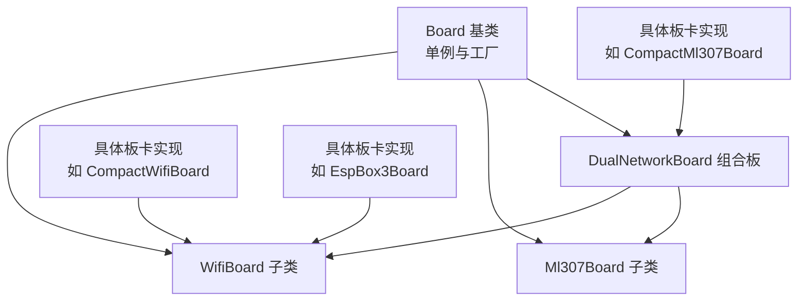
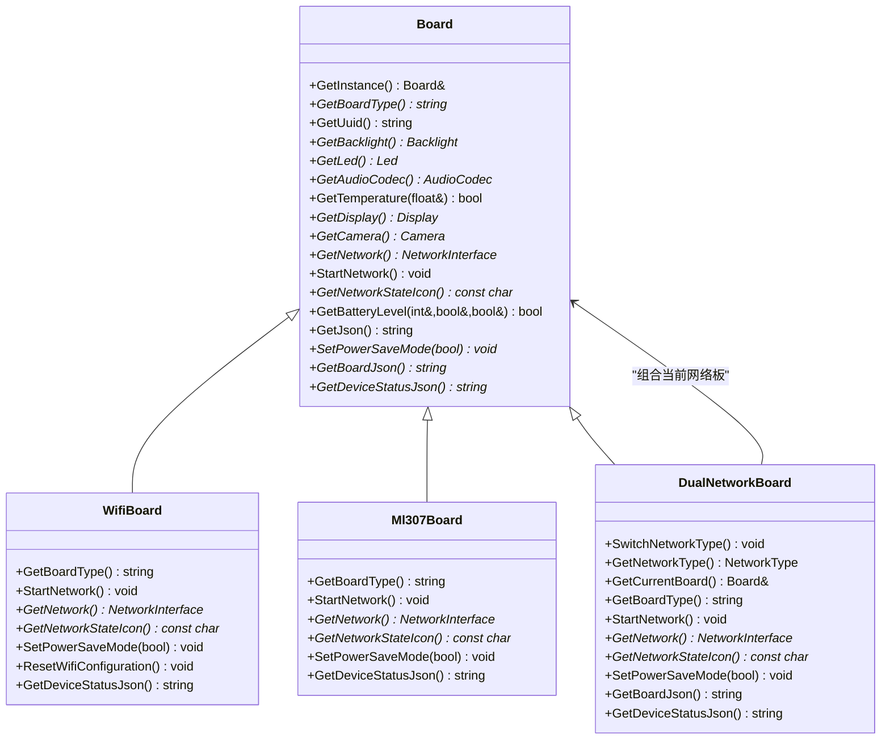
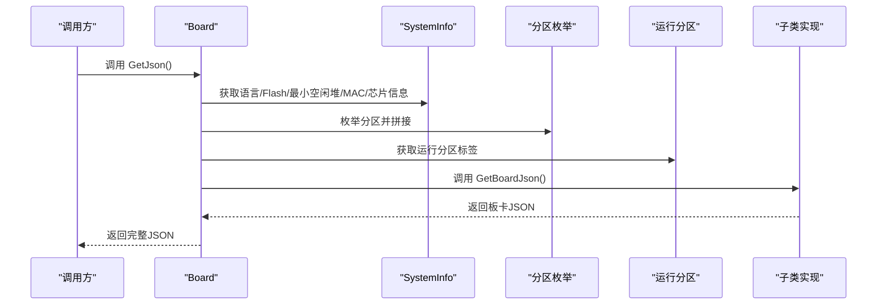
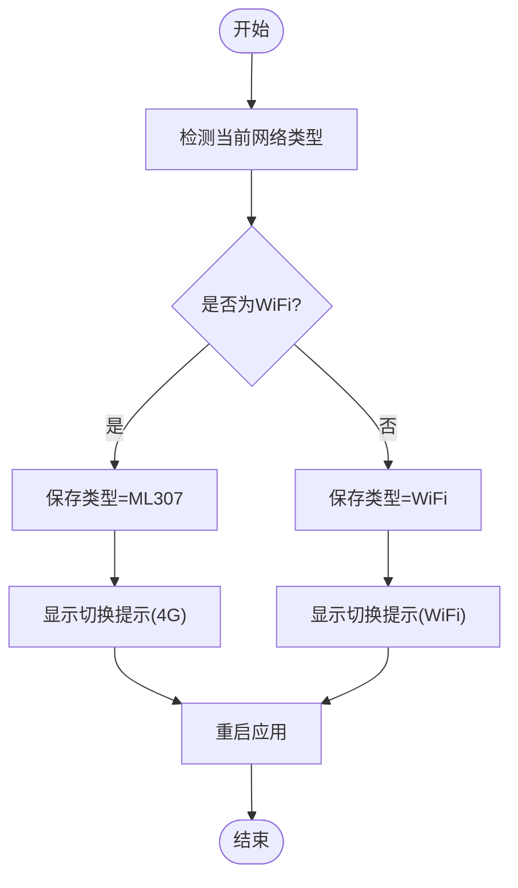
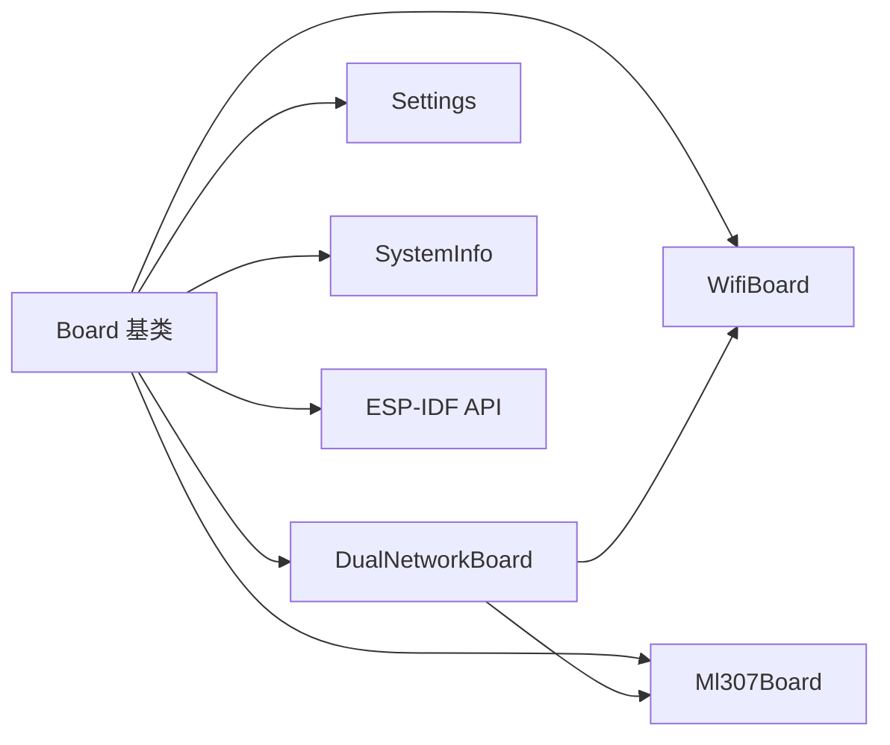

# Board抽象接口

<cite>
**本文档引用的文件**
- [main/boards/common/board.h](file://main/boards/common/board.h)
- [main/boards/common/board.cc](file://main/boards/common/board.cc)
- [main/boards/common/wifi_board.h](file://main/boards/common/wifi_board.h)
- [main/boards/common/ml307_board.h](file://main/boards/common/ml307_board.h)
- [main/boards/common/dual_network_board.h](file://main/boards/common/dual_network_board.h)
- [main/boards/common/dual_network_board.cc](file://main/boards/common/dual_network_board.cc)
- [main/boards/bread-compact-wifi/compact_wifi_board.cc](file://main/boards/bread-compact-wifi/compact_wifi_board.cc)
- [main/boards/bread-compact-ml307/compact_ml307_board.cc](file://main/boards/bread-compact-ml307/compact_ml307_board.cc)
- [main/boards/bread-compact-esp32/esp32_bread_board.cc](file://main/boards/bread-compact-esp32/esp32_bread_board.cc)
- [main/boards/esp-box/esp_box_board.cc](file://main/boards/esp-box/esp_box_board.cc)
- [main/boards/esp-box-3/esp_box3_board.cc](file://main/boards/esp-box-3/esp_box3_board.cc)
</cite>

## 目录
1. [简介](#简介)
2. [项目结构](#项目结构)
3. [核心组件](#核心组件)
4. [架构总览](#架构总览)
5. [详细组件分析](#详细组件分析)
6. [依赖关系分析](#依赖关系分析)
7. [性能考虑](#性能考虑)
8. [故障排查指南](#故障排查指南)
9. [结论](#结论)
10. [附录](#附录)

## 简介
本文件系统性阐述Board抽象接口的设计与实现，覆盖以下关键主题：
- Board基类的设计理念与接口定义
- 单例模式在Board中的应用与工厂函数create_board()的作用机制
- 各个纯虚函数与可重写函数的功能、实现要求与最佳实践
- JSON序列化接口GetJson()与GetBoardJson()的设计思路与扩展方法
- Board接口的继承与实现指南（如何正确重写虚函数）
- 设备UUID生成机制与设备标识管理的最佳实践

## 项目结构
Board抽象接口位于main/boards/common目录，具体文件如下：
- board.h：Board基类、单例访问入口、工厂宏、核心接口声明
- board.cc：Board构造、UUID生成、默认行为实现、GetJson()实现
- wifi_board.h：基于WiFi的Board子类接口
- ml307_board.h：基于ML307模组的Board子类接口
- dual_network_board.h/.cc：双网络切换Board，内部组合WiFi或ML307子板

此外，多款具体硬件板卡通过继承上述接口实现，例如：
- bread-compact-wifi/compact_wifi_board.cc：紧凑型WiFi板
- bread-compact-ml307/compact_ml307_board.cc：紧凑型双网络板（ML307+WiFi切换）
- bread-compact-esp32/esp32_bread_board.cc：ESP32面包板
- esp-box/esp_box_board.cc、esp-box-3/esp_box3_board.cc：带LCD与音频编解码器的WiFi板

图表来源
- [main/boards/common/board.h](file://main/boards/common/board.h#L18-L53)
- [main/boards/common/wifi_board.h](file://main/boards/common/wifi_board.h#L6-L22)
- [main/boards/common/ml307_board.h](file://main/boards/common/ml307_board.h#L9-L27)
- [main/boards/common/dual_network_board.h](file://main/boards/common/dual_network_board.h#L16-L57)

章节来源
- [main/boards/common/board.h](file://main/boards/common/board.h#L1-L61)
- [main/boards/common/board.cc](file://main/boards/common/board.cc#L1-L162)
- [main/boards/common/wifi_board.h](file://main/boards/common/wifi_board.h#L1-L25)
- [main/boards/common/ml307_board.h](file://main/boards/common/ml307_board.h#L1-L30)
- [main/boards/common/dual_network_board.h](file://main/boards/common/dual_network_board.h#L1-L59)
- [main/boards/common/dual_network_board.cc](file://main/boards/common/dual_network_board.cc#L1-L94)

## 核心组件
本节聚焦Board抽象接口的核心要素与职责边界。

- 单例与工厂
  - 单例入口：GetInstance()返回静态Board引用，内部通过工厂函数create_board()创建实例
  - 工厂宏：DECLARE_BOARD(ClassName)用于生成create_board()的具体实现
  - 禁用拷贝：私有禁用拷贝构造与赋值，确保全局唯一性

- 构造与UUID
  - 构造时从Settings读取UUID；若为空则生成UUID并持久化
  - GenerateUuid()使用硬件随机源生成符合RFC 4122的UUID v4字符串

- 核心接口（纯虚/可重写）
  - GetBoardType()：返回板卡类型字符串
  - GetUuid()：返回设备UUID
  - GetBacklight()/GetLed()：背光/LED资源，默认返回空或占位实现
  - GetAudioCodec()：返回音频编解码器指针（纯虚）
  - GetTemperature()：温度读取（默认返回失败）
  - GetDisplay()/GetCamera()：显示/摄像头资源，默认返回空或占位实现
  - GetNetwork()/StartNetwork()/SetPowerSaveMode()：网络相关接口（纯虚）
  - GetNetworkStateIcon()：网络状态图标标识（纯虚）
  - GetJson()：系统信息聚合JSON（含芯片、分区、OTA、应用、语言等）
  - GetBoardJson()/GetDeviceStatusJson()：板卡特定JSON（由子类实现）

- JSON序列化
  - GetJson()：统一输出系统级JSON，末尾拼接“board”字段为GetBoardJson()
  - GetBoardJson()：由子类实现，输出板卡特定信息

章节来源
- [main/boards/common/board.h](file://main/boards/common/board.h#L18-L53)
- [main/boards/common/board.cc](file://main/boards/common/board.cc#L14-L45)
- [main/boards/common/board.cc](file://main/boards/common/board.cc#L69-L162)

## 架构总览
Board采用“基类抽象+子类特化”的分层架构，支持WiFi、ML307与双网络组合场景，并通过单例+工厂模式保证全局唯一实例与延迟初始化。

图表来源
- [main/boards/common/board.h](file://main/boards/common/board.h#L18-L53)
- [main/boards/common/wifi_board.h](file://main/boards/common/wifi_board.h#L6-L22)
- [main/boards/common/ml307_board.h](file://main/boards/common/ml307_board.h#L9-L27)
- [main/boards/common/dual_network_board.h](file://main/boards/common/dual_network_board.h#L16-L57)

## 详细组件分析

### Board基类与单例/工厂
- 设计要点
  - 单例：GetInstance()通过静态局部变量确保线程安全与延迟创建
  - 工厂：create_board()由DECLARE_BOARD宏生成，返回具体Board实例
  - 构造：从Settings读取UUID，不存在则生成并保存
  - 默认行为：部分接口提供默认实现（如无显示/LED时返回占位对象）

- 关键流程（GetJson）
  - 汇总系统信息（语言、Flash大小、最小空闲堆、MAC地址、UUID、芯片型号与特性、应用元数据、分区表、运行分区）
  - 最终拼接“board”字段为GetBoardJson()的输出

图表来源
- [main/boards/common/board.cc](file://main/boards/common/board.cc#L69-L162)

章节来源
- [main/boards/common/board.h](file://main/boards/common/board.h#L18-L53)
- [main/boards/common/board.cc](file://main/boards/common/board.cc#L14-L45)
- [main/boards/common/board.cc](file://main/boards/common/board.cc#L69-L162)

### WifiBoard子类
- 职责
  - 提供WiFi网络能力：StartNetwork()、GetNetwork()、GetNetworkStateIcon()、SetPowerSaveMode()
  - 提供设备状态JSON：GetDeviceStatusJson()
  - 板卡类型：GetBoardType()

- 实现示例
  - compact_wifi_board.cc：集成OLED显示、按键、音频编解码器（可选）、LED等
  - esp_box_board.cc / esp_box3_board.cc：集成ILI9341 LCD、I2C音频编解码器、PWM背光等

章节来源
- [main/boards/common/wifi_board.h](file://main/boards/common/wifi_board.h#L6-L22)
- [main/boards/bread-compact-wifi/compact_wifi_board.cc](file://main/boards/bread-compact-wifi/compact_wifi_board.cc#L28-L190)
- [main/boards/esp-box/esp_box_board.cc](file://main/boards/esp-box/esp_box_board.cc#L41-L178)
- [main/boards/esp-box-3/esp_box3_board.cc](file://main/boards/esp-box-3/esp_box3_board.cc#L41-L178)

### Ml307Board子类
- 职责
  - 基于AT模组ML307提供蜂窝网络能力
  - 管理TX/RX/DTR引脚配置
  - 实现WiFi/ML307切换场景下的GetBoardJson()/GetDeviceStatusJson()

章节来源
- [main/boards/common/ml307_board.h](file://main/boards/common/ml307_board.h#L9-L27)

### DualNetworkBoard组合板
- 职责
  - 在WiFi与ML307之间动态切换
  - 通过Settings持久化当前网络类型
  - 委托当前活动板卡执行网络相关操作

- 关键流程（SwitchNetworkType）
  - 更新Settings中的网络类型
  - 通过显示提示后触发应用重启以完成切换

图表来源
- [main/boards/common/dual_network_board.cc](file://main/boards/common/dual_network_board.cc#L45-L57)

章节来源
- [main/boards/common/dual_network_board.h](file://main/boards/common/dual_network_board.h#L16-L57)
- [main/boards/common/dual_network_board.cc](file://main/boards/common/dual_network_board.cc#L10-L94)

### 具体板卡实现示例
- CompactWifiBoard
  - 继承WifiBoard，实现LED、音频编解码器、OLED显示等
  - 通过DECLARE_BOARD注册工厂

- CompactMl307Board
  - 继承DualNetworkBoard，构造时传入ML307引脚参数
  - 支持WiFi/ML307一键切换

- EspBox3Board
  - 继承WifiBoard，集成I2C音频编解码器与SPI ILI9341 LCD
  - 提供PWM背光控制

章节来源
- [main/boards/bread-compact-wifi/compact_wifi_board.cc](file://main/boards/bread-compact-wifi/compact_wifi_board.cc#L28-L190)
- [main/boards/bread-compact-ml307/compact_ml307_board.cc](file://main/boards/bread-compact-ml307/compact_ml307_board.cc#L24-L193)
- [main/boards/bread-compact-esp32/esp32_bread_board.cc](file://main/boards/bread-compact-esp32/esp32_bread_board.cc#L24-L167)
- [main/boards/esp-box/esp_box_board.cc](file://main/boards/esp-box/esp_box_board.cc#L41-L178)
- [main/boards/esp-box-3/esp_box3_board.cc](file://main/boards/esp-box-3/esp_box3_board.cc#L41-L178)

## 依赖关系分析
- 组件耦合
  - Board与子类之间为强接口契约（纯虚函数），低耦合高内聚
  - DualNetworkBoard通过组合持有当前网络板卡，避免多重继承复杂度
- 外部依赖
  - Settings：用于持久化UUID与网络类型
  - SystemInfo：提供系统信息（语言、Flash、MAC、芯片信息、应用元数据）
  - ESP-IDF：硬件随机源、分区枚举、运行分区查询
- 循环依赖
  - 通过前向声明与分离编译避免循环包含

图表来源
- [main/boards/common/board.h](file://main/boards/common/board.h#L1-L14)
- [main/boards/common/board.cc](file://main/boards/common/board.cc#L1-L12)
- [main/boards/common/dual_network_board.h](file://main/boards/common/dual_network_board.h#L1-L8)

章节来源
- [main/boards/common/board.h](file://main/boards/common/board.h#L1-L14)
- [main/boards/common/board.cc](file://main/boards/common/board.cc#L1-L12)
- [main/boards/common/dual_network_board.h](file://main/boards/common/dual_network_board.h#L1-L8)

## 性能考虑
- 单例延迟初始化：GetInstance()仅在首次调用时创建实例，避免启动开销
- JSON构建：GetJson()一次性拼接，建议在高频调用场景缓存结果或按需生成
- 硬件随机源：GenerateUuid()使用ESP硬件随机源，性能稳定且安全性高
- 显示/音频初始化：在具体板卡中按需初始化，避免不必要的外设占用

## 故障排查指南
- UUID为空或重复
  - 检查Settings中“board.uuid”是否存在；若缺失将自动生成并保存
  - 若出现重复，确认Settings存储介质可用性与写入权限
- 网络切换不生效
  - 确认Settings中“network.type”已更新
  - 观察显示提示与应用重启流程是否正常
- 显示/音频异常
  - 检查具体板卡实现中的外设初始化顺序与参数配置
  - 确认I2C/SPI引脚与速率设置正确

章节来源
- [main/boards/common/board.cc](file://main/boards/common/board.cc#L14-L22)
- [main/boards/common/dual_network_board.cc](file://main/boards/common/dual_network_board.cc#L23-L33)

## 结论
Board抽象接口通过清晰的职责划分与灵活的组合模式，有效支撑了多硬件平台的一致接入。单例+工厂的设计确保了全局唯一性与延迟初始化；纯虚函数约束了关键能力的实现；JSON序列化接口提供了统一的系统与板卡信息输出。结合UUID生成与Settings持久化，实现了设备标识的可靠管理。

## 附录

### Board接口继承与实现指南
- 必须重写的纯虚函数
  - GetBoardType()：返回板卡类型字符串
  - GetAudioCodec()：返回音频编解码器指针
  - GetNetwork()：返回网络接口指针
  - StartNetwork()：启动网络连接流程
  - GetNetworkStateIcon()：返回网络状态图标标识
  - SetPowerSaveMode(bool)：设置省电模式
  - GetBoardJson()：返回板卡特定JSON
  - GetDeviceStatusJson()：返回设备状态JSON

- 可选择重写的接口
  - GetBacklight()/GetLed()：返回背光/LED资源
  - GetTemperature()：返回温度读数
  - GetDisplay()/GetCamera()：返回显示/摄像头资源
  - GetBatteryLevel()：返回电池电量与状态

- 实现注意事项
  - 在构造函数中调用基类构造，以便完成UUID读取/生成与日志输出
  - 如需外设初始化，优先在首次使用时惰性初始化
  - JSON输出遵循GetJson()的结构风格，确保“board”字段由GetBoardJson()提供

章节来源
- [main/boards/common/board.h](file://main/boards/common/board.h#L37-L52)
- [main/boards/common/board.cc](file://main/boards/common/board.cc#L69-L162)

### UUID生成机制与设备标识管理最佳实践
- 生成策略
  - 使用硬件随机源生成UUID v4，包含版本与变体位设置
  - 字符串格式为标准8-4-4-4-12格式
- 持久化
  - 首次生成后写入Settings；后续直接读取，确保设备唯一标识稳定
- 安全与兼容
  - 避免硬编码UUID；确保不同设备间唯一性
  - 在OTA升级后仍保持UUID不变，便于设备识别与服务端关联

章节来源
- [main/boards/common/board.cc](file://main/boards/common/board.cc#L24-L45)
- [main/boards/common/board.cc](file://main/boards/common/board.cc#L14-L22)