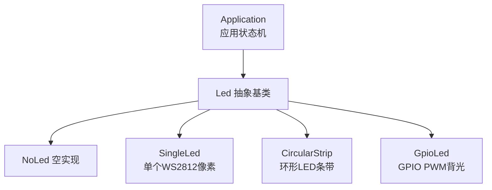
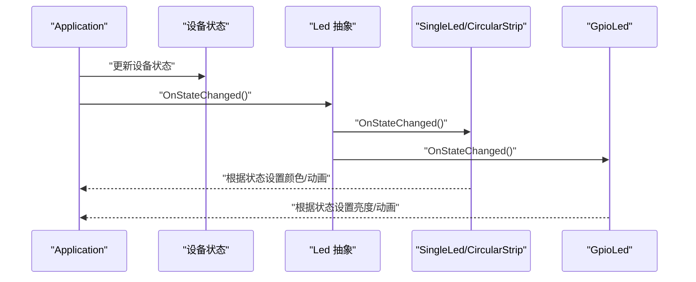
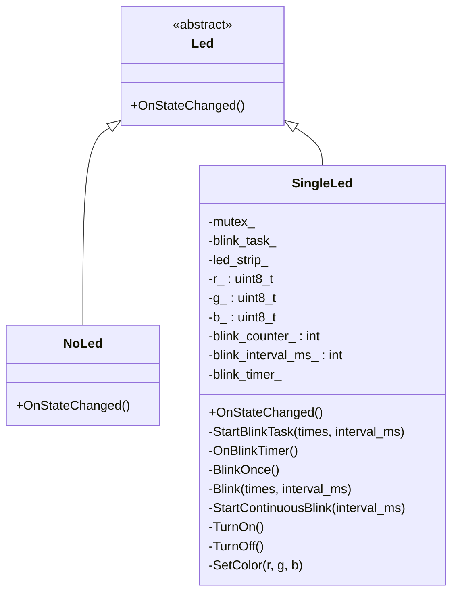
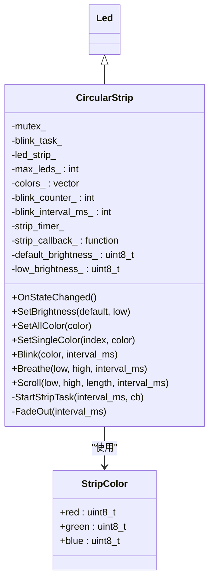
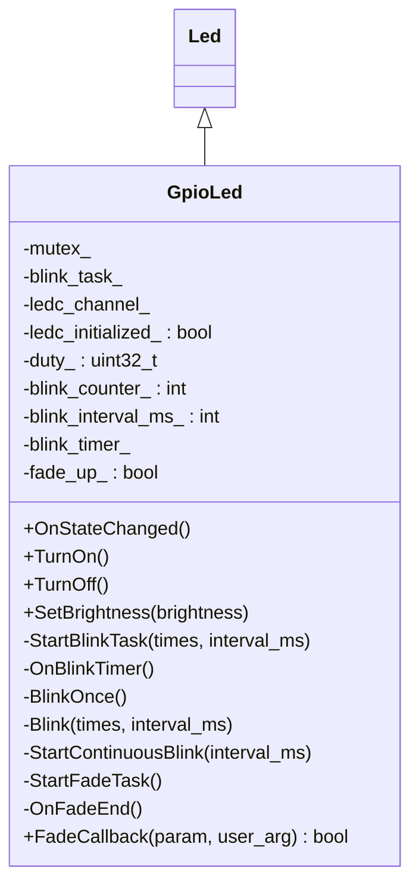
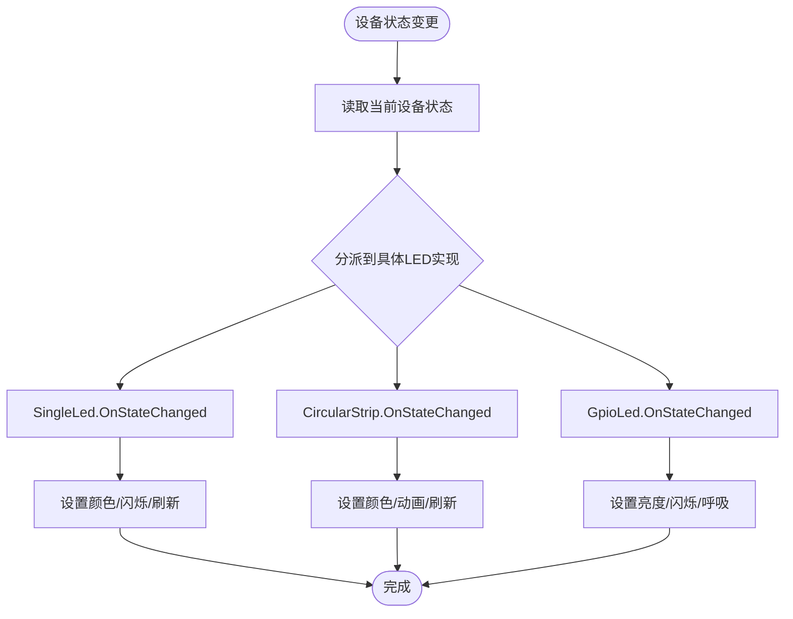
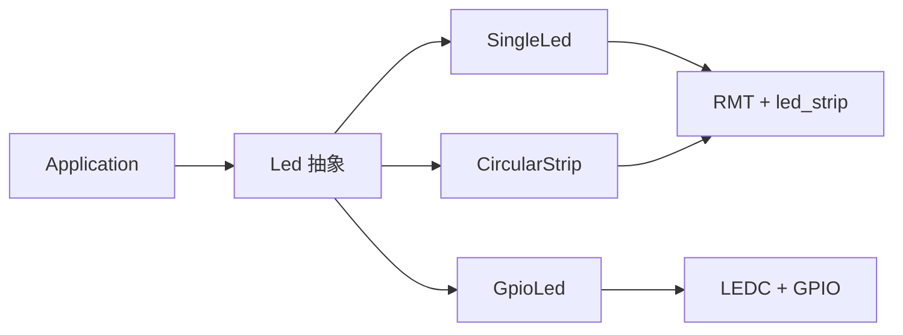

# LED控制抽象

<cite>
**本文引用的文件**
- [main/led/led.h](file://main/led/led.h)
- [main/led/single_led.h](file://main/led/single_led.h)
- [main/led/single_led.cc](file://main/led/single_led.cc)
- [main/led/circular_strip.h](file://main/led/circular_strip.h)
- [main/led/circular_strip.cc](file://main/led/circular_strip.cc)
- [main/led/gpio_led.h](file://main/led/gpio_led.h)
- [main/led/gpio_led.cc](file://main/led/gpio_led.cc)
- [main/device_state.h](file://main/device_state.h)
- [main/application.cc](file://main/application.cc)
</cite>

## 目录
1. [简介](#简介)
2. [项目结构](#项目结构)
3. [核心组件](#核心组件)
4. [架构总览](#架构总览)
5. [组件详解](#组件详解)
6. [依赖关系分析](#依赖关系分析)
7. [性能与功耗考量](#性能与功耗考量)
8. [故障排查指南](#故障排查指南)
9. [结论](#结论)
10. [附录：新增LED控制器开发指南](#附录新增led控制器开发指南)

## 简介
本文件系统性阐述本仓库中的LED控制抽象层设计与实现，目标是通过统一的Led抽象接口屏蔽底层硬件差异，使上层应用仅需关注设备状态与视觉语义，即可驱动单色LED、环形LED条带以及GPIO PWM背光等不同类型的LED设备。文档覆盖以下关键点：
- 抽象接口设计理念与职责边界
- 单色LED（WS2812）与环形LED条带（WS2812）的实现机制
- PWM调光、RGB色彩混合、LED序列控制等核心技术
- 动画效果（闪烁、呼吸、滚动、渐隐）的实现与调度
- 添加新LED控制器的开发指南与硬件连接规范
- 功耗优化、视觉效果设计与故障保护最佳实践

## 项目结构
LED控制抽象层位于 main/led 目录，采用“抽象基类 + 多种具体实现”的分层设计：
- 抽象层：Led 基类定义统一接口，NoLed 提供空实现
- 设备实现层：SingleLed（单个WS2812像素）、CircularStrip（多像素环形条带）、GpioLed（GPIO PWM）
- 应用集成：Application 根据设备状态触发 OnStateChanged，驱动LED进入对应动画或静态状态

图表来源
- [main/led/led.h](file://main/led/led.h#L4-L18)
- [main/led/single_led.h](file://main/led/single_led.h#L11-L36)
- [main/led/circular_strip.h](file://main/led/circular_strip.h#L19-L49)
- [main/led/gpio_led.h](file://main/led/gpio_led.h#L13-L45)

章节来源
- [main/led/led.h](file://main/led/led.h#L1-L18)
- [main/device_state.h](file://main/device_state.h#L4-L16)
- [main/application.cc](file://main/application.cc#L36-L68)

## 核心组件
- Led 抽象基类：定义 OnStateChanged 虚函数，作为设备状态变更时的回调入口；NoLed 提供空实现，用于无LED场景
- SingleLed：基于ESP-IDF led_strip + RMT驱动单个WS2812像素，支持静态颜色、闪烁、定时刷新
- CircularStrip：基于同驱动实现环形LED条带，支持全亮、逐点、闪烁、呼吸、滚动、渐隐等动画
- GpioLed：基于LED Controller（LEDC）+ PWM实现GPIO背光控制，支持亮度设置、闪烁、呼吸淡入淡出

章节来源
- [main/led/led.h](file://main/led/led.h#L4-L18)
- [main/led/single_led.h](file://main/led/single_led.h#L11-L36)
- [main/led/circular_strip.h](file://main/led/circular_strip.h#L19-L49)
- [main/led/gpio_led.h](file://main/led/gpio_led.h#L13-L45)

## 架构总览
LED抽象层通过 Application 的设备状态机驱动各具体LED实现：
- Application 维护设备状态枚举，状态切换时调用 LED::OnStateChanged
- 各LED实现根据当前状态选择颜色、亮度与动画策略
- SingleLed/CircularStrip 使用RMT + led_strip驱动WS2812；GpioLed 使用LEDC驱动GPIO PWM

图表来源
- [main/application.cc](file://main/application.cc#L36-L68)
- [main/device_state.h](file://main/device_state.h#L4-L16)
- [main/led/led.h](file://main/led/led.h#L7-L8)
- [main/led/single_led.cc](file://main/led/single_led.cc#L119-L163)
- [main/led/circular_strip.cc](file://main/led/circular_strip.cc#L185-L233)
- [main/led/gpio_led.cc](file://main/led/gpio_led.cc#L202-L249)

## 组件详解

### Led 抽象基类与 NoLed
- Led 定义纯虚函数 OnStateChanged，作为状态驱动入口
- NoLed 提供空实现，避免在无LED板卡时产生无效操作

章节来源
- [main/led/led.h](file://main/led/led.h#L4-L18)

### SingleLed（单色WS2812像素）
- 硬件接口：RMT + led_strip 驱动单个WS2812像素
- 关键能力
  - 颜色设置：GRB格式，支持RGB三通道
  - 亮度控制：通过颜色通道值映射到亮度
  - 动画：一次性闪烁、指定次数闪烁、持续闪烁
  - 状态联动：根据 Application 设备状态自动切换颜色与闪烁模式
- 实现要点
  - 使用互斥锁保护对LED句柄与状态的访问
  - 使用周期性esp_timer触发闪烁/刷新逻辑
  - 通过led_strip_set_pixel与led_strip_refresh更新显示

图表来源
- [main/led/led.h](file://main/led/led.h#L4-L18)
- [main/led/single_led.h](file://main/led/single_led.h#L11-L36)
- [main/led/single_led.cc](file://main/led/single_led.cc#L14-L48)

章节来源
- [main/led/single_led.h](file://main/led/single_led.h#L11-L36)
- [main/led/single_led.cc](file://main/led/single_led.cc#L14-L48)
- [main/led/single_led.cc](file://main/led/single_led.cc#L51-L76)
- [main/led/single_led.cc](file://main/led/single_led.cc#L82-L101)
- [main/led/single_led.cc](file://main/led/single_led.cc#L103-L116)
- [main/led/single_led.cc](file://main/led/single_led.cc#L119-L163)

### CircularStrip（环形LED条带）
- 硬件接口：RMT + led_strip 驱动多个WS2812像素（环形）
- 关键能力
  - 全体颜色设置与逐像素颜色设置
  - 动画：闪烁、呼吸（亮度渐变）、滚动（移动光点）、渐隐（逐像素衰减至关闭）
  - 亮度参数化：默认亮度与低亮度可配置
- 实现要点
  - 使用std::vector维护每像素颜色缓存
  - 使用esp_timer + 回调函数实现周期性动画推进
  - 通过led_strip_set_pixel与led_strip_refresh批量更新

图表来源
- [main/led/circular_strip.h](file://main/led/circular_strip.h#L19-L49)
- [main/led/circular_strip.cc](file://main/led/circular_strip.cc#L9-L48)

章节来源
- [main/led/circular_strip.h](file://main/led/circular_strip.h#L19-L49)
- [main/led/circular_strip.cc](file://main/led/circular_strip.cc#L9-L48)
- [main/led/circular_strip.cc](file://main/led/circular_strip.cc#L51-L67)
- [main/led/circular_strip.cc](file://main/led/circular_strip.cc#L69-L85)
- [main/led/circular_strip.cc](file://main/led/circular_strip.cc#L108-L144)
- [main/led/circular_strip.cc](file://main/led/circular_strip.cc#L146-L165)
- [main/led/circular_strip.cc](file://main/led/circular_strip.cc#L167-L177)
- [main/led/circular_strip.cc](file://main/led/circular_strip.cc#L179-L183)
- [main/led/circular_strip.cc](file://main/led/circular_strip.cc#L185-L233)

### GpioLed（GPIO PWM背光）
- 硬件接口：LEDC + GPIO，支持PWM调光与闪烁
- 关键能力
  - 亮度设置：百分比映射到13位分辨率占空比
  - 动画：闪烁、连续闪烁、呼吸（淡入淡出）
  - 状态联动：根据设备状态设置亮度与动画
- 实现要点
  - 初始化LEDC定时器与通道，注册淡出回调
  - 使用esp_timer驱动闪烁节奏
  - 通过ledc_set_duty/ledc_update_duty与ledc_set_fade_with_time实现即时/渐变控制

图表来源
- [main/led/gpio_led.h](file://main/led/gpio_led.h#L13-L45)
- [main/led/gpio_led.cc](file://main/led/gpio_led.cc#L28-L86)

章节来源
- [main/led/gpio_led.h](file://main/led/gpio_led.h#L13-L45)
- [main/led/gpio_led.cc](file://main/led/gpio_led.cc#L28-L86)
- [main/led/gpio_led.cc](file://main/led/gpio_led.cc#L97-L103)
- [main/led/gpio_led.cc](file://main/led/gpio_led.cc#L105-L127)
- [main/led/gpio_led.cc](file://main/led/gpio_led.cc#L133-L153)
- [main/led/gpio_led.cc](file://main/led/gpio_led.cc#L155-L168)
- [main/led/gpio_led.cc](file://main/led/gpio_led.cc#L170-L183)
- [main/led/gpio_led.cc](file://main/led/gpio_led.cc#L185-L200)
- [main/led/gpio_led.cc](file://main/led/gpio_led.cc#L202-L249)

### 设备状态与LED联动
- Application 维护设备状态枚举，状态切换时调用 LED::OnStateChanged
- 各LED实现根据状态选择颜色、亮度与动画策略
- 示例：启动中、WiFi配置中、空闲、连接中、监听中、说话中、升级中、激活中等

图表来源
- [main/application.cc](file://main/application.cc#L36-L68)
- [main/device_state.h](file://main/device_state.h#L4-L16)
- [main/led/single_led.cc](file://main/led/single_led.cc#L119-L163)
- [main/led/circular_strip.cc](file://main/led/circular_strip.cc#L185-L233)
- [main/led/gpio_led.cc](file://main/led/gpio_led.cc#L202-L249)

章节来源
- [main/device_state.h](file://main/device_state.h#L4-L16)
- [main/application.cc](file://main/application.cc#L36-L68)
- [main/led/single_led.cc](file://main/led/single_led.cc#L119-L163)
- [main/led/circular_strip.cc](file://main/led/circular_strip.cc#L185-L233)
- [main/led/gpio_led.cc](file://main/led/gpio_led.cc#L202-L249)

## 依赖关系分析
- SingleLed/CircularStrip 依赖 ESP-IDF led_strip 与 RMT，通过 led_strip_new_rmt_device 创建设备句柄
- GpioLed 依赖 ESP-IDF LED Controller（LEDC），通过 ledc_channel_config 初始化通道，注册淡出回调
- 所有LED实现均通过 Application 的设备状态机进行解耦，避免上层直接感知硬件细节

图表来源
- [main/led/single_led.cc](file://main/led/single_led.cc#L18-L27)
- [main/led/circular_strip.cc](file://main/led/circular_strip.cc#L15-L24)
- [main/led/gpio_led.cc](file://main/led/gpio_led.cc#L44-L62)

章节来源
- [main/led/single_led.cc](file://main/led/single_led.cc#L18-L27)
- [main/led/circular_strip.cc](file://main/led/circular_strip.cc#L15-L24)
- [main/led/gpio_led.cc](file://main/led/gpio_led.cc#L44-L62)

## 性能与功耗考量
- RMT与LEDC资源管理
  - RMT通道数量有限，创建多个led_strip设备时需考虑通道分配；当通道不足时会返回错误
  - LEDC通道与定时器共享资源，初始化时应避免冲突
- 动画调度
  - 使用esp_timer的周期任务驱动动画，注意interval_ms过小会导致CPU占用上升
  - 呼吸/滚动等算法应尽量减少每帧计算量，必要时预计算步进
- 亮度与功耗
  - WS2812像素亮度由RGB通道值决定；在低亮度下可显著降低功耗
  - GPIO PWM背光可通过降低占空比与频率来节能；淡入淡出可避免突变电流冲击
- 刷新策略
  - 批量刷新（led_strip_refresh）优于多次逐像素写入
  - 在高频动画中，建议合并状态变更后再刷新，避免抖动与额外开销

章节来源
- [main/led/single_led.cc](file://main/led/single_led.cc#L18-L27)
- [main/led/circular_strip.cc](file://main/led/circular_strip.cc#L15-L24)
- [main/led/gpio_led.cc](file://main/led/gpio_led.cc#L44-L62)

## 故障排查指南
- 无LED或显示异常
  - 确认GPIO是否正确连接且非NC；构造函数中对NC进行了断言
  - 检查RMT通道是否被其他设备占用；必要时减少同时运行的led_strip实例
- 闪烁/呼吸不生效
  - 确认esp_timer已创建并启动；检查回调函数是否被正确注册
  - 对于GpioLed，确认LEDC淡出回调已注册且未被注销
- 动画卡顿或抖动
  - 减小动画间隔或简化算法；避免在中断上下文中执行阻塞操作
  - 使用互斥锁保护对LED句柄与状态的访问
- 状态不匹配
  - 检查Application设备状态是否正确更新；核对设备状态枚举与LED实现的分支映射

章节来源
- [main/led/single_led.cc](file://main/led/single_led.cc#L14-L16)
- [main/led/circular_strip.cc](file://main/led/circular_strip.cc#L9-L11)
- [main/led/gpio_led.cc](file://main/led/gpio_led.cc#L36-L38)
- [main/led/single_led.cc](file://main/led/single_led.cc#L30-L40)
- [main/led/gpio_led.cc](file://main/led/gpio_led.cc#L73-L83)

## 结论
本LED抽象层以统一接口屏蔽硬件差异，结合设备状态机实现“状态即动画”的设计理念，既保证了上层应用的简洁性，又为不同LED硬件提供了清晰的扩展路径。通过RMT/LEDC驱动与定时器调度，实现了稳定的闪烁、呼吸、滚动与渐隐等效果；同时在亮度控制与刷新策略上兼顾性能与功耗。

## 附录：新增LED控制器开发指南
- 接口实现要求
  - 继承 Led 抽象基类，实现 OnStateChanged 方法
  - 若存在硬件资源（如RMT/LEDC），在构造函数中完成初始化并在析构中释放
  - 使用互斥锁保护对共享资源的访问；使用esp_timer实现动画调度
  - 将设备状态枚举映射到颜色、亮度与动画策略
- 硬件连接规范
  - WS2812类设备：确保数据线接至RMT可用GPIO，电源与地线满足电流需求
  - GPIO PWM背光：确保GPIO接入LEDC可用通道，注意输出极性与限流电阻
- 最佳实践
  - 将颜色通道按GRB格式组织，避免颜色偏差
  - 在高频动画中批量刷新，减少调用次数
  - 为不同状态设定合理的默认/低亮度，兼顾可视性与功耗
  - 为可能的资源不足预留降级方案（如回退到NoLed）

章节来源
- [main/led/led.h](file://main/led/led.h#L4-L18)
- [main/led/single_led.h](file://main/led/single_led.h#L11-L36)
- [main/led/circular_strip.h](file://main/led/circular_strip.h#L19-L49)
- [main/led/gpio_led.h](file://main/led/gpio_led.h#L13-L45)