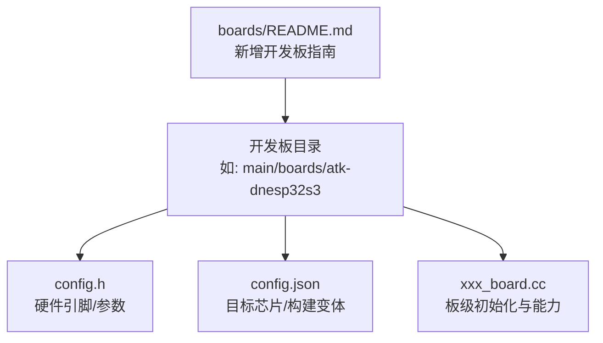
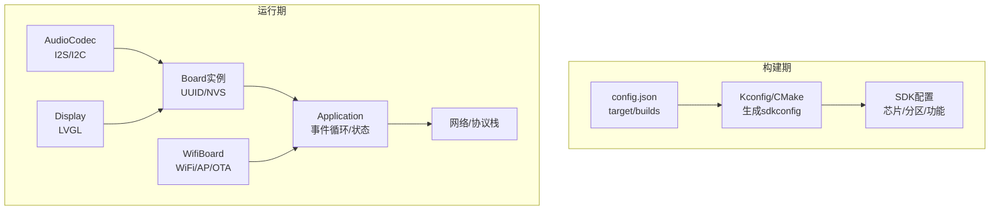
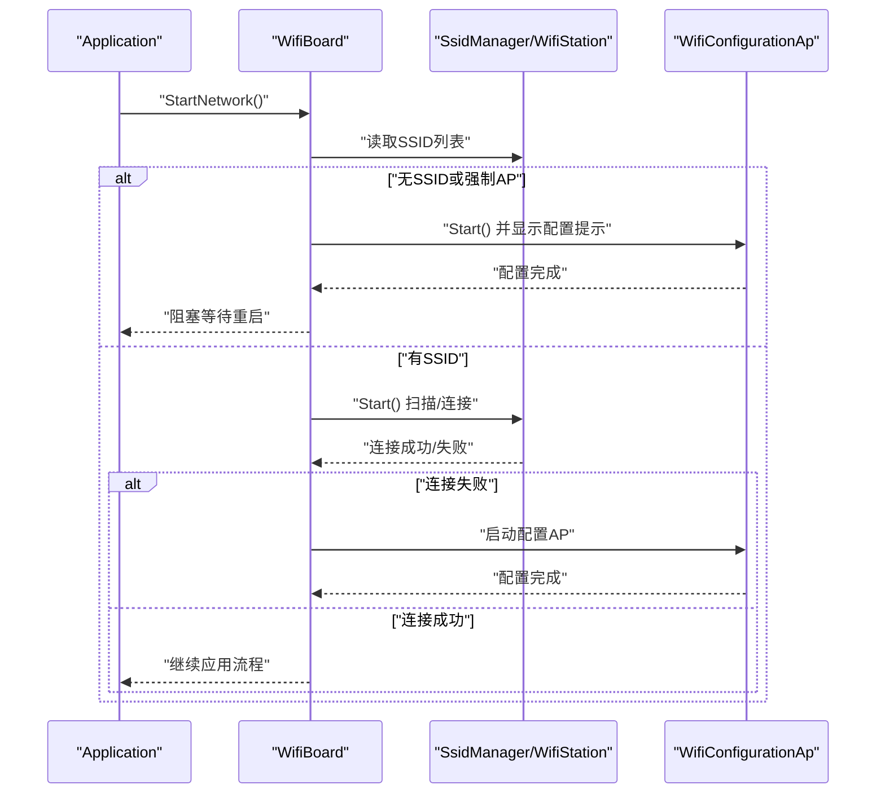
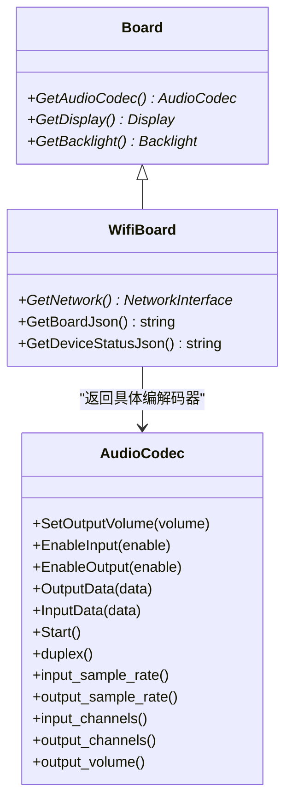
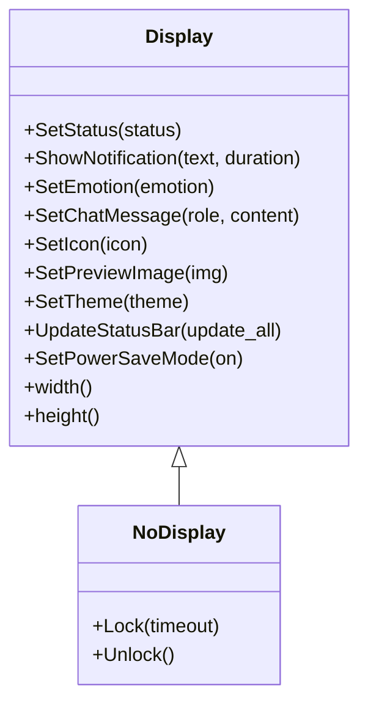
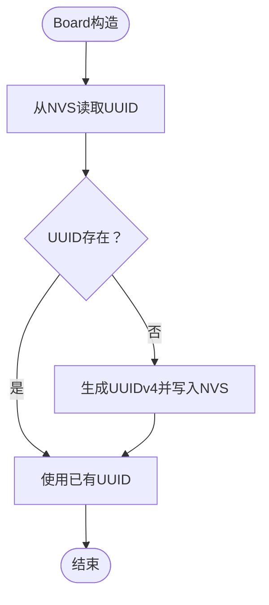
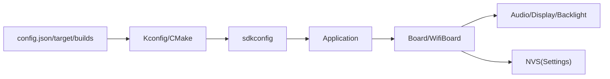

# 开发板配置管理

<cite>
**本文引用的文件**
- [main/boards/README.md](file://main/boards/README.md)
- [main/boards/atk-dnesp32s3/config.json](file://main/boards/atk-dnesp32s3/config.json)
- [main/boards/atk-dnesp32s3/config.h](file://main/boards/atk-dnesp32s3/config.h)
- [main/boards/esp-box-3/config.json](file://main/boards/esp-box-3/config.json)
- [main/boards/esp-box-3/config.h](file://main/boards/esp-box-3/config.h)
- [main/boards/common/board.cc](file://main/boards/common/board.cc)
- [main/boards/common/wifi_board.cc](file://main/boards/common/wifi_board.cc)
- [main/application.h](file://main/application.h)
- [main/settings.h](file://main/settings.h)
- [main/audio/audio_codec.h](file://main/audio/audio_codec.h)
- [main/display/display.h](file://main/display/display.h)
</cite>

## 目录
1. [简介](#简介)
2. [项目结构](#项目结构)
3. [核心组件](#核心组件)
4. [架构总览](#架构总览)
5. [详细组件分析](#详细组件分析)
6. [依赖分析](#依赖分析)
7. [性能考虑](#性能考虑)
8. [故障排查指南](#故障排查指南)
9. [结论](#结论)
10. [附录](#附录)

## 简介
本技术文档系统化阐述开发板配置管理的设计与实现，聚焦以下方面：
- 配置文件结构与职责：config.h（硬件引脚与参数）、config.json（目标芯片与构建选项）、cc 实现（板级初始化与能力暴露）。
- 管理机制：编译期目标芯片与构建选项解析、运行期板级实例化与能力查询。
- 差异与共性：音频编解码器选择、显示驱动配置、网络接口设置等在多开发板间的共性与差异。
- 新增开发板支持流程：引脚定义规范、功能模块配置、硬件兼容性检查与构建打包。
- 版本控制、兼容性与维护策略：基于唯一标识与OTA通道隔离、构建配置差异化与可追溯。

## 项目结构
开发板配置采用“按板级目录组织”的方式，每个开发板目录包含：
- config.h：定义硬件引脚、采样率、显示参数、相机引脚等编译期常量。
- config.json：声明目标芯片与构建变体（builds.name、sdkconfig_append）。
- xxx_board.cc：实现板级初始化、能力重载（如音频编解码器、显示、背光等）。
- README.md：开发板说明与新增指引。

图表来源
- [main/boards/README.md](file://main/boards/README.md#L11-L18)
- [main/boards/atk-dnesp32s3/config.json](file://main/boards/atk-dnesp32s3/config.json#L1-L9)
- [main/boards/atk-dnesp32s3/config.h](file://main/boards/atk-dnesp32s3/config.h#L1-L65)

章节来源
- [main/boards/README.md](file://main/boards/README.md#L11-L18)

## 核心组件
- 板级基类与能力查询
  - Board：提供通用能力查询接口（显示、摄像头、LED、电池、温度等），并负责设备唯一标识（UUID）持久化。
  - WifiBoard：在Board基础上扩展网络能力（WiFi扫描、连接、配置AP、OTA通道信息等）。
- 应用层入口
  - Application：应用主事件循环、设备状态管理、协议栈调度、OTA检查等。
- 配置与存储
  - Settings：命名空间化的非易失存储访问（字符串/整型/布尔）。
- 硬件抽象
  - AudioCodec：音频编解码器抽象，提供输入/输出启停、音量、采样率、声道等属性。
  - Display：显示抽象，提供主题、通知、状态栏更新等接口。

章节来源
- [main/boards/common/board.cc](file://main/boards/common/board.cc#L14-L45)
- [main/boards/common/wifi_board.cc](file://main/boards/common/wifi_board.cc#L22-L29)
- [main/application.h](file://main/application.h#L32-L87)
- [main/settings.h](file://main/settings.h#L7-L26)
- [main/audio/audio_codec.h](file://main/audio/audio_codec.h#L18-L57)
- [main/display/display.h](file://main/display/display.h#L18-L66)

## 架构总览
开发板配置管理贯穿“构建期”和“运行期”：
- 构建期：CMake/Kconfig根据config.json的target与builds.sdkconfig_append生成最终sdkconfig，决定芯片型号与功能开关。
- 运行期：Board实例化后，各开发板cc实现通过config.h提供的宏完成硬件初始化；Application通过Board能力接口进行功能集成。

图表来源
- [main/boards/atk-dnesp32s3/config.json](file://main/boards/atk-dnesp32s3/config.json#L1-L9)
- [main/boards/common/board.cc](file://main/boards/common/board.cc#L14-L22)
- [main/boards/common/wifi_board.cc](file://main/boards/common/wifi_board.cc#L71-L114)
- [main/application.h](file://main/application.h#L42-L56)

## 详细组件分析

### 配置文件设计与差异
- 共性特征
  - 音频：统一定义输入/输出采样率、I2S引脚（MCLK/WS/BCLK/DIN/DOUT）、编解码器I2C引脚与地址、功放引脚等。
  - 显示：统一定义分辨率、镜像/旋转/偏移、背光引脚与极性等。
  - 按键/指示灯：统一定义引导按键、内置LED等。
  - 相机：统一定义VSYNC/HREF/PCLK等同步信号与数据引脚。
- 差异特征
  - 不同开发板的target不同（如esp32s3），导致I2S、显示驱动、相机接口引脚不同。
  - 构建变体通过builds.name区分固件包名，sdkconfig_append注入特定功能宏（如AEC开关）。
  - 音频编解码器地址与数量可能不同（如同时支持ES8311与ES7210）。
  - 显示驱动与背光控制策略不同（如背光引脚是否有效、极性不同）。

示例对比
- atk-dnesp32s3
  - target: esp32s3
  - 音频：I2S引脚与ES8388地址
  - 显示：分辨率与镜像/旋转参数
  - 相机：OV系列引脚定义
- esp-box-3
  - target: esp32s3
  - 构建变体：启用设备端AEC
  - 音频：ES8311与ES7210双编解码器地址
  - 显示：镜像与背光引脚配置

章节来源
- [main/boards/atk-dnesp32s3/config.json](file://main/boards/atk-dnesp32s3/config.json#L1-L9)
- [main/boards/atk-dnesp32s3/config.h](file://main/boards/atk-dnesp32s3/config.h#L8-L62)
- [main/boards/esp-box-3/config.json](file://main/boards/esp-box-3/config.json#L1-L11)
- [main/boards/esp-box-3/config.h](file://main/boards/esp-box-3/config.h#L6-L39)

### 板级初始化与能力暴露（以WifiBoard为例）
- 初始化流程
  - 从Settings读取强制AP模式标志，若需要则进入WiFi配置AP。
  - 若无已保存SSID，自动进入配置模式。
  - 否则启动WiFi站并等待连接，失败则回退到配置AP。
- 能力暴露
  - GetNetwork返回网络接口句柄，GetNetworkStateIcon根据RSSI返回图标。
  - GetBoardJson提供OTA所需board元信息（类型、名称、SSID、IP、MAC等）。
  - GetDeviceStatusJson聚合音频音量、屏幕亮度/主题、电池状态、网络信号强度、芯片温度等。

图表来源
- [main/boards/common/wifi_board.cc](file://main/boards/common/wifi_board.cc#L71-L114)
- [main/boards/common/wifi_board.cc](file://main/boards/common/wifi_board.cc#L35-L69)

章节来源
- [main/boards/common/wifi_board.cc](file://main/boards/common/wifi_board.cc#L22-L29)
- [main/boards/common/wifi_board.cc](file://main/boards/common/wifi_board.cc#L116-L154)
- [main/boards/common/wifi_board.cc](file://main/boards/common/wifi_board.cc#L173-L262)

### 音频编解码器抽象与实现
- 抽象接口
  - 提供输入/输出启停、音量、采样率、声道数等属性与方法。
  - 通过I2S通道处理音频数据，支持DMA描述符与帧数配置。
- 开发板实现要点
  - 在xxx_board.cc中重写GetAudioCodec，依据config.h中的宏创建具体编解码器实例（如ES8311、ES8388等）。
  - 传入I2S引脚、采样率、编解码器地址、功放引脚等参数。
- 共性与差异
  - 共性：均需配置I2S引脚、采样率、输入/输出通道数。
  - 差异：编解码器型号不同，I2C地址不同，功放引脚可选。

图表来源
- [main/audio/audio_codec.h](file://main/audio/audio_codec.h#L18-L57)
- [main/boards/common/board.cc](file://main/boards/common/board.cc#L55-L67)
- [main/boards/common/wifi_board.cc](file://main/boards/common/wifi_board.cc#L116-L154)

章节来源
- [main/audio/audio_codec.h](file://main/audio/audio_codec.h#L18-L57)

### 显示驱动抽象与实现
- 抽象接口
  - 提供通知、状态、表情、聊天消息、主题切换、电源节省模式等接口。
  - 维护显示锁与PM锁，避免并发刷新。
- 开发板实现要点
  - 在xxx_board.cc中重写GetDisplay，创建具体显示实例（如SPI/LCD/OLED等），并传入分辨率、镜像/旋转/偏移、字体集等参数。
- 共性与差异
  - 共性：均需提供分辨率、镜像/旋转/偏移、字体集等。
  - 差异：驱动芯片不同（ST7789/ILI9341/SH8601等），SPI/QSPI接口不同，背光控制策略不同。

图表来源
- [main/display/display.h](file://main/display/display.h#L18-L66)

章节来源
- [main/display/display.h](file://main/display/display.h#L18-L66)

### 设备唯一标识与持久化
- Board在构造时从NVS读取UUID，不存在则生成UUIDv4并写入NVS。
- 该UUID作为OTA升级通道的唯一标识，避免自定义固件被标准固件覆盖。

图表来源
- [main/boards/common/board.cc](file://main/boards/common/board.cc#L14-L22)
- [main/boards/common/board.cc](file://main/boards/common/board.cc#L24-L45)

章节来源
- [main/boards/common/board.cc](file://main/boards/common/board.cc#L14-L22)
- [main/boards/common/board.cc](file://main/boards/common/board.cc#L24-L45)

### 新增开发板支持指南
- 目录与文件
  - 在main/boards/下创建新目录，包含config.h、config.json、xxx_board.cc、README.md。
- 引脚定义规范
  - 遵循现有开发板的命名风格，集中定义音频I2S、编解码器I2C、显示SPI、按键、LED、相机等引脚。
- 功能模块配置
  - 在xxx_board.cc中重写GetAudioCodec、GetDisplay、GetBacklight等，返回对应实例。
  - 如需网络功能，继承WifiBoard并在必要时调用EnterWifiConfigMode。
- 硬件兼容性检查
  - 确认目标芯片与config.json.target一致。
  - 确认编解码器、显示驱动、相机等硬件资源未冲突。
- 构建与打包
  - 通过scripts/release.py [开发板目录名]编译打包固件，避免覆盖原有开发板固件。

章节来源
- [main/boards/README.md](file://main/boards/README.md#L20-L28)
- [main/boards/README.md](file://main/boards/README.md#L88-L106)
- [main/boards/README.md](file://main/boards/README.md#L108-L118)
- [main/boards/README.md](file://main/boards/README.md#L272-L275)
- [main/boards/README.md](file://main/boards/README.md#L317-L323)

## 依赖分析
- 组件耦合
  - Board与具体硬件能力（音频、显示、背光）通过虚函数解耦，开发板实现仅关注自身硬件。
  - WifiBoard依赖WiFi栈与配置AP服务，但对上层以统一接口暴露网络状态。
- 外部依赖
  - SDK配置由config.json驱动，Kconfig/CMake生成最终sdkconfig。
  - NVS用于持久化UUID与用户设置。

图表来源
- [main/boards/atk-dnesp32s3/config.json](file://main/boards/atk-dnesp32s3/config.json#L1-L9)
- [main/boards/common/board.cc](file://main/boards/common/board.cc#L14-L22)
- [main/boards/common/wifi_board.cc](file://main/boards/common/wifi_board.cc#L71-L114)

章节来源
- [main/boards/atk-dnesp32s3/config.json](file://main/boards/atk-dnesp32s3/config.json#L1-L9)
- [main/boards/common/board.cc](file://main/boards/common/board.cc#L14-L22)
- [main/boards/common/wifi_board.cc](file://main/boards/common/wifi_board.cc#L71-L114)

## 性能考虑
- 显示刷新与PM锁
  - Display内部使用PM锁避免在高负载场景下降低性能；建议在高频刷新时谨慎加锁。
- 音频DMA与采样率
  - DMA描述符与帧数影响音频延迟与稳定性，应结合实际硬件与任务负载调整。
- 网络连接与OTA
  - WiFi连接失败快速回退至配置AP，减少长时间阻塞；OTA通道以UUID隔离，避免升级冲突。

## 故障排查指南
- 显示屏异常
  - 检查SPI引脚、分辨率、镜像/旋转/偏移参数是否与config.h一致。
- 音频无声/杂音
  - 检查I2S引脚、采样率、编解码器地址与功放引脚；确认编解码器初始化顺序。
- 无法联网
  - 检查SSID列表是否为空、是否进入配置AP；查看RSSI与信号强度。
- OTA升级失败
  - 确认UUID未被覆盖，确保构建变体名称唯一且与目标一致。

章节来源
- [main/boards/README.md](file://main/boards/README.md#L324-L329)

## 结论
开发板配置管理通过“配置文件+板级实现+抽象接口”的分层设计，实现了多开发板的统一接入与差异化适配。config.json负责构建期目标与功能开关，config.h负责硬件引脚与参数，xxx_board.cc负责运行期初始化与能力暴露。配合Board的UUID持久化与WifiBoard的网络能力，系统在保证兼容性的同时提供了良好的可扩展性与可维护性。

## 附录
- 新增开发板流程速览
  - 创建目录与文件 → 完成config.h与config.json → 实现xxx_board.cc → 编译打包并测试 → 提交与维护

章节来源
- [main/boards/README.md](file://main/boards/README.md#L20-L28)
- [main/boards/README.md](file://main/boards/README.md#L88-L106)
- [main/boards/README.md](file://main/boards/README.md#L108-L118)
- [main/boards/README.md](file://main/boards/README.md#L272-L275)
- [main/boards/README.md](file://main/boards/README.md#L317-L323)