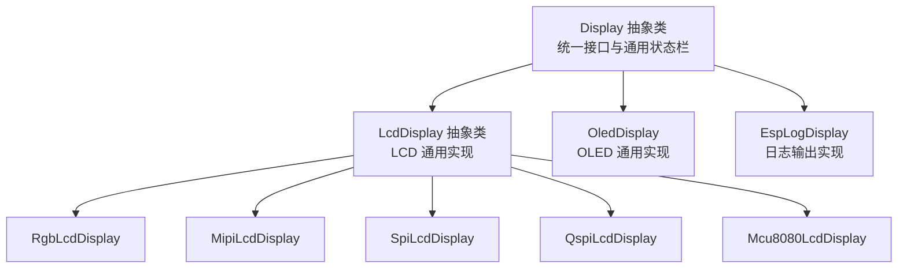
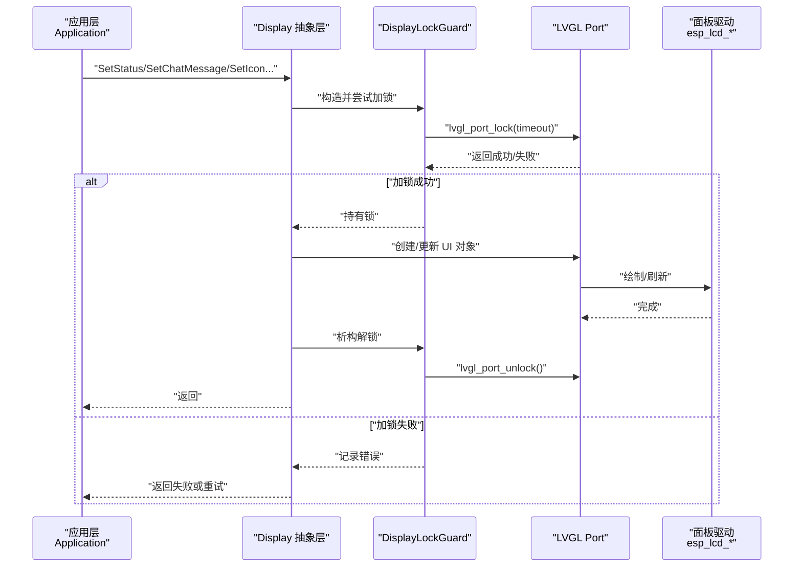
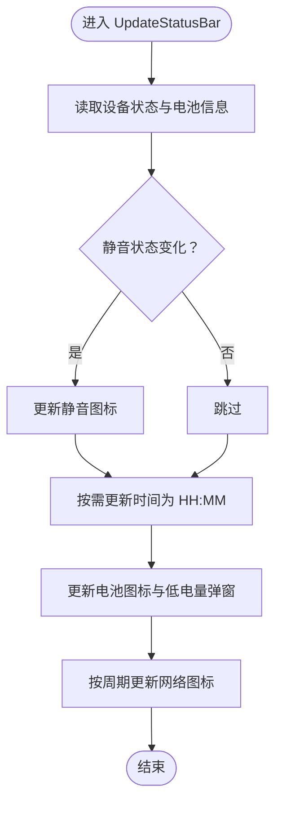
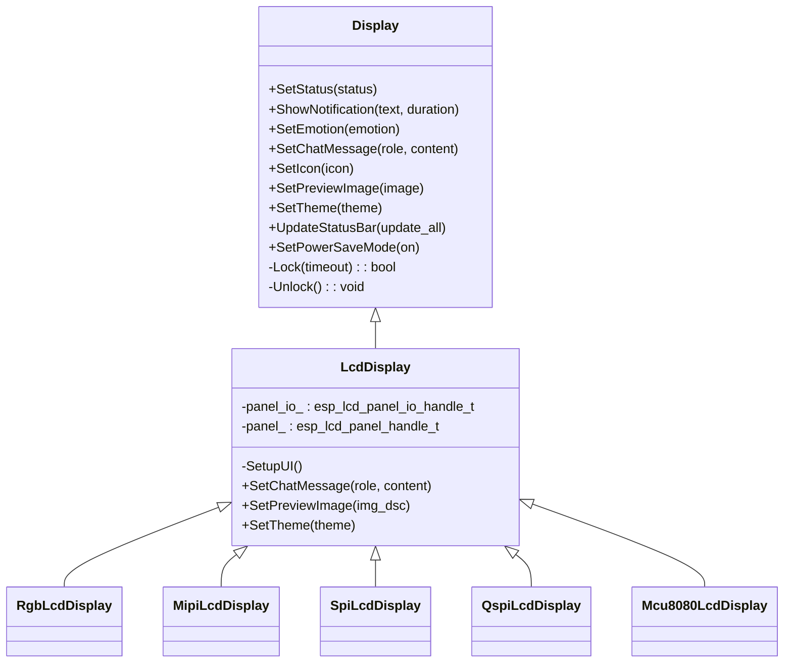
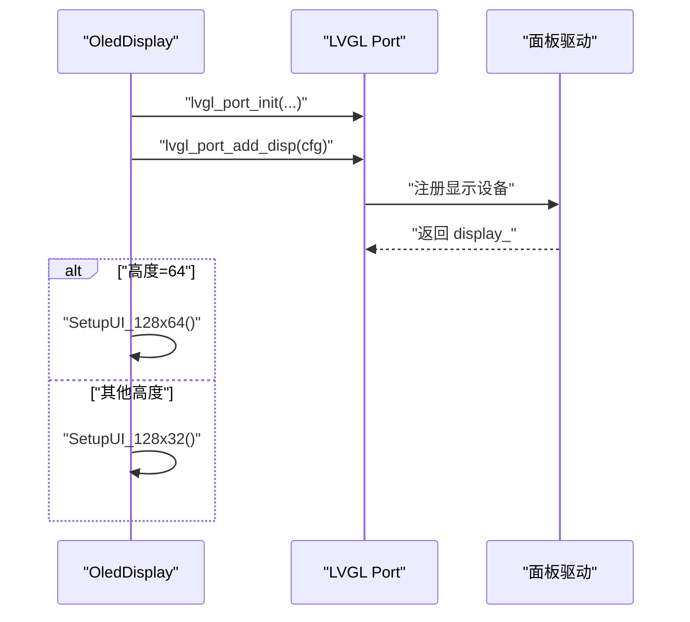
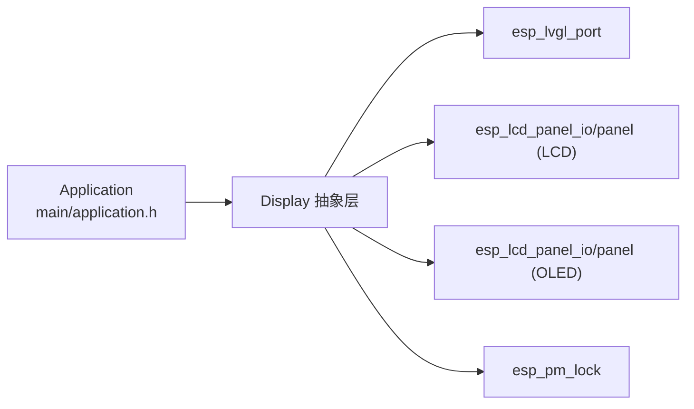

# 显示驱动抽象

<cite>
**本文引用的文件**
- [main/display/display.h](file://main/display/display.h)
- [main/display/display.cc](file://main/display/display.cc)
- [main/display/lcd_display.h](file://main/display/lcd_display.h)
- [main/display/lcd_display.cc](file://main/display/lcd_display.cc)
- [main/display/oled_display.h](file://main/display/oled_display.h)
- [main/display/oled_display.cc](file://main/display/oled_display.cc)
- [main/display/esplog_display.h](file://main/display/esplog_display.h)
- [main/display/esplog_display.cc](file://main/display/esplog_display.cc)
- [main/application.h](file://main/application.h)
</cite>

## 目录
1. [简介](#简介)
2. [项目结构](#项目结构)
3. [核心组件](#核心组件)
4. [架构总览](#架构总览)
5. [组件详解](#组件详解)
6. [依赖关系分析](#依赖关系分析)
7. [性能考量](#性能考量)
8. [故障排查指南](#故障排查指南)
9. [结论](#结论)
10. [附录：新增显示驱动开发指南](#附录新增显示驱动开发指南)

## 简介
本文件系统化阐述本项目的显示驱动抽象层设计与实现，目标是通过统一的 Display 接口屏蔽不同显示硬件（LCD、OLED、ESP32 内置日志输出）的差异，提供一致的图形渲染与状态更新能力。文档覆盖以下主题：
- 抽象接口设计理念与职责边界
- LCD（RGB/MIPI/SPI/QSPI/MCU8080）与 OLED 驱动的实现差异与共同特性
- 初始化流程、像素格式与刷新机制
- 图形渲染优化、内存管理与性能优化策略
- 兼容性处理与错误恢复
- 新增显示驱动的开发指南与最佳实践

## 项目结构
显示相关代码位于 main/display 目录，采用“抽象基类 + 多种具体实现”的分层组织：
- 抽象层：Display 提供统一接口与通用状态栏逻辑
- LCD 实现层：LcdDisplay 及其派生类（RgbLcdDisplay、MipiLcdDisplay、SpiLcdDisplay、QspiLcdDisplay、Mcu8080LcdDisplay）
- OLED 实现层：OledDisplay（支持 128x64/128x32 分辨率）
- 无显示实现：NoDisplay（用于无屏场景）
- 日志显示：EspLogDisplay（仅输出日志，不渲染图形）

**图表来源**
- [main/display/display.h](file://main/display/display.h#L18-L66)
- [main/display/lcd_display.h](file://main/display/lcd_display.h#L26-L106)
- [main/display/oled_display.h](file://main/display/oled_display.h#L9-L35)
- [main/display/esplog_display.h](file://main/display/esplog_display.h#L8-L26)

**章节来源**
- [main/display/display.h](file://main/display/display.h#L18-L66)
- [main/display/lcd_display.h](file://main/display/lcd_display.h#L26-L106)
- [main/display/oled_display.h](file://main/display/oled_display.h#L9-L35)
- [main/display/esplog_display.h](file://main/display/esplog_display.h#L8-L26)

## 核心组件
- Display 抽象类
  - 统一的 UI 更新接口：设置状态、通知、表情、聊天消息、图标、预览图、主题切换、电源省电模式
  - 通用状态栏：静音、网络、电量图标与低电量弹窗
  - 并发控制：DisplayLockGuard 与纯虚锁接口，确保 LVGL 线程安全
  - 生命周期：定时器、PM 锁、对象销毁与资源回收
- LcdDisplay 及派生类
  - 面向不同面板接口（RGB、MIPI、SPI、QSPI、MCU8080）的初始化与配置
  - 主题色与字体管理，消息气泡布局与滚动
  - 图像预览复制与内存释放回调
- OledDisplay
  - 面向单色 OLED 的 UI 构建，支持 128x64 与 128x32 两种布局
  - 左右分区布局与水平滚动字幕
- EspLogDisplay
  - 无图形渲染，仅将显示操作映射为 ESP_LOG 输出，便于调试

**章节来源**
- [main/display/display.h](file://main/display/display.h#L18-L66)
- [main/display/display.cc](file://main/display/display.cc#L17-L241)
- [main/display/lcd_display.h](file://main/display/lcd_display.h#L26-L106)
- [main/display/lcd_display.cc](file://main/display/lcd_display.cc#L70-L800)
- [main/display/oled_display.h](file://main/display/oled_display.h#L9-L35)
- [main/display/oled_display.cc](file://main/display/oled_display.cc#L16-L311)
- [main/display/esplog_display.h](file://main/display/esplog_display.h#L8-L26)
- [main/display/esplog_display.cc](file://main/display/esplog_display.cc#L8-L45)

## 架构总览
显示抽象层围绕 Display 抽象类展开，通过 LVGL Port 与底层面板驱动交互，实现跨硬件的一致渲染。

**图表来源**
- [main/display/display.cc](file://main/display/display.cc#L17-L62)
- [main/display/display.h](file://main/display/display.h#L69-L82)
- [main/display/lcd_display.cc](file://main/display/lcd_display.cc#L298-L304)
- [main/display/oled_display.cc](file://main/display/oled_display.cc#L90-L96)

## 组件详解

### Display 抽象层
- 设计要点
  - 统一接口：面向 UI 的状态更新与通知展示，避免上层关心具体硬件
  - 状态栏：静音、网络、电量图标与低电量弹窗，按需更新
  - 锁机制：DisplayLockGuard 与纯虚 Lock/Unlock，确保 LVGL 线程安全
  - 定时器：通知超时自动隐藏，PM 锁保护刷新期间 CPU 频率
- 关键流程
  - 状态更新：SetStatus/ShowNotification 切换可见性并启动一次性定时器
  - 状态栏更新：UpdateStatusBar 按设备状态与时间周期更新图标
  - 主题持久化：SetTheme 写入设置并保存当前主题名

**图表来源**
- [main/display/display.cc](file://main/display/display.cc#L93-L195)

**章节来源**
- [main/display/display.h](file://main/display/display.h#L18-L66)
- [main/display/display.cc](file://main/display/display.cc#L17-L241)

### LCD 显示驱动族
- 共同特性
  - 通过 LVGL Port 添加显示设备，支持旋转、镜像、偏移
  - 主题色与字体管理，统一的状态栏与内容区域布局
  - 聊天消息气泡样式与滚动行为，系统消息折叠策略
- 实现差异
  - RGB LCD：双缓冲、直接模式、避免撕裂标志，适合高帧率
  - MIPI LCD：DSI 配置，适合 MIPI DSI 面板
  - SPI/QSPI/MCU8080 LCD：单缓冲、DMA 缓冲、字节交换与旋转策略因接口而异
- 图像预览
  - 为避免源数据被修改，复制图像描述符与像素数据至独立内存块
  - 使用事件回调在对象删除时释放内存，防止泄漏

**图表来源**
- [main/display/display.h](file://main/display/display.h#L18-L66)
- [main/display/lcd_display.h](file://main/display/lcd_display.h#L26-L106)

**章节来源**
- [main/display/lcd_display.h](file://main/display/lcd_display.h#L26-L106)
- [main/display/lcd_display.cc](file://main/display/lcd_display.cc#L70-L800)

### OLED 显示驱动
- 特性
  - 单色显示，monochrome=true；针对 128x64 与 128x32 两套 UI 布局
  - 左侧表情区 + 右侧内容区的左右分区布局
  - 右侧内容区支持水平滚动字幕，适合长文本展示
- 初始化
  - LVGL Port 初始化与显示设备添加，设置旋转与镜像参数
  - 根据分辨率选择 UI 配置函数

**图表来源**
- [main/display/oled_display.cc](file://main/display/oled_display.cc#L16-L65)

**章节来源**
- [main/display/oled_display.h](file://main/display/oled_display.h#L9-L35)
- [main/display/oled_display.cc](file://main/display/oled_display.cc#L16-L311)

### ESP32 内置日志显示
- 用途：在无物理显示设备时，将所有显示操作映射为 ESP_LOG 输出，便于开发与调试
- 行为：忽略图形渲染，仅记录日志级别信息

**章节来源**
- [main/display/esplog_display.h](file://main/display/esplog_display.h#L8-L26)
- [main/display/esplog_display.cc](file://main/display/esplog_display.cc#L8-L45)

## 依赖关系分析
- 与 LVGL 的耦合
  - 通过 esp_lvgl_port 进行初始化、显示设备添加与 UI 更新
  - 通过 DisplayLockGuard 与 lvgl_port_lock/unlock 保证线程安全
- 与面板驱动的耦合
  - LCD 派生类依赖 esp_lcd_panel_io 与 esp_lcd_panel_ops
  - OLED 依赖 esp_lcd_panel_io 与面板句柄
- 与应用层的交互
  - UpdateStatusBar 读取 Application 与 Board 状态，驱动 UI 更新
  - 电源管理锁在刷新期间提升 CPU 频率，减少卡顿

**图表来源**
- [main/application.h](file://main/application.h#L32-L91)
- [main/display/display.cc](file://main/display/display.cc#L93-L195)
- [main/display/lcd_display.cc](file://main/display/lcd_display.cc#L106-L142)
- [main/display/oled_display.cc](file://main/display/oled_display.cc#L22-L54)

**章节来源**
- [main/application.h](file://main/application.h#L32-L91)
- [main/display/display.cc](file://main/display/display.cc#L93-L195)

## 性能考量
- 刷新与锁
  - 在 UpdateStatusBar 中使用 PM 锁保护刷新阶段，避免 CPU 降频导致掉帧
  - 通过 DisplayLockGuard 与 lvgl_port_lock/unlock 降低并发冲突
- 缓冲与像素格式
  - LCD：根据接口类型选择 DMA 缓冲、字节交换与旋转策略，RGB LCD 支持双缓冲与避免撕裂
  - OLED：monochrome=true，buffer_size=width×height，减少带宽占用
- 文本与滚动
  - 聊天消息采用弹性布局与滚动，系统消息折叠减少节点数量
  - OLED 滚动字幕通过动画配置实现平滑滚动
- 内存管理
  - 图像预览复制到独立内存块，使用 LVGL 事件回调释放，避免内存泄漏
  - 优先使用 SPIRAM 分配，失败回退到内部 RAM

**章节来源**
- [main/display/display.cc](file://main/display/display.cc#L132-L194)
- [main/display/lcd_display.cc](file://main/display/lcd_display.cc#L112-L136)
- [main/display/lcd_display.cc](file://main/display/lcd_display.cc#L629-L682)
- [main/display/oled_display.cc](file://main/display/oled_display.cc#L30-L52)

## 故障排查指南
- 无法加锁/刷新卡住
  - 检查 DisplayLockGuard 是否正确构造与析构
  - 确认 lvgl_port_lock 返回值与超时配置
- 通知未消失
  - 检查一次性定时器是否创建与启动，确认回调中隐藏通知并显示状态
- 低电量弹窗不显示
  - 确认电池状态读取与图标更新逻辑，检查弹窗对象可见性标志位
- OLED 滚动无效
  - 确认动画配置与对象样式，检查 content_right_ 是否存在
- 图像预览闪烁或崩溃
  - 检查图像数据复制与释放回调，确认内存分配成功与事件绑定

**章节来源**
- [main/display/display.cc](file://main/display/display.cc#L17-L62)
- [main/display/display.cc](file://main/display/display.cc#L76-L91)
- [main/display/lcd_display.cc](file://main/display/lcd_display.cc#L629-L682)
- [main/display/oled_display.cc](file://main/display/oled_display.cc#L180-L185)

## 结论
本显示驱动抽象层通过统一接口与 LVGL Port 解耦底层面板驱动，实现了对 LCD（RGB/MIPI/SPI/QSPI/MCU8080）与 OLED 的一致化渲染。通过主题色、字体与布局的模块化设计，配合锁机制与内存管理策略，兼顾了易用性与性能。对于新增显示硬件，建议遵循现有接口与生命周期规范，确保线程安全与资源回收。

## 附录：新增显示驱动开发指南
- 必备步骤
  - 继承 Display 或 LcdDisplay/OledDisplay，实现纯虚 Lock/Unlock
  - 在构造函数中完成 LVGL Port 初始化与显示设备添加
  - 实现 SetupUI（或对应布局函数），创建状态栏与内容区域
  - 实现 SetChatMessage/SetPreviewImage/SetTheme 等接口，遵循现有布局与主题策略
- 接口实现要求
  - 线程安全：必须通过 DisplayLockGuard 包裹 UI 更新
  - 生命周期：析构中删除 LVGL 对象与面板句柄，调用相应销毁函数
  - 资源管理：图像预览等场景需复制数据并绑定删除回调
- 图形渲染优化
  - 选择合适的缓冲策略（单/双缓冲）、旋转与镜像参数
  - OLED 场景启用 monochrome，合理设置 buffer_size
  - 控制消息数量上限，避免过度节点导致布局开销
- 兼容性与测试
  - 在不同分辨率与面板接口上验证 UI 布局与滚动效果
  - 使用 EspLogDisplay 验证日志路径与基本功能
  - 关注内存峰值与释放时机，避免碎片化

**章节来源**
- [main/display/display.h](file://main/display/display.h#L69-L82)
- [main/display/lcd_display.h](file://main/display/lcd_display.h#L46-L60)
- [main/display/lcd_display.cc](file://main/display/lcd_display.cc#L70-L212)
- [main/display/oled_display.h](file://main/display/oled_display.h#L23-L35)
- [main/display/oled_display.cc](file://main/display/oled_display.cc#L16-L96)
- [main/display/esplog_display.h](file://main/display/esplog_display.h#L23-L26)