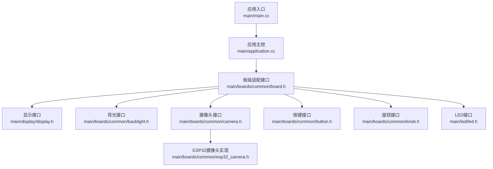
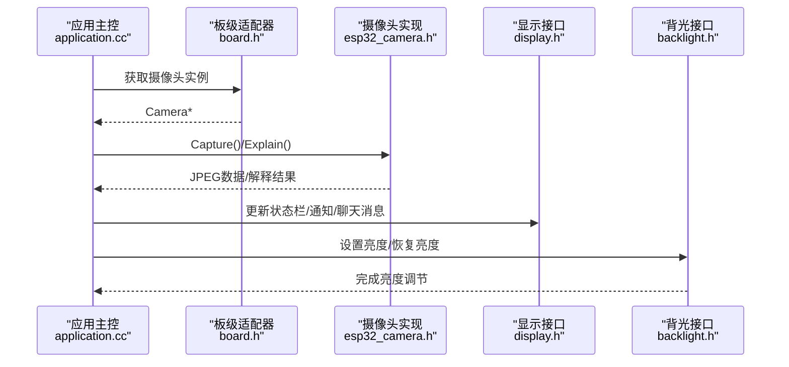
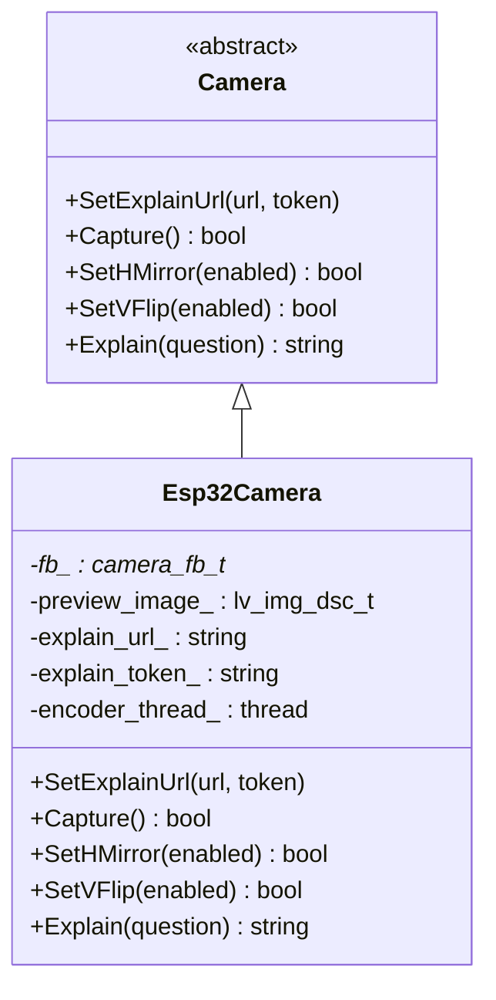
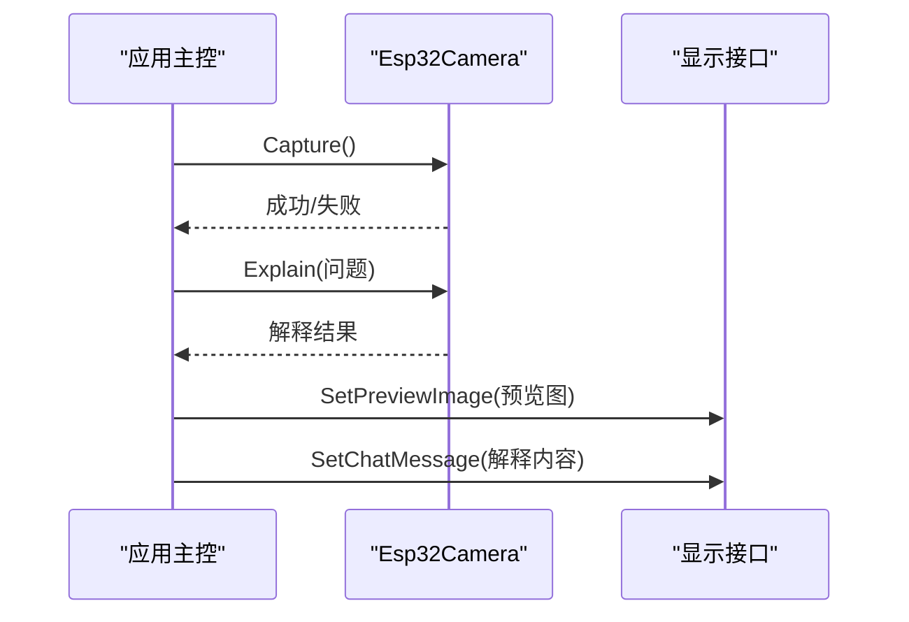
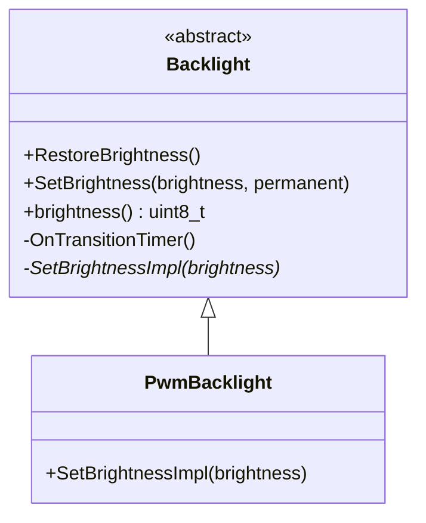
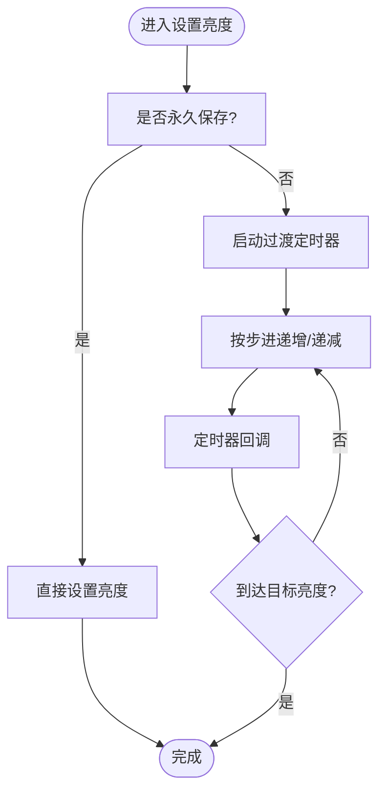
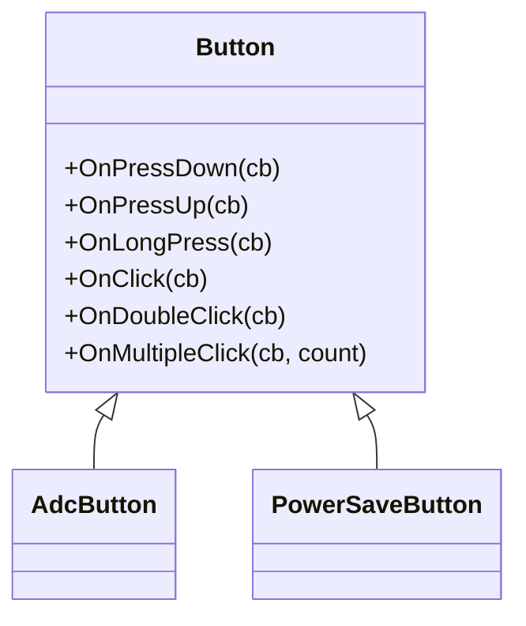
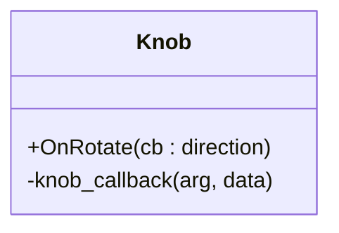
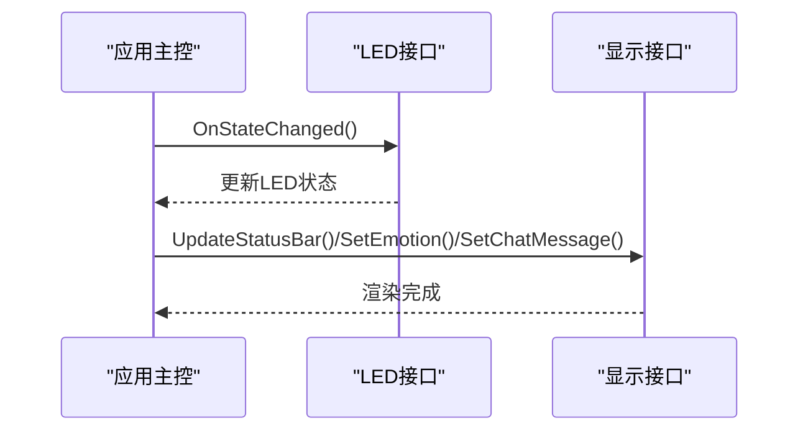
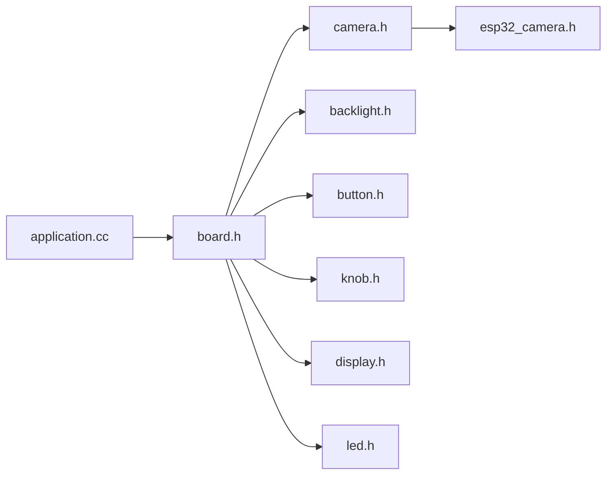

# 特殊外设支持

<cite>
**本文引用的文件**
- [main.cc](file://main/main.cc)
- [application.cc](file://main/application.cc)
- [device_state.h](file://main/device_state.h)
- [board.h](file://main/boards/common/board.h)
- [display.h](file://main/display/display.h)
- [camera.h](file://main/boards/common/camera.h)
- [esp32_camera.h](file://main/boards/common/esp32_camera.h)
- [backlight.h](file://main/boards/common/backlight.h)
- [button.h](file://main/boards/common/button.h)
- [knob.h](file://main/boards/common/knob.h)
- [led.h](file://main/led/led.h)
</cite>

## 目录
1. [简介](#简介)
2. [项目结构](#项目结构)
3. [核心组件](#核心组件)
4. [架构总览](#架构总览)
5. [详细组件分析](#详细组件分析)
6. [依赖关系分析](#依赖关系分析)
7. [性能考虑](#性能考虑)
8. [故障排查指南](#故障排查指南)
9. [结论](#结论)
10. [附录：新增外设开发指南](#附录新增外设开发指南)

## 简介
本文件面向“特殊外设支持”的技术文档，聚焦于以下四类外设的抽象与实现：
- 摄像头：图像采集、格式转换（JPEG）、远程解释调用、预览与存储管理
- 背光控制：亮度调节、过渡动画、自动感应与节能
- 按键：事件回调（按下/抬起/长按/单击/双击/多击）
- 旋钮：旋转事件、方向判断、低功耗模式

文档从系统架构、数据流、处理逻辑、错误处理与性能优化等维度进行深入解析，并提供新增外设支持的开发指南与最佳实践。

## 项目结构
围绕“特殊外设”，代码主要分布在如下层次：
- 应用入口与主循环：负责系统初始化、协议栈启动、状态机驱动与事件调度
- 板级适配层：统一对外提供显示、音频、网络、背光、摄像头、按键、旋钮等能力
- 外设抽象接口：定义统一的虚接口，屏蔽底层硬件差异
- 具体实现：基于ESP-IDF与第三方组件（如摄像头、按钮、旋钮）的具体实现

图表来源
- [main.cc](file://main/main.cc#L1-L32)
- [application.cc](file://main/application.cc#L328-L512)
- [board.h](file://main/boards/common/board.h#L18-L53)
- [display.h](file://main/display/display.h#L18-L66)
- [backlight.h](file://main/boards/common/backlight.h#L10-L36)
- [camera.h](file://main/boards/common/camera.h#L6-L13)
- [esp32_camera.h](file://main/boards/common/esp32_camera.h#L19-L37)
- [button.h](file://main/boards/common/button.h#L11-L34)
- [knob.h](file://main/boards/common/knob.h#L9-L23)
- [led.h](file://main/led/led.h#L4-L9)

章节来源
- [main.cc](file://main/main.cc#L1-L32)
- [application.cc](file://main/application.cc#L328-L512)
- [board.h](file://main/boards/common/board.h#L18-L53)

## 核心组件
- 设备状态机：统一的状态枚举与状态切换逻辑，贯穿显示、音频、网络与外设行为
- 板级适配器：集中提供背光、摄像头、按键、旋钮、LED等能力的访问点
- 显示子系统：状态栏、通知、表情、聊天消息与主题管理
- 摄像头子系统：基于ESP32-camera的采集、JPEG编码、远程解释调用
- 背光子系统：PWM亮度控制与渐变过渡
- 输入子系统：按键与旋钮事件分发与回调
- LED指示：根据设备状态变化更新LED行为

章节来源
- [device_state.h](file://main/device_state.h#L4-L16)
- [board.h](file://main/boards/common/board.h#L39-L52)
- [display.h](file://main/display/display.h#L18-L66)
- [camera.h](file://main/boards/common/camera.h#L6-L13)
- [esp32_camera.h](file://main/boards/common/esp32_camera.h#L19-L37)
- [backlight.h](file://main/boards/common/backlight.h#L10-L36)
- [button.h](file://main/boards/common/button.h#L11-L34)
- [knob.h](file://main/boards/common/knob.h#L9-L23)
- [led.h](file://main/led/led.h#L4-L9)

## 架构总览
应用通过事件组驱动主循环，按需调度音频发送队列、唤醒词检测、VAD变化与协议交互；同时通过Board统一访问各外设能力。摄像头在采集后可进行JPEG编码并通过线程异步处理；背光与按键/旋钮分别由独立组件提供。

图表来源
- [application.cc](file://main/application.cc#L328-L512)
- [board.h](file://main/boards/common/board.h#L44-L44)
- [esp32_camera.h](file://main/boards/common/esp32_camera.h#L28-L37)
- [display.h](file://main/display/display.h#L23-L32)
- [backlight.h](file://main/boards/common/backlight.h#L15-L26)

## 详细组件分析

### 摄像头模块
- 抽象接口
  - 统一接口定义了设置解释服务地址、抓拍、水平镜像、垂直翻转、远程解释等方法
- 实现要点
  - 基于ESP32-camera驱动，使用帧缓冲区与JPEG编码
  - 提供预览图像结构体用于LVGL显示
  - 解释服务URL与Token可配置，便于对接云端视觉服务
- 数据流
  - 采集 -> 编码 -> 异步线程处理 -> 可选解释调用 -> 结果返回
- 存储与预览
  - 使用帧缓冲与LVGL图像描述符，便于UI预览与后续持久化扩展

图表来源
- [camera.h](file://main/boards/common/camera.h#L6-L13)
- [esp32_camera.h](file://main/boards/common/esp32_camera.h#L19-L37)

章节来源
- [camera.h](file://main/boards/common/camera.h#L6-L13)
- [esp32_camera.h](file://main/boards/common/esp32_camera.h#L19-L37)

#### 摄像头工作流程（序列图）

图表来源
- [application.cc](file://main/application.cc#L408-L496)
- [esp32_camera.h](file://main/boards/common/esp32_camera.h#L32-L36)
- [display.h](file://main/display/display.h#L29-L29)

### 背光控制
- 抽象接口
  - 支持恢复亮度、设置目标亮度、查询当前亮度
- 实现要点
  - PWM背光类封装GPIO与频率参数，提供底层亮度写入
  - 内置过渡定时器，实现平滑亮度变化，避免闪烁
- 节能策略
  - 在空闲或待机状态下降低亮度，结合系统电源管理模式

图表来源
- [backlight.h](file://main/boards/common/backlight.h#L10-L36)

章节来源
- [backlight.h](file://main/boards/common/backlight.h#L10-L36)

#### 背光亮度调节流程（流程图）

图表来源
- [backlight.h](file://main/boards/common/backlight.h#L15-L27)

### 按键输入设备
- 接口能力
  - 支持按下/抬起/长按/单击/双击/多次点击事件注册
  - 支持ADC按键与GPIO按键两种接入方式
  - 支持低功耗按键封装
- 事件模型
  - 通过句柄与回调函数绑定，事件触发时执行对应回调
- 去抖动与组合
  - 由底层组件提供去抖动与计数逻辑，上层仅需注册回调

图表来源
- [button.h](file://main/boards/common/button.h#L11-L47)

章节来源
- [button.h](file://main/boards/common/button.h#L11-L47)

### 旋钮输入设备
- 接口能力
  - 通过两路GPIO引脚检测旋转方向
  - 回调提供旋转方向布尔值
- 低功耗
  - 旋钮组件可配合低功耗模式使用，减少无效轮询

图表来源
- [knob.h](file://main/boards/common/knob.h#L9-L23)

章节来源
- [knob.h](file://main/boards/common/knob.h#L9-L23)

### 显示与LED联动
- 显示接口
  - 状态栏、通知、表情、聊天消息、主题切换、电源管理
- LED联动
  - 设备状态变化时触发LED行为更新，形成视觉反馈

图表来源
- [application.cc](file://main/application.cc#L647-L694)
- [display.h](file://main/display/display.h#L23-L32)
- [led.h](file://main/led/led.h#L7-L8)

章节来源
- [display.h](file://main/display/display.h#L18-L66)
- [led.h](file://main/led/led.h#L4-L9)
- [application.cc](file://main/application.cc#L647-L694)

## 依赖关系分析
- 应用层依赖板级适配器，板级适配器再依赖具体外设实现
- 摄像头实现依赖ESP32-camera与LVGL图像描述符
- 背光实现依赖GPIO与定时器
- 按键与旋钮依赖ESP-IDF按钮与旋钮组件
- 显示与LED作为外部输出，受应用状态机驱动

图表来源
- [application.cc](file://main/application.cc#L328-L512)
- [board.h](file://main/boards/common/board.h#L18-L53)
- [camera.h](file://main/boards/common/camera.h#L6-L13)
- [esp32_camera.h](file://main/boards/common/esp32_camera.h#L19-L37)
- [backlight.h](file://main/boards/common/backlight.h#L10-L36)
- [button.h](file://main/boards/common/button.h#L11-L47)
- [knob.h](file://main/boards/common/knob.h#L9-L23)
- [display.h](file://main/display/display.h#L18-L66)
- [led.h](file://main/led/led.h#L4-L9)

章节来源
- [application.cc](file://main/application.cc#L328-L512)
- [board.h](file://main/boards/common/board.h#L18-L53)

## 性能考虑
- 摄像头
  - 采用异步编码线程，避免阻塞主事件循环
  - JPEG分块传输与远程解释调用应限制并发，防止内存峰值过高
- 背光
  - 过渡定时器步进应平衡响应速度与平滑度，避免频繁中断
- 按键/旋钮
  - 事件回调尽量轻量，复杂处理放入任务队列
- 显示
  - 批量更新状态栏与通知，减少LVGL刷新次数
- 电源管理
  - 在空闲态降低背光、关闭非必要外设、启用低功耗模式

## 故障排查指南
- 摄像头无图像/卡顿
  - 检查摄像头初始化参数与I2C/SPI连接
  - 关注JPEG编码线程是否异常退出
- 背光不生效/闪烁
  - 检查PWM频率与占空比范围，确认GPIO配置
  - 观察过渡定时器是否被其他任务抢占
- 按键无响应/误触
  - 校验去抖参数与上下拉电阻
  - 确认回调注册与中断优先级
- 旋钮方向异常
  - 校验A/B相引脚接线与顺序
- 显示渲染卡顿
  - 减少频繁的文本/图片更新，合并UI更新批次

## 结论
该系统通过清晰的抽象接口与板级适配层，实现了对摄像头、背光、按键、旋钮等特殊外设的统一接入与控制。应用主循环以事件驱动的方式协调外设行为，配合状态机与显示/LED联动，提供了良好的用户体验。针对性能与可靠性，建议在异步处理、资源池化、电源管理等方面持续优化。

## 附录：新增外设开发指南
- 接口实现要求
  - 在板级适配器中声明并实现外设访问方法
  - 对外提供统一的抽象接口（参考现有Camera/Button/Knob等）
  - 将外设能力注册到Board接口，确保GetXXX()可用
- 硬件集成规范
  - 明确引脚分配、供电与信号电平
  - 遵循低功耗设计，必要时提供休眠/唤醒回调
- 事件与状态联动
  - 将外设事件接入应用事件组或回调，驱动状态机与显示更新
- 性能与可靠性
  - 异步处理耗时操作（如图像编码、网络请求）
  - 加入超时与重试机制，避免阻塞主循环
  - 提供最小可用配置与默认参数，便于快速验证