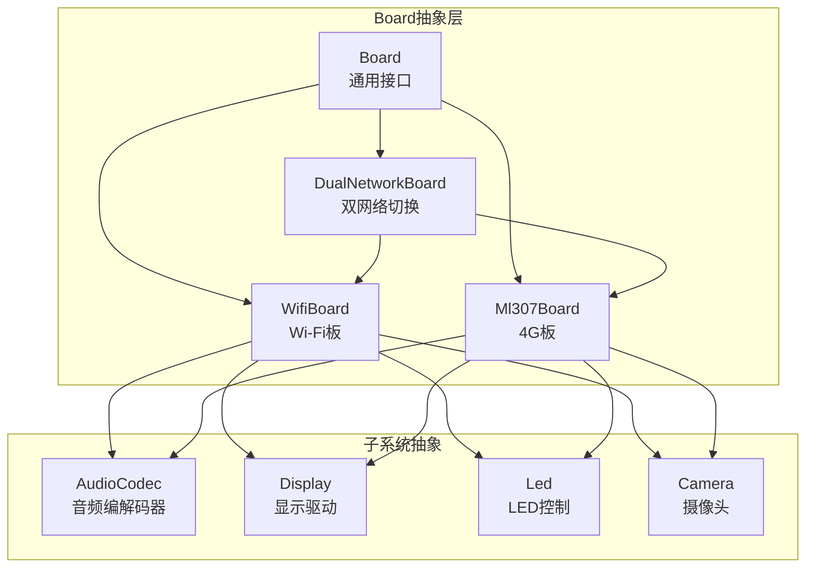
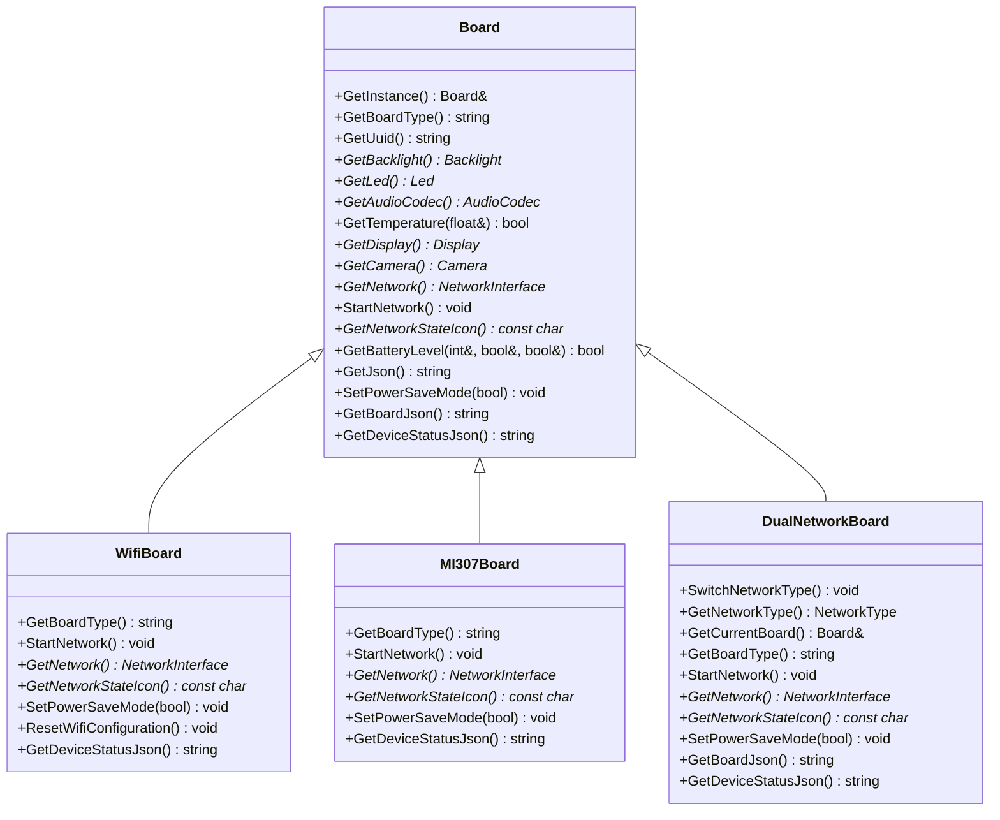
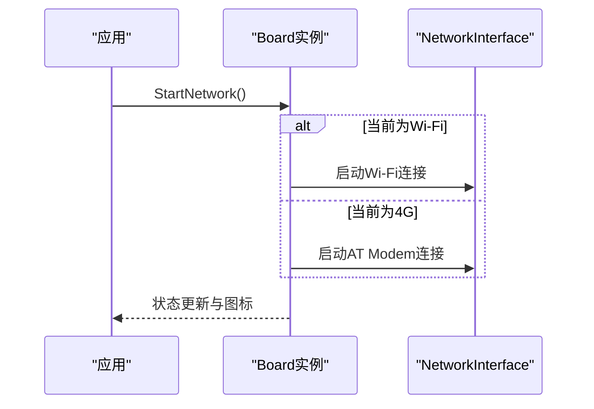
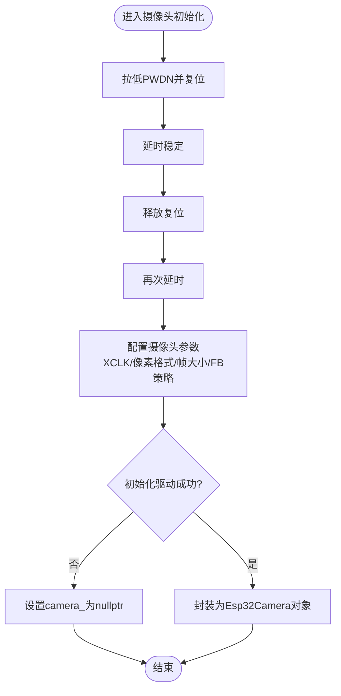
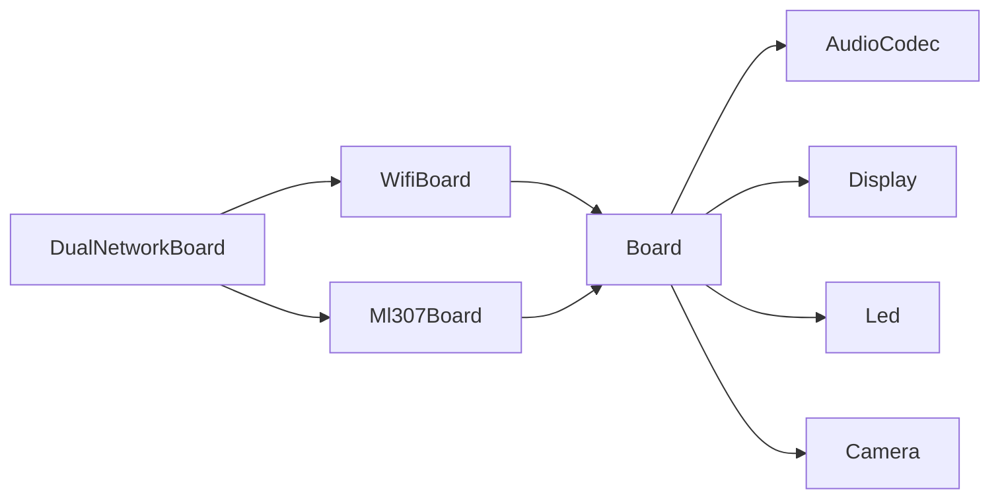

# 硬件抽象层

<cite>
**本文引用的文件**
- [main/boards/common/board.h](file://main/boards/common/board.h)
- [main/boards/common/board.cc](file://main/boards/common/board.cc)
- [main/boards/common/wifi_board.h](file://main/boards/common/wifi_board.h)
- [main/boards/common/ml307_board.h](file://main/boards/common/ml307_board.h)
- [main/boards/common/dual_network_board.h](file://main/boards/common/dual_network_board.h)
- [main/boards/atk-dnesp32s3/atk_dnesp32s3.cc](file://main/boards/atk-dnesp32s3/atk_dnesp32s3.cc)
- [main/boards/bread-compact-wifi/compact_wifi_board.cc](file://main/boards/bread-compact-wifi/compact_wifi_board.cc)
- [main/boards/magiclick-2p4/magiclick_2p4_board.cc](file://main/boards/magiclick-2p4/magiclick_2p4_board.cc)
- [main/boards/README.md](file://main/boards/README.md)
- [main/audio/audio_codec.h](file://main/audio/audio_codec.h)
- [main/display/display.h](file://main/display/display.h)
- [main/led/led.h](file://main/led/led.h)
- [main/boards/common/camera.h](file://main/boards/common/camera.h)
- [main/boards/common/esp32_camera.h](file://main/boards/common/esp32_camera.h)
- [main/boards/common/esp32_camera.cc](file://main/boards/common/esp32_camera.cc)
</cite>

## 目录
1. [简介](#简介)
2. [项目结构](#项目结构)
3. [核心组件](#核心组件)
4. [架构总览](#架构总览)
5. [详细组件分析](#详细组件分析)
6. [依赖分析](#依赖分析)
7. [性能考虑](#性能考虑)
8. [故障排查指南](#故障排查指南)
9. [结论](#结论)
10. [附录](#附录)

## 简介
本文件系统化阐述该仓库的硬件抽象层设计与实现，重点围绕Board抽象接口如何统一适配70+种不同开发板，涵盖通用硬件接口、音频编解码器抽象、显示驱动抽象、网络接口抽象等，并结合ESP32-CAM摄像头、触摸屏、LED控制等特殊功能的实现进行深入分析。同时提供开发新硬件支持的流程、最佳实践及硬件配置文件格式与引脚定义规范。

## 项目结构
硬件抽象层采用“Board基类 + 多种具体Board派生类”的层次化组织方式，配合音频、显示、LED、摄像头等子系统的抽象接口，形成可扩展、可维护的硬件适配框架。各开发板的实现位于独立目录，遵循统一的配置与初始化规范。

**图表来源**
- [main/boards/common/board.h](file://main/boards/common/board.h#L18-L53)
- [main/boards/common/wifi_board.h](file://main/boards/common/wifi_board.h#L6-L22)
- [main/boards/common/ml307_board.h](file://main/boards/common/ml307_board.h#L9-L27)
- [main/boards/common/dual_network_board.h](file://main/boards/common/dual_network_board.h#L16-L57)

**章节来源**
- [main/boards/common/board.h](file://main/boards/common/board.h#L1-L61)
- [main/boards/common/wifi_board.h](file://main/boards/common/wifi_board.h#L1-L25)
- [main/boards/common/ml307_board.h](file://main/boards/common/ml307_board.h#L1-L30)
- [main/boards/common/dual_network_board.h](file://main/boards/common/dual_network_board.h#L1-L59)

## 核心组件
- Board抽象接口：提供统一的硬件能力查询与获取方法，包括音频编解码器、显示、LED、摄像头、网络、温度、电量等；并提供静态单例入口与JSON信息导出。
- WifiBoard/Ml307Board/DualNetworkBoard：按网络类型细分的Board派生类，分别封装Wi-Fi与4G网络接入能力与切换逻辑。
- AudioCodec：音频编解码器抽象，统一输入/输出音量、采样率、通道等属性与数据流控制。
- Display：显示抽象，统一状态栏、通知、主题、省电模式等UI行为。
- Led/Camera：LED与摄像头抽象，便于不同硬件平台的替换与扩展。
- 开发板实现：每个具体开发板在各自目录下实现Board派生类，完成I2C/SPI/I2S等外设初始化与能力装配。

**章节来源**
- [main/boards/common/board.h](file://main/boards/common/board.h#L18-L53)
- [main/boards/common/board.cc](file://main/boards/common/board.cc#L14-L67)
- [main/audio/audio_codec.h](file://main/audio/audio_codec.h#L18-L57)
- [main/display/display.h](file://main/display/display.h#L18-L66)
- [main/led/led.h](file://main/led/led.h#L4-L15)
- [main/boards/common/camera.h](file://main/boards/common/camera.h#L6-L13)

## 架构总览
Board抽象层通过工厂式单例GetInstance()获取当前设备实例，各派生类重写GetAudioCodec()/GetDisplay()/GetCamera()/GetNetwork()等虚函数，向应用层暴露一致的硬件能力。网络层支持Wi-Fi、4G与双网络切换；音频层支持多种编解码器；显示层支持LCD/OLED等多种面板；摄像头层支持ESP32-CAM等模块。

**图表来源**
- [main/boards/common/board.h](file://main/boards/common/board.h#L18-L53)
- [main/boards/common/wifi_board.h](file://main/boards/common/wifi_board.h#L6-L22)
- [main/boards/common/ml307_board.h](file://main/boards/common/ml307_board.h#L9-L27)
- [main/boards/common/dual_network_board.h](file://main/boards/common/dual_network_board.h#L16-L57)

## 详细组件分析

### Board抽象接口与单例机制
- 设计要点
  - 提供静态GetInstance()返回全局唯一Board实例，通过create_board()工厂函数创建具体Board类型。
  - 统一的硬件能力查询接口，如GetAudioCodec()/GetDisplay()/GetCamera()/GetNetwork()等。
  - 生成并持久化UUID，用于设备唯一标识与OTA通道隔离。
  - 默认空实现（如NoDisplay/NoLed）保证未配置硬件时的健壮性。
- 关键实现路径
  - 工厂与单例：[main/boards/common/board.h](file://main/boards/common/board.h#L15-L34)
  - UUID生成与持久化：[main/boards/common/board.cc](file://main/boards/common/board.cc#L14-L45)
  - 默认显示与LED回退：[main/boards/common/board.cc](file://main/boards/common/board.cc#L55-L67)
  - 设备信息JSON拼装：[main/boards/common/board.cc](file://main/boards/common/board.cc#L69-L162)

**章节来源**
- [main/boards/common/board.h](file://main/boards/common/board.h#L15-L53)
- [main/boards/common/board.cc](file://main/boards/common/board.cc#L14-L162)

### 网络抽象与多网络支持
- WifiBoard
  - 提供Wi-Fi启动、网络状态图标、设备状态JSON等能力。
  - 作为大多数Wi-Fi开发板的基础。
- Ml307Board
  - 基于AT指令的4G模块接入，封装AT调制解调器与GPIO引脚配置。
- DualNetworkBoard
  - 在Wi-Fi与4G之间动态切换，支持从Settings加载默认网络类型并持久化切换结果。
  - 通过组合当前活动Board实例委派所有Board接口调用。

**图表来源**
- [main/boards/common/wifi_board.h](file://main/boards/common/wifi_board.h#L14-L18)
- [main/boards/common/ml307_board.h](file://main/boards/common/ml307_board.h#L20-L26)
- [main/boards/common/dual_network_board.h](file://main/boards/common/dual_network_board.h#L33-L56)

**章节来源**
- [main/boards/common/wifi_board.h](file://main/boards/common/wifi_board.h#L1-L25)
- [main/boards/common/ml307_board.h](file://main/boards/common/ml307_board.h#L1-L30)
- [main/boards/common/dual_network_board.h](file://main/boards/common/dual_network_board.h#L1-L59)

### 音频编解码器抽象与实现
- 抽象接口
  - 统一的输入/输出使能、音量控制、采样率与通道查询。
  - 输入/输出数据缓冲接口，支持阻塞/非阻塞读写。
- 常见实现
  - ES8311/ES8388等I2C驱动编解码器，配合I2S收发通道。
  - 无音频场景下的占位实现（如NoAudioCodec）。
- 关键实现路径
  - 抽象接口：[main/audio/audio_codec.h](file://main/audio/audio_codec.h#L18-L57)

**章节来源**
- [main/audio/audio_codec.h](file://main/audio/audio_codec.h#L18-L57)

### 显示驱动抽象与多屏适配
- 抽象接口
  - 统一的状态栏、通知、表情、聊天消息、主题切换与省电模式。
  - 屏幕尺寸、锁定/解锁机制，保障LVGL渲染线程安全。
- 常见实现
  - LCD（SPI/QSPI）、OLED（I2C）等面板驱动。
  - NV3023、ST7789、ILI9341等面板适配。
- 关键实现路径
  - 抽象接口：[main/display/display.h](file://main/display/display.h#L18-L66)
  - 示例：NV3023自定义显示类与样式覆盖（magiclick_2p4）：[main/boards/magiclick-2p4/magiclick_2p4_board.cc](file://main/boards/magiclick-2p4/magiclick_2p4_board.cc#L25-L58)

**章节来源**
- [main/display/display.h](file://main/display/display.h#L18-L66)
- [main/boards/magiclick-2p4/magiclick_2p4_board.cc](file://main/boards/magiclick-2p4/magiclick_2p4_board.cc#L25-L58)

### LED控制抽象与多形态支持
- 抽象接口
  - Led::OnStateChanged根据设备状态切换LED行为。
  - NoLed为空实现，避免无LED硬件时的异常。
- 常见实现
  - 单LED、环形灯带等不同形态。
- 关键实现路径
  - 抽象接口：[main/led/led.h](file://main/led/led.h#L4-L15)

**章节来源**
- [main/led/led.h](file://main/led/led.h#L4-L15)

### 摄像头抽象与ESP32-CAM适配
- 抽象接口
  - 拍照、镜像翻转、解释接口（与视觉问答服务对接）。
- ESP32-CAM适配
  - 通过esp32_camera驱动初始化OV2640等常见摄像头，支持PSRAM帧缓存与抓拍队列。
  - 与XL9555等GPIO扩展器协作控制PWDN/RESET等信号。
- 关键实现路径
  - 抽象接口：[main/boards/common/camera.h](file://main/boards/common/camera.h#L6-L13)
  - ESP32-CAM封装：[main/boards/common/esp32_camera.h](file://main/boards/common/esp32_camera.h)
  - ESP32-CAM封装：[main/boards/common/esp32_camera.cc](file://main/boards/common/esp32_camera.cc)
  - AT-KDN开发板摄像头初始化与XL9555控制：[main/boards/atk-dnesp32s3/atk_dnesp32s3.cc](file://main/boards/atk-dnesp32s3/atk_dnesp32s3.cc#L146-L201)

**图表来源**
- [main/boards/atk-dnesp32s3/atk_dnesp32s3.cc](file://main/boards/atk-dnesp32s3/atk_dnesp32s3.cc#L146-L201)
- [main/boards/common/esp32_camera.cc](file://main/boards/common/esp32_camera.cc)

**章节来源**
- [main/boards/common/camera.h](file://main/boards/common/camera.h#L6-L13)
- [main/boards/common/esp32_camera.h](file://main/boards/common/esp32_camera.h)
- [main/boards/common/esp32_camera.cc](file://main/boards/common/esp32_camera.cc)
- [main/boards/atk-dnesp32s3/atk_dnesp32s3.cc](file://main/boards/atk-dnesp32s3/atk_dnesp32s3.cc#L146-L201)

### 开发新硬件支持指南与最佳实践
- 目录结构与文件职责
  - xxx_board.cc：板级初始化与能力装配
  - config.h：硬件引脚与参数配置
  - config.json：目标芯片与编译构建配置
- 开发步骤
  1) 新建开发板目录与文件
  2) 在config.h中定义I2C/I2S/SPI/按键/背光/摄像头等引脚与参数
  3) 在xxx_board.cc中继承合适的Board基类（如WifiBoard/Ml307Board），实现初始化与虚函数重写
  4) 使用DECLARE_BOARD注册开发板
  5) 通过config.json配置目标芯片与分区表等构建参数
- 最佳实践
  - 参考相似开发板实现，分步调试（先显示后音频/网络）
  - 管脚映射务必与硬件原理图一致，注意电平与复用功能
  - 注意OTA升级通道唯一性，避免覆盖标准固件
- 关键实现路径
  - 开发指南与模板：[main/boards/README.md](file://main/boards/README.md#L1-L335)
  - 示例：AT-KDN开发板完整实现（含摄像头、I2C、SPI、背光、LED）：[main/boards/atk-dnesp32s3/atk_dnesp32s3.cc](file://main/boards/atk-dnesp32s3/atk_dnesp32s3.cc#L51-L244)
  - 示例：紧凑型Wi-Fi开发板（OLED、按键、音量控制）：[main/boards/bread-compact-wifi/compact_wifi_board.cc](file://main/boards/bread-compact-wifi/compact_wifi_board.cc#L28-L193)
  - 示例：Magiclick 2.4寸屏（NV3023、ES8311、环形LED、电源管理与省电定时器）：[main/boards/magiclick-2p4/magiclick_2p4_board.cc](file://main/boards/magiclick-2p4/magiclick_2p4_board.cc#L60-L281)

**章节来源**
- [main/boards/README.md](file://main/boards/README.md#L1-L335)
- [main/boards/atk-dnesp32s3/atk_dnesp32s3.cc](file://main/boards/atk-dnesp32s3/atk_dnesp32s3.cc#L51-L244)
- [main/boards/bread-compact-wifi/compact_wifi_board.cc](file://main/boards/bread-compact-wifi/compact_wifi_board.cc#L28-L193)
- [main/boards/magiclick-2p4/magiclick_2p4_board.cc](file://main/boards/magiclick-2p4/magiclick_2p4_board.cc#L60-L281)

## 依赖分析
- 组件耦合
  - Board派生类依赖AudioCodec/Display/Led/Camera等抽象接口，降低对具体驱动的耦合。
  - DualNetworkBoard通过组合当前活动Board委派所有接口，实现运行时网络切换。
- 外部依赖
  - ESP-IDF驱动（I2C/I2S/SPI/LCD等）
  - 第三方显示库（LVGL）
  - 摄像头驱动（esp32-camera）
- 潜在风险
  - 引脚冲突与复用冲突
  - DMA与PSRAM占用导致的内存压力
  - 不同编解码器/面板驱动的兼容性差异

**图表来源**
- [main/boards/common/board.h](file://main/boards/common/board.h#L18-L53)
- [main/boards/common/wifi_board.h](file://main/boards/common/wifi_board.h#L6-L22)
- [main/boards/common/ml307_board.h](file://main/boards/common/ml307_board.h#L9-L27)
- [main/boards/common/dual_network_board.h](file://main/boards/common/dual_network_board.h#L16-L57)

**章节来源**
- [main/boards/common/board.h](file://main/boards/common/board.h#L18-L53)
- [main/boards/common/wifi_board.h](file://main/boards/common/wifi_board.h#L6-L22)
- [main/boards/common/ml307_board.h](file://main/boards/common/ml307_board.h#L9-L27)
- [main/boards/common/dual_network_board.h](file://main/boards/common/dual_network_board.h#L16-L57)

## 性能考虑
- 音频
  - 合理设置采样率与DMA帧数，避免CPU占用过高；根据编解码器能力选择I2S参数。
- 显示
  - 使用DisplayLockGuard保护渲染临界区；在省电模式下降低刷新频率与背光亮度。
- 摄像头
  - 优先使用PSRAM帧缓存；合理设置帧大小与抓拍策略；避免高分辨率长时间连续采集。
- 网络
  - 双网络切换时及时释放旧连接资源；在4G场景下关注AT命令响应时延与错误重试。

## 故障排查指南
- 显示屏不亮/花屏
  - 检查SPI/I2C引脚、面板驱动型号、颜色顺序、镜像与旋转参数。
- 音频无声/杂音
  - 检查I2S引脚、编解码器地址、PA使能、音量与采样率配置。
- 摄像头无图像
  - 检查PWDN/RESET控制、XCLK频率、像素格式与PSRAM启用。
- 无法联网
  - 检查Wi-Fi凭证、4G模块供电与AT指令链路、双网络切换逻辑。
- OTA升级失败
  - 确认UUID唯一性与对应分区表；避免覆盖标准固件通道。

**章节来源**
- [main/boards/README.md](file://main/boards/README.md#L324-L329)

## 结论
该硬件抽象层通过Board抽象接口与多层派生类，有效屏蔽底层硬件差异，实现对70+开发板的统一适配。配合音频、显示、LED、摄像头等子系统抽象，开发者可快速移植与扩展新硬件。建议在新硬件开发中严格遵循配置文件规范与引脚定义，分步验证关键功能，并充分利用默认回退实现与日志定位问题。

## 附录

### 硬件配置文件格式与引脚定义规范
- config.h
  - 定义I2S/I2C/SPI引脚、编解码器地址、按键/LED/背光/摄像头等引脚与参数。
  - 示例参考：[main/boards/README.md](file://main/boards/README.md#L32-L86)
- config.json
  - 指定目标芯片型号与构建参数（如分区表、闪存大小等）。
  - 示例参考：[main/boards/README.md](file://main/boards/README.md#L88-L106)
- 开发板实现
  - 在xxx_board.cc中继承合适基类，完成外设初始化与虚函数重写。
  - 示例参考：
    - AT-KDN开发板：[main/boards/atk-dnesp32s3/atk_dnesp32s3.cc](file://main/boards/atk-dnesp32s3/atk_dnesp32s3.cc#L51-L244)
    - 紧凑型Wi-Fi开发板：[main/boards/bread-compact-wifi/compact_wifi_board.cc](file://main/boards/bread-compact-wifi/compact_wifi_board.cc#L28-L193)
    - Magiclick 2.4寸屏：[main/boards/magiclick-2p4/magiclick_2p4_board.cc](file://main/boards/magiclick-2p4/magiclick_2p4_board.cc#L60-L281)

**章节来源**
- [main/boards/README.md](file://main/boards/README.md#L32-L106)
- [main/boards/atk-dnesp32s3/atk_dnesp32s3.cc](file://main/boards/atk-dnesp32s3/atk_dnesp32s3.cc#L51-L244)
- [main/boards/bread-compact-wifi/compact_wifi_board.cc](file://main/boards/bread-compact-wifi/compact_wifi_board.cc#L28-L193)
- [main/boards/magiclick-2p4/magiclick_2p4_board.cc](file://main/boards/magiclick-2p4/magiclick_2p4_board.cc#L60-L281)