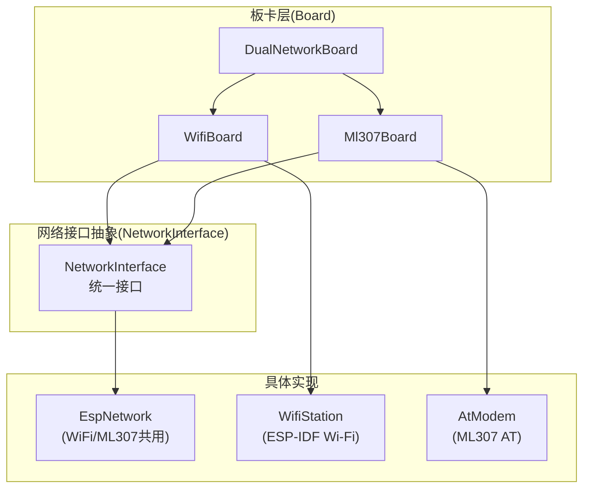
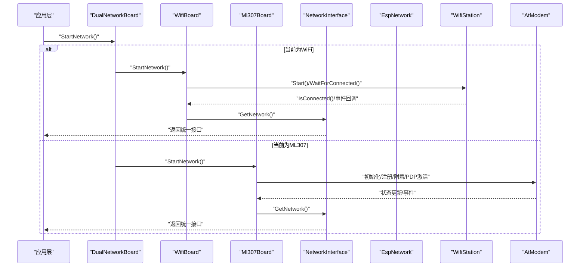
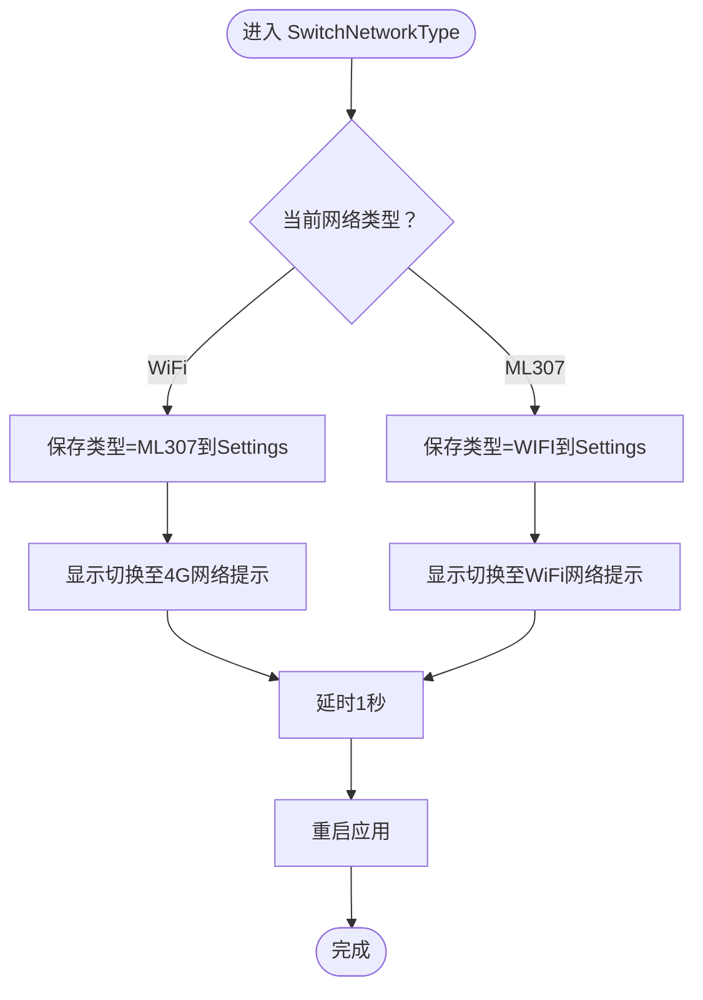
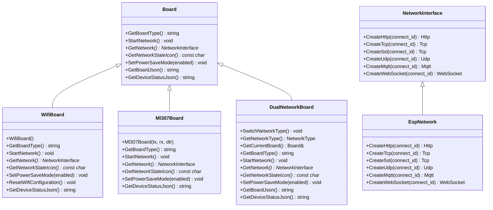

# 网络接口抽象

<cite>
**本文档引用的文件**
- [dual_network_board.h](file://main/boards/common/dual_network_board.h)
- [dual_network_board.cc](file://main/boards/common/dual_network_board.cc)
- [wifi_board.h](file://main/boards/common/wifi_board.h)
- [ml307_board.h](file://main/boards/common/ml307_board.h)
- [network_interface.h](file://managed_components/78__esp-ml307/include/network_interface.h)
- [esp_network.h](file://managed_components/78__esp-ml307/include/esp_network.h)
- [esp_network.cc](file://managed_components/78__esp-ml307/src/esp/esp_network.cc)
- [wifi_station.h](file://managed_components/78__esp-wifi-connect/include/wifi_station.h)
</cite>

## 目录
1. [简介](#简介)
2. [项目结构](#项目结构)
3. [核心组件](#核心组件)
4. [架构总览](#架构总览)
5. [详细组件分析](#详细组件分析)
6. [依赖关系分析](#依赖关系分析)
7. [性能考量](#性能考量)
8. [故障排查指南](#故障排查指南)
9. [结论](#结论)
10. [附录：新增网络接口开发指南](#附录新增网络接口开发指南)

## 简介
本文件系统性阐述该ESP32项目中的“网络接口抽象层”，目标是通过统一的NetworkInterface接口屏蔽底层差异，使上层协议栈（HTTP/TCP/UDP/MQTT/WebSocket）与具体网络实现解耦。当前已支持两种网络路径：
- WiFi：基于ESP-IDF Wi-Fi栈的Station模式，负责连接热点、获取IP、事件回调与功耗管理。
- ML307：基于AT指令的4G/5G通信模块，通过AT Modem驱动实现网络连接与数据通道。

同时，项目提供了“双网络板卡”能力，可在运行时在WiFi与ML307之间切换，并持久化网络类型配置。

## 项目结构
围绕网络抽象的关键目录与文件如下：
- 板卡层（Board）：定义通用板卡接口，WiFi与ML307分别实现各自的Board子类；双网络板卡组合两者并动态切换。
- 网络接口抽象（NetworkInterface）：定义统一的连接创建接口族，供上层协议调用。
- 具体实现：
  - WiFi侧：WifiBoard封装WifiStation，负责STA连接、事件与状态。
  - ML307侧：Ml307Board持有AtModem，通过AT命令完成注册、附着、PDP激活等；EspNetwork作为NetworkInterface实现，向上层提供HTTP/TCP/SSL/UDP/MQTT/WebSocket对象。

图表来源
- [dual_network_board.h](file://main/boards/common/dual_network_board.h#L16-L57)
- [wifi_board.h](file://main/boards/common/wifi_board.h#L6-L22)
- [ml307_board.h](file://main/boards/common/ml307_board.h#L9-L27)
- [network_interface.h](file://managed_components/78__esp-ml307/include/network_interface.h#L11-L22)
- [esp_network.h](file://managed_components/78__esp-ml307/include/esp_network.h#L6-L17)
- [wifi_station.h](file://managed_components/78__esp-wifi-connect/include/wifi_station.h#L21-L65)

章节来源
- [dual_network_board.h](file://main/boards/common/dual_network_board.h#L1-L59)
- [wifi_board.h](file://main/boards/common/wifi_board.h#L1-L25)
- [ml307_board.h](file://main/boards/common/ml307_board.h#L1-L30)
- [network_interface.h](file://managed_components/78__esp-ml307/include/network_interface.h#L1-L25)
- [esp_network.h](file://managed_components/78__esp-ml307/include/esp_network.h#L1-L20)
- [wifi_station.h](file://managed_components/78__esp-wifi-connect/include/wifi_station.h#L1-L68)

## 核心组件
- NetworkInterface（抽象接口）
  - 定义创建HTTP/TCP/SSL/UDP/MQTT/WebSocket的能力，上层仅依赖此接口，不感知底层实现。
- EspNetwork（抽象接口实现）
  - 在当前仓库中作为NetworkInterface的具体实现，向上层返回对应协议对象。
- WifiBoard（WiFi板卡实现）
  - 负责启动WiFi STA、等待连接、事件回调、RSSI/IP查询、功耗模式设置等。
- Ml307Board（ML307板卡实现）
  - 持有AtModem，负责模块初始化、注册、附着、PDP激活、断线重连等。
- DualNetworkBoard（双网络切换）
  - 组合WifiBoard与Ml307Board，根据配置在二者间切换，并重启应用以确保网络栈正确初始化。

章节来源
- [network_interface.h](file://managed_components/78__esp-ml307/include/network_interface.h#L11-L22)
- [esp_network.cc](file://managed_components/78__esp-ml307/src/esp/esp_network.cc#L19-L41)
- [wifi_board.h](file://main/boards/common/wifi_board.h#L6-L22)
- [ml307_board.h](file://main/boards/common/ml307_board.h#L9-L27)
- [dual_network_board.cc](file://main/boards/common/dual_network_board.cc#L35-L57)

## 架构总览
下图展示从应用层到网络接口与具体实现的调用链路与职责划分：

图表来源
- [dual_network_board.cc](file://main/boards/common/dual_network_board.cc#L64-L73)
- [wifi_board.h](file://main/boards/common/wifi_board.h#L14-L18)
- [ml307_board.h](file://main/boards/common/ml307_board.h#L21-L23)
- [network_interface.h](file://managed_components/78__esp-ml307/include/network_interface.h#L11-L22)
- [wifi_station.h](file://managed_components/78__esp-wifi-connect/include/wifi_station.h#L25-L28)

## 详细组件分析

### NetworkInterface 抽象接口
- 设计原则
  - 面向接口编程，屏蔽底层差异，上层仅依赖接口族进行连接创建。
  - 支持HTTP/TCP/SSL/UDP/MQTT/WebSocket多种协议对象的工厂式创建。
- 关键点
  - 所有方法均为纯虚函数，强制子类实现。
  - 返回智能指针，便于资源管理与生命周期控制。

章节来源
- [network_interface.h](file://managed_components/78__esp-ml307/include/network_interface.h#L11-L22)

### EspNetwork 实现（WiFi/ML307共用）
- 角色定位
  - NetworkInterface的具体实现，向上层提供协议对象实例。
- 工厂方法
  - CreateHttp/CreateTcp/CreateSsl/CreateUdp/CreateMqtt/CreateWebSocket
  - 各自返回对应协议实现对象（如HttpClient、EspTcp、EspSsl、EspUdp、EspMqtt、WebSocket）。
- 设计要点
  - 通过统一入口创建不同协议对象，简化上层调用。
  - 与具体网络栈解耦，便于替换或扩展。

章节来源
- [esp_network.h](file://managed_components/78__esp-ml307/include/esp_network.h#L6-L17)
- [esp_network.cc](file://managed_components/78__esp-ml307/src/esp/esp_network.cc#L19-L41)

### WifiBoard（WiFi网络模块）
- 职责
  - 封装WifiStation，负责STA连接、等待连接、RSSI/IP查询、功耗模式设置、状态图标与JSON输出。
- 关键流程
  - StartNetwork：进入连接流程，显示提示信息。
  - GetNetwork：返回NetworkInterface（当前由EspNetwork实现）。
  - SetPowerSaveMode：设置WiFi节能模式。
- 事件与回调
  - 通过WifiStation提供的回调注册接口，实现连接成功通知与扫描开始通知。

章节来源
- [wifi_board.h](file://main/boards/common/wifi_board.h#L6-L22)
- [wifi_station.h](file://managed_components/78__esp-wifi-connect/include/wifi_station.h#L21-L65)

### Ml307Board（ML307 4G/5G模块）
- 职责
  - 持有AtModem，负责模块初始化、注册、附着、PDP激活、断线重连与状态上报。
- 关键流程
  - StartNetwork：驱动AtModem完成网络附着与数据通道准备。
  - GetNetwork：返回NetworkInterface（当前由EspNetwork实现）。
  - SetPowerSaveMode：设置模块功耗策略。
- 与DualNetworkBoard协作
  - 通过配置项选择是否启用ML307路径，并在切换后触发重启以确保网络栈正确初始化。

章节来源
- [ml307_board.h](file://main/boards/common/ml307_board.h#L9-L27)
- [dual_network_board.cc](file://main/boards/common/dual_network_board.cc#L35-L57)

### DualNetworkBoard（双网络切换）
- 职责
  - 在WiFi与ML307之间动态切换，持久化网络类型配置，并在切换后重启应用。
- 关键流程
  - 构造时从Settings加载网络类型并初始化对应板卡。
  - SwitchNetworkType：保存新类型到Settings，显示提示，延时后重启。
  - StartNetwork：根据当前类型显示不同状态提示并启动对应网络。
  - GetNetwork：委托当前活动板卡返回NetworkInterface。

图表来源
- [dual_network_board.cc](file://main/boards/common/dual_network_board.cc#L45-L57)

章节来源
- [dual_network_board.h](file://main/boards/common/dual_network_board.h#L16-L57)
- [dual_network_board.cc](file://main/boards/common/dual_network_board.cc#L10-L57)

## 依赖关系分析
- 组件耦合与内聚
  - Board层对NetworkInterface存在依赖，但不关心具体实现；NetworkInterface对具体实现（EspNetwork）存在依赖，但上层不感知。
  - WifiBoard与Ml307Board分别依赖各自网络栈（WifiStation与AtModem），彼此独立。
- 外部依赖
  - WiFi侧依赖ESP-IDF的Wi-Fi与事件框架。
  - ML307侧依赖AT Modem与串口驱动。
- 接口契约
  - NetworkInterface定义了严格的工厂方法契约，确保上层协议对象创建的一致性。

图表来源
- [wifi_board.h](file://main/boards/common/wifi_board.h#L6-L22)
- [ml307_board.h](file://main/boards/common/ml307_board.h#L9-L27)
- [dual_network_board.h](file://main/boards/common/dual_network_board.h#L16-L57)
- [network_interface.h](file://managed_components/78__esp-ml307/include/network_interface.h#L11-L22)
- [esp_network.h](file://managed_components/78__esp-ml307/include/esp_network.h#L6-L17)

章节来源
- [wifi_board.h](file://main/boards/common/wifi_board.h#L1-L25)
- [ml307_board.h](file://main/boards/common/ml307_board.h#L1-L30)
- [dual_network_board.h](file://main/boards/common/dual_network_board.h#L1-L59)
- [network_interface.h](file://managed_components/78__esp-ml307/include/network_interface.h#L1-L25)
- [esp_network.h](file://managed_components/78__esp-ml307/include/esp_network.h#L1-L20)

## 性能考量
- 功耗管理
  - WiFi侧可通过SetPowerSaveMode启用节能模式，降低STA活跃度与射频功耗。
  - ML307侧可结合模块自身PS/睡眠策略，减少待机电流。
- 连接建立时延
  - WiFi：通过事件组与超时等待，避免阻塞；建议合理设置超时阈值。
  - ML307：AT命令链路存在RTT累积，应合并必要命令并避免频繁拨号。
- 数据传输
  - TCP/UDP/SSL通道复用同一NetworkInterface工厂，减少重复初始化成本。
  - WebSocket与MQTT可共享底层TCP连接（视具体实现），降低握手开销。
- 状态监控
  - WiFi侧提供RSSI/IP查询，便于上层做链路质量评估与切换决策。
  - ML307侧通过AtModem状态机反馈，建议定期心跳与自动重连。

## 故障排查指南
- WiFi连接失败
  - 检查SSID/密码配置与认证参数；确认事件回调是否触发连接成功。
  - 查看RSSI与IP地址是否有效；必要时降低最大发射功率或调整信道。
- ML307无响应/无法附着
  - 确认串口引脚与波特率配置；检查SIM卡状态与运营商覆盖。
  - 观察模块指示灯与AT命令回显；必要时执行模块复位与重新附着。
- 双网络切换异常
  - 确认Settings中网络类型键值；检查切换后重启逻辑是否生效。
  - 切换前后对比日志，确认WiFi或ML307网络栈初始化顺序。
- 统一接口调用问题
  - 确保GetNetwork返回的NetworkInterface非空；检查EspNetwork工厂方法是否被正确调用。

章节来源
- [wifi_station.h](file://managed_components/78__esp-wifi-connect/include/wifi_station.h#L25-L33)
- [dual_network_board.cc](file://main/boards/common/dual_network_board.cc#L23-L33)
- [esp_network.cc](file://managed_components/78__esp-ml307/src/esp/esp_network.cc#L19-L41)

## 结论
该网络接口抽象层通过NetworkInterface将上层协议与底层网络实现解耦，结合DualNetworkBoard实现了WiFi与ML307之间的无缝切换。EspNetwork作为统一工厂，向上层提供一致的协议对象创建体验。整体设计具备良好的扩展性与可维护性，便于后续接入其他网络模块或协议栈。

## 附录：新增网络接口开发指南
- 接口实现要求
  - 新增NetworkInterface子类，实现所有工厂方法，确保返回的协议对象符合预期生命周期管理。
  - 若需要特定网络栈（如新的无线模组），在Board层新增对应Board子类，实现StartNetwork/GetNetwork/SetPowerSaveMode等方法。
- 网络配置管理
  - 建议沿用Settings键值约定（如“network/type”），并在Board层提供加载/保存逻辑。
  - 切换逻辑需保证重启以确保新网络栈正确初始化。
- 协议集成建议
  - 在EspNetwork风格下，集中管理协议对象创建，保持上层调用一致性。
  - 对于复杂状态机（如ML307），建议在Board层封装状态机与事件回调，避免分散在多处。
- 安全与健壮性
  - 为每个网络路径提供超时与重试策略；在网络不稳定场景下保障用户体验。
  - 对外暴露最小接口面，避免直接操作底层硬件寄存器或敏感资源。