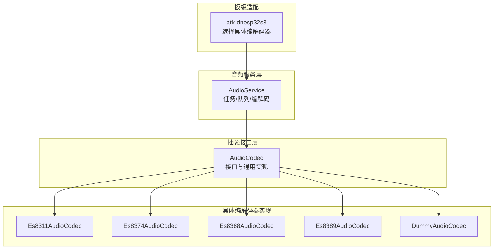
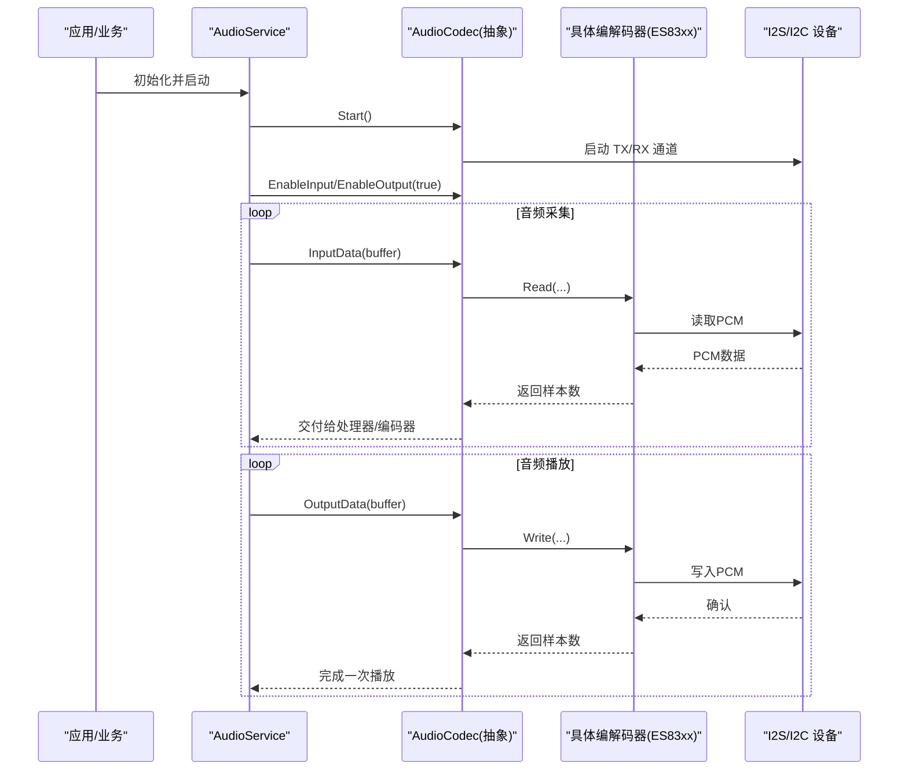
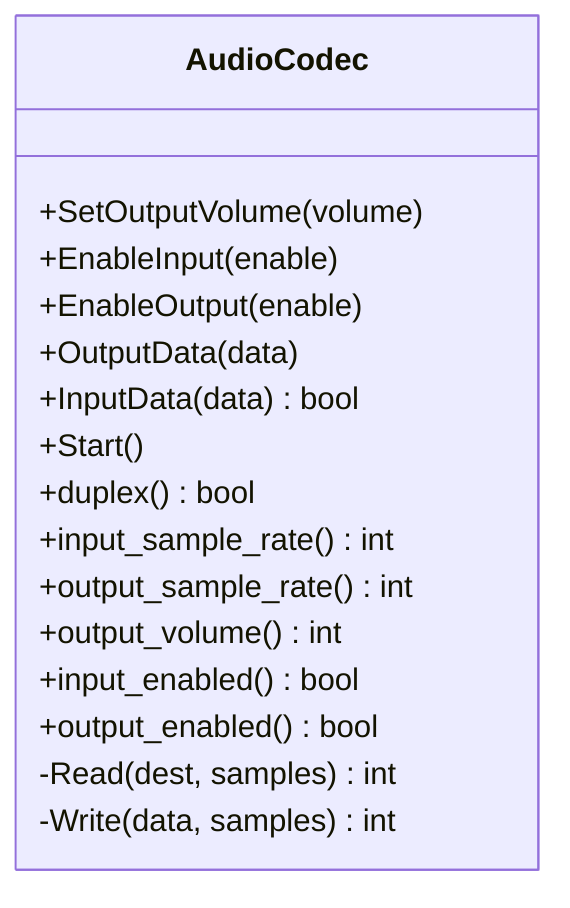
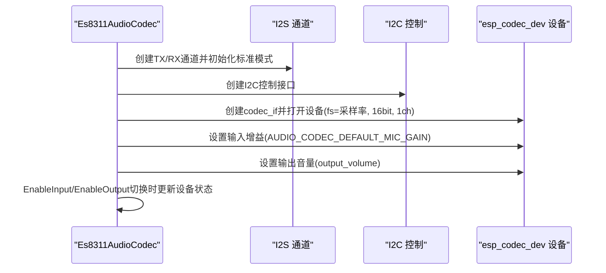
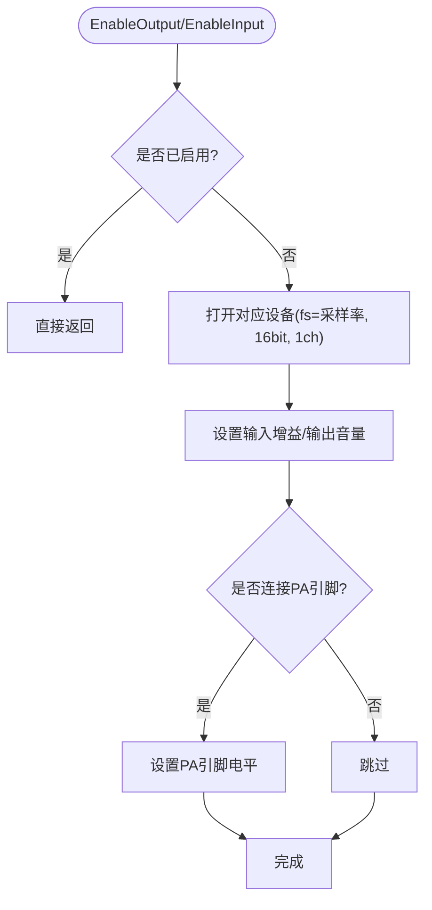
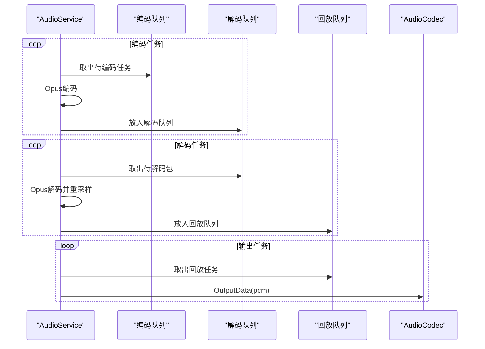
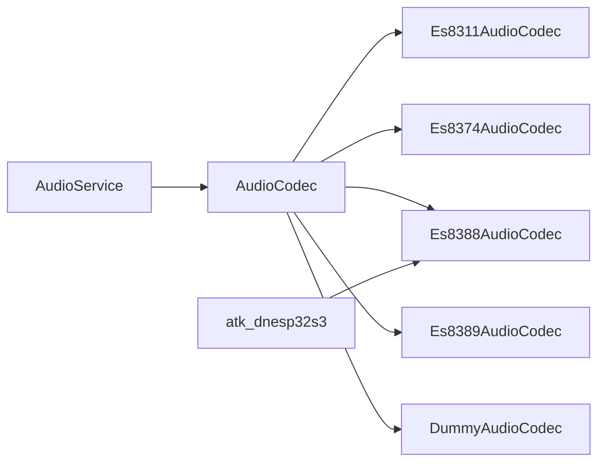
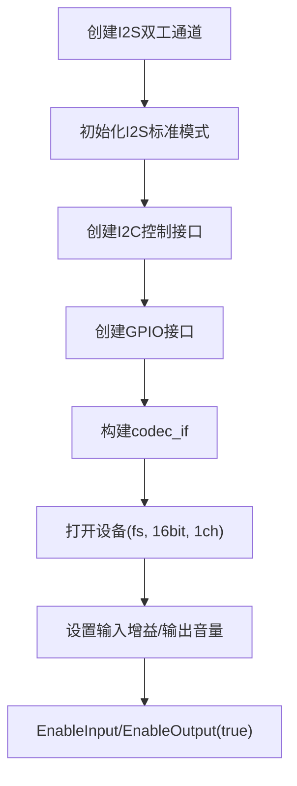

# 音频编解码器抽象

<cite>
**本文引用的文件**
- [audio_codec.h](file://main/audio/audio_codec.h)
- [audio_codec.cc](file://main/audio/audio_codec.cc)
- [es8311_audio_codec.h](file://main/audio/codecs/es8311_audio_codec.h)
- [es8311_audio_codec.cc](file://main/audio/codecs/es8311_audio_codec.cc)
- [es8374_audio_codec.h](file://main/audio/codecs/es8374_audio_codec.h)
- [es8374_audio_codec.cc](file://main/audio/codecs/es8374_audio_codec.cc)
- [es8388_audio_codec.h](file://main/audio/codecs/es8388_audio_codec.h)
- [es8388_audio_codec.cc](file://main/audio/codecs/es8388_audio_codec.cc)
- [es8389_audio_codec.h](file://main/audio/codecs/es8389_audio_codec.h)
- [es8389_audio_codec.cc](file://main/audio/codecs/es8389_audio_codec.cc)
- [dummy_audio_codec.h](file://main/audio/codecs/dummy_audio_codec.h)
- [dummy_audio_codec.cc](file://main/audio/codecs/dummy_audio_codec.cc)
- [audio_service.h](file://main/audio/audio_service.h)
- [audio_service.cc](file://main/audio/audio_service.cc)
- [atk_dnesp32s3.cc](file://main/boards/atk-dnesp32s3/atk_dnesp32s3.cc)
- [config.h](file://main/boards/atk-dnesp32s3/config.h)
</cite>

## 目录
1. [简介](#简介)
2. [项目结构](#项目结构)
3. [核心组件](#核心组件)
4. [架构总览](#架构总览)
5. [详细组件分析](#详细组件分析)
6. [依赖关系分析](#依赖关系分析)
7. [性能考量](#性能考量)
8. [故障排除指南](#故障排除指南)
9. [结论](#结论)
10. [附录](#附录)

## 简介
本文件系统性阐述该仓库中的“音频编解码器抽象层”，围绕统一的 AudioCodec 接口设计与实现，说明如何通过该抽象适配多种主流音频芯片（如 ES8311、ES8374、ES8388、ES8389），并给出初始化流程、参数配置、采样率设置等关键环节的深入解析。同时提供新增编解码器支持的开发指南、性能优化建议与常见问题排查方法，帮助开发者快速集成与维护。

## 项目结构
音频子系统位于 main/audio 目录，主要由以下层次构成：
- 抽象接口层：AudioCodec 及其通用实现
- 具体编解码器实现：针对不同芯片的适配类
- 音频服务层：AudioService 负责任务调度、编解码与播放队列管理
- 板级适配：各开发板在 board 层选择并构造具体的编解码器实例

**图表来源**
- [audio_codec.h](file://main/audio/audio_codec.h#L18-L57)
- [es8311_audio_codec.h](file://main/audio/codecs/es8311_audio_codec.h#L13-L40)
- [es8374_audio_codec.h](file://main/audio/codecs/es8374_audio_codec.h#L13-L39)
- [es8388_audio_codec.h](file://main/audio/codecs/es8388_audio_codec.h#L12-L38)
- [es8389_audio_codec.h](file://main/audio/codecs/es8389_audio_codec.h#L12-L37)
- [dummy_audio_codec.h](file://main/audio/codecs/dummy_audio_codec.h#L6-L14)
- [audio_service.h](file://main/audio/audio_service.h#L81-L155)
- [atk_dnesp32s3.cc](file://main/boards/atk-dnesp32s3/atk_dnesp32s3.cc#L217-L232)

**章节来源**
- [audio_codec.h](file://main/audio/audio_codec.h#L1-L60)
- [audio_codec.cc](file://main/audio/audio_codec.cc#L1-L73)
- [audio_service.h](file://main/audio/audio_service.h#L1-L157)
- [audio_service.cc](file://main/audio/audio_service.cc#L1-L669)
- [atk_dnesp32s3.cc](file://main/boards/atk-dnesp32s3/atk_dnesp32s3.cc#L1-L244)

## 核心组件
- AudioCodec 抽象接口：定义编解码器的统一行为，包括输入输出使能、音量设置、启动与数据读写等；内部封装 I2S 通道句柄与通用状态字段。
- 具体编解码器：基于 ESP-IDF 的 esp_codec_dev 与 I2S 接口，分别对 ES8311/ES8374/ES8388/ES8389 进行封装，负责 I2S 通道创建、I2C 控制接口、设备打开/关闭与增益/音量设置。
- AudioService：负责音频采集、处理、编码、解码与播放的多任务调度，维护发送/接收/测试/回放队列，以及采样率重采样与唤醒词/语音处理模块集成。

**章节来源**
- [audio_codec.h](file://main/audio/audio_codec.h#L18-L57)
- [audio_codec.cc](file://main/audio/audio_codec.cc#L11-L73)
- [audio_service.h](file://main/audio/audio_service.h#L81-L155)
- [audio_service.cc](file://main/audio/audio_service.cc#L33-L93)

## 架构总览
下图展示了从应用到具体编解码器的调用链路与数据流：

**图表来源**
- [audio_service.cc](file://main/audio/audio_service.cc#L95-L137)
- [audio_codec.cc](file://main/audio/audio_codec.cc#L29-L48)
- [es8388_audio_codec.cc](file://main/audio/codecs/es8388_audio_codec.cc#L139-L193)

**章节来源**
- [audio_service.cc](file://main/audio/audio_service.cc#L95-L137)
- [audio_codec.cc](file://main/audio/audio_codec.cc#L29-L48)

## 详细组件分析

### AudioCodec 抽象接口
- 职责：统一编解码器能力，屏蔽底层差异；提供 Start/EnableInput/EnableOutput/SetOutputVolume/OutputData/InputData 等接口。
- 关键字段：duplex、input_reference、input/output_sample_rate、input/output_channels、output_volume、input/output_enabled 等。
- 数据路径：OutputData/InputData 分别委托 Write/Read，后者由具体编解码器实现。

**图表来源**
- [audio_codec.h](file://main/audio/audio_codec.h#L18-L57)

**章节来源**
- [audio_codec.h](file://main/audio/audio_codec.h#L18-L57)
- [audio_codec.cc](file://main/audio/audio_codec.cc#L17-L73)

### ES8311 编解码器
- 特性：双工模式，I2S 标准模式配置，支持 MCLK；通过 esp_codec_dev 与 I2C 控制接口进行初始化与运行时控制。
- 初始化要点：创建 I2S 双工通道、配置 I2S 参数（采样率、位宽、WS极性、左右对齐等）、创建 I2C 控制接口与 GPIO 接口、构建 codec_if 并打开设备。
- 运行时：UpdateDeviceState 在输入/输出使能变化时打开/关闭设备；音量通过 esp_codec_dev_set_out_vol 设置；PA 引脚根据输出状态置高/低。

**图表来源**
- [es8311_audio_codec.cc](file://main/audio/codecs/es8311_audio_codec.cc#L96-L150)
- [es8311_audio_codec.cc](file://main/audio/codecs/es8311_audio_codec.cc#L66-L94)

**章节来源**
- [es8311_audio_codec.h](file://main/audio/codecs/es8311_audio_codec.h#L13-L40)
- [es8311_audio_codec.cc](file://main/audio/codecs/es8311_audio_codec.cc#L7-L55)
- [es8311_audio_codec.cc](file://main/audio/codecs/es8311_audio_codec.cc#L66-L94)
- [es8311_audio_codec.cc](file://main/audio/codecs/es8311_audio_codec.cc#L96-L150)
- [es8311_audio_codec.cc](file://main/audio/codecs/es8311_audio_codec.cc#L152-L187)

### ES8374 编解码器
- 特性：双工模式，I2S 标准模式；将输入/输出拆分为独立的 esp_codec_dev 实例，便于精细控制。
- 初始化要点：创建 I2S 双工通道；分别创建输出/输入设备并打开；设置 disable_when_closed=false 以避免频繁开关带来的不稳定。
- 运行时：EnableInput/EnableOutput 打开/关闭对应设备并设置增益/音量；PA 引脚在输出开启时拉高。

**图表来源**
- [es8374_audio_codec.cc](file://main/audio/codecs/es8374_audio_codec.cc#L135-L182)

**章节来源**
- [es8374_audio_codec.h](file://main/audio/codecs/es8374_audio_codec.h#L13-L39)
- [es8374_audio_codec.cc](file://main/audio/codecs/es8374_audio_codec.cc#L7-L60)
- [es8374_audio_codec.cc](file://main/audio/codecs/es8374_audio_codec.cc#L135-L182)

### ES8388 编解码器
- 特性：双工模式，I2S 标准模式；支持主模式与硬件增益配置；输出时可将耳机/扬声器音量寄存器设置为 0dB。
- 初始化要点：创建 I2S 双工通道；分别创建输入/输出设备；设置 disable_when_closed=false；配置硬件增益。
- 运行时：EnableOutput 时设置输出音量并写入 HP/SPK 寄存器至 0dB；EnableInput 时设置输入增益。

**章节来源**
- [es8388_audio_codec.h](file://main/audio/codecs/es8388_audio_codec.h#L12-L38)
- [es8388_audio_codec.cc](file://main/audio/codecs/es8388_audio_codec.cc#L7-L68)
- [es8388_audio_codec.cc](file://main/audio/codecs/es8388_audio_codec.cc#L139-L193)

### ES8389 编解码器
- 特性：双工模式，I2S 标准模式；支持 MCLK；输入增益较高（用于远场拾音）。
- 初始化要点：创建 I2S 双工通道；分别创建输入/输出设备；设置 disable_when_closed=false；配置 use_mclk。
- 运行时：EnableInput/EnableOutput 打开设备并设置增益/音量。

**章节来源**
- [es8389_audio_codec.h](file://main/audio/codecs/es8389_audio_codec.h#L12-L37)
- [es8389_audio_codec.cc](file://main/audio/codecs/es8389_audio_codec.cc#L7-L69)
- [es8389_audio_codec.cc](file://main/audio/codecs/es8389_audio_codec.cc#L142-L189)

### DummyAudioCodec 占位实现
- 用途：在无硬件或调试场景下提供最小化实现，满足接口约束但不进行实际 I/O。
- 行为：构造函数设置采样率与通道数；Read/Write 返回 0，表示无数据或忽略数据。

**章节来源**
- [dummy_audio_codec.h](file://main/audio/codecs/dummy_audio_codec.h#L6-L14)
- [dummy_audio_codec.cc](file://main/audio/codecs/dummy_audio_codec.cc#L3-L21)

### AudioService 音频服务
- 多任务模型：音频输入/输出任务与 Opus 编解码任务分离；使用事件组控制不同功能（唤醒词、语音处理、音频测试）的启停。
- 队列与限流：发送/解码/回放/测试队列均有容量限制；编码/解码任务按条件等待与通知。
- 采样率处理：根据编解码器输入/输出采样率动态配置 Resampler；解码后按目标采样率重采样。
- 回调与统计：提供 VAD/唤醒词回调；统计输入/解码/编码/播放计数；定时器检测空闲并自动关闭输入/输出。

**图表来源**
- [audio_service.h](file://main/audio/audio_service.h#L62-L73)
- [audio_service.cc](file://main/audio/audio_service.cc#L314-L391)

**章节来源**
- [audio_service.h](file://main/audio/audio_service.h#L81-L155)
- [audio_service.cc](file://main/audio/audio_service.cc#L33-L93)
- [audio_service.cc](file://main/audio/audio_service.cc#L209-L312)
- [audio_service.cc](file://main/audio/audio_service.cc#L314-L391)
- [audio_service.cc](file://main/audio/audio_service.cc#L656-L669)

## 依赖关系分析
- 抽象与实现：所有具体编解码器均继承自 AudioCodec，遵循统一接口契约。
- 外部依赖：esp_codec_dev、I2S、I2C、GPIO；部分实现还涉及硬件增益寄存器写入。
- 板级适配：atk-dnesp32s3 在 GetAudioCodec 中构造 ES8388 实例，体现“同一抽象适配不同芯片”的策略。

**图表来源**
- [audio_codec.h](file://main/audio/audio_codec.h#L18-L57)
- [es8311_audio_codec.h](file://main/audio/codecs/es8311_audio_codec.h#L13-L40)
- [es8374_audio_codec.h](file://main/audio/codecs/es8374_audio_codec.h#L13-L39)
- [es8388_audio_codec.h](file://main/audio/codecs/es8388_audio_codec.h#L12-L38)
- [es8389_audio_codec.h](file://main/audio/codecs/es8389_audio_codec.h#L12-L37)
- [dummy_audio_codec.h](file://main/audio/codecs/dummy_audio_codec.h#L6-L14)
- [audio_service.h](file://main/audio/audio_service.h#L81-L155)
- [atk_dnesp32s3.cc](file://main/boards/atk-dnesp32s3/atk_dnesp32s3.cc#L217-L232)

**章节来源**
- [atk_dnesp32s3.cc](file://main/boards/atk-dnesp32s3/atk_dnesp32s3.cc#L217-L232)
- [config.h](file://main/boards/atk-dnesp32s3/config.h#L8-L19)

## 性能考量
- I2S DMA 与帧大小：DMA 描述符数量与帧大小影响中断频率与内存占用，需结合 CPU 主频与任务负载权衡。
- 采样率重采样：当编解码器采样率与期望不一致时，应尽量减少重采样次数，必要时在初始化阶段一次性配置 Resampler。
- 队列容量与优先级：合理设置发送/解码/回放队列上限，避免阻塞；任务优先级与核心亲和性有助于降低抖动。
- 功耗与空闲管理：利用 AudioService 的定时器检测输入/输出空闲并自动关闭，降低功耗。
- 线程安全：具体编解码器中对设备状态的更新采用互斥锁保护，避免并发读写导致异常。

[本节为通用指导，无需列出章节来源]

## 故障排除指南
- 无法启动编解码器
  - 检查 I2C 地址与引脚配置是否匹配目标芯片；确认 I2C 总线初始化成功。
  - 确认 I2S 时钟/位宽/WS极性等参数与硬件手册一致。
- 无声或杂音
  - 检查 PA 引脚连接与电平；确认 EnableOutput 已被调用且设备已打开。
  - 对于 ES8388，检查耳机/扬声器音量寄存器是否被意外写入非 0dB 值。
- 输入无声音
  - 确认 EnableInput 已被调用；检查输入增益设置是否过低。
  - 若为双声道输入，注意音频服务会将左右声道合并为单声道处理（测试模式除外）。
- 音频卡顿或延迟
  - 检查队列容量与任务优先级；适当增大 DMA 描述符与帧大小。
  - 减少不必要的重采样，或在初始化阶段完成重采样配置。
- 自动关闭输入/输出
  - AudioService 的空闲定时器会在超时后自动关闭，属预期行为；若需要常驻，确保持续产生输入/输出活动。

**章节来源**
- [es8388_audio_codec.cc](file://main/audio/codecs/es8388_audio_codec.cc#L176-L181)
- [audio_service.cc](file://main/audio/audio_service.cc#L656-L669)

## 结论
该音频编解码器抽象层通过统一接口屏蔽了不同芯片的差异，配合 AudioService 的任务与队列模型，实现了稳定的录音、处理、编码、传输与播放闭环。通过对 ES8311/ES8374/ES8388/ES8389 的具体实现，开发者可以快速适配多种硬件平台；同时，占位实现与完善的错误处理机制也为调试与扩展提供了便利。

[本节为总结性内容，无需列出章节来源]

## 附录

### 添加新编解码器支持的开发指南
- 继承 AudioCodec
  - 在头文件中声明类并继承 AudioCodec，实现 Read/Write 虚函数。
  - 在构造函数中设置 duplex/input_reference/input/output 采样率/通道数等属性。
- 初始化 I2S 与控制接口
  - 创建 I2S 双工通道（或根据芯片特性创建独立 TX/RX）；配置标准模式参数（采样率、位宽、WS宽度/极性、左右对齐等）。
  - 创建 I2C 控制接口与 GPIO 接口（如需要），并构建 codec_if。
- 设备打开/关闭与运行时控制
  - 在 EnableInput/EnableOutput 中打开/关闭设备；设置输入增益与输出音量。
  - 如有 PA 引脚，按输出状态控制电平。
- 在板级适配中使用
  - 在对应 board 的 GetAudioCodec 中构造你的编解码器实例并返回。
- 配置项建议
  - 采样率与通道数：与硬件电路与应用场景匹配。
  - I2C 地址与引脚：与硬件原理图一致。
  - MCLK 使用：根据芯片手册决定是否启用 MCLK。

**章节来源**
- [es8374_audio_codec.cc](file://main/audio/codecs/es8374_audio_codec.cc#L74-L128)
- [es8389_audio_codec.cc](file://main/audio/codecs/es8389_audio_codec.cc#L83-L135)
- [atk_dnesp32s3.cc](file://main/boards/atk-dnesp32s3/atk_dnesp32s3.cc#L217-L232)

### 关键流程图：初始化与启动

**图表来源**
- [es8311_audio_codec.cc](file://main/audio/codecs/es8311_audio_codec.cc#L96-L150)
- [es8374_audio_codec.cc](file://main/audio/codecs/es8374_audio_codec.cc#L74-L128)
- [es8388_audio_codec.cc](file://main/audio/codecs/es8388_audio_codec.cc#L82-L132)
- [es8389_audio_codec.cc](file://main/audio/codecs/es8389_audio_codec.cc#L83-L135)