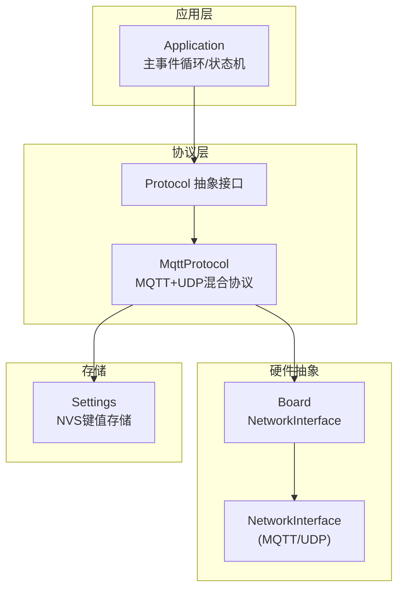
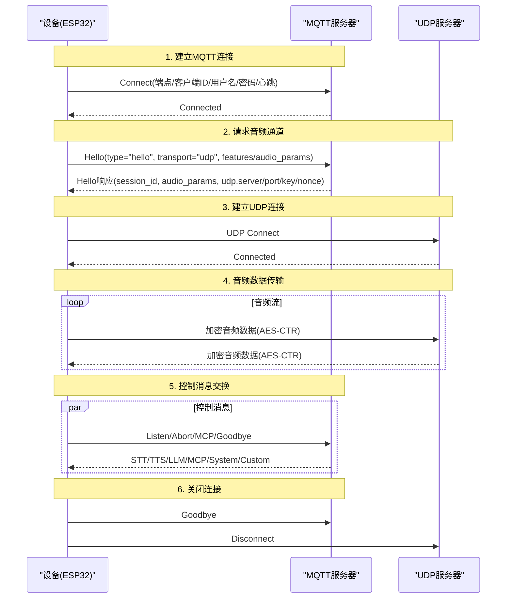
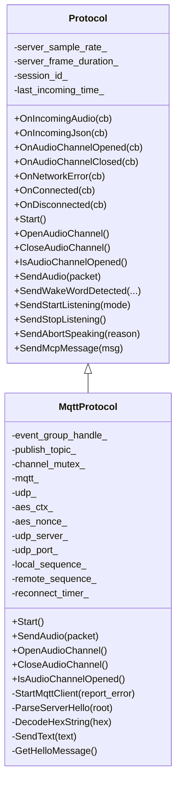
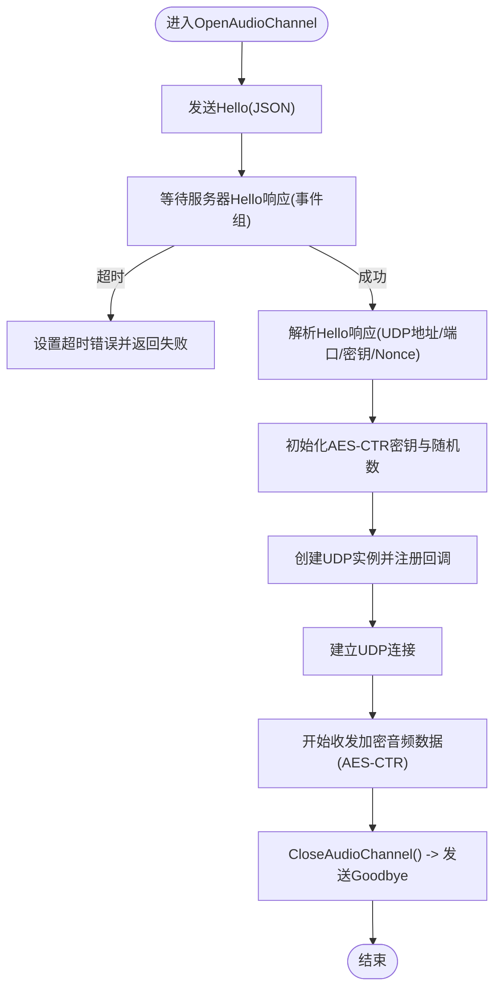
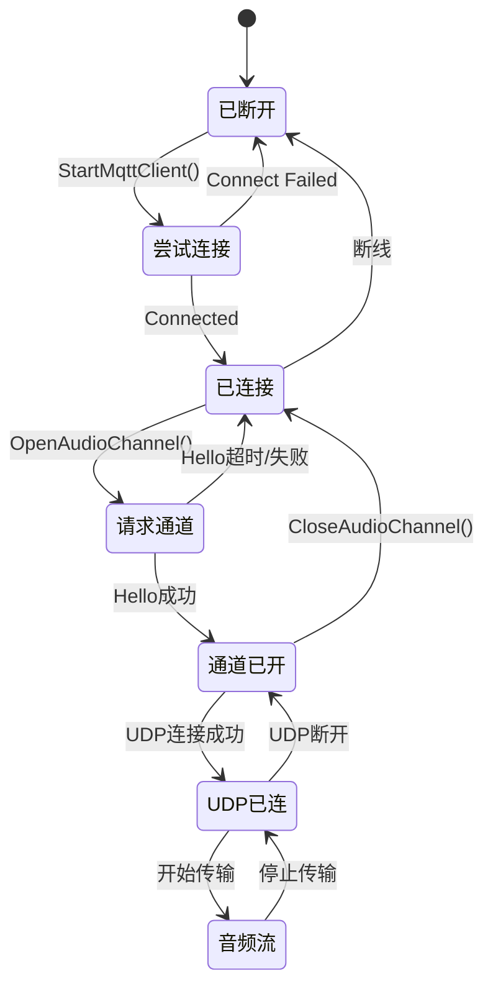
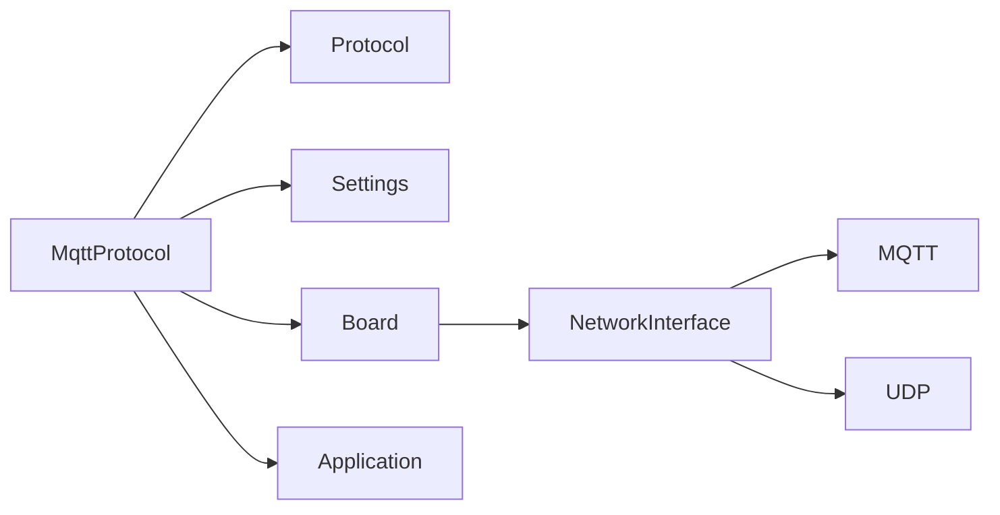

# MQTT协议实现

<cite>
**本文引用的文件**
- [mqtt_protocol.h](file://main/protocols/mqtt_protocol.h)
- [mqtt_protocol.cc](file://main/protocols/mqtt_protocol.cc)
- [protocol.h](file://main/protocols/protocol.h)
- [settings.h](file://main/settings.h)
- [settings.cc](file://main/settings.cc)
- [board.h](file://main/boards/common/board.h)
- [application.h](file://main/application.h)
- [application.cc](file://main/application.cc)
- [mqtt-udp.md](file://docs/mqtt-udp.md)
</cite>

## 目录
1. [简介](#简介)
2. [项目结构](#项目结构)
3. [核心组件](#核心组件)
4. [架构总览](#架构总览)
5. [详细组件分析](#详细组件分析)
6. [依赖关系分析](#依赖关系分析)
7. [性能考量](#性能考量)
8. [故障排查指南](#故障排查指南)
9. [结论](#结论)
10. [附录](#附录)

## 简介
本文件面向嵌入式设备（ESP32）上的MQTT协议实现，系统性阐述在资源受限环境下如何稳定地完成MQTT连接建立、认证、主题订阅与消息发布；如何通过MQTT控制通道协调UDP音频通道，实现音频数据与JSON控制消息的混合传输；以及会话管理、重连机制、主题命名规范、消息路由策略、安全考虑（TLS、认证授权、加密）、常见问题排查与性能优化建议。文档以实际代码为依据，辅以架构图与时序图，帮助读者快速理解并落地部署。

## 项目结构
MQTT协议实现位于main/protocols目录，核心类MqttProtocol继承自Protocol抽象接口，负责：
- 通过Settings从非易失存储读取MQTT配置（端点、客户端ID、用户名、密码、心跳、发布主题等）
- 使用Board提供的NetworkInterface创建MQTT客户端，建立连接并注册回调
- 通过MQTT交换JSON控制消息（hello/goodbye/业务消息），并在收到hello后建立UDP音频通道
- 通过UDP进行加密音频数据传输（AES-CTR），并维护序列号与超时检测

**图表来源**
- [application.h](file://main/application.h#L32-L91)
- [protocol.h](file://main/protocols/protocol.h#L44-L99)
- [mqtt_protocol.h](file://main/protocols/mqtt_protocol.h#L24-L61)
- [board.h](file://main/boards/common/board.h#L18-L53)
- [settings.h](file://main/settings.h#L7-L29)

**章节来源**
- [application.h](file://main/application.h#L32-L91)
- [application.cc](file://main/application.cc#L1-L200)
- [protocol.h](file://main/protocols/protocol.h#L44-L99)
- [mqtt_protocol.h](file://main/protocols/mqtt_protocol.h#L24-L61)
- [board.h](file://main/boards/common/board.h#L18-L53)
- [settings.h](file://main/settings.h#L7-L29)

## 核心组件
- MqttProtocol：实现Protocol接口，封装MQTT与UDP的混合通信逻辑，负责连接、认证、消息收发、音频通道建立与关闭、加密与序列号管理、重连与超时检测。
- Protocol：抽象协议接口，定义统一的音频/文本回调、通道打开/关闭、错误上报、超时检测等能力。
- Settings：基于NVS的键值存储访问器，提供字符串/整型/布尔读写与默认值处理。
- Board/NetworkInterface：提供网络能力抽象，创建MQTT/UDP实例并管理网络状态。

**章节来源**
- [mqtt_protocol.h](file://main/protocols/mqtt_protocol.h#L24-L61)
- [mqtt_protocol.cc](file://main/protocols/mqtt_protocol.cc#L44-L137)
- [protocol.h](file://main/protocols/protocol.h#L44-L99)
- [settings.h](file://main/settings.h#L7-L29)
- [settings.cc](file://main/settings.cc#L21-L89)
- [board.h](file://main/boards/common/board.h#L18-L53)

## 架构总览
MQTT+UDP混合架构将“控制”和“数据”分离：MQTT用于可靠传输控制消息与状态同步，UDP用于低延迟音频数据传输。设备启动后先建立MQTT连接，随后通过hello消息协商UDP通道，之后音频数据通过UDP以加密形式传输，控制消息仍走MQTT。

**图表来源**
- [mqtt-udp.md](file://docs/mqtt-udp.md#L24-L57)
- [mqtt_protocol.cc](file://main/protocols/mqtt_protocol.cc#L48-L137)
- [mqtt_protocol.cc](file://main/protocols/mqtt_protocol.cc#L194-L274)
- [mqtt_protocol.cc](file://main/protocols/mqtt_protocol.cc#L301-L345)

## 详细组件分析

### 组件A：MqttProtocol（MQTT+UDP混合协议）
- 角色定位：实现Protocol接口，封装MQTT控制通道与UDP音频通道的协同工作。
- 关键职责：
  - 启动与重连：读取配置、创建MQTT客户端、设置回调、连接与断线重连。
  - 控制消息：解析/分发JSON消息（hello/goodbye/业务消息），维护会话ID与状态。
  - 音频通道：发送hello请求，解析服务器响应，初始化AES-CTR密钥与随机数，建立UDP连接，收发加密音频数据，维护序列号。
  - 错误处理：解密失败、序列号异常、超时检测、错误上报。
  - 超时与会话：基于最后收包时间判断通道可用性，结合事件组等待hello响应。

**图表来源**
- [protocol.h](file://main/protocols/protocol.h#L44-L99)
- [mqtt_protocol.h](file://main/protocols/mqtt_protocol.h#L24-L61)

**章节来源**
- [mqtt_protocol.h](file://main/protocols/mqtt_protocol.h#L24-L61)
- [mqtt_protocol.cc](file://main/protocols/mqtt_protocol.cc#L44-L137)
- [mqtt_protocol.cc](file://main/protocols/mqtt_protocol.cc#L194-L274)
- [mqtt_protocol.cc](file://main/protocols/mqtt_protocol.cc#L301-L345)

### 组件B：Protocol（协议抽象接口）
- 定义统一的回调与能力接口，包括：
  - 音频/文本回调：接收远端音频与JSON消息
  - 通道生命周期：打开/关闭音频通道
  - 网络事件：连接/断开/错误
  - 会话与超时：会话ID、最后收包时间、超时检测
- 为不同协议（MQTT/WebSocket）提供一致的上层调用接口。

**章节来源**
- [protocol.h](file://main/protocols/protocol.h#L44-L99)

### 组件C：Settings（配置与存储）
- 基于NVS的键值存储，提供字符串/整型/布尔的读写与默认值处理。
- MqttProtocol通过Settings读取MQTT配置（端点、客户端ID、用户名、密码、心跳、发布主题）。

**章节来源**
- [settings.h](file://main/settings.h#L7-L29)
- [settings.cc](file://main/settings.cc#L21-L89)
- [mqtt_protocol.cc](file://main/protocols/mqtt_protocol.cc#L54-L61)

### 组件D：Board/NetworkInterface（网络抽象）
- Board提供NetworkInterface，MqttProtocol通过它创建MQTT/UDP实例。
- 该抽象屏蔽不同开发板的差异，便于移植。

**章节来源**
- [board.h](file://main/boards/common/board.h#L18-L53)
- [mqtt_protocol.cc](file://main/protocols/mqtt_protocol.cc#L70-L71)

### 组件E：Application（主事件循环与调度）
- Application持有Protocol实例，负责状态机、事件调度、任务队列与UI反馈。
- MqttProtocol的重连回调通过Application::Schedule异步调度到主线程执行，避免在中断上下文直接操作协议对象。

**章节来源**
- [application.h](file://main/application.h#L32-L91)
- [application.cc](file://main/application.cc#L1-L200)
- [mqtt_protocol.cc](file://main/protocols/mqtt_protocol.cc#L17-L30)

### 组件F：消息格式与数据传输机制
- JSON控制消息：
  - hello：设备向服务器申请UDP通道，携带版本、传输方式、特性与音频参数
  - goodbye：设备主动关闭音频通道
  - 其他：监听、中止、MCP等业务消息
- 音频数据：
  - UDP通道，采用AES-CTR加密
  - 包含类型、标志、负载长度、SSRC、时间戳、序列号与加密负载
  - 设备侧与服务侧分别维护本地/远端序列号，防止重放与乱序

**图表来源**
- [mqtt_protocol.cc](file://main/protocols/mqtt_protocol.cc#L194-L274)
- [mqtt_protocol.cc](file://main/protocols/mqtt_protocol.cc#L301-L345)
- [mqtt-udp.md](file://docs/mqtt-udp.md#L186-L223)

**章节来源**
- [mqtt-udp.md](file://docs/mqtt-udp.md#L75-L112)
- [mqtt-udp.md](file://docs/mqtt-udp.md#L186-L223)
- [mqtt_protocol.cc](file://main/protocols/mqtt_protocol.cc#L151-L175)
- [mqtt_protocol.cc](file://main/protocols/mqtt_protocol.cc#L222-L266)

### 组件G：会话管理与重连机制
- 会话管理：
  - 通过hello/goodbye消息维护会话ID，关闭音频通道时发送goodbye并清理UDP
  - 通道可用性通过IsAudioChannelOpened判断（UDP存在、无错误、未超时）
- 重连机制：
  - MQTT断线后定时器触发一次性重连，仅在空闲状态下调度
  - 重连成功则停止定时器，失败则按固定间隔再次调度

**图表来源**
- [mqtt-udp.md](file://docs/mqtt-udp.md#L230-L246)
- [mqtt_protocol.cc](file://main/protocols/mqtt_protocol.cc#L48-L137)
- [mqtt_protocol.cc](file://main/protocols/mqtt_protocol.cc#L74-L87)

**章节来源**
- [mqtt_protocol.cc](file://main/protocols/mqtt_protocol.cc#L48-L137)
- [mqtt_protocol.cc](file://main/protocols/mqtt_protocol.cc#L177-L192)
- [mqtt_protocol.cc](file://main/protocols/mqtt_protocol.cc#L366-L369)

### 组件H：主题命名规范与消息路由策略
- 主题命名：
  - 发布主题由配置项publish_topic决定，用于设备向服务器发送JSON控制消息
  - 订阅主题未在代码中显式出现，通常由服务器下发或约定为与会话ID相关的动态主题
- 消息路由：
  - 控制消息（JSON）通过MQTT路由至服务器
  - 音频数据通过UDP直连服务器，不占用MQTT带宽
  - 会话ID贯穿控制与音频通道，确保多路并发场景下的正确路由

**章节来源**
- [mqtt_protocol.cc](file://main/protocols/mqtt_protocol.cc#L54-L61)
- [mqtt_protocol.cc](file://main/protocols/mqtt_protocol.cc#L139-L149)
- [mqtt-udp.md](file://docs/mqtt-udp.md#L259-L277)

### 组件I：安全考虑（TLS、认证授权、加密）
- 传输加密：
  - MQTT：使用端口8883（TLS/SSL）加密
  - UDP：使用AES-CTR对音频数据加密
- 认证机制：
  - MQTT：用户名/密码认证
  - UDP：通过MQTT通道下发密钥与随机数，避免明文传输
- 防重放与完整性：
  - 序列号单调递增，拒绝旧序列号
  - 时间戳与SSRC辅助校验
- 授权与权限：
  - 通过MQTT ACL或服务器侧策略限制主题访问与消息类型

**章节来源**
- [mqtt-udp.md](file://docs/mqtt-udp.md#L303-L321)
- [mqtt_protocol.cc](file://main/protocols/mqtt_protocol.cc#L119-L133)
- [mqtt_protocol.cc](file://main/protocols/mqtt_protocol.cc#L339-L344)

## 依赖关系分析
- MqttProtocol依赖Protocol接口以统一对外能力
- MqttProtocol通过Board/NetworkInterface获取MQTT/UDP实例
- MqttProtocol通过Settings读取配置
- MqttProtocol通过Application进行事件调度与状态管理

**图表来源**
- [mqtt_protocol.h](file://main/protocols/mqtt_protocol.h#L24-L61)
- [protocol.h](file://main/protocols/protocol.h#L44-L99)
- [settings.h](file://main/settings.h#L7-L29)
- [board.h](file://main/boards/common/board.h#L18-L53)
- [application.h](file://main/application.h#L32-L91)

**章节来源**
- [mqtt_protocol.h](file://main/protocols/mqtt_protocol.h#L24-L61)
- [protocol.h](file://main/protocols/protocol.h#L44-L99)
- [settings.h](file://main/settings.h#L7-L29)
- [board.h](file://main/boards/common/board.h#L18-L53)
- [application.h](file://main/application.h#L32-L91)

## 性能考量
- 并发与线程模型：
  - 使用互斥锁保护UDP通道与序列号更新，避免竞态
  - 重连与通道开关通过Application::Schedule异步调度，避免阻塞网络回调线程
- 内存与资源：
  - 动态创建/销毁网络对象，智能指针管理音频数据包
  - 及时释放mbedtls上下文，降低内存压力
- 网络优化：
  - UDP复用同一连接传输双向音频
  - 严格序列号与超时检测，减少无效重传
  - 通过事件组等待hello响应，避免忙轮询

**章节来源**
- [mqtt_protocol.cc](file://main/protocols/mqtt_protocol.cc#L151-L175)
- [mqtt_protocol.cc](file://main/protocols/mqtt_protocol.cc#L177-L192)
- [mqtt_protocol.cc](file://main/protocols/mqtt_protocol.cc#L222-L266)
- [mqtt-udp.md](file://docs/mqtt-udp.md#L323-L343)

## 故障排查指南
- MQTT连接失败
  - 检查endpoint、client_id、username、password配置是否正确
  - 查看日志输出与错误码，确认端口与TLS配置（8883）
  - 观察断线回调与重连定时器是否被触发
- hello超时
  - 确认服务器已正确下发UDP连接信息与密钥
  - 检查事件组等待是否被其他事件打断
- UDP无法建立或音频无声
  - 核对UDP服务器地址/端口、密钥与随机数是否匹配
  - 检查AES解密返回值与序列号连续性
  - 确认防火墙/NAT允许UDP端口
- 通道不可用
  - 检查IsAudioChannelOpened判定条件（UDP存在、无错误、未超时）
  - 关注最后收包时间与超时阈值

**章节来源**
- [mqtt_protocol.cc](file://main/protocols/mqtt_protocol.cc#L54-L68)
- [mqtt_protocol.cc](file://main/protocols/mqtt_protocol.cc#L82-L87)
- [mqtt_protocol.cc](file://main/protocols/mqtt_protocol.cc#L212-L217)
- [mqtt_protocol.cc](file://main/protocols/mqtt_protocol.cc#L256-L260)
- [mqtt_protocol.cc](file://main/protocols/mqtt_protocol.cc#L366-L369)
- [mqtt-udp.md](file://docs/mqtt-udp.md#L294-L300)

## 结论
该实现以MQTT+UDP混合架构在ESP32上实现了低延迟、高可靠性的音视频通信：MQTT负责控制与会话管理，UDP负责实时音频数据传输并采用AES-CTR加密。通过严格的序列号管理、超时检测与断线重连机制，系统在复杂网络环境中具备良好的鲁棒性。配合清晰的主题命名与消息路由策略，以及TLS与密钥分发的安全设计，满足嵌入式语音交互场景的工程化需求。

## 附录

### A. MQTT客户端配置参数清单
- endpoint：MQTT服务器地址与端口（支持形如host:port）
- client_id：设备唯一标识
- username/password：MQTT认证凭据
- keepalive：心跳间隔（秒，默认240）
- publish_topic：发布主题（用于设备向服务器发送JSON消息）

**章节来源**
- [mqtt_protocol.cc](file://main/protocols/mqtt_protocol.cc#L54-L61)
- [settings.h](file://main/settings.h#L12-L18)
- [settings.cc](file://main/settings.cc#L21-L89)
- [mqtt-udp.md](file://docs/mqtt-udp.md#L259-L277)

### B. JSON消息类型与字段说明
- hello：type="hello"，version，transport="udp"，features，audio_params
- goodbye：type="goodbye"，session_id
- 其他：listen/abort/mcp等（详见文档）

**章节来源**
- [mqtt-udp.md](file://docs/mqtt-udp.md#L75-L112)
- [mqtt-udp.md](file://docs/mqtt-udp.md#L120-L173)

### C. UDP音频包结构与加密要点
- 包头字段：type、flags、payload_len、ssrc、timestamp、sequence
- 加密：AES-CTR，密钥与随机数由服务器通过MQTT下发
- 序列号：本地/远端各自维护，防止重放与乱序

**章节来源**
- [mqtt-udp.md](file://docs/mqtt-udp.md#L186-L223)
- [mqtt_protocol.cc](file://main/protocols/mqtt_protocol.cc#L151-L175)
- [mqtt_protocol.cc](file://main/protocols/mqtt_protocol.cc#L222-L266)
- [mqtt_protocol.cc](file://main/protocols/mqtt_protocol.cc#L339-L344)