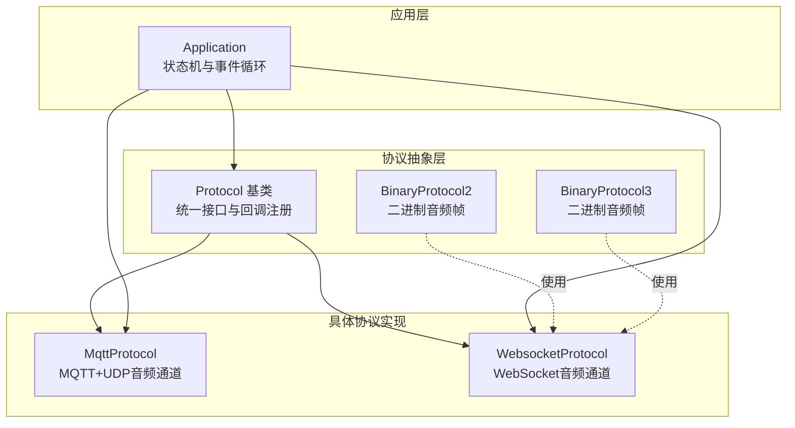
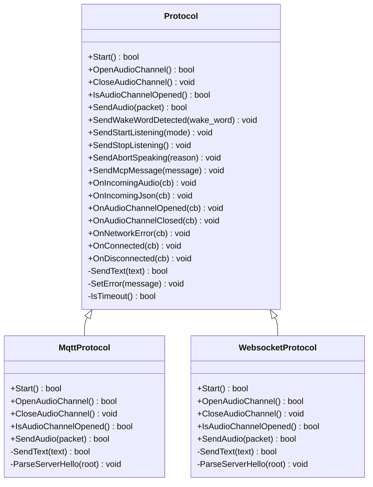
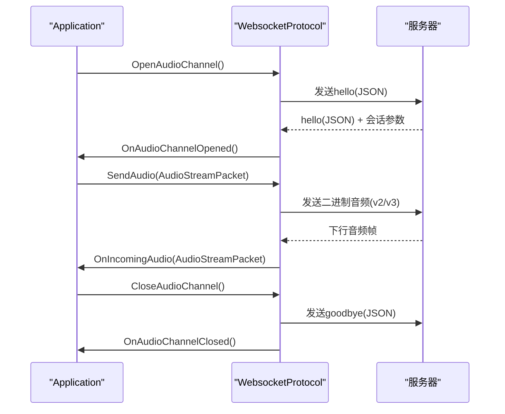
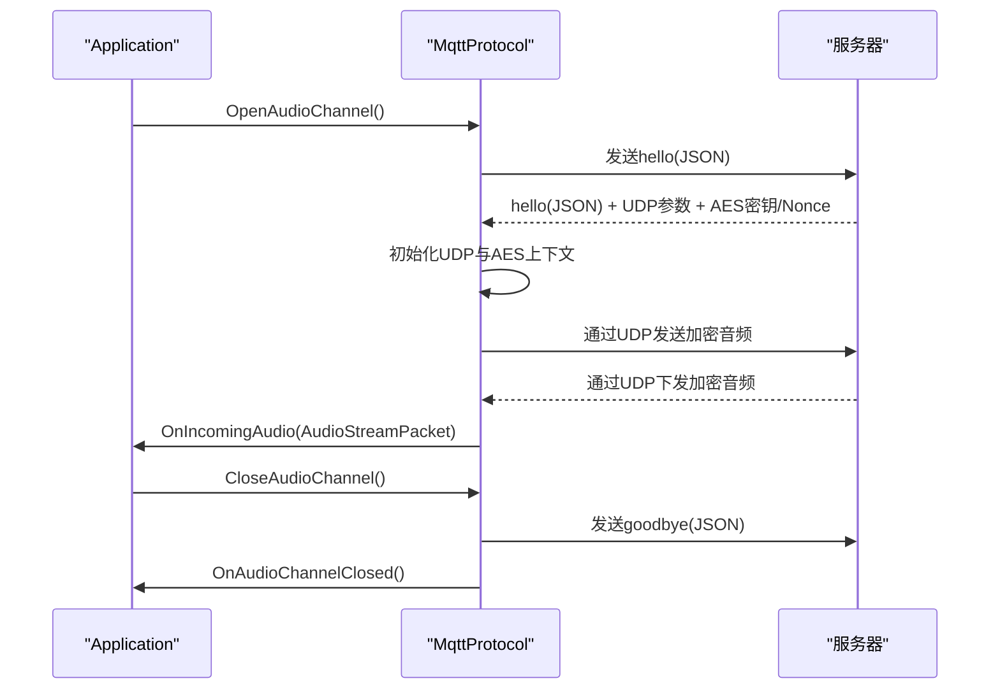
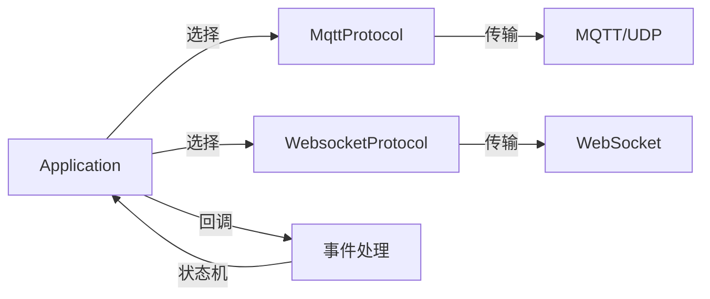

# Protocol抽象层

<cite>
**本文档引用的文件**
- [protocol.h](file://main/protocols/protocol.h)
- [protocol.cc](file://main/protocols/protocol.cc)
- [mqtt_protocol.h](file://main/protocols/mqtt_protocol.h)
- [mqtt_protocol.cc](file://main/protocols/mqtt_protocol.cc)
- [websocket_protocol.h](file://main/protocols/websocket_protocol.h)
- [websocket_protocol.cc](file://main/protocols/websocket_protocol.cc)
- [application.h](file://main/application.h)
- [application.cc](file://main/application.cc)
- [mcp-protocol.md](file://docs/mcp-protocol.md)
</cite>

## 目录
1. [简介](#简介)
2. [项目结构](#项目结构)
3. [核心组件](#核心组件)
4. [架构总览](#架构总览)
5. [详细组件分析](#详细组件分析)
6. [依赖关系分析](#依赖关系分析)
7. [性能考虑](#性能考虑)
8. [故障排查指南](#故障排查指南)
9. [结论](#结论)

## 简介
本文件系统性阐述该ESP32项目中的Protocol抽象层设计与实现，重点覆盖以下方面：
- Protocol基类的设计理念与架构模式，如何通过统一接口抽象不同通信协议（MQTT+UDP与WebSocket）。
- 音频流数据包结构AudioStreamPacket的字段语义与用途。
- 二进制协议格式BinaryProtocol2与BinaryProtocol3的结构设计与应用场景。
- 监听模式ListeningMode与中止原因AbortReason的枚举定义与使用场景。
- 协议回调函数的注册机制与事件处理流程。
- 协议状态管理、超时检测与错误处理机制。

## 项目结构
Protocol抽象层位于main/protocols目录，采用面向对象的继承与多态设计，向上提供统一的协议接口，向下分别由MQTT协议与WebSocket协议实现具体细节。上层应用通过Application类统一调度协议实例，完成从设备到云端的音频与控制消息传输。

图表来源
- [protocol.h](file://main/protocols/protocol.h#L44-L95)
- [mqtt_protocol.h](file://main/protocols/mqtt_protocol.h#L24-L57)
- [websocket_protocol.h](file://main/protocols/websocket_protocol.h#L13-L32)
- [application.cc](file://main/application.cc#L368-L378)

章节来源
- [protocol.h](file://main/protocols/protocol.h#L1-L99)
- [mqtt_protocol.h](file://main/protocols/mqtt_protocol.h#L1-L61)
- [websocket_protocol.h](file://main/protocols/websocket_protocol.h#L1-L35)
- [application.cc](file://main/application.cc#L368-L378)

## 核心组件
- Protocol基类：定义统一的协议接口、回调注册方法、通用状态与错误处理逻辑，以及音频通道的打开/关闭与发送能力。
- MqttProtocol：基于MQTT建立控制通道，通过UDP承载加密音频数据，支持AES-CTR加密与序列号校验。
- WebsocketProtocol：通过WebSocket传输音频与JSON控制消息，支持二进制协议版本切换（v2/v3）。
- Application：负责协议实例的选择与生命周期管理，驱动状态机与事件循环，协调音频服务与协议交互。

章节来源
- [protocol.h](file://main/protocols/protocol.h#L44-L95)
- [protocol.cc](file://main/protocols/protocol.cc#L7-L90)
- [mqtt_protocol.h](file://main/protocols/mqtt_protocol.h#L24-L57)
- [websocket_protocol.h](file://main/protocols/websocket_protocol.h#L13-L32)
- [application.cc](file://main/application.cc#L368-L378)

## 架构总览
Protocol抽象层采用“基类统一接口 + 子类差异化实现”的模式，结合回调注册机制，实现跨协议的一致行为。上层应用通过Application集中调度，确保状态一致性与资源管理。

图表来源
- [protocol.h](file://main/protocols/protocol.h#L44-L95)
- [mqtt_protocol.h](file://main/protocols/mqtt_protocol.h#L24-L57)
- [websocket_protocol.h](file://main/protocols/websocket_protocol.h#L13-L32)

## 详细组件分析

### Protocol基类与回调机制
- 统一接口：提供Start、OpenAudioChannel、CloseAudioChannel、IsAudioChannelOpened、SendAudio等纯虚方法，确保子类实现一致的行为契约。
- 回调注册：通过OnIncomingAudio、OnIncomingJson、OnAudioChannelOpened、OnAudioChannelClosed、OnNetworkError、OnConnected、OnDisconnected等方法注册事件回调，便于上层应用解耦处理。
- 状态与错误：维护server_sample_rate、server_frame_duration、session_id、last_incoming_time等状态；提供SetError与IsTimeout用于错误上报与超时检测。
- 控制消息：封装了唤醒词上报、开始/停止监听、中止说话、MCP消息发送等高层控制指令，统一以JSON文本形式发送。

章节来源
- [protocol.h](file://main/protocols/protocol.h#L44-L95)
- [protocol.cc](file://main/protocols/protocol.cc#L7-L90)

### 音频流数据包结构AudioStreamPacket
- 字段说明
  - sample_rate：服务器期望的音频采样率，用于上层音频处理适配。
  - frame_duration：音频帧时长（毫秒），影响编码帧边界与时序。
  - timestamp：音频帧的时间戳（毫秒），用于对齐与回放。
  - payload：音频负载数据（OPUS编码），按帧顺序传输。
- 作用与意义
  - 作为协议层与音频服务之间的数据载体，保证上层音频编码器与解码器的参数一致性。
  - 通过timestamp与frame_duration，配合服务器端AEC/回放逻辑，提升语音交互的同步性与自然度。

章节来源
- [protocol.h](file://main/protocols/protocol.h#L10-L15)

### 二进制协议格式BinaryProtocol2与BinaryProtocol3
- BinaryProtocol2
  - 版本字段：用于标识协议版本。
  - 类型字段：消息类型（0=OPUS音频，1=JSON）。
  - 时间戳字段：毫秒级时间戳，用于服务器侧AEC。
  - 负载大小：payload字节数。
  - 负载数据：音频或JSON内容。
- BinaryProtocol3
  - 类型字段：消息类型（0=OPUS音频）。
  - 负载大小：以网络字节序表示的payload长度。
  - 负载数据：音频内容。
- 应用场景
  - WebSocket传输音频时，根据配置选择v2或v3版本，实现与服务器的兼容与扩展。
  - v2携带时间戳，适合需要服务器侧AEC的实时场景；v3更简洁，适合仅音频传输。

章节来源
- [protocol.h](file://main/protocols/protocol.h#L17-L31)
- [websocket_protocol.cc](file://main/protocols/websocket_protocol.cc#L33-L57)

### 监听模式ListeningMode与中止原因AbortReason
- ListeningMode
  - AutoStop：自动停止监听，适用于无需持续回传的场景。
  - ManualStop：手动停止监听，适用于用户主动结束对话。
  - Realtime：实时监听，需服务器AEC支持，确保远端回声抵消效果。
- AbortReason
  - None：正常中止。
  - WakeWordDetected：因检测到唤醒词而中止，用于打断正在播报的TTS。
- 使用场景
  - Application根据AEC模式与用户交互选择合适的ListeningMode。
  - 中止说话时根据触发原因选择AbortReason，向服务器发送对应JSON消息。

章节来源
- [protocol.h](file://main/protocols/protocol.h#L33-L42)
- [application.cc](file://main/application.cc#L623-L627)

### 协议回调函数注册机制
- 回调类型
  - 音频接收：OnIncomingAudio，接收服务器下发的音频帧（如TTS播放）。
  - JSON消息处理：OnIncomingJson，解析服务器下发的控制/状态消息。
  - 音频通道状态：OnAudioChannelOpened/OnAudioChannelClosed，用于电源策略与UI反馈。
  - 网络错误：OnNetworkError，统一错误上报与事件循环处理。
  - 连接状态：OnConnected/OnDisconnected，用于重连与状态恢复。
- 注册位置
  - Application在初始化协议实例后，统一注册上述回调，实现事件解耦与状态机联动。

章节来源
- [protocol.h](file://main/protocols/protocol.h#L58-L64)
- [application.cc](file://main/application.cc#L380-L496)

### 协议状态管理、超时检测与错误处理
- 状态管理
  - Application维护设备状态机，依据协议回调与事件循环切换状态（空闲、连接中、监听、播报等）。
  - 音频通道开启/关闭与设备省电策略联动，避免不必要的功耗。
- 超时检测
  - Protocol基类提供IsTimeout，基于last_incoming_time_与固定阈值（秒）判断通道是否超时。
  - MQTT/WebSocket实现各自通道可用性判断，综合IsTimeout判定IsAudioChannelOpened。
- 错误处理
  - SetError统一上报错误消息，触发OnNetworkError回调，Application据此进入错误状态并提示用户。
  - MQTT实现中包含断线重连定时器与错误上报，增强鲁棒性。

章节来源
- [protocol.cc](file://main/protocols/protocol.cc#L81-L90)
- [mqtt_protocol.cc](file://main/protocols/mqtt_protocol.cc#L177-L192)
- [websocket_protocol.cc](file://main/protocols/websocket_protocol.cc#L74-L76)
- [application.cc](file://main/application.cc#L550-L553)

### 事件序列与工作流

#### WebSocket音频通道建立与数据收发

图表来源
- [websocket_protocol.cc](file://main/protocols/websocket_protocol.cc#L82-L200)
- [websocket_protocol.cc](file://main/protocols/websocket_protocol.cc#L111-L165)
- [application.cc](file://main/application.cc#L393-L407)

#### MQTT音频通道建立与数据收发

图表来源
- [mqtt_protocol.cc](file://main/protocols/mqtt_protocol.cc#L194-L274)
- [mqtt_protocol.cc](file://main/protocols/mqtt_protocol.cc#L222-L266)
- [application.cc](file://main/application.cc#L393-L407)

#### MCP消息封装与传递
- MCP消息以JSON-RPC 2.0格式封装在基础协议消息中，type字段为"mcp"，payload为JSON-RPC对象。
- 应用层通过Protocol::SendMcpMessage统一发送，底层协议将其序列化为JSON文本并通过SendText发送。

章节来源
- [mcp-protocol.md](file://docs/mcp-protocol.md#L11-L26)
- [protocol.cc](file://main/protocols/protocol.cc#L76-L79)

## 依赖关系分析
- 协议选择
  - Application根据OTA配置动态选择MqttProtocol或WebsocketProtocol，确保部署灵活性。
- 事件耦合
  - Application通过回调与协议解耦，协议仅负责传输与状态，业务逻辑集中在应用层。
- 资源管理
  - 协议实现内部管理网络资源（MQTT/UDP/WebSocket）、加密上下文与事件组，避免上层重复实现。

图表来源
- [application.cc](file://main/application.cc#L368-L378)
- [mqtt_protocol.cc](file://main/protocols/mqtt_protocol.cc#L44-L137)
- [websocket_protocol.cc](file://main/protocols/websocket_protocol.cc#L23-L199)

## 性能考虑
- 音频参数一致性
  - 若服务器采样率与设备输出采样率不一致，可能导致音质失真，应尽量保持一致或在音频服务层进行高质量重采样。
- 二进制协议版本
  - v2携带时间戳，适合需要服务器AEC的实时场景；v3更轻量，适合仅音频传输。
- 加密与序列校验
  - MQTT路径使用AES-CTR加密与序列号校验，确保安全性与顺序正确性，但会带来少量CPU开销。
- 超时与重连
  - 设置合理的超时阈值与重连间隔，避免频繁断线导致的抖动与资源浪费。

## 故障排查指南
- 无法建立音频通道
  - 检查hello消息是否成功下发与接收，确认服务器返回的会话参数与UDP参数完整。
  - MQTT路径检查AES密钥/Nonce解析与UDP连接状态。
- 音频异常或卡顿
  - 核对AudioStreamPacket的sample_rate与frame_duration是否与服务器一致。
  - 检查序列号与时间戳，确认未出现乱序或重复。
- 超时断开
  - 查看IsTimeout日志与last_incoming_time_更新频率，确认是否存在长时间无下行数据。
- 错误上报
  - 关注OnNetworkError回调中的错误消息，结合具体协议实现定位问题（MQTT断线、WebSocket连接失败、服务器超时等）。

章节来源
- [protocol.cc](file://main/protocols/protocol.cc#L81-L90)
- [mqtt_protocol.cc](file://main/protocols/mqtt_protocol.cc#L212-L217)
- [websocket_protocol.cc](file://main/protocols/websocket_protocol.cc#L187-L193)

## 结论
Protocol抽象层通过统一接口与回调机制，有效屏蔽了MQTT+UDP与WebSocket两种传输方案的差异，使上层应用能够以一致的方式管理音频通道、发送控制消息与处理事件。结合AudioStreamPacket、BinaryProtocol2/3、ListeningMode与AbortReason等设计，系统在功能完整性、可扩展性与稳定性方面均具备良好表现。建议在部署时关注音频参数一致性、二进制协议版本选择与超时/重连策略，以获得最佳用户体验。