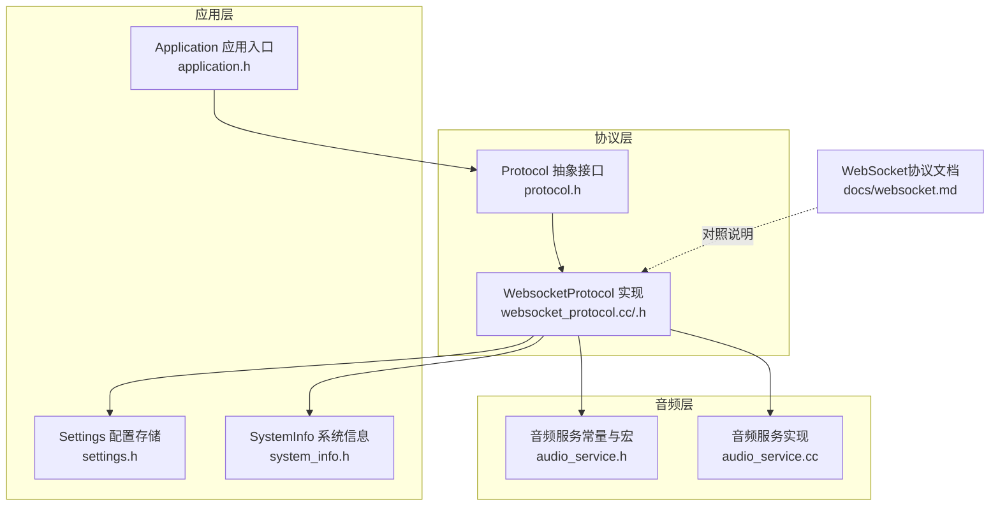
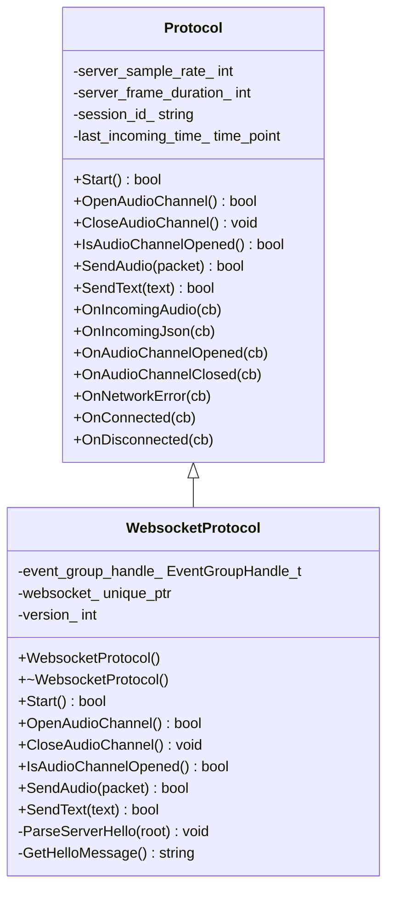
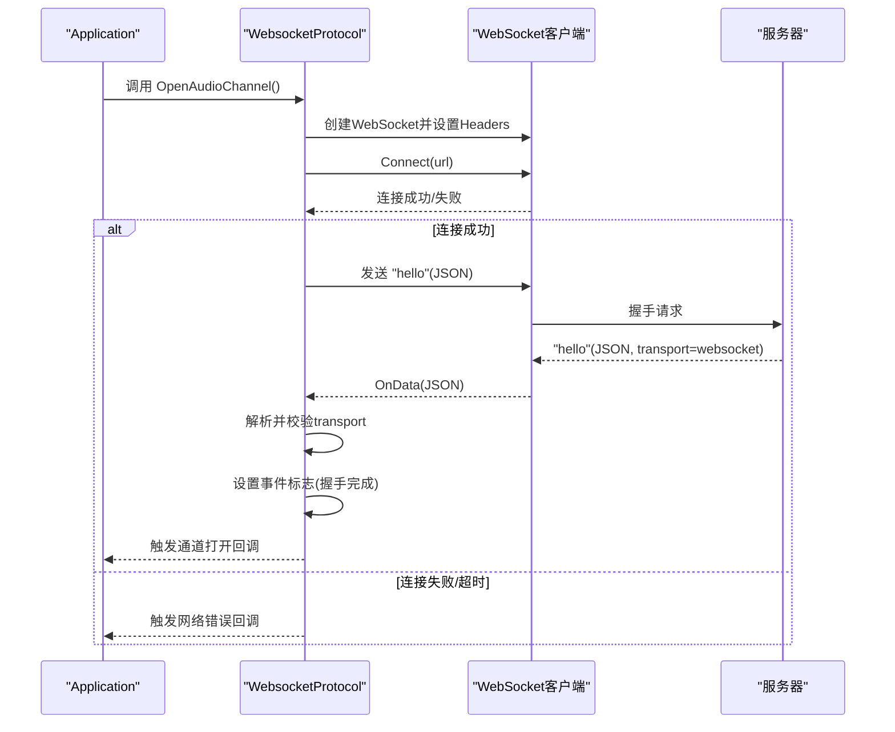
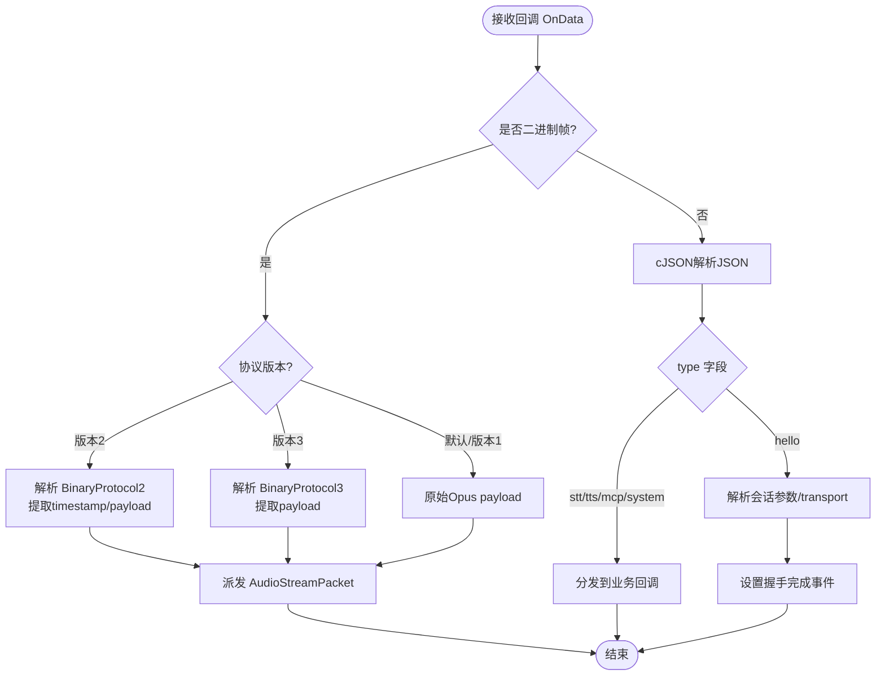
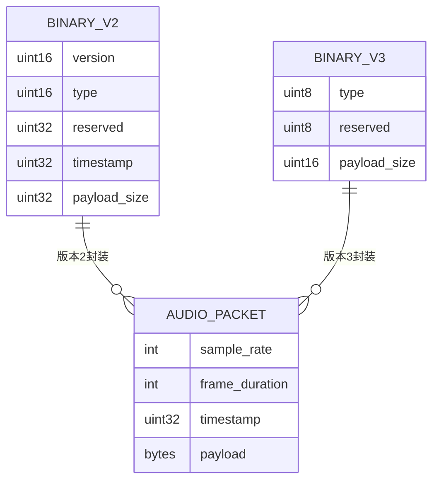
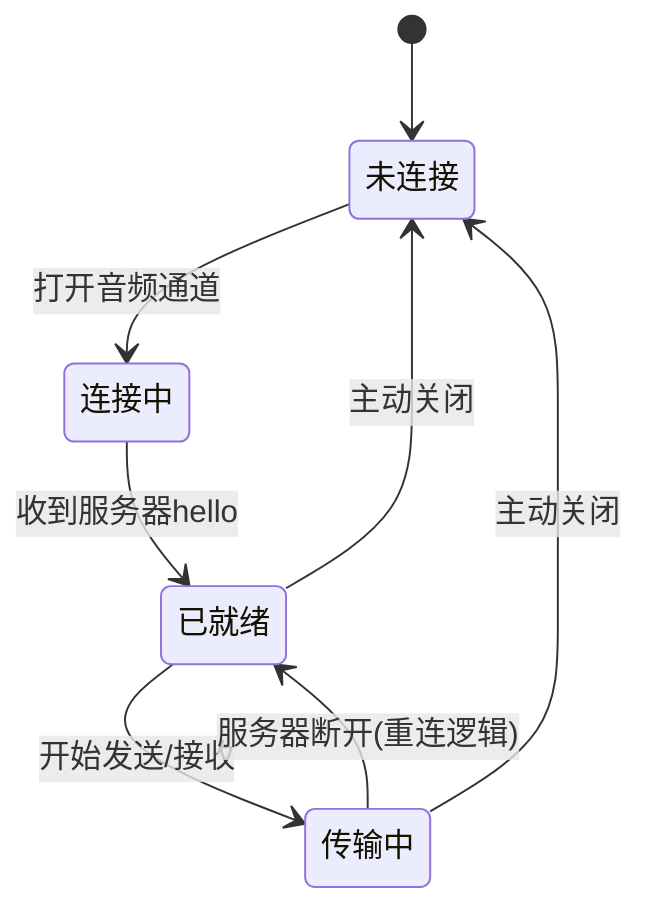
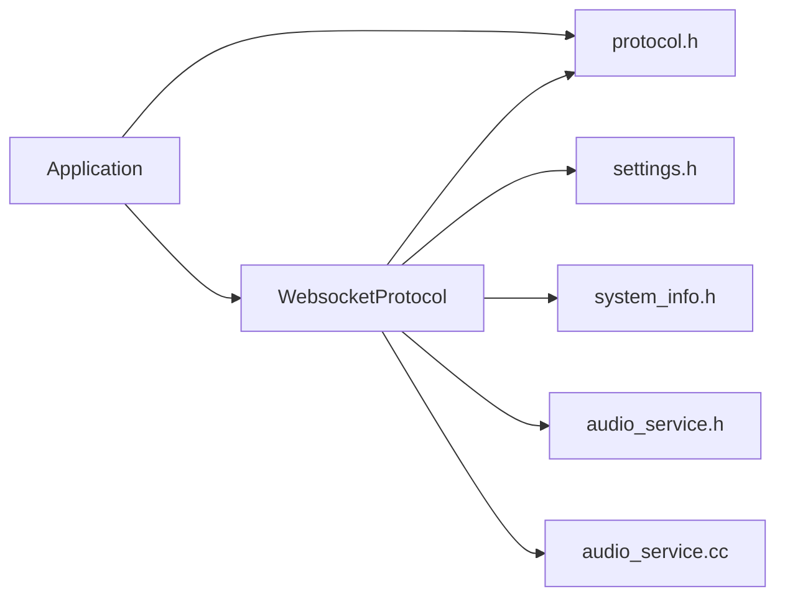

# WebSocket协议实现

<cite>
**本文引用的文件**
- [websocket_protocol.h](file://main/protocols/websocket_protocol.h)
- [websocket_protocol.cc](file://main/protocols/websocket_protocol.cc)
- [protocol.h](file://main/protocols/protocol.h)
- [websocket.md](file://docs/websocket.md)
- [settings.h](file://main/settings.h)
- [system_info.h](file://main/system_info.h)
- [application.h](file://main/application.h)
- [audio_service.h](file://main/audio/audio_service.h)
- [audio_service.cc](file://main/audio/audio_service.cc)
</cite>

## 目录
1. [引言](#引言)
2. [项目结构](#项目结构)
3. [核心组件](#核心组件)
4. [架构总览](#架构总览)
5. [详细组件分析](#详细组件分析)
6. [依赖关系分析](#依赖关系分析)
7. [性能考虑](#性能考虑)
8. [故障排除指南](#故障排除指南)
9. [结论](#结论)
10. [附录](#附录)

## 引言
本文件面向实时语音交互场景，系统化梳理该项目中基于ESP-IDF的WebSocket协议实现，覆盖连接建立、握手流程、双向通信机制、帧格式与数据传输、与HTTP的差异与优势、连接生命周期管理、消息格式设计（含音频与控制命令）、性能优化策略以及调试与排障方法。文档严格依据仓库源码与配套文档进行归纳总结，帮助开发者快速理解与扩展WebSocket通信子系统。

## 项目结构
WebSocket协议实现位于主程序模块的协议层，围绕统一的Protocol抽象接口展开，WebSocket实现类负责与服务器建立持久连接、发送/接收JSON控制消息与二进制音频帧，并维护会话状态与错误处理。



**图表来源**
- [protocol.h](file://main/protocols/protocol.h#L44-L95)
- [websocket_protocol.h](file://main/protocols/websocket_protocol.h#L13-L32)
- [websocket_protocol.cc](file://main/protocols/websocket_protocol.cc#L23-L200)
- [application.h](file://main/application.h#L32-L88)
- [settings.h](file://main/settings.h#L7-L26)
- [system_info.h](file://main/system_info.h#L9-L19)
- [audio_service.h](file://main/audio/audio_service.h#L36-L40)
- [audio_service.cc](file://main/audio/audio_service.cc#L37-L38)

**章节来源**
- [websocket_protocol.h](file://main/protocols/websocket_protocol.h#L1-L35)
- [websocket_protocol.cc](file://main/protocols/websocket_protocol.cc#L1-L254)
- [protocol.h](file://main/protocols/protocol.h#L1-L99)
- [websocket.md](file://docs/websocket.md#L1-L496)
- [application.h](file://main/application.h#L1-L91)
- [settings.h](file://main/settings.h#L1-L29)
- [system_info.h](file://main/system_info.h#L1-L22)
- [audio_service.h](file://main/audio/audio_service.h#L36-L40)
- [audio_service.cc](file://main/audio/audio_service.cc#L37-L38)

## 核心组件
- Protocol 抽象接口：定义统一的协议行为契约，包括音频通道打开/关闭、文本与音频消息发送、回调注册、会话参数与错误处理等。
- WebsocketProtocol：具体实现，负责WebSocket连接、握手、二进制与文本消息收发、版本协商、会话参数对齐、错误与超时处理。
- Application：应用主控，调度事件、状态机转换、音频服务集成、协议实例管理。
- Settings/SystemInfo：配置读取与系统信息（MAC、UUID等）提供，用于握手头部与鉴权。
- 音频服务：提供OPUS编解码、帧时长宏、队列长度等参数，支撑WebSocket音频帧的编码/解码与传输。

**章节来源**
- [protocol.h](file://main/protocols/protocol.h#L44-L95)
- [websocket_protocol.cc](file://main/protocols/websocket_protocol.cc#L23-L200)
- [application.h](file://main/application.h#L32-L88)
- [settings.h](file://main/settings.h#L7-L26)
- [system_info.h](file://main/system_info.h#L9-L19)
- [audio_service.h](file://main/audio/audio_service.h#L36-L40)

## 架构总览
WebSocket协议在整体系统中的位置如下：

```mermaid
graph TB
Client["设备端 Application<br/>application.h"]
Proto["Protocol 抽象<br/>protocol.h"]
WS["WebsocketProtocol<br/>websocket_protocol.cc/.h"]
Net["网络栈/WebSocket客户端<br/>esp-idf"]
Server["服务器端"]
Audio["音频服务与编解码<br/>audio_service.*"]
Client --> Proto
Proto --> WS
WS --> Net
WS <- --> Server
WS --> Audio
```

**图表来源**
- [application.h](file://main/application.h#L63-L88)
- [protocol.h](file://main/protocols/protocol.h#L44-L95)
- [websocket_protocol.cc](file://main/protocols/websocket_protocol.cc#L82-L200)
- [audio_service.h](file://main/audio/audio_service.h#L36-L40)

## 详细组件分析

### WebsocketProtocol 类与继承关系
WebsocketProtocol继承自Protocol，实现音频通道的打开/关闭、音频与文本消息发送、回调注册、握手与版本协商等。



**图表来源**
- [protocol.h](file://main/protocols/protocol.h#L44-L95)
- [websocket_protocol.h](file://main/protocols/websocket_protocol.h#L13-L32)

**章节来源**
- [websocket_protocol.h](file://main/protocols/websocket_protocol.h#L13-L32)
- [websocket_protocol.cc](file://main/protocols/websocket_protocol.cc#L15-L21)
- [protocol.h](file://main/protocols/protocol.h#L44-L95)

### 连接建立与握手流程
- 条件连接：音频通道按需建立，避免不必要的网络占用。
- 头部设置：Authorization（支持Bearer前缀）、Protocol-Version、Device-Id（MAC）、Client-Id（UUID）。
- 连接与握手：Connect成功后发送“hello”消息，等待服务器返回相同类型的“hello”，并校验transport字段；收到后设置事件标志，表示通道就绪。
- 超时与错误：握手超时（默认10秒）或连接失败触发网络错误回调。



**图表来源**
- [websocket_protocol.cc](file://main/protocols/websocket_protocol.cc#L82-L200)
- [websocket.md](file://docs/websocket.md#L16-L80)

**章节来源**
- [websocket_protocol.cc](file://main/protocols/websocket_protocol.cc#L82-L200)
- [websocket.md](file://docs/websocket.md#L16-L80)

### 双向通信机制与消息格式
- 文本帧（JSON）：用于控制消息，如“hello”、“listen”、“abort”、“mcp”、“stt”、“tts”、“system”等。
- 二进制帧（Opus音频）：设备侧发送录音编码帧；服务器侧下发TTS合成音频帧。
- 版本协商：通过配置项选择二进制协议版本（1/2/3），影响二进制帧的头部与字段布局。
- 会话参数对齐：服务器返回的audio_params用于对齐采样率与帧时长，WebSocket实现会记录并用于后续音频处理。



**图表来源**
- [websocket_protocol.cc](file://main/protocols/websocket_protocol.cc#L111-L165)
- [websocket_protocol.cc](file://main/protocols/websocket_protocol.cc#L227-L253)
- [protocol.h](file://main/protocols/protocol.h#L17-L31)

**章节来源**
- [websocket_protocol.cc](file://main/protocols/websocket_protocol.cc#L111-L165)
- [websocket_protocol.cc](file://main/protocols/websocket_protocol.cc#L227-L253)
- [protocol.h](file://main/protocols/protocol.h#L17-L31)
- [websocket.md](file://docs/websocket.md#L128-L293)

### 帧格式与数据传输
- 二进制协议版本1：直接发送Opus音频数据。
- 二进制协议版本2：带版本、类型、保留、时间戳、payload_size与payload的紧凑结构。
- 二进制协议版本3：简化版头部，包含类型、保留、payload_size与payload。
- 文本协议：以JSON为主，通过“type”字段区分业务类型，支持features、transport、audio_params等字段。



**图表来源**
- [protocol.h](file://main/protocols/protocol.h#L17-L31)
- [websocket_protocol.cc](file://main/protocols/websocket_protocol.cc#L33-L57)

**章节来源**
- [protocol.h](file://main/protocols/protocol.h#L17-L31)
- [websocket_protocol.cc](file://main/protocols/websocket_protocol.cc#L33-L57)
- [websocket.md](file://docs/websocket.md#L95-L126)

### 连接生命周期管理
- 建立：按需打开音频通道，设置头部，发起连接。
- 就绪：收到服务器“hello”且transport匹配，通道打开。
- 传输：音频二进制帧与JSON控制帧双向流动。
- 断开：服务器断开或主动关闭，触发通道关闭回调，回到空闲态。
- 超时：握手超时触发网络错误。



**图表来源**
- [websocket_protocol.cc](file://main/protocols/websocket_protocol.cc#L167-L172)
- [websocket_protocol.cc](file://main/protocols/websocket_protocol.cc#L187-L199)
- [websocket.md](file://docs/websocket.md#L308-L366)

**章节来源**
- [websocket_protocol.cc](file://main/protocols/websocket_protocol.cc#L167-L172)
- [websocket_protocol.cc](file://main/protocols/websocket_protocol.cc#L187-L199)
- [websocket.md](file://docs/websocket.md#L308-L366)

### WebSocket与HTTP的区别与优势
- HTTP为请求-响应模型，适合一次性数据交换；WebSocket为全双工长连接，适合低延迟实时交互（如语音通话、TTS播放、MCP控制）。
- WebSocket在本项目中用于：
  - 实时音频上/下行（Opus编码）
  - 控制消息（STT/TTS/MCP/System）
  - 会话状态与参数对齐
- 优势体现在：减少连接建立开销、降低时延、支持双向推送。

**章节来源**
- [websocket.md](file://docs/websocket.md#L1-L80)

### 消息格式设计（音频与控制命令）
- 设备→服务器：hello（携带features、transport、audio_params）、listen（start/stop/detect）、abort、wake word detected、mcp等。
- 服务器→设备：hello（transport、audio_params、session_id）、stt、llm、tts（start/stop/sentence_start）、mcp、system、custom等。
- 二进制音频帧：Opus编码，按协议版本封装元数据。

**章节来源**
- [websocket.md](file://docs/websocket.md#L128-L293)
- [websocket_protocol.cc](file://main/protocols/websocket_protocol.cc#L202-L225)

## 依赖关系分析
- WebsocketProtocol依赖Protocol接口以统一行为；依赖Settings读取URL、Token、协议版本；依赖SystemInfo提供Device-Id与Client-Id；依赖音频服务常量与实现以对齐采样率与帧时长。
- 与Application耦合体现在事件调度与状态机驱动，WebSocket仅在需要音频通道时才建立连接，降低资源消耗。



**图表来源**
- [websocket_protocol.cc](file://main/protocols/websocket_protocol.cc#L82-L110)
- [application.h](file://main/application.h#L63-L88)
- [settings.h](file://main/settings.h#L7-L26)
- [system_info.h](file://main/system_info.h#L9-L19)
- [audio_service.h](file://main/audio/audio_service.h#L36-L40)
- [audio_service.cc](file://main/audio/audio_service.cc#L37-L38)

**章节来源**
- [websocket_protocol.cc](file://main/protocols/websocket_protocol.cc#L82-L110)
- [application.h](file://main/application.h#L63-L88)

## 性能考虑
- 帧时长与队列：OPUS_FRAME_DURATION_MS为60ms，音频服务中定义了最大解码/发送队列长度，避免内存峰值与延迟累积。
- 二进制协议版本：版本2携带时间戳，有利于服务器端AEC；版本3更轻量；根据服务器能力选择合适版本。
- 采样率对齐：服务器下行音频采样率可能与设备不同，解码后重采样以适配设备播放链路。
- 按需连接：仅在需要音频通道时建立WebSocket，减少CPU与网络占用。
- 日志与错误：通过事件组与回调机制及时反馈错误，避免阻塞主循环。

**章节来源**
- [audio_service.h](file://main/audio/audio_service.h#L36-L40)
- [websocket_protocol.cc](file://main/protocols/websocket_protocol.cc#L33-L57)
- [websocket.md](file://docs/websocket.md#L390-L391)

## 故障排除指南
- 连接失败/超时：检查URL、Token、网络连通性；确认服务器返回的hello中transport字段与客户端一致；查看日志中的错误码。
- 服务器断开：检查鉴权（Authorization）、协议版本一致性、会话ID有效性；确认服务器端策略。
- 音频无声/失真：核对服务器audio_params与设备端采样率/帧时长是否一致；确认Opus编码参数；检查二进制协议版本。
- 超时与错误回调：WebSocket实现内置超时与错误设置，结合应用层回调定位问题。

**章节来源**
- [websocket_protocol.cc](file://main/protocols/websocket_protocol.cc#L167-L172)
- [websocket_protocol.cc](file://main/protocols/websocket_protocol.cc#L187-L193)
- [websocket.md](file://docs/websocket.md#L369-L379)

## 结论
该WebSocket协议实现以Protocol抽象为核心，围绕ESP-IDF的WebSocket客户端构建了低延迟、可扩展的实时通信通道。通过“hello”握手、二进制音频帧与JSON控制消息的组合，满足语音识别、TTS播放、MCP控制等多场景需求。配合按需连接、版本协商与参数对齐机制，在资源受限的嵌入式平台上实现了稳定高效的实时交互体验。

## 附录
- 配置键：websocket.url、websocket.token、websocket.version。
- 关键宏：OPUS_FRAME_DURATION_MS=60，用于统一音频帧时长。
- 文档对照：docs/websocket.md提供了消息示例、状态流转与注意事项，建议与源码配合阅读。

**章节来源**
- [websocket.md](file://docs/websocket.md#L82-L91)
- [audio_service.h](file://main/audio/audio_service.h#L36-L40)
- [websocket.md](file://docs/websocket.md#L409-L483)