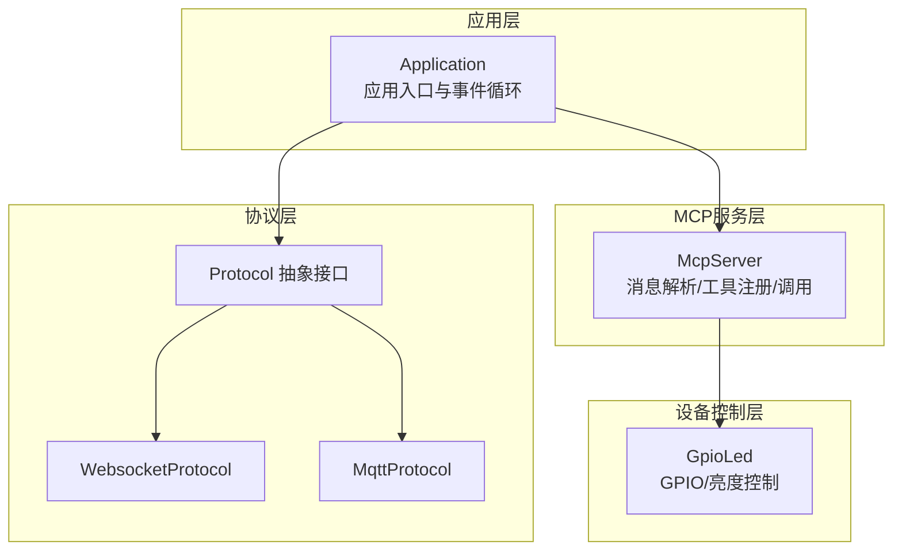
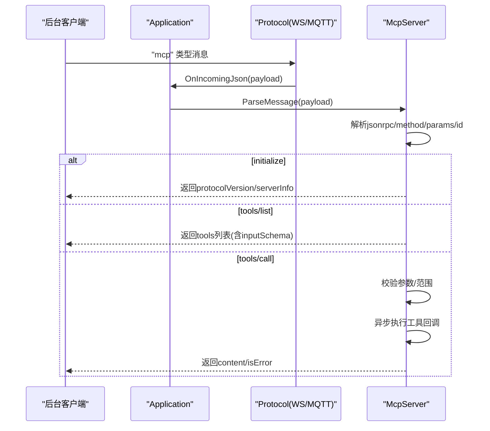
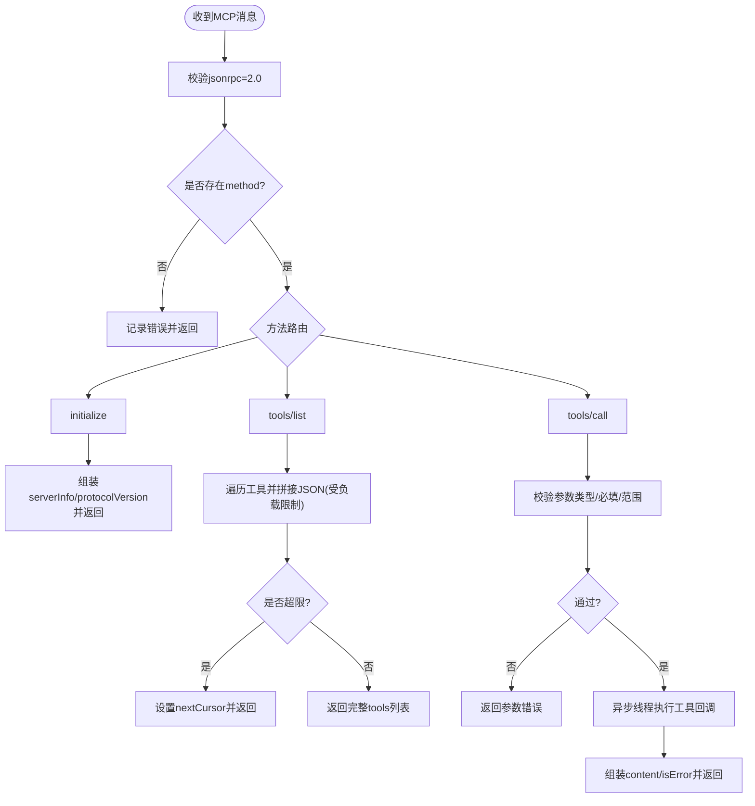
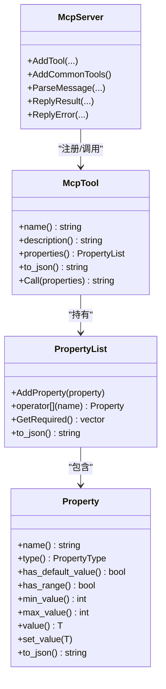
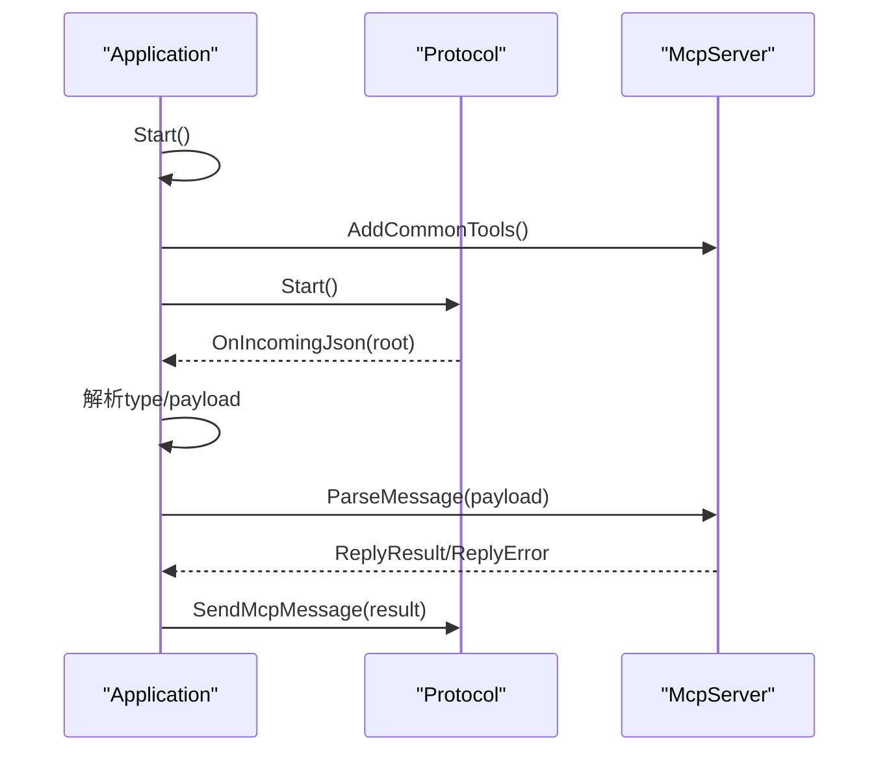
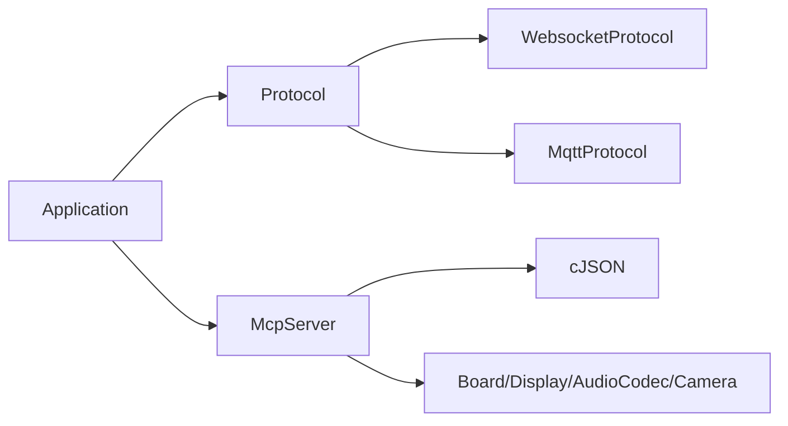

# 本地MCP协议

<cite>
**本文引用的文件**
- [mcp_server.h](file://main/mcp_server.h)
- [mcp_server.cc](file://main/mcp_server.cc)
- [mcp-protocol.md](file://docs/mcp-protocol.md)
- [mcp-usage.md](file://docs/mcp-usage.md)
- [application.h](file://main/application.h)
- [application.cc](file://main/application.cc)
- [protocol.h](file://main/protocols/protocol.h)
- [websocket_protocol.h](file://main/protocols/websocket_protocol.h)
- [mqtt_protocol.h](file://main/protocols/mqtt_protocol.h)
- [gpio_led.h](file://main/led/gpio_led.h)
- [gpio_led.cc](file://main/led/gpio_led.cc)
</cite>

## 目录
1. [简介](#简介)
2. [项目结构](#项目结构)
3. [核心组件](#核心组件)
4. [架构总览](#架构总览)
5. [详细组件分析](#详细组件分析)
6. [依赖关系分析](#依赖关系分析)
7. [性能考量](#性能考量)
8. [故障排查指南](#故障排查指南)
9. [结论](#结论)
10. [附录](#附录)

## 简介
本文件系统性梳理本地MCP（Model Context Protocol）协议在ESP32设备中的实现与使用，重点覆盖以下方面：
- MCP协议设计目的与应用场景：面向设备控制与状态同步，通过“工具”（Tool）抽象实现灵活的远程调用。
- MCP消息格式与数据结构：基于JSON-RPC 2.0封装，包含协议版本、方法名、参数、结果与错误等字段。
- MCP服务器实现机制：服务发现（tools/list）、客户端连接管理、消息路由与线程化工具调用。
- 与设备控制的集成：GPIO控制、屏幕背光/主题、音频音量、摄像头拍照与解释等。
- MCP消息的发送与接收处理流程：JSON解析、响应机制与通知（notifications）。
- 安全与访问控制：当前实现未内置认证授权，建议结合传输层（MQTT/WebSocket）与OTA配置进行安全加固。
- 调试工具与开发指南：基于日志、状态机与可视化提示，帮助快速集成与排障。

## 项目结构
MCP协议在本项目中的位置与职责：
- 协议封装与消息处理：位于 main/mcp_server.h/.cc，负责解析/生成MCP消息、注册工具、执行工具调用。
- 应用入口与协议桥接：位于 main/application.h/.cc，负责选择MQTT或WebSocket协议栈，接收/转发MCP消息。
- 传输协议接口：位于 main/protocols/protocol.h，抽象出通用的文本/音频通道与回调；具体实现位于 main/protocols/websocket_protocol.h 与 main/protocols/mqtt_protocol.h。
- 设备控制示例：位于 main/led/gpio_led.h/.cc，展示GPIO与LED控制，可作为工具回调的典型实现参考。

图表来源
- [application.cc](file://main/application.cc#L368-L498)
- [mcp_server.cc](file://main/mcp_server.cc#L1-L367)
- [protocol.h](file://main/protocols/protocol.h#L44-L95)
- [websocket_protocol.h](file://main/protocols/websocket_protocol.h#L13-L32)
- [mqtt_protocol.h](file://main/protocols/mqtt_protocol.h#L24-L57)
- [gpio_led.h](file://main/led/gpio_led.h#L13-L45)

章节来源
- [application.cc](file://main/application.cc#L368-L498)
- [mcp_server.h](file://main/mcp_server.h#L252-L279)
- [mcp_server.cc](file://main/mcp_server.cc#L1-L367)
- [protocol.h](file://main/protocols/protocol.h#L44-L95)

## 核心组件
- McpServer：单例服务器，负责注册工具、解析MCP消息、路由到对应工具、异步执行并回传结果。
- Property/PropertyList：参数模型，支持布尔/整数/字符串类型，可设定默认值与取值范围。
- McpTool：工具封装，包含名称、描述、输入schema与回调。
- Application：应用主循环，负责协议栈选择、MCP消息入栈解析、设备状态管理与事件调度。
- Protocol/WebsocketProtocol/MqttProtocol：传输协议抽象与实现，负责底层网络收发与MCP消息透传。

章节来源
- [mcp_server.h](file://main/mcp_server.h#L24-L279)
- [mcp_server.cc](file://main/mcp_server.cc#L31-L123)
- [application.h](file://main/application.h#L32-L88)
- [application.cc](file://main/application.cc#L368-L498)
- [protocol.h](file://main/protocols/protocol.h#L44-L95)
- [websocket_protocol.h](file://main/protocols/websocket_protocol.h#L13-L32)
- [mqtt_protocol.h](file://main/protocols/mqtt_protocol.h#L24-L57)

## 架构总览
MCP在系统中的交互路径：
- 应用启动后先注册通用工具，再初始化协议栈（MQTT或WebSocket）。
- 协议层接收来自服务器的“mcp”类型消息，交由Application解析，最终进入McpServer。
- McpServer根据方法名分派到initialize、tools/list或tools/call，执行相应逻辑并回传结果。
- 工具回调可直接操作设备（如LED、屏幕、音频、摄像头），也可通过Application间接下发指令。

图表来源
- [application.cc](file://main/application.cc#L454-L459)
- [mcp_server.cc](file://main/mcp_server.cc#L154-L238)
- [mcp_server.cc](file://main/mcp_server.cc#L257-L306)
- [mcp_server.cc](file://main/mcp_server.cc#L308-L367)

## 详细组件分析

### McpServer与消息处理
- 初始化流程：收到initialize请求后，解析客户端capabilities（如vision.url/token），填充设备信息与协议版本，返回result。
- 工具列表：支持游标分页，按最大负载限制拼接tools数组，必要时设置nextCursor。
- 工具调用：校验参数类型与必填项，支持整数范围约束；使用独立线程执行回调，避免阻塞主循环。
- 错误处理：缺失参数、未知工具、参数越界均返回错误；异常抛出被捕获并回传错误信息。

图表来源
- [mcp_server.cc](file://main/mcp_server.cc#L154-L238)
- [mcp_server.cc](file://main/mcp_server.cc#L257-L306)
- [mcp_server.cc](file://main/mcp_server.cc#L308-L367)

章节来源
- [mcp_server.cc](file://main/mcp_server.cc#L125-L238)
- [mcp_server.cc](file://main/mcp_server.cc#L257-L306)
- [mcp_server.cc](file://main/mcp_server.cc#L308-L367)

### Property与工具注册
- Property：支持布尔/整数/字符串三类，可设置默认值与取值范围；整数范围仅对整型生效。
- PropertyList：聚合多个Property，支持required字段推导、JSON序列化。
- McpTool：封装工具元信息与回调，支持将ReturnValue（bool/int/string）转换为标准MCP响应结构。

图表来源
- [mcp_server.h](file://main/mcp_server.h#L24-L279)

章节来源
- [mcp_server.h](file://main/mcp_server.h#L24-L172)
- [mcp_server.h](file://main/mcp_server.h#L174-L250)

### 通用工具与设备控制集成
- 自检与状态：self.get_device_status返回设备实时状态（音频、屏幕、电池、网络等）。
- 音频控制：self.audio_speaker.set_volume设置音量（0~100）。
- 屏幕控制：self.screen.set_brightness设置亮度；self.screen.set_theme切换主题（light/dark）。
- 摄像头控制：self.camera.take_photo拍照并解释，支持传入问题描述。

这些工具通过Board/Display/AudioCodec/Camera等设备接口完成实际控制，体现了“工具即函数”的设计思想。

章节来源
- [mcp_server.cc](file://main/mcp_server.cc#L31-L108)

### 应用入口与协议桥接
- Application在启动阶段注册通用MCP工具，随后根据OTA配置选择MQTT或WebSocket协议栈。
- 协议层回调中识别type="mcp"的消息，解析payload并交由McpServer处理。
- Application提供SendMcpMessage接口，统一通过协议栈发送MCP响应。

图表来源
- [application.cc](file://main/application.cc#L368-L498)
- [application.cc](file://main/application.cc#L454-L459)
- [application.cc](file://main/application.cc#L739-L745)
- [mcp_server.cc](file://main/mcp_server.cc#L240-L255)

章节来源
- [application.cc](file://main/application.cc#L368-L498)
- [application.cc](file://main/application.cc#L739-L745)

### 设备控制示例：GPIO与LED
- GpioLed通过LEDC驱动GPIO实现亮度调节与闪烁/渐变效果，配合Application的状态机自动切换不同模式下的LED行为。
- 该实现可作为工具回调中GPIO控制的参考模板，例如将工具参数映射到亮度/闪烁频率等。

章节来源
- [gpio_led.h](file://main/led/gpio_led.h#L13-L45)
- [gpio_led.cc](file://main/led/gpio_led.cc#L202-L249)

## 依赖关系分析
- McpServer依赖cJSON进行JSON解析与序列化，依赖Board/Display/AudioCodec/Camera等设备接口。
- Application依赖Protocol抽象，运行时注入WebsocketProtocol或MqttProtocol实例。
- Protocol为纯虚接口，具体实现负责网络收发与MCP消息透传。
- 通用工具链路：McpServer -> Board/Display/AudioCodec/Camera -> 硬件外设。

图表来源
- [mcp_server.cc](file://main/mcp_server.cc#L1-L367)
- [application.cc](file://main/application.cc#L368-L498)
- [protocol.h](file://main/protocols/protocol.h#L44-L95)
- [websocket_protocol.h](file://main/protocols/websocket_protocol.h#L13-L32)
- [mqtt_protocol.h](file://main/protocols/mqtt_protocol.h#L24-L57)

章节来源
- [mcp_server.cc](file://main/mcp_server.cc#L1-L367)
- [application.cc](file://main/application.cc#L368-L498)
- [protocol.h](file://main/protocols/protocol.h#L44-L95)

## 性能考量
- 工具列表分页：tools/list对payload长度进行限制，超过阈值设置nextCursor，避免单次响应过大导致内存压力。
- 工具调用异步化：使用独立线程执行工具回调，避免阻塞主事件循环，提高并发响应能力。
- 线程栈大小：支持通过stackSize参数调整工具调用线程栈大小，默认值在源码中定义。
- JSON解析与序列化：使用cJSON进行轻量级JSON处理，注意在高频调用场景下关注内存分配与释放。

章节来源
- [mcp_server.cc](file://main/mcp_server.cc#L257-L306)
- [mcp_server.cc](file://main/mcp_server.cc#L308-L367)

## 故障排查指南
- JSON解析失败：当收到无法解析的MCP消息时，服务器记录错误日志并忽略该消息。
- 方法未实现：收到未知method时返回“Method not implemented”错误。
- 参数缺失或类型不符：tools/call阶段校验失败将返回“Missing valid argument”或具体异常信息。
- 工具不存在：调用未知工具返回“Unknown tool”错误。
- 范围越界：整数参数超出范围将触发异常并回传错误。
- 日志定位：MCP模块使用统一TAG，可在日志中快速过滤定位问题。

章节来源
- [mcp_server.cc](file://main/mcp_server.cc#L125-L133)
- [mcp_server.cc](file://main/mcp_server.cc#L154-L238)
- [mcp_server.cc](file://main/mcp_server.cc#L308-L367)

## 结论
本项目以MCP协议为核心，构建了从消息解析、工具注册到设备控制的完整链路。通过JSON-RPC 2.0封装与工具抽象，实现了设备能力的标准化暴露与远程调用。结合Application的状态机与Protocol抽象，MCP既能在WebSocket也能在MQTT上稳定运行。建议在生产环境中结合传输层安全策略与OTA配置，进一步强化访问控制与数据加密。

## 附录

### MCP消息格式与交互要点
- 基于JSON-RPC 2.0，消息内层为payload，外层由基础协议承载（如WebSocket/MQTT）。
- 主要方法：initialize、tools/list、tools/call；支持notifications类通知（无id）。
- tools/list支持分页，通过cursor与nextCursor实现增量拉取。
- tools/call支持参数校验（类型、必填、范围），返回content与isError。

章节来源
- [mcp-protocol.md](file://docs/mcp-protocol.md#L7-L36)
- [mcp-protocol.md](file://docs/mcp-protocol.md#L61-L106)
- [mcp-protocol.md](file://docs/mcp-protocol.md#L108-L148)
- [mcp-protocol.md](file://docs/mcp-protocol.md#L150-L196)

### 开发与调试指南
- 工具注册：使用McpServer::AddTool或AddCommonTools注册工具，确保name唯一、description清晰、inputSchema完整。
- 参数约束：整数参数建议设置合理范围，避免越界；布尔/字符串参数注意必填性。
- 调试技巧：利用Application日志输出与设备状态指示灯，快速定位问题；必要时开启更详细的日志级别。
- 传输层选择：根据部署环境选择MQTT或WebSocket，确保服务器端支持相应特性（如MQTT的AES解密、WebSocket的握手）。

章节来源
- [mcp-usage.md](file://docs/mcp-usage.md#L18-L59)
- [application.cc](file://main/application.cc#L368-L498)
- [protocol.h](file://main/protocols/protocol.h#L44-L95)