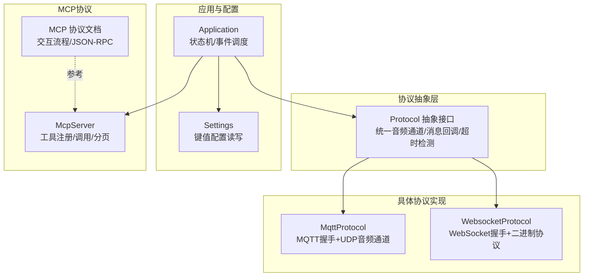
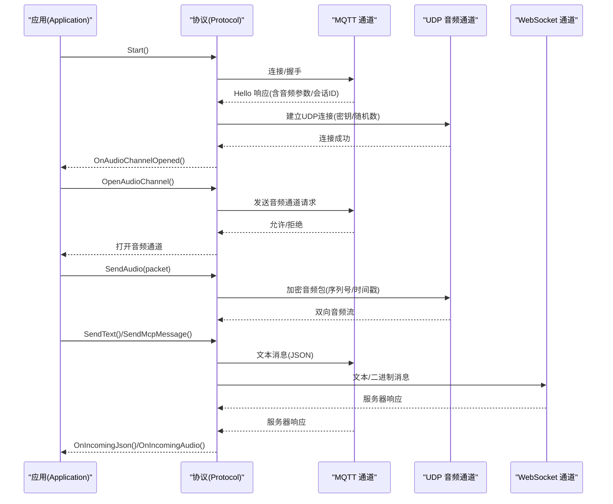
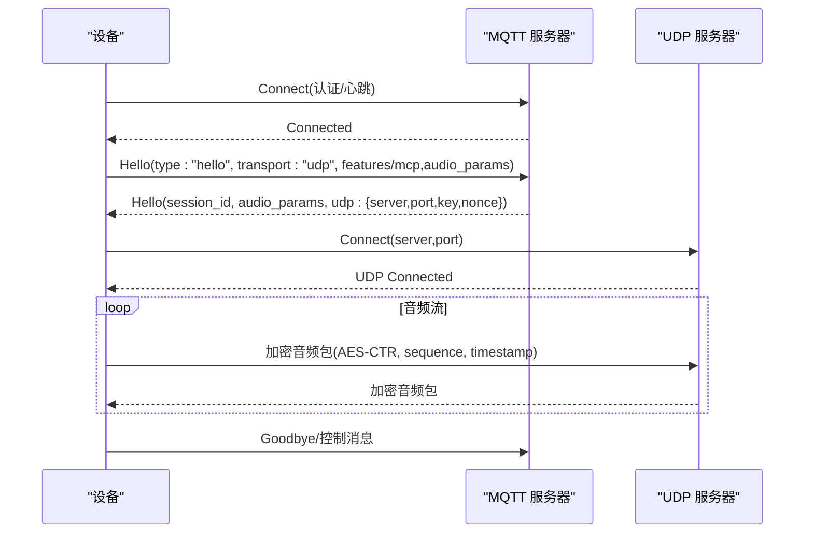
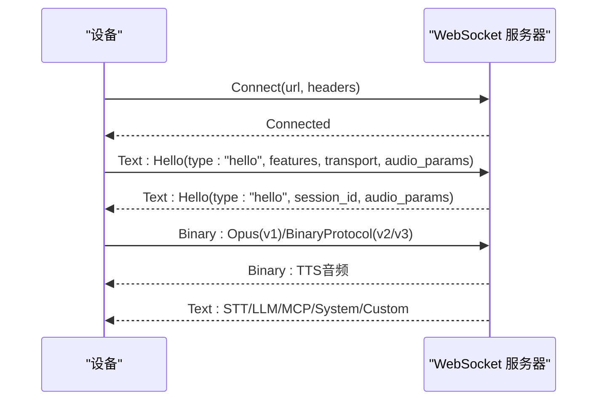
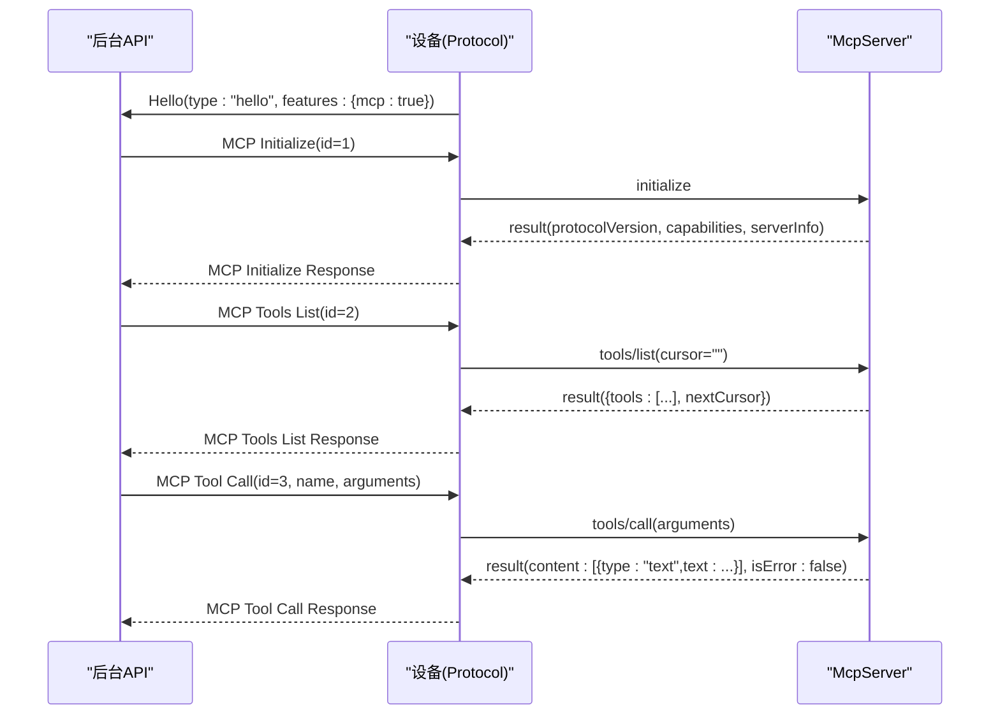
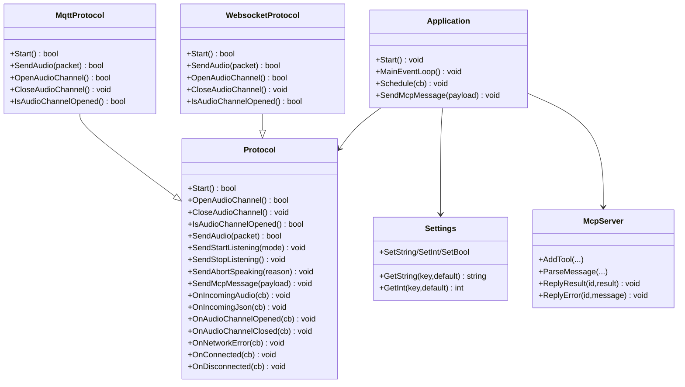

# 通信协议系统

<cite>
**本文引用的文件**
- [main/protocols/protocol.h](file://main/protocols/protocol.h)
- [main/protocols/protocol.cc](file://main/protocols/protocol.cc)
- [main/protocols/mqtt_protocol.h](file://main/protocols/mqtt_protocol.h)
- [main/protocols/mqtt_protocol.cc](file://main/protocols/mqtt_protocol.cc)
- [main/protocols/websocket_protocol.h](file://main/protocols/websocket_protocol.h)
- [main/protocols/websocket_protocol.cc](file://main/protocols/websocket_protocol.cc)
- [docs/mqtt-udp.md](file://docs/mqtt-udp.md)
- [docs/websocket.md](file://docs/websocket.md)
- [docs/mcp-protocol.md](file://docs/mcp-protocol.md)
- [docs/mcp-usage.md](file://docs/mcp-usage.md)
- [main/application.h](file://main/application.h)
- [main/settings.h](file://main/settings.h)
- [main/mcp_server.h](file://main/mcp_server.h)
- [main/mcp_server.cc](file://main/mcp_server.cc)
</cite>

## 目录
1. [引言](#引言)
2. [项目结构](#项目结构)
3. [核心组件](#核心组件)
4. [架构总览](#架构总览)
5. [详细组件分析](#详细组件分析)
6. [依赖关系分析](#依赖关系分析)
7. [性能考量](#性能考量)
8. [故障排除指南](#故障排除指南)
9. [结论](#结论)
10. [附录](#附录)

## 引言
本文件面向通信协议系统，系统性梳理协议抽象层设计、MQTT+UDP混合协议、WebSocket协议、以及本地MCP协议的实现与应用。文档旨在帮助开发者快速理解统一接口下的多协议支持、协议切换策略、性能对比与适用场景，并提供配置、安全与故障排除指南。

## 项目结构
- 协议抽象层位于 main/protocols，定义统一接口与通用行为（如会话、音频通道、错误处理、超时检测）。
- MQTT+UDP混合协议实现位于 main/protocols/mqtt_protocol.*，负责通过MQTT握手与控制、通过UDP进行加密音频传输。
- WebSocket协议实现位于 main/protocols/websocket_protocol.*，负责通过WebSocket进行双向数据与控制。
- MCP协议文档与实现位于 docs/mcp-*.md 与 main/mcp_server.*，用于设备能力发现与工具调用，承载物联网控制与状态同步。
- 应用入口与调度位于 main/application.h，负责状态机、事件调度与协议实例管理。
- 配置读写位于 main/settings.h，用于读取MQTT/WebSocket等运行时配置。

图表来源
- [main/protocols/protocol.h](file://main/protocols/protocol.h#L44-L95)
- [main/protocols/mqtt_protocol.h](file://main/protocols/mqtt_protocol.h#L24-L57)
- [main/protocols/websocket_protocol.h](file://main/protocols/websocket_protocol.h#L13-L32)
- [main/application.h](file://main/application.h#L32-L88)
- [main/settings.h](file://main/settings.h#L7-L26)
- [main/mcp_server.h](file://main/mcp_server.h#L252-L282)
- [docs/mcp-protocol.md](file://docs/mcp-protocol.md#L1-L270)

章节来源
- [main/protocols/protocol.h](file://main/protocols/protocol.h#L1-L99)
- [main/protocols/protocol.cc](file://main/protocols/protocol.cc#L1-L91)
- [main/protocols/mqtt_protocol.h](file://main/protocols/mqtt_protocol.h#L1-L61)
- [main/protocols/mqtt_protocol.cc](file://main/protocols/mqtt_protocol.cc#L1-L369)
- [main/protocols/websocket_protocol.h](file://main/protocols/websocket_protocol.h#L1-L35)
- [main/protocols/websocket_protocol.cc](file://main/protocols/websocket_protocol.cc#L1-L254)
- [main/application.h](file://main/application.h#L1-L91)
- [main/settings.h](file://main/settings.h#L1-L29)
- [main/mcp_server.h](file://main/mcp_server.h#L1-L282)
- [main/mcp_server.cc](file://main/mcp_server.cc#L1-L367)
- [docs/mqtt-udp.md](file://docs/mqtt-udp.md#L1-L393)
- [docs/websocket.md](file://docs/websocket.md#L1-L496)
- [docs/mcp-protocol.md](file://docs/mcp-protocol.md#L1-L270)
- [docs/mcp-usage.md](file://docs/mcp-usage.md#L1-L115)

## 核心组件
- 协议抽象层 Protocol
  - 统一音频通道生命周期：OpenAudioChannel/CloseAudioChannel/IsAudioChannelOpened
  - 统一消息回调：OnIncomingAudio/OnIncomingJson/OnAudioChannelOpened/OnAudioChannelClosed/OnNetworkError/OnConnected/OnDisconnected
  - 统一控制消息发送：SendStartListening/SendStopListening/SendAbortSpeaking/SendWakeWordDetected/SendMcpMessage
  - 超时检测与错误上报：IsTimeout/SetError
- MQTT+UDP混合协议 MqttProtocol
  - 通过MQTT进行握手与控制，通过UDP进行加密音频传输
  - 支持AES-CTR加密、序列号校验、自动重连
- WebSocket协议 WebsocketProtocol
  - 通过WebSocket进行握手与控制，支持二进制协议版本（v1/v2/v3）
  - 支持会话ID、鉴权头、音频参数协商
- MCP协议与服务器 McpServer
  - 基于JSON-RPC 2.0封装，支持initialize/tools/list/tools/call
  - 工具注册与参数校验，线程化工具调用，分页返回工具列表

章节来源
- [main/protocols/protocol.h](file://main/protocols/protocol.h#L44-L95)
- [main/protocols/protocol.cc](file://main/protocols/protocol.cc#L7-L91)
- [main/protocols/mqtt_protocol.h](file://main/protocols/mqtt_protocol.h#L24-L57)
- [main/protocols/mqtt_protocol.cc](file://main/protocols/mqtt_protocol.cc#L44-L137)
- [main/protocols/websocket_protocol.h](file://main/protocols/websocket_protocol.h#L13-L32)
- [main/protocols/websocket_protocol.cc](file://main/protocols/websocket_protocol.cc#L23-L76)
- [main/mcp_server.h](file://main/mcp_server.h#L252-L282)
- [main/mcp_server.cc](file://main/mcp_server.cc#L125-L238)

## 架构总览
系统通过统一的 Protocol 抽象层屏蔽底层差异，使上层应用无需关心具体传输细节。MQTT+UDP适合高实时性音频场景，WebSocket适合通用双向通信与二进制协议扩展。

图表来源
- [main/protocols/mqtt_protocol.cc](file://main/protocols/mqtt_protocol.cc#L44-L137)
- [main/protocols/websocket_protocol.cc](file://main/protocols/websocket_protocol.cc#L82-L199)
- [main/protocols/protocol.cc](file://main/protocols/protocol.cc#L57-L79)

## 详细组件分析

### 协议抽象层 Protocol
- 设计要点
  - 将“音频通道”“消息回调”“超时检测”等抽象为统一接口，便于替换与扩展
  - 通过回调注入业务处理，降低耦合
- 关键行为
  - 音频通道管理：Open/Close/IsOpened
  - 控制消息封装：listen/abort/mcp 等
  - 超时检测：基于最近一次收包时间，超过阈值视为不可用
- 适用性
  - 为MQTT+UDP与WebSocket提供一致的上层调用体验

章节来源
- [main/protocols/protocol.h](file://main/protocols/protocol.h#L44-L95)
- [main/protocols/protocol.cc](file://main/protocols/protocol.cc#L35-L91)

### MQTT+UDP 混合协议
- 连接与握手
  - 通过 Settings 读取 endpoint/client_id/username/password/keepalive/publish_topic
  - 连接成功后发送 hello，携带 features/audio_params/transport
  - 服务器返回 hello，包含 session_id、音频参数与 udp 服务器信息
- 音频通道
  - 使用 AES-CTR 加密，nonce 包含 payload_len/timestamp/sequence
  - 接收端按 sequence 顺序校验，丢弃过旧包
- 错误与重连
  - MQTT 断开后定时器触发重连
  - 超时检测与错误上报
- 适用场景
  - 对实时性要求高的语音交互，UDP 通道承载音频，MQTT 通道承载控制

图表来源
- [main/protocols/mqtt_protocol.cc](file://main/protocols/mqtt_protocol.cc#L89-L137)
- [main/protocols/mqtt_protocol.cc](file://main/protocols/mqtt_protocol.cc#L194-L274)
- [docs/mqtt-udp.md](file://docs/mqtt-udp.md#L24-L57)

章节来源
- [main/protocols/mqtt_protocol.h](file://main/protocols/mqtt_protocol.h#L24-L57)
- [main/protocols/mqtt_protocol.cc](file://main/protocols/mqtt_protocol.cc#L44-L137)
- [main/protocols/mqtt_protocol.cc](file://main/protocols/mqtt_protocol.cc#L194-L274)
- [main/protocols/mqtt_protocol.cc](file://main/protocols/mqtt_protocol.cc#L301-L364)
- [docs/mqtt-udp.md](file://docs/mqtt-udp.md#L1-L393)

### WebSocket 协议
- 连接与握手
  - 仅在需要音频时建立连接，设置 Authorization/Protocol-Version/Device-Id/Client-Id
  - 发送 hello，等待服务器 hello；超时则报错
- 二进制协议版本
  - v1：直接发送 Opus 二进制帧
  - v2：带时间戳与payload_size的二进制头
  - v3：简化二进制头
- 控制消息
  - listen/abort/wake word/mcp/system/custom 等
- 适用场景
  - 通用双向通信、二进制协议扩展、TLS 传输更友好

图表来源
- [main/protocols/websocket_protocol.cc](file://main/protocols/websocket_protocol.cc#L82-L199)
- [docs/websocket.md](file://docs/websocket.md#L7-L80)

章节来源
- [main/protocols/websocket_protocol.h](file://main/protocols/websocket_protocol.h#L13-L32)
- [main/protocols/websocket_protocol.cc](file://main/protocols/websocket_protocol.cc#L23-L76)
- [main/protocols/websocket_protocol.cc](file://main/protocols/websocket_protocol.cc#L82-L199)
- [docs/websocket.md](file://docs/websocket.md#L1-L496)

### MCP 协议（本地MCP服务器）
- 协议封装
  - 通过 Protocol 的 SendMcpMessage 将 JSON-RPC 2.0 负载封装在基础协议消息中
  - 支持 initialize/tools/list/tools/call 等方法
- 工具注册与调用
  - 支持布尔/整数/字符串参数，带默认值与范围校验
  - 分页返回工具列表，线程化执行工具回调
- 应用场景
  - 设备能力发现、状态同步、远程控制（如音量、屏幕亮度、拍照等）

图表来源
- [docs/mcp-protocol.md](file://docs/mcp-protocol.md#L37-L267)
- [main/mcp_server.cc](file://main/mcp_server.cc#L154-L238)
- [main/mcp_server.cc](file://main/mcp_server.cc#L257-L306)
- [main/mcp_server.cc](file://main/mcp_server.cc#L308-L367)
- [main/protocols/protocol.cc](file://main/protocols/protocol.cc#L76-L79)

章节来源
- [docs/mcp-protocol.md](file://docs/mcp-protocol.md#L1-L270)
- [docs/mcp-usage.md](file://docs/mcp-usage.md#L1-L115)
- [main/mcp_server.h](file://main/mcp_server.h#L174-L250)
- [main/mcp_server.cc](file://main/mcp_server.cc#L125-L238)
- [main/mcp_server.cc](file://main/mcp_server.cc#L257-L306)
- [main/mcp_server.cc](file://main/mcp_server.cc#L308-L367)
- [main/protocols/protocol.cc](file://main/protocols/protocol.cc#L76-L79)

## 依赖关系分析
- 协议抽象层与具体协议
  - MqttProtocol/WebsocketProtocol 均继承自 Protocol，覆写 Start/SendAudio/OpenAudioChannel/IsAudioChannelOpened 等
- 应用层与协议层
  - Application 持有 Protocol 指针，负责状态机与事件调度
- 配置与协议
  - Settings 提供键值读取，MQTT/WebSocket 从 Settings 读取 endpoint/token/version 等
- MCP 与协议
  - Protocol 提供 SendMcpMessage，McpServer 解析/路由 JSON-RPC，最终通过 Application 回传

图表来源
- [main/protocols/protocol.h](file://main/protocols/protocol.h#L44-L95)
- [main/protocols/mqtt_protocol.h](file://main/protocols/mqtt_protocol.h#L24-L57)
- [main/protocols/websocket_protocol.h](file://main/protocols/websocket_protocol.h#L13-L32)
- [main/application.h](file://main/application.h#L32-L88)
- [main/settings.h](file://main/settings.h#L7-L26)
- [main/mcp_server.h](file://main/mcp_server.h#L252-L282)

章节来源
- [main/protocols/protocol.h](file://main/protocols/protocol.h#L44-L95)
- [main/protocols/mqtt_protocol.h](file://main/protocols/mqtt_protocol.h#L24-L57)
- [main/protocols/websocket_protocol.h](file://main/protocols/websocket_protocol.h#L13-L32)
- [main/application.h](file://main/application.h#L32-L88)
- [main/settings.h](file://main/settings.h#L7-L26)
- [main/mcp_server.h](file://main/mcp_server.h#L252-L282)

## 性能考量
- MQTT+UDP
  - 优点：音频通道采用UDP，实时性强；控制通道MQTT可靠
  - 缺点：UDP加密与序列号管理增加CPU开销；防火墙/NAT穿透复杂
  - 优化：AES-CTR流水线、序列号连续性检查、互斥锁保护UDP
- WebSocket
  - 优点：部署简单、TLS友好、二进制协议版本可选
  - 缺点：音频通道为二进制帧，实时性不及UDP
  - 优化：二进制协议v2携带时间戳，利于服务端AEC
- MCP
  - 优点：标准化JSON-RPC，工具注册与调用清晰
  - 优化：工具线程化执行，分页返回工具列表，避免大payload阻塞

章节来源
- [docs/mqtt-udp.md](file://docs/mqtt-udp.md#L323-L343)
- [docs/websocket.md](file://docs/websocket.md#L381-L402)
- [main/mcp_server.cc](file://main/mcp_server.cc#L257-L306)

## 故障排除指南
- MQTT 连接失败
  - 检查 endpoint/username/password/keepalive/publish_topic
  - 查看错误回调与日志，确认服务器可达与认证有效
- UDP 音频通道异常
  - 核对服务器下发的 udp.server/port/key/nonce
  - 检查 AES-CTR 解密与序列号连续性
- WebSocket 连接失败
  - 检查 Authorization/Protocol-Version/Device-Id/Client-Id
  - 确认握手超时与服务器 hello 匹配
- 超时与通道不可用
  - 基类提供超时检测，检查最近收包时间
- MCP 调用失败
  - 检查工具名称与参数类型/范围
  - 查看 ReplyError 返回的错误信息

章节来源
- [main/protocols/mqtt_protocol.cc](file://main/protocols/mqtt_protocol.cc#L54-L68)
- [main/protocols/mqtt_protocol.cc](file://main/protocols/mqtt_protocol.cc#L222-L266)
- [main/protocols/websocket_protocol.cc](file://main/protocols/websocket_protocol.cc#L174-L179)
- [main/protocols/protocol.cc](file://main/protocols/protocol.cc#L81-L91)
- [main/mcp_server.cc](file://main/mcp_server.cc#L314-L348)

## 结论
本系统通过 Protocol 抽象层实现了对 MQTT+UDP 与 WebSocket 的统一支持，并以 MCP 协议标准化设备控制与状态同步。在不同网络与实时性需求下，可灵活选择协议组合：高实时语音交互优先 MQTT+UDP，通用双向通信优先 WebSocket。配合完善的错误处理、超时检测与配置管理，系统具备良好的可维护性与扩展性。

## 附录

### 协议选择与切换策略
- 选择依据
  - 实时性：MQTT+UDP > WebSocket
  - 部署友好度：WebSocket > MQTT+UDP
  - 可靠性：WebSocket > MQTT+UDP（MQTT断线自动重连）
- 切换步骤
  - 在 Application 层切换 Protocol 实例
  - 更新 Settings 中对应配置（endpoint/url/token/version）
  - 重新握手与打开音频通道

章节来源
- [docs/mqtt-udp.md](file://docs/mqtt-udp.md#L346-L357)
- [docs/websocket.md](file://docs/websocket.md#L381-L402)
- [main/application.h](file://main/application.h#L32-L88)
- [main/settings.h](file://main/settings.h#L7-L26)

### 配置清单与安全考虑
- MQTT 配置
  - endpoint/client_id/username/password/keepalive/publish_topic
  - TLS 8883 端口、用户名密码认证
- WebSocket 配置
  - url/token/version
  - Authorization: Bearer <token>、Protocol-Version、Device-Id、Client-Id
- 安全
  - MQTT：TLS/用户名密码
  - UDP：AES-CTR 加密、序列号防重放
  - MCP：通过基础协议承载，遵循对应传输安全

章节来源
- [docs/mqtt-udp.md](file://docs/mqtt-udp.md#L259-L321)
- [docs/websocket.md](file://docs/websocket.md#L82-L91)
- [main/protocols/mqtt_protocol.cc](file://main/protocols/mqtt_protocol.cc#L54-L68)
- [main/protocols/websocket_protocol.cc](file://main/protocols/websocket_protocol.cc#L100-L106)