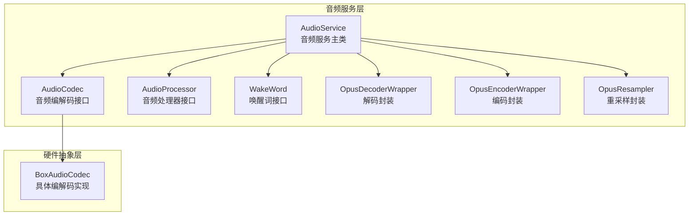
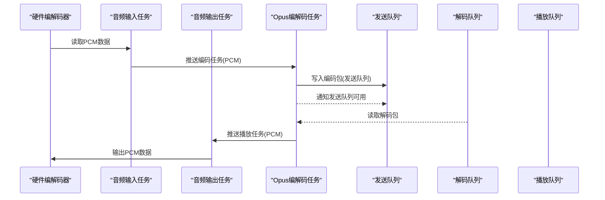
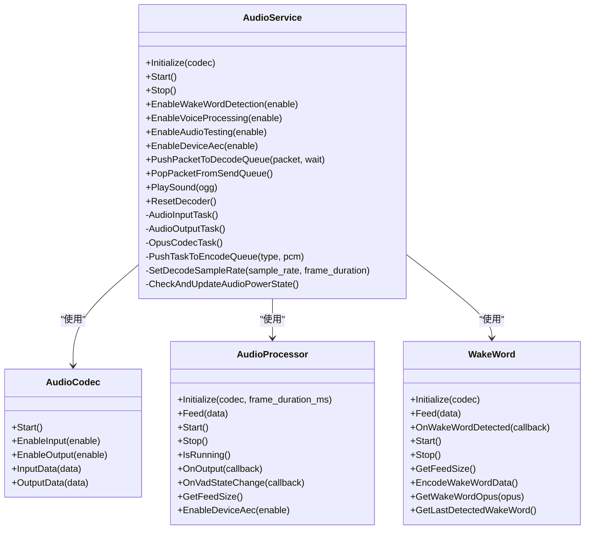
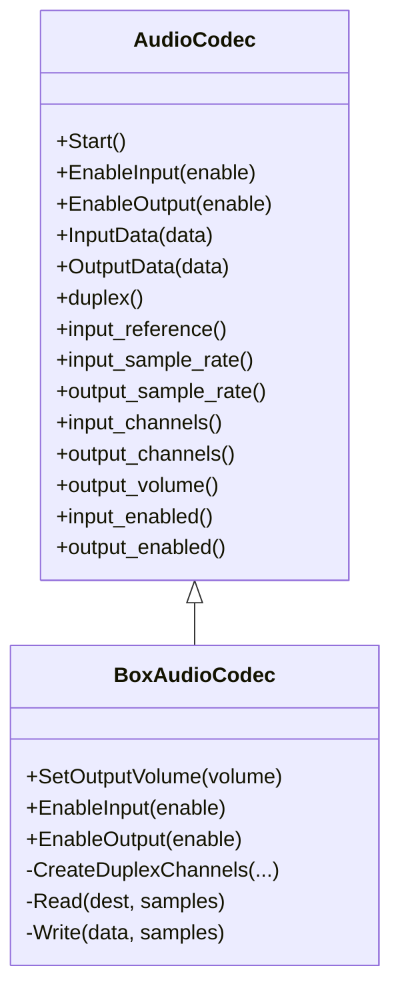
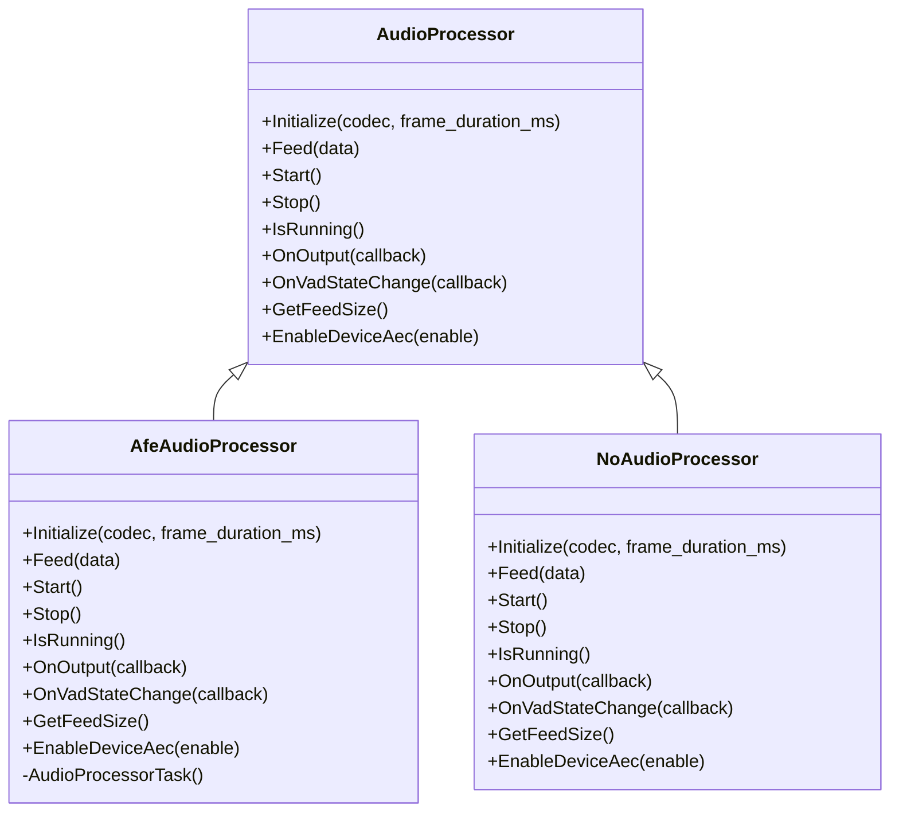
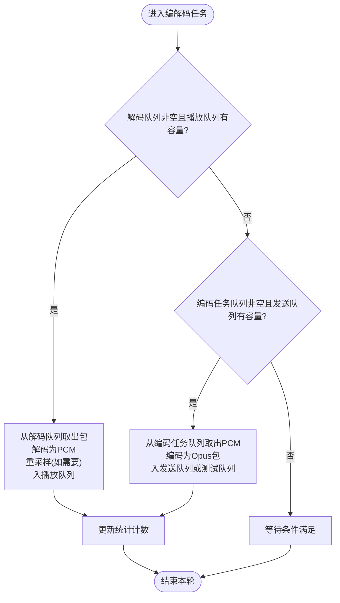
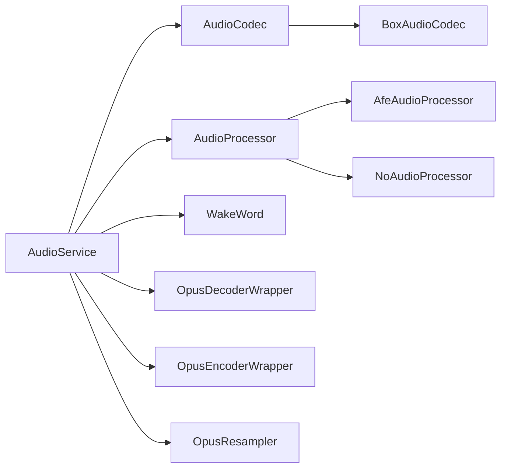

# AudioService架构设计

<cite>
**本文引用的文件**
- [audio_service.h](file://main/audio/audio_service.h)
- [audio_service.cc](file://main/audio/audio_service.cc)
- [audio_codec.h](file://main/audio/audio_codec.h)
- [audio_codec.cc](file://main/audio/audio_codec.cc)
- [box_audio_codec.h](file://main/audio/codecs/box_audio_codec.h)
- [box_audio_codec.cc](file://main/audio/codecs/box_audio_codec.cc)
- [audio_processor.h](file://main/audio/audio_processor.h)
- [afe_audio_processor.h](file://main/audio/processors/afe_audio_processor.h)
- [afe_audio_processor.cc](file://main/audio/processors/afe_audio_processor.cc)
- [no_audio_processor.cc](file://main/audio/processors/no_audio_processor.cc)
- [wake_word.h](file://main/audio/wake_word.h)
</cite>

## 目录
1. [简介](#简介)
2. [项目结构](#项目结构)
3. [核心组件](#核心组件)
4. [架构总览](#架构总览)
5. [详细组件分析](#详细组件分析)
6. [依赖关系分析](#依赖关系分析)
7. [性能考量](#性能考量)
8. [故障排查指南](#故障排查指南)
9. [结论](#结论)

## 简介
本技术文档围绕AudioService的多线程架构展开，系统性阐述其在ESP-IDF与FreeRTOS环境下的设计与实现。AudioService通过分离的音频输入/输出任务与Opus编解码任务，构建了两条主要音频数据流路径：录音到服务器的发送路径（编码后入发送队列）与服务器到播放的接收路径（解码后入播放队列）。文档还深入解析音频队列管理机制（发送队列、解码队列、测试队列、编码任务队列、播放队列）、事件组机制在状态管理中的作用（音频测试、唤醒词检测、音频处理器运行），以及任务调度、优先级与实时性保障策略。

## 项目结构
AudioService位于main/audio目录下，核心文件包括：
- 音频服务主类：audio_service.h/.cc
- 音频编解码接口与实现：audio_codec.h/.cc 及具体板卡编解码实现（如box_audio_codec.h/.cc）
- 音频处理接口与实现：audio_processor.h 及 AFE处理器（afe_audio_processor.h/.cc）与无处理器实现（no_audio_processor.cc）
- 唤醒词接口：wake_word.h
- 其他：音频调试器（audio_debugger.h/.cc）在启用时参与数据流

**图表来源**
- [audio_service.h](file://main/audio/audio_service.h#L81-L157)
- [audio_codec.h](file://main/audio/audio_codec.h#L18-L57)
- [box_audio_codec.h](file://main/audio/codecs/box_audio_codec.h#L11-L38)
- [audio_processor.h](file://main/audio/audio_processor.h#L10-L23)
- [afe_audio_processor.h](file://main/audio/processors/afe_audio_processor.h#L16-L43)
- [wake_word.h](file://main/audio/wake_word.h#L10-L23)

**章节来源**
- [audio_service.h](file://main/audio/audio_service.h#L26-L35)
- [audio_service.cc](file://main/audio/audio_service.cc#L33-L93)

## 核心组件
- 音频服务主类（AudioService）
  - 负责初始化编解码器、创建并启动三类任务：音频输入任务、音频输出任务、Opus编解码任务
  - 维护多个队列：发送队列、解码队列、测试队列、编码任务队列、播放队列
  - 使用事件组控制音频测试、唤醒词检测、音频处理器运行等状态
  - 提供回调接口用于通知发送队列可用、唤醒词检测结果、VAD状态变化、测试队列满等

- 音频编解码接口（AudioCodec）
  - 定义输入/输出使能、数据读写、启动等通用接口
  - 具体实现由板卡驱动（如BoxAudioCodec）完成

- 音频处理器接口（AudioProcessor）
  - 定义初始化、喂入数据、开始/停止、是否运行、输出回调、VAD状态回调、每帧喂入样本数、设备AEC开关等接口
  - AFE处理器实现具备VAD、降噪、回声消除等功能；无处理器实现直接透传

- 唤醒词接口（WakeWord）
  - 定义初始化、喂入数据、回调注册、开始/停止、获取喂入样本数、编码唤醒词数据、获取唤醒词Opus包、获取最后检测到的唤醒词等

**章节来源**
- [audio_service.h](file://main/audio/audio_service.h#L81-L157)
- [audio_codec.h](file://main/audio/audio_codec.h#L18-L57)
- [audio_processor.h](file://main/audio/audio_processor.h#L10-L23)
- [wake_word.h](file://main/audio/wake_word.h#L10-L23)

## 架构总览
AudioService采用“输入/输出任务 + 编解码任务”的两阶段流水线式架构：
- 输入/输出任务负责从硬件采集PCM数据、向硬件输出PCM数据，并将PCM送入编码队列或从解码队列取出进行播放
- 编解码任务负责对PCM进行Opus编码/解码，并将编码后的包放入发送队列或解码后的PCM放入播放队列
- 事件组用于协调不同工作模式（音频测试、唤醒词检测、音频处理器运行）

**图表来源**
- [audio_service.cc](file://main/audio/audio_service.cc#L209-L391)
- [audio_service.h](file://main/audio/audio_service.h#L125-L135)

## 详细组件分析

### 音频服务主类（AudioService）
- 初始化流程
  - 启动编解码器
  - 创建Opus解码器与编码器实例，配置复杂度
  - 根据输入采样率差异配置输入/参考/输出重采样器
  - 条件编译选择音频处理器与唤醒词实现，并注册回调
  - 创建周期定时器用于电源管理

- 任务创建与调度
  - 音频输入任务：读取硬件PCM，按事件组状态分派到唤醒词检测或音频处理器；支持音频测试模式
  - 音频输出任务：从播放队列取出PCM并写入硬件
  - Opus编解码任务：循环检查各队列条件，执行解码与编码，维护统计信息

- 队列与容量限制
  - 发送队列容量：基于帧时长与最大缓冲时长计算
  - 解码队列容量：同发送队列
  - 编码任务队列容量：限制同时在处理的任务数量
  - 播放队列容量：限制同时在播放的任务数量
  - 测试队列容量：受最大测试时长限制
  - 时间戳队列容量：限制记录的最大时间戳数量

- 事件组机制
  - 标志位：音频测试运行中、唤醒词检测运行中、音频处理器运行中、播放队列非空
  - 控制逻辑：通过设置/清除事件位来开启/关闭对应功能；输入任务等待事件组位以决定处理分支

- 实时性与优先级
  - 任务优先级：输入任务较高，编解码任务中等，输出任务较低
  - 任务亲和性：输入任务固定在核心1，便于减少中断抖动
  - 队列阻塞与通知：使用互斥锁与条件变量实现高效同步

**图表来源**
- [audio_service.h](file://main/audio/audio_service.h#L81-L157)
- [audio_codec.h](file://main/audio/audio_codec.h#L18-L57)
- [audio_processor.h](file://main/audio/audio_processor.h#L10-L23)
- [wake_word.h](file://main/audio/wake_word.h#L10-L23)

**章节来源**
- [audio_service.h](file://main/audio/audio_service.h#L37-L46)
- [audio_service.cc](file://main/audio/audio_service.cc#L33-L93)
- [audio_service.cc](file://main/audio/audio_service.cc#L95-L137)
- [audio_service.cc](file://main/audio/audio_service.cc#L139-L152)

### 音频编解码接口与实现（AudioCodec / BoxAudioCodec）
- 接口职责
  - 统一的输入/输出使能、数据读写、启动等接口
  - 提供采样率、通道数、增益等属性访问

- 具体实现（BoxAudioCodec）
  - 双工通道创建（I2S_STD与I2S_TDM组合）
  - 通过esp_codec_dev驱动外部编解码芯片（如ES8311输出、ES7210输入）
  - 支持输入参考通道以实现回声消除
  - 线程安全的数据路径访问

**图表来源**
- [audio_codec.h](file://main/audio/audio_codec.h#L18-L57)
- [box_audio_codec.h](file://main/audio/codecs/box_audio_codec.h#L11-L38)
- [box_audio_codec.cc](file://main/audio/codecs/box_audio_codec.cc#L9-L91)

**章节来源**
- [audio_codec.h](file://main/audio/audio_codec.h#L18-L57)
- [audio_codec.cc](file://main/audio/audio_codec.cc#L29-L48)
- [box_audio_codec.h](file://main/audio/codecs/box_audio_codec.h#L11-L38)
- [box_audio_codec.cc](file://main/audio/codecs/box_audio_codec.cc#L93-L179)

### 音频处理器（AudioProcessor）
- 接口职责
  - 定义统一的初始化、喂入、启动/停止、状态查询、回调注册、设备AEC开关等接口

- AFE处理器实现（AfeAudioProcessor）
  - 基于ESP-AT/AFE框架，集成VAD、降噪、回声消除等能力
  - 内部任务循环从AFE接口获取处理结果，按帧大小输出PCM
  - 通过事件组控制运行状态

- 无处理器实现（NoAudioProcessor）
  - 在双声道输入场景下提取左声道作为单声道输出
  - 直接透传PCM数据

**图表来源**
- [audio_processor.h](file://main/audio/audio_processor.h#L10-L23)
- [afe_audio_processor.h](file://main/audio/processors/afe_audio_processor.h#L16-L43)
- [afe_audio_processor.cc](file://main/audio/processors/afe_audio_processor.cc#L13-L71)
- [no_audio_processor.cc](file://main/audio/processors/no_audio_processor.cc#L6-L26)

**章节来源**
- [audio_processor.h](file://main/audio/audio_processor.h#L10-L23)
- [afe_audio_processor.cc](file://main/audio/processors/afe_audio_processor.cc#L13-L71)
- [afe_audio_processor.cc](file://main/audio/processors/afe_audio_processor.cc#L117-L169)
- [no_audio_processor.cc](file://main/audio/processors/no_audio_processor.cc#L6-L26)

### 唤醒词（WakeWord）
- 接口职责
  - 提供唤醒词初始化、喂入、回调注册、启动/停止、喂入样本数、编码唤醒词数据、获取唤醒词Opus包、获取最后检测到的唤醒词等

- 与AudioService协作
  - AudioService在事件组控制下将输入数据喂给唤醒词模块
  - 检测到唤醒词后通过回调通知上层

**章节来源**
- [wake_word.h](file://main/audio/wake_word.h#L10-L23)
- [audio_service.cc](file://main/audio/audio_service.cc#L74-L80)

### 音频队列管理机制
- 队列类型与用途
  - 发送队列：存放编码后的音频包，供上层协议发送
  - 解码队列：存放从服务器接收的音频包，待解码后播放
  - 测试队列：存放音频测试模式下的编码包，测试结束后转存至解码队列
  - 编码任务队列：存放待编码的PCM任务
  - 播放队列：存放待播放的PCM任务

- 容量限制与阻塞策略
  - 发送队列与解码队列容量：基于帧时长与最大缓冲时长计算，避免内存占用过大
  - 编码任务队列与播放队列容量：限制并发处理数量，防止资源耗尽
  - 测试队列容量：受最大测试时长限制
  - 时间戳队列容量：限制记录数量，避免长时间无消费导致溢出

- 同步机制
  - 使用互斥锁与条件变量实现生产者-消费者同步
  - 编解码任务根据队列状态与容量条件进行阻塞/唤醒

**图表来源**
- [audio_service.cc](file://main/audio/audio_service.cc#L314-L391)
- [audio_service.h](file://main/audio/audio_service.h#L37-L46)

**章节来源**
- [audio_service.h](file://main/audio/audio_service.h#L37-L46)
- [audio_service.cc](file://main/audio/audio_service.cc#L431-L443)
- [audio_service.cc](file://main/audio/audio_service.cc#L445-L454)
- [audio_service.cc](file://main/audio/audio_service.cc#L408-L429)

### 事件组机制与状态管理
- 事件位定义
  - 音频测试运行中
  - 唤醒词检测运行中
  - 音频处理器运行中
  - 播放队列非空

- 使用方式
  - 音频输入任务等待事件组位，根据位状态决定处理分支（测试、唤醒词、音频处理器）
  - 启动/停止对应功能时通过设置/清除事件位实现
  - 播放队列非空事件用于通知输出任务继续消费

**章节来源**
- [audio_service.h](file://main/audio/audio_service.h#L49-L53)
- [audio_service.cc](file://main/audio/audio_service.cc#L209-L276)
- [audio_service.cc](file://main/audio/audio_service.cc#L474-L526)

### 任务调度、优先级与实时性保证
- 任务优先级
  - 音频输入任务：较高优先级，确保及时采集
  - 音频输出任务：中等优先级，保证播放不卡顿
  - Opus编解码任务：较低优先级，避免抢占输入输出

- 任务亲和性
  - 音频输入任务固定在核心1，降低中断影响，提升实时性

- 同步与阻塞
  - 条件变量与互斥锁配合，避免忙等
  - 队列容量阈值触发阻塞，防止过载

**章节来源**
- [audio_service.cc](file://main/audio/audio_service.cc#L103-L136)
- [audio_service.cc](file://main/audio/audio_service.cc#L209-L276)
- [audio_service.cc](file://main/audio/audio_service.cc#L278-L312)
- [audio_service.cc](file://main/audio/audio_service.cc#L314-L391)

## 依赖关系分析
- 组件耦合
  - AudioService依赖AudioCodec、AudioProcessor、WakeWord、Opus编解码器与重采样器
  - AudioProcessor与WakeWord通过回调与AudioService交互
  - BoxAudioCodec实现AudioCodec接口，向上提供统一抽象

- 外部依赖
  - ESP-IDF FreeRTOS、I2S、esp_codec_dev、esp_afe_sr等

**图表来源**
- [audio_service.h](file://main/audio/audio_service.h#L19-L23)
- [audio_codec.h](file://main/audio/audio_codec.h#L18-L57)
- [box_audio_codec.h](file://main/audio/codecs/box_audio_codec.h#L11-L38)
- [audio_processor.h](file://main/audio/audio_processor.h#L10-L23)
- [afe_audio_processor.h](file://main/audio/processors/afe_audio_processor.h#L16-L43)
- [no_audio_processor.cc](file://main/audio/processors/no_audio_processor.cc#L6-L26)
- [wake_word.h](file://main/audio/wake_word.h#L10-L23)

**章节来源**
- [audio_service.h](file://main/audio/audio_service.h#L19-L23)
- [audio_codec.h](file://main/audio/audio_codec.h#L18-L57)
- [box_audio_codec.h](file://main/audio/codecs/box_audio_codec.h#L11-L38)
- [audio_processor.h](file://main/audio/audio_processor.h#L10-L23)
- [afe_audio_processor.h](file://main/audio/processors/afe_audio_processor.h#L16-L43)
- [no_audio_processor.cc](file://main/audio/processors/no_audio_processor.cc#L6-L26)
- [wake_word.h](file://main/audio/wake_word.h#L10-L23)

## 性能考量
- 队列容量与延迟
  - 发送/解码队列容量与帧时长成正比，合理设置可平衡延迟与内存占用
  - 编码任务队列与播放队列容量限制可避免过度并发导致的抖动

- 重采样与带宽
  - 输入/输出重采样仅在采样率不一致时触发，避免不必要的CPU开销
  - Opus编码参数（复杂度等）可在质量与性能间权衡

- 任务亲和性与中断
  - 输入任务固定在核心1，有助于降低中断抖动，提升实时性

[本节为通用性能讨论，无需列出具体文件来源]

## 故障排查指南
- 音频无声
  - 检查编解码器输入/输出使能状态与电源定时器是否被停止
  - 确认播放队列非空且输出任务正常运行

- 编码失败
  - 查看编解码任务日志，确认编码器初始化与参数设置正确
  - 检查发送队列容量是否过低导致丢包

- 解码失败
  - 确认解码器采样率与帧时长设置与服务器一致
  - 检查解码队列是否积压

- 唤醒词无效
  - 确认唤醒词模块已初始化并处于运行状态
  - 检查喂入样本数与输入采样率匹配

**章节来源**
- [audio_service.cc](file://main/audio/audio_service.cc#L337-L354)
- [audio_service.cc](file://main/audio/audio_service.cc#L368-L371)
- [audio_service.cc](file://main/audio/audio_service.cc#L474-L526)
- [audio_service.cc](file://main/audio/audio_service.cc#L656-L669)

## 结论
AudioService通过清晰的任务分工与严格的队列管理，在ESP-IDF平台上实现了低延迟、高可靠的音频处理流水线。事件组机制有效协调了多种运行模式，而合理的容量限制与优先级设置则确保了系统的实时性与稳定性。该架构既适用于本地音频处理，也便于扩展到网络音频传输与播放场景。