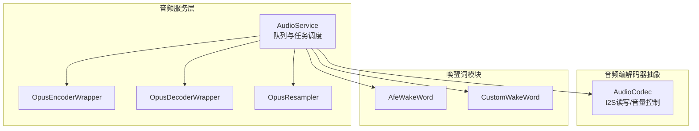
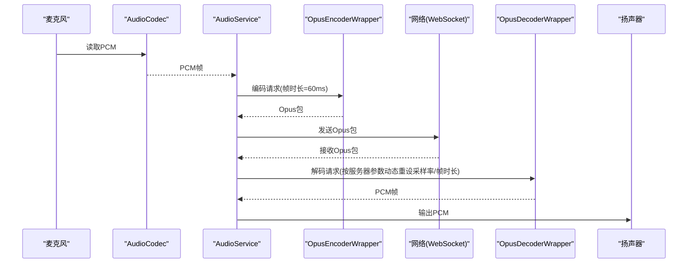
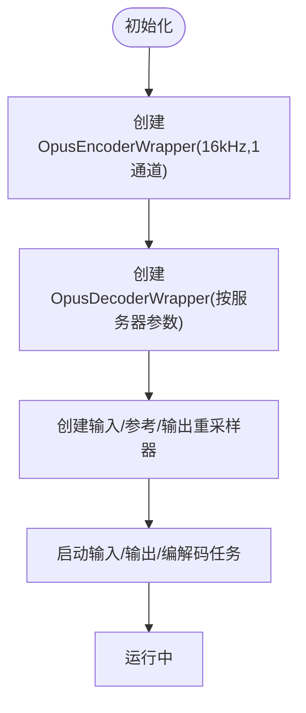
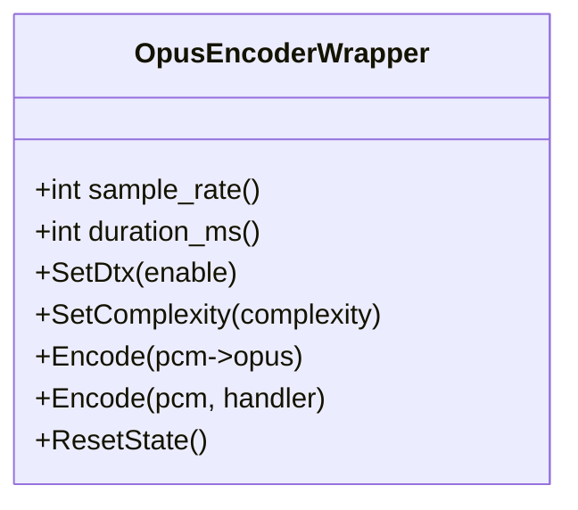
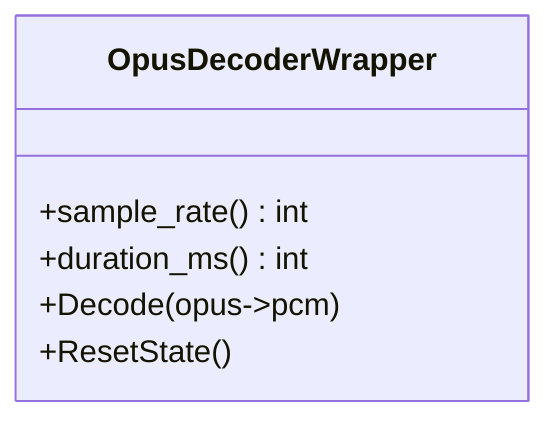
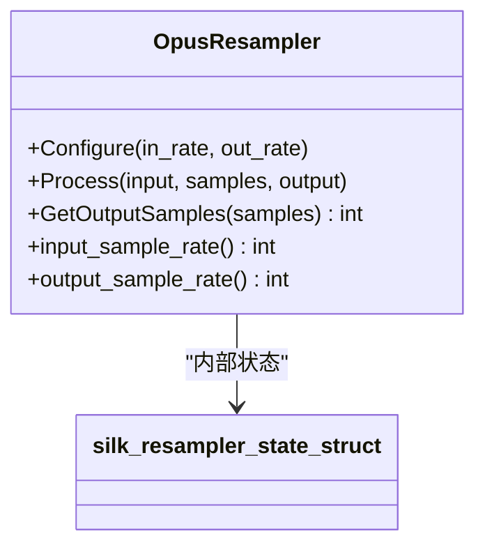
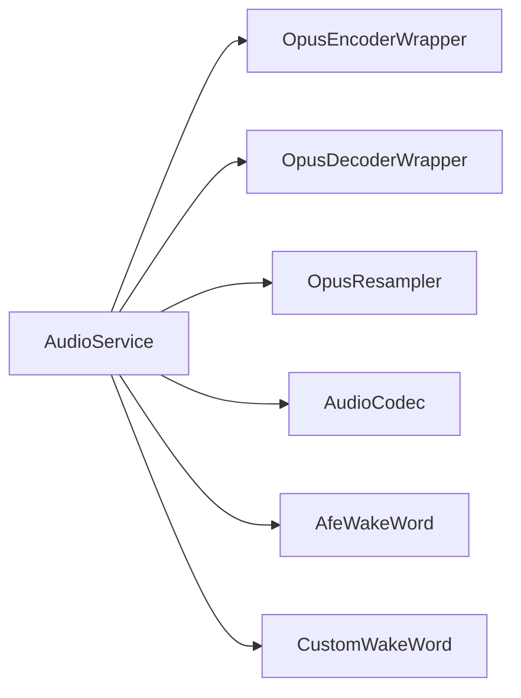

# Opus编解码器集成

<cite>
**本文档引用的文件**
- [audio_service.h](file://main/audio/audio_service.h)
- [audio_service.cc](file://main/audio/audio_service.cc)
- [opus_encoder.h](file://managed_components/78__esp-opus-encoder/include/opus_encoder.h)
- [opus_decoder.h](file://managed_components/78__esp-opus-encoder/include/opus_decoder.h)
- [opus_resampler.h](file://managed_components/78__esp-opus-encoder/include/opus_resampler.h)
- [resampler_structs.h](file://managed_components/78__esp-opus-encoder/include/resampler_structs.h)
- [audio_codec.h](file://main/audio/audio_codec.h)
- [audio_codec.cc](file://main/audio/audio_codec.cc)
- [websocket.md](file://docs/websocket.md)
- [afe_wake_word.h](file://main/audio/wake_words/afe_wake_word.h)
- [custom_wake_word.h](file://main/audio/wake_words/custom_wake_word.h)
</cite>

## 目录
1. [简介](#简介)
2. [项目结构](#项目结构)
3. [核心组件](#核心组件)
4. [架构总览](#架构总览)
5. [详细组件分析](#详细组件分析)
6. [依赖关系分析](#依赖关系分析)
7. [性能考虑](#性能考虑)
8. [故障排除指南](#故障排除指南)
9. [结论](#结论)
10. [附录](#附录)

## 简介
本文件面向Opus编解码器在音频处理系统中的集成，覆盖编码器、解码器与重采样器的初始化与配置，音频帧持续时间、队列容量限制等关键参数的优化策略，以及音频采样率转换的实现与配置。同时提供性能调优指南（比特率、延迟、质量与带宽平衡）与错误处理及故障恢复机制说明，帮助开发者在资源受限的嵌入式平台（ESP32-S3）上稳定高效地运行语音通话与TTS播放场景。

## 项目结构
Opus编解码器集成位于main/audio目录下，核心类与配置如下：
- 音频服务：负责编解码任务调度、队列管理、重采样器配置与音频功率管理
- 编解码器包装器：封装OpusEncoderWrapper、OpusDecoderWrapper与OpusResampler
- 音频编解码器抽象：AudioCodec及其具体实现负责I2S读写与音量控制
- 唤醒词模块：支持AFE与自定义模型，可对唤醒词进行Opus编码并发送
- 文档：WebSocket协议文档中明确了音频参数（采样率、帧时长）与服务器交互

**图表来源**
- [audio_service.h](file://main/audio/audio_service.h#L81-L157)
- [audio_service.cc](file://main/audio/audio_service.cc#L33-L93)
- [opus_encoder.h](file://managed_components/78__esp-opus-encoder/include/opus_encoder.h#L15-L45)
- [opus_decoder.h](file://managed_components/78__esp-opus-encoder/include/opus_decoder.h#L12-L37)
- [opus_resampler.h](file://managed_components/78__esp-opus-encoder/include/opus_resampler.h#L8-L29)
- [audio_codec.h](file://main/audio/audio_codec.h#L18-L60)
- [afe_wake_word.h](file://main/audio/wake_words/afe_wake_word.h#L22-L61)
- [custom_wake_word.h](file://main/audio/wake_words/custom_wake_word.h#L20-L59)

**章节来源**
- [audio_service.h](file://main/audio/audio_service.h#L1-L157)
- [audio_service.cc](file://main/audio/audio_service.cc#L1-L669)
- [opus_encoder.h](file://managed_components/78__esp-opus-encoder/include/opus_encoder.h#L1-L45)
- [opus_decoder.h](file://managed_components/78__esp-opus-encoder/include/opus_decoder.h#L1-L37)
- [opus_resampler.h](file://managed_components/78__esp-opus-encoder/include/opus_resampler.h#L1-L29)
- [audio_codec.h](file://main/audio/audio_codec.h#L1-L60)
- [websocket.md](file://docs/websocket.md#L390-L401)

## 核心组件
- 音频服务（AudioService）
  - 定义帧时长宏与队列容量上限，初始化编解码器与重采样器，启动输入/输出/编解码任务
  - 提供推送/弹出音频包、播放音频、重置解码器、启用/禁用功能等接口
- 编码器包装器（OpusEncoderWrapper）
  - 封装Opus编码器，支持设置DTX、复杂度，提供同步/异步编码接口
- 解码器包装器（OpusDecoderWrapper）
  - 封装Opus解码器，支持动态重设采样率与帧时长
- 重采样器（OpusResampler）
  - 基于SILK重采样算法，支持配置输入/输出采样率、批量处理与输出样本估算
- 音频编解码器抽象（AudioCodec）
  - I2S通道抽象，提供输入/输出使能、音量设置、读写接口

**章节来源**
- [audio_service.h](file://main/audio/audio_service.h#L37-L42)
- [audio_service.cc](file://main/audio/audio_service.cc#L33-L93)
- [opus_encoder.h](file://managed_components/78__esp-opus-encoder/include/opus_encoder.h#L15-L45)
- [opus_decoder.h](file://managed_components/78__esp-opus-encoder/include/opus_decoder.h#L12-L37)
- [opus_resampler.h](file://managed_components/78__esp-opus-encoder/include/opus_resampler.h#L8-L29)
- [audio_codec.h](file://main/audio/audio_codec.h#L18-L60)

## 架构总览
系统采用多任务分层设计：
- 音频输入/输出任务：从AudioCodec读取/写入PCM数据，按帧时长切片并送入编码队列或播放队列
- Opus编解码任务：从编码队列取出PCM，进行Opus编码；从解码队列取出Opus，解码为PCM并重采样后送入播放队列
- 唤醒词任务：在唤醒词检测期间，将音频数据喂入唤醒词模型，并可对唤醒词进行Opus编码发送
- 功率管理：定时器监控输入/输出活跃度，超时自动关闭I2S通道以节能

**图表来源**
- [audio_service.cc](file://main/audio/audio_service.cc#L154-L207)
- [audio_service.cc](file://main/audio/audio_service.cc#L314-L391)
- [opus_encoder.h](file://managed_components/78__esp-opus-encoder/include/opus_encoder.h#L15-L45)
- [opus_decoder.h](file://managed_components/78__esp-opus-encoder/include/opus_decoder.h#L12-L37)
- [websocket.md](file://docs/websocket.md#L390-L401)

**章节来源**
- [audio_service.cc](file://main/audio/audio_service.cc#L95-L137)
- [audio_service.cc](file://main/audio/audio_service.cc#L314-L391)
- [websocket.md](file://docs/websocket.md#L390-L401)

## 详细组件分析

### 音频服务（AudioService）
- 初始化
  - 创建编解码器与重采样器：编码器固定16kHz单声道，解码器按服务器参数动态配置
  - 输入重采样器与参考重采样器用于双声道左右通道分离与重采样
- 任务与队列
  - 输入任务：按帧时长读取PCM，送入编码队列
  - 解码任务：从解码队列取包，解码并重采样后送播放队列
  - 编解码队列容量：MAX_SEND_PACKETS_IN_QUEUE与MAX_DECODE_PACKETS_IN_QUEUE基于帧时长动态计算
- 功率管理
  - 定时器检测最近输入/输出时间，超时关闭I2S通道

**图表来源**
- [audio_service.cc](file://main/audio/audio_service.cc#L33-L93)
- [audio_service.h](file://main/audio/audio_service.h#L37-L42)

**章节来源**
- [audio_service.h](file://main/audio/audio_service.h#L37-L42)
- [audio_service.cc](file://main/audio/audio_service.cc#L33-L93)

### 编码器包装器（OpusEncoderWrapper）
- 能力
  - 支持设置DTX与复杂度，提供同步/异步编码接口
  - 保存内部缓冲区，便于按帧时长拼接
- 使用
  - 在AudioService中以16kHz、单声道、帧时长60ms初始化
  - 编码完成后填充AudioStreamPacket的payload

**图表来源**
- [opus_encoder.h](file://managed_components/78__esp-opus-encoder/include/opus_encoder.h#L15-L45)

**章节来源**
- [opus_encoder.h](file://managed_components/78__esp-opus-encoder/include/opus_encoder.h#L15-L45)
- [audio_service.cc](file://main/audio/audio_service.cc#L37-L40)

### 解码器包装器（OpusDecoderWrapper）
- 能力
  - 支持动态重设采样率与帧时长，解码为PCM
- 使用
  - 根据服务器下发的音频参数动态重建解码器
  - 如解码采样率与设备输出不一致，使用输出重采样器进行重采样

**图表来源**
- [opus_decoder.h](file://managed_components/78__esp-opus-encoder/include/opus_decoder.h#L12-L37)

**章节来源**
- [opus_decoder.h](file://managed_components/78__esp-opus-encoder/include/opus_decoder.h#L12-L37)
- [audio_service.cc](file://main/audio/audio_service.cc#L337-L406)

### 重采样器（OpusResampler）
- 能力
  - 配置输入/输出采样率，批量处理，估算输出样本数
- 使用
  - 输入重采样器：将设备输入重采样至编码器期望采样率
  - 参考重采样器：双声道场景下的参考通道重采样
  - 输出重采样器：解码后将采样率重采样至设备输出采样率

**图表来源**
- [opus_resampler.h](file://managed_components/78__esp-opus-encoder/include/opus_resampler.h#L8-L29)
- [resampler_structs.h](file://managed_components/78__esp-opus-encoder/include/resampler_structs.h#L38-L54)

**章节来源**
- [opus_resampler.h](file://managed_components/78__esp-opus-encoder/include/opus_resampler.h#L8-L29)
- [resampler_structs.h](file://managed_components/78__esp-opus-encoder/include/resampler_structs.h#L38-L54)
- [audio_service.cc](file://main/audio/audio_service.cc#L42-L45)
- [audio_service.cc](file://main/audio/audio_service.cc#L340-L345)

### 音频编解码器抽象（AudioCodec）
- 能力
  - I2S通道抽象，提供输入/输出使能、音量设置、读写接口
- 使用
  - AudioService通过AudioCodec读取麦克风PCM与写入扬声器PCM
  - 启动时读取配置音量并启用I2S通道

**章节来源**
- [audio_codec.h](file://main/audio/audio_codec.h#L18-L60)
- [audio_codec.cc](file://main/audio/audio_codec.cc#L29-L48)

### 唤醒词模块（AfeWakeWord/CustomWakeWord）
- 能力
  - 唤醒词检测、数据缓存、Opus编码与发送
- 使用
  - 在唤醒词检测期间，将音频数据喂入唤醒词模型
  - 将唤醒词的PCM进行Opus编码，以便服务器侧声纹检测

**章节来源**
- [afe_wake_word.h](file://main/audio/wake_words/afe_wake_word.h#L22-L61)
- [custom_wake_word.h](file://main/audio/wake_words/custom_wake_word.h#L20-L59)
- [audio_service.cc](file://main/audio/audio_service.cc#L16-L17)
- [audio_service.cc](file://main/audio/audio_service.cc#L456-L472)

## 依赖关系分析
- AudioService依赖
  - 编解码器包装器：OpusEncoderWrapper、OpusDecoderWrapper
  - 重采样器：输入/参考/输出三路
  - 音频编解码器抽象：AudioCodec
  - 唤醒词模块：AfeWakeWord/CustomWakeWord
- 外部依赖
  - ESP-IDF FreeRTOS、I2S驱动
  - Opus库与SILK重采样器

**图表来源**
- [audio_service.h](file://main/audio/audio_service.h#L116-L120)
- [audio_service.cc](file://main/audio/audio_service.cc#L33-L93)

**章节来源**
- [audio_service.h](file://main/audio/audio_service.h#L116-L120)
- [audio_service.cc](file://main/audio/audio_service.cc#L33-L93)

## 性能考虑
- 帧时长（OPUS_FRAME_DURATION_MS）
  - 默认60ms，影响CPU占用与延迟：更短帧时长降低端到端延迟但增加CPU与网络开销
  - 服务器下行音频可能使用更高采样率（如24kHz），需在解码后进行重采样
- 队列容量限制
  - MAX_SEND_PACKETS_IN_QUEUE与MAX_DECODE_PACKETS_IN_QUEUE基于帧时长动态计算，确保缓冲区在目标时延内（如2400ms）可控
  - 编码队列与发送队列容量限制避免内存膨胀与阻塞
- 采样率转换
  - 输入重采样器与参考重采样器用于双声道分离与重采样
  - 输出重采样器在解码后将采样率适配到设备输出采样率
- 编码器复杂度与DTX
  - 可通过SetComplexity调整编码复杂度，平衡CPU与音质
  - DTX（丢包隐藏）在弱网场景可减少冗余传输，但需服务器侧配合

**章节来源**
- [audio_service.h](file://main/audio/audio_service.h#L37-L42)
- [audio_service.cc](file://main/audio/audio_service.cc#L314-L391)
- [websocket.md](file://docs/websocket.md#L390-L401)
- [opus_encoder.h](file://managed_components/78__esp-opus-encoder/include/opus_encoder.h#L28-L31)

## 故障排除指南
- 编解码失败
  - 编码失败：检查编码器初始化参数（采样率、通道数、帧时长）与PCM数据长度
  - 解码失败：检查服务器下发的音频参数（采样率、帧时长）是否与解码器一致
- 队列阻塞
  - 发送队列满：降低帧时长或提高发送速率；检查网络状况
  - 解码队列满：降低服务器下行音频速率或提高播放速度
- 重采样问题
  - 输入/输出采样率不匹配：确认重采样器配置与AudioCodec输出采样率一致
- 功耗与I2S关闭
  - 长时间无音频活动：功率定时器会自动关闭I2S通道，需重新启用后再进行音频操作

**章节来源**
- [audio_service.cc](file://main/audio/audio_service.cc#L357-L388)
- [audio_service.cc](file://main/audio/audio_service.cc#L431-L443)
- [audio_service.cc](file://main/audio/audio_service.cc#L656-L669)

## 结论
本集成方案通过清晰的任务划分与队列控制，实现了稳定的Opus编解码与重采样流程。默认60ms帧时长兼顾了延迟与CPU占用，动态解码器与三路重采样器满足多场景采样率适配需求。通过合理设置队列容量、编码复杂度与DTX，可在不同网络与硬件条件下取得良好的音质与延迟平衡。

## 附录
- 关键参数与默认值
  - OPUS_FRAME_DURATION_MS：60
  - MAX_SEND_PACKETS_IN_QUEUE：2400 / 60 = 40
  - MAX_DECODE_PACKETS_IN_QUEUE：2400 / 60 = 40
- 服务器交互要点
  - 握手消息包含音频参数（格式、采样率、通道数、帧时长）
  - 服务器下行音频可能使用更高采样率，需在解码后重采样

**章节来源**
- [audio_service.h](file://main/audio/audio_service.h#L37-L42)
- [websocket.md](file://docs/websocket.md#L390-L401)