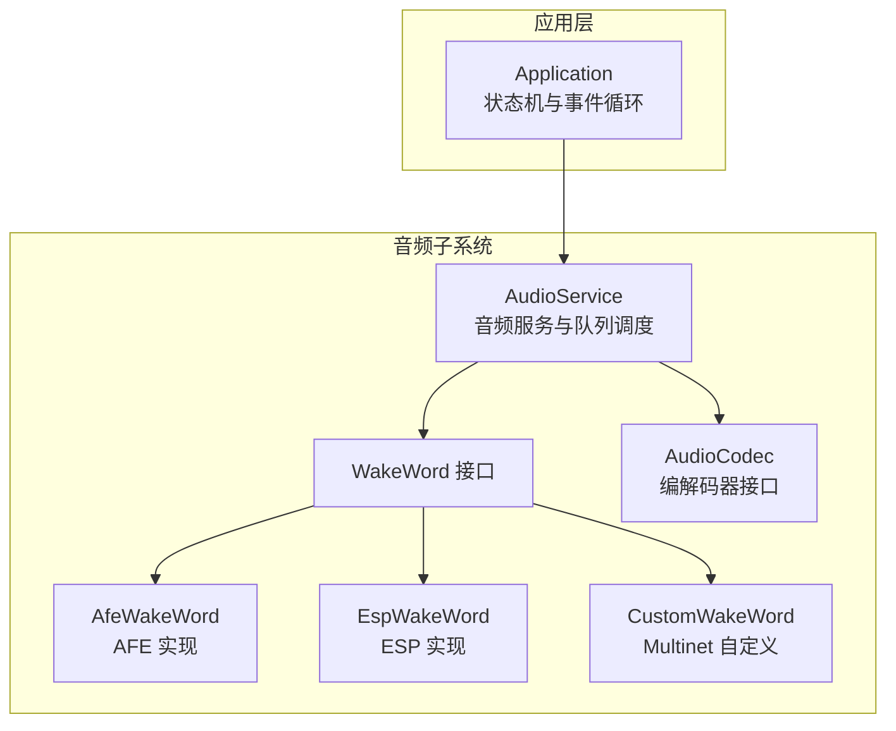
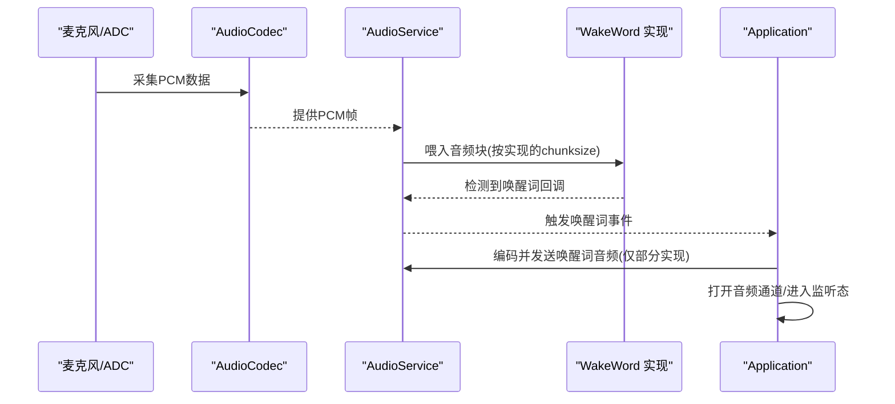
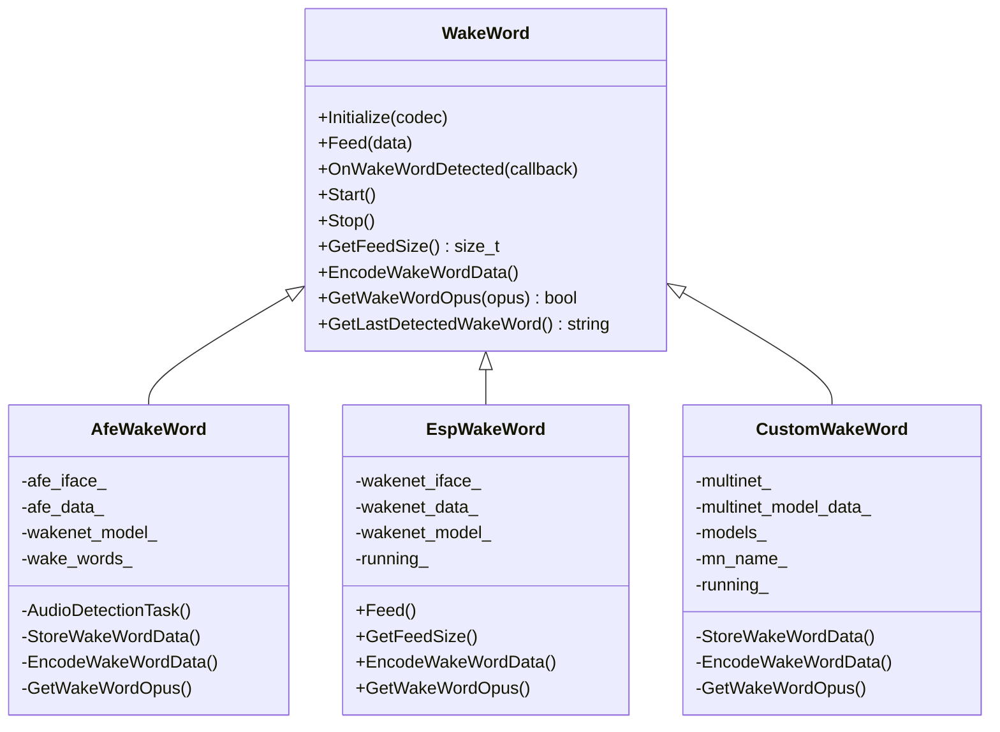
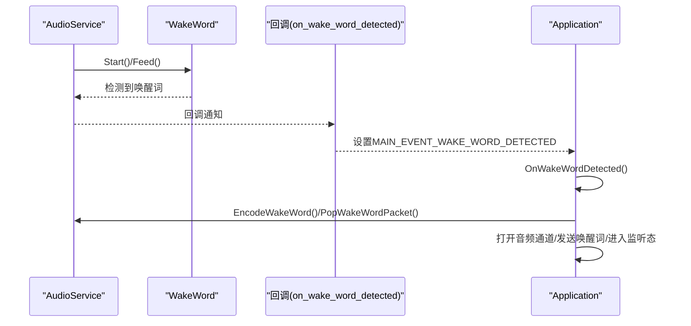
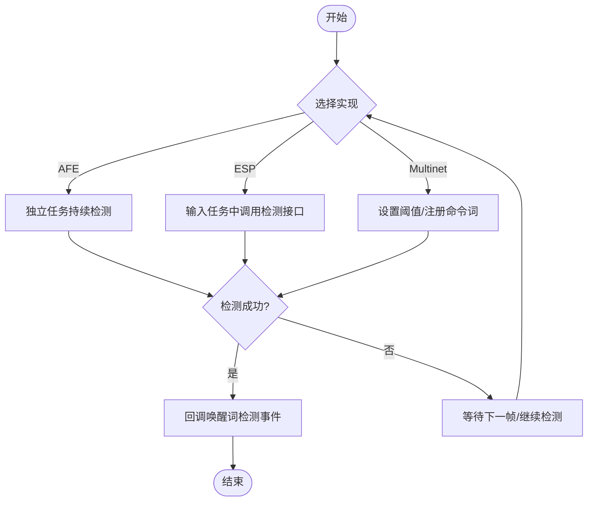
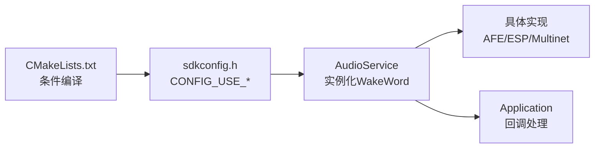

# 唤醒词检测

<cite>
**本文引用的文件**
- [main/audio/wake_words/wake_word.h](file://main/audio/wake_words/wake_word.h)
- [main/audio/wake_words/afe_wake_word.h](file://main/audio/wake_words/afe_wake_word.h)
- [main/audio/wake_words/afe_wake_word.cc](file://main/audio/wake_words/afe_wake_word.cc)
- [main/audio/wake_words/esp_wake_word.h](file://main/audio/wake_words/esp_wake_word.h)
- [main/audio/wake_words/esp_wake_word.cc](file://main/audio/wake_words/esp_wake_word.cc)
- [main/audio/wake_words/custom_wake_word.h](file://main/audio/wake_words/custom_wake_word.h)
- [main/audio/wake_words/custom_wake_word.cc](file://main/audio/wake_words/custom_wake_word.cc)
- [main/audio/audio_service.h](file://main/audio/audio_service.h)
- [main/audio/audio_service.cc](file://main/audio/audio_service.cc)
- [main/application.cc](file://main/application.cc)
- [main/audio/audio_codec.h](file://main/audio/audio_codec.h)
- [main/CMakeLists.txt](file://main/CMakeLists.txt)
- [build/config/sdkconfig.h](file://build/config/sdkconfig.h)
- [main/boards/esp-hi/config.json](file://main/boards/esp-hi/config.json)
- [main/boards/xmini-c3/config.json](file://main/boards/xmini-c3/config.json)
- [main/boards/m5stack-tab5/sdkconfig.tab5](file://main/boards/m5stack-tab5/sdkconfig.tab5)
- [main/audio/wake_words/custom_wake_word.cc](file://main/audio/wake_words/custom_wake_word.cc)
</cite>

## 目录
1. [简介](#简介)
2. [项目结构](#项目结构)
3. [核心组件](#核心组件)
4. [架构总览](#架构总览)
5. [详细组件分析](#详细组件分析)
6. [依赖关系分析](#依赖关系分析)
7. [性能考虑](#性能考虑)
8. [故障排除指南](#故障排除指南)
9. [结论](#结论)
10. [附录](#附录)

## 简介
本技术文档围绕唤醒词检测系统进行深入解析，涵盖两种实现路径：AFE唤醒词检测与ESP唤醒词检测，并补充自定义唤醒词（Multinet）能力。文档从架构设计、触发机制、灵敏度调节、误检处理、与AudioService的集成、回调与状态同步、模型训练与优化、性能优化策略以及故障排除等方面进行全面阐述，帮助开发者在不同硬件平台与产品形态下正确选择与部署唤醒词方案。

## 项目结构
唤醒词检测相关代码主要位于以下位置：
- 接口与三种实现：main/audio/wake_words/
- 音频服务与任务调度：main/audio/audio_service.*
- 应用层状态机与事件驱动：main/application.cc
- 音频编解码接口：main/audio/audio_codec.h
- 构建配置与功能开关：main/CMakeLists.txt、build/config/sdkconfig.h、各开发板配置文件

图表来源
- [main/audio/audio_service.h](file://main/audio/audio_service.h#L81-L157)
- [main/audio/wake_words/wake_word.h](file://main/audio/wake_words/wake_word.h#L10-L26)
- [main/audio/wake_words/afe_wake_word.h](file://main/audio/wake_words/afe_wake_word.h#L22-L61)
- [main/audio/wake_words/esp_wake_word.h](file://main/audio/wake_words/esp_wake_word.h#L16-L43)
- [main/audio/wake_words/custom_wake_word.h](file://main/audio/wake_words/custom_wake_word.h#L20-L59)
- [main/audio/audio_codec.h](file://main/audio/audio_codec.h#L18-L60)
- [main/application.cc](file://main/application.cc#L328-L512)

章节来源
- [main/audio/audio_service.h](file://main/audio/audio_service.h#L26-L53)
- [main/audio/wake_words/wake_word.h](file://main/audio/wake_words/wake_word.h#L10-L26)
- [main/audio/wake_words/afe_wake_word.h](file://main/audio/wake_words/afe_wake_word.h#L22-L61)
- [main/audio/wake_words/esp_wake_word.h](file://main/audio/wake_words/esp_wake_word.h#L16-L43)
- [main/audio/wake_words/custom_wake_word.h](file://main/audio/wake_words/custom_wake_word.h#L20-L59)
- [main/audio/audio_codec.h](file://main/audio/audio_codec.h#L18-L60)
- [main/application.cc](file://main/application.cc#L328-L512)

## 核心组件
- WakeWord 抽象接口：定义唤醒词检测的统一能力集（初始化、喂入音频块、注册回调、启动/停止、获取喂入尺寸、编码唤醒词音频、提取Opus包、获取最后检测到的唤醒词）。
- AfeWakeWord：基于ESP-ADF AFE的高功耗性能模式实现，具备独立音频检测任务与唤醒词PCM缓存、Opus编码队列。
- EspWakeWord：基于ESP-WakeNet的轻量实现，直接在输入任务中调用检测接口，适合简单场景。
- CustomWakeWord：基于Multinet的自定义命令词识别，支持阈值设置、命令注册与结果回传。
- AudioService：统一管理音频输入/输出、编解码、唤醒词检测、语音处理、队列与定时器，负责事件分发与状态同步。
- Application：设备状态机与事件循环，响应唤醒词检测事件并控制后续流程（打开音频通道、发送唤醒词、进入监听态等）。

章节来源
- [main/audio/wake_words/wake_word.h](file://main/audio/wake_words/wake_word.h#L10-L26)
- [main/audio/wake_words/afe_wake_word.cc](file://main/audio/wake_words/afe_wake_word.cc#L11-L86)
- [main/audio/wake_words/esp_wake_word.cc](file://main/audio/wake_words/esp_wake_word.cc#L17-L40)
- [main/audio/wake_words/custom_wake_word.cc](file://main/audio/wake_words/custom_wake_word.cc#L37-L64)
- [main/audio/audio_service.cc](file://main/audio/audio_service.cc#L33-L93)
- [main/application.cc](file://main/application.cc#L585-L621)

## 架构总览
唤醒词检测在系统中的位置与交互如下：

图表来源
- [main/audio/audio_service.cc](file://main/audio/audio_service.cc#L209-L276)
- [main/audio/wake_words/afe_wake_word.cc](file://main/audio/wake_words/afe_wake_word.cc#L117-L143)
- [main/audio/wake_words/esp_wake_word.cc](file://main/audio/wake_words/esp_wake_word.cc#L54-L68)
- [main/application.cc](file://main/application.cc#L585-L621)

## 详细组件分析

### WakeWord 接口与多实现对比
- 统一接口职责清晰，便于替换与扩展。
- AFE实现：独立检测任务、缓冲最近约2秒的PCM、后台静态任务编码为Opus、条件变量同步；适合需要“唤醒词录音回传”的场景。
- ESP实现：轻量级，直接在输入任务中检测，无需额外编码；适合简单唤醒词场景。
- Multinet实现：可配置自定义唤醒词、设置检测阈值、命令注册与结果回传；适合多命令词或自定义短语场景。

图表来源
- [main/audio/wake_words/wake_word.h](file://main/audio/wake_words/wake_word.h#L10-L26)
- [main/audio/wake_words/afe_wake_word.h](file://main/audio/wake_words/afe_wake_word.h#L22-L61)
- [main/audio/wake_words/esp_wake_word.h](file://main/audio/wake_words/esp_wake_word.h#L16-L43)
- [main/audio/wake_words/custom_wake_word.h](file://main/audio/wake_words/custom_wake_word.h#L20-L59)

章节来源
- [main/audio/wake_words/wake_word.h](file://main/audio/wake_words/wake_word.h#L10-L26)
- [main/audio/wake_words/afe_wake_word.h](file://main/audio/wake_words/afe_wake_word.h#L22-L61)
- [main/audio/wake_words/esp_wake_word.h](file://main/audio/wake_words/esp_wake_word.h#L16-L43)
- [main/audio/wake_words/custom_wake_word.h](file://main/audio/wake_words/custom_wake_word.h#L20-L59)

### AudioService 集成与状态同步
- 通过事件组控制唤醒词、语音处理、音频测试三类任务的运行状态。
- 在AudioInputTask中根据事件位选择性喂给唤醒词或语音处理器；在OpusCodecTask中完成编码与发送队列管理。
- 通过回调将唤醒词检测事件传递至Application，实现状态机联动（打开音频通道、进入监听态、播放提示音等）。

图表来源
- [main/audio/audio_service.cc](file://main/audio/audio_service.cc#L74-L80)
- [main/application.cc](file://main/application.cc#L585-L621)

章节来源
- [main/audio/audio_service.cc](file://main/audio/audio_service.cc#L95-L137)
- [main/audio/audio_service.cc](file://main/audio/audio_service.cc#L209-L276)
- [main/audio/audio_service.cc](file://main/audio/audio_service.cc#L314-L391)
- [main/application.cc](file://main/application.cc#L585-L621)

### 触发机制与灵敏度调节
- AFE实现：由AFE内部算法在独立任务中持续检测，检测到后立即停止并回调。
- ESP实现：在每次输入任务中调用检测接口，返回值大于阈值即视为检测成功。
- Multinet实现：通过设置检测阈值与命令注册实现灵敏度与命令词定制；支持超时清理状态。

图表来源
- [main/audio/wake_words/afe_wake_word.cc](file://main/audio/wake_words/afe_wake_word.cc#L117-L143)
- [main/audio/wake_words/esp_wake_word.cc](file://main/audio/wake_words/esp_wake_word.cc#L54-L68)
- [main/audio/wake_words/custom_wake_word.cc](file://main/audio/wake_words/custom_wake_word.cc#L56-L62)

章节来源
- [main/audio/wake_words/afe_wake_word.cc](file://main/audio/wake_words/afe_wake_word.cc#L117-L143)
- [main/audio/wake_words/esp_wake_word.cc](file://main/audio/wake_words/esp_wake_word.cc#L54-L68)
- [main/audio/wake_words/custom_wake_word.cc](file://main/audio/wake_words/custom_wake_word.cc#L56-L62)

### 误检处理与阈值控制
- Multinet提供检测阈值设置接口，可通过配置项调整灵敏度。
- AFE与ESP实现内部阈值由SDK决定；若需降低误检，建议结合环境噪声抑制与合适的采样率/通道配置。
- 输入通道为双声道时，Multinet实现会自动抽取左声道以适配单声道检测需求。

章节来源
- [main/audio/wake_words/custom_wake_word.cc](file://main/audio/wake_words/custom_wake_word.cc#L56-L62)
- [main/audio/wake_words/custom_wake_word.cc](file://main/audio/wake_words/custom_wake_word.cc#L84-L96)

### 与AudioService的集成要点
- 初始化阶段按配置选择具体WakeWord实现并完成初始化。
- 启动/停止通过事件组控制，避免资源竞争。
- 编码唤醒词音频仅在支持的实现中启用（例如AFE/Multinet），其他实现返回空包。
- 通过回调与Application联动，确保状态机一致性。

章节来源
- [main/audio/audio_service.cc](file://main/audio/audio_service.cc#L33-L93)
- [main/audio/audio_service.cc](file://main/audio/audio_service.cc#L474-L494)
- [main/audio/wake_words/afe_wake_word.cc](file://main/audio/wake_words/afe_wake_word.cc#L154-L203)
- [main/audio/wake_words/custom_wake_word.cc](file://main/audio/wake_words/custom_wake_word.cc#L136-L186)

### 唤醒词模型训练与优化指南
- 使用Multinet时，通过命令注册与阈值设置实现自定义唤醒词；训练数据应覆盖目标用户的发音与环境噪声。
- 调优建议：
  - 提升信噪比：合理设置麦克风增益、采用AEC与降噪算法。
  - 数据增强：扩充不同语速、音色、背景噪声下的样本。
  - 阈值权衡：过低易误检，过高易漏检；结合实际场景迭代。
  - 多命令词：使用命令注册集中管理多个唤醒短语，提升可用性。

章节来源
- [main/audio/wake_words/custom_wake_word.cc](file://main/audio/wake_words/custom_wake_word.cc#L56-L62)
- [main/audio/wake_words/custom_wake_word.cc](file://main/audio/wake_words/custom_wake_word.cc#L100-L117)

### 适用场景与选型建议
- AFE唤醒词检测：需要“唤醒词录音回传”或对检测稳定性要求较高，且具备一定内存与计算资源。
- ESP唤醒词检测：资源受限或对实现复杂度敏感，仅需基础唤醒词能力。
- 自定义唤醒词（Multinet）：需要多命令词或高度定制化的唤醒短语，支持阈值与命令注册。

章节来源
- [main/CMakeLists.txt](file://main/CMakeLists.txt#L236-L242)
- [build/config/sdkconfig.h](file://build/config/sdkconfig.h#L481-L481)
- [main/boards/esp-hi/config.json](file://main/boards/esp-hi/config.json#L29-L29)
- [main/boards/xmini-c3/config.json](file://main/boards/xmini-c3/config.json#L8-L8)
- [main/boards/m5stack-tab5/sdkconfig.tab5](file://main/boards/m5stack-tab5/sdkconfig.tab5#L762-L762)

## 依赖关系分析
- 构建期通过CONFIG_USE_*宏选择唤醒词实现，对应CMake条件分支。
- 运行期AudioService根据配置实例化对应WakeWord对象，并在初始化时完成模型加载。
- Application通过回调接收唤醒词事件，驱动状态机切换与后续动作。

图表来源
- [main/CMakeLists.txt](file://main/CMakeLists.txt#L236-L242)
- [build/config/sdkconfig.h](file://build/config/sdkconfig.h#L481-L481)
- [main/audio/audio_service.cc](file://main/audio/audio_service.cc#L33-L93)
- [main/application.cc](file://main/application.cc#L340-L350)

章节来源
- [main/CMakeLists.txt](file://main/CMakeLists.txt#L236-L242)
- [build/config/sdkconfig.h](file://build/config/sdkconfig.h#L481-L481)
- [main/audio/audio_service.cc](file://main/audio/audio_service.cc#L33-L93)
- [main/application.cc](file://main/application.cc#L340-L350)

## 性能考虑
- 功耗优化
  - 采用AudioService的电源定时器，在无输入/输出时自动关闭编解码器，降低待机功耗。
  - 在空闲态与非实时监听态下，关闭语音处理与唤醒词检测，仅保留必要任务。
- 准确率提升
  - 合理设置Multinet阈值，结合AEC与降噪算法。
  - 使用更高采样率与更高质量的麦克风，改善信噪比。
- 延迟控制
  - 选择合适的帧时长与编码复杂度；编码复杂度越低，CPU占用越少，但音质可能下降。
  - 将唤醒词检测与语音处理分离到不同任务，避免相互阻塞。

章节来源
- [main/audio/audio_service.cc](file://main/audio/audio_service.cc#L656-L669)
- [main/audio/audio_service.cc](file://main/audio/audio_service.cc#L39-L40)
- [main/audio/wake_words/custom_wake_word.cc](file://main/audio/wake_words/custom_wake_word.cc#L56-L57)

## 故障排除指南
- 无法初始化唤醒词模型
  - 检查模型资源是否正确打包与命名；AFE/Multinet实现会在初始化失败时记录错误日志。
- 唤醒词未触发或频繁误检
  - 对于Multinet：调整检测阈值；确认命令注册与显示名称一致。
  - 对于AFE/ESP：检查输入采样率与通道数配置，确保与模型期望一致。
- 唤醒词录音未回传
  - 确认当前实现是否支持唤醒词编码（例如ESP实现不提供编码）。
- 状态机异常
  - 检查AudioService回调是否正确设置；确认Application事件循环是否正常处理唤醒词事件。

章节来源
- [main/audio/wake_words/afe_wake_word.cc](file://main/audio/wake_words/afe_wake_word.cc#L39-L86)
- [main/audio/wake_words/esp_wake_word.cc](file://main/audio/wake_words/esp_wake_word.cc#L17-L40)
- [main/audio/wake_words/custom_wake_word.cc](file://main/audio/wake_words/custom_wake_word.cc#L37-L64)
- [main/audio/audio_service.cc](file://main/audio/audio_service.cc#L33-L93)
- [main/application.cc](file://main/application.cc#L585-L621)

## 结论
该唤醒词检测系统通过抽象接口与多实现策略，兼顾了灵活性与可移植性。AFE实现适合需要录音回传与稳定性的场景；ESP实现适合资源受限与快速落地；Multinet实现则提供了强大的自定义能力。配合AudioService的任务调度与Application的状态机联动，系统实现了从检测到响应的完整闭环。通过合理的阈值设置、AEC/降噪与功耗管理，可在保证准确率的同时降低功耗与延迟。

## 附录
- 关键配置项
  - CONFIG_USE_AFE_WAKE_WORD / CONFIG_USE_ESP_WAKE_WORD / CONFIG_USE_CUSTOM_WAKE_WORD：用于选择唤醒词实现。
  - CONFIG_CUSTOM_WAKE_WORD_THRESHOLD：Multinet检测阈值。
  - CONFIG_CUSTOM_WAKE_WORD / CONFIG_CUSTOM_WAKE_WORD_DISPLAY：自定义唤醒词及其显示名称。
- 开发板示例
  - 不同开发板通过config.json或sdkconfig片段启用不同实现，便于按硬件平台快速切换。

章节来源
- [build/config/sdkconfig.h](file://build/config/sdkconfig.h#L481-L481)
- [main/audio/wake_words/custom_wake_word.cc](file://main/audio/wake_words/custom_wake_word.cc#L56-L62)
- [main/boards/esp-hi/config.json](file://main/boards/esp-hi/config.json#L29-L29)
- [main/boards/xmini-c3/config.json](file://main/boards/xmini-c3/config.json#L8-L8)
- [main/boards/m5stack-tab5/sdkconfig.tab5](file://main/boards/m5stack-tab5/sdkconfig.tab5#L762-L762)