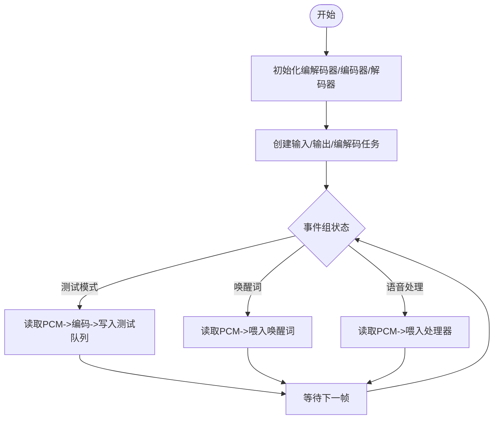

# 音频处理器

<cite>
**本文引用的文件**
- [audio_processor.h](file://main/audio/audio_processor.h)
- [afe_audio_processor.h](file://main/audio/processors/afe_audio_processor.h)
- [afe_audio_processor.cc](file://main/audio/processors/afe_audio_processor.cc)
- [audio_debugger.h](file://main/audio/processors/audio_debugger.h)
- [audio_debugger.cc](file://main/audio/processors/audio_debugger.cc)
- [audio_service.h](file://main/audio/audio_service.h)
- [audio_service.cc](file://main/audio/audio_service.cc)
- [audio_codec.h](file://main/audio/audio_codec.h)
- [es8311_audio_codec.h](file://main/audio/codecs/es8311_audio_codec.h)
- [afe_wake_word.h](file://main/audio/wake_words/afe_wake_word.h)
- [no_audio_processor.h](file://main/audio/processors/no_audio_processor.h)
- [no_audio_processor.cc](file://main/audio/processors/no_audio_processor.cc)
- [sdkconfig.h](file://build/config/sdkconfig.h)
- [config.h](file://main/boards/esp-box-lite/config.h)
</cite>

## 目录
1. [简介](#简介)
2. [项目结构](#项目结构)
3. [核心组件](#核心组件)
4. [架构总览](#架构总览)
5. [详细组件分析](#详细组件分析)
6. [依赖关系分析](#依赖关系分析)
7. [性能考量](#性能考量)
8. [故障排查指南](#故障排查指南)
9. [结论](#结论)
10. [附录](#附录)

## 简介
本技术文档围绕音频处理器系统展开，重点覆盖以下方面：
- 音频处理器抽象接口设计与具体实现（AFE 音频处理器与无处理占位实现）
- AFE 音频处理器的功能特性与配置项（噪声抑制、语音活动检测、回声消除、增益控制等）
- 音频调试器的实现原理（UDP 调试数据传输、质量监控、性能统计、调试信息收集）
- 音频处理流水线设计（预处理、噪声抑制、回声消除、增益控制、编码/解码、播放）
- 处理器启用/禁用机制与与 AudioService 的集成方式
- 算法选择与优化建议
- 常见音频质量问题的诊断与解决方法

## 项目结构
音频子系统主要由以下层次构成：
- 接口层：定义统一的音频处理器抽象接口
- 实现层：AFE 音频处理器与无处理占位实现
- 编解码与服务层：AudioService 统一调度编码、解码、播放、唤醒词检测与调试
- 音频编解码器层：通用 AudioCodec 抽象及具体设备驱动（如 ES8311）
- 唤醒词模块：基于 AFE 的唤醒词检测
- 调试模块：AudioDebugger 将音频数据通过 UDP 发送到调试服务器

图表来源
- [audio_service.h](file://main/audio/audio_service.h#L81-L157)
- [audio_processor.h](file://main/audio/audio_processor.h#L10-L23)
- [afe_audio_processor.h](file://main/audio/processors/afe_audio_processor.h#L16-L43)
- [no_audio_processor.h](file://main/audio/processors/no_audio_processor.h#L10-L31)
- [audio_codec.h](file://main/audio/audio_codec.h#L18-L57)
- [es8311_audio_codec.h](file://main/audio/codecs/es8311_audio_codec.h#L13-L41)
- [audio_debugger.h](file://main/audio/processors/audio_debugger.h#L10-L22)
- [afe_wake_word.h](file://main/audio/wake_words/afe_wake_word.h#L22-L58)

章节来源
- [audio_service.h](file://main/audio/audio_service.h#L26-L51)
- [audio_processor.h](file://main/audio/audio_processor.h#L10-L23)
- [audio_codec.h](file://main/audio/audio_codec.h#L18-L57)

## 核心组件
- 音频处理器抽象接口：定义初始化、喂入、启动/停止、状态查询、输出回调、VAD 回调、帧大小、设备 AEC 开关等统一能力
- AFE 音频处理器：基于 ESP-Audio FrontEnd（AFE）实现噪声抑制、VAD、回声消除等，内部使用 FreeRTOS 事件组与任务进行异步处理
- 无处理处理器：在禁用音频处理时作为占位实现，直接将单声道或左声道数据透传给上层
- 音频服务：统一管理输入/输出/编解码/播放/唤醒词/调试，维护多队列与定时器，负责功耗管理
- 音频编解码器：抽象 I2S 读写与通道配置，具体设备驱动封装硬件细节
- 音频调试器：按配置将原始音频数据通过 UDP 发送至远程调试服务器
- 唤醒词检测：基于 AFE 的唤醒词模型，支持编码保存与后续发送

章节来源
- [audio_processor.h](file://main/audio/audio_processor.h#L10-L23)
- [afe_audio_processor.cc](file://main/audio/processors/afe_audio_processor.cc#L13-L71)
- [no_audio_processor.cc](file://main/audio/processors/no_audio_processor.cc#L6-L26)
- [audio_service.cc](file://main/audio/audio_service.cc#L33-L93)
- [audio_codec.h](file://main/audio/audio_codec.h#L18-L57)
- [audio_debugger.cc](file://main/audio/processors/audio_debugger.cc#L16-L42)
- [afe_wake_word.h](file://main/audio/wake_words/afe_wake_word.h#L22-L58)

## 架构总览
音频系统采用“双任务 + 多队列”的流水线式架构：
- 输入任务：从音频编解码器读取 PCM 数据，按需喂入唤醒词或音频处理器，并支持测试模式
- 编解码任务：对 PCM 进行 Opus 编解码，维护发送队列与播放队列
- 输出任务：从播放队列取出 PCM 并写入音频编解码器
- 定时器：周期性检查输入/输出空闲时间，自动关闭音频电源通道以节能

图表来源
- [audio_service.cc](file://main/audio/audio_service.cc#L209-L391)
- [audio_service.h](file://main/audio/audio_service.h#L26-L51)

章节来源
- [audio_service.cc](file://main/audio/audio_service.cc#L95-L137)
- [audio_service.h](file://main/audio/audio_service.h#L26-L51)

## 详细组件分析

### 音频处理器抽象接口
- 职责：定义统一的音频处理生命周期与回调接口，屏蔽不同实现细节
- 关键点：
  - 初始化：绑定编解码器与帧时长
  - 喂入：接收 PCM 片段
  - 启停与状态：运行中/停止态
  - 回调：输出回调与 VAD 状态变化回调
  - 帧大小：返回每次喂入的样本数
  - 设备 AEC 开关：根据平台能力启用/禁用设备侧 AEC

章节来源
- [audio_processor.h](file://main/audio/audio_processor.h#L10-L23)

### AFE 音频处理器
- 功能特性：
  - 基于 ESP-Audio FrontEnd（AFE）实现噪声抑制、VAD、回声消除（设备侧或服务端）
  - 支持高优先级与高性能模式，优先使用 PSRAM 内存分配
  - 通过事件组控制运行状态，任务循环拉取处理结果并分帧输出
  - 支持动态切换设备 AEC 与 VAD
- 配置要点：
  - 输入格式字符串（M/R 表示主/参考通道）
  - 噪声抑制模型名称与模式
  - VAD 模式与最小噪声时长
  - AEC 模式与是否启用设备 AEC
  - 优先后台核心与优先级
- 处理流程：
  - 初始化：构建 AFE 配置、加载模型、创建处理任务
  - 喂入：将 PCM 数据喂入 AFE
  - 拉取：循环 fetch_with_delay 获取处理结果
  - 分帧：按帧长度拼接输出缓冲，回调上层
  - VAD：检测语音/静音状态并触发回调

图表来源
- [audio_processor.h](file://main/audio/audio_processor.h#L10-L23)
- [afe_audio_processor.h](file://main/audio/processors/afe_audio_processor.h#L16-L43)

章节来源
- [afe_audio_processor.cc](file://main/audio/processors/afe_audio_processor.cc#L13-L71)
- [afe_audio_processor.cc](file://main/audio/processors/afe_audio_processor.cc#L117-L169)
- [afe_audio_processor.cc](file://main/audio/processors/afe_audio_processor.cc#L171-L183)

### 无处理处理器（占位）
- 用途：在禁用音频处理时替代 AFE 实现，避免上层分支逻辑复杂化
- 行为：直接透传单声道或左声道数据；不执行任何信号处理
- 适用场景：仅录音/播放、无需降噪/回声消除的设备

章节来源
- [no_audio_processor.cc](file://main/audio/processors/no_audio_processor.cc#L6-L26)
- [no_audio_processor.cc](file://main/audio/processors/no_audio_processor.cc#L48-L53)
- [no_audio_processor.cc](file://main/audio/processors/no_audio_processor.cc#L55-L59)

### 音频服务（AudioService）
- 角色：统一调度音频输入、处理、编码、发送、解码、播放与调试
- 关键队列与任务：
  - 输入任务：从编解码器读取 PCM，按需喂入唤醒词或处理器
  - 编解码任务：维护编码/解码队列，执行 Opus 编解码
  - 输出任务：从播放队列写回 PCM 到编解码器
  - 调试：可选的音频调试器将原始 PCM 发送至远端
- 能力开关：
  - 唤醒词检测：初始化、启动/停止、回调
  - 语音处理：初始化、启动/停止、设备 AEC 切换
  - 音频测试：将测试数据放入测试队列并在结束时转到播放队列
  - 功耗管理：定时器检测长时间无输入/输出后关闭音频通道
- 统计与日志：
  - DebugStatistics 计数器记录输入/解码/编码/播放次数
  - 多处 ESP_LOG 输出便于问题定位

图表来源
- [audio_service.cc](file://main/audio/audio_service.cc#L95-L137)
- [audio_service.cc](file://main/audio/audio_service.cc#L209-L276)

章节来源
- [audio_service.h](file://main/audio/audio_service.h#L81-L157)
- [audio_service.cc](file://main/audio/audio_service.cc#L33-L93)
- [audio_service.cc](file://main/audio/audio_service.cc#L496-L536)
- [audio_service.cc](file://main/audio/audio_service.cc#L656-L669)

### 音频调试器（AudioDebugger）
- 功能：在启用调试功能时，将原始 PCM 数据通过 UDP 发送到指定服务器
- 配置：通过 SDK 配置项启用，服务器地址格式为 “IP:PORT”
- 行为：构造 UDP 套接字，解析地址，发送数据并记录日志；失败时输出错误日志

图表来源
- [audio_debugger.cc](file://main/audio/processors/audio_debugger.cc#L16-L42)
- [audio_debugger.cc](file://main/audio/processors/audio_debugger.cc#L54-L66)

章节来源
- [audio_debugger.h](file://main/audio/processors/audio_debugger.h#L10-L22)
- [audio_debugger.cc](file://main/audio/processors/audio_debugger.cc#L16-L42)
- [audio_debugger.cc](file://main/audio/processors/audio_debugger.cc#L54-L66)

### 音频编解码器（AudioCodec 与 ES8311）
- AudioCodec 抽象：统一输入/输出使能、采样率/通道/音量参数、I2S 读写接口
- ES8311AudioCodec：基于 ESP-CODEC-DEV 的具体实现，封装 I2C 控制、GPIO、PA 放大器等

章节来源
- [audio_codec.h](file://main/audio/audio_codec.h#L18-L57)
- [es8311_audio_codec.h](file://main/audio/codecs/es8311_audio_codec.h#L13-L41)

### 唤醒词检测（AFE 唤醒词）
- 基于 AFE 的唤醒词模型，支持检测、编码保存与后续发送
- 内部维护 PCM/Opus 队列与独立编码任务，保证低延迟与高可靠性

章节来源
- [afe_wake_word.h](file://main/audio/wake_words/afe_wake_word.h#L22-L58)

## 依赖关系分析
- 条件编译与启用机制：
  - 使用 CONFIG_USE_AUDIO_PROCESSOR 控制启用 AFE 或占位处理器
  - 使用 CONFIG_USE_AFE_WAKE_WORD/CONFIG_USE_ESP_WAKE_WORD/CONFIG_USE_CUSTOM_WAKE_WORD 控制唤醒词实现
  - 使用 CONFIG_USE_AUDIO_DEBUGGER 控制调试器启用
  - 使用 CONFIG_USE_DEVICE_AEC 控制设备 AEC 能力
- 配置示例：
  - 在构建配置中启用音频处理器
  - 板级配置中启用输入参考通道（当使用音频处理器时）

图表来源
- [sdkconfig.h](file://build/config/sdkconfig.h#L482-L482)
- [audio_service.cc](file://main/audio/audio_service.cc#L5-L17)
- [config.h](file://main/boards/esp-box-lite/config.h#L8-L8)

章节来源
- [sdkconfig.h](file://build/config/sdkconfig.h#L482-L482)
- [audio_service.cc](file://main/audio/audio_service.cc#L5-L17)
- [config.h](file://main/boards/esp-box-lite/config.h#L8-L8)

## 性能考量
- 任务与队列：
  - 输入/输出/编解码三类任务分离，降低耦合度
  - 编解码队列与播放队列设置上限，防止内存暴涨
- 采样率与重采样：
  - 当编解码器采样率非 16kHz 时，使用 OpusResampler 进行重采样，减少带宽占用
- AFE 配置：
  - 高性能模式与优先使用 PSRAM 可提升实时性
  - VAD 最小噪声时长与噪声抑制模型影响误检与漏检
- 功耗管理：
  - 定时器检测空闲状态，自动关闭输入/输出通道，延长电池续航

章节来源
- [audio_service.h](file://main/audio/audio_service.h#L37-L46)
- [audio_service.cc](file://main/audio/audio_service.cc#L42-L45)
- [audio_service.cc](file://main/audio/audio_service.cc#L656-L669)
- [afe_audio_processor.cc](file://main/audio/processors/afe_audio_processor.cc#L34-L61)

## 故障排查指南
- 无法启动音频处理
  - 检查 CONFIG_USE_AUDIO_PROCESSOR 是否启用
  - 确认 AFE 模型加载成功（NS/VAD 模型名过滤）
  - 查看日志中错误码与 ret_value
- 音频无声或失真
  - 检查编解码器输入/输出使能状态与通道数量
  - 确认采样率匹配，必要时启用重采样
  - 若使用设备 AEC，请确认 CONFIG_USE_DEVICE_AEC 已正确配置
- 唤醒词不工作
  - 确认唤醒词模块已启用且初始化成功
  - 检查喂入数据帧大小与采样率
- 调试数据未到达服务器
  - 检查 CONFIG_USE_AUDIO_DEBUGGER 与服务器地址格式（IP:PORT）
  - 确认 UDP 套接字创建与 sendto 成功
- 队列阻塞或卡顿
  - 检查编解码队列与播放队列长度阈值
  - 关注日志中的队列满与丢包提示

章节来源
- [audio_service.cc](file://main/audio/audio_service.cc#L33-L93)
- [audio_service.cc](file://main/audio/audio_service.cc#L209-L276)
- [audio_service.cc](file://main/audio/audio_service.cc#L314-L391)
- [audio_debugger.cc](file://main/audio/processors/audio_debugger.cc#L16-L42)
- [audio_debugger.cc](file://main/audio/processors/audio_debugger.cc#L54-L66)

## 结论
该音频处理器系统通过抽象接口与条件编译实现了高度可配置的音频处理链路。AFE 音频处理器提供了噪声抑制、VAD 与回声消除等关键能力，结合 AudioService 的流水线式调度与功耗管理，能够在资源受限的嵌入式平台上稳定运行。配合音频调试器与完善的日志体系，开发者可以快速定位问题并优化算法参数，满足多样化的应用场景需求。

## 附录
- 算法选择与优化建议
  - 噪声抑制：优先使用设备侧 NS（若可用），否则启用 AFE NS 模式
  - VAD：根据环境噪声调整最小噪声时长，避免误触发
  - AEC：设备 AEC 优先于服务端 AEC，但需确保硬件支持
  - 编解码：保持 16kHz 采样率与固定帧长，减少重采样开销
- 常见问题与解决
  - 输入/输出通道不匹配：统一为单声道或左声道透传
  - 队列积压：降低帧长或提高任务优先级
  - 低电量：启用功耗定时器与自动关闭策略