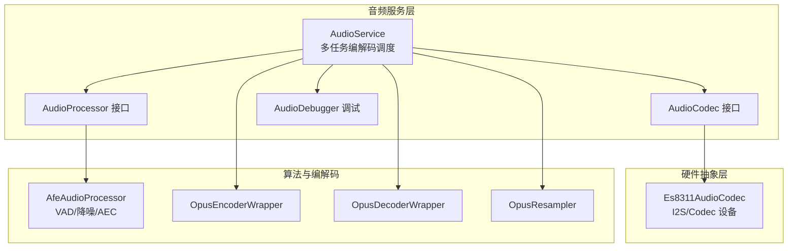
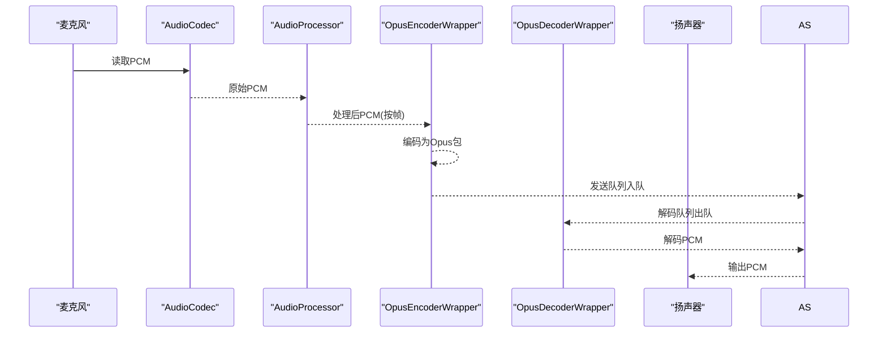
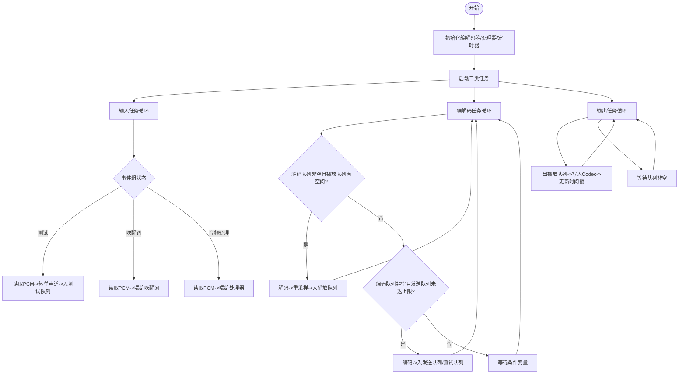
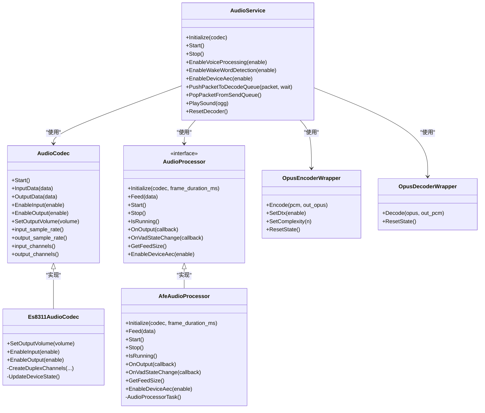

# 音频处理系统

<cite>
**本文引用的文件**
- [main/audio/audio_service.h](file://main/audio/audio_service.h)
- [main/audio/audio_service.cc](file://main/audio/audio_service.cc)
- [main/audio/audio_codec.h](file://main/audio/audio_codec.h)
- [main/audio/audio_codec.cc](file://main/audio/audio_codec.cc)
- [main/audio/audio_processor.h](file://main/audio/audio_processor.h)
- [main/audio/processors/afe_audio_processor.h](file://main/audio/processors/afe_audio_processor.h)
- [main/audio/processors/afe_audio_processor.cc](file://main/audio/processors/afe_audio_processor.cc)
- [main/audio/codecs/es8311_audio_codec.h](file://main/audio/codecs/es8311_audio_codec.h)
- [main/audio/codecs/es8311_audio_codec.cc](file://main/audio/codecs/es8311_audio_codec.cc)
- [main/audio/processors/audio_debugger.h](file://main/audio/processors/audio_debugger.h)
- [managed_components/78__esp-opus-encoder/include/opus_encoder.h](file://managed_components/78__esp-opus-encoder/include/opus_encoder.h)
- [managed_components/78__esp-opus-encoder/include/opus_decoder.h](file://managed_components/78__esp-opus-encoder/include/opus_decoder.h)
</cite>

## 目录
1. [简介](#简介)
2. [项目结构](#项目结构)
3. [核心组件](#核心组件)
4. [架构总览](#架构总览)
5. [组件详解](#组件详解)
6. [依赖关系分析](#依赖关系分析)
7. [性能与实时性](#性能与实时性)
8. [调试与排障](#调试与排障)
9. [结论](#结论)
10. [附录](#附录)

## 简介
本技术文档面向“音频处理系统”，聚焦于AudioService的多线程音频处理架构，覆盖从麦克风采集、音频处理（含VAD、降噪、AEC）、Opus编解码、到扬声器播放的完整链路。文档同时深入解析Opus编解码器的集成与配置要点（采样率、帧时长、复杂度等），并总结音频队列管理、缓冲区控制与实时性保障策略；最后提供音频调试工具使用方法、质量调优建议与常见问题排查指引。

## 项目结构
音频相关代码主要位于 main/audio 及其子目录，配合外部组件（如ESP-Opus与ESP-AFE）实现端侧语音增强与压缩传输。

图示来源
- [main/audio/audio_service.h](file://main/audio/audio_service.h#L81-L157)
- [main/audio/audio_codec.h](file://main/audio/audio_codec.h#L18-L57)
- [main/audio/audio_processor.h](file://main/audio/audio_processor.h#L10-L23)
- [main/audio/processors/afe_audio_processor.h](file://main/audio/processors/afe_audio_processor.h#L16-L43)
- [main/audio/codecs/es8311_audio_codec.h](file://main/audio/codecs/es8311_audio_codec.h#L13-L41)
- [managed_components/78__esp-opus-encoder/include/opus_encoder.h](file://managed_components/78__esp-opus-encoder/include/opus_encoder.h#L15-L44)
- [managed_components/78__esp-opus-encoder/include/opus_decoder.h](file://managed_components/78__esp-opus-encoder/include/opus_decoder.h#L12-L34)

章节来源
- [main/audio/audio_service.h](file://main/audio/audio_service.h#L26-L35)
- [main/audio/audio_codec.h](file://main/audio/audio_codec.h#L18-L57)
- [main/audio/audio_processor.h](file://main/audio/audio_processor.h#L10-L23)

## 核心组件
- AudioService：多任务调度核心，负责音频采集、处理、编码、解码、播放的协调与队列管理，封装Opus编解码器与音频处理器，并提供回调接口。
- AudioCodec/AudioCodec实现：抽象I2S设备与编解码器，Es8311AudioCodec为具体实现，负责DMA通道、采样率、增益与功耗管理。
- AudioProcessor/AudioProcessor实现：抽象音频处理接口，AfeAudioProcessor基于ESP-AFE实现VAD、降噪与AEC。
- Opus 编解码器：通过OpusEncoderWrapper/OpusDecoderWrapper封装，支持动态采样率与帧时长配置。
- 音频调试：AudioDebugger通过UDP发送原始PCM以供外部分析。

章节来源
- [main/audio/audio_service.h](file://main/audio/audio_service.h#L81-L157)
- [main/audio/audio_codec.h](file://main/audio/audio_codec.h#L18-L57)
- [main/audio/audio_processor.h](file://main/audio/audio_processor.h#L10-L23)
- [main/audio/processors/afe_audio_processor.h](file://main/audio/processors/afe_audio_processor.h#L16-L43)
- [main/audio/codecs/es8311_audio_codec.h](file://main/audio/codecs/es8311_audio_codec.h#L13-L41)
- [main/audio/processors/audio_debugger.h](file://main/audio/processors/audio_debugger.h#L10-L21)
- [managed_components/78__esp-opus-encoder/include/opus_encoder.h](file://managed_components/78__esp-opus-encoder/include/opus_encoder.h#L15-L44)
- [managed_components/78__esp-opus-encoder/include/opus_decoder.h](file://managed_components/78__esp-opus-encoder/include/opus_decoder.h#L12-L34)

## 架构总览
系统采用“采集/处理/播放”与“编解码”两套任务并行运行的架构，通过多队列实现解耦与背压控制，确保实时性与稳定性。

图示来源
- [main/audio/audio_service.cc](file://main/audio/audio_service.cc#L209-L391)
- [main/audio/audio_codec.cc](file://main/audio/audio_codec.cc#L17-L27)
- [main/audio/processors/afe_audio_processor.cc](file://main/audio/processors/afe_audio_processor.cc#L117-L168)
- [managed_components/78__esp-opus-encoder/include/opus_encoder.h](file://managed_components/78__esp-opus-encoder/include/opus_encoder.h#L30-L31)
- [managed_components/78__esp-opus-encoder/include/opus_decoder.h](file://managed_components/78__esp-opus-encoder/include/opus_decoder.h#L17-L18)

## 组件详解

### AudioService：多线程音频处理中枢
- 任务划分
  - 音频输入任务：从AudioCodec读取PCM，按事件组状态分发至唤醒词检测或音频处理器。
  - 音频输出任务：从播放队列取出PCM写入AudioCodec。
  - Opus编解码任务：在发送/解码队列间搬运，完成编码/解码与可选重采样。
- 关键队列
  - 编码队列、发送队列、解码队列、播放队列、测试队列；均受互斥锁与条件变量保护，避免竞争。
  - 时间戳队列用于服务端AEC对齐。
- 回调与事件
  - 发送队列可用、唤醒词检测、VAD状态变化、音频测试队列满回调。
- 功耗管理
  - 定时器监控最近输入/输出时间，超时自动关闭输入/输出以节能。

图示来源
- [main/audio/audio_service.cc](file://main/audio/audio_service.cc#L95-L137)
- [main/audio/audio_service.cc](file://main/audio/audio_service.cc#L209-L391)

章节来源
- [main/audio/audio_service.h](file://main/audio/audio_service.h#L81-L157)
- [main/audio/audio_service.cc](file://main/audio/audio_service.cc#L33-L93)
- [main/audio/audio_service.cc](file://main/audio/audio_service.cc#L95-L137)
- [main/audio/audio_service.cc](file://main/audio/audio_service.cc#L209-L391)
- [main/audio/audio_service.cc](file://main/audio/audio_service.cc#L431-L443)
- [main/audio/audio_service.cc](file://main/audio/audio_service.cc#L445-L454)
- [main/audio/audio_service.cc](file://main/audio/audio_service.cc#L656-L669)

### AudioCodec 与 Es8311AudioCodec：硬件抽象与功耗控制
- 抽象接口提供统一的输入/输出能力、启停控制与采样率/通道信息。
- Es8311AudioCodec基于esp_codec_dev与I2S_std实现双工通道，支持设置MIC增益与扬声PA使能。
- 启动时根据配置读取音量并启用收发通道；通过EnableInput/EnableOutput动态开关以节能。

章节来源
- [main/audio/audio_codec.h](file://main/audio/audio_codec.h#L18-L57)
- [main/audio/audio_codec.cc](file://main/audio/audio_codec.cc#L29-L47)
- [main/audio/audio_codec.cc](file://main/audio/audio_codec.cc#L58-L72)
- [main/audio/codecs/es8311_audio_codec.h](file://main/audio/codecs/es8311_audio_codec.h#L13-L41)
- [main/audio/codecs/es8311_audio_codec.cc](file://main/audio/codecs/es8311_audio_codec.cc#L66-L94)
- [main/audio/codecs/es8311_audio_codec.cc](file://main/audio/codecs/es8311_audio_codec.cc#L157-L187)

### AudioProcessor 与 AfeAudioProcessor：VAD/降噪/AEC
- AudioProcessor定义统一接口：Initialize、Feed、Start/Stop、OnOutput/OnVadStateChange、GetFeedSize、EnableDeviceAec。
- AfeAudioProcessor基于ESP-AFE，配置VAD/降噪/AEC模式，内部任务周期性fetch处理结果，按帧大小拆分并回调输出，同时上报VAD状态变化。
- 支持设备侧AEC（取决于配置），否则启用VAD。

章节来源
- [main/audio/audio_processor.h](file://main/audio/audio_processor.h#L10-L23)
- [main/audio/processors/afe_audio_processor.h](file://main/audio/processors/afe_audio_processor.h#L16-L43)
- [main/audio/processors/afe_audio_processor.cc](file://main/audio/processors/afe_audio_processor.cc#L13-L71)
- [main/audio/processors/afe_audio_processor.cc](file://main/audio/processors/afe_audio_processor.cc#L117-L168)
- [main/audio/processors/afe_audio_processor.cc](file://main/audio/processors/afe_audio_processor.cc#L171-L183)

### Opus 编解码器：封装与配置
- OpusEncoderWrapper
  - 支持设置DTX、复杂度；按帧时长与采样率进行编码；提供异步编码回调。
  - 内部维护输入缓冲，便于按帧拼接。
- OpusDecoderWrapper
  - 按帧时长与采样率进行解码；支持动态重置状态。
- AudioService中默认编码采样率为16kHz，帧时长固定；解码时根据包内采样率与帧时长动态重建解码器并进行输出重采样。

章节来源
- [managed_components/78__esp-opus-encoder/include/opus_encoder.h](file://managed_components/78__esp-opus-encoder/include/opus_encoder.h#L15-L44)
- [managed_components/78__esp-opus-encoder/include/opus_decoder.h](file://managed_components/78__esp-opus-encoder/include/opus_decoder.h#L12-L34)
- [main/audio/audio_service.cc](file://main/audio/audio_service.cc#L33-L46)
- [main/audio/audio_service.cc](file://main/audio/audio_service.cc#L393-L406)
- [main/audio/audio_service.cc](file://main/audio/audio_service.cc#L337-L354)
- [main/audio/audio_service.cc](file://main/audio/audio_service.cc#L364-L387)

### 音频调试：AudioDebugger
- 将原始PCM通过UDP发送，便于外设分析波形与频谱。
- 在ReadAudioData路径中按配置启用。

章节来源
- [main/audio/processors/audio_debugger.h](file://main/audio/processors/audio_debugger.h#L10-L21)
- [main/audio/audio_service.cc](file://main/audio/audio_service.cc#L198-L204)

## 依赖关系分析

图示来源
- [main/audio/audio_service.h](file://main/audio/audio_service.h#L81-L157)
- [main/audio/audio_codec.h](file://main/audio/audio_codec.h#L18-L57)
- [main/audio/codecs/es8311_audio_codec.h](file://main/audio/codecs/es8311_audio_codec.h#L13-L41)
- [main/audio/audio_processor.h](file://main/audio/audio_processor.h#L10-L23)
- [main/audio/processors/afe_audio_processor.h](file://main/audio/processors/afe_audio_processor.h#L16-L43)
- [managed_components/78__esp-opus-encoder/include/opus_encoder.h](file://managed_components/78__esp-opus-encoder/include/opus_encoder.h#L15-L44)
- [managed_components/78__esp-opus-encoder/include/opus_decoder.h](file://managed_components/78__esp-opus-encoder/include/opus_decoder.h#L12-L34)

## 性能与实时性

### 队列与背压控制
- 编码/发送/解码/播放/测试队列均设置最大长度，防止内存膨胀与阻塞。
- 条件变量与互斥锁协同，避免忙等；编解码任务在满足条件时才执行，降低CPU占用。
- 测试模式下限制最大持续时长，避免长时间占用资源。

章节来源
- [main/audio/audio_service.h](file://main/audio/audio_service.h#L37-L46)
- [main/audio/audio_service.cc](file://main/audio/audio_service.cc#L314-L391)
- [main/audio/audio_service.cc](file://main/audio/audio_service.cc#L225-L244)

### 采样率与帧时长
- 默认编码采样率16kHz，帧时长60ms；解码时根据包内采样率与帧时长动态重建解码器并进行输出重采样。
- 输入/参考信号重采样器在输入采样率≠16kHz时启用，确保处理链路一致。

章节来源
- [main/audio/audio_service.cc](file://main/audio/audio_service.cc#L38-L45)
- [main/audio/audio_service.cc](file://main/audio/audio_service.cc#L393-L406)
- [main/audio/audio_service.cc](file://main/audio/audio_service.cc#L173-L186)

### 实时性保障
- 三类任务分离：输入/输出/处理与编解码独立，减少相互阻塞。
- 事件组驱动输入任务分支选择，避免无效轮询。
- 功耗定时器定期检查并关闭空闲的输入/输出，降低系统负载。

章节来源
- [main/audio/audio_service.cc](file://main/audio/audio_service.cc#L95-L137)
- [main/audio/audio_service.cc](file://main/audio/audio_service.cc#L210-L276)
- [main/audio/audio_service.cc](file://main/audio/audio_service.cc#L656-L669)

## 调试与排障

### 调试工具使用
- AudioDebugger：在ReadAudioData路径中启用，将原始PCM通过UDP发送，便于外部分析。
- 建议在开发阶段开启，生产环境按需关闭以节省带宽。

章节来源
- [main/audio/processors/audio_debugger.h](file://main/audio/processors/audio_debugger.h#L10-L21)
- [main/audio/audio_service.cc](file://main/audio/audio_service.cc#L198-L204)

### 常见问题与排查
- 无法采集/播放
  - 检查AudioCodec是否已Start并EnableInput/EnableOutput。
  - 确认Es8311AudioCodec的I2S引脚配置与硬件一致。
- 音质差/噪声大
  - 检查MIC增益与PA使能；确认AfeAudioProcessor的VAD/降噪/AEC配置。
- 延迟高/卡顿
  - 检查各队列长度与消费速率；适当调整帧时长与复杂度。
- 解码失败
  - 确认解码器采样率/帧时长与编码端一致；必要时调用ResetState。

章节来源
- [main/audio/audio_codec.cc](file://main/audio/audio_codec.cc#L29-L47)
- [main/audio/codecs/es8311_audio_codec.cc](file://main/audio/codecs/es8311_audio_codec.cc#L66-L94)
- [main/audio/processors/afe_audio_processor.cc](file://main/audio/processors/afe_audio_processor.cc#L13-L71)
- [main/audio/audio_service.cc](file://main/audio/audio_service.cc#L337-L354)
- [main/audio/audio_service.cc](file://main/audio/audio_service.cc#L646-L654)

## 结论
该音频系统通过清晰的任务划分与队列控制，结合ESP-AFE的VAD/降噪/AEC与ESP-Opus的高效编解码，实现了低延迟、低功耗的端侧语音处理链路。通过事件驱动与动态重采样机制，系统在不同采样率与帧长下保持稳定；同时提供调试工具与功耗管理，便于开发与部署。

## 附录

### 关键参数与配置建议
- 帧时长：默认60ms，兼顾延迟与带宽；短帧长提升实时性但增加开销。
- 编码采样率：默认16kHz；若硬件输入≠16kHz，使用输入/参考重采样器对齐。
- 复杂度：默认较低以节省CPU；在性能允许时适度提高以改善音质。
- 队列长度：根据目标延迟与内存预算设定；过小易丢包，过大易积压。
- AEC：设备侧AEC需硬件与固件支持；否则启用VAD以减少误触发。

章节来源
- [main/audio/audio_service.h](file://main/audio/audio_service.h#L37-L46)
- [main/audio/audio_service.cc](file://main/audio/audio_service.cc#L38-L41)
- [main/audio/audio_service.cc](file://main/audio/audio_service.cc#L393-L406)
- [main/audio/processors/afe_audio_processor.cc](file://main/audio/processors/afe_audio_processor.cc#L34-L61)