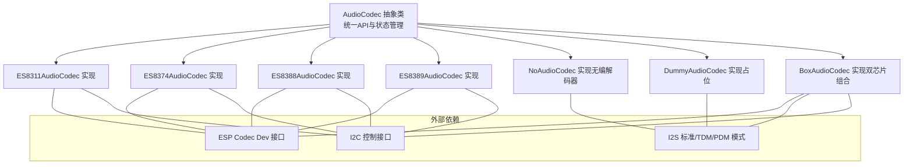
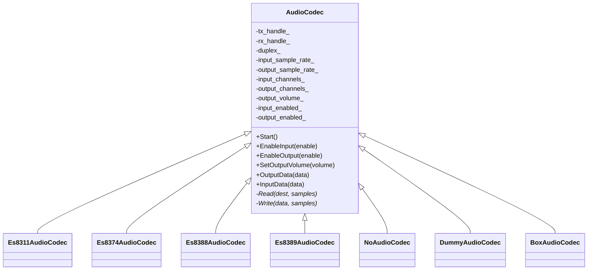
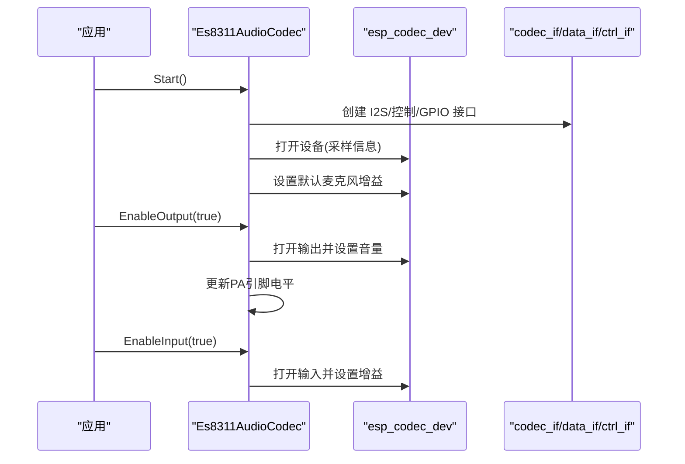
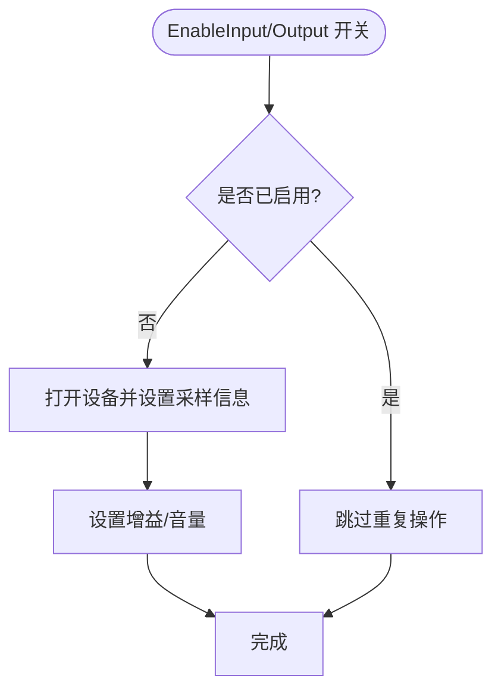
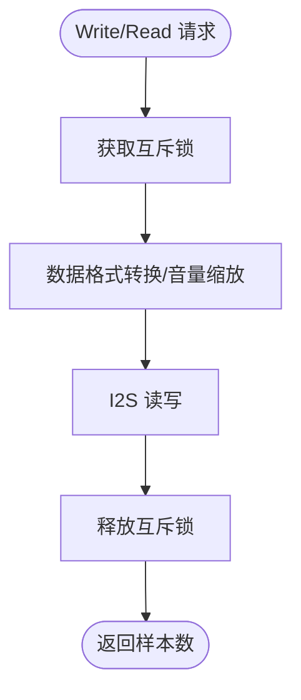
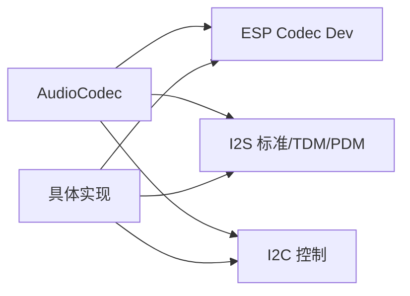

# 音频编解码器抽象

<cite>
**本文引用的文件**
- [main/audio/audio_codec.h](file://main/audio/audio_codec.h)
- [main/audio/audio_codec.cc](file://main/audio/audio_codec.cc)
- [main/audio/codecs/es8311_audio_codec.h](file://main/audio/codecs/es8311_audio_codec.h)
- [main/audio/codecs/es8311_audio_codec.cc](file://main/audio/codecs/es8311_audio_codec.cc)
- [main/audio/codecs/es8374_audio_codec.h](file://main/audio/codecs/es8374_audio_codec.h)
- [main/audio/codecs/es8374_audio_codec.cc](file://main/audio/codecs/es8374_audio_codec.cc)
- [main/audio/codecs/es8388_audio_codec.h](file://main/audio/codecs/es8388_audio_codec.h)
- [main/audio/codecs/es8388_audio_codec.cc](file://main/audio/codecs/es8388_audio_codec.cc)
- [main/audio/codecs/es8389_audio_codec.h](file://main/audio/codecs/es8389_audio_codec.h)
- [main/audio/codecs/es8389_audio_codec.cc](file://main/audio/codecs/es8389_audio_codec.cc)
- [main/audio/codecs/dummy_audio_codec.h](file://main/audio/codecs/dummy_audio_codec.h)
- [main/audio/codecs/dummy_audio_codec.cc](file://main/audio/codecs/dummy_audio_codec.cc)
- [main/audio/codecs/no_audio_codec.h](file://main/audio/codecs/no_audio_codec.h)
- [main/audio/codecs/no_audio_codec.cc](file://main/audio/codecs/no_audio_codec.cc)
- [main/audio/codecs/box_audio_codec.h](file://main/audio/codecs/box_audio_codec.h)
- [main/audio/codecs/box_audio_codec.cc](file://main/audio/codecs/box_audio_codec.cc)
</cite>

## 目录
1. [简介](#简介)
2. [项目结构](#项目结构)
3. [核心组件](#核心组件)
4. [架构总览](#架构总览)
5. [详细组件分析](#详细组件分析)
6. [依赖关系分析](#依赖关系分析)
7. [性能考虑](#性能考虑)
8. [故障排查指南](#故障排查指南)
9. [结论](#结论)
10. [附录](#附录)

## 简介
本文件面向“音频编解码器抽象层”的技术文档，系统阐述统一编解码器API的设计理念与抽象机制，覆盖硬件特定实现的封装方式，并对主流音频编解码器（ES8311、ES8374、ES8388、ES8389）进行功能特性、寄存器配置与时序控制的深入解析。文档同时给出初始化流程、采样率/声道/音量控制的实现要点，以及性能优化策略（功耗、音质、延迟）与兼容性处理、故障诊断方法。

## 项目结构
音频编解码相关代码集中在 main/audio 目录下，采用“抽象基类 + 多种具体实现”的分层设计：
- 抽象层：统一的 AudioCodec 接口，定义通用能力与状态管理
- 具体实现层：针对不同芯片（ES83xx 系列、无编解码器场景、盒式多芯片组合）的具体实现
- 服务层：通过 Settings 持久化参数（如输出音量），在启动时加载并应用

图表来源
- [main/audio/audio_codec.h](file://main/audio/audio_codec.h#L18-L57)
- [main/audio/codecs/es8311_audio_codec.h](file://main/audio/codecs/es8311_audio_codec.h#L13-L40)
- [main/audio/codecs/es8374_audio_codec.h](file://main/audio/codecs/es8374_audio_codec.h#L13-L39)
- [main/audio/codecs/es8388_audio_codec.h](file://main/audio/codecs/es8388_audio_codec.h#L12-L38)
- [main/audio/codecs/es8389_audio_codec.h](file://main/audio/codecs/es8389_audio_codec.h#L12-L38)
- [main/audio/codecs/no_audio_codec.h](file://main/audio/codecs/no_audio_codec.h#L10-L38)
- [main/audio/codecs/box_audio_codec.h](file://main/audio/codecs/box_audio_codec.h#L11-L38)

章节来源
- [main/audio/audio_codec.h](file://main/audio/audio_codec.h#L1-L60)
- [main/audio/audio_codec.cc](file://main/audio/audio_codec.cc#L1-L73)

## 核心组件
- 抽象基类 AudioCodec
  - 统一的对外API：开始、输入/输出使能、音量设置、数据读写
  - 内部状态：采样率、声道数、音量、输入/输出开关、双工模式标志
  - I2S 双通道句柄：tx_handle_/rx_handle_
  - 虚函数 Read/Write 由子类实现
- 启动流程
  - 从 Settings 加载输出音量，若过小则回退默认值
  - 启用已配置的 I2S TX/RX 通道
  - 默认开启输入/输出

章节来源
- [main/audio/audio_codec.h](file://main/audio/audio_codec.h#L18-L57)
- [main/audio/audio_codec.cc](file://main/audio/audio_codec.cc#L29-L48)

## 架构总览
整体架构以 AudioCodec 为抽象中心，围绕以下关键点展开：
- I2S 时钟与时序：标准模式（STD）、TDM、PDM，按芯片能力选择
- 控制接口：I2C 控制 codec 寄存器；GPIO 控制 PA 引脚
- 设备接口：ESP Codec Dev 封装 codec 的打开/关闭、采样信息、增益/音量设置
- 线程安全：对读写路径加互斥锁，避免并发冲突

图表来源
- [main/audio/audio_codec.h](file://main/audio/audio_codec.h#L18-L57)
- [main/audio/codecs/es8311_audio_codec.h](file://main/audio/codecs/es8311_audio_codec.h#L13-L40)
- [main/audio/codecs/es8374_audio_codec.h](file://main/audio/codecs/es8374_audio_codec.h#L13-L39)
- [main/audio/codecs/es8388_audio_codec.h](file://main/audio/codecs/es8388_audio_codec.h#L12-L38)
- [main/audio/codecs/es8389_audio_codec.h](file://main/audio/codecs/es8389_audio_codec.h#L12-L38)
- [main/audio/codecs/no_audio_codec.h](file://main/audio/codecs/no_audio_codec.h#L10-L38)
- [main/audio/codecs/dummy_audio_codec.h](file://main/audio/codecs/dummy_audio_codec.h#L6-L15)
- [main/audio/codecs/box_audio_codec.h](file://main/audio/codecs/box_audio_codec.h#L11-L38)

## 详细组件分析

### ES8311 编解码器
- 功能特性
  - 支持 I2S 标准模式，主时钟 MCLK 可选
  - 输出端支持外接功放 PA，可配置极性
  - 通过 I2C 控制寄存器，配合 ESP Codec Dev 完成设备打开/采样信息/增益/音量设置
- 初始化流程
  - 创建 I2S 双工通道（TX/RX）
  - 构造 I2S 数据接口、I2C 控制接口、GPIO 接口
  - 创建 ES8311 codec_if 并打开设备，设置采样信息与默认麦克风增益
- 关键实现要点
  - 设备状态更新：根据输入/输出开关动态 open/close 设备
  - 音量控制：通过 esp_codec_dev_set_out_vol 设置
  - PA 引脚电平：输出使能时置高（或按反转标志）

图表来源
- [main/audio/codecs/es8311_audio_codec.cc](file://main/audio/codecs/es8311_audio_codec.cc#L66-L94)
- [main/audio/codecs/es8311_audio_codec.cc](file://main/audio/codecs/es8311_audio_codec.cc#L152-L173)

章节来源
- [main/audio/codecs/es8311_audio_codec.h](file://main/audio/codecs/es8311_audio_codec.h#L13-L40)
- [main/audio/codecs/es8311_audio_codec.cc](file://main/audio/codecs/es8311_audio_codec.cc#L7-L55)
- [main/audio/codecs/es8311_audio_codec.cc](file://main/audio/codecs/es8311_audio_codec.cc#L66-L94)
- [main/audio/codecs/es8311_audio_codec.cc](file://main/audio/codecs/es8311_audio_codec.cc#L152-L187)

### ES8374 编解码器
- 功能特性
  - 双工模式，I2S 标准模式
  - 输出/输入分别对应独立的 esp_codec_dev 句柄
  - 支持外接功放 PA，输出使能时拉高
- 初始化流程
  - 创建 I2S 双工通道
  - 构造 codec_if（ES8374），并创建输出/输入设备句柄
  - 设置设备在关闭时不自动失能（便于按需开关）
- 关键实现要点
  - 输入/输出分别 open/close，避免相互影响
  - 音量与增益通过 esp_codec_dev_set_out_vol/set_in_gain 设置

图表来源
- [main/audio/codecs/es8374_audio_codec.cc](file://main/audio/codecs/es8374_audio_codec.cc#L135-L182)

章节来源
- [main/audio/codecs/es8374_audio_codec.h](file://main/audio/codecs/es8374_audio_codec.h#L13-L39)
- [main/audio/codecs/es8374_audio_codec.cc](file://main/audio/codecs/es8374_audio_codec.cc#L7-L60)
- [main/audio/codecs/es8374_audio_codec.cc](file://main/audio/codecs/es8374_audio_codec.cc#L135-L182)

### ES8388 编解码器
- 功能特性
  - 主模式（Master），I2S 标准模式
  - 输出端模拟音量寄存器默认-45dB，可通过寄存器写入提升至0dB
  - 支持外接功放 PA，输出使能时拉高
- 初始化流程
  - 创建 I2S 双工通道
  - 构造 codec_if（ES8388），创建输出/输入设备
  - 输出使能时设置音量寄存器为0dB，并设置音量
- 关键实现要点
  - 通过 ctrl_if->write_reg 写入 HP/SPK 寄存器
  - 音量控制与增益设置同上

章节来源
- [main/audio/codecs/es8388_audio_codec.h](file://main/audio/codecs/es8388_audio_codec.h#L12-L38)
- [main/audio/codecs/es8388_audio_codec.cc](file://main/audio/codecs/es8388_audio_codec.cc#L7-L68)
- [main/audio/codecs/es8388_audio_codec.cc](file://main/audio/codecs/es8388_audio_codec.cc#L165-L192)

### ES8389 编解码器
- 功能特性
  - I2S 标准模式，支持 MCLK
  - 输出/输入分离设备，增益默认较高
- 初始化流程
  - 创建 I2S 双工通道
  - 构造 codec_if（ES8389），创建输出/输入设备
  - 输出/输入使能时分别设置采样信息与增益/音量

章节来源
- [main/audio/codecs/es8389_audio_codec.h](file://main/audio/codecs/es8389_audio_codec.h#L12-L38)
- [main/audio/codecs/es8389_audio_codec.cc](file://main/audio/codecs/es8389_audio_codec.cc#L7-L69)
- [main/audio/codecs/es8389_audio_codec.cc](file://main/audio/codecs/es8389_audio_codec.cc#L142-L189)

### 无编解码器场景（NoAudioCodec）
- 场景定位
  - 适用于“仅使用 I2S 但无专用编解码器”的硬件平台
  - 支持全双工与单工两种模式，可选 PDM 录音
- 关键实现
  - 自行构造 I2S 通道（标准/TDM/PDM），内部进行 16bit/32bit 数据转换与音量缩放
  - 互斥锁保护读写路径
  - 音量平方映射到 0~65536 的缩放因子，避免溢出

图表来源
- [main/audio/codecs/no_audio_codec.cc](file://main/audio/codecs/no_audio_codec.cc#L281-L319)

章节来源
- [main/audio/codecs/no_audio_codec.h](file://main/audio/codecs/no_audio_codec.h#L10-L38)
- [main/audio/codecs/no_audio_codec.cc](file://main/audio/codecs/no_audio_codec.cc#L18-L75)
- [main/audio/codecs/no_audio_codec.cc](file://main/audio/codecs/no_audio_codec.cc#L217-L279)
- [main/audio/codecs/no_audio_codec.cc](file://main/audio/codecs/no_audio_codec.cc#L281-L332)

### 占位实现（DummyAudioCodec）
- 场景定位
  - 用于测试或占位，不执行任何硬件操作
- 行为特征
  - Read 返回 0，Write 返回 0，不修改状态

章节来源
- [main/audio/codecs/dummy_audio_codec.h](file://main/audio/codecs/dummy_audio_codec.h#L6-L15)
- [main/audio/codecs/dummy_audio_codec.cc](file://main/audio/codecs/dummy_audio_codec.cc#L3-L21)

### 盒式多芯片组合（BoxAudioCodec）
- 场景定位
  - 输出端使用 ES8311（DAC），输入端使用 ES7210（4路MIC）
  - 支持参考输入（回声消除）以启用双通道输入
- 关键实现
  - TX 使用 I2S 标准模式，RX 使用 I2S TDM 模式
  - 分别创建输出/输入设备，设置采样信息与通道掩码
  - 输入增益按通道设置，默认主MIC增益

章节来源
- [main/audio/codecs/box_audio_codec.h](file://main/audio/codecs/box_audio_codec.h#L11-L38)
- [main/audio/codecs/box_audio_codec.cc](file://main/audio/codecs/box_audio_codec.cc#L9-L77)
- [main/audio/codecs/box_audio_codec.cc](file://main/audio/codecs/box_audio_codec.cc#L93-L179)
- [main/audio/codecs/box_audio_codec.cc](file://main/audio/codecs/box_audio_codec.cc#L186-L230)

## 依赖关系分析
- 抽象层与实现层
  - 所有具体编解码器均继承自 AudioCodec，遵循统一接口
- 外部库依赖
  - ESP Codec Dev：封装 codec 控制、设备打开/关闭、增益/音量设置
  - I2S：标准模式（STD）、TDM、PDM，按芯片能力选择
  - I2C：控制 codec 寄存器
- 线程安全
  - 除 NoAudioCodec 的读写路径外，各实现均使用互斥锁保护关键路径

图表来源
- [main/audio/audio_codec.h](file://main/audio/audio_codec.h#L18-L57)
- [main/audio/codecs/es8311_audio_codec.cc](file://main/audio/codecs/es8311_audio_codec.cc#L21-L52)
- [main/audio/codecs/es8374_audio_codec.cc](file://main/audio/codecs/es8374_audio_codec.cc#L18-L46)
- [main/audio/codecs/es8388_audio_codec.cc](file://main/audio/codecs/es8388_audio_codec.cc#L17-L48)
- [main/audio/codecs/es8389_audio_codec.cc](file://main/audio/codecs/es8389_audio_codec.cc#L18-L48)
- [main/audio/codecs/box_audio_codec.cc](file://main/audio/codecs/box_audio_codec.cc#L20-L49)

章节来源
- [main/audio/audio_codec.h](file://main/audio/audio_codec.h#L18-L57)
- [main/audio/codecs/es8311_audio_codec.cc](file://main/audio/codecs/es8311_audio_codec.cc#L21-L52)
- [main/audio/codecs/es8374_audio_codec.cc](file://main/audio/codecs/es8374_audio_codec.cc#L18-L46)
- [main/audio/codecs/es8388_audio_codec.cc](file://main/audio/codecs/es8388_audio_codec.cc#L17-L48)
- [main/audio/codecs/es8389_audio_codec.cc](file://main/audio/codecs/es8389_audio_codec.cc#L18-L48)
- [main/audio/codecs/box_audio_codec.cc](file://main/audio/codecs/box_audio_codec.cc#L20-L49)

## 性能考虑
- 功耗控制
  - 在输入/输出均关闭时及时 close 设备，避免持续供电
  - 对于 ES83xx 系列，可在关闭输出后将 PA 引脚拉低
- 音质调优
  - 合理设置采样率与位宽（通常 16bit/44.1kHz 或 48kHz）
  - 增益与音量分层设置：硬件增益（codec 内部）+ 软件缩放（NoAudioCodec）
- 延迟优化
  - DMA 描述符数量与帧大小（DMA_DESC_NUM、DMA_FRAME_NUM）影响系统延迟
  - I2S 时钟倍数（MCLK_MULTIPLE_256）与采样率匹配，减少抖动
  - 优先使用标准模式（STD）以降低复杂度；仅在多通道需求时启用 TDM/PDM

## 故障排查指南
- 无法启动编解码器
  - 检查 I2S 通道创建与初始化是否成功
  - 确认 I2C 地址与总线句柄正确
  - 查看设备打开失败日志，确认采样信息与位宽一致
- 音量过小或无声
  - ES8388：检查模拟音量寄存器是否被设置为 0dB
  - 通用：确认 esp_codec_dev_set_out_vol 已调用且未被后续关闭
- 录音无信号
  - 确认 EnableInput 已调用并打开设备
  - 检查 MIC 增益设置是否合理（默认增益可能偏低）
- PDM 录音异常
  - 确认硬件支持 PDM，且 RX 通道初始化为 PDM 模式
  - 检查 MIC_SCK/WS/DIN 引脚连接与极性配置

章节来源
- [main/audio/codecs/es8388_audio_codec.cc](file://main/audio/codecs/es8388_audio_codec.cc#L176-L181)
- [main/audio/codecs/es8374_audio_codec.cc](file://main/audio/codecs/es8374_audio_codec.cc#L140-L151)
- [main/audio/codecs/es8389_audio_codec.cc](file://main/audio/codecs/es8389_audio_codec.cc#L147-L156)
- [main/audio/codecs/no_audio_codec.cc](file://main/audio/codecs/no_audio_codec.cc#L257-L278)

## 结论
该抽象层以 AudioCodec 为核心，结合 ESP Codec Dev 与 I2S 接口，实现了对多种主流编解码器的一致封装。通过统一的启动、使能、音量与数据读写接口，开发者可以快速适配不同硬件平台与芯片组合。针对 ES83xx 系列、无编解码器场景与盒式多芯片组合，代码提供了清晰的初始化与运行时控制路径，具备良好的扩展性与可维护性。

## 附录
- 参数与常量
  - DMA 描述符数量与帧大小：用于平衡延迟与吞吐
  - 默认麦克风增益：用于提升弱信号录音质量
  - 音量范围与缩放：软件音量平方映射至 0~65536，避免溢出

章节来源
- [main/audio/audio_codec.h](file://main/audio/audio_codec.h#L14-L16)
- [main/audio/audio_codec.cc](file://main/audio/audio_codec.cc#L30-L35)
- [main/audio/codecs/no_audio_codec.cc](file://main/audio/codecs/no_audio_codec.cc#L287-L297)