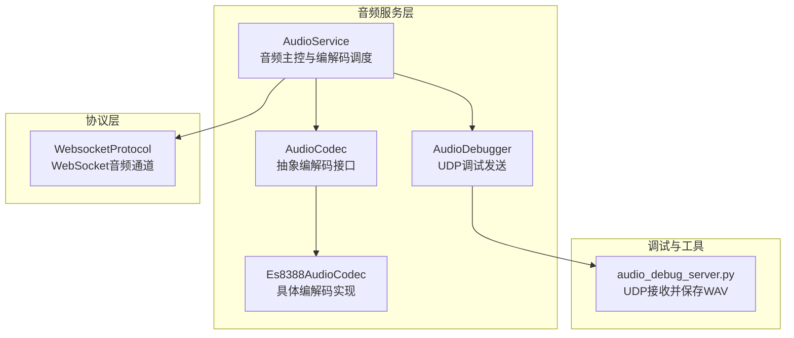
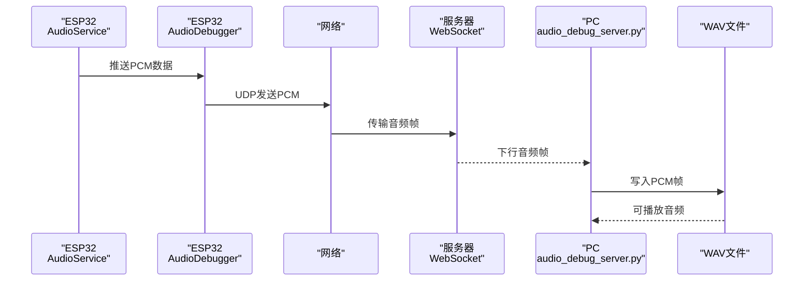
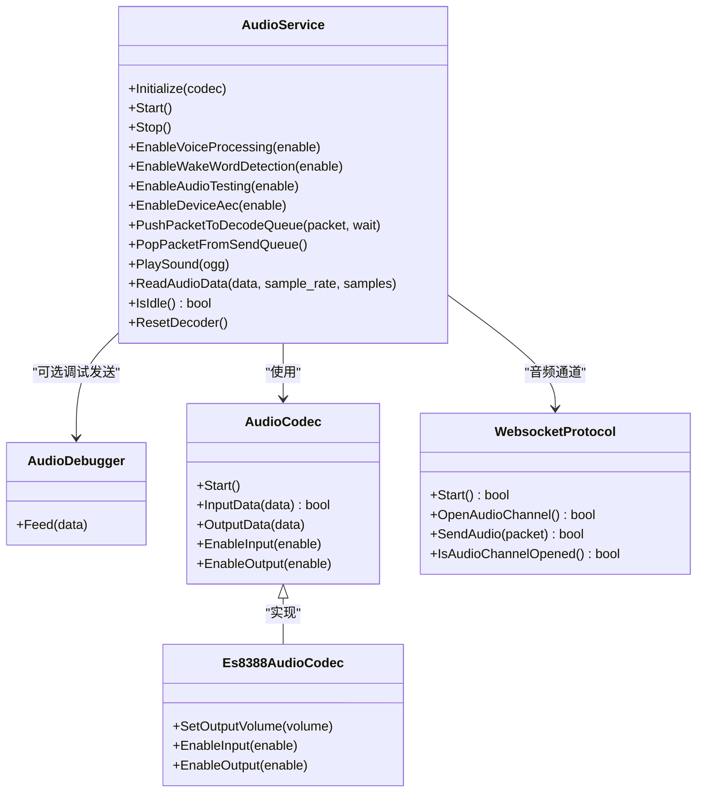
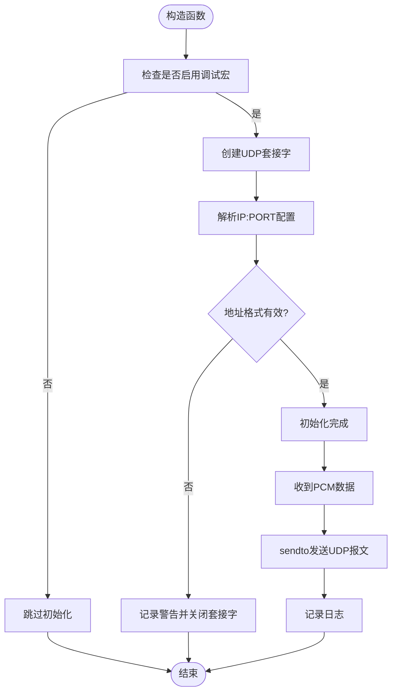
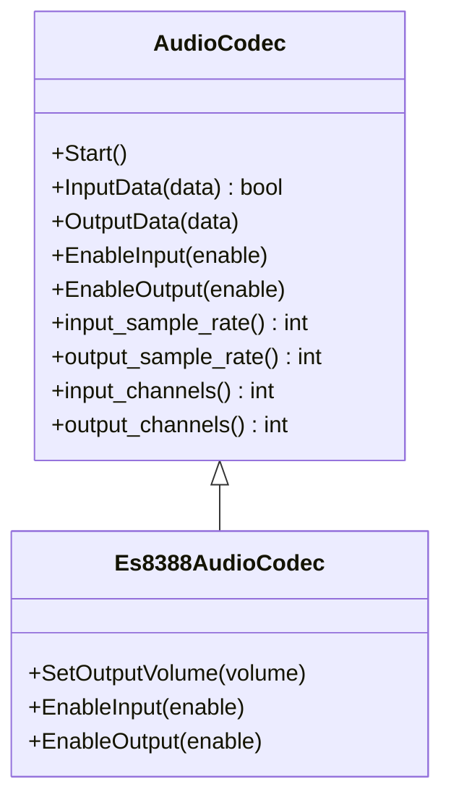
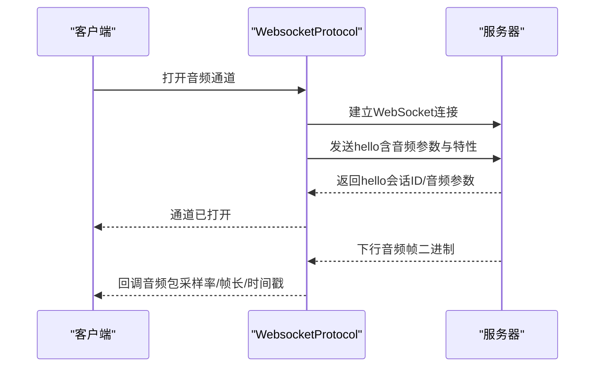
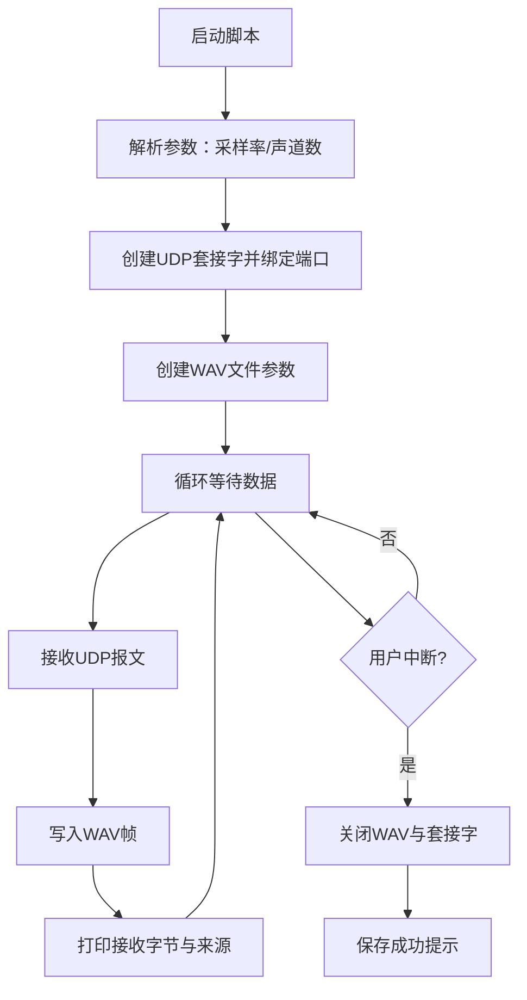
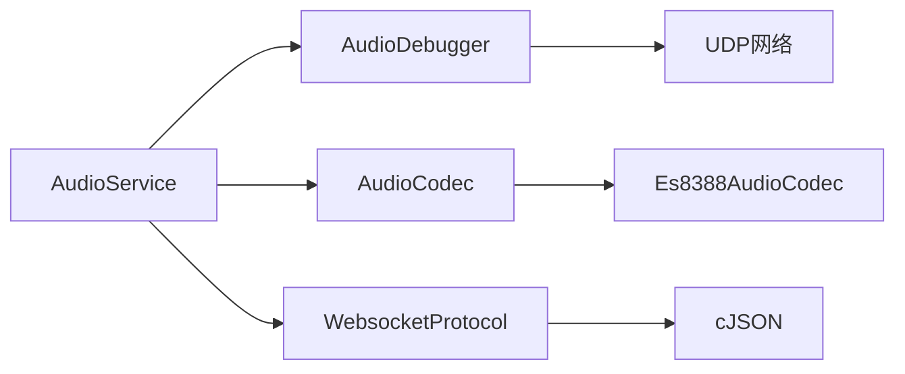

# 音频调试工具

<cite>
**本文引用的文件**
- [scripts/audio_debug_server.py](file://scripts/audio_debug_server.py)
- [main/audio/processors/audio_debugger.h](file://main/audio/processors/audio_debugger.h)
- [main/audio/processors/audio_debugger.cc](file://main/audio/processors/audio_debugger.cc)
- [main/audio/audio_service.h](file://main/audio/audio_service.h)
- [main/audio/audio_service.cc](file://main/audio/audio_service.cc)
- [main/protocols/websocket_protocol.h](file://main/protocols/websocket_protocol.h)
- [main/protocols/websocket_protocol.cc](file://main/protocols/websocket_protocol.cc)
- [main/audio/audio_codec.h](file://main/audio/audio_codec.h)
- [main/audio/codecs/es8388_audio_codec.h](file://main/audio/codecs/es8388_audio_codec.h)
- [main/audio/codecs/es8388_audio_codec.cc](file://main/audio/codecs/es8388_audio_codec.cc)
- [CMakeLists.txt](file://CMakeLists.txt)
</cite>

## 目录
1. [简介](#简介)
2. [项目结构](#项目结构)
3. [核心组件](#核心组件)
4. [架构总览](#架构总览)
5. [详细组件分析](#详细组件分析)
6. [依赖关系分析](#依赖关系分析)
7. [性能考量](#性能考量)
8. [故障排查指南](#故障排查指南)
9. [结论](#结论)
10. [附录](#附录)

## 简介
本文件面向“音频调试工具”的使用者与维护者，系统性阐述音频调试器的功能特性与实现原理，覆盖以下方面：
- 音频质量监控：通过统计计数、延迟与队列状态观测，辅助判断链路健康度
- 实时波形显示：基于调试服务器的UDP音频流接收与WAV落盘，支持本地播放与频谱分析
- 频谱分析：结合外部脚本工具对WAV进行频谱可视化
- 延迟测量：利用时间戳队列与队列长度估算端到端延迟
- 调试数据采集、传输与可视化：ESP32侧UDP调试发送、PC侧UDP接收并保存WAV
- 音频问题诊断方法：从输入/输出链路、编解码、网络传输到播放环节的系统化排查
- 性能指标监控：CPU使用率、内存占用、音频延迟、丢包率等关键指标的观测与优化建议
- 最佳实践与常见陷阱：配置、缓冲区与任务优先级、资源管理与日志策略

## 项目结构
该仓库采用ESP-IDF工程组织方式，音频相关代码集中在 main/audio 及其子目录，协议层位于 main/protocols，调试脚本位于 scripts。整体结构如下：

图表来源
- [main/audio/audio_service.h](file://main/audio/audio_service.h#L81-L157)
- [main/audio/processors/audio_debugger.h](file://main/audio/processors/audio_debugger.h#L10-L22)
- [main/audio/audio_codec.h](file://main/audio/audio_codec.h#L18-L60)
- [main/audio/codecs/es8388_audio_codec.h](file://main/audio/codecs/es8388_audio_codec.h#L12-L41)
- [main/protocols/websocket_protocol.h](file://main/protocols/websocket_protocol.h#L13-L35)
- [scripts/audio_debug_server.py](file://scripts/audio_debug_server.py#L11-L55)

章节来源
- [CMakeLists.txt](file://CMakeLists.txt#L1-L15)

## 核心组件
- 音频服务 AudioService：负责音频输入/输出任务、编解码任务、队列管理、事件控制、唤醒词与语音处理模块集成、设备AEC开关、调试统计等
- 音频调试器 AudioDebugger：在启用配置下，将PCM数据通过UDP发送至指定服务器
- 音频编解码 AudioCodec/Es8388AudioCodec：抽象I2S读写与编解码设备控制，实现具体硬件驱动
- 协议 WebsocketProtocol：建立WebSocket连接，承载音频二进制帧与JSON控制消息
- 调试服务器脚本 audio_debug_server.py：监听UDP端口，接收PCM数据并写入WAV文件

章节来源
- [main/audio/audio_service.h](file://main/audio/audio_service.h#L81-L157)
- [main/audio/processors/audio_debugger.h](file://main/audio/processors/audio_debugger.h#L10-L22)
- [main/audio/audio_codec.h](file://main/audio/audio_codec.h#L18-L60)
- [main/audio/codecs/es8388_audio_codec.h](file://main/audio/codecs/es8388_audio_codec.h#L12-L41)
- [main/protocols/websocket_protocol.h](file://main/protocols/websocket_protocol.h#L13-L35)
- [scripts/audio_debug_server.py](file://scripts/audio_debug_server.py#L11-L55)

## 架构总览
音频调试工具的整体工作流分为两条路径：
- 设备侧（ESP32）：采集PCM → 处理/编码 → 发送队列 → WebSocket发送
- PC侧（调试）：UDP接收PCM → 写入WAV → 播放/频谱分析

图表来源
- [main/audio/audio_service.cc](file://main/audio/audio_service.cc#L198-L207)
- [main/audio/processors/audio_debugger.cc](file://main/audio/processors/audio_debugger.cc#L54-L66)
- [main/protocols/websocket_protocol.cc](file://main/protocols/websocket_protocol.cc#L28-L58)
- [scripts/audio_debug_server.py](file://scripts/audio_debug_server.py#L25-L43)

## 详细组件分析

### 组件A：音频服务 AudioService
职责与流程要点：
- 初始化编解码器、编码器/解码器、重采样器、处理器与唤醒词模块
- 启动三类任务：音频输入/输出与编解码任务
- 管理多条队列：编码队列、发送队列、播放队列、测试队列；设置最大队列长度以防止阻塞
- 提供启用/禁用语音处理、唤醒词检测、音频测试、设备AEC等功能
- 在读取音频数据路径中，按需触发调试器发送PCM
- 统计输入/解码/编码/播放计数，用于质量监控

图表来源
- [main/audio/audio_service.h](file://main/audio/audio_service.h#L81-L157)
- [main/audio/processors/audio_debugger.h](file://main/audio/processors/audio_debugger.h#L10-L22)
- [main/audio/audio_codec.h](file://main/audio/audio_codec.h#L18-L60)
- [main/audio/codecs/es8388_audio_codec.h](file://main/audio/codecs/es8388_audio_codec.h#L12-L41)
- [main/protocols/websocket_protocol.h](file://main/protocols/websocket_protocol.h#L13-L35)

章节来源
- [main/audio/audio_service.h](file://main/audio/audio_service.h#L81-L157)
- [main/audio/audio_service.cc](file://main/audio/audio_service.cc#L33-L93)
- [main/audio/audio_service.cc](file://main/audio/audio_service.cc#L198-L207)
- [main/audio/audio_service.cc](file://main/audio/audio_service.cc#L314-L391)

### 组件B：音频调试器 AudioDebugger
- 条件编译：仅当启用调试宏时生效
- 初始化：解析配置中的“IP:PORT”，创建UDP套接字并记录日志
- 数据发送：将PCM数据以UDP报文发送至服务器
- 资源管理：析构时关闭套接字

图表来源
- [main/audio/processors/audio_debugger.cc](file://main/audio/processors/audio_debugger.cc#L16-L66)

章节来源
- [main/audio/processors/audio_debugger.h](file://main/audio/processors/audio_debugger.h#L10-L22)
- [main/audio/processors/audio_debugger.cc](file://main/audio/processors/audio_debugger.cc#L16-L66)

### 组件C：音频编解码 AudioCodec 与 Es8388AudioCodec
- 抽象接口：定义输入/输出启停、数据读写、采样率/通道查询等
- 具体实现：Es8388AudioCodec 使用I2S与编解码设备驱动，支持输入增益、输出音量与功耗管理

图表来源
- [main/audio/audio_codec.h](file://main/audio/audio_codec.h#L18-L60)
- [main/audio/codecs/es8388_audio_codec.h](file://main/audio/codecs/es8388_audio_codec.h#L12-L41)

章节来源
- [main/audio/audio_codec.h](file://main/audio/audio_codec.h#L18-L60)
- [main/audio/codecs/es8388_audio_codec.cc](file://main/audio/codecs/es8388_audio_codec.cc#L70-L208)

### 组件D：协议 WebsocketProtocol
- 连接管理：按需打开音频通道，设置头部信息（认证、设备ID、客户端ID）
- 消息解析：识别二进制协议版本（v2/v3），解析下行音频帧并回调上层
- 文本消息：解析JSON“hello”握手，获取会话ID与远端音频参数

图表来源
- [main/protocols/websocket_protocol.cc](file://main/protocols/websocket_protocol.cc#L82-L200)
- [main/protocols/websocket_protocol.cc](file://main/protocols/websocket_protocol.cc#L227-L253)

章节来源
- [main/protocols/websocket_protocol.h](file://main/protocols/websocket_protocol.h#L13-L35)
- [main/protocols/websocket_protocol.cc](file://main/protocols/websocket_protocol.cc#L28-L58)
- [main/protocols/websocket_protocol.cc](file://main/protocols/websocket_protocol.cc#L202-L225)

### 组件E：调试服务器脚本 audio_debug_server.py
- 功能：创建UDP套接字，绑定本地端口，接收PCM数据并写入WAV文件
- 参数：采样率与声道数，自动创建对应文件名
- 日志：打印接收字节数与来源地址，键盘中断优雅退出

图表来源
- [scripts/audio_debug_server.py](file://scripts/audio_debug_server.py#L11-L55)

章节来源
- [scripts/audio_debug_server.py](file://scripts/audio_debug_server.py#L11-L55)

## 依赖关系分析
- AudioService 依赖 AudioDebugger（条件）、AudioCodec、WebsocketProtocol、Opus编解码器与重采样器
- AudioDebugger 依赖系统网络栈（UDP）
- WebsocketProtocol 依赖网络与WebSocket库、JSON解析库
- Es8388AudioCodec 依赖I2S与编解码设备驱动

图表来源
- [main/audio/audio_service.h](file://main/audio/audio_service.h#L20-L24)
- [main/audio/processors/audio_debugger.cc](file://main/audio/processors/audio_debugger.cc#L17-L42)
- [main/protocols/websocket_protocol.cc](file://main/protocols/websocket_protocol.cc#L7-L11)

章节来源
- [main/audio/audio_service.h](file://main/audio/audio_service.h#L20-L24)
- [main/audio/processors/audio_debugger.cc](file://main/audio/processors/audio_debugger.cc#L17-L42)
- [main/protocols/websocket_protocol.cc](file://main/protocols/websocket_protocol.cc#L7-L11)

## 性能考量
- 队列长度与背压：发送/播放/编码队列上限限制了瞬时积压，避免内存暴涨与任务阻塞
- 任务优先级与栈空间：音频输入/输出/编解码任务分别创建，注意合理分配核心与优先级
- 重采样与带宽：编解码前后重采样会增加CPU负载，应根据目标采样率与通道数评估
- 功耗与时钟：定时器周期性检查输入/输出活跃度，空闲时关闭编解码通道以节能
- 网络抖动与丢包：WebSocket二进制帧承载音频，网络不稳定时建议开启服务端AEC或提高队列冗余

章节来源
- [main/audio/audio_service.h](file://main/audio/audio_service.h#L37-L46)
- [main/audio/audio_service.cc](file://main/audio/audio_service.cc#L314-L391)
- [main/audio/audio_service.cc](file://main/audio/audio_service.cc#L656-L669)

## 故障排查指南
- 无法接收调试音频
  - 检查ESP32侧调试宏是否启用与服务器地址格式（IP:PORT）
  - 确认PC侧UDP端口未被占用且防火墙允许
  - 查看调试脚本输出与ESP32日志
- WAV无法播放或无声
  - 校验采样率/声道参数与脚本一致
  - 确认PCM数据持续到达，避免空包
- 延迟过大
  - 观察发送/播放队列长度与编码/解码计数
  - 检查网络延迟与服务器处理时间
  - 调整帧时长与队列上限
- 唤醒词/语音处理异常
  - 确认处理器初始化与启动标志位
  - 检查输入通道数与采样率匹配
- 设备AEC无效
  - 确认服务端AEC特性与时间戳队列逻辑

章节来源
- [main/audio/processors/audio_debugger.cc](file://main/audio/processors/audio_debugger.cc#L34-L42)
- [scripts/audio_debug_server.py](file://scripts/audio_debug_server.py#L25-L43)
- [main/audio/audio_service.cc](file://main/audio/audio_service.cc#L474-L536)
- [main/audio/audio_service.cc](file://main/audio/audio_service.cc#L314-L391)

## 结论
该音频调试工具通过ESP32侧的AudioService与AudioDebugger，配合PC侧的UDP/WAV接收脚本，实现了从设备到PC的完整音频链路可视化与分析闭环。结合队列统计、时间戳与网络协议，可有效支撑音频质量监控、延迟测量与问题定位。建议在实际部署中关注队列长度、任务优先级与网络稳定性，并结合外部频谱分析工具进行深度诊断。

## 附录

### A. 音频质量监控与统计
- 输入/解码/编码/播放计数：用于评估链路吞吐与异常
- 队列长度：发送/播放/编码/测试队列长度反映背压与缓冲能力
- 时间戳队列：用于服务端AEC与端到端延迟估算

章节来源
- [main/audio/audio_service.h](file://main/audio/audio_service.h#L74-L79)
- [main/audio/audio_service.cc](file://main/audio/audio_service.cc#L408-L429)

### B. 延迟测量方法
- 端到端延迟估算：基于时间戳队列与队列长度，结合帧时长与网络往返时间
- 编解码延迟：通过解码后重采样与播放队列长度评估
- 网络延迟：WebSocket握手与帧传输时延叠加

章节来源
- [main/audio/audio_service.cc](file://main/audio/audio_service.cc#L417-L424)
- [main/protocols/websocket_protocol.cc](file://main/protocols/websocket_protocol.cc#L111-L146)

### C. 频谱分析与可视化
- 使用调试服务器保存的WAV文件，结合外部脚本工具进行频谱分析与图形化展示
- 建议对比不同采样率/通道下的频谱特征，定位失真或噪声源

章节来源
- [scripts/audio_debug_server.py](file://scripts/audio_debug_server.py#L16-L23)