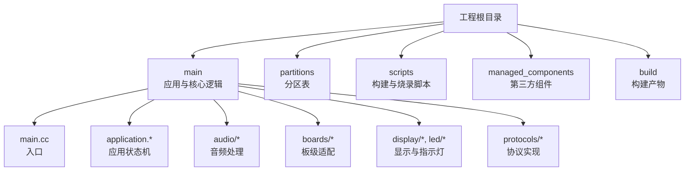
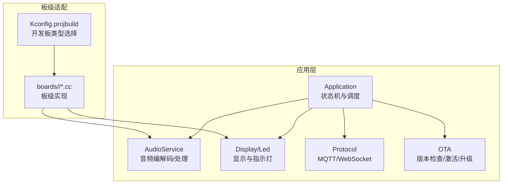
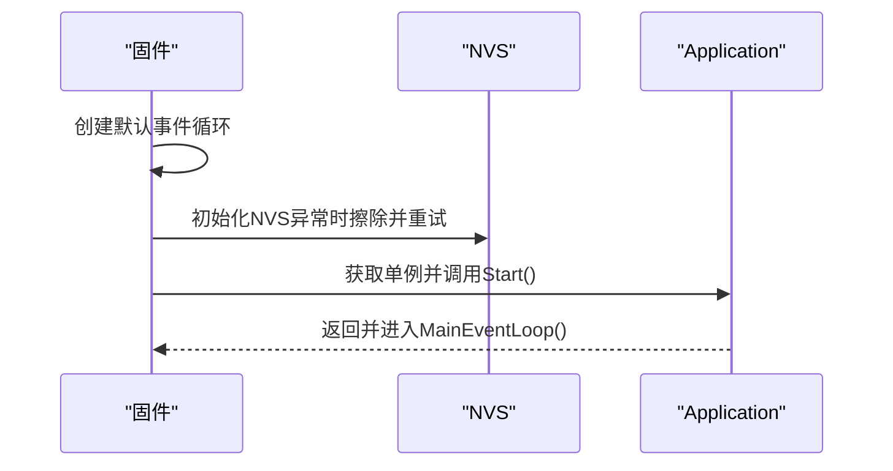
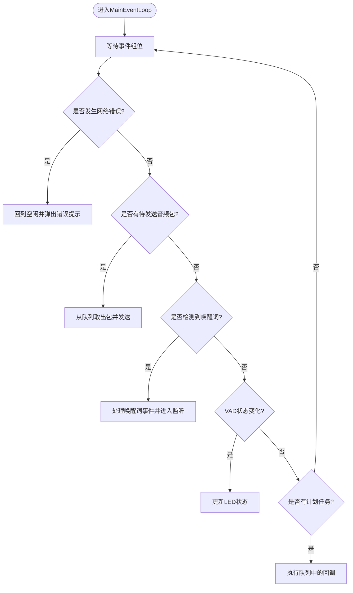
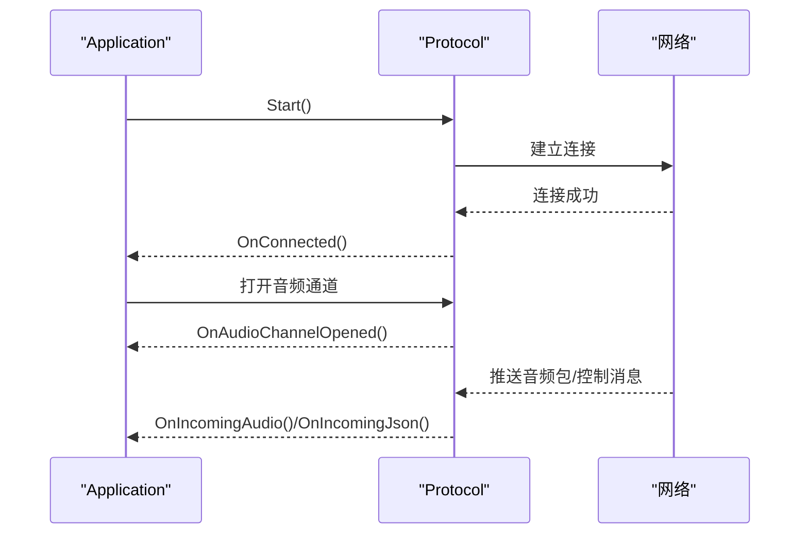
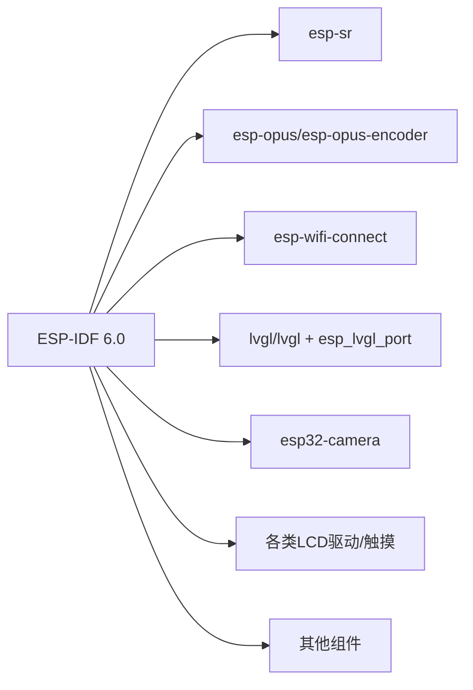

# 快速开始

<cite>
**本文引用的文件**   
- [CMakeLists.txt](file://CMakeLists.txt)
- [main/CMakeLists.txt](file://main/CMakeLists.txt)
- [main/Kconfig.projbuild](file://main/Kconfig.projbuild)
- [sdkconfig.defaults](file://sdkconfig.defaults)
- [main/main.cc](file://main/main.cc)
- [main/application.h](file://main/application.h)
- [main/application.cc](file://main/application.cc)
- [partitions/v1/16m.csv](file://partitions/v1/16m.csv)
- [dependencies.lock](file://dependencies.lock)
- [scripts/flash.sh](file://scripts/flash.sh)
- [managed_components/78__esp-ml307/idf_component.yml](file://managed_components/78__esp-ml307/idf_component.yml)
</cite>

## 目录
1. [简介](#简介)
2. [项目结构](#项目结构)
3. [核心组件](#核心组件)
4. [架构总览](#架构总览)
5. [详细组件分析](#详细组件分析)
6. [依赖关系分析](#依赖关系分析)
7. [性能考虑](#性能考虑)
8. [故障排查指南](#故障排查指南)
9. [结论](#结论)
10. [附录](#附录)

## 简介
本指南面向首次接触“小智ESP32智能语音助手”项目的开发者，提供从环境准备到首次运行的完整步骤，覆盖以下内容：
- ESP-IDF框架与工具链安装
- 项目编译与烧录
- 第一次运行：硬件连接、WiFi配置、基础功能验证
- 常见编译错误与解决方法
- 不同操作系统（Windows、macOS、Linux）的安装要点
- 项目结构与关键文件说明

## 项目结构
项目采用ESP-IDF标准工程组织方式，核心目录与职责如下：
- main：应用入口与主逻辑，包含启动流程、状态机、协议适配、OTA等
- main/assets：多语言资源与声音素材
- main/audio：音频编解码、处理器、唤醒词检测
- main/boards：各开发板适配层
- main/display、main/led：显示与指示灯抽象
- main/protocols：MQTT/WebSocket协议实现
- partitions：分区表
- scripts：构建与烧录辅助脚本
- managed_components：第三方组件（由IDF组件管理器下载）
- build：构建产物（由CMake/Ninja生成）

图表来源
- [CMakeLists.txt](file://CMakeLists.txt#L1-L15)
- [main/CMakeLists.txt](file://main/CMakeLists.txt#L1-L40)

章节来源
- [CMakeLists.txt](file://CMakeLists.txt#L1-L15)
- [main/CMakeLists.txt](file://main/CMakeLists.txt#L1-L40)

## 核心组件
- 应用入口与初始化：负责事件循环、NVS初始化、应用实例启动与主事件循环
- 应用状态机：统一管理设备状态（启动、配置、空闲、连接中、监听、说话、升级、激活等），并协调音频服务、协议栈与显示
- 协议栈：支持MQTT与WebSocket两种协议，负责音频通道打开/关闭、消息收发与错误处理
- 音频服务：封装编码、解码、唤醒词检测、噪声抑制、AEC模式切换等
- 板级适配：根据Kconfig选择具体开发板类型，动态加载对应源文件与资源
- OTA：检查新版本、激活码流程、升级与重启

章节来源
- [main/main.cc](file://main/main.cc#L1-L32)
- [main/application.h](file://main/application.h#L1-L91)
- [main/application.cc](file://main/application.cc#L1-L776)

## 架构总览
系统以“应用状态机”为核心，围绕其调度音频服务、网络协议与显示输出；板级适配在编译期按Kconfig选择，确保最小化裁剪与最佳兼容性。

图表来源
- [main/application.cc](file://main/application.cc#L328-L512)
- [main/Kconfig.projbuild](file://main/Kconfig.projbuild#L62-L352)
- [main/CMakeLists.txt](file://main/CMakeLists.txt#L36-L230)

## 详细组件分析

### 应用入口与初始化
- 初始化默认事件循环与NVS（若损坏则擦除并重新初始化）
- 启动Application单例并进入主事件循环

图表来源
- [main/main.cc](file://main/main.cc#L13-L31)

章节来源
- [main/main.cc](file://main/main.cc#L1-L32)

### 应用状态机与事件循环
- 事件组驱动：定时器、音频发送队列可用、唤醒词检测、VAD变化、网络错误
- 状态转换：根据当前状态与事件触发相应动作（如进入监听、说话、连接、升级等）
- 调度机制：通过队列异步执行跨任务回调，避免阻塞主循环

图表来源
- [main/application.cc](file://main/application.cc#L540-L583)

章节来源
- [main/application.cc](file://main/application.cc#L538-L583)

### 协议栈（MQTT/WebSocket）
- 连接建立：根据OTA配置优先选择MQTT或WebSocket
- 音频通道：打开/关闭音频通道，处理远端采样率与设备输出采样率不一致的情况
- 消息解析：识别TTS/STT/LLM/MCP/系统命令等消息类型并驱动UI与音频播放

图表来源
- [main/application.cc](file://main/application.cc#L370-L498)

章节来源
- [main/application.cc](file://main/application.cc#L368-L498)

### 音频服务与唤醒词检测
- 编码/解码：封装音频编解码与发送队列
- 唤醒词检测：支持ESP内置、AFE与自定义三种模式，按Kconfig启用
- 处理器：可选噪声抑制与AEC（设备侧/服务侧），根据目标平台与内存限制启用

章节来源
- [main/application.cc](file://main/application.cc#L328-L379)
- [main/Kconfig.projbuild](file://main/Kconfig.projbuild#L458-L521)

### 板级适配与资源生成
- Kconfig选择开发板类型，CMake根据选择拼接对应源文件
- 语言资源与声音文件嵌入，部分开发板类型会生成SPIFFS资源分区

章节来源
- [main/CMakeLists.txt](file://main/CMakeLists.txt#L36-L230)
- [main/CMakeLists.txt](file://main/CMakeLists.txt#L322-L380)

## 依赖关系分析
- 组件来源：通过dependencies.lock声明的组件仓库与版本约束，确保ESP-IDF与第三方组件的兼容性
- 关键组件：esp-sr（语音识别）、esp-opus/esp-opus-encoder（音频编解码）、esp-wifi-connect（WiFi配网）、LVGL与esp_lvgl_port（图形界面）、esp32-camera（摄像头）、各类LCD驱动与触摸组件等
- 目标芯片：默认目标为esp32s3，可在Kconfig中调整

图表来源
- [dependencies.lock](file://dependencies.lock#L1-L660)

章节来源
- [dependencies.lock](file://dependencies.lock#L1-L660)

## 性能考虑
- 内存与存储：默认分区表为16MB，包含模型分区与双OTA槽位；可根据实际需求调整分区大小
- 优化策略：启用编译器优化以减小体积；禁用不必要的LVGL部件以节省Flash；合理配置音频采样率与AEC模式
- 任务与定时器：主事件循环提升优先级，避免被后台任务抢占；定时器周期性刷新状态栏与打印堆栈统计

章节来源
- [sdkconfig.defaults](file://sdkconfig.defaults#L1-L78)
- [partitions/v1/16m.csv](file://partitions/v1/16m.csv#L1-L9)
- [main/application.cc](file://main/application.cc#L514-L526)

## 故障排查指南
- 编译报错：检查ESP-IDF版本与Kconfig配置是否匹配；确认目标芯片与SPIRAM要求满足（如启用AFE唤醒词或音频处理器）
- 烧录失败：确认串口设备名称正确、波特率与工具链版本匹配；参考scripts/flash.sh中的参数进行手动烧录
- 启动卡顿/崩溃：查看NVS初始化日志，必要时擦除NVS分区；检查分区表与SPIFFS资源生成是否正确
- 无法联网：确认WiFi配置流程已完成；检查OTA配置URL与网络连通性

章节来源
- [main/main.cc](file://main/main.cc#L18-L25)
- [scripts/flash.sh](file://scripts/flash.sh#L1-L3)

## 结论
通过本指南，您可以在Windows、macOS、Linux上完成ESP-IDF环境搭建、项目编译与烧录，并基于Kconfig选择合适的开发板类型与功能特性。首次运行后，结合应用状态机与协议栈，即可完成语音助手的基本交互流程。

## 附录

### 开发环境搭建（Windows/macOS/Linux）
- 安装ESP-IDF：遵循官方安装指南，确保Python、CMake、Ninja与工具链就绪
- 克隆项目：将仓库克隆至本地
- 配置Kconfig：使用menuconfig选择开发板类型、语言、音频与AEC等选项
- 编译与烧录：使用idf.py build与flash命令；或参考scripts/flash.sh进行手动烧录

章节来源
- [main/Kconfig.projbuild](file://main/Kconfig.projbuild#L1-L60)
- [scripts/flash.sh](file://scripts/flash.sh#L1-L3)

### 项目编译与烧录步骤
- 配置：idf.py menuconfig，选择开发板类型与语言
- 编译：idf.py build
- 烧录：idf.py -p <串口号> flash
- 监视：idf.py -p <串口号> monitor

章节来源
- [main/Kconfig.projbuild](file://main/Kconfig.projbuild#L62-L352)
- [CMakeLists.txt](file://CMakeLists.txt#L1-L15)

### 第一次运行示例
- 硬件连接：将开发板通过USB线连接至PC，确认串口设备出现
- WiFi配置：通过网页或声波配网方式完成WiFi连接（具体取决于所选开发板与Kconfig）
- 基础功能测试：观察显示状态变化、LED反馈、播放提示音；尝试唤醒词触发与语音对话

章节来源
- [main/application.cc](file://main/application.cc#L328-L512)

### 关键文件说明
- CMakeLists.txt：顶层构建配置，引入ESP-IDF构建系统
- main/CMakeLists.txt：应用组件源文件列表、板级适配与语言资源生成
- main/Kconfig.projbuild：项目配置菜单，涵盖语言、开发板类型、唤醒词与音频处理等
- sdkconfig.defaults：默认配置项，含分区表、LVGL裁剪、编译器优化等
- partitions/v1/16m.csv：分区表，定义模型、OTA槽位等分区
- dependencies.lock：组件依赖与版本锁定
- scripts/flash.sh：示例烧录脚本
- managed_components/78__esp-ml307/idf_component.yml：组件元信息（版本与依赖）

章节来源
- [CMakeLists.txt](file://CMakeLists.txt#L1-L15)
- [main/CMakeLists.txt](file://main/CMakeLists.txt#L1-L40)
- [main/Kconfig.projbuild](file://main/Kconfig.projbuild#L1-L560)
- [sdkconfig.defaults](file://sdkconfig.defaults#L1-L78)
- [partitions/v1/16m.csv](file://partitions/v1/16m.csv#L1-L9)
- [dependencies.lock](file://dependencies.lock#L1-L660)
- [scripts/flash.sh](file://scripts/flash.sh#L1-L3)
- [managed_components/78__esp-ml307/idf_component.yml](file://managed_components/78__esp-ml307/idf_component.yml#L1-L12)