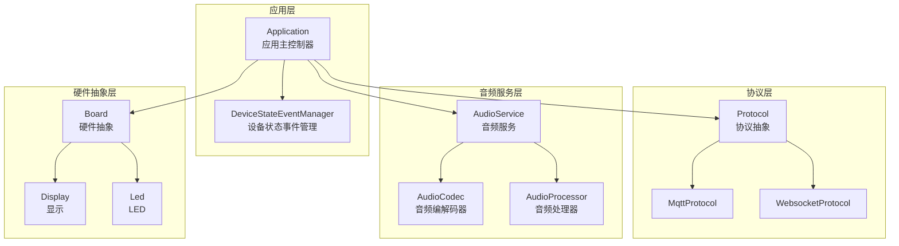
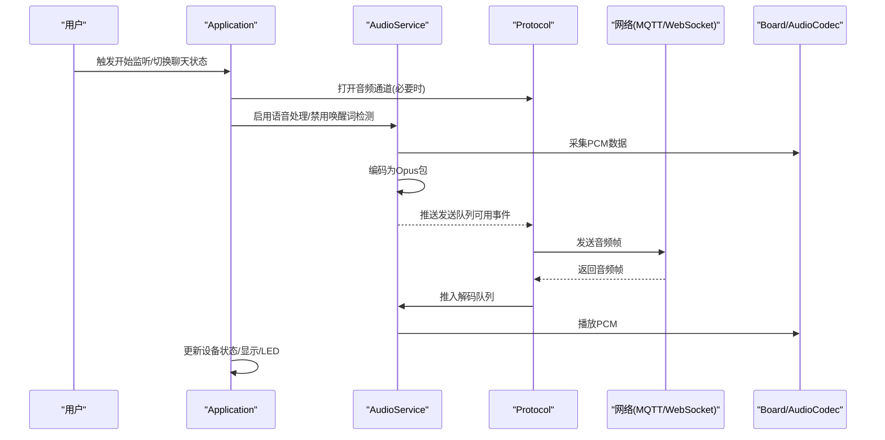
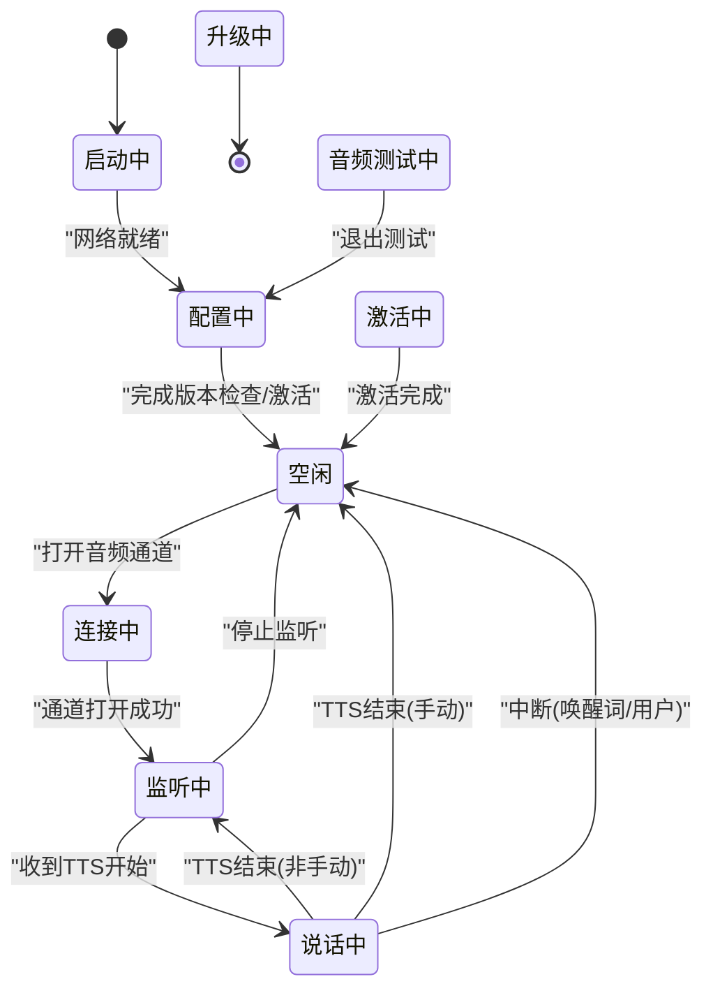
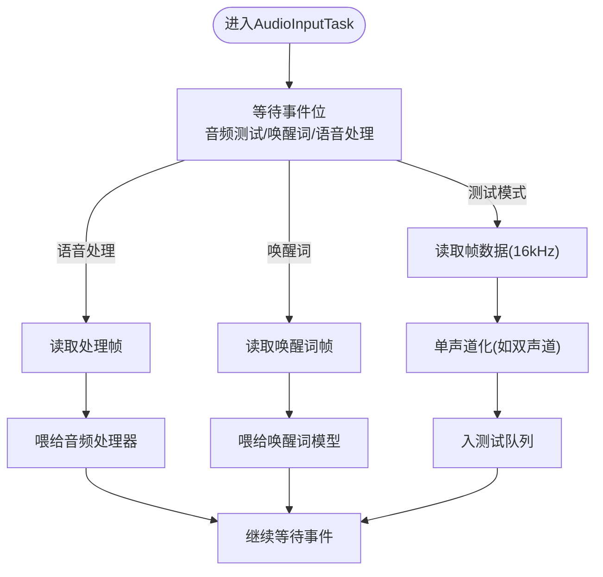
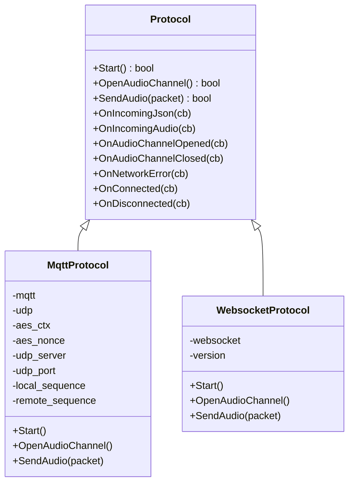
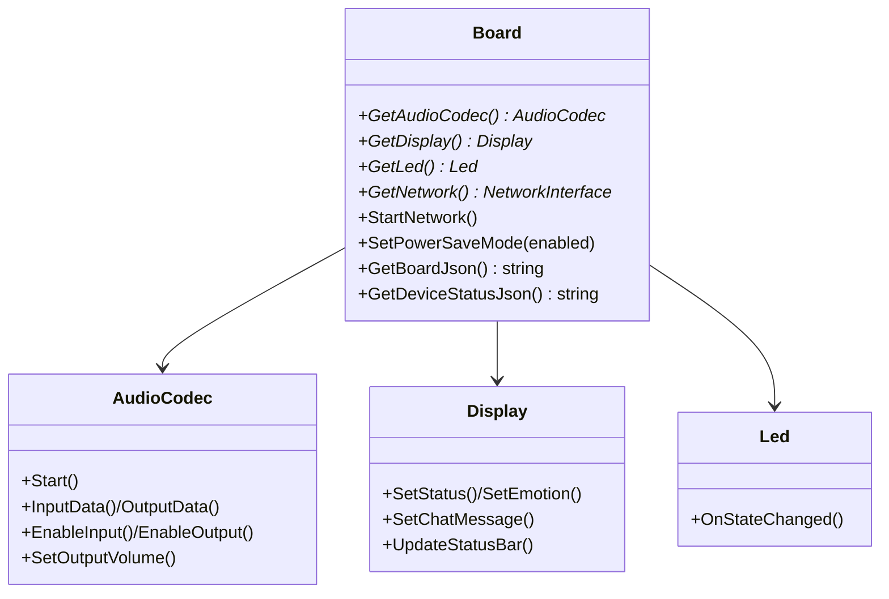
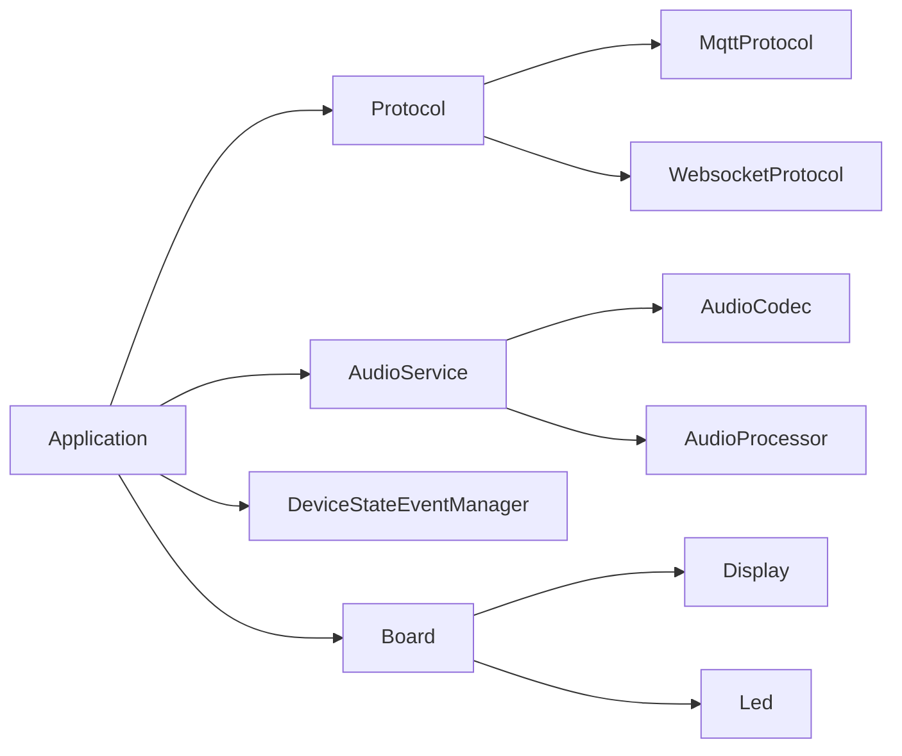

# 技术架构

<cite>
**本文引用的文件**
- [main/application.h](file://main/application.h)
- [main/application.cc](file://main/application.cc)
- [main/audio/audio_service.h](file://main/audio/audio_service.h)
- [main/audio/audio_service.cc](file://main/audio/audio_service.cc)
- [main/audio/audio_codec.h](file://main/audio/audio_codec.h)
- [main/audio/audio_processor.h](file://main/audio/audio_processor.h)
- [main/protocols/protocol.h](file://main/protocols/protocol.h)
- [main/protocols/mqtt_protocol.h](file://main/protocols/mqtt_protocol.h)
- [main/protocols/websocket_protocol.h](file://main/protocols/websocket_protocol.h)
- [main/boards/common/board.h](file://main/boards/common/board.h)
- [main/display/display.h](file://main/display/display.h)
- [main/led/led.h](file://main/led/led.h)
- [main/device_state.h](file://main/device_state.h)
- [main/device_state_event.h](file://main/device_state_event.h)
</cite>

## 目录
1. [引言](#引言)
2. [项目结构](#项目结构)
3. [核心组件](#核心组件)
4. [架构总览](#架构总览)
5. [详细组件分析](#详细组件分析)
6. [依赖分析](#依赖分析)
7. [性能考虑](#性能考虑)
8. [故障排查指南](#故障排查指南)
9. [结论](#结论)
10. [附录](#附录)

## 引言
本技术架构文档面向“小智ESP32智能语音助手”项目，系统性阐述其分层架构、模块化与插件化设计、核心组件关系、设计模式应用、数据流路径以及技术选型理由。目标是帮助开发者快速理解系统全貌，并为后续扩展与维护提供清晰的指导。

## 项目结构
项目采用“分层 + 插件化”的组织方式：
- 应用层（Application）：负责状态机、事件循环、业务编排与对外接口。
- 协议层（Protocol）：抽象通信协议，支持MQTT与WebSocket两种实现。
- 音频服务层（AudioService）：统一音频采集、编码、解码、播放与AEC处理。
- 硬件抽象层（Board）：封装不同开发板差异，向上提供统一接口。
- 显示与LED：UI与指示灯抽象，便于多形态设备适配。
- 设备状态管理：集中管理设备状态与事件广播。

图表来源
- [main/application.h](file://main/application.h#L32-L88)
- [main/application.cc](file://main/application.cc#L328-L512)
- [main/audio/audio_service.h](file://main/audio/audio_service.h#L81-L157)
- [main/audio/audio_codec.h](file://main/audio/audio_codec.h#L18-L60)
- [main/audio/audio_processor.h](file://main/audio/audio_processor.h#L10-L26)
- [main/protocols/protocol.h](file://main/protocols/protocol.h#L44-L95)
- [main/protocols/mqtt_protocol.h](file://main/protocols/mqtt_protocol.h#L24-L57)
- [main/protocols/websocket_protocol.h](file://main/protocols/websocket_protocol.h#L13-L32)
- [main/boards/common/board.h](file://main/boards/common/board.h#L18-L53)
- [main/display/display.h](file://main/display/display.h#L18-L93)
- [main/led/led.h](file://main/led/led.h#L4-L18)

章节来源
- [main/application.h](file://main/application.h#L32-L88)
- [main/application.cc](file://main/application.cc#L328-L512)
- [main/audio/audio_service.h](file://main/audio/audio_service.h#L26-L53)
- [main/boards/common/board.h](file://main/boards/common/board.h#L18-L53)

## 核心组件
- Application（应用主控制器）
  - 单例模式：全局唯一实例，提供Start/MainEventLoop等入口。
  - 设备状态机：覆盖启动、配置、空闲、连接中、监听、说话、升级、激活、音频测试、致命错误等状态。
  - 事件循环：基于事件组驱动，异步调度任务队列，协调音频服务与协议层交互。
  - 外部接口：开始/停止监听、切换聊天状态、音效播放、AEC模式设置、OTA检查与升级等。
- AudioService（音频服务）
  - 双任务模型：音频输入/输出任务 + Opus编解码任务；分别处理麦克风/扬声器与编码/解码。
  - 队列与背压：发送队列、解码队列、回放队列、测试队列，配合条件变量与互斥锁保证线程安全。
  - 功能开关：唤醒词检测、语音处理（含AEC）、音频测试、静音功耗控制。
- Protocol（协议抽象）
  - 定义统一接口：Start、OpenAudioChannel、SendAudio、回调注册等。
  - 具体实现：MqttProtocol与WebsocketProtocol，均继承自Protocol并注入回调以处理消息类型。
- Board（硬件抽象）
  - 统一接口：获取音频编解码器、显示、LED、网络、相机等资源。
  - 工厂/创建：通过create_board动态创建具体板卡实例。
- Display/Led（显示与LED）
  - 抽象基类：不同设备可实现不同渲染或指示逻辑。
- 设备状态事件管理
  - 基于esp_event的观察者模式：集中注册回调，广播状态变更事件。

章节来源
- [main/application.h](file://main/application.h#L32-L88)
- [main/application.cc](file://main/application.cc#L328-L512)
- [main/audio/audio_service.h](file://main/audio/audio_service.h#L81-L157)
- [main/audio/audio_service.cc](file://main/audio/audio_service.cc#L95-L137)
- [main/protocols/protocol.h](file://main/protocols/protocol.h#L44-L95)
- [main/boards/common/board.h](file://main/boards/common/board.h#L18-L53)
- [main/device_state.h](file://main/device_state.h#L4-L16)
- [main/device_state_event.h](file://main/device_state_event.h#L21-L37)

## 架构总览
系统采用“应用主控制器 + 协议层 + 音频服务层 + 硬件抽象层”的四层架构，辅以事件驱动与回调机制，确保跨平台与多协议兼容。

图表来源
- [main/application.cc](file://main/application.cc#L242-L267)
- [main/application.cc](file://main/application.cc#L340-L407)
- [main/audio/audio_service.cc](file://main/audio/audio_service.cc#L314-L391)
- [main/protocols/protocol.h](file://main/protocols/protocol.h#L58-L76)

## 详细组件分析

### Application（应用主控制器）
- 设计要点
  - 单例：全局唯一实例，避免重复初始化。
  - 事件循环：使用事件组等待多个信号源（定时器、音频事件、网络错误等），降低优先级抢占风险。
  - 状态机：集中管理设备状态转换，驱动显示、LED与音频服务联动。
  - 异步调度：通过队列与互斥锁，将跨任务的协议操作安全地委派给主循环执行。
- 关键行为
  - 启动流程：初始化显示、音频服务、网络、协议；根据OTA配置选择MQTT或WebSocket。
  - 监听/说话切换：根据AEC模式与当前状态决定是否开启实时AEC。
  - OTA升级：带退避重试、进度反馈、失败回滚与重启。
  - 错误处理：网络异常时弹出告警并回到空闲态。
- 设计模式
  - 单例：Application::GetInstance
  - 观察者：DeviceStateEventManager用于广播状态变化
  - 回调：Protocol与AudioService通过回调向Application上报事件

图表来源
- [main/device_state.h](file://main/device_state.h#L4-L16)
- [main/application.cc](file://main/application.cc#L634-L694)

章节来源
- [main/application.h](file://main/application.h#L32-L88)
- [main/application.cc](file://main/application.cc#L328-L512)
- [main/device_state.h](file://main/device_state.h#L4-L16)
- [main/device_state_event.h](file://main/device_state_event.h#L21-L37)

### AudioService（音频服务）
- 数据流设计
  - 录入路径：麦克风PCM → 音频处理器/唤醒词 → 编码队列 → Opus编码 → 发送队列 → 协议发送
  - 播放路径：服务器音频帧 → 解码队列 → Opus解码 → 回放队列 → 扬声器PCM
- 任务与队列
  - 输入任务：按唤醒词/语音处理需求周期性喂数，支持音频测试模式。
  - 编解码任务：按队列可用性进行编解码，限制最大队列长度防止阻塞。
  - 输出任务：从回放队列出队并写入音频编解码器。
- 能耗与功耗控制
  - 定时器监控最近输入/输出时间，超时自动关闭输入/输出以节能。
- AEC与采样率
  - 支持设备端AEC与服务端AEC，采样率不匹配时进行重采样。
- 设计模式
  - 工厂/策略：根据配置选择唤醒词与音频处理器实现
  - 观察者：VAD状态变化与唤醒词检测通过回调通知

图表来源
- [main/audio/audio_service.cc](file://main/audio/audio_service.cc#L209-L276)

章节来源
- [main/audio/audio_service.h](file://main/audio/audio_service.h#L81-L157)
- [main/audio/audio_service.cc](file://main/audio/audio_service.cc#L95-L137)
- [main/audio/audio_service.cc](file://main/audio/audio_service.cc#L314-L391)
- [main/audio/audio_service.cc](file://main/audio/audio_service.cc#L656-L669)

### Protocol（协议层）
- 抽象接口
  - Start/OpenAudioChannel/SendAudio/回调注册等统一接口，屏蔽MQTT/WebSocket差异。
- 实现对比
  - MqttProtocol：基于MQTT与UDP混合通道，包含AES加密上下文与序列号管理。
  - WebsocketProtocol：基于WebSocket，版本协商与心跳处理。
- 消息类型
  - JSON类型：TTS/STT/LLM/MCP/系统命令/告警等；音频类型：OPUS帧。
- 设计模式
  - 工厂：Application根据OTA配置选择具体协议实现

图表来源
- [main/protocols/protocol.h](file://main/protocols/protocol.h#L44-L95)
- [main/protocols/mqtt_protocol.h](file://main/protocols/mqtt_protocol.h#L24-L57)
- [main/protocols/websocket_protocol.h](file://main/protocols/websocket_protocol.h#L13-L32)

章节来源
- [main/protocols/protocol.h](file://main/protocols/protocol.h#L44-L95)
- [main/protocols/mqtt_protocol.h](file://main/protocols/mqtt_protocol.h#L24-L57)
- [main/protocols/websocket_protocol.h](file://main/protocols/websocket_protocol.h#L13-L32)

### Board（硬件抽象层）
- 职责
  - 提供统一接口：AudioCodec、Display、Led、Network、Camera等。
  - 通过create_board工厂方法创建具体板卡实例，实现多板卡支持。
- 与上层协作
  - Application通过Board获取AudioCodec并初始化AudioService。
  - Display/Led随设备状态变化更新UI与指示灯。

图表来源
- [main/boards/common/board.h](file://main/boards/common/board.h#L18-L53)
- [main/audio/audio_codec.h](file://main/audio/audio_codec.h#L18-L60)
- [main/display/display.h](file://main/display/display.h#L18-L93)
- [main/led/led.h](file://main/led/led.h#L4-L18)

章节来源
- [main/boards/common/board.h](file://main/boards/common/board.h#L18-L53)

### 设备状态事件管理
- 观察者模式：集中注册回调，广播状态变更事件，便于UI、LED、日志等模块订阅。
- 与Application协作：Application在状态切换时触发事件，订阅方据此刷新界面或执行动作。

章节来源
- [main/device_state_event.h](file://main/device_state_event.h#L21-L37)

## 依赖分析
- 组件耦合
  - Application对Protocol与AudioService存在强依赖；通过回调与事件解耦具体实现细节。
  - AudioService依赖AudioCodec与AudioProcessor，通过配置选择不同实现。
  - Board向上提供统一接口，向下隐藏硬件差异。
- 外部依赖
  - FreeRTOS事件组/定时器/任务
  - ESP-IDF网络组件（MQTT/WebSocket/UDP）
  - Opus编解码库
  - LVGL显示框架
- 循环依赖
  - 未发现直接循环依赖；回调链路单向，事件驱动避免耦合闭环。

图表来源
- [main/application.h](file://main/application.h#L69-L76)
- [main/audio/audio_service.h](file://main/audio/audio_service.h#L19-L23)
- [main/boards/common/board.h](file://main/boards/common/board.h#L40-L46)
- [main/protocols/protocol.h](file://main/protocols/protocol.h#L44-L95)

章节来源
- [main/application.h](file://main/application.h#L69-L76)
- [main/audio/audio_service.h](file://main/audio/audio_service.h#L19-L23)
- [main/boards/common/board.h](file://main/boards/common/board.h#L40-L46)

## 性能考虑
- 队列容量与背压
  - 对发送/解码/回放队列设置上限，避免内存膨胀；编解码任务按可用性推进。
- 任务优先级与调度
  - 主事件循环提升优先级，避免被后台任务抢占；音频任务固定核心与栈大小。
- 功耗控制
  - 定时器监控输入/输出活跃度，超时自动关闭I/O以降低功耗。
- 采样率与AEC
  - 不匹配时进行重采样；设备端AEC需与协议层配合，减少回声与啸叫。
- 日志与诊断
  - 定时打印堆栈信息，辅助定位内存与任务问题。

## 故障排查指南
- 网络异常
  - 现象：设备停留在连接中或频繁告警。
  - 排查：确认MQTT/WebSocket地址、认证参数；查看协议层回调中的错误信息。
- 音频无声/破音
  - 现象：播放无声或有杂音。
  - 排查：检查采样率与通道数配置；确认编解码器启停顺序；验证AEC模式与设备能力。
- 唤醒词无效
  - 现象：无法检测唤醒词。
  - 排查：确认唤醒词模块初始化与启用；检查输入增益与参考通道配置。
- 状态卡死
  - 现象：UI无响应或状态不更新。
  - 排查：检查主事件循环是否被阻塞；确认回调是否正确触发。

章节来源
- [main/application.cc](file://main/application.cc#L550-L553)
- [main/audio/audio_service.cc](file://main/audio/audio_service.cc#L656-L669)
- [main/protocols/protocol.h](file://main/protocols/protocol.h#L92-L95)

## 结论
本项目通过清晰的分层与插件化设计，实现了跨平台、多协议、低功耗的语音助手系统。Application作为主控制器，结合Protocol与AudioService，配合Board抽象，形成高内聚、低耦合的架构。建议在扩展新功能时遵循现有模式：新增协议实现遵循Protocol接口；新增硬件适配通过Board扩展；新增音频算法通过AudioProcessor接口接入。

## 附录
- 设计模式总结
  - 单例：Application、DeviceStateEventManager
  - 工厂：Board::create_board、Protocol子类选择
  - 观察者：DeviceStateEventManager、Protocol回调
  - 策略：AudioProcessor与WakeWord的可插拔实现
- 数据结构与复杂度
  - 队列操作：入队/出队均为O(1)，受互斥锁保护
  - 编解码：按帧推进，复杂度与帧长成正比
- 扩展建议
  - 新增协议：实现Protocol接口并在Application中注册
  - 新增硬件：实现Board接口并提供create_board工厂
  - 新增音频算法：实现AudioProcessor接口并配置启用